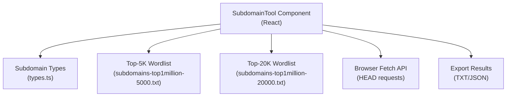
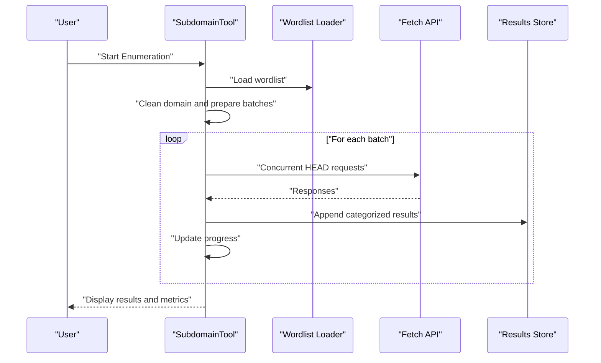
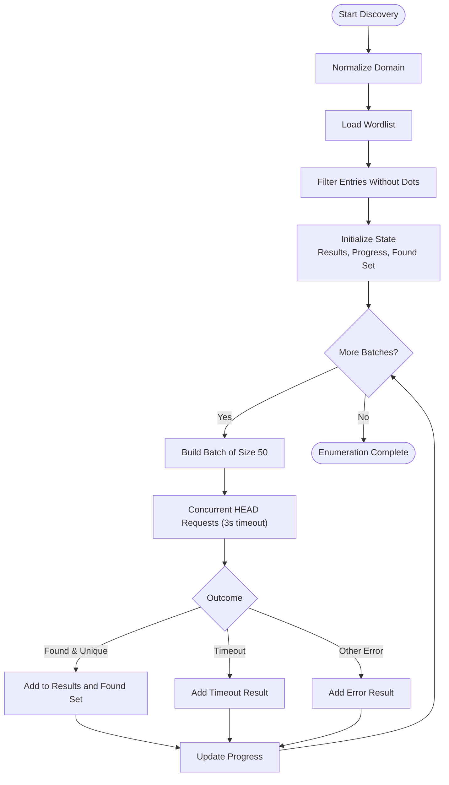
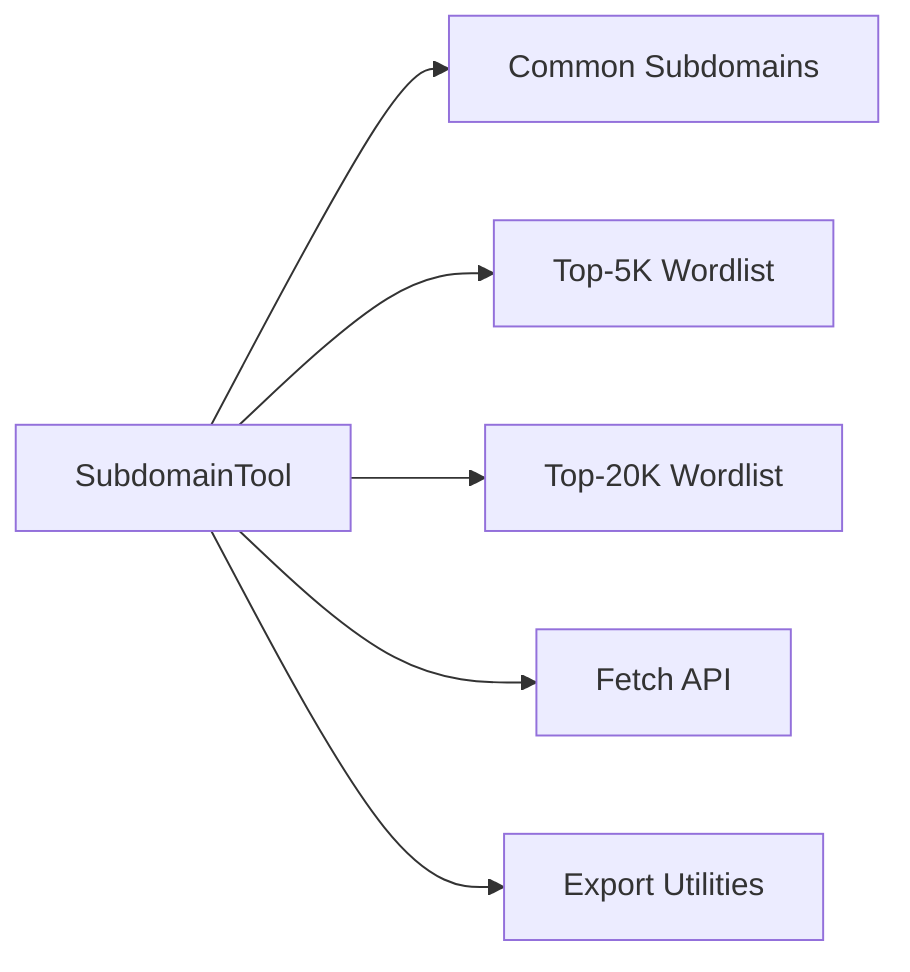

# Subdomain Enumerator

<cite>
**Referenced Files in This Document**
- [subdomain.tsx](file://src/pages/tools/components/subdomain.tsx)
- [types.ts](file://src/pages/tools/types.ts)
- [subdomains-top1million-5000.txt](file://src/pages/brute-force/payload/DNS/subdomains-top1million-5000.txt)
- [subdomains-top1million-20000.txt](file://src/pages/brute-force/payload/DNS/subdomains-top1million-20000.txt)
- [README.md](file://README.md)
</cite>

## Table of Contents
1. [Introduction](#introduction)
2. [Project Structure](#project-structure)
3. [Core Components](#core-components)
4. [Architecture Overview](#architecture-overview)
5. [Detailed Component Analysis](#detailed-component-analysis)
6. [Dependency Analysis](#dependency-analysis)
7. [Performance Considerations](#performance-considerations)
8. [Troubleshooting Guide](#troubleshooting-guide)
9. [Conclusion](#conclusion)
10. [Appendices](#appendices)

## Introduction
This document describes the Subdomain Enumerator tool within AppRecon. It focuses on DNS enumeration using wordlists to discover subdomains of a target domain. The tool integrates with large-scale wordlists (top 1 million and top 5000 subdomains lists) and provides concurrency control, timeout management, and result processing workflows. Practical applications include reconnaissance phases, attack surface mapping, and target identification. Guidance is included for performance optimization, result filtering, custom wordlist creation, interpretation of results, and follow-up investigation techniques.

## Project Structure
The Subdomain Enumerator is implemented as a React component with a dedicated types module. Wordlists are stored as static assets under the brute-force payload directory. The tool’s UI supports starting/stopping enumeration, progress tracking, result filtering, and exporting results.

**Diagram sources**
- [subdomain.tsx:41-313](file://src/pages/tools/components/subdomain.tsx#L41-L313)
- [types.ts:27-40](file://src/pages/tools/types.ts#L27-L40)
- [subdomains-top1million-5000.txt:1-800](file://src/pages/brute-force/payload/DNS/subdomains-top1million-5000.txt#L1-L800)
- [subdomains-top1million-20000.txt:1-800](file://src/pages/brute-force/payload/DNS/subdomains-top1million-20000.txt#L1-L800)

**Section sources**
- [subdomain.tsx:41-313](file://src/pages/tools/components/subdomain.tsx#L41-L313)
- [types.ts:27-40](file://src/pages/tools/types.ts#L27-L40)
- [subdomains-top1million-5000.txt:1-800](file://src/pages/brute-force/payload/DNS/subdomains-top1million-5000.txt#L1-L800)
- [subdomains-top1million-20000.txt:1-800](file://src/pages/brute-force/payload/DNS/subdomains-top1million-20000.txt#L1-L800)

## Core Components
- SubdomainTool: Implements the enumeration loop, concurrency batching, timeouts, and result aggregation. It builds candidate URLs from a wordlist and performs HEAD requests via the browser fetch API.
- SubdomainResult and SubdomainConfig types: Define the shape of results and configuration parameters (domain, wordlist, concurrency, timeout).
- Wordlists: Embedded static assets representing curated subdomain prefixes for enumeration.

Key behaviors:
- Cleans the target domain and strips protocol/www.
- Builds a wordlist from a built-in set of common subdomains and filters entries without dots.
- Uses a fixed concurrency and timeout for batched requests.
- Tracks found URLs to avoid duplicates and categorizes outcomes as found, timeout, or error.
- Exports only “found” results to TXT or JSON.

**Section sources**
- [subdomain.tsx:41-313](file://src/pages/tools/components/subdomain.tsx#L41-L313)
- [types.ts:27-40](file://src/pages/tools/types.ts#L27-L40)

## Architecture Overview
The Subdomain Enumerator runs entirely in the browser. It iterates through a wordlist in batches, dispatching concurrent HEAD requests. Responses are categorized and aggregated into a results table. Progress is tracked and displayed, and results can be exported.

**Diagram sources**
- [subdomain.tsx:50-139](file://src/pages/tools/components/subdomain.tsx#L50-L139)

## Detailed Component Analysis

### SubdomainTool Component
Responsibilities:
- Accepts a target domain input and normalizes it.
- Loads a wordlist (common subdomains) and filters entries.
- Executes concurrent enumeration with controlled batch sizes.
- Handles timeouts and errors distinctly.
- Prevents duplicate URLs from being added.
- Provides export functionality for discovered subdomains.

Concurrency and timeout:
- Fixed concurrency of 50 and timeout of 3000 ms per request.
- Batching ensures sequential progression across the wordlist while maintaining concurrency per batch.

Result processing:
- Categorizes outcomes as found, timeout, or error.
- Maintains counts for found and timeout results.
- Supports copying discovered URLs to clipboard and exporting to TXT/JSON.

**Diagram sources**
- [subdomain.tsx:50-139](file://src/pages/tools/components/subdomain.tsx#L50-L139)

**Section sources**
- [subdomain.tsx:41-313](file://src/pages/tools/components/subdomain.tsx#L41-L313)

### Data Model: SubdomainResult and SubdomainConfig
- SubdomainResult: Captures subdomain, full URL, status, optional status code, and response time.
- SubdomainConfig: Captures domain, wordlist array, concurrency, and timeout.

These types define the contract for results and configuration used by the SubdomainTool.

**Section sources**
- [types.ts:27-40](file://src/pages/tools/types.ts#L27-L40)

### Wordlist Integration
The tool embeds curated wordlists for enumeration:
- Top-5K list: A concise set of frequent subdomains.
- Top-20K list: A larger set of common subdomains.

Integration approach:
- Wordlists are loaded as static assets and can be consumed by the tool to expand the enumeration scope beyond the built-in common subdomains.

Practical usage:
- Replace or augment the built-in wordlist with the top-5K or top-20K lists for broader coverage.
- Combine multiple wordlists to increase recall.

**Section sources**
- [subdomains-top1million-5000.txt:1-800](file://src/pages/brute-force/payload/DNS/subdomains-top1million-5000.txt#L1-L800)
- [subdomains-top1million-20000.txt:1-800](file://src/pages/brute-force/payload/DNS/subdomains-top1million-20000.txt#L1-L800)

## Dependency Analysis
The SubdomainTool depends on:
- Built-in common subdomains list for baseline enumeration.
- Static wordlist files for extended coverage.
- Browser fetch API for HTTP HEAD requests.
- Export utilities for TXT/JSON outputs.

**Diagram sources**
- [subdomain.tsx:11-39](file://src/pages/tools/components/subdomain.tsx#L11-L39)
- [subdomain.tsx:56-66](file://src/pages/tools/components/subdomain.tsx#L56-L66)
- [subdomain.tsx:156-177](file://src/pages/tools/components/subdomain.tsx#L156-L177)

**Section sources**
- [subdomain.tsx:11-39](file://src/pages/tools/components/subdomain.tsx#L11-L39)
- [subdomain.tsx:56-66](file://src/pages/tools/components/subdomain.tsx#L56-L66)
- [subdomain.tsx:156-177](file://src/pages/tools/components/subdomain.tsx#L156-L177)

## Performance Considerations
- Concurrency tuning: The tool uses a fixed concurrency of 50. Adjusting this value can impact throughput and server-side rate limiting. Lower concurrency reduces load but increases total time; higher concurrency increases speed but risks timeouts or blocking.
- Timeout tuning: The fixed 3000 ms timeout balances responsiveness with reliability. Shorter timeouts increase timeout results; longer timeouts increase total runtime.
- Batch sizing: Batching by fixed concurrency ensures steady progress and avoids overwhelming the network stack.
- Duplicate prevention: Using a set of found URLs prevents redundant entries and keeps the result set accurate.
- Export optimization: Exporting only “found” results minimizes file size and improves downstream processing.

[No sources needed since this section provides general guidance]

## Troubleshooting Guide
Common issues and resolutions:
- No results found: Verify the target domain is correct and reachable. Some subdomains may be intentionally unresponsive or blocked.
- Many timeout results: Reduce concurrency or increase timeout to accommodate network latency or rate limiting.
- Duplicate URLs: The tool prevents duplicates; if unexpected duplicates appear, review the wordlist and normalization logic.
- Export failures: Ensure there are “found” results to export; otherwise, export will be disabled.

Operational controls:
- Start/Stop buttons allow initiating and halting enumeration.
- Clear button resets results and progress.
- Progress bar indicates current/total items processed.

**Section sources**
- [subdomain.tsx:203-248](file://src/pages/tools/components/subdomain.tsx#L203-L248)
- [subdomain.tsx:141-150](file://src/pages/tools/components/subdomain.tsx#L141-L150)

## Conclusion
The Subdomain Enumerator provides a straightforward, efficient mechanism for discovering subdomains using curated wordlists. Its fixed concurrency and timeout model offers predictable performance, while export capabilities streamline downstream analysis. By leveraging the embedded wordlists and adjusting concurrency/timeout, practitioners can tailor enumeration to specific environments and objectives.

[No sources needed since this section summarizes without analyzing specific files]

## Appendices

### Practical Applications
- Reconnaissance phases: Rapidly enumerate likely subdomains to build an initial asset inventory.
- Attack surface mapping: Identify exposed services behind discovered subdomains for further assessment.
- Target identification: Focus on high-value subdomains (e.g., admin, api, staging) for deeper testing.

[No sources needed since this section provides general guidance]

### Custom Wordlist Creation
- Start with the provided top-5K or top-20K lists and extend with internal intelligence or threat feeds.
- Maintain entries without dots to ensure proper concatenation with the target domain.
- Validate entries to avoid excessive noise (e.g., remove overly generic terms if they yield many timeouts).

[No sources needed since this section provides general guidance]

### Result Interpretation and Follow-Up
- Found: Indicates a responsive endpoint; investigate content, technologies, and security posture.
- Timeout: Suggests network issues or rate limiting; consider lowering concurrency or pausing briefly.
- Error: Often indicates non-responsive or blocked endpoints; record for later manual verification.
- Follow-up: Cross-reference with DNS records, certificate transparency logs, and web archives; perform service detection and vulnerability scanning on promising hosts.

[No sources needed since this section provides general guidance]