# Document Creation and Editing

<cite>
**Referenced Files in This Document**
- [src/pages/documents/index.tsx](file://src/pages/documents/index.tsx)
- [src/pages/documents/types.ts](file://src/pages/documents/types.ts)
- [src/pages/documents/constants.ts](file://src/pages/documents/constants.ts)
- [src/pages/documents/hooks/use-documents-page.ts](file://src/pages/documents/hooks/use-documents-page.ts)
- [src/pages/documents/stores/documents.ts](file://src/pages/documents/stores/documents.ts)
- [src/pages/documents/lib/editor-files.ts](file://src/pages/documents/lib/editor-files.ts)
- [src/pages/documents/lib/export-document.ts](file://src/pages/documents/lib/export-document.ts)
- [src/pages/documents/api.ts](file://src/pages/documents/api.ts)
- [src/pages/documents/components/document-markdown-editor.tsx](file://src/pages/documents/components/document-markdown-editor.tsx)
- [src/pages/documents/components/api-entry-editor.tsx](file://src/pages/documents/components/api-entry-editor.tsx)
- [src/pages/documents/components/custom-section-editor.tsx](file://src/pages/documents/components/custom-section-editor.tsx)
- [src/pages/documents/components/editor-tab-strip.tsx](file://src/pages/documents/components/editor-tab-strip.tsx)
- [src/pages/documents/components/documents-explorer.tsx](file://src/pages/documents/components/documents-explorer.tsx)
- [src/pages/documents/components/custom-section-dialog.tsx](file://src/pages/documents/components/custom-section-dialog.tsx)
</cite>

## Table of Contents
1. [Introduction](#introduction)
2. [Project Structure](#project-structure)
3. [Core Components](#core-components)
4. [Architecture Overview](#architecture-overview)
5. [Detailed Component Analysis](#detailed-component-analysis)
6. [Dependency Analysis](#dependency-analysis)
7. [Performance Considerations](#performance-considerations)
8. [Troubleshooting Guide](#troubleshooting-guide)
9. [Conclusion](#conclusion)
10. [Appendices](#appendices)

## Introduction
This document explains the Document Creation and Editing functionality in AppRecon. It covers the end-to-end authoring workflow, including the markdown editor, section management, and API entry organization. It also details the document lifecycle from creation to editing, title management, content sections, and custom section creation. The editor interface components—DocumentMarkdownEditor, ApiEntryEditor, and CustomSectionEditor—are explained alongside the tabbed editing system, file management operations, and real-time content synchronization. Practical examples illustrate document creation workflows, markdown formatting capabilities, and API documentation organization. Guidance is provided on document state management, content validation, and collaborative editing considerations, along with best practices for organizing reconnaissance findings and maintaining consistency across sections.

## Project Structure
The Document module is organized around a central page component that orchestrates state, UI, and persistence. Supporting files define types, constants, utilities, and editors for markdown, API entries, and custom sections. A dedicated store manages document state with persistence, while a small API layer bridges to Tauri backend commands for database operations.

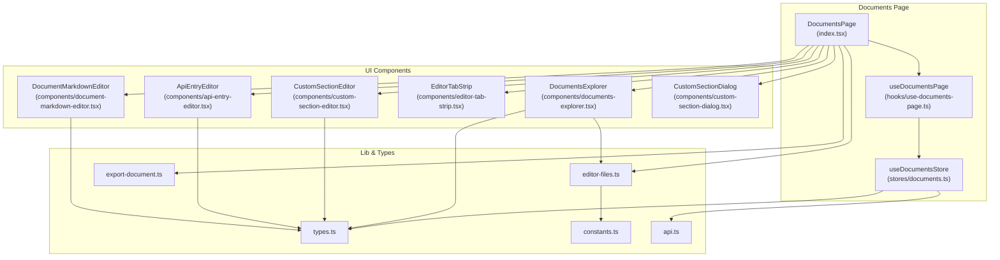

**Diagram sources**
- [src/pages/documents/index.tsx:44-332](file://src/pages/documents/index.tsx#L44-L332)
- [src/pages/documents/hooks/use-documents-page.ts:8-218](file://src/pages/documents/hooks/use-documents-page.ts#L8-L218)
- [src/pages/documents/stores/documents.ts:71-346](file://src/pages/documents/stores/documents.ts#L71-L346)
- [src/pages/documents/components/document-markdown-editor.tsx:1-34](file://src/pages/documents/components/document-markdown-editor.tsx#L1-L34)
- [src/pages/documents/components/api-entry-editor.tsx:1-114](file://src/pages/documents/components/api-entry-editor.tsx#L1-L114)
- [src/pages/documents/components/custom-section-editor.tsx:1-27](file://src/pages/documents/components/custom-section-editor.tsx#L1-L27)
- [src/pages/documents/components/editor-tab-strip.tsx:1-68](file://src/pages/documents/components/editor-tab-strip.tsx#L1-L68)
- [src/pages/documents/components/documents-explorer.tsx:1-284](file://src/pages/documents/components/documents-explorer.tsx#L1-L284)
- [src/pages/documents/components/custom-section-dialog.tsx:1-94](file://src/pages/documents/components/custom-section-dialog.tsx#L1-L94)
- [src/pages/documents/types.ts:1-61](file://src/pages/documents/types.ts#L1-L61)
- [src/pages/documents/constants.ts:1-64](file://src/pages/documents/constants.ts#L1-L64)
- [src/pages/documents/lib/editor-files.ts:1-63](file://src/pages/documents/lib/editor-files.ts#L1-L63)
- [src/pages/documents/lib/export-document.ts:1-252](file://src/pages/documents/lib/export-document.ts#L1-L252)
- [src/pages/documents/api.ts:1-36](file://src/pages/documents/api.ts#L1-L36)

**Section sources**
- [src/pages/documents/index.tsx:1-332](file://src/pages/documents/index.tsx#L1-L332)
- [src/pages/documents/types.ts:1-61](file://src/pages/documents/types.ts#L1-L61)
- [src/pages/documents/constants.ts:1-64](file://src/pages/documents/constants.ts#L1-L64)
- [src/pages/documents/lib/editor-files.ts:1-63](file://src/pages/documents/lib/editor-files.ts#L1-L63)
- [src/pages/documents/lib/export-document.ts:1-252](file://src/pages/documents/lib/export-document.ts#L1-L252)
- [src/pages/documents/api.ts:1-36](file://src/pages/documents/api.ts#L1-L36)

## Core Components
- DocumentsPage orchestrates the UI, tabs, explorer, editors, and actions (new, export, delete).
- useDocumentsPage encapsulates state transitions and API interactions for documents and API entries.
- useDocumentsStore manages document collections, active document, persistence, and CRUD operations.
- DocumentMarkdownEditor renders a markdown-capable text editor for built-in sections.
- ApiEntryEditor displays saved HTTP requests and responses in a split view.
- CustomSectionEditor renders a markdown editor for custom sections.
- EditorTabStrip lists open files and supports closing tabs.
- DocumentsExplorer lists built-in sections, custom sections, and saved API entries with context actions.
- CustomSectionDialog enables adding new custom sections with title, description, and placeholder.
- editor-files utilities resolve file IDs, labels, and filenames for display and persistence.
- export-document converts documents to PDF with section ordering and sanitization.
- api.ts provides Tauri-backed persistence functions for loading, saving, and deleting documents.

**Section sources**
- [src/pages/documents/index.tsx:44-332](file://src/pages/documents/index.tsx#L44-L332)
- [src/pages/documents/hooks/use-documents-page.ts:8-218](file://src/pages/documents/hooks/use-documents-page.ts#L8-L218)
- [src/pages/documents/stores/documents.ts:71-346](file://src/pages/documents/stores/documents.ts#L71-L346)
- [src/pages/documents/components/document-markdown-editor.tsx:1-34](file://src/pages/documents/components/document-markdown-editor.tsx#L1-L34)
- [src/pages/documents/components/api-entry-editor.tsx:1-114](file://src/pages/documents/components/api-entry-editor.tsx#L1-L114)
- [src/pages/documents/components/custom-section-editor.tsx:1-27](file://src/pages/documents/components/custom-section-editor.tsx#L1-L27)
- [src/pages/documents/components/editor-tab-strip.tsx:1-68](file://src/pages/documents/components/editor-tab-strip.tsx#L1-L68)
- [src/pages/documents/components/documents-explorer.tsx:1-284](file://src/pages/documents/components/documents-explorer.tsx#L1-L284)
- [src/pages/documents/components/custom-section-dialog.tsx:1-94](file://src/pages/documents/components/custom-section-dialog.tsx#L1-L94)
- [src/pages/documents/lib/editor-files.ts:1-63](file://src/pages/documents/lib/editor-files.ts#L1-L63)
- [src/pages/documents/lib/export-document.ts:1-252](file://src/pages/documents/lib/export-document.ts#L1-L252)
- [src/pages/documents/api.ts:1-36](file://src/pages/documents/api.ts#L1-L36)

## Architecture Overview
The Documents feature follows a unidirectional data flow:
- UI components trigger actions via hooks.
- useDocumentsPage updates the active document via useDocumentsStore.
- The store persists changes to the backend via Tauri commands.
- Editors render content based on the active document and selected file ID.
- The explorer and tab strip reflect current state and enable navigation.

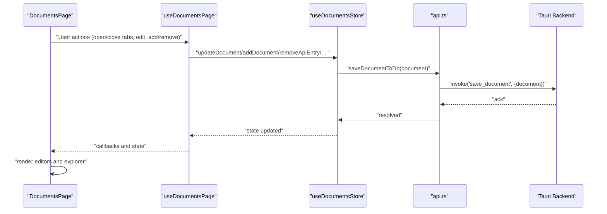

**Diagram sources**
- [src/pages/documents/index.tsx:44-332](file://src/pages/documents/index.tsx#L44-L332)
- [src/pages/documents/hooks/use-documents-page.ts:47-218](file://src/pages/documents/hooks/use-documents-page.ts#L47-L218)
- [src/pages/documents/stores/documents.ts:111-317](file://src/pages/documents/stores/documents.ts#L111-L317)
- [src/pages/documents/api.ts:22-27](file://src/pages/documents/api.ts#L22-L27)

## Detailed Component Analysis

### DocumentsPage: Orchestrating the Authoring Workflow
DocumentsPage is the central orchestrator. It:
- Manages tabs, active document, and document lifecycle (create, rename, delete).
- Controls open files and active file selection.
- Renders the explorer, tab strip, and appropriate editor based on the active file.
- Provides export to PDF and handles API entry fetching and display.

Key responsibilities:
- Title editing via an input bound to updateTitle.
- File opening/closing with openFile/closeFile.
- API entry selection and fetching via selectApiEntry and fetchSelectedApi.
- Custom section creation via CustomSectionDialog and addCustomSection.
- PDF export via exportDocumentToPdf.

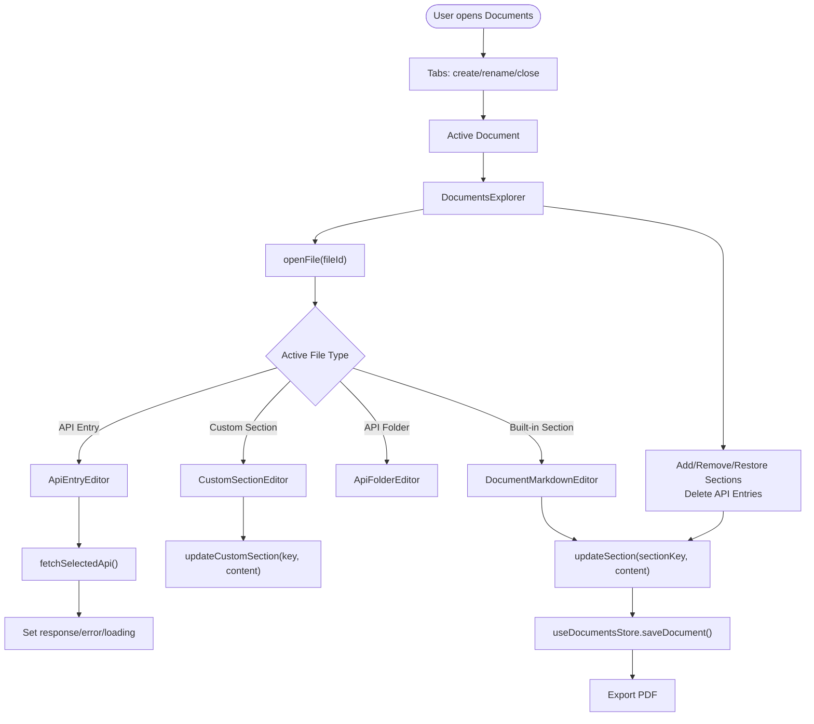

**Diagram sources**
- [src/pages/documents/index.tsx:44-332](file://src/pages/documents/index.tsx#L44-L332)
- [src/pages/documents/hooks/use-documents-page.ts:58-184](file://src/pages/documents/hooks/use-documents-page.ts#L58-L184)
- [src/pages/documents/stores/documents.ts:111-317](file://src/pages/documents/stores/documents.ts#L111-L317)

**Section sources**
- [src/pages/documents/index.tsx:44-332](file://src/pages/documents/index.tsx#L44-L332)

### DocumentMarkdownEditor: Markdown Authoring for Built-in Sections
DocumentMarkdownEditor wraps a text editor configured for markdown editing:
- Uses a unique path derived from document ID and section key.
- Applies editor options for font, line height, wrapping, minimap, and padding.
- Calls onChange with the section key and updated content.

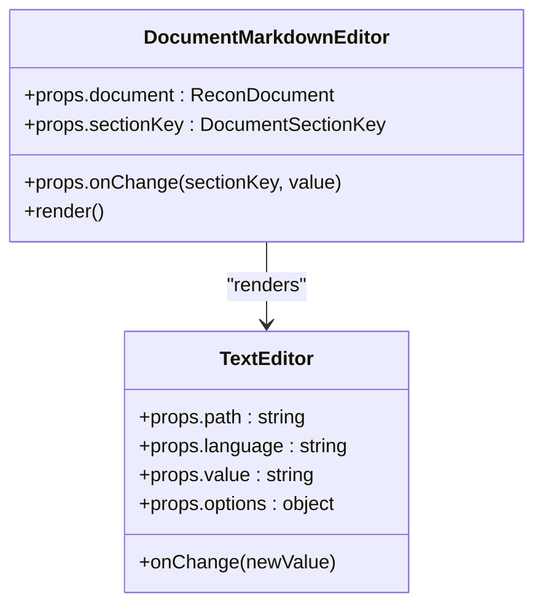

**Diagram sources**
- [src/pages/documents/components/document-markdown-editor.tsx:1-34](file://src/pages/documents/components/document-markdown-editor.tsx#L1-L34)

**Section sources**
- [src/pages/documents/components/document-markdown-editor.tsx:1-34](file://src/pages/documents/components/document-markdown-editor.tsx#L1-L34)

### ApiEntryEditor: Viewing and Fetching Saved Requests
ApiEntryEditor presents a vertical split:
- Top pane shows the raw request (read-only).
- Bottom pane shows the response (read-only), error, or a prompt to fetch.

Behavior:
- Builds raw HTTP request and response content using helper utilities.
- Supports fetching via sendRepeaterRequest and displays loading/error states.
- Uses distinct file paths for request, response, and error content.

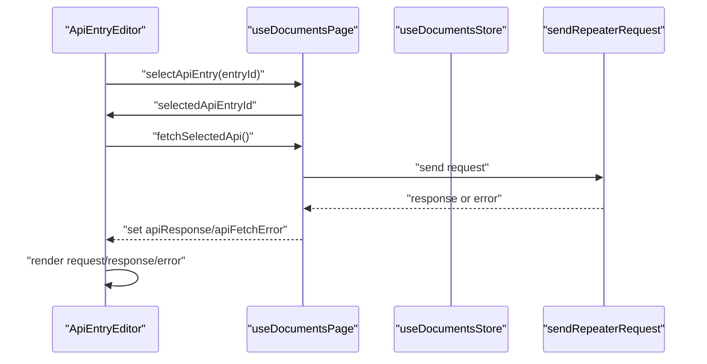

**Diagram sources**
- [src/pages/documents/components/api-entry-editor.tsx:35-114](file://src/pages/documents/components/api-entry-editor.tsx#L35-L114)
- [src/pages/documents/hooks/use-documents-page.ts:152-184](file://src/pages/documents/hooks/use-documents-page.ts#L152-L184)

**Section sources**
- [src/pages/documents/components/api-entry-editor.tsx:1-114](file://src/pages/documents/components/api-entry-editor.tsx#L1-L114)
- [src/pages/documents/hooks/use-documents-page.ts:152-184](file://src/pages/documents/hooks/use-documents-page.ts#L152-L184)

### CustomSectionEditor: Markdown Authoring for Custom Sections
CustomSectionEditor renders a markdown editor for a single custom section:
- Uses a path derived from the custom section key.
- Calls onChange with the updated content.

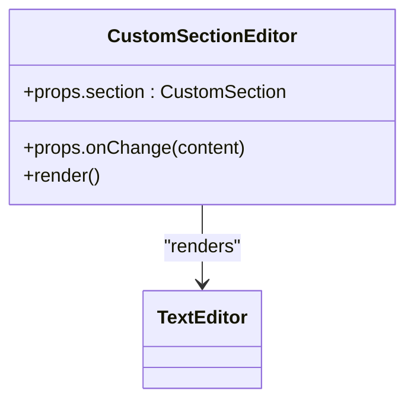

**Diagram sources**
- [src/pages/documents/components/custom-section-editor.tsx:1-27](file://src/pages/documents/components/custom-section-editor.tsx#L1-L27)

**Section sources**
- [src/pages/documents/components/custom-section-editor.tsx:1-27](file://src/pages/documents/components/custom-section-editor.tsx#L1-L27)

### EditorTabStrip: Tabbed Editing System
EditorTabStrip displays open files as tabs:
- Shows icon and truncated filename per tab.
- Supports closing tabs via onCloseFile.
- Highlights the active tab.

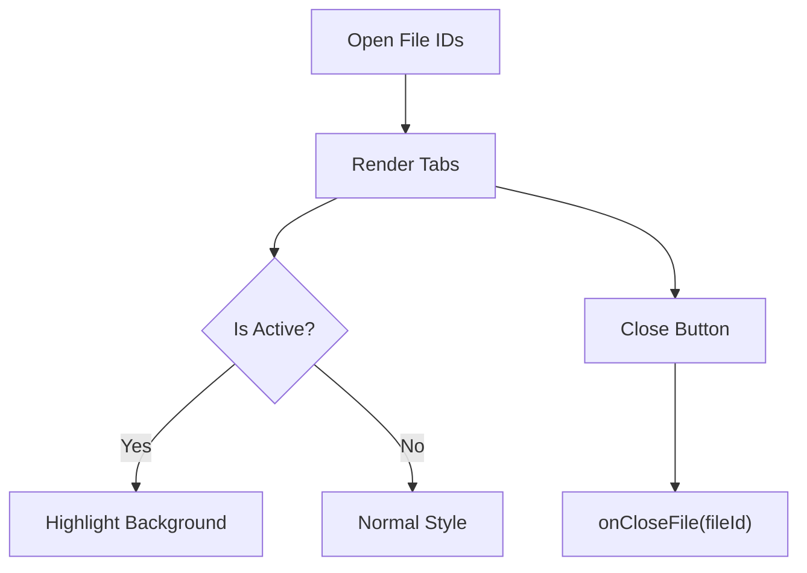

**Diagram sources**
- [src/pages/documents/components/editor-tab-strip.tsx:14-68](file://src/pages/documents/components/editor-tab-strip.tsx#L14-L68)

**Section sources**
- [src/pages/documents/components/editor-tab-strip.tsx:1-68](file://src/pages/documents/components/editor-tab-strip.tsx#L1-L68)

### DocumentsExplorer: Section and API Entry Navigation
DocumentsExplorer organizes content:
- Lists built-in sections (with remove/restore actions).
- Lists custom sections (with delete action).
- Provides add section button.
- Collapsible API folder with saved entries (copy curl/url, open in brute force/repeater, delete).

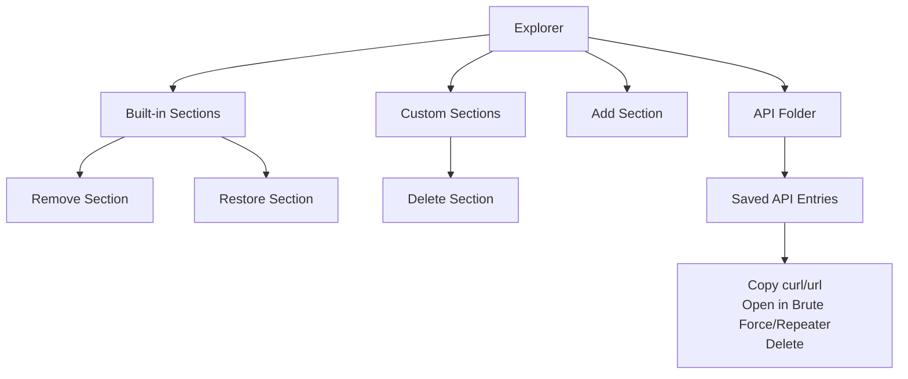

**Diagram sources**
- [src/pages/documents/components/documents-explorer.tsx:40-284](file://src/pages/documents/components/documents-explorer.tsx#L40-L284)

**Section sources**
- [src/pages/documents/components/documents-explorer.tsx:1-284](file://src/pages/documents/components/documents-explorer.tsx#L1-L284)

### CustomSectionDialog: Creating Custom Sections
CustomSectionDialog collects:
- Title (required)
- Description
- Placeholder

On submit, it invokes onAdd with validated inputs and resets the form.

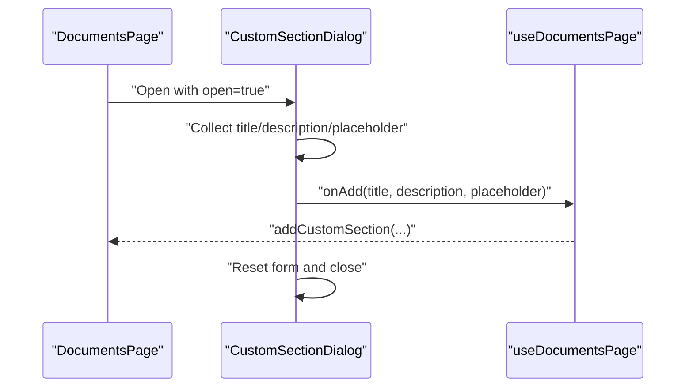

**Diagram sources**
- [src/pages/documents/components/custom-section-dialog.tsx:21-94](file://src/pages/documents/components/custom-section-dialog.tsx#L21-L94)
- [src/pages/documents/hooks/use-documents-page.ts:94-104](file://src/pages/documents/hooks/use-documents-page.ts#L94-L104)

**Section sources**
- [src/pages/documents/components/custom-section-dialog.tsx:1-94](file://src/pages/documents/components/custom-section-dialog.tsx#L1-L94)
- [src/pages/documents/hooks/use-documents-page.ts:94-104](file://src/pages/documents/hooks/use-documents-page.ts#L94-L104)

### Section Management System
Built-in sections are defined centrally and rendered as markdown files. Custom sections are user-defined with title, description, placeholder, and content. The explorer allows removing/restoring built-in sections and deleting custom sections.

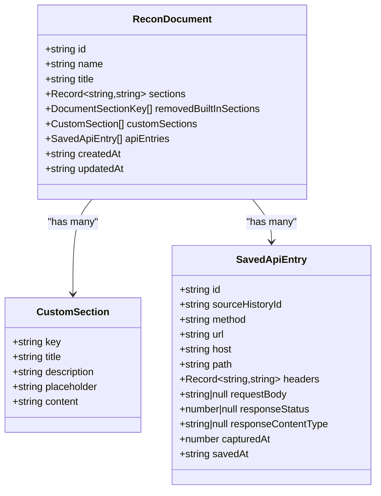

**Diagram sources**
- [src/pages/documents/types.ts:13-38](file://src/pages/documents/types.ts#L13-L38)

**Section sources**
- [src/pages/documents/types.ts:1-61](file://src/pages/documents/types.ts#L1-L61)
- [src/pages/documents/constants.ts:1-64](file://src/pages/documents/constants.ts#L1-L64)
- [src/pages/documents/lib/editor-files.ts:16-22](file://src/pages/documents/lib/editor-files.ts#L16-L22)

### File Management Operations
- File identification and labeling:
  - isDocumentSectionFile, isCustomSectionFile
  - getSectionDefinition, getCustomSectionDefinition
  - getFileLabel, getFileName
- Path construction:
  - Built-in sections: {documentId}/{sectionKey}.md
  - Custom sections: custom/{key}.md
  - API entries: {documentId}/api/{entryId}.http and response variants

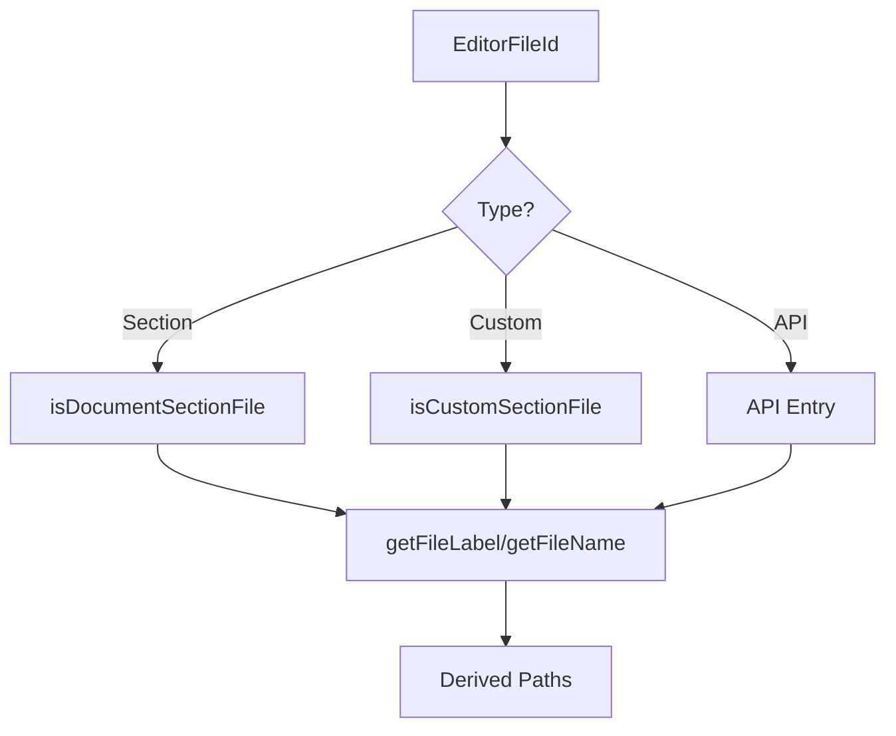

**Diagram sources**
- [src/pages/documents/lib/editor-files.ts:8-63](file://src/pages/documents/lib/editor-files.ts#L8-L63)

**Section sources**
- [src/pages/documents/lib/editor-files.ts:1-63](file://src/pages/documents/lib/editor-files.ts#L1-L63)

### Real-time Content Synchronization
- useDocumentsPage updates the active document immutably and triggers persistence.
- useDocumentsStore.updateDocument applies the updater and saves to DB.
- Changes propagate immediately to editors and explorer.

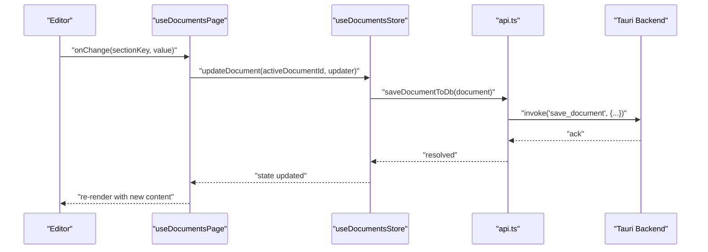

**Diagram sources**
- [src/pages/documents/hooks/use-documents-page.ts:47-92](file://src/pages/documents/hooks/use-documents-page.ts#L47-L92)
- [src/pages/documents/stores/documents.ts:111-128](file://src/pages/documents/stores/documents.ts#L111-L128)
- [src/pages/documents/api.ts:22-27](file://src/pages/documents/api.ts#L22-L27)

**Section sources**
- [src/pages/documents/hooks/use-documents-page.ts:47-92](file://src/pages/documents/hooks/use-documents-page.ts#L47-L92)
- [src/pages/documents/stores/documents.ts:111-128](file://src/pages/documents/stores/documents.ts#L111-L128)

### Export to PDF
exportDocumentToPdf generates a structured PDF:
- Title, created/updated dates
- Built-in sections in order (excluding removed ones)
- Custom sections
- API endpoints with method, URL, headers, and body
- Sanitized filename and Tauri file picker

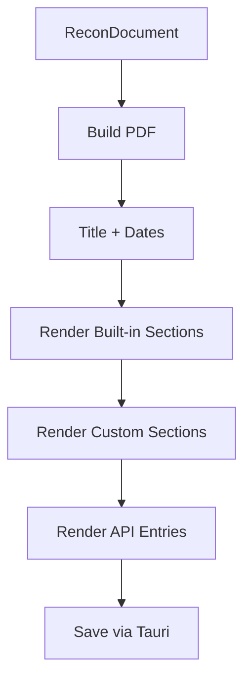

**Diagram sources**
- [src/pages/documents/lib/export-document.ts:47-252](file://src/pages/documents/lib/export-document.ts#L47-L252)

**Section sources**
- [src/pages/documents/lib/export-document.ts:1-252](file://src/pages/documents/lib/export-document.ts#L1-L252)

## Dependency Analysis
- DocumentsPage depends on:
  - useDocumentsPage for actions and state
  - DocumentsExplorer and EditorTabStrip for navigation
  - Editor components for rendering content
  - export-document for PDF export
- useDocumentsPage depends on:
  - useDocumentsStore for document state
  - sendRepeaterRequest for API fetching
- useDocumentsStore depends on:
  - api.ts for persistence
  - types.ts and constants.ts for shape and defaults
- editor-files.ts depends on constants.ts and types.ts
- export-document.ts depends on constants.ts and types.ts

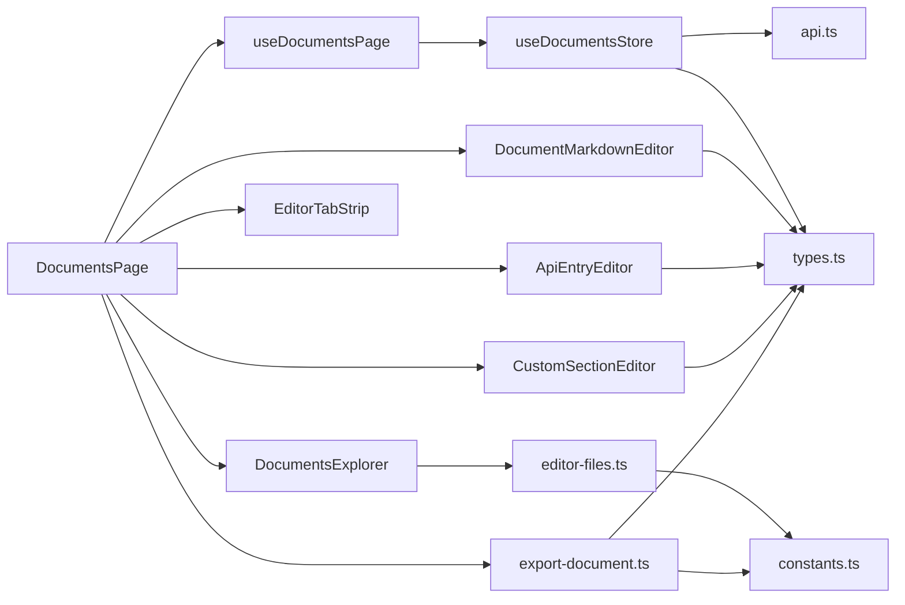

**Diagram sources**
- [src/pages/documents/index.tsx:44-332](file://src/pages/documents/index.tsx#L44-L332)
- [src/pages/documents/hooks/use-documents-page.ts:8-218](file://src/pages/documents/hooks/use-documents-page.ts#L8-L218)
- [src/pages/documents/stores/documents.ts:71-346](file://src/pages/documents/stores/documents.ts#L71-L346)
- [src/pages/documents/lib/editor-files.ts:1-63](file://src/pages/documents/lib/editor-files.ts#L1-L63)
- [src/pages/documents/lib/export-document.ts:1-252](file://src/pages/documents/lib/export-document.ts#L1-L252)
- [src/pages/documents/api.ts:1-36](file://src/pages/documents/api.ts#L1-L36)
- [src/pages/documents/types.ts:1-61](file://src/pages/documents/types.ts#L1-L61)
- [src/pages/documents/constants.ts:1-64](file://src/pages/documents/constants.ts#L1-L64)

**Section sources**
- [src/pages/documents/index.tsx:44-332](file://src/pages/documents/index.tsx#L44-L332)
- [src/pages/documents/hooks/use-documents-page.ts:8-218](file://src/pages/documents/hooks/use-documents-page.ts#L8-L218)
- [src/pages/documents/stores/documents.ts:71-346](file://src/pages/documents/stores/documents.ts#L71-L346)
- [src/pages/documents/lib/editor-files.ts:1-63](file://src/pages/documents/lib/editor-files.ts#L1-L63)
- [src/pages/documents/lib/export-document.ts:1-252](file://src/pages/documents/lib/export-document.ts#L1-L252)
- [src/pages/documents/api.ts:1-36](file://src/pages/documents/api.ts#L1-L36)
- [src/pages/documents/types.ts:1-61](file://src/pages/documents/types.ts#L1-L61)
- [src/pages/documents/constants.ts:1-64](file://src/pages/documents/constants.ts#L1-L64)

## Performance Considerations
- Minimize re-renders by using React.memo patterns and stable callbacks from hooks.
- Persist only on meaningful updates (title change, section content, custom section content).
- Debounce heavy operations like export to avoid blocking the UI.
- Keep editor options optimized (minimap enabled, word wrap on) to balance readability and performance.
- Avoid unnecessary deep copies; use immutable updates as shown in the store.

## Troubleshooting Guide
Common issues and resolutions:
- Document not saving:
  - Verify Tauri availability and backend commands are reachable.
  - Check console errors during saveDocumentToDb invocations.
- API entry not fetching:
  - Confirm selectedApiEntryId is valid and present in activeDocument.apiEntries.
  - Inspect apiFetchError for details and ensure network access.
- Custom section not appearing:
  - Ensure addCustomSection is invoked with non-empty title.
  - Verify the custom section appears in activeDocument.customSections after store update.
- PDF export fails:
  - Confirm sanitizeFilename produces a valid path.
  - Ensure the Tauri dialog returns a writable path.

**Section sources**
- [src/pages/documents/api.ts:10-36](file://src/pages/documents/api.ts#L10-L36)
- [src/pages/documents/hooks/use-documents-page.ts:152-184](file://src/pages/documents/hooks/use-documents-page.ts#L152-L184)
- [src/pages/documents/stores/documents.ts:59-69](file://src/pages/documents/stores/documents.ts#L59-L69)
- [src/pages/documents/lib/export-document.ts:236-252](file://src/pages/documents/lib/export-document.ts#L236-L252)

## Conclusion
AppRecon’s Document Creation and Editing feature provides a robust, extensible authoring environment. Built-in sections offer standardized structure, while custom sections allow flexible documentation. The tabbed interface, explorer navigation, and markdown editors streamline content creation. Persistence via Tauri ensures reliability, and export to PDF facilitates sharing. Following the outlined workflows and best practices helps maintain consistency and collaboration across teams.

## Appendices

### Practical Examples

- Creating a new document:
  - Click New Document to create and focus the Scope section.
  - Edit the title in the top input; updates are persisted automatically.
- Adding a custom section:
  - Open the explorer, click Add Section, fill the dialog, and confirm.
  - The new section appears in the explorer and can be edited in the editor.
- Editing built-in sections:
  - Select a built-in section in the explorer to open its markdown editor.
  - Use markdown formatting; content is saved on change.
- Managing API entries:
  - Save requests from Repeater; they appear under the API folder.
  - Select an entry to view raw request/response; click Fetch to refresh.
- Exporting to PDF:
  - Use the Export PDF button; choose a destination; the document is written via Tauri.

### Best Practices for Organization and Consistency
- Use built-in sections to maintain a consistent structure across documents.
- Keep titles concise and descriptive; leverage placeholders to guide contributors.
- Use markdown headings and lists for scannability.
- Group related API endpoints and link to evidence sections.
- Regularly export PDFs for stakeholder reviews and archival.