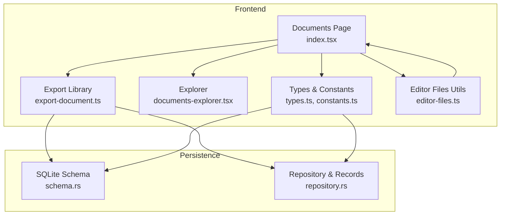
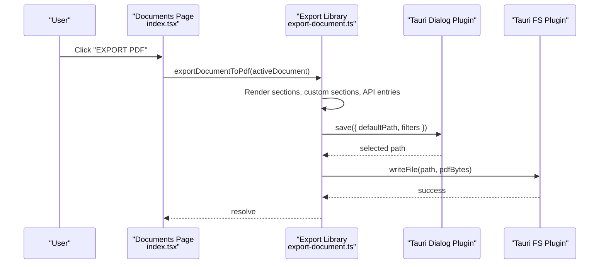
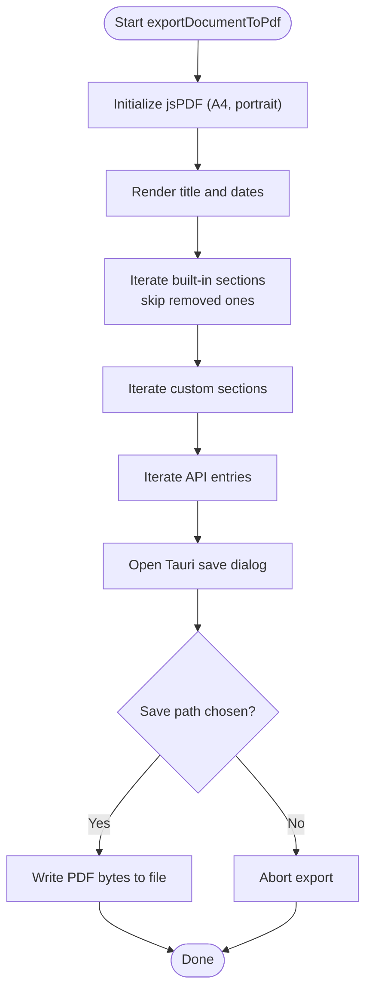
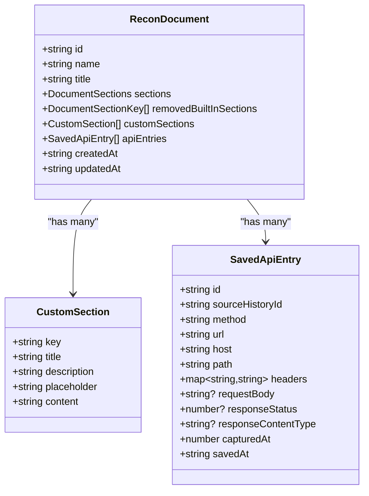
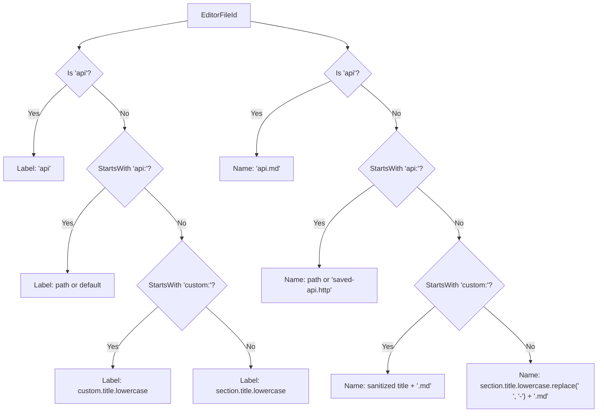
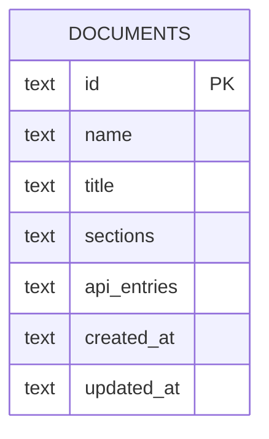
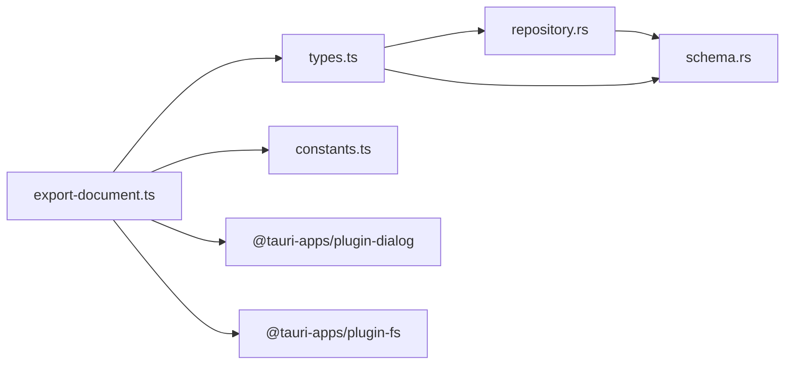

# Document Export and Import

<cite>
**Referenced Files in This Document**
- [export-document.ts](file://src/pages/documents/lib/export-document.ts)
- [documents/index.tsx](file://src/pages/documents/index.tsx)
- [documents-explorer.tsx](file://src/pages/documents/components/documents-explorer.tsx)
- [constants.ts](file://src/pages/documents/constants.ts)
- [types.ts](file://src/pages/documents/types.ts)
- [editor-files.ts](file://src/pages/documents/lib/editor-files.ts)
- [schema.rs](file://src-tauri/src/db/schema.rs)
- [repository.rs](file://src-tauri/src/db/repository.rs)
</cite>

## Table of Contents
1. [Introduction](#introduction)
2. [Project Structure](#project-structure)
3. [Core Components](#core-components)
4. [Architecture Overview](#architecture-overview)
5. [Detailed Component Analysis](#detailed-component-analysis)
6. [Dependency Analysis](#dependency-analysis)
7. [Performance Considerations](#performance-considerations)
8. [Troubleshooting Guide](#troubleshooting-guide)
9. [Conclusion](#conclusion)
10. [Appendices](#appendices)

## Introduction
This document describes the Document Export and Import functionality in AppRecon. It focuses on the current export capabilities (PDF generation), the underlying document model and file naming system, and outlines the existing database schema that supports persistence and potential future import/export features. It also provides guidance on extending the system to support additional formats (HAR, CSV, SQLite) and integrating with external documentation systems.

## Project Structure
The export functionality centers around the Documents page and a dedicated export library. The document model and file naming logic are defined in constants, types, and helper modules. Persistence is handled by a Tauri-backed SQLite database with a dedicated documents table.

**Diagram sources**
- [documents/index.tsx:44-333](file://src/pages/documents/index.tsx#L44-L333)
- [export-document.ts:1-253](file://src/pages/documents/lib/export-document.ts#L1-L253)
- [documents-explorer.tsx:1-285](file://src/pages/documents/components/documents-explorer.tsx#L1-L285)
- [constants.ts:1-65](file://src/pages/documents/constants.ts#L1-L65)
- [types.ts:1-62](file://src/pages/documents/types.ts#L1-L62)
- [editor-files.ts:1-64](file://src/pages/documents/lib/editor-files.ts#L1-L64)
- [schema.rs:58-70](file://src-tauri/src/db/schema.rs#L58-L70)
- [repository.rs:16-26](file://src-tauri/src/db/repository.rs#L16-L26)

**Section sources**
- [documents/index.tsx:44-333](file://src/pages/documents/index.tsx#L44-L333)
- [export-document.ts:1-253](file://src/pages/documents/lib/export-document.ts#L1-L253)
- [documents-explorer.tsx:1-285](file://src/pages/documents/components/documents-explorer.tsx#L1-L285)
- [constants.ts:1-65](file://src/pages/documents/constants.ts#L1-L65)
- [types.ts:1-62](file://src/pages/documents/types.ts#L1-L62)
- [editor-files.ts:1-64](file://src/pages/documents/lib/editor-files.ts#L1-L64)
- [schema.rs:58-70](file://src-tauri/src/db/schema.rs#L58-L70)
- [repository.rs:16-26](file://src-tauri/src/db/repository.rs#L16-L26)

## Core Components
- Export pipeline: Generates a PDF from the active document, including built-in sections, custom sections, and API entries. Uses a Tauri dialog to select the save location and writes the file via the filesystem plugin.
- Document model: Defines the shape of a ReconDocument, including sections, removed built-in sections, custom sections, and API entries.
- File naming and explorer: Provides helpers to derive file names and labels for editor tabs and the Documents Explorer, and defines the built-in section keys.
- Persistence schema: Declares a documents table with JSON fields for sections and API entries, enabling structured storage.

**Section sources**
- [export-document.ts:47-253](file://src/pages/documents/lib/export-document.ts#L47-L253)
- [types.ts:13-38](file://src/pages/documents/types.ts#L13-L38)
- [constants.ts:1-65](file://src/pages/documents/constants.ts#L1-L65)
- [editor-files.ts:24-63](file://src/pages/documents/lib/editor-files.ts#L24-L63)
- [schema.rs:58-70](file://src-tauri/src/db/schema.rs#L58-L70)

## Architecture Overview
The export flow is initiated from the Documents page UI, which delegates to the export library. The export library renders document content to a PDF and writes it to disk via Tauri plugins. The document model and section definitions drive what content appears in the PDF. The database schema supports storing documents with JSON-serialized fields for sections and API entries.

**Diagram sources**
- [documents/index.tsx:117-127](file://src/pages/documents/index.tsx#L117-L127)
- [export-document.ts:236-252](file://src/pages/documents/lib/export-document.ts#L236-L252)

## Detailed Component Analysis

### Export Pipeline: PDF Generation
- Input: Active ReconDocument.
- Rendering:
  - Built-in sections: Iterates over defined sections, skipping removed ones, and renders Markdown-like content as plain text.
  - Custom sections: Renders each custom section similarly.
  - API entries: Renders method, URL/path, headers, and request body with appropriate spacing and page breaks.
- Formatting:
  - Uses jsPDF to create a portrait A4 document with margins and page breaks when content exceeds page height.
  - Applies font sizes and weights for titles and subtitles.
- Output:
  - Prompts the user to choose a save location with a PDF filter.
  - Writes the generated PDF bytes to the chosen path.

**Diagram sources**
- [export-document.ts:47-253](file://src/pages/documents/lib/export-document.ts#L47-L253)

**Section sources**
- [export-document.ts:47-253](file://src/pages/documents/lib/export-document.ts#L47-L253)

### Document Model and Section Definitions
- ReconDocument includes identifiers, metadata, sections, removed built-in sections, custom sections, and API entries.
- Built-in sections are defined centrally with keys, titles, descriptions, and placeholders.
- Helper functions normalize documents and create empty sections for consistent rendering.

**Diagram sources**
- [types.ts:13-38](file://src/pages/documents/types.ts#L13-L38)

**Section sources**
- [types.ts:13-38](file://src/pages/documents/types.ts#L13-L38)
- [constants.ts:1-65](file://src/pages/documents/constants.ts#L1-L65)

### File Naming Conventions and Explorer Integration
- File naming:
  - Built-in sections: Lowercase title with spaces replaced by hyphens and suffixed with .md.
  - Custom sections: Derived from the custom section title; sanitized and suffixed with .md.
  - API entries: Either a path-based name or a default filename for saved API entries.
- Explorer:
  - Lists built-in sections, restored sections, custom sections, and API entries.
  - Supports context menu actions for removing/restoring built-in sections and deleting custom sections.

**Diagram sources**
- [editor-files.ts:24-63](file://src/pages/documents/lib/editor-files.ts#L24-L63)

**Section sources**
- [editor-files.ts:24-63](file://src/pages/documents/lib/editor-files.ts#L24-L63)
- [documents-explorer.tsx:116-279](file://src/pages/documents/components/documents-explorer.tsx#L116-L279)

### Database Schema for Documents
- The documents table stores:
  - id, name, title
  - sections (JSON)
  - api_entries (JSON)
  - created_at, updated_at
- Indexes optimize updates.

**Diagram sources**
- [schema.rs:58-70](file://src-tauri/src/db/schema.rs#L58-L70)

**Section sources**
- [schema.rs:58-70](file://src-tauri/src/db/schema.rs#L58-L70)
- [repository.rs:16-26](file://src-tauri/src/db/repository.rs#L16-L26)

## Dependency Analysis
- Frontend export depends on:
  - jsPDF for PDF generation
  - Tauri dialog and filesystem plugins for saving
  - Document model and section definitions for content rendering
- Persistence depends on:
  - SQLite schema for documents table
  - Repository layer for record mapping and JSON deserialization

**Diagram sources**
- [export-document.ts:1-5](file://src/pages/documents/lib/export-document.ts#L1-L5)
- [types.ts:1-2](file://src/pages/documents/types.ts#L1-L2)
- [schema.rs:58-70](file://src-tauri/src/db/schema.rs#L58-L70)
- [repository.rs:16-26](file://src-tauri/src/db/repository.rs#L16-L26)

**Section sources**
- [export-document.ts:1-5](file://src/pages/documents/lib/export-document.ts#L1-L5)
- [types.ts:1-2](file://src/pages/documents/types.ts#L1-L2)
- [schema.rs:58-70](file://src-tauri/src/db/schema.rs#L58-L70)
- [repository.rs:16-26](file://src-tauri/src/db/repository.rs#L16-L26)

## Performance Considerations
- Large documents:
  - The PDF renderer adds pages when content nears the bottom of the page. For very large documents, rendering time increases proportionally with content length. Consider batching or lazy rendering of sections if needed.
- File I/O:
  - Writing the PDF uses a single write operation after rendering. Ensure sufficient free disk space and avoid writing to slow or restricted locations.
- Memory usage:
  - Rendering Markdown to text and splitting text to fit page width can allocate temporary strings. Very long sections may increase memory pressure.

[No sources needed since this section provides general guidance]

## Troubleshooting Guide
- Export fails silently:
  - The export function logs errors to the console and disables the export button while exporting. Check the browser console for exceptions.
- Save dialog canceled:
  - If the user cancels the save dialog, the function returns early without errors.
- Unexpected content in PDF:
  - Verify that sections are not unexpectedly removed and that custom sections have content. Confirm that API entries are present if expected.
- Import scenarios:
  - There is no explicit import mechanism in the current codebase. See the Import section below for guidance on building importers.

**Section sources**
- [documents/index.tsx:117-127](file://src/pages/documents/index.tsx#L117-L127)
- [export-document.ts:247-249](file://src/pages/documents/lib/export-document.ts#L247-L249)

## Conclusion
AppRecon currently supports exporting documents as PDFs with a clean pipeline that renders built-in sections, custom sections, and API entries. The document model and file naming logic are centralized, and the database schema supports storing documents with JSON fields for sections and API entries. Future enhancements can add HAR, CSV, and SQLite export/import capabilities, leveraging the existing schema and UI patterns.

[No sources needed since this section summarizes without analyzing specific files]

## Appendices

### Practical Export Workflows
- Report generation:
  - Edit built-in and custom sections, review API entries, then export as PDF for distribution.
- Evidence preservation:
  - Ensure API entries and screenshots are captured; export as PDF to preserve a static snapshot.
- Data sharing:
  - Share the exported PDF with stakeholders. For deeper integration, consider adding CSV/HAR exports.

[No sources needed since this section provides general guidance]

### Import Guidance and Validation
- Current state:
  - No explicit import mechanism exists in the codebase.
- Recommended approach:
  - Define import handlers that parse external formats (e.g., CSV rows, HAR entries) into the ReconDocument structure.
  - Validate:
    - Required fields (method, URL, headers, body)
    - Section keys against the built-in definitions
    - Timestamps and IDs
  - Conflict resolution:
    - Preserve existing document IDs or generate new ones
    - Merge custom sections by key or prompt the user
    - Deduplicate API entries by URL/method/body signature
  - Integrity verification:
    - Ensure JSON serialization of sections and API entries succeeds
    - Persist via the repository and refresh the UI state

[No sources needed since this section provides general guidance]

### Extending to Additional Formats
- CSV export:
  - Export sections and API entries as delimited rows. Consider separate sheets for sections and API entries.
- HAR export:
  - Convert API entries to HAR format entries with request/response pairs.
- SQLite export:
  - Serialize the documents table and related data to a .sqlite file for system migration.

[No sources needed since this section provides general guidance]