# Document Management

<cite>
**Referenced Files in This Document**
- [src/pages/documents/index.tsx](file://src/pages/documents/index.tsx)
- [src/pages/documents/hooks/use-documents-page.ts](file://src/pages/documents/hooks/use-documents-page.ts)
- [src/pages/documents/stores/documents.ts](file://src/pages/documents/stores/documents.ts)
- [src/pages/documents/types.ts](file://src/pages/documents/types.ts)
- [src/pages/documents/constants.ts](file://src/pages/documents/constants.ts)
- [src/pages/documents/lib/editor-files.ts](file://src/pages/documents/lib/editor-files.ts)
- [src/pages/documents/lib/export-document.ts](file://src/pages/documents/lib/export-document.ts)
- [src/pages/documents/api.ts](file://src/pages/documents/api.ts)
- [src/pages/documents/components/document-markdown-editor.tsx](file://src/pages/documents/components/document-markdown-editor.tsx)
- [src/pages/documents/components/custom-section-editor.tsx](file://src/pages/documents/components/custom-section-editor.tsx)
- [src/pages/documents/components/api-entry-editor.tsx](file://src/pages/documents/components/api-entry-editor.tsx)
- [src/pages/documents/components/api-folder-editor.tsx](file://src/pages/documents/components/api-folder-editor.tsx)
- [src/pages/documents/components/documents-explorer.tsx](file://src/pages/documents/components/documents-explorer.tsx)
- [src/pages/documents/components/custom-section-dialog.tsx](file://src/pages/documents/components/custom-section-dialog.tsx)
</cite>

## Table of Contents
1. [Introduction](#introduction)
2. [Project Structure](#project-structure)
3. [Core Components](#core-components)
4. [Architecture Overview](#architecture-overview)
5. [Detailed Component Analysis](#detailed-component-analysis)
6. [Dependency Analysis](#dependency-analysis)
7. [Performance Considerations](#performance-considerations)
8. [Troubleshooting Guide](#troubleshooting-guide)
9. [Conclusion](#conclusion)
10. [Appendices](#appendices)

## Introduction
This document explains AppRecon’s Document Management system. It covers how documents are created and edited, how built-in and custom sections are managed, how API entries are organized and fetched, and how documents are exported to PDF. It also describes the document explorer interface, file management operations, and integration points with traffic capture and the Repeater. Practical workflows, templates, collaboration considerations, formatting options, metadata, and versioning strategies are included to guide secure and effective documentation practices.

## Project Structure
The Document Management feature is implemented under the “documents” page and integrates with a global store, TypeScript types, constants, and a small library of helpers. The UI is composed of a main page container, a resizable explorer panel, and a content area with editors for sections, API entries, and folders.

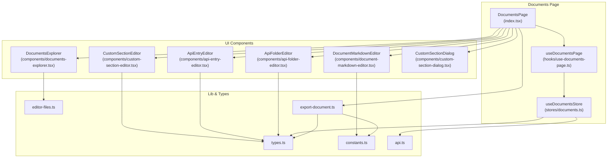

**Diagram sources**
- [src/pages/documents/index.tsx:44-333](file://src/pages/documents/index.tsx#L44-L333)
- [src/pages/documents/hooks/use-documents-page.ts:8-219](file://src/pages/documents/hooks/use-documents-page.ts#L8-L219)
- [src/pages/documents/stores/documents.ts:71-347](file://src/pages/documents/stores/documents.ts#L71-L347)
- [src/pages/documents/lib/editor-files.ts:1-64](file://src/pages/documents/lib/editor-files.ts#L1-L64)
- [src/pages/documents/lib/export-document.ts:1-253](file://src/pages/documents/lib/export-document.ts#L1-L253)
- [src/pages/documents/types.ts:1-62](file://src/pages/documents/types.ts#L1-L62)
- [src/pages/documents/constants.ts:1-65](file://src/pages/documents/constants.ts#L1-L65)
- [src/pages/documents/api.ts:1-37](file://src/pages/documents/api.ts#L1-L37)
- [src/pages/documents/components/document-markdown-editor.tsx:1-35](file://src/pages/documents/components/document-markdown-editor.tsx#L1-L35)
- [src/pages/documents/components/custom-section-editor.tsx:1-28](file://src/pages/documents/components/custom-section-editor.tsx#L1-L28)
- [src/pages/documents/components/api-entry-editor.tsx:1-115](file://src/pages/documents/components/api-entry-editor.tsx#L1-L115)
- [src/pages/documents/components/api-folder-editor.tsx:1-34](file://src/pages/documents/components/api-folder-editor.tsx#L1-L34)
- [src/pages/documents/components/documents-explorer.tsx:1-285](file://src/pages/documents/components/documents-explorer.tsx#L1-L285)
- [src/pages/documents/components/custom-section-dialog.tsx:1-95](file://src/pages/documents/components/custom-section-dialog.tsx#L1-L95)

**Section sources**
- [src/pages/documents/index.tsx:44-333](file://src/pages/documents/index.tsx#L44-L333)
- [src/pages/documents/stores/documents.ts:71-347](file://src/pages/documents/stores/documents.ts#L71-L347)
- [src/pages/documents/types.ts:13-61](file://src/pages/documents/types.ts#L13-L61)
- [src/pages/documents/constants.ts:1-65](file://src/pages/documents/constants.ts#L1-L65)

## Core Components
- DocumentsPage orchestrates the UI, manages active document and file selection, and wires up editors and the explorer.
- useDocumentsPage encapsulates document state updates, API entry selection/fetching, and exposes tab metadata.
- useDocumentsStore persists documents to the backend via Tauri commands and normalizes data on load.
- Types define document structure, sections, and saved API entries.
- Constants enumerate built-in sections with titles, descriptions, and placeholders.
- editor-files provides file ID typing, classification, and helpers to compute labels and filenames.
- export-document renders a PDF from document content and saved API entries.
- API module bridges to Tauri commands for loading, saving, and deleting documents.

**Section sources**
- [src/pages/documents/index.tsx:44-333](file://src/pages/documents/index.tsx#L44-L333)
- [src/pages/documents/hooks/use-documents-page.ts:8-219](file://src/pages/documents/hooks/use-documents-page.ts#L8-L219)
- [src/pages/documents/stores/documents.ts:71-347](file://src/pages/documents/stores/documents.ts#L71-L347)
- [src/pages/documents/types.ts:13-61](file://src/pages/documents/types.ts#L13-L61)
- [src/pages/documents/constants.ts:1-65](file://src/pages/documents/constants.ts#L1-L65)
- [src/pages/documents/lib/editor-files.ts:1-64](file://src/pages/documents/lib/editor-files.ts#L1-L64)
- [src/pages/documents/lib/export-document.ts:47-253](file://src/pages/documents/lib/export-document.ts#L47-L253)
- [src/pages/documents/api.ts:14-36](file://src/pages/documents/api.ts#L14-L36)

## Architecture Overview
The system follows a unidirectional data flow:
- UI components trigger actions via hooks.
- Hooks call store methods to update state immutably.
- Stores persist updates via Tauri commands.
- Export pipeline reads normalized document data and writes artifacts.

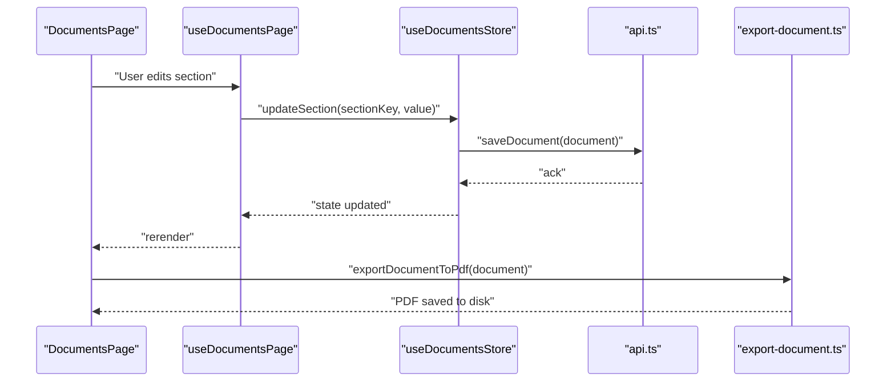

**Diagram sources**
- [src/pages/documents/index.tsx:117-127](file://src/pages/documents/index.tsx#L117-L127)
- [src/pages/documents/hooks/use-documents-page.ts:80-92](file://src/pages/documents/hooks/use-documents-page.ts#L80-L92)
- [src/pages/documents/stores/documents.ts:111-128](file://src/pages/documents/stores/documents.ts#L111-L128)
- [src/pages/documents/api.ts:22-28](file://src/pages/documents/api.ts#L22-L28)
- [src/pages/documents/lib/export-document.ts:47-253](file://src/pages/documents/lib/export-document.ts#L47-L253)

## Detailed Component Analysis

### DocumentsPage (Main Container)
- Manages tabs, active document, and file selection.
- Renders the explorer, editor tabs, and appropriate editor based on active file ID.
- Provides export-to-PDF action and handles deletion confirmation.
- Integrates API entry fetching and displays response in a split view.

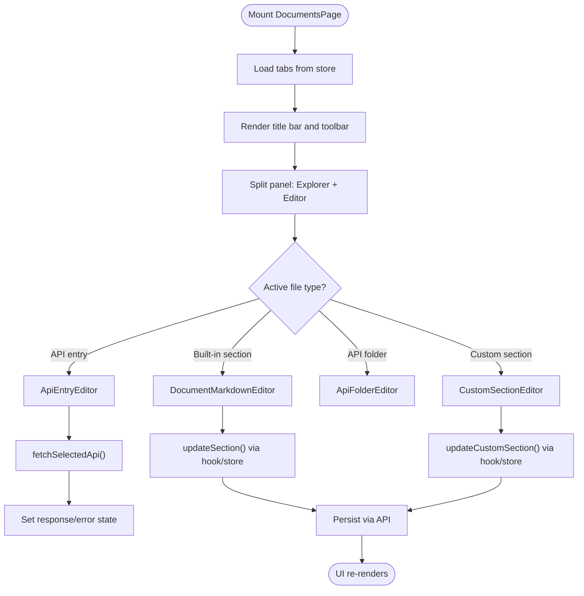

**Diagram sources**
- [src/pages/documents/index.tsx:44-333](file://src/pages/documents/index.tsx#L44-L333)
- [src/pages/documents/hooks/use-documents-page.ts:80-184](file://src/pages/documents/hooks/use-documents-page.ts#L80-L184)
- [src/pages/documents/stores/documents.ts:111-128](file://src/pages/documents/stores/documents.ts#L111-L128)

**Section sources**
- [src/pages/documents/index.tsx:44-333](file://src/pages/documents/index.tsx#L44-L333)

### useDocumentsPage (State and Actions)
- Loads documents from persistent storage on mount.
- Updates document title, sections, and custom sections.
- Manages selected API entry and triggers request sending via the Repeater API.
- Exposes tab metadata for rendering tabs.

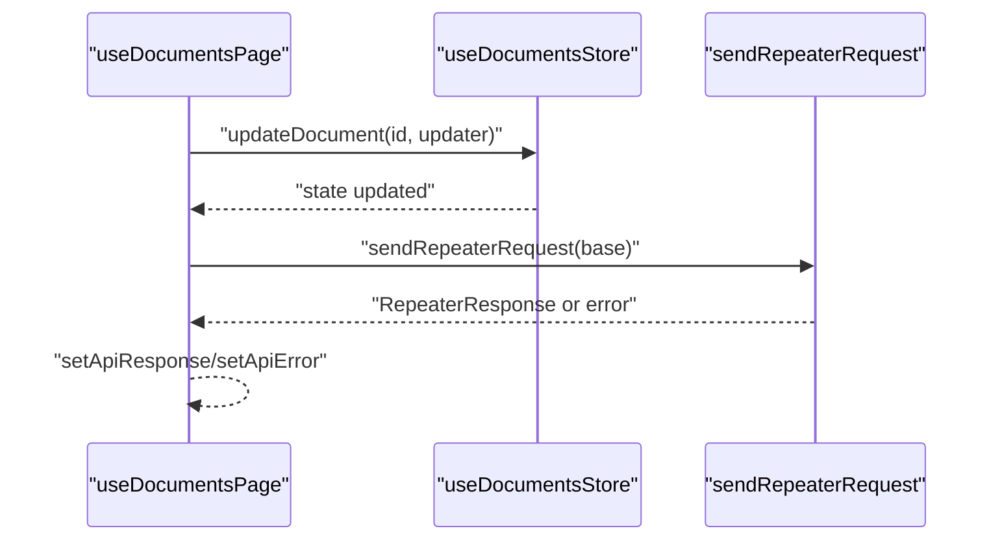

**Diagram sources**
- [src/pages/documents/hooks/use-documents-page.ts:8-219](file://src/pages/documents/hooks/use-documents-page.ts#L8-L219)
- [src/pages/documents/stores/documents.ts:111-128](file://src/pages/documents/stores/documents.ts#L111-L128)

**Section sources**
- [src/pages/documents/hooks/use-documents-page.ts:8-219](file://src/pages/documents/hooks/use-documents-page.ts#L8-L219)

### useDocumentsStore (Persistence and Normalization)
- Creates, loads, updates, and deletes documents.
- Normalizes documents to ensure consistent shape (built-in sections, custom sections, API entries).
- Persists to backend via Tauri commands and merges persisted state on startup.

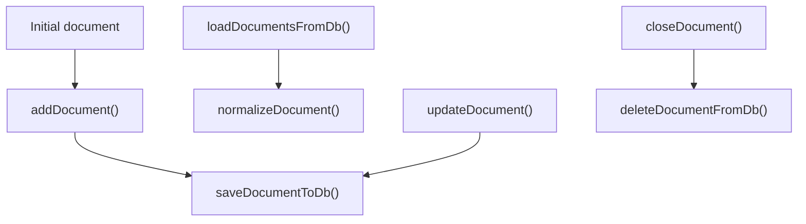

**Diagram sources**
- [src/pages/documents/stores/documents.ts:71-347](file://src/pages/documents/stores/documents.ts#L71-L347)
- [src/pages/documents/api.ts:14-36](file://src/pages/documents/api.ts#L14-L36)

**Section sources**
- [src/pages/documents/stores/documents.ts:71-347](file://src/pages/documents/stores/documents.ts#L71-L347)
- [src/pages/documents/api.ts:14-36](file://src/pages/documents/api.ts#L14-L36)

### Types and Constants
- Types define the document model, built-in sections, and saved API entries.
- Constants enumerate built-in sections with titles, descriptions, and placeholders.

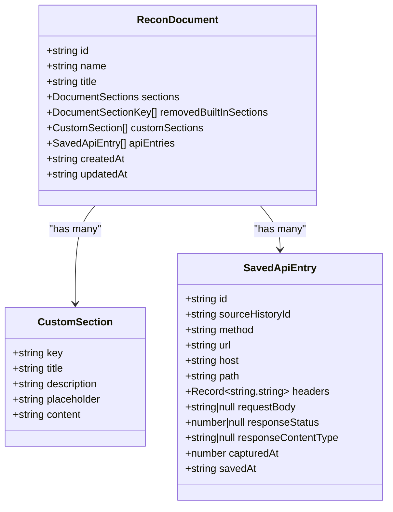

**Diagram sources**
- [src/pages/documents/types.ts:13-61](file://src/pages/documents/types.ts#L13-L61)

**Section sources**
- [src/pages/documents/types.ts:13-61](file://src/pages/documents/types.ts#L13-L61)
- [src/pages/documents/constants.ts:1-65](file://src/pages/documents/constants.ts#L1-L65)

### Editor Files and File Management
- Classifies file IDs (built-in section, custom section, API folder, API entry).
- Computes display labels and sanitized filenames for consistent UX and export.

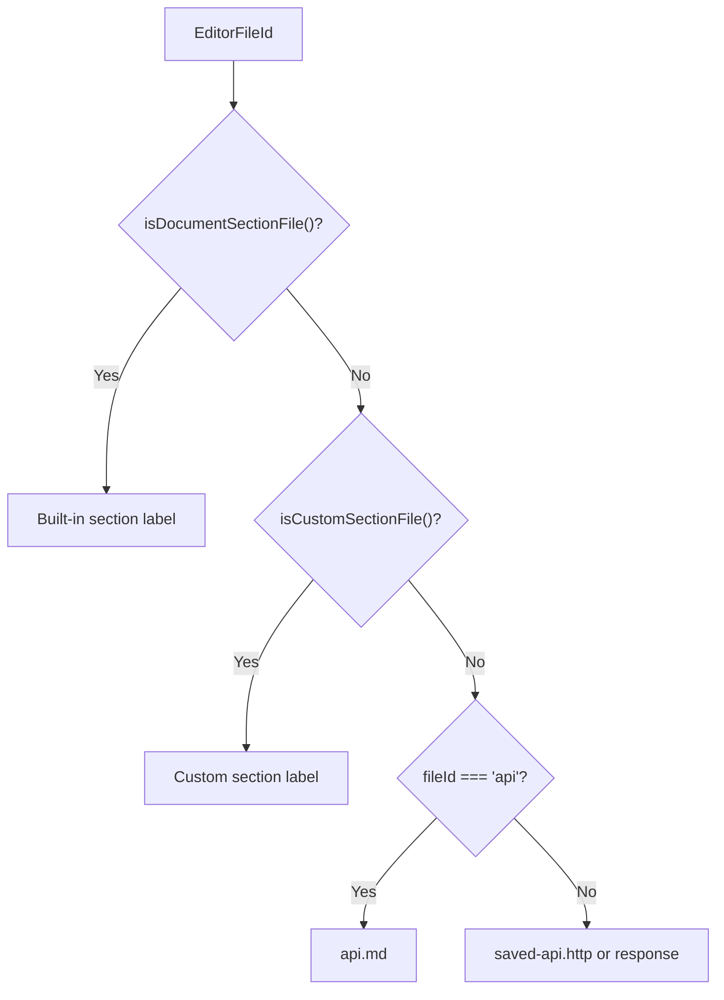

**Diagram sources**
- [src/pages/documents/lib/editor-files.ts:8-63](file://src/pages/documents/lib/editor-files.ts#L8-L63)

**Section sources**
- [src/pages/documents/lib/editor-files.ts:1-64](file://src/pages/documents/lib/editor-files.ts#L1-L64)

### Export to PDF
- Generates a PDF with document title, dates, and ordered sections.
- Includes custom sections and saved API entries with method, URL, headers, and bodies.
- Uses a safe filename sanitizer and Tauri dialogs for saving.

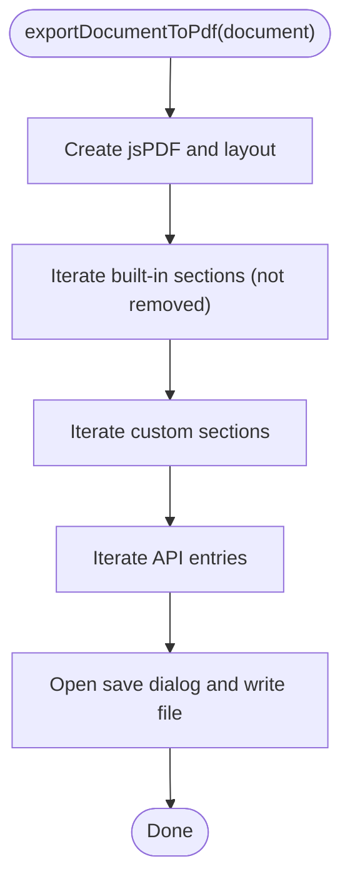

**Diagram sources**
- [src/pages/documents/lib/export-document.ts:47-253](file://src/pages/documents/lib/export-document.ts#L47-L253)

**Section sources**
- [src/pages/documents/lib/export-document.ts:47-253](file://src/pages/documents/lib/export-document.ts#L47-L253)

### Document Explorer
- Lists built-in sections, removed built-in sections, custom sections, and saved API entries.
- Supports context menu actions: remove/restore built-in sections, delete custom sections, copy curl/url, open in Brute Force or Repeater, and delete API entries.

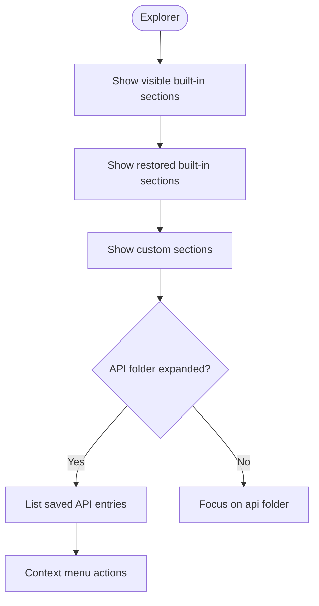

**Diagram sources**
- [src/pages/documents/components/documents-explorer.tsx:110-285](file://src/pages/documents/components/documents-explorer.tsx#L110-L285)

**Section sources**
- [src/pages/documents/components/documents-explorer.tsx:110-285](file://src/pages/documents/components/documents-explorer.tsx#L110-L285)

### Editors
- DocumentMarkdownEditor: renders a markdown editor bound to a built-in section.
- CustomSectionEditor: renders a markdown editor bound to a custom section.
- ApiFolderEditor: renders a read-only summary of saved API entries.
- ApiEntryEditor: renders request/response in a split view with fetch controls.

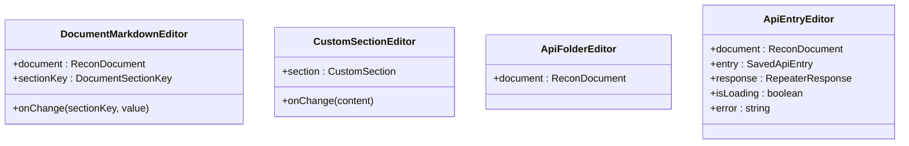

**Diagram sources**
- [src/pages/documents/components/document-markdown-editor.tsx:11-34](file://src/pages/documents/components/document-markdown-editor.tsx#L11-L34)
- [src/pages/documents/components/custom-section-editor.tsx:9-27](file://src/pages/documents/components/custom-section-editor.tsx#L9-L27)
- [src/pages/documents/components/api-folder-editor.tsx:8-33](file://src/pages/documents/components/api-folder-editor.tsx#L8-L33)
- [src/pages/documents/components/api-entry-editor.tsx:35-114](file://src/pages/documents/components/api-entry-editor.tsx#L35-L114)

**Section sources**
- [src/pages/documents/components/document-markdown-editor.tsx:11-34](file://src/pages/documents/components/document-markdown-editor.tsx#L11-L34)
- [src/pages/documents/components/custom-section-editor.tsx:9-27](file://src/pages/documents/components/custom-section-editor.tsx#L9-L27)
- [src/pages/documents/components/api-folder-editor.tsx:8-33](file://src/pages/documents/components/api-folder-editor.tsx#L8-L33)
- [src/pages/documents/components/api-entry-editor.tsx:35-114](file://src/pages/documents/components/api-entry-editor.tsx#L35-L114)

### Custom Section Creation
- Dialog collects title, description, and placeholder.
- Adds a new custom section to the active document with a generated key.

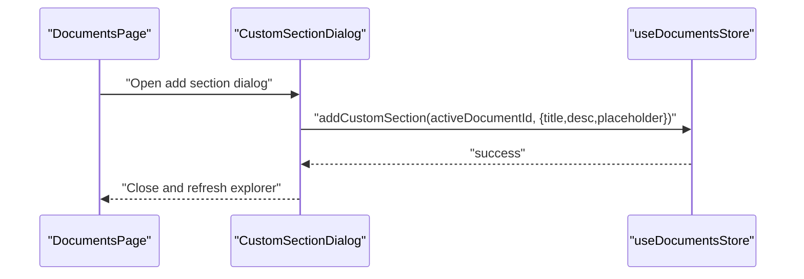

**Diagram sources**
- [src/pages/documents/components/custom-section-dialog.tsx:21-94](file://src/pages/documents/components/custom-section-dialog.tsx#L21-L94)
- [src/pages/documents/stores/documents.ts:194-217](file://src/pages/documents/stores/documents.ts#L194-L217)

**Section sources**
- [src/pages/documents/components/custom-section-dialog.tsx:21-94](file://src/pages/documents/components/custom-section-dialog.tsx#L21-L94)
- [src/pages/documents/stores/documents.ts:194-217](file://src/pages/documents/stores/documents.ts#L194-L217)

## Dependency Analysis
- DocumentsPage depends on hooks and components for rendering and actions.
- Hooks depend on the store for state updates and on the Repeater API for live request fetching.
- Store depends on the API module for persistence and on types for typing.
- Export module depends on constants and types for rendering and on Tauri plugins for saving.
- Explorer depends on editor-files for labeling and on clipboard/tools for integrations.

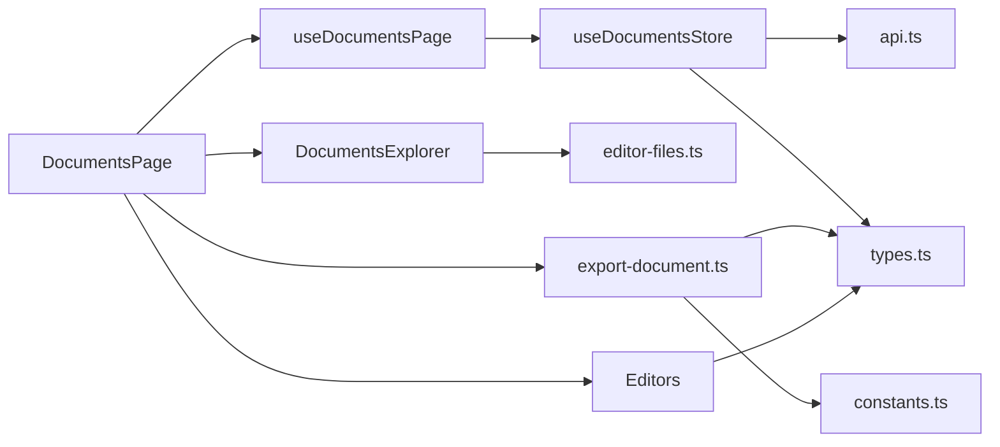

**Diagram sources**
- [src/pages/documents/index.tsx:44-333](file://src/pages/documents/index.tsx#L44-L333)
- [src/pages/documents/hooks/use-documents-page.ts:8-219](file://src/pages/documents/hooks/use-documents-page.ts#L8-L219)
- [src/pages/documents/stores/documents.ts:71-347](file://src/pages/documents/stores/documents.ts#L71-L347)
- [src/pages/documents/lib/editor-files.ts:1-64](file://src/pages/documents/lib/editor-files.ts#L1-L64)
- [src/pages/documents/lib/export-document.ts:1-253](file://src/pages/documents/lib/export-document.ts#L1-L253)
- [src/pages/documents/types.ts:1-62](file://src/pages/documents/types.ts#L1-L62)
- [src/pages/documents/constants.ts:1-65](file://src/pages/documents/constants.ts#L1-L65)
- [src/pages/documents/api.ts:1-37](file://src/pages/documents/api.ts#L1-L37)

**Section sources**
- [src/pages/documents/index.tsx:44-333](file://src/pages/documents/index.tsx#L44-L333)
- [src/pages/documents/stores/documents.ts:71-347](file://src/pages/documents/stores/documents.ts#L71-L347)

## Performance Considerations
- Minimize re-renders by using memoized selectors for active document and computed labels.
- Debounce or batch updates when editing large markdown sections.
- Avoid unnecessary API fetches by caching responses and resetting state on entry change.
- Keep export operations off the main thread; the current implementation runs synchronously and may block during large exports.

## Troubleshooting Guide
- Export fails silently: ensure Tauri is available and the save dialog returns a path.
- API entry fetch errors: check network connectivity and Repeater availability; inspect error state propagation.
- Persistence issues: verify Tauri commands are reachable and the database is initialized.
- Custom sections not appearing: confirm the dialog was submitted with a non-empty title and that the store merged persisted state correctly.

**Section sources**
- [src/pages/documents/lib/export-document.ts:236-253](file://src/pages/documents/lib/export-document.ts#L236-L253)
- [src/pages/documents/hooks/use-documents-page.ts:172-184](file://src/pages/documents/hooks/use-documents-page.ts#L172-L184)
- [src/pages/documents/api.ts:10-12](file://src/pages/documents/api.ts#L10-L12)

## Conclusion
AppRecon’s Document Management system provides a structured, extensible framework for creating, organizing, and preserving security documentation. Built-in and custom sections enable flexible content modeling, while the explorer and editors streamline authoring. Integration with traffic capture and the Repeater supports evidence preservation and live testing. The PDF export capability ensures portable reports suitable for stakeholders.

## Appendices

### Practical Workflows
- Creating a new document: click New Document; the explorer opens the Scope section by default.
- Adding a custom section: open the explorer, click “add section,” fill the dialog, and edit the new markdown file.
- Saving API entries: right-click a request in HTTP History and choose “Save to Documents”; open the API folder in the explorer to review.
- Editing a built-in section: select the section in the explorer; edit the markdown content; changes persist automatically.
- Exporting a PDF: click Export as PDF; choose a location; the document title becomes the filename.

### Templates and Formatting
- Built-in sections include placeholders to guide content capture (scope, targets, DNS, hosts/services, web observations, endpoints, authentication details, users/org info, potential vulnerabilities, evidence).
- Use markdown formatting in editors; the export pipeline converts markdown to readable text for PDFs.

### Metadata and Version Control
- Documents track creation and last update timestamps; these appear in exports.
- Consider backing up the persistent store externally for version control of documents.

### Security Best Practices
- Treat evidence sections as sensitive; avoid sharing raw request bodies and credentials.
- Use custom sections to annotate sensitive findings and redactions.
- Prefer exporting PDFs for sharing with non-technical stakeholders.