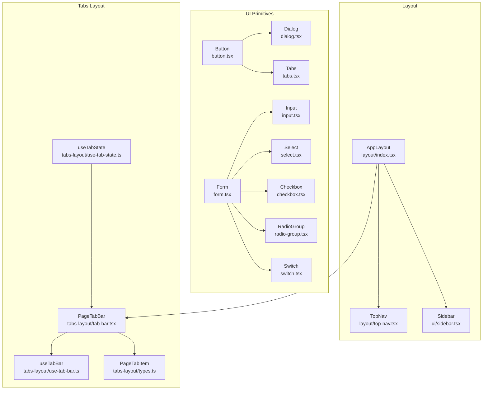
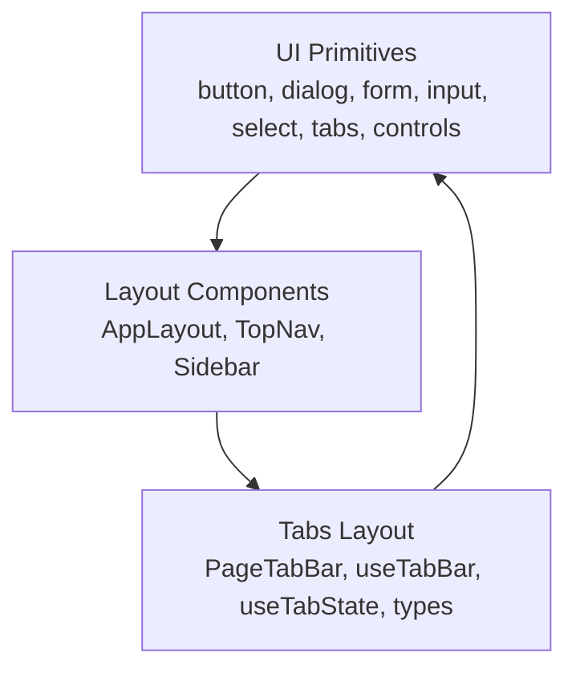
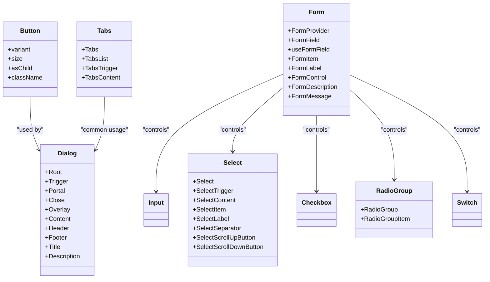
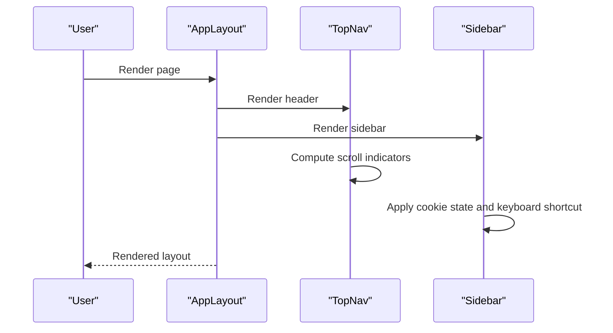
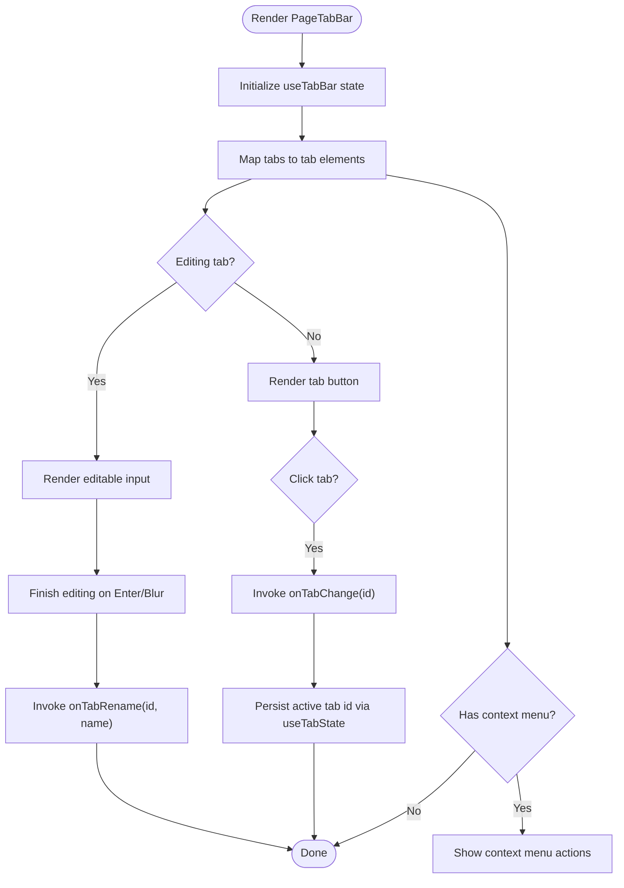
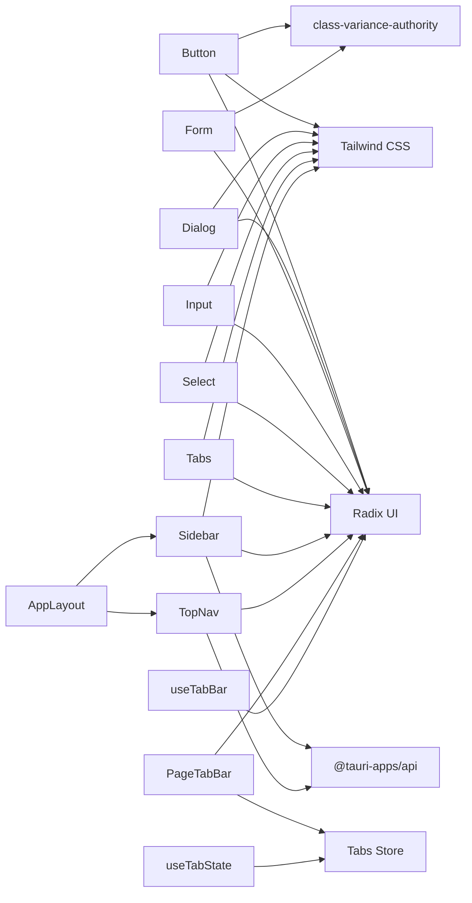

# Component System

<cite>
**Referenced Files in This Document**
- [src/components/layout/index.tsx](file://src/components/layout/index.tsx)
- [src/components/layout/top-nav.tsx](file://src/components/layout/top-nav.tsx)
- [src/components/ui/button.tsx](file://src/components/ui/button.tsx)
- [src/components/ui/dialog.tsx](file://src/components/ui/dialog.tsx)
- [src/components/ui/form.tsx](file://src/components/ui/form.tsx)
- [src/components/ui/input.tsx](file://src/components/ui/input.tsx)
- [src/components/ui/select.tsx](file://src/components/ui/select.tsx)
- [src/components/ui/sidebar.tsx](file://src/components/ui/sidebar.tsx)
- [src/components/ui/tabs.tsx](file://src/components/ui/tabs.tsx)
- [src/components/ui/checkbox.tsx](file://src/components/ui/checkbox.tsx)
- [src/components/ui/radio-group.tsx](file://src/components/ui/radio-group.tsx)
- [src/components/ui/switch.tsx](file://src/components/ui/switch.tsx)
- [src/components/tabs-layout/tab-bar.tsx](file://src/components/tabs-layout/tab-bar.tsx)
- [src/components/tabs-layout/use-tab-bar.ts](file://src/components/tabs-layout/use-tab-bar.ts)
- [src/components/tabs-layout/use-tab-state.ts](file://src/components/tabs-layout/use-tab-state.ts)
- [src/components/tabs-layout/types.ts](file://src/components/tabs-layout/types.ts)
</cite>

## Table of Contents
1. [Introduction](#introduction)
2. [Project Structure](#project-structure)
3. [Core Components](#core-components)
4. [Architecture Overview](#architecture-overview)
5. [Detailed Component Analysis](#detailed-component-analysis)
6. [Dependency Analysis](#dependency-analysis)
7. [Performance Considerations](#performance-considerations)
8. [Accessibility Compliance](#accessibility-compliance)
9. [Responsive Design Principles](#responsive-design-principles)
10. [Cross-Browser Compatibility](#cross-browser-compatibility)
11. [Component Development Workflow](#component-development-workflow)
12. [Testing Strategies](#testing-strategies)
13. [Maintenance Best Practices](#maintenance-best-practices)
14. [Troubleshooting Guide](#troubleshooting-guide)
15. [Conclusion](#conclusion)

## Introduction
This document describes AppRecon’s React component system architecture with a focus on the UI primitive library built on Radix UI and Tailwind CSS, layout primitives, and the tabs layout system. It explains component composition patterns, prop interfaces, event handling, accessibility, responsiveness, and cross-browser compatibility. Practical usage guidance and customization options are included to help developers build consistent, accessible, and maintainable user interfaces.

## Project Structure
The component system is organized into:
- UI primitives under src/components/ui: reusable building blocks for buttons, forms, inputs, selects, dialogs, tabs, and interactive controls.
- Layout primitives under src/components/layout: page scaffolding including top navigation, sidebar, and the main app layout wrapper.
- Tabs layout system under src/components/tabs-layout: tab bar, state management hooks, and tab item typing.

**Diagram sources**
- [src/components/layout/index.tsx:1-32](file://src/components/layout/index.tsx#L1-L32)
- [src/components/layout/top-nav.tsx:1-149](file://src/components/layout/top-nav.tsx#L1-L149)
- [src/components/ui/button.tsx:1-67](file://src/components/ui/button.tsx#L1-L67)
- [src/components/ui/dialog.tsx:1-142](file://src/components/ui/dialog.tsx#L1-L142)
- [src/components/ui/form.tsx:1-168](file://src/components/ui/form.tsx#L1-L168)
- [src/components/ui/input.tsx:1-26](file://src/components/ui/input.tsx#L1-L26)
- [src/components/ui/select.tsx:1-188](file://src/components/ui/select.tsx#L1-L188)
- [src/components/ui/sidebar.tsx:1-741](file://src/components/ui/sidebar.tsx#L1-L741)
- [src/components/ui/tabs.tsx:1-67](file://src/components/ui/tabs.tsx#L1-L67)
- [src/components/ui/checkbox.tsx:1-33](file://src/components/ui/checkbox.tsx#L1-L33)
- [src/components/ui/radio-group.tsx:1-46](file://src/components/ui/radio-group.tsx#L1-L46)
- [src/components/ui/switch.tsx:1-32](file://src/components/ui/switch.tsx#L1-L32)
- [src/components/tabs-layout/tab-bar.tsx:1-202](file://src/components/tabs-layout/tab-bar.tsx#L1-L202)
- [src/components/tabs-layout/use-tab-bar.ts:1-106](file://src/components/tabs-layout/use-tab-bar.ts#L1-L106)
- [src/components/tabs-layout/use-tab-state.ts:1-38](file://src/components/tabs-layout/use-tab-state.ts#L1-L38)
- [src/components/tabs-layout/types.ts:1-7](file://src/components/tabs-layout/types.ts#L1-L7)

**Section sources**
- [src/components/layout/index.tsx:1-32](file://src/components/layout/index.tsx#L1-L32)
- [src/components/layout/top-nav.tsx:1-149](file://src/components/layout/top-nav.tsx#L1-L149)
- [src/components/ui/sidebar.tsx:1-741](file://src/components/ui/sidebar.tsx#L1-L741)

## Core Components
This section outlines the primary UI primitives and their roles in the system.

- Button
  - Provides variant and size variants via class variance authority, supports asChild composition, and integrates focus-visible and invalid states.
  - Props include variant, size, asChild, and standard button attributes.
  - Accessible and styled with Tailwind utilities and Radix focus rings.

- Dialog
  - Composed from Radix UI primitives with overlay animation, portal support, and optional close button.
  - Exposes Root, Trigger, Portal, Close, Overlay, Content, Header, Footer, Title, Description.

- Form
  - Integrates react-hook-form with Radix Label to provide FormProvider, FormField, useFormField, FormItem, FormLabel, FormControl, FormDescription, FormMessage.
  - Ensures accessibility via aria-invalid, aria-describedby, and generated ids.

- Input
  - Styled base input with focus-visible ring, invalid state styling, and disabled state handling.
  - Includes autocomplete toggles and spellcheck adjustments.

- Select
  - Radix Select wrapper with trigger sizing, content positioning, viewport scrolling, and item indicators.
  - Supports groups, labels, separators, and scroll buttons.

- Tabs
  - Radix Tabs wrapper with list, trigger, and content slots styled for consistent spacing and focus states.

- Checkbox, RadioGroup, Switch
  - Primitive controls with focus-visible rings, disabled states, and indicator visuals.

**Section sources**
- [src/components/ui/button.tsx:1-67](file://src/components/ui/button.tsx#L1-L67)
- [src/components/ui/dialog.tsx:1-142](file://src/components/ui/dialog.tsx#L1-L142)
- [src/components/ui/form.tsx:1-168](file://src/components/ui/form.tsx#L1-L168)
- [src/components/ui/input.tsx:1-26](file://src/components/ui/input.tsx#L1-L26)
- [src/components/ui/select.tsx:1-188](file://src/components/ui/select.tsx#L1-L188)
- [src/components/ui/tabs.tsx:1-67](file://src/components/ui/tabs.tsx#L1-L67)
- [src/components/ui/checkbox.tsx:1-33](file://src/components/ui/checkbox.tsx#L1-L33)
- [src/components/ui/radio-group.tsx:1-46](file://src/components/ui/radio-group.tsx#L1-L46)
- [src/components/ui/switch.tsx:1-32](file://src/components/ui/switch.tsx#L1-L32)

## Architecture Overview
The component system follows a layered approach:
- UI primitives encapsulate styling and behavior using Radix UI for accessibility and Tailwind for design tokens.
- Layout components orchestrate page structure, navigation, and sidebar behavior.
- Tabs layout composes a tab bar with state hooks and persistent active tab selection.

**Diagram sources**
- [src/components/ui/button.tsx:1-67](file://src/components/ui/button.tsx#L1-L67)
- [src/components/ui/dialog.tsx:1-142](file://src/components/ui/dialog.tsx#L1-L142)
- [src/components/ui/form.tsx:1-168](file://src/components/ui/form.tsx#L1-L168)
- [src/components/ui/input.tsx:1-26](file://src/components/ui/input.tsx#L1-L26)
- [src/components/ui/select.tsx:1-188](file://src/components/ui/select.tsx#L1-L188)
- [src/components/ui/tabs.tsx:1-67](file://src/components/ui/tabs.tsx#L1-L67)
- [src/components/layout/index.tsx:1-32](file://src/components/layout/index.tsx#L1-L32)
- [src/components/layout/top-nav.tsx:1-149](file://src/components/layout/top-nav.tsx#L1-L149)
- [src/components/ui/sidebar.tsx:1-741](file://src/components/ui/sidebar.tsx#L1-L741)
- [src/components/tabs-layout/tab-bar.tsx:1-202](file://src/components/tabs-layout/tab-bar.tsx#L1-L202)
- [src/components/tabs-layout/use-tab-bar.ts:1-106](file://src/components/tabs-layout/use-tab-bar.ts#L1-L106)
- [src/components/tabs-layout/use-tab-state.ts:1-38](file://src/components/tabs-layout/use-tab-state.ts#L1-L38)
- [src/components/tabs-layout/types.ts:1-7](file://src/components/tabs-layout/types.ts#L1-L7)

## Detailed Component Analysis

### UI Primitive Library Composition
- Composition pattern: Many components use asChild (Radix Slot) to wrap native elements, enabling semantic correctness and composition flexibility.
- Styling pattern: Tailwind classes combined with class-variance-authority variants for consistent design tokens and scalable variants.
- Accessibility pattern: Focus-visible rings, aria-invalid, aria-describedby, and explicit sr-only labels for assistive technologies.

**Diagram sources**
- [src/components/ui/button.tsx:1-67](file://src/components/ui/button.tsx#L1-L67)
- [src/components/ui/dialog.tsx:1-142](file://src/components/ui/dialog.tsx#L1-L142)
- [src/components/ui/form.tsx:1-168](file://src/components/ui/form.tsx#L1-L168)
- [src/components/ui/input.tsx:1-26](file://src/components/ui/input.tsx#L1-L26)
- [src/components/ui/select.tsx:1-188](file://src/components/ui/select.tsx#L1-L188)
- [src/components/ui/tabs.tsx:1-67](file://src/components/ui/tabs.tsx#L1-L67)
- [src/components/ui/checkbox.tsx:1-33](file://src/components/ui/checkbox.tsx#L1-L33)
- [src/components/ui/radio-group.tsx:1-46](file://src/components/ui/radio-group.tsx#L1-L46)
- [src/components/ui/switch.tsx:1-32](file://src/components/ui/switch.tsx#L1-L32)

**Section sources**
- [src/components/ui/button.tsx:1-67](file://src/components/ui/button.tsx#L1-L67)
- [src/components/ui/dialog.tsx:1-142](file://src/components/ui/dialog.tsx#L1-L142)
- [src/components/ui/form.tsx:1-168](file://src/components/ui/form.tsx#L1-L168)
- [src/components/ui/input.tsx:1-26](file://src/components/ui/input.tsx#L1-L26)
- [src/components/ui/select.tsx:1-188](file://src/components/ui/select.tsx#L1-L188)
- [src/components/ui/tabs.tsx:1-67](file://src/components/ui/tabs.tsx#L1-L67)
- [src/components/ui/checkbox.tsx:1-33](file://src/components/ui/checkbox.tsx#L1-L33)
- [src/components/ui/radio-group.tsx:1-46](file://src/components/ui/radio-group.tsx#L1-L46)
- [src/components/ui/switch.tsx:1-32](file://src/components/ui/switch.tsx#L1-L32)

### Layout Component Hierarchy
- AppLayout
  - Wraps children with a screen-sized container, top navigation, main content area, and footer.
  - Manages assistant pane visibility and responsive spacing.

- TopNav
  - Horizontal navigation bar with draggable region, active state highlighting, proxy status indicator, and scroll indicators for long nav lists.
  - Integrates with routing and stores for proxy status.

- Sidebar
  - Full-featured sidebar with provider, collapsible modes, mobile sheet, keyboard shortcut, cookie-backed persistence, and tooltip provider.
  - Offers menu groups, buttons, actions, badges, and submenus with consistent styling.

**Diagram sources**
- [src/components/layout/index.tsx:1-32](file://src/components/layout/index.tsx#L1-L32)
- [src/components/layout/top-nav.tsx:1-149](file://src/components/layout/top-nav.tsx#L1-L149)
- [src/components/ui/sidebar.tsx:1-741](file://src/components/ui/sidebar.tsx#L1-L741)

**Section sources**
- [src/components/layout/index.tsx:1-32](file://src/components/layout/index.tsx#L1-L32)
- [src/components/layout/top-nav.tsx:1-149](file://src/components/layout/top-nav.tsx#L1-L149)
- [src/components/ui/sidebar.tsx:1-741](file://src/components/ui/sidebar.tsx#L1-L741)

### Tabs Layout System
- PageTabBar
  - Renders a horizontal tab bar with scroll indicators, rename/editing, close actions, and context menus.
  - Handles disabled/closable flags per tab and exposes callbacks for change, rename, and close events.

- useTabBar
  - Hook managing scroll indicators, editing state, and renaming flow with focus/select automation.
  - Observes container scroll and resize to update visibility of scroll gradients.

- useTabState
  - Hook providing persisted active tab selection scoped by a computed scope string derived from tab ids.
  - Updates store on active tab change and ensures fallback to first tab if stored selection is invalid.

- Types
  - PageTabItem defines id, name, disabled, and closable flags.

**Diagram sources**
- [src/components/tabs-layout/tab-bar.tsx:1-202](file://src/components/tabs-layout/tab-bar.tsx#L1-L202)
- [src/components/tabs-layout/use-tab-bar.ts:1-106](file://src/components/tabs-layout/use-tab-bar.ts#L1-L106)
- [src/components/tabs-layout/use-tab-state.ts:1-38](file://src/components/tabs-layout/use-tab-state.ts#L1-L38)
- [src/components/tabs-layout/types.ts:1-7](file://src/components/tabs-layout/types.ts#L1-L7)

**Section sources**
- [src/components/tabs-layout/tab-bar.tsx:1-202](file://src/components/tabs-layout/tab-bar.tsx#L1-L202)
- [src/components/tabs-layout/use-tab-bar.ts:1-106](file://src/components/tabs-layout/use-tab-bar.ts#L1-L106)
- [src/components/tabs-layout/use-tab-state.ts:1-38](file://src/components/tabs-layout/use-tab-state.ts#L1-L38)
- [src/components/tabs-layout/types.ts:1-7](file://src/components/tabs-layout/types.ts#L1-L7)

## Dependency Analysis
- UI primitives depend on:
  - Radix UI for accessible semantics and state machines.
  - Tailwind CSS for styling and design tokens.
  - class-variance-authority for variant composition.
- Layout components depend on:
  - Routing for navigation.
  - Stores for state (e.g., proxy status).
  - Tauri APIs for window dragging and OS-level controls.
- Tabs layout depends on:
  - A centralized store for active tab persistence.
  - Context menus and Radix UI primitives for interaction.

**Diagram sources**
- [src/components/ui/button.tsx:1-67](file://src/components/ui/button.tsx#L1-L67)
- [src/components/ui/dialog.tsx:1-142](file://src/components/ui/dialog.tsx#L1-L142)
- [src/components/ui/form.tsx:1-168](file://src/components/ui/form.tsx#L1-L168)
- [src/components/ui/input.tsx:1-26](file://src/components/ui/input.tsx#L1-L26)
- [src/components/ui/select.tsx:1-188](file://src/components/ui/select.tsx#L1-L188)
- [src/components/ui/sidebar.tsx:1-741](file://src/components/ui/sidebar.tsx#L1-L741)
- [src/components/layout/top-nav.tsx:1-149](file://src/components/layout/top-nav.tsx#L1-L149)
- [src/components/layout/index.tsx:1-32](file://src/components/layout/index.tsx#L1-L32)
- [src/components/tabs-layout/tab-bar.tsx:1-202](file://src/components/tabs-layout/tab-bar.tsx#L1-L202)
- [src/components/tabs-layout/use-tab-bar.ts:1-106](file://src/components/tabs-layout/use-tab-bar.ts#L1-L106)
- [src/components/tabs-layout/use-tab-state.ts:1-38](file://src/components/tabs-layout/use-tab-state.ts#L1-L38)

**Section sources**
- [src/components/ui/button.tsx:1-67](file://src/components/ui/button.tsx#L1-L67)
- [src/components/ui/dialog.tsx:1-142](file://src/components/ui/dialog.tsx#L1-L142)
- [src/components/ui/form.tsx:1-168](file://src/components/ui/form.tsx#L1-L168)
- [src/components/ui/input.tsx:1-26](file://src/components/ui/input.tsx#L1-L26)
- [src/components/ui/select.tsx:1-188](file://src/components/ui/select.tsx#L1-L188)
- [src/components/ui/sidebar.tsx:1-741](file://src/components/ui/sidebar.tsx#L1-L741)
- [src/components/layout/top-nav.tsx:1-149](file://src/components/layout/top-nav.tsx#L1-L149)
- [src/components/layout/index.tsx:1-32](file://src/components/layout/index.tsx#L1-L32)
- [src/components/tabs-layout/tab-bar.tsx:1-202](file://src/components/tabs-layout/tab-bar.tsx#L1-L202)
- [src/components/tabs-layout/use-tab-bar.ts:1-106](file://src/components/tabs-layout/use-tab-bar.ts#L1-L106)
- [src/components/tabs-layout/use-tab-state.ts:1-38](file://src/components/tabs-layout/use-tab-state.ts#L1-L38)

## Performance Considerations
- Prefer asChild composition to avoid unnecessary DOM wrappers and preserve semantic markup.
- Use ResizeObserver and minimal scroll listeners in tab and navigation bars to reduce layout thrash.
- Persist tab state efficiently with a scoped key derived from tab ids to avoid unnecessary re-renders.
- Defer heavy computations inside event handlers; memoize where appropriate.
- Keep dialog portals and sidebar sheets mounted conditionally to minimize DOM overhead.

## Accessibility Compliance
- Focus management: All interactive primitives apply focus-visible rings and outline resets for keyboard navigation.
- ARIA attributes: Forms integrate aria-invalid and aria-describedby for assistive tech; Dialogs include sr-only labels and portal overlays.
- Semantic markup: asChild usage preserves native semantics for inputs, buttons, and links.
- Keyboard shortcuts: Sidebar supports a configurable keyboard shortcut to toggle state.
- Screen reader support: Dialogs and menus include proper labeling and hidden content for assistive technologies.

**Section sources**
- [src/components/ui/button.tsx:1-67](file://src/components/ui/button.tsx#L1-L67)
- [src/components/ui/dialog.tsx:1-142](file://src/components/ui/dialog.tsx#L1-L142)
- [src/components/ui/form.tsx:1-168](file://src/components/ui/form.tsx#L1-L168)
- [src/components/ui/sidebar.tsx:1-741](file://src/components/ui/sidebar.tsx#L1-L741)
- [src/components/tabs-layout/tab-bar.tsx:1-202](file://src/components/tabs-layout/tab-bar.tsx#L1-L202)

## Responsive Design Principles
- Mobile-first: Sidebar switches to a Sheet on small screens; scroll indicators fade when not applicable.
- Adaptive layouts: AppLayout adjusts assistant pane spacing at larger breakpoints; TopNav uses gradient overlays for horizontal scrolling.
- Flexible sizing: Buttons and inputs expose size variants; Select triggers adapt sizes; Tabs adjust to available space.

**Section sources**
- [src/components/ui/sidebar.tsx:1-741](file://src/components/ui/sidebar.tsx#L1-L741)
- [src/components/layout/top-nav.tsx:1-149](file://src/components/layout/top-nav.tsx#L1-L149)
- [src/components/layout/index.tsx:1-32](file://src/components/layout/index.tsx#L1-L32)

## Cross-Browser Compatibility
- Radix UI primitives provide consistent behavior across modern browsers.
- Tailwind utilities are compiled to stable CSS; ensure PostCSS and browserlist targets are configured in the project.
- Avoid unsupported CSS features; rely on design tokens and utility classes for broad compatibility.

## Component Development Workflow
- Start from primitives: Build features using existing UI primitives to maintain consistency.
- Compose with asChild: Wrap native elements to preserve semantics and enable composition.
- Add variants thoughtfully: Extend class-variance-authority variants sparingly and document defaults.
- Test accessibility: Verify keyboard navigation, focus order, and ARIA attributes.
- Optimize rendering: Use memoization and controlled updates for dynamic lists (e.g., tabs).

## Testing Strategies
- Unit tests for hooks: Validate useTabBar and useTabState behavior with mocked tabs and store.
- Integration tests for dialogs: Confirm overlay, portal, and focus trap behavior.
- Accessibility tests: Use automated tools to scan dialogs, forms, and menus for WCAG criteria.
- Visual regression: Snapshot test key component states (active, disabled, invalid) across breakpoints.

## Maintenance Best Practices
- Centralize design tokens: Keep Tailwind and color tokens consistent across components.
- Version primitives: When extending variants, incrementally add and deprecate safely.
- Document props: Provide clear prop interfaces and usage examples for each component.
- Keep Radix and Tailwind updated: Monitor breaking changes and update accordingly.

## Troubleshooting Guide
- Dialog not closing or focus not trapped:
  - Ensure Portal is attached to a valid container and Overlay is rendered.
  - Verify Close button is present and not disabled.

- Form validation not reflected:
  - Confirm useFormField is used within FormItem/FormLabel/FormControl.
  - Check that aria-invalid and aria-describedby are applied.

- Tabs not persisting:
  - Verify scope string uniqueness for each tab set.
  - Ensure store updates occur on active tab change.

- Sidebar not toggling:
  - Confirm keyboard shortcut handler is registered and cookie state is readable.
  - Check mobile vs desktop rendering paths.

**Section sources**
- [src/components/ui/dialog.tsx:1-142](file://src/components/ui/dialog.tsx#L1-L142)
- [src/components/ui/form.tsx:1-168](file://src/components/ui/form.tsx#L1-L168)
- [src/components/tabs-layout/use-tab-state.ts:1-38](file://src/components/tabs-layout/use-tab-state.ts#L1-L38)
- [src/components/ui/sidebar.tsx:1-741](file://src/components/ui/sidebar.tsx#L1-L741)

## Conclusion
AppRecon’s component system leverages Radix UI and Tailwind CSS to deliver accessible, consistent, and responsive UI primitives. The layout components provide robust scaffolding, while the tabs layout system offers flexible, stateful tab management with persistence. By following the composition patterns, accessibility guidelines, and maintenance practices outlined here, teams can extend the system reliably and efficiently.