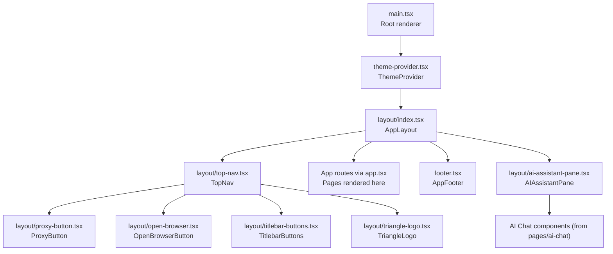
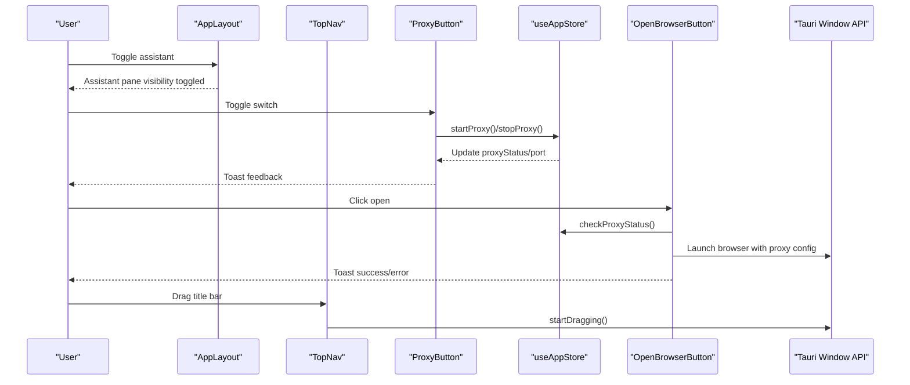
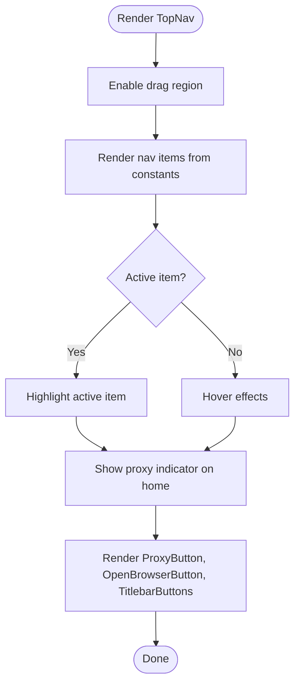
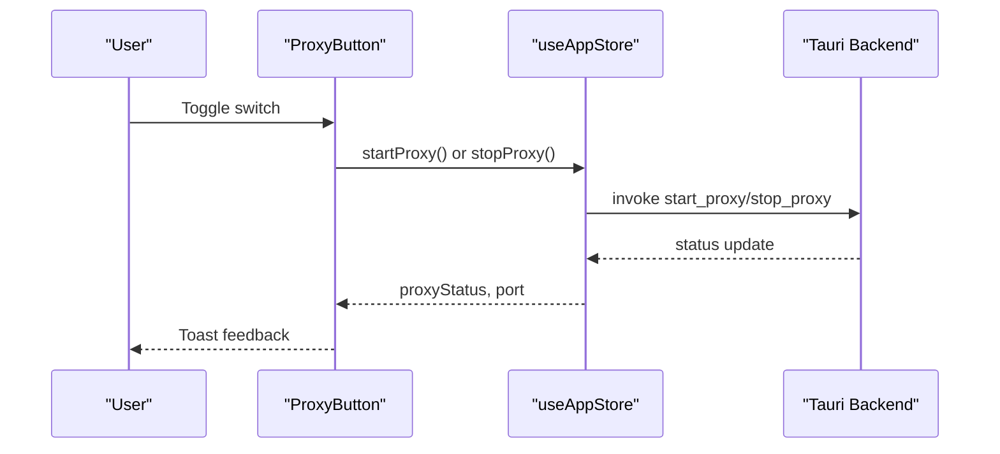
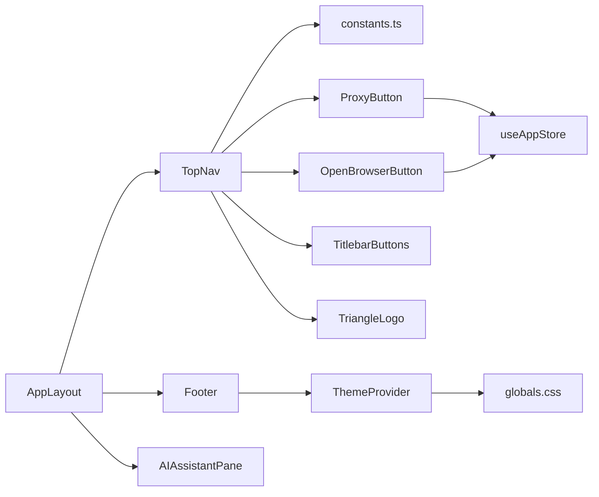
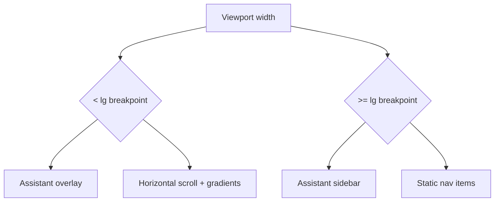

# Layout Components

<cite>
**Referenced Files in This Document**
- [index.tsx](file://src/components/layout/index.tsx)
- [top-nav.tsx](file://src/components/layout/top-nav.tsx)
- [constants.ts](file://src/components/layout/constants.ts)
- [titlebar-buttons.tsx](file://src/components/layout/titlebar-buttons.tsx)
- [ai-assistant-pane.tsx](file://src/components/layout/ai-assistant-pane.tsx)
- [proxy-button.tsx](file://src/components/layout/proxy-button.tsx)
- [open-browser.tsx](file://src/components/layout/open-browser.tsx)
- [triangle-logo.tsx](file://src/components/layout/triangle-logo.tsx)
- [footer.tsx](file://src/components/footer.tsx)
- [theme-provider.tsx](file://src/components/theme-provider.tsx)
- [globals.css](file://src/styles/globals.css)
- [app.tsx](file://src/app.tsx)
- [main.tsx](file://src/main.tsx)
- [app.ts](file://src/stores/app.ts)
</cite>

## Table of Contents
1. [Introduction](#introduction)
2. [Project Structure](#project-structure)
3. [Core Components](#core-components)
4. [Architecture Overview](#architecture-overview)
5. [Detailed Component Analysis](#detailed-component-analysis)
6. [Dependency Analysis](#dependency-analysis)
7. [Performance Considerations](#performance-considerations)
8. [Accessibility and UX](#accessibility-and-ux)
9. [Responsive Behavior and Mobile Adaptation](#responsive-behavior-and-mobile-adaptation)
10. [Layout Customization and Theming](#layout-customization-and-theming)
11. [Troubleshooting Guide](#troubleshooting-guide)
12. [Conclusion](#conclusion)

## Introduction
This document explains AppRecon’s layout component system with a focus on the main layout container, top navigation bar, titlebar buttons, AI assistant pane, proxy control, browser launcher, triangle logo, and footer. It covers integration patterns, runtime behavior, responsive design, accessibility, and theming support. The goal is to help developers compose layouts, customize behavior, and maintain accessibility across desktop and web contexts.

## Project Structure
The layout system centers on a single layout wrapper that hosts the top navigation, main content area, optional AI assistant pane, and footer. Routing and page components are rendered inside the layout. Theming and global styles are applied at the root.

**Diagram sources**
- [main.tsx:55-64](file://src/main.tsx#L55-L64)
- [theme-provider.tsx:28-52](file://src/components/theme-provider.tsx#L28-L52)
- [index.tsx:9-31](file://src/components/layout/index.tsx#L9-L31)
- [top-nav.tsx:17-148](file://src/components/layout/top-nav.tsx#L17-L148)
- [proxy-button.tsx:9-73](file://src/components/layout/proxy-button.tsx#L9-L73)
- [open-browser.tsx:9-89](file://src/components/layout/open-browser.tsx#L9-L89)
- [titlebar-buttons.tsx:10-55](file://src/components/layout/titlebar-buttons.tsx#L10-L55)
- [triangle-logo.tsx:27-56](file://src/components/layout/triangle-logo.tsx#L27-L56)
- [ai-assistant-pane.tsx:5-47](file://src/components/layout/ai-assistant-pane.tsx#L5-L47)
- [footer.tsx:26-178](file://src/components/footer.tsx#L26-L178)
- [app.tsx:14-32](file://src/app.tsx#L14-L32)

**Section sources**
- [main.tsx:29-64](file://src/main.tsx#L29-L64)
- [index.tsx:9-31](file://src/components/layout/index.tsx#L9-L31)
- [app.tsx:14-32](file://src/app.tsx#L14-L32)

## Core Components
- AppLayout: The primary layout container that wraps the application, hosting the top navigation, main content area, optional AI assistant pane, and footer. It manages the assistant visibility state and adjusts spacing accordingly.
- TopNav: The top navigation bar containing draggable region affordance, branding/logo, navigation items, proxy status indicator, proxy control, browser launcher, and window controls.
- AIAssistantPane: A sidebar-like assistant panel that renders an AI chat thread and composer, positioned absolutely on small screens and as a static sidebar on larger screens.
- ProxyButton: A toggle control for starting/stopping the local proxy with status feedback and toast notifications.
- OpenBrowserButton: A button to launch an external browser configured to route traffic through the local proxy, with dynamic tooltips reflecting current port configuration.
- TitlebarButtons: Native window controls (minimize, maximize/fullscreen, close) implemented with Tauri APIs.
- TriangleLogo: A branded animated triangle logo with configurable sizes and responsive hover behavior.
- Footer: Status indicators for proxy connectivity and port, theme toggle, update controls, and settings access.

**Section sources**
- [index.tsx:9-31](file://src/components/layout/index.tsx#L9-L31)
- [top-nav.tsx:17-148](file://src/components/layout/top-nav.tsx#L17-L148)
- [ai-assistant-pane.tsx:5-47](file://src/components/layout/ai-assistant-pane.tsx#L5-L47)
- [proxy-button.tsx:9-73](file://src/components/layout/proxy-button.tsx#L9-L73)
- [open-browser.tsx:9-89](file://src/components/layout/open-browser.tsx#L9-L89)
- [titlebar-buttons.tsx:10-55](file://src/components/layout/titlebar-buttons.tsx#L10-L55)
- [triangle-logo.tsx:27-56](file://src/components/layout/triangle-logo.tsx#L27-L56)
- [footer.tsx:26-178](file://src/components/footer.tsx#L26-L178)

## Architecture Overview
The layout system integrates React Router for page routing, Zustand for proxy state, Tauri APIs for native window controls, and shadcn/ui components for UI primitives. Theming is handled via a context provider and CSS custom properties.

**Diagram sources**
- [index.tsx:9-31](file://src/components/layout/index.tsx#L9-L31)
- [top-nav.tsx:17-148](file://src/components/layout/top-nav.tsx#L17-L148)
- [proxy-button.tsx:24-46](file://src/components/layout/proxy-button.tsx#L24-L46)
- [open-browser.tsx:43-61](file://src/components/layout/open-browser.tsx#L43-L61)
- [app.ts:38-96](file://src/stores/app.ts#L38-L96)

## Detailed Component Analysis

### AppLayout
- Responsibilities: Wraps the application with a container that applies background, shadows, and rounded borders. Renders TopNav, main content area, optional AI assistant pane, and Footer. Manages assistant open state and adjusts content padding based on assistant visibility.
- Integration: Consumes child content from router and passes assistant state down to Footer.

**Section sources**
- [index.tsx:9-31](file://src/components/layout/index.tsx#L9-L31)

### Top Navigation Bar (TopNav)
- Draggable region: Uses a Tauri drag region attribute to enable window dragging from the header.
- Navigation items: Dynamically generated from constants, with active state highlighting and a proxy-connected indicator shown on the home route.
- Scrolling indicators: Gradient overlays indicate when the nav can scroll left/right; computed via ResizeObserver and scroll listeners.
- Controls: Includes ProxyButton, OpenBrowserButton, and TitlebarButtons aligned to the right.
- Logo: TriangleLogo with hover-expand behavior to reveal brand text.

**Diagram sources**
- [top-nav.tsx:17-148](file://src/components/layout/top-nav.tsx#L17-L148)
- [constants.ts:11-25](file://src/components/layout/constants.ts#L11-L25)

**Section sources**
- [top-nav.tsx:17-148](file://src/components/layout/top-nav.tsx#L17-L148)
- [constants.ts:11-25](file://src/components/layout/constants.ts#L11-L25)

### Titlebar Buttons (TitlebarButtons)
- Implements minimize, toggle fullscreen, and close actions using Tauri window APIs.
- Uses grouped hover states to reveal icon glyphs with transitions.
- Provides accessible titles for each control.

**Section sources**
- [titlebar-buttons.tsx:10-55](file://src/components/layout/titlebar-buttons.tsx#L10-L55)

### AI Assistant Pane (AIAssistantPane)
- Conditionally rendered by AppLayout; appears as an overlay on small screens and a static sidebar on larger screens.
- Composes AI chat thread and composer from the AI dashboard page, passing through state and handlers.

**Section sources**
- [ai-assistant-pane.tsx:5-47](file://src/components/layout/ai-assistant-pane.tsx#L5-L47)
- [index.tsx:23-23](file://src/components/layout/index.tsx#L23-L23)

### Proxy Button (ProxyButton)
- Reads proxy status and port from the app store, enabling a toggle switch to start/stop the proxy.
- Displays a pulsing “PROXY ON” badge when connected; otherwise shows “PROXY OFF”.
- Shows toast notifications for success/failure and reflects the active port in the control’s title.

**Diagram sources**
- [proxy-button.tsx:24-46](file://src/components/layout/proxy-button.tsx#L24-L46)
- [app.ts:38-96](file://src/stores/app.ts#L38-L96)

**Section sources**
- [proxy-button.tsx:9-73](file://src/components/layout/proxy-button.tsx#L9-L73)
- [app.ts:14-96](file://src/stores/app.ts#L14-L96)

### Open Browser (OpenBrowserButton)
- Validates proxy status before launching the browser.
- Displays a label that expands on hover and auto-hides after a delay.
- Reflects current proxy port in the tooltip and shows a success/error toast upon completion.

**Section sources**
- [open-browser.tsx:9-89](file://src/components/layout/open-browser.tsx#L9-L89)
- [app.ts:83-96](file://src/stores/app.ts#L83-L96)

### Triangle Logo (TriangleLogo)
- Renders a dual-triangle animated logo with configurable sizes.
- Uses CSS keyframe animations for pulsing and alternating solid/dashed states.
- Includes aria-hidden to avoid redundant announcements.

**Section sources**
- [triangle-logo.tsx:27-56](file://src/components/layout/triangle-logo.tsx#L27-L56)

### Footer (AppFooter)
- Displays proxy status and port with color-coded indicators and periodic checks.
- Provides theme toggle, update controls, and settings window launcher.
- Integrates with the layout to coordinate assistant visibility.

**Section sources**
- [footer.tsx:26-178](file://src/components/footer.tsx#L26-L178)

## Dependency Analysis
- AppLayout depends on TopNav, AIAssistantPane, and Footer.
- TopNav depends on constants for navigation items, ProxyButton, OpenBrowserButton, TitlebarButtons, and TriangleLogo.
- ProxyButton and OpenBrowserButton depend on the app store for proxy state and on Tauri APIs for process/window control.
- ThemeProvider influences global CSS variables and dark mode class application.
- Global CSS defines animations, drag regions, and responsive utilities.

**Diagram sources**
- [index.tsx:9-31](file://src/components/layout/index.tsx#L9-L31)
- [top-nav.tsx:17-148](file://src/components/layout/top-nav.tsx#L17-L148)
- [constants.ts:11-25](file://src/components/layout/constants.ts#L11-L25)
- [proxy-button.tsx:9-73](file://src/components/layout/proxy-button.tsx#L9-L73)
- [open-browser.tsx:9-89](file://src/components/layout/open-browser.tsx#L9-L89)
- [titlebar-buttons.tsx:10-55](file://src/components/layout/titlebar-buttons.tsx#L10-L55)
- [triangle-logo.tsx:27-56](file://src/components/layout/triangle-logo.tsx#L27-L56)
- [footer.tsx:26-178](file://src/components/footer.tsx#L26-L178)
- [theme-provider.tsx:28-52](file://src/components/theme-provider.tsx#L28-L52)
- [globals.css:37-104](file://src/styles/globals.css#L37-L104)

**Section sources**
- [index.tsx:9-31](file://src/components/layout/index.tsx#L9-L31)
- [top-nav.tsx:17-148](file://src/components/layout/top-nav.tsx#L17-L148)
- [constants.ts:11-25](file://src/components/layout/constants.ts#L11-L25)
- [proxy-button.tsx:9-73](file://src/components/layout/proxy-button.tsx#L9-L73)
- [open-browser.tsx:9-89](file://src/components/layout/open-browser.tsx#L9-L89)
- [titlebar-buttons.tsx:10-55](file://src/components/layout/titlebar-buttons.tsx#L10-L55)
- [triangle-logo.tsx:27-56](file://src/components/layout/triangle-logo.tsx#L27-L56)
- [footer.tsx:26-178](file://src/components/footer.tsx#L26-L178)
- [theme-provider.tsx:28-52](file://src/components/theme-provider.tsx#L28-L52)
- [globals.css:37-104](file://src/styles/globals.css#L37-L104)

## Performance Considerations
- Efficient rendering: TopNav uses a ResizeObserver and scroll listeners to compute visibility of scroll indicators; ensure cleanup to prevent leaks.
- Debounced updates: Footer periodically checks proxy status; consider throttling if needed.
- Conditional assistant pane: Assistant is only mounted when visible, reducing DOM overhead.
- CSS animations: Triangle logo animations rely on keyframes; disable motion preferences via the motion-reduce variant to improve performance on constrained devices.

[No sources needed since this section provides general guidance]

## Accessibility and UX
- Keyboard navigation: Ensure focus order follows visual layout; TopNav links and buttons should be reachable via Tab. Consider adding explicit keyboard shortcuts for proxy toggle and browser open if desired.
- Screen reader compatibility: 
  - ProxyButton and OpenBrowserButton include descriptive titles and aria-labels where applicable.
  - AIAssistantPane uses semantic roles; ensure the assistant remains operable when hidden.
  - Footer’s theme toggle and update controls include titles and labels.
- Focus management: When opening settings or response detail windows, focus should move into the new context.
- Motion sensitivity: TriangleLogo and proxy indicator badges use animations; the codebase includes motion-reduce variants to respect reduced motion preferences.

**Section sources**
- [top-nav.tsx:108-118](file://src/components/layout/top-nav.tsx#L108-L118)
- [proxy-button.tsx:49-72](file://src/components/layout/proxy-button.tsx#L49-L72)
- [open-browser.tsx:63-88](file://src/components/layout/open-browser.tsx#L63-L88)
- [triangle-logo.tsx:38-56](file://src/components/layout/triangle-logo.tsx#L38-L56)
- [footer.tsx:112-175](file://src/components/footer.tsx#L112-L175)

## Responsive Behavior and Mobile Adaptation
- Assistant pane: On small screens, the assistant pane is positioned absolutely and overlays content; on larger screens (lg breakpoint), it becomes a static sidebar with fixed width.
- TopNav scrolling: Horizontal scrolling is enabled with gradient overlays indicating overflow; this improves usability on narrow viewports.
- Titlebar buttons: Icons are sized for compactness; labels appear on hover with transitions.
- Footer: Status and controls stack horizontally on wider screens and compress on smaller widths.

**Diagram sources**
- [ai-assistant-pane.tsx:24-46](file://src/components/layout/ai-assistant-pane.tsx#L24-L46)
- [top-nav.tsx:84-134](file://src/components/layout/top-nav.tsx#L84-L134)

**Section sources**
- [ai-assistant-pane.tsx:24-46](file://src/components/layout/ai-assistant-pane.tsx#L24-L46)
- [top-nav.tsx:84-134](file://src/components/layout/top-nav.tsx#L84-L134)
- [globals.css:278-286](file://src/styles/globals.css#L278-L286)

## Layout Customization and Theming
- Theming: ThemeProvider toggles a dark class on the root element and exposes theme state to consumers. Footer includes a theme toggle button.
- Color tokens: CSS variables define background, foreground, primary, secondary, muted, and accent palettes; dark mode adjusts these values.
- Typography and fonts: Font families are mapped to CSS variables for consistent typography across themes.
- Animations: Custom keyframes for triangle logo and others are defined in global CSS.

**Section sources**
- [theme-provider.tsx:28-52](file://src/components/theme-provider.tsx#L28-L52)
- [globals.css:37-104](file://src/styles/globals.css#L37-L104)
- [globals.css:159-198](file://src/styles/globals.css#L159-L198)
- [footer.tsx:112-121](file://src/components/footer.tsx#L112-L121)

## Troubleshooting Guide
- Proxy toggle not working:
  - Verify store actions for startProxy/stopProxy and that invoke calls succeed.
  - Confirm proxy status polling via checkProxyStatus is running.
- Browser open fails:
  - Ensure proxy status is checked before launching the browser.
  - Check for errors returned by the browser launcher and review toast messages.
- Window controls not responding:
  - Confirm Tauri window APIs are available and the drag region is correctly configured.
- Assistant pane not visible:
  - Ensure AppLayout state toggles assistant visibility and that the pane is rendered conditionally.
- Footer status stale:
  - Confirm periodic proxy status checks are active and not being blocked by errors.

**Section sources**
- [proxy-button.tsx:24-46](file://src/components/layout/proxy-button.tsx#L24-L46)
- [open-browser.tsx:43-61](file://src/components/layout/open-browser.tsx#L43-L61)
- [app.ts:83-96](file://src/stores/app.ts#L83-L96)
- [footer.tsx:82-90](file://src/components/footer.tsx#L82-L90)
- [index.tsx:10-28](file://src/components/layout/index.tsx#L10-L28)

## Conclusion
AppRecon’s layout system provides a cohesive, accessible, and customizable shell for the application. The main layout container orchestrates the top navigation, content area, optional AI assistant, and footer. The top navigation integrates proxy controls, browser launcher, and native window controls while maintaining responsive behavior. Theming and global styles offer a consistent look-and-feel across light and dark modes. By following the integration patterns and accessibility guidelines outlined here, developers can extend and adapt the layout to new features while preserving usability and performance.