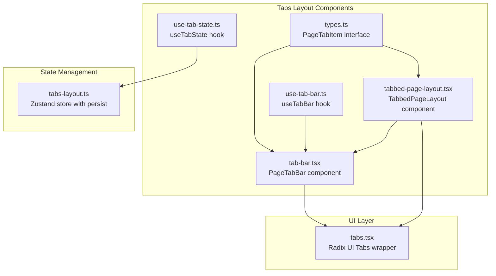
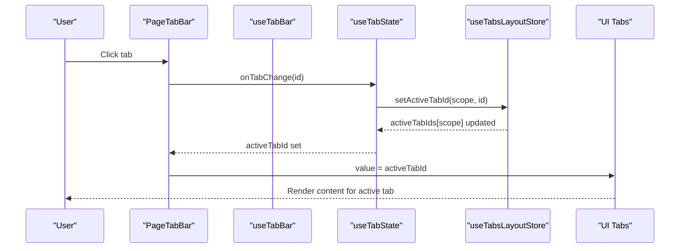
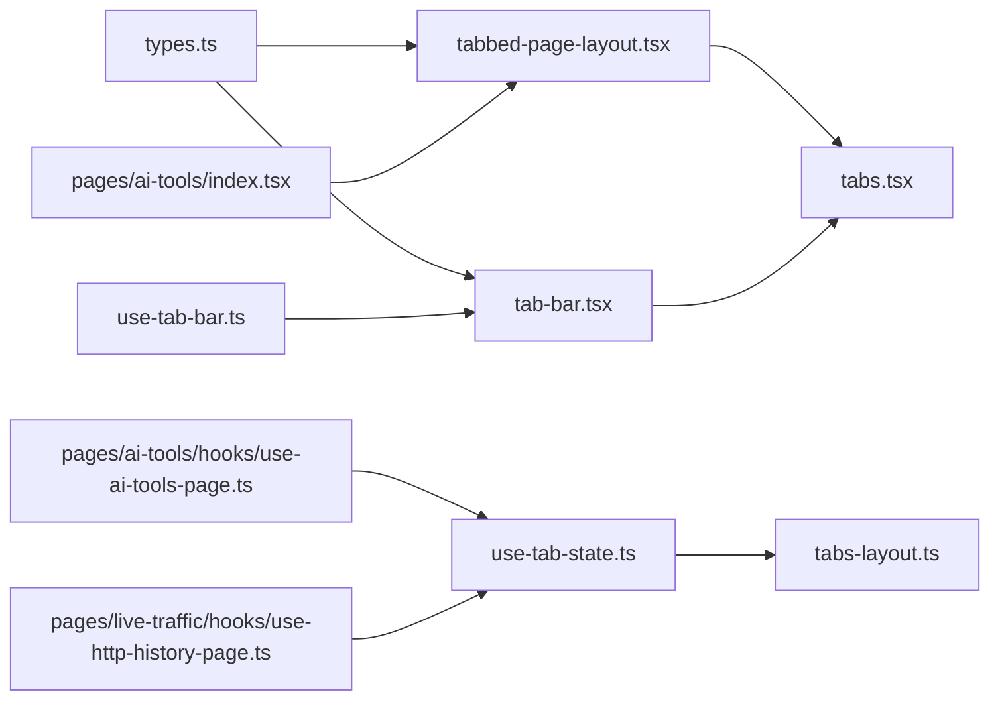

# Tabs Layout System

<cite>
**Referenced Files in This Document**
- [types.ts](file://src/components/tabs-layout/types.ts)
- [tab-bar.tsx](file://src/components/tabs-layout/tab-bar.tsx)
- [tabbed-page-layout.tsx](file://src/components/tabs-layout/tabbed-page-layout.tsx)
- [use-tab-bar.ts](file://src/components/tabs-layout/use-tab-bar.ts)
- [use-tab-state.ts](file://src/components/tabs-layout/use-tab-state.ts)
- [tabs-layout.ts](file://src/stores/tabs-layout.ts)
- [tabs.tsx](file://src/components/ui/tabs.tsx)
- [index.tsx](file://src/pages/ai-tools/index.tsx)
- [use-ai-tools-page.ts](file://src/pages/ai-tools/hooks/use-ai-tools-page.ts)
- [constants.ts](file://src/pages/ai-tools/constants.ts)
- [use-http-history-page.ts](file://src/pages/live-traffic/hooks/use-http-history-page.ts)
</cite>

## Table of Contents
1. [Introduction](#introduction)
2. [Project Structure](#project-structure)
3. [Core Components](#core-components)
4. [Architecture Overview](#architecture-overview)
5. [Detailed Component Analysis](#detailed-component-analysis)
6. [Dependency Analysis](#dependency-analysis)
7. [Performance Considerations](#performance-considerations)
8. [Accessibility Features](#accessibility-features)
9. [Extending the Tab System](#extending-the-tab-system)
10. [Troubleshooting Guide](#troubleshooting-guide)
11. [Conclusion](#conclusion)

## Introduction
This document describes AppRecon's tabs layout system architecture. It covers the tab bar component implementation, tabbed page layout for content organization, TypeScript types, and two custom hooks: useTabBar for interaction logic and useTabState for state persistence. It also documents tab persistence mechanisms, session restoration, memory management, accessibility features, and guidelines for extending the tab system with custom tab types and behaviors.

## Project Structure
The tabs layout system is organized under src/components/tabs-layout with supporting UI components and state management:

- Type definitions for tab items
- Tab bar component with rendering, active state, and dynamic editing
- Tabbed page layout wrapper integrating the tab bar with content area
- Custom hooks for tab interaction and state persistence
- Zustand store for persistent tab state across sessions
- UI tabs primitive wrapper used for content switching

**Diagram sources**
- [types.ts:1-7](file://src/components/tabs-layout/types.ts#L1-L7)
- [tab-bar.tsx:1-202](file://src/components/tabs-layout/tab-bar.tsx#L1-L202)
- [tabbed-page-layout.tsx:1-57](file://src/components/tabs-layout/tabbed-page-layout.tsx#L1-L57)
- [use-tab-bar.ts:1-106](file://src/components/tabs-layout/use-tab-bar.ts#L1-L106)
- [use-tab-state.ts:1-38](file://src/components/tabs-layout/use-tab-state.ts#L1-L38)
- [tabs.tsx:1-67](file://src/components/ui/tabs.tsx#L1-L67)
- [tabs-layout.ts:1-29](file://src/stores/tabs-layout.ts#L1-L29)

**Section sources**
- [types.ts:1-7](file://src/components/tabs-layout/types.ts#L1-L7)
- [tab-bar.tsx:1-202](file://src/components/tabs-layout/tab-bar.tsx#L1-L202)
- [tabbed-page-layout.tsx:1-57](file://src/components/tabs-layout/tabbed-page-layout.tsx#L1-L57)
- [use-tab-bar.ts:1-106](file://src/components/tabs-layout/use-tab-bar.ts#L1-L106)
- [use-tab-state.ts:1-38](file://src/components/tabs-layout/use-tab-state.ts#L1-L38)
- [tabs.tsx:1-67](file://src/components/ui/tabs.tsx#L1-L67)
- [tabs-layout.ts:1-29](file://src/stores/tabs-layout.ts#L1-L29)

## Core Components
- PageTabItem: Defines the shape of a tab with id, name, optional disabled and closable flags.
- PageTabBar: Renders individual tabs, handles click events, context menu actions (rename, close, close tabs to left/right), and scrolling indicators.
- TabbedPageLayout: Wraps the tab bar and content area, passing through tab-related callbacks and props.
- useTabBar: Manages editing state, focus management, scroll indicators, and emits rename/close events.
- useTabState: Provides active tab selection with persistence via a scoped store and fallback logic.
- UI Tabs: Radix UI Tabs wrapper used for content switching based on active tab id.

Key responsibilities:
- Rendering and styling of tabs with active state indication
- Dynamic tab creation and contextual actions
- Content organization and state synchronization
- Persistence of active tab per scope
- Accessibility-compliant interaction model

**Section sources**
- [types.ts:1-7](file://src/components/tabs-layout/types.ts#L1-L7)
- [tab-bar.tsx:17-26](file://src/components/tabs-layout/tab-bar.tsx#L17-L26)
- [tabbed-page-layout.tsx:8-20](file://src/components/tabs-layout/tabbed-page-layout.tsx#L8-L20)
- [use-tab-bar.ts:4-8](file://src/components/tabs-layout/use-tab-bar.ts#L4-L8)
- [use-tab-state.ts:12-37](file://src/components/tabs-layout/use-tab-state.ts#L12-L37)
- [tabs.tsx:8-66](file://src/components/ui/tabs.tsx#L8-L66)

## Architecture Overview
The system integrates a custom tab bar with Radix UI Tabs for content switching. State is persisted using a scoped Zustand store with local storage persistence. The useTabState hook centralizes active tab selection and persistence, while useTabBar encapsulates UI interaction logic for the tab bar.

**Diagram sources**
- [tab-bar.tsx:38-49](file://src/components/tabs-layout/tab-bar.tsx#L38-L49)
- [use-tab-bar.ts:10](file://src/components/tabs-layout/use-tab-bar.ts#L10)
- [use-tab-state.ts:12-31](file://src/components/tabs-layout/use-tab-state.ts#L12-L31)
- [tabs-layout.ts:9-28](file://src/stores/tabs-layout.ts#L9-L28)
- [tabs.tsx:8-19](file://src/components/ui/tabs.tsx#L8-L19)

## Detailed Component Analysis

### PageTabItem Type Definition
Defines the minimal contract for a tab:
- id: Unique identifier
- name: Display label
- disabled?: Prevents interaction
- closable?: Controls visibility of close button

Complexity considerations:
- O(1) lookup for active tab by id
- Equality checks for persistence and fallback logic

**Section sources**
- [types.ts:1-7](file://src/components/tabs-layout/types.ts#L1-L7)

### PageTabBar Component
Responsibilities:
- Renders tabs with active state styling
- Handles click to change active tab
- Context menu support for rename, close, and bulk close actions
- Editing mode for renaming tabs with input field and keyboard shortcuts
- Scroll indicators and horizontal scrolling behavior

Rendering logic:
- Active tab receives distinct styling and shadow
- Disabled tabs are visually muted and non-interactive
- Close button appears only when enabled and closable
- Context menu items appear conditionally based on capabilities

Interaction flow:
- Clicking a tab invokes onTabChange
- Context menu actions trigger callbacks (rename, close, close tabs to left/right)
- Editing mode uses controlled input with Enter to confirm and Escape to cancel

Accessibility:
- Buttons include aria-labels for screen readers
- Focus management during editing ensures immediate selection and focus

**Section sources**
- [tab-bar.tsx:28-118](file://src/components/tabs-layout/tab-bar.tsx#L28-L118)
- [tab-bar.tsx:120-201](file://src/components/tabs-layout/tab-bar.tsx#L120-L201)

### TabbedPageLayout Component
Responsibilities:
- Wraps the tab bar and content area
- Passes through tab configuration and callbacks
- Integrates with UI Tabs for content switching
- Applies consistent styling for layout and content container

Usage pattern:
- Accepts children as tab content
- Exposes className and contentClassName for customization

**Section sources**
- [tabbed-page-layout.tsx:22-56](file://src/components/tabs-layout/tabbed-page-layout.tsx#L22-L56)

### useTabBar Hook
Responsibilities:
- Manage editing state (editingTabId, editingName)
- Focus management for editing input
- Scroll indicator computation (canScrollLeft, canScrollRight)
- Emit rename and close actions

Key behaviors:
- Focus input on edit start and select text
- Synchronize editing state with current tabs
- Validate and emit rename only when name differs and is non-empty
- Respect disabled state for editing initiation

**Section sources**
- [use-tab-bar.ts:10-105](file://src/components/tabs-layout/use-tab-bar.ts#L10-L105)

### useTabState Hook
Responsibilities:
- Derive active tab id from persisted store or fallback to first tab
- Persist active tab id per scope using a scoped key
- Provide setter to update active tab id

Scope mechanism:
- Scope is derived from tab ids joined by ':'
- Allows multiple independent tab groups within the same page

Persistence:
- Uses Zustand store with persist middleware
- Partializes state to avoid storing unnecessary data

**Section sources**
- [use-tab-state.ts:8-10](file://src/components/tabs-layout/use-tab-state.ts#L8-L10)
- [use-tab-state.ts:12-37](file://src/components/tabs-layout/use-tab-state.ts#L12-L37)

### UI Tabs Wrapper
Responsibilities:
- Thin wrapper around Radix UI Tabs primitives
- Provides Tabs, TabsList, TabsTrigger, and TabsContent components
- Ensures consistent styling and accessibility attributes

Integration:
- TabbedPageLayout passes activeTabId as value to Tabs
- onValueChange triggers tab change callbacks

**Section sources**
- [tabs.tsx:8-66](file://src/components/ui/tabs.tsx#L8-L66)

### Zustand Store for Tabs Layout
Responsibilities:
- Maintain activeTabIds map keyed by scope
- Provide setter to update active tab id for a given scope
- Persist state to local storage with partialize

Persistence:
- Store name: "0xbuffer-tabs-layout"
- Only persists activeTabIds to minimize storage footprint

**Section sources**
- [tabs-layout.ts:4-7](file://src/stores/tabs-layout.ts#L4-L7)
- [tabs-layout.ts:9-28](file://src/stores/tabs-layout.ts#L9-L28)

### Example: AI Tools Page Integration
Demonstrates:
- Defining static tabs configuration
- Using useTabState to manage active tab
- Passing callbacks to TabbedPageLayout
- Rendering content inside TabsContent

Implementation highlights:
- Tabs array is imported from constants
- useTabState returns activeTabId and setter
- TabbedPageLayout receives tabs, activeTabId, and onTabChange

**Section sources**
- [index.tsx:8-23](file://src/pages/ai-tools/index.tsx#L8-L23)
- [use-ai-tools-page.ts:4-12](file://src/pages/ai-tools/hooks/use-ai-tools-page.ts#L4-L12)
- [constants.ts:3-5](file://src/pages/ai-tools/constants.ts#L3-L5)

### Example: Live Traffic Target Tabs
Demonstrates:
- Dynamic tabs based on active targets
- Scoped persistence with explicit scope string
- Conditional closable behavior
- Integration with external stores and effects

Implementation highlights:
- Tabs computed from active targets with special "All History" tab
- useTabState called with custom scope "http-history-target-tabs"
- setActiveScope synchronized with active tab selection

**Section sources**
- [use-http-history-page.ts:31-41](file://src/pages/live-traffic/hooks/use-http-history-page.ts#L31-L41)
- [use-http-history-page.ts:41](file://src/pages/live-traffic/hooks/use-http-history-page.ts#L41)

## Dependency Analysis
The system exhibits clean separation of concerns:
- Components depend on types and hooks
- Hooks depend on the store for persistence
- UI Tabs is a leaf dependency for content switching
- Pages integrate components and hooks for specific use cases

**Diagram sources**
- [types.ts:1-7](file://src/components/tabs-layout/types.ts#L1-L7)
- [tab-bar.tsx:13](file://src/components/tabs-layout/tab-bar.tsx#L13)
- [tabbed-page-layout.tsx:5](file://src/components/tabs-layout/tabbed-page-layout.tsx#L5)
- [use-tab-bar.ts:1](file://src/components/tabs-layout/use-tab-bar.ts#L1)
- [use-tab-state.ts:2](file://src/components/tabs-layout/use-tab-state.ts#L2)
- [tabs-layout.ts:2](file://src/stores/tabs-layout.ts#L2)
- [tabs.tsx:4](file://src/components/ui/tabs.tsx#L4)
- [index.tsx:5](file://src/pages/ai-tools/index.tsx#L5)
- [use-ai-tools-page.ts:2](file://src/pages/ai-tools/hooks/use-ai-tools-page.ts#L2)
- [use-http-history-page.ts:2](file://src/pages/live-traffic/hooks/use-http-history-page.ts#L2)

**Section sources**
- [tab-bar.tsx:13](file://src/components/tabs-layout/tab-bar.tsx#L13)
- [use-tab-bar.ts:1](file://src/components/tabs-layout/use-tab-bar.ts#L1)
- [use-tab-state.ts:2](file://src/components/tabs-layout/use-tab-state.ts#L2)
- [tabs-layout.ts:2](file://src/stores/tabs-layout.ts#L2)
- [tabs.tsx:4](file://src/components/ui/tabs.tsx#L4)
- [index.tsx:5](file://src/pages/ai-tools/index.tsx#L5)
- [use-ai-tools-page.ts:2](file://src/pages/ai-tools/hooks/use-ai-tools-page.ts#L2)
- [use-http-history-page.ts:2](file://src/pages/live-traffic/hooks/use-http-history-page.ts#L2)

## Performance Considerations
- Efficient rendering: TabBar memoizes renderTab and uses shallow prop comparisons to minimize re-renders.
- Scrolling indicators: ResizeObserver and scroll listener compute indicators efficiently; cleanup prevents leaks.
- Editing state: Controlled input with trim and diff checks avoids unnecessary renames.
- Persistence: Zustand persist writes only activeTabIds, reducing storage overhead.
- Scope-based persistence: Scopes isolate state, preventing cross-page interference and enabling multiple independent tab groups.

## Accessibility Features
Keyboard navigation:
- Tab switching via clicks and programmatic updates
- Editing mode supports Enter to confirm and Escape to cancel

ARIA attributes:
- Buttons include aria-labels for rename and delete actions
- UI Tabs primitives provide built-in ARIA roles and states

Focus management:
- On entering edit mode, input receives focus and selects text
- Editing state cleared when tab is removed to prevent orphaned focus

Screen reader support:
- Clear labeling for actionable buttons
- Active tab state reflected via visual and semantic cues

**Section sources**
- [tab-bar.tsx:91](file://src/components/tabs-layout/tab-bar.tsx#L91)
- [tab-bar.tsx:111](file://src/components/tabs-layout/tab-bar.tsx#L111)
- [use-tab-bar.ts:45-52](file://src/components/tabs-layout/use-tab-bar.ts#L45-L52)

## Extending the Tab System
Guidelines for adding custom tab types and behaviors:
- Define tab shapes: Extend PageTabItem or introduce new interfaces for specialized tabs (e.g., with icon, badge, or custom metadata).
- Add conditional rendering: Extend TabBar to render additional elements (icon, badge) based on tab properties.
- Context menu customization: Use renderTabContextMenuItems to inject custom actions per tab type.
- State scoping: Use custom scope strings in useTabState to maintain separate active tab selections for different contexts.
- Persistence: Leverage the existing store for additional metadata if needed, ensuring partialize excludes heavy data.
- Content integration: Wrap content in TabsContent with appropriate values aligned to tab ids.

Example extension points:
- Icon and badge rendering in TabBar
- Custom context menu actions for specialized tabs
- Scoped persistence for multiple tab groups on a single page

**Section sources**
- [tab-bar.tsx:152-183](file://src/components/tabs-layout/tab-bar.tsx#L152-L183)
- [use-tab-state.ts:8-10](file://src/components/tabs-layout/use-tab-state.ts#L8-L10)

## Troubleshooting Guide
Common issues and resolutions:
- Active tab not persisting: Verify scope string uniqueness and ensure tabs array order remains consistent; check store persistence name and partialize configuration.
- Editing not focusing: Confirm editingTabId is set and useEffect runs; ensure ref is attached to input element.
- Close action not firing: Ensure onTabClose callback is provided and tab is not disabled or explicitly closable=false.
- Context menu missing actions: Confirm capability flags (rename, close, close tabs to left/right) and presence of custom items.
- Memory leaks: Ensure scroll listeners and observers are cleaned up in useTabBar; verify component unmounts properly.

**Section sources**
- [use-tab-bar.ts:39-43](file://src/components/tabs-layout/use-tab-bar.ts#L39-L43)
- [tabs-layout.ts:21-27](file://src/stores/tabs-layout.ts#L21-L27)

## Conclusion
AppRecon's tabs layout system provides a robust, accessible, and extensible foundation for organizing page content. The combination of a customizable tab bar, scoped state persistence, and thin UI wrappers enables consistent behavior across pages while allowing flexibility for specialized tab types and workflows.