# UI Primitives Library

<cite>
**Referenced Files in This Document**
- [button.tsx](file://src/components/ui/button.tsx)
- [input.tsx](file://src/components/ui/input.tsx)
- [form.tsx](file://src/components/ui/form.tsx)
- [dialog.tsx](file://src/components/ui/dialog.tsx)
- [card.tsx](file://src/components/ui/card.tsx)
- [badge.tsx](file://src/components/ui/badge.tsx)
- [alert.tsx](file://src/components/ui/alert.tsx)
- [avatar.tsx](file://src/components/ui/avatar.tsx)
- [checkbox.tsx](file://src/components/ui/checkbox.tsx)
- [radio-group.tsx](file://src/components/ui/radio-group.tsx)
- [select.tsx](file://src/components/ui/select.tsx)
- [switch.tsx](file://src/components/ui/switch.tsx)
- [table.tsx](file://src/components/ui/table.tsx)
- [tabs.tsx](file://src/components/ui/tabs.tsx)
- [toast.tsx](file://src/components/ui/toast.tsx)
- [tooltip.tsx](file://src/components/ui/tooltip.tsx)
- [popover.tsx](file://src/components/ui/popover.tsx)
- [dropdown-menu.tsx](file://src/components/ui/dropdown-menu.tsx)
- [context-menu.tsx](file://src/components/ui/context-menu.tsx)
- [navigation-menu.tsx](file://src/components/ui/navigation-menu.tsx)
- [menubar.tsx](file://src/components/ui/menubar.tsx)
- [sidebar.tsx](file://src/components/ui/sidebar.tsx)
- [sheet.tsx](file://src/components/ui/sheet.tsx)
- [drawer.tsx](file://src/components/ui/drawer.tsx)
- [calendar.tsx](file://src/components/ui/calendar.tsx)
- [slider.tsx](file://src/components/ui/slider.tsx)
- [progress.tsx](file://src/components/ui/progress.tsx)
- [spinner.tsx](file://src/components/ui/spinner.tsx)
- [accordion.tsx](file://src/components/ui/accordion.tsx)
- [collapsible.tsx](file://src/components/ui/collapsible.tsx)
- [hover-card.tsx](file://src/components/ui/hover-card.tsx)
- [resizable.tsx](file://src/components/ui/resizable.tsx)
- [separator.tsx](file://src/components/ui/separator.tsx)
- [breadcrumb.tsx](file://src/components/ui/breadcrumb.tsx)
- [pagination.tsx](file://src/components/ui/pagination.tsx)
- [kbd.tsx](file://src/components/ui/kbd.tsx)
- [aspect-ratio.tsx](file://src/components/ui/aspect-ratio.tsx)
- [carousel.tsx](file://src/components/ui/carousel.tsx)
- [skeleton.tsx](file://src/components/ui/skeleton.tsx)
- [ripple.tsx](file://src/components/ui/ripple.tsx)
- [scroll-area.tsx](file://src/components/ui/scroll-area.tsx)
- [item.tsx](file://src/components/ui/item.tsx)
- [field.tsx](file://src/components/ui/field.tsx)
- [label.tsx](file://src/components/ui/label.tsx)
- [text-editor.tsx](file://src/components/ui/text-editor.tsx)
- [chat-input.tsx](file://src/components/ui/chat-input.tsx)
- [chat-message.tsx](file://src/components/ui/chat-message.tsx)
- [sonner.tsx](file://src/components/ui/sonner.tsx)
- [textarea.tsx](file://src/components/ui/textarea.tsx)
- [input-group.tsx](file://src/components/ui/input-group.tsx)
- [button-group.tsx](file://src/components/ui/button-group.tsx)
- [toggle.tsx](file://src/components/ui/toggle.tsx)
- [toggle-group.tsx](file://src/components/ui/toggle-group.tsx)
- [input-otp.tsx](file://src/components/ui/input-otp.tsx)
- [empty.tsx](file://src/components/ui/empty.tsx)
- [article-card.tsx](file://src/components/ui/article-card.tsx)
</cite>

## Table of Contents
1. [Introduction](#introduction)
2. [Project Structure](#project-structure)
3. [Core Components](#core-components)
4. [Architecture Overview](#architecture-overview)
5. [Detailed Component Analysis](#detailed-component-analysis)
6. [Dependency Analysis](#dependency-analysis)
7. [Performance Considerations](#performance-considerations)
8. [Troubleshooting Guide](#troubleshooting-guide)
9. [Conclusion](#conclusion)
10. [Appendices](#appendices)

## Introduction
This document describes AppRecon’s UI primitives library, a cohesive set of accessible, composable React components built on Radix UI and styled with Tailwind CSS. It covers component APIs, variants, styling approaches, accessibility features, and usage patterns. Practical examples demonstrate composition, customization, and integration with form validation. Guidance is included for responsive design, dark mode support, cross-browser compatibility, extending components, and maintaining design consistency.

## Project Structure
The UI primitives live under src/components/ui and are organized by feature/primitive. Each component:
- Uses Radix UI primitives for accessibility and interoperability
- Applies Tailwind classes for consistent styling
- Exposes a small, focused API with optional variants
- Includes data-slot attributes for reliable composition and testing

```mermaid
graph TB
subgraph "UI Primitives"
Btn["Button"]
Inp["Input"]
Frm["Form"]
Dlg["Dialog"]
C["Card"]
Bdg["Badge"]
Al["Alert"]
Av["Avatar"]
Chk["Checkbox"]
Rg["RadioGroup"]
Sel["Select"]
Sw["Switch"]
Tb["Table"]
Tabs["Tabs"]
Ts["Toast"]
Tool["Tooltip"]
Pop["Popover"]
Ddm["DropdownMenu"]
Ctx["ContextMenu"]
Nav["NavigationMenu"]
Mb["Menubar"]
Sb["Sidebar"]
Sh["Sheet"]
Dr["Drawer"]
Cal["Calendar"]
Sld["Slider"]
Prog["Progress"]
Spin["Spinner"]
Acc["Accordion"]
Col["Collapsible"]
Hc["HoverCard"]
Rz["Resizable"]
Sep["Separator"]
Br["Breadcrumb"]
Pg["Pagination"]
Kbd["Kbd"]
Ar["AspectRatio"]
Car["Carousel"]
Sk["Skeleton"]
Rp["Ripple"]
Sa["ScrollArea"]
It["Item"]
F["Field"]
Lbl["Label"]
Te["TextEditor"]
Ci["ChatInput"]
Cm["ChatMessage"]
Snr["Sonner"]
Ta["Textarea"]
Ig["InputGroup"]
Bg["ButtonGroup"]
Tog["Toggle"]
Tgg["ToggleGroup"]
Otp["InputOTP"]
Emp["Empty"]
Art["ArticleCard"]
end
```

**Section sources**
- [button.tsx:1-67](file://src/components/ui/button.tsx#L1-L67)
- [input.tsx:1-26](file://src/components/ui/input.tsx#L1-L26)
- [form.tsx:1-168](file://src/components/ui/form.tsx#L1-L168)
- [dialog.tsx:1-142](file://src/components/ui/dialog.tsx#L1-L142)
- [card.tsx:1-104](file://src/components/ui/card.tsx#L1-L104)
- [badge.tsx:1-52](file://src/components/ui/badge.tsx#L1-L52)
- [alert.tsx:1-77](file://src/components/ui/alert.tsx#L1-L77)
- [avatar.tsx:1-54](file://src/components/ui/avatar.tsx#L1-L54)
- [checkbox.tsx:1-33](file://src/components/ui/checkbox.tsx#L1-L33)
- [radio-group.tsx:1-46](file://src/components/ui/radio-group.tsx#L1-L46)
- [select.tsx:1-188](file://src/components/ui/select.tsx#L1-L188)
- [switch.tsx:1-32](file://src/components/ui/switch.tsx#L1-L32)
- [table.tsx:1-117](file://src/components/ui/table.tsx#L1-L117)
- [tabs.tsx:1-67](file://src/components/ui/tabs.tsx#L1-L67)
- [toast.tsx:1-131](file://src/components/ui/toast.tsx#L1-L131)
- [tooltip.tsx](file://src/components/ui/tooltip.tsx)
- [popover.tsx](file://src/components/ui/popover.tsx)
- [dropdown-menu.tsx](file://src/components/ui/dropdown-menu.tsx)
- [context-menu.tsx](file://src/components/ui/context-menu.tsx)
- [navigation-menu.tsx](file://src/components/ui/navigation-menu.tsx)
- [menubar.tsx](file://src/components/ui/menubar.tsx)
- [sidebar.tsx](file://src/components/ui/sidebar.tsx)
- [sheet.tsx](file://src/components/ui/sheet.tsx)
- [drawer.tsx](file://src/components/ui/drawer.tsx)
- [calendar.tsx](file://src/components/ui/calendar.tsx)
- [slider.tsx](file://src/components/ui/slider.tsx)
- [progress.tsx](file://src/components/ui/progress.tsx)
- [spinner.tsx](file://src/components/ui/spinner.tsx)
- [accordion.tsx](file://src/components/ui/accordion.tsx)
- [collapsible.tsx](file://src/components/ui/collapsible.tsx)
- [hover-card.tsx](file://src/components/ui/hover-card.tsx)
- [resizable.tsx](file://src/components/ui/resizable.tsx)
- [separator.tsx](file://src/components/ui/separator.tsx)
- [breadcrumb.tsx](file://src/components/ui/breadcrumb.tsx)
- [pagination.tsx](file://src/components/ui/pagination.tsx)
- [kbd.tsx](file://src/components/ui/kbd.tsx)
- [aspect-ratio.tsx](file://src/components/ui/aspect-ratio.tsx)
- [carousel.tsx](file://src/components/ui/carousel.tsx)
- [skeleton.tsx](file://src/components/ui/skeleton.tsx)
- [ripple.tsx](file://src/components/ui/ripple.tsx)
- [scroll-area.tsx](file://src/components/ui/scroll-area.tsx)
- [item.tsx](file://src/components/ui/item.tsx)
- [field.tsx](file://src/components/ui/field.tsx)
- [label.tsx](file://src/components/ui/label.tsx)
- [text-editor.tsx](file://src/components/ui/text-editor.tsx)
- [chat-input.tsx](file://src/components/ui/chat-input.tsx)
- [chat-message.tsx](file://src/components/ui/chat-message.tsx)
- [sonner.tsx](file://src/components/ui/sonner.tsx)
- [textarea.tsx](file://src/components/ui/textarea.tsx)
- [input-group.tsx](file://src/components/ui/input-group.tsx)
- [button-group.tsx](file://src/components/ui/button-group.tsx)
- [toggle.tsx](file://src/components/ui/toggle.tsx)
- [toggle-group.tsx](file://src/components/ui/toggle-group.tsx)
- [input-otp.tsx](file://src/components/ui/input-otp.tsx)
- [empty.tsx](file://src/components/ui/empty.tsx)
- [article-card.tsx](file://src/components/ui/article-card.tsx)

## Core Components
This section summarizes the foundational primitives and their primary props, variants, and styling patterns.

- Button
  - Props: className, variant, size, asChild
  - Variants: default, destructive, outline, secondary, ghost, link
  - Sizes: default, sm, xs, lg, icon, icon-sm, icon-lg
  - Styling: class-variance-authority variants, focus-visible rings, aria-invalid integration
  - Accessibility: radix slot, focus-visible ring, disabled states
  - Example usage: render as a child via asChild, combine with icons

- Input
  - Props: className, type
  - Styling: focus-visible borders and rings, aria-invalid integration, dark mode background
  - Accessibility: controlled autocomplete/capitalize/spellcheck, focus-visible ring
  - Example usage: wrap with FormItem/FormLabel for validation feedback

- Form (FormProvider, FormField, FormLabel, FormControl, FormDescription, FormMessage)
  - Integrates react-hook-form with Radix UI labels and slots
  - Accessibility: aria-describedby, aria-invalid, labelled-by ids
  - Example usage: wrap fields with FormField; use FormLabel/FormMessage for validation messaging

- Dialog
  - Components: Root, Trigger, Portal, Close, Overlay, Content, Header, Footer, Title, Description
  - Props: showCloseButton, portalContainer
  - Styling: animate-in/out, centering, z-index, close button with sr-only
  - Accessibility: overlay click-to-close, focus trapping via Radix UI

- Card
  - Props: className, size (default, sm)
  - Slots: header, title, description, action, content, footer
  - Styling: ring, rounded, responsive paddings, grid layouts for header

- Badge
  - Props: className, variant, asChild
  - Variants: default, secondary, destructive, outline, yellow
  - Styling: rounded-full, focus-visible ring, aria-invalid integration

- Alert
  - Props: className, variant
  - Variants: default, destructive
  - Slots: title, description, action
  - Styling: grid layout, icon alignment, destructive variant

- Avatar
  - Components: Root, Image, Fallback
  - Styling: rounded-full, overflow-hidden, aspect-square image

- Checkbox
  - Props: className
  - Styling: indicator with check icon, focus-visible ring, checked state styling

- RadioGroup
  - Components: Root, Item
  - Styling: indicator with circle, focus-visible ring, checked state

- Select
  - Components: Root, Group, Value, Trigger (size), Content (position, align), Label, Item, Separator, ScrollUp/Down buttons
  - Props: size, position, align
  - Styling: viewport sizing, popper offsets, item indicators

- Switch
  - Props: className
  - Styling: thumb translation, focus-visible ring

- Table
  - Components: Table, TableHeader, TableBody, TableFooter, TableRow, TableHead, TableCell, TableCaption
  - Styling: hover and selected states, responsive container

- Tabs
  - Components: Root, List, Trigger, Content
  - Styling: active state backgrounds, focus-visible ring

- Toast
  - Components: Provider, Viewport, Toast, ToastTitle, ToastDescription, ToastClose, ToastAction
  - Variants: default, destructive
  - Styling: swipe animations, destructive variant

- Tooltip, Popover, DropdownMenu, ContextMenu, NavigationMenu, Menubar
  - Components leverage Radix UI primitives; styling follows consistent spacing and ring/focus patterns
  - Accessibility: focus management, portal rendering, keyboard navigation

- Sidebar, Sheet, Drawer
  - Components: Sheet, Drawer, Sidebar
  - Styling: overlay, portal, slide-in animations, responsive positioning

- Calendar, Slider, Progress, Spinner
  - Components: Calendar, Slider, Progress, Spinner
  - Styling: focus-visible rings, transitions, accessible value semantics

- Accordion, Collapsible, HoverCard, Resizable, Separator
  - Components: Accordion, Collapsible, HoverCard, Resizable, Separator
  - Styling: focus-visible rings, transitions, content clipping

- Breadcrumb, Pagination, Kbd, AspectRatio, Carousel, Skeleton, Ripple, ScrollArea, Item, Field, Label
  - Components: Breadcrumb, Pagination, Kbd, AspectRatio, Carousel, Skeleton, Ripple, ScrollArea, Item, Field, Label
  - Styling: focus-visible rings, responsive layouts, semantic roles

- TextEditor, ChatInput, ChatMessage, Sonner
  - Components: TextEditor, ChatInput, ChatMessage, Sonner
  - Styling: focus-visible rings, interactive states, content containers

- Textarea, InputGroup, ButtonGroup, Toggle, ToggleGroup, InputOTP, Empty, ArticleCard
  - Components: Textarea, InputGroup, ButtonGroup, Toggle, ToggleGroup, InputOTP, Empty, ArticleCard
  - Styling: focus-visible rings, grouped controls, OTP spacing

**Section sources**
- [button.tsx:1-67](file://src/components/ui/button.tsx#L1-L67)
- [input.tsx:1-26](file://src/components/ui/input.tsx#L1-L26)
- [form.tsx:1-168](file://src/components/ui/form.tsx#L1-L168)
- [dialog.tsx:1-142](file://src/components/ui/dialog.tsx#L1-L142)
- [card.tsx:1-104](file://src/components/ui/card.tsx#L1-L104)
- [badge.tsx:1-52](file://src/components/ui/badge.tsx#L1-L52)
- [alert.tsx:1-77](file://src/components/ui/alert.tsx#L1-L77)
- [avatar.tsx:1-54](file://src/components/ui/avatar.tsx#L1-L54)
- [checkbox.tsx:1-33](file://src/components/ui/checkbox.tsx#L1-L33)
- [radio-group.tsx:1-46](file://src/components/ui/radio-group.tsx#L1-L46)
- [select.tsx:1-188](file://src/components/ui/select.tsx#L1-L188)
- [switch.tsx:1-32](file://src/components/ui/switch.tsx#L1-L32)
- [table.tsx:1-117](file://src/components/ui/table.tsx#L1-L117)
- [tabs.tsx:1-67](file://src/components/ui/tabs.tsx#L1-L67)
- [toast.tsx:1-131](file://src/components/ui/toast.tsx#L1-L131)

## Architecture Overview
The primitives follow a consistent pattern:
- Each component wraps a Radix UI primitive or native element
- Styling is applied via Tailwind classes and composed with cn utility
- Focus-visible rings and aria-invalid states unify interaction feedback
- Data-slot attributes enable reliable composition and testing
- Variants are defined with class-variance-authority for predictable overrides

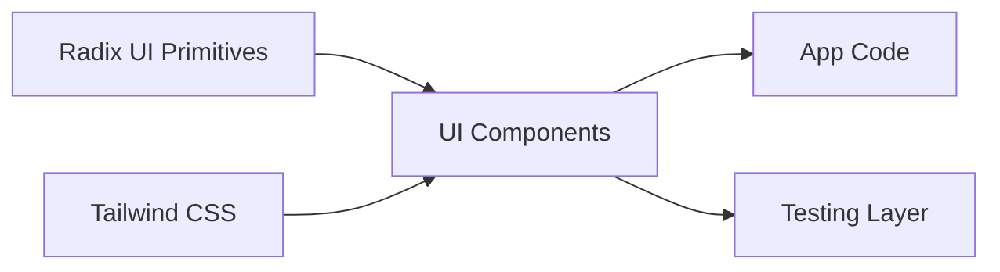

[No sources needed since this diagram shows conceptual workflow, not actual code structure]

## Detailed Component Analysis

### Button
- Purpose: Base action element with variants and sizes
- Props: className, variant, size, asChild
- Variants: default, destructive, outline, secondary, ghost, link
- Sizes: default, sm, xs, lg, icon, icon-sm, icon-lg
- Styling: class-variance-authority, focus-visible ring, aria-invalid integration
- Accessibility: radix slot, focus-visible ring, disabled states

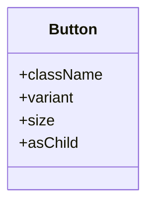

**Diagram sources**
- [button.tsx:40-67](file://src/components/ui/button.tsx#L40-L67)

**Section sources**
- [button.tsx:1-67](file://src/components/ui/button.tsx#L1-L67)

### Input
- Purpose: Text input with consistent focus and validation styling
- Props: className, type
- Styling: focus-visible borders and rings, aria-invalid integration, dark mode background
- Accessibility: controlled autocomplete/capitalize/spellcheck, focus-visible ring

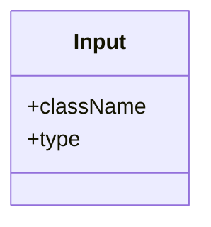

**Diagram sources**
- [input.tsx:5-26](file://src/components/ui/input.tsx#L5-L26)

**Section sources**
- [input.tsx:1-26](file://src/components/ui/input.tsx#L1-L26)

### Form Integration
- Purpose: Provide a structured way to compose form fields with labels, descriptions, and messages
- Components: Form, FormField, FormItem, FormLabel, FormControl, FormDescription, FormMessage
- Hooks: useFormField
- Accessibility: aria-describedby, aria-invalid, labelled-by ids

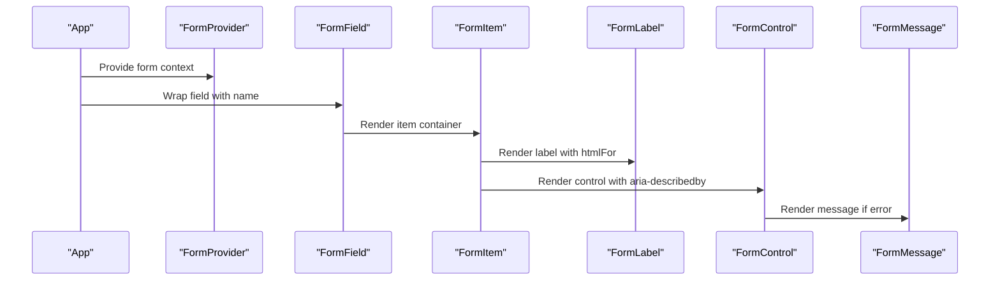

**Diagram sources**
- [form.tsx:19-167](file://src/components/ui/form.tsx#L19-L167)

**Section sources**
- [form.tsx:1-168](file://src/components/ui/form.tsx#L1-L168)

### Dialog
- Purpose: Modal overlay with header/footer/title/description slots
- Components: Root, Trigger, Portal, Close, Overlay, Content, Header, Footer, Title, Description
- Props: showCloseButton, portalContainer
- Styling: animate-in/out, centering, z-index, close button with sr-only

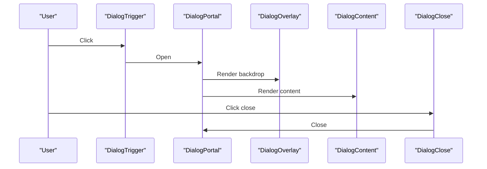

**Diagram sources**
- [dialog.tsx:9-141](file://src/components/ui/dialog.tsx#L9-L141)

**Section sources**
- [dialog.tsx:1-142](file://src/components/ui/dialog.tsx#L1-L142)

### Card
- Purpose: Container with header/title/content/footer slots and size variants
- Props: className, size (default, sm)
- Slots: header, title, description, action, content, footer
- Styling: ring, rounded, responsive paddings, grid layouts for header

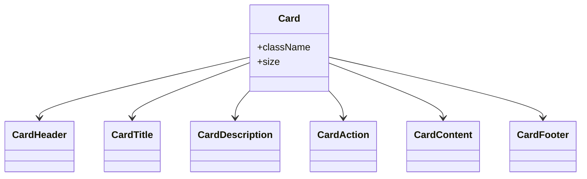

**Diagram sources**
- [card.tsx:5-103](file://src/components/ui/card.tsx#L5-L103)

**Section sources**
- [card.tsx:1-104](file://src/components/ui/card.tsx#L1-L104)

### Badge
- Purpose: Label-like indicator with color variants
- Props: className, variant, asChild
- Variants: default, secondary, destructive, outline, yellow

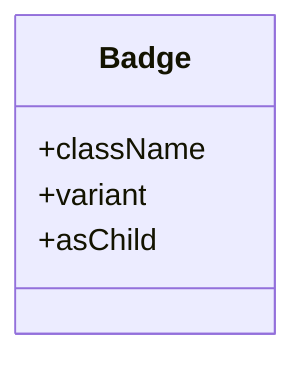

**Diagram sources**
- [badge.tsx:30-51](file://src/components/ui/badge.tsx#L30-L51)

**Section sources**
- [badge.tsx:1-52](file://src/components/ui/badge.tsx#L1-L52)

### Alert
- Purpose: Non-modal contextual notice with optional action
- Props: className, variant
- Variants: default, destructive
- Slots: title, description, action

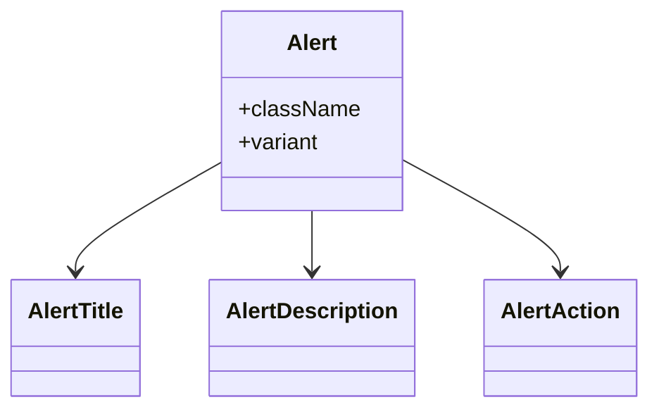

**Diagram sources**
- [alert.tsx:22-76](file://src/components/ui/alert.tsx#L22-L76)

**Section sources**
- [alert.tsx:1-77](file://src/components/ui/alert.tsx#L1-L77)

### Avatar
- Purpose: User identity with fallback
- Components: Root, Image, Fallback

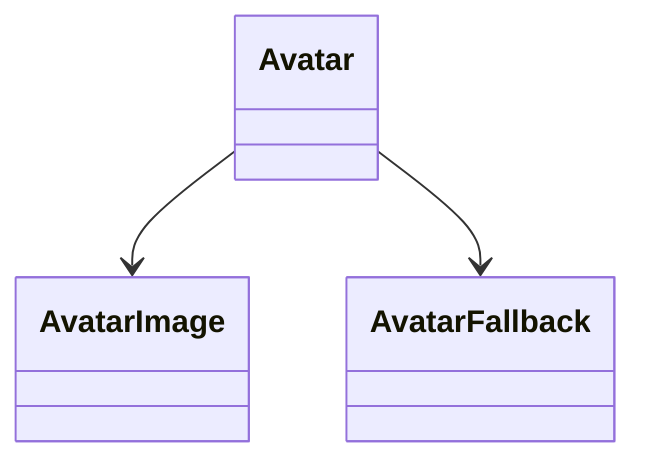

**Diagram sources**
- [avatar.tsx:8-53](file://src/components/ui/avatar.tsx#L8-L53)

**Section sources**
- [avatar.tsx:1-54](file://src/components/ui/avatar.tsx#L1-L54)

### Checkbox
- Purpose: Binary selection with visual indicator
- Props: className

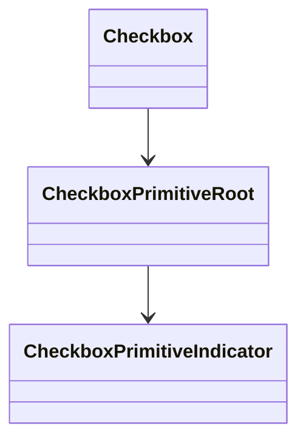

**Diagram sources**
- [checkbox.tsx:9-32](file://src/components/ui/checkbox.tsx#L9-L32)

**Section sources**
- [checkbox.tsx:1-33](file://src/components/ui/checkbox.tsx#L1-L33)

### RadioGroup
- Purpose: Single selection among options
- Components: Root, Item

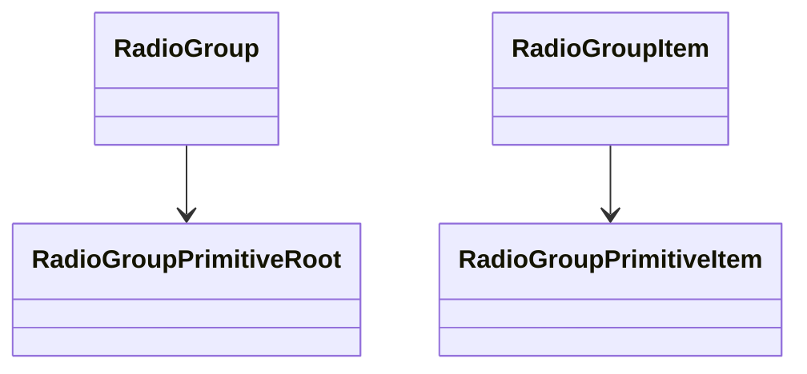

**Diagram sources**
- [radio-group.tsx:9-45](file://src/components/ui/radio-group.tsx#L9-L45)

**Section sources**
- [radio-group.tsx:1-46](file://src/components/ui/radio-group.tsx#L1-L46)

### Select
- Purpose: Dropdown selection with scrolling and grouping
- Components: Root, Group, Value, Trigger (size), Content (position, align), Label, Item, Separator, ScrollUp/Down buttons

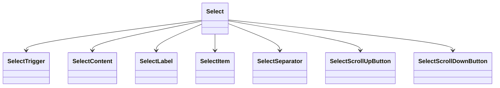

**Diagram sources**
- [select.tsx:9-187](file://src/components/ui/select.tsx#L9-L187)

**Section sources**
- [select.tsx:1-188](file://src/components/ui/select.tsx#L1-L188)

### Switch
- Purpose: Toggle switch with animated thumb
- Props: className

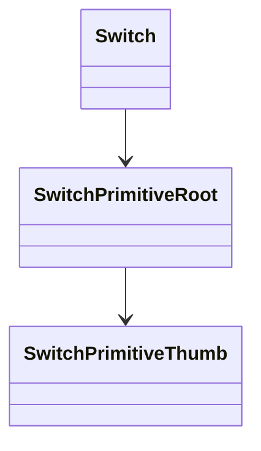

**Diagram sources**
- [switch.tsx:8-31](file://src/components/ui/switch.tsx#L8-L31)

**Section sources**
- [switch.tsx:1-32](file://src/components/ui/switch.tsx#L1-L32)

### Table
- Purpose: Structured data display with responsive wrapper
- Components: Table, TableHeader, TableBody, TableFooter, TableRow, TableHead, TableCell, TableCaption

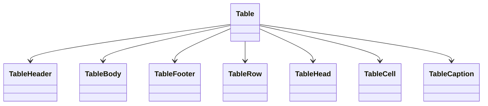

**Diagram sources**
- [table.tsx:7-116](file://src/components/ui/table.tsx#L7-L116)

**Section sources**
- [table.tsx:1-117](file://src/components/ui/table.tsx#L1-L117)

### Tabs
- Purpose: Organize content into selectable sections
- Components: Root, List, Trigger, Content

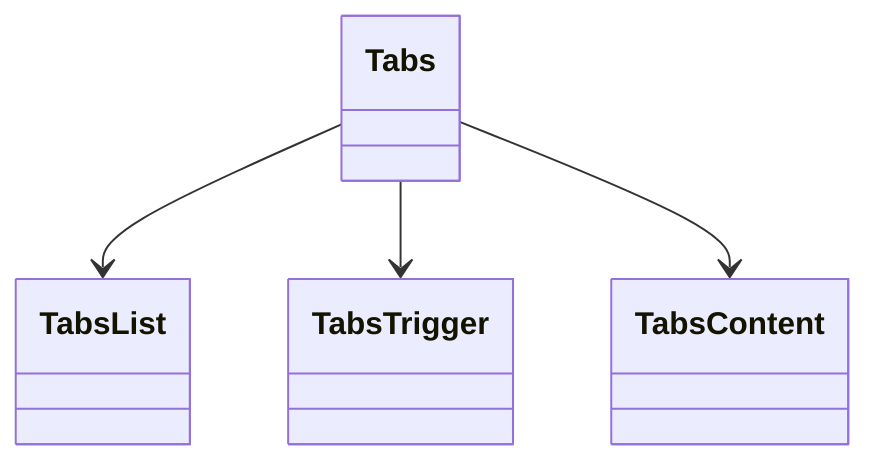

**Diagram sources**
- [tabs.tsx:8-66](file://src/components/ui/tabs.tsx#L8-L66)

**Section sources**
- [tabs.tsx:1-67](file://src/components/ui/tabs.tsx#L1-L67)

### Toast
- Purpose: Brief notifications with actions and swipe gestures
- Components: Provider, Viewport, Toast, ToastTitle, ToastDescription, ToastClose, ToastAction
- Variants: default, destructive

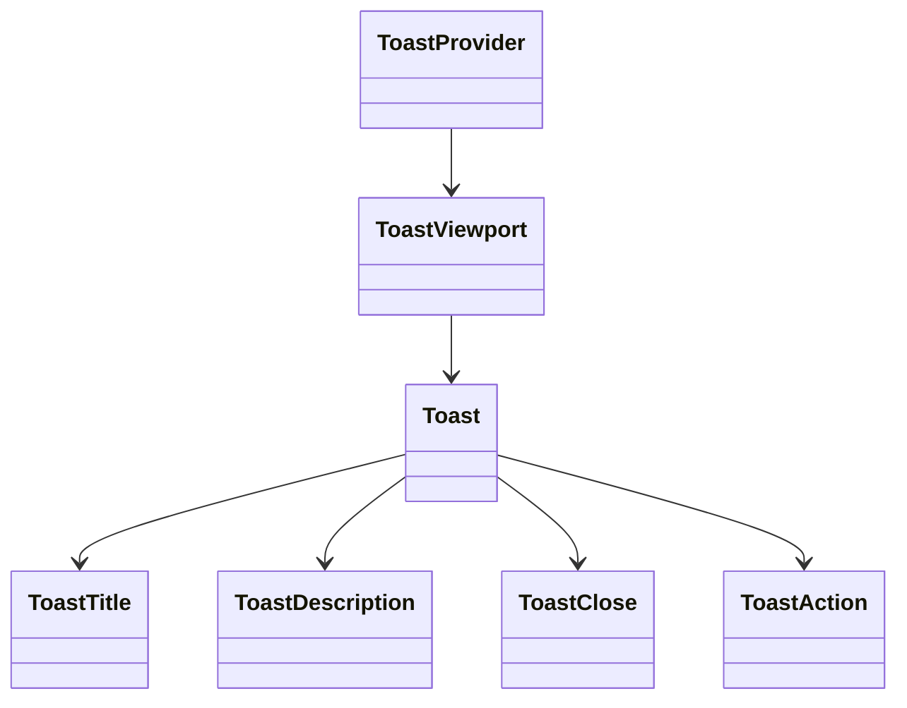

**Diagram sources**
- [toast.tsx:10-130](file://src/components/ui/toast.tsx#L10-L130)

**Section sources**
- [toast.tsx:1-131](file://src/components/ui/toast.tsx#L1-L131)

### Tooltip, Popover, DropdownMenu, ContextMenu, NavigationMenu, Menubar
- Purpose: Extendible overlays and navigation surfaces
- Pattern: Leverage Radix UI portals and triggers; consistent focus-visible rings and spacing

[No sources needed since this section doesn't analyze specific source files]

### Sidebar, Sheet, Drawer
- Purpose: Slide-in panels for navigation and content
- Pattern: Portal-based overlays with slide-in animations and responsive positioning

[No sources needed since this section doesn't analyze specific source files]

### Calendar, Slider, Progress, Spinner
- Purpose: Interactive controls and loading states
- Pattern: Focus-visible rings, transitions, accessible value semantics

[No sources needed since this section doesn't analyze specific source files]

### Accordion, Collapsible, HoverCard, Resizable, Separator
- Purpose: Expandable and resizable content areas
- Pattern: Focus-visible rings, transitions, content clipping

[No sources needed since this section doesn't analyze specific source files]

### Breadcrumb, Pagination, Kbd, AspectRatio, Carousel, Skeleton, Ripple, ScrollArea, Item, Field, Label
- Purpose: Navigation, paging, code display, layout helpers, and interactive lists
- Pattern: Focus-visible rings, responsive layouts, semantic roles

[No sources needed since this section doesn't analyze specific source files]

### TextEditor, ChatInput, ChatMessage, Sonner
- Purpose: Rich editing and chat experiences
- Pattern: Focus-visible rings, interactive states, content containers

[No sources needed since this section doesn't analyze specific source files]

### Textarea, InputGroup, ButtonGroup, Toggle, ToggleGroup, InputOTP, Empty, ArticleCard
- Purpose: Extended input patterns and content cards
- Pattern: Focus-visible rings, grouped controls, OTP spacing

[No sources needed since this section doesn't analyze specific source files]

## Dependency Analysis
- Internal dependencies: Components depend on Radix UI primitives and Tailwind classes
- Utility dependency: cn utility composes Tailwind classes consistently
- Composition: Many components expose data-slot attributes enabling downstream composition and testing
- Accessibility: Focus-visible rings and aria-* attributes are consistently applied across components

```mermaid
graph TB
Btn["Button"] --> Radix["Radix UI"]
Inp["Input"] --> Radix
Dlg["Dialog"] --> Radix
C["Card"] --> Radix
Bdg["Badge"] --> Radix
Al["Alert"] --> Radix
Av["Avatar"] --> Radix
Chk["Checkbox"] --> Radix
Rg["RadioGroup"] --> Radix
Sel["Select"] --> Radix
Sw["Switch"] --> Radix
Tb["Table"] --> Radix
Tabs["Tabs"] --> Radix
Ts["Toast"] --> Radix
Tool["Tooltip"] --> Radix
Pop["Popover"] --> Radix
Ddm["DropdownMenu"] --> Radix
Ctx["ContextMenu"] --> Radix
Nav["NavigationMenu"] --> Radix
Mb["Menubar"] --> Radix
Sb["Sidebar"] --> Radix
Sh["Sheet"] --> Radix
Dr["Drawer"] --> Radix
Cal["Calendar"] --> Radix
Sld["Slider"] --> Radix
Prog["Progress"] --> Radix
Spin["Spinner"] --> Radix
Acc["Accordion"] --> Radix
Col["Collapsible"] --> Radix
Hc["HoverCard"] --> Radix
Rz["Resizable"] --> Radix
Sep["Separator"] --> Radix
Br["Breadcrumb"] --> Radix
Pg["Pagination"] --> Radix
Kbd["Kbd"] --> Radix
Ar["AspectRatio"] --> Radix
Car["Carousel"] --> Radix
Sk["Skeleton"] --> Radix
Rp["Ripple"] --> Radix
Sa["ScrollArea"] --> Radix
It["Item"] --> Radix
F["Field"] --> Radix
Lbl["Label"] --> Radix
Te["TextEditor"] --> Radix
Ci["ChatInput"] --> Radix
Cm["ChatMessage"] --> Radix
Snr["Sonner"] --> Radix
Ta["Textarea"] --> Radix
Ig["InputGroup"] --> Radix
Bg["ButtonGroup"] --> Radix
Tog["Toggle"] --> Radix
Tgg["ToggleGroup"] --> Radix
Otp["InputOTP"] --> Radix
Emp["Empty"] --> Radix
Art["ArticleCard"] --> Radix
```

**Section sources**
- [button.tsx:1-67](file://src/components/ui/button.tsx#L1-L67)
- [input.tsx:1-26](file://src/components/ui/input.tsx#L1-L26)
- [dialog.tsx:1-142](file://src/components/ui/dialog.tsx#L1-L142)
- [card.tsx:1-104](file://src/components/ui/card.tsx#L1-L104)
- [badge.tsx:1-52](file://src/components/ui/badge.tsx#L1-L52)
- [alert.tsx:1-77](file://src/components/ui/alert.tsx#L1-L77)
- [avatar.tsx:1-54](file://src/components/ui/avatar.tsx#L1-L54)
- [checkbox.tsx:1-33](file://src/components/ui/checkbox.tsx#L1-L33)
- [radio-group.tsx:1-46](file://src/components/ui/radio-group.tsx#L1-L46)
- [select.tsx:1-188](file://src/components/ui/select.tsx#L1-L188)
- [switch.tsx:1-32](file://src/components/ui/switch.tsx#L1-L32)
- [table.tsx:1-117](file://src/components/ui/table.tsx#L1-L117)
- [tabs.tsx:1-67](file://src/components/ui/tabs.tsx#L1-L67)
- [toast.tsx:1-131](file://src/components/ui/toast.tsx#L1-L131)

## Performance Considerations
- Prefer variant props over ad-hoc class overrides to keep the variant set small and predictable
- Use data-slot attributes to avoid expensive DOM queries during testing and composition
- Keep focus-visible rings minimal and scoped to interactive elements
- Avoid unnecessary re-renders by composing components with stable prop shapes
- Use responsive variants sparingly; favor container queries and utility classes for fine-grained control

[No sources needed since this section provides general guidance]

## Troubleshooting Guide
- Validation feedback
  - Use Form with FormField/FormLabel/FormControl/FormMessage to surface errors
  - Ensure aria-invalid is applied to controls and aria-describedby links to messages
- Focus and keyboard navigation
  - Verify focus-visible rings appear on interactive elements
  - Confirm keyboard shortcuts and Tab order work as expected with Radix UI portals
- Dark mode
  - Confirm dark:bg-input/30 and related dark-mode variants are present
  - Test contrast and visibility across themes
- Responsive behavior
  - Use size variants and container queries to adapt to screen sizes
  - Ensure scroll areas and tables remain usable on small screens

**Section sources**
- [form.tsx:107-156](file://src/components/ui/form.tsx#L107-L156)
- [button.tsx:7-38](file://src/components/ui/button.tsx#L7-L38)
- [input.tsx:14-23](file://src/components/ui/input.tsx#L14-L23)

## Conclusion
AppRecon’s UI primitives library offers a cohesive, accessible, and customizable foundation for building forms, dialogs, navigation, and content areas. By leveraging Radix UI and Tailwind CSS, the components provide consistent behavior, strong accessibility, and predictable styling. The patterns documented here enable teams to compose complex interfaces while maintaining design consistency and cross-browser reliability.

[No sources needed since this section summarizes without analyzing specific files]

## Appendices
- Extending components
  - Add new variants via class-variance-authority
  - Introduce data-slot attributes for downstream composition
  - Keep accessibility attributes (aria-*, role) consistent with existing components
- Maintaining design consistency
  - Centralize tokens (colors, spacing, typography) in Tailwind
  - Use a single cn utility to compose classes
  - Document component APIs and variants in a shared style guide

[No sources needed since this section provides general guidance]