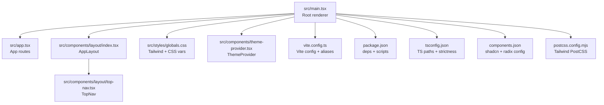
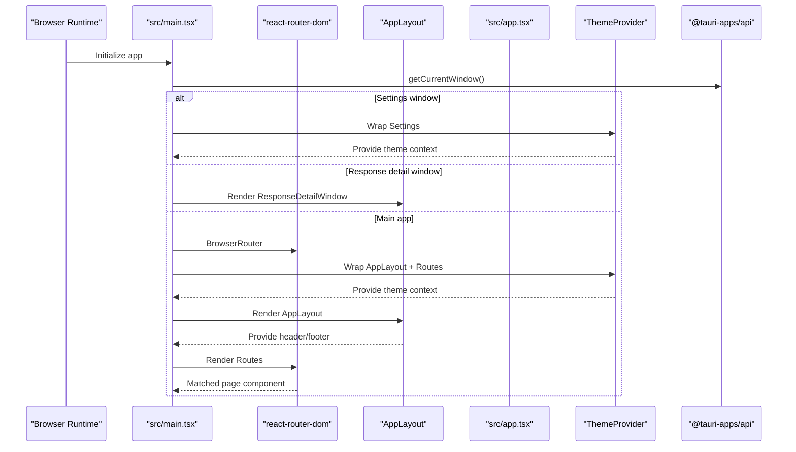
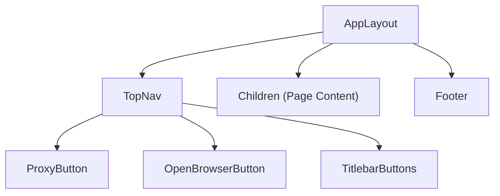
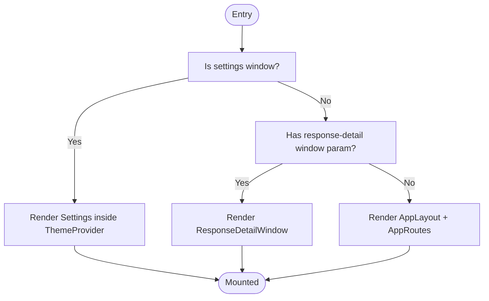
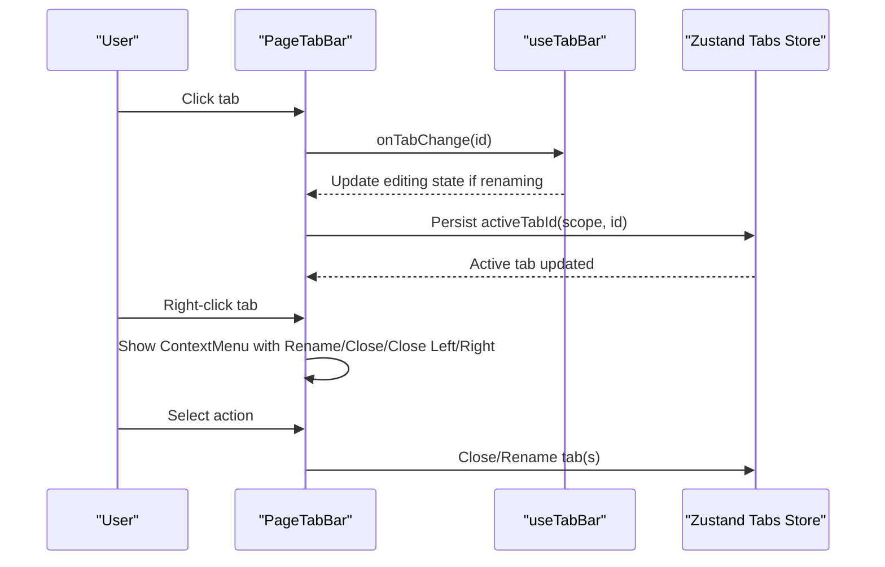
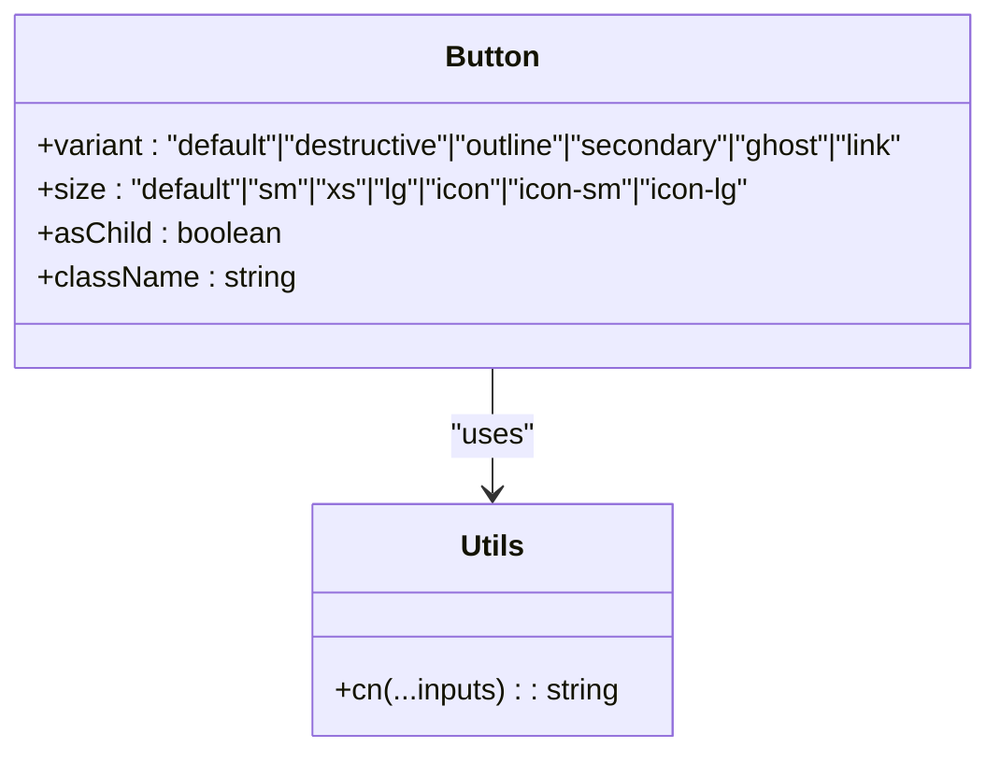
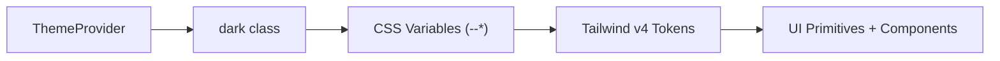
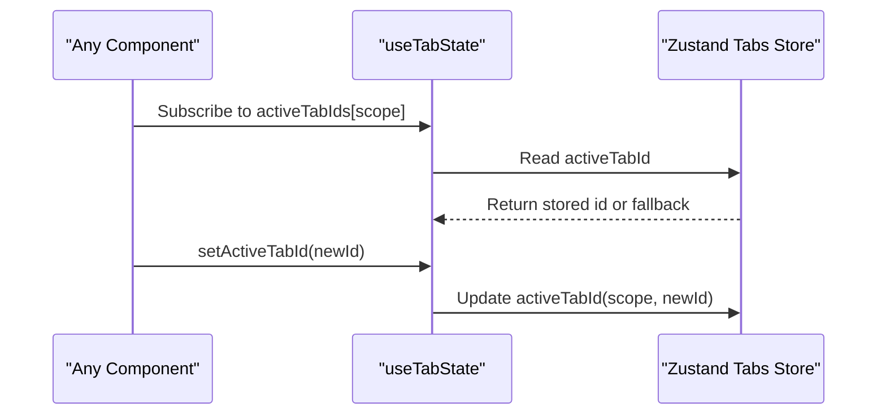
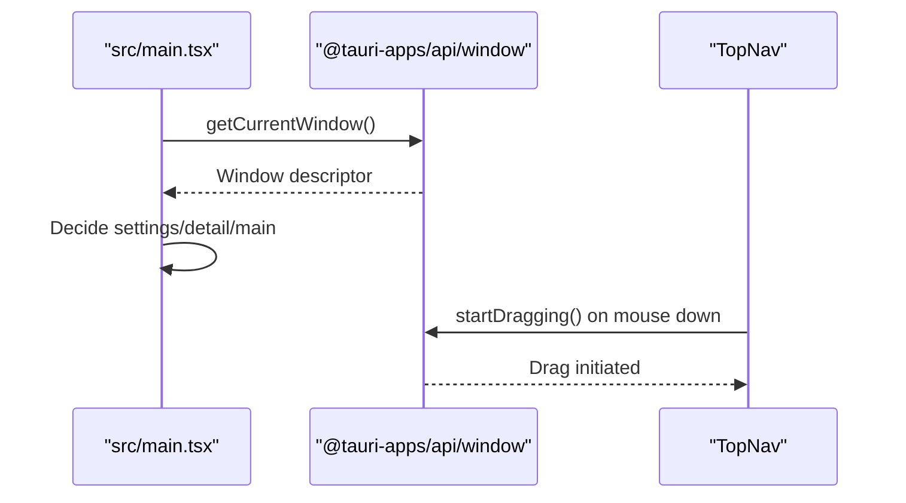
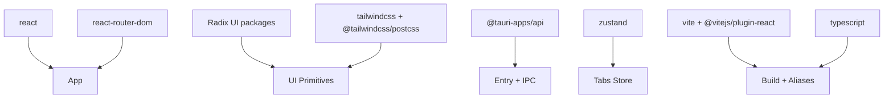

# Frontend Architecture

<cite>
**Referenced Files in This Document**
- [src/main.tsx](file://src/main.tsx)
- [src/app.tsx](file://src/app.tsx)
- [vite.config.ts](file://vite.config.ts)
- [package.json](file://package.json)
- [tsconfig.json](file://tsconfig.json)
- [src/components/layout/index.tsx](file://src/components/layout/index.tsx)
- [src/components/layout/top-nav.tsx](file://src/components/layout/top-nav.tsx)
- [src/components/theme-provider.tsx](file://src/components/theme-provider.tsx)
- [src/styles/globals.css](file://src/styles/globals.css)
- [components.json](file://components.json)
- [postcss.config.mjs](file://postcss.config.mjs)
- [src/lib/utils.ts](file://src/lib/utils.ts)
- [src/components/ui/button.tsx](file://src/components/ui/button.tsx)
- [src/components/tabs-layout/tab-bar.tsx](file://src/components/tabs-layout/tab-bar.tsx)
- [src/components/tabs-layout/use-tab-state.ts](file://src/components/tabs-layout/use-tab-state.ts)
</cite>

## Table of Contents
1. [Introduction](#introduction)
2. [Project Structure](#project-structure)
3. [Core Components](#core-components)
4. [Architecture Overview](#architecture-overview)
5. [Detailed Component Analysis](#detailed-component-analysis)
6. [Dependency Analysis](#dependency-analysis)
7. [Performance Considerations](#performance-considerations)
8. [Troubleshooting Guide](#troubleshooting-guide)
9. [Conclusion](#conclusion)
10. [Appendices](#appendices)

## Introduction
This document describes the frontend architecture of AppRecon’s React application. It covers the component system (UI primitives, layout, and reusable elements), routing and navigation, tab management, styling with Tailwind CSS and Radix UI, state management integration, Tauri IPC communication patterns, responsive design and accessibility, build system integration, asset management, performance optimization, and development guidelines.

## Project Structure
The frontend is organized around a clear separation of concerns:
- Entry point initializes routing, theming, and layout wrappers.
- Routing defines top-level pages.
- Layout composes header, main content area, and footer.
- UI primitives are built with Radix UI and styled via Tailwind CSS.
- Tabs layout provides a reusable tab bar with context menus and state persistence.
- Styling leverages Tailwind v4 tokens mapped to CSS variables for theme-aware design.
- Build system integrates Vite with React plugin, TypeScript, and manual chunking for vendor libraries.

**Diagram sources**
- [src/main.tsx:1-72](file://src/main.tsx#L1-L72)
- [src/app.tsx:1-35](file://src/app.tsx#L1-L35)
- [src/components/layout/index.tsx:1-32](file://src/components/layout/index.tsx#L1-L32)
- [src/components/layout/top-nav.tsx:1-149](file://src/components/layout/top-nav.tsx#L1-L149)
- [src/styles/globals.css:1-361](file://src/styles/globals.css#L1-L361)
- [src/components/theme-provider.tsx:1-53](file://src/components/theme-provider.tsx#L1-L53)
- [vite.config.ts:1-41](file://vite.config.ts#L1-L41)
- [package.json:1-90](file://package.json#L1-L90)
- [tsconfig.json:1-37](file://tsconfig.json#L1-L37)
- [components.json:1-26](file://components.json#L1-L26)
- [postcss.config.mjs:1-7](file://postcss.config.mjs#L1-L7)

**Section sources**
- [src/main.tsx:1-72](file://src/main.tsx#L1-L72)
- [src/app.tsx:1-35](file://src/app.tsx#L1-L35)
- [vite.config.ts:1-41](file://vite.config.ts#L1-L41)
- [package.json:1-90](file://package.json#L1-L90)
- [tsconfig.json:1-37](file://tsconfig.json#L1-L37)
- [components.json:1-26](file://components.json#L1-L26)
- [postcss.config.mjs:1-7](file://postcss.config.mjs#L1-L7)

## Core Components
- AppLayout: Provides the main shell with top navigation, optional AI assistant pane, and footer. Manages assistant visibility state and responsive layout.
- TopNav: Implements the top navigation bar with draggable region support, active route highlighting, proxy indicator, and integrated controls.
- ThemeProvider: Exposes theme context for light/dark switching and applies CSS classes to the root element.
- UI Primitives: Built with Radix UI and styled via Tailwind; variants and sizes are standardized using class variance authority and utility helpers.
- Tabs Layout: Reusable tab bar with rename, close, and context menu actions; integrates with a Zustand-backed store for active tab persistence.

Practical usage examples (described):
- Button: Use variant and size props to change appearance; pass asChild to render as a slot for semantic markup.
- PageTabBar: Provide tabs array, active tab id, and callbacks for change, rename, and close; customize context menu items via renderTabContextMenuItems.
- useTabState: Hook to persist and restore active tab per scope; returns activeTabId and setter.

**Section sources**
- [src/components/layout/index.tsx:1-32](file://src/components/layout/index.tsx#L1-L32)
- [src/components/layout/top-nav.tsx:1-149](file://src/components/layout/top-nav.tsx#L1-L149)
- [src/components/theme-provider.tsx:1-53](file://src/components/theme-provider.tsx#L1-L53)
- [src/components/ui/button.tsx:1-67](file://src/components/ui/button.tsx#L1-L67)
- [src/components/tabs-layout/tab-bar.tsx:1-202](file://src/components/tabs-layout/tab-bar.tsx#L1-L202)
- [src/components/tabs-layout/use-tab-state.ts:1-38](file://src/components/tabs-layout/use-tab-state.ts#L1-L38)

## Architecture Overview
The runtime architecture ties together routing, layout, theming, and IPC-aware windows.

**Diagram sources**
- [src/main.tsx:13-65](file://src/main.tsx#L13-L65)
- [src/app.tsx:14-32](file://src/app.tsx#L14-L32)
- [src/components/layout/index.tsx:9-31](file://src/components/layout/index.tsx#L9-L31)
- [src/components/theme-provider.tsx:28-52](file://src/components/theme-provider.tsx#L28-L52)

## Detailed Component Analysis

### Layout and Navigation
- AppLayout composes TopNav, children (page content), and Footer. It toggles an AI assistant pane and adjusts spacing responsively.
- TopNav renders main navigation links, highlights the active route, shows a proxy indicator for the live traffic route, and integrates window dragging via Tauri APIs. It also hosts proxy and browser open controls and titlebar buttons.

**Diagram sources**
- [src/components/layout/index.tsx:9-31](file://src/components/layout/index.tsx#L9-L31)
- [src/components/layout/top-nav.tsx:17-148](file://src/components/layout/top-nav.tsx#L17-L148)

**Section sources**
- [src/components/layout/index.tsx:1-32](file://src/components/layout/index.tsx#L1-L32)
- [src/components/layout/top-nav.tsx:1-149](file://src/components/layout/top-nav.tsx#L1-L149)

### Routing and Navigation System
- AppRoutes defines top-level routes for live traffic, intercept, repeater, brute force, browser automation, tools, AI tools, documents, and settings.
- The main entry chooses between rendering the main app layout, a dedicated settings window, or a response detail window based on Tauri window metadata and URL query parameters.

**Diagram sources**
- [src/main.tsx:29-65](file://src/main.tsx#L29-L65)
- [src/app.tsx:14-32](file://src/app.tsx#L14-L32)

**Section sources**
- [src/app.tsx:1-35](file://src/app.tsx#L1-L35)
- [src/main.tsx:1-72](file://src/main.tsx#L1-L72)

### Tab Management
- PageTabBar renders a horizontal, scrollable tab bar with rename, close, and context menu actions. It computes scroll indicators and gradient overlays for discoverability.
- useTabState persists active tab per scope using a Zustand store, ensuring continuity across re-renders.

**Diagram sources**
- [src/components/tabs-layout/tab-bar.tsx:28-201](file://src/components/tabs-layout/tab-bar.tsx#L28-L201)
- [src/components/tabs-layout/use-tab-state.ts:12-37](file://src/components/tabs-layout/use-tab-state.ts#L12-L37)

**Section sources**
- [src/components/tabs-layout/tab-bar.tsx:1-202](file://src/components/tabs-layout/tab-bar.tsx#L1-L202)
- [src/components/tabs-layout/use-tab-state.ts:1-38](file://src/components/tabs-layout/use-tab-state.ts#L1-L38)

### UI Primitive Library and Composition Patterns
- Button demonstrates variant and size composition using class variance authority and a utility helper for merging classes.
- Composition patterns:
  - asChild prop allows rendering Radix UI slots for semantics.
  - Variants encapsulate color and sizing tokens for consistent UI.
  - Utility helper merges Tailwind classes safely.

**Diagram sources**
- [src/components/ui/button.tsx:40-66](file://src/components/ui/button.tsx#L40-L66)
- [src/lib/utils.ts:4-6](file://src/lib/utils.ts#L4-L6)

**Section sources**
- [src/components/ui/button.tsx:1-67](file://src/components/ui/button.tsx#L1-L67)
- [src/lib/utils.ts:1-27](file://src/lib/utils.ts#L1-L27)

### Theming and Styling Architecture
- ThemeProvider exposes theme state and toggles a CSS class on the root for dark mode.
- globals.css defines Tailwind v4 tokens mapped to CSS variables, establishes dark variants, and includes animations and utility classes for scrollbars, gradients, and window regions.
- components.json configures shadcn-style UI generation with Radix Mira style, Tailwind CSS variables, HugeIcons, and aliases.

**Diagram sources**
- [src/components/theme-provider.tsx:28-52](file://src/components/theme-provider.tsx#L28-L52)
- [src/styles/globals.css:6-35](file://src/styles/globals.css#L6-L35)
- [components.json:6-12](file://components.json#L6-L12)

**Section sources**
- [src/components/theme-provider.tsx:1-53](file://src/components/theme-provider.tsx#L1-L53)
- [src/styles/globals.css:1-361](file://src/styles/globals.css#L1-L361)
- [components.json:1-26](file://components.json#L1-L26)

### State Management Integration
- useTabState integrates with a Zustand store to persist active tab ids per scope, ensuring continuity across component mounts.
- TopNav reads proxy status from a central app store to reflect connectivity state in the UI.

**Diagram sources**
- [src/components/tabs-layout/use-tab-state.ts:12-37](file://src/components/tabs-layout/use-tab-state.ts#L12-L37)

**Section sources**
- [src/components/tabs-layout/use-tab-state.ts:1-38](file://src/components/tabs-layout/use-tab-state.ts#L1-L38)

### Tauri IPC Communication Patterns
- The entry point queries the current window label and URL parameters to decide rendering mode (main app, settings, or response detail).
- TopNav uses Tauri window APIs to enable native window dragging and integrates proxy and browser controls.

**Diagram sources**
- [src/main.tsx:13-19](file://src/main.tsx#L13-L19)
- [src/main.tsx:43-52](file://src/main.tsx#L43-L52)
- [src/components/layout/top-nav.tsx:20-72](file://src/components/layout/top-nav.tsx#L20-L72)

**Section sources**
- [src/main.tsx:1-72](file://src/main.tsx#L1-L72)
- [src/components/layout/top-nav.tsx:1-149](file://src/components/layout/top-nav.tsx#L1-L149)

### Responsive Design and Accessibility
- Responsive layout uses flexbox and overflow handling in AppLayout and TopNav to adapt to screen size and content.
- Accessibility features include:
  - Proper focus-visible rings and aria-invalid states in primitives.
  - Semantic markup with asChild slots.
  - Keyboard-friendly context menus and tab renaming.
  - Screen-reader friendly labels for interactive elements.

**Section sources**
- [src/components/layout/index.tsx:9-31](file://src/components/layout/index.tsx#L9-L31)
- [src/components/ui/button.tsx:7-38](file://src/components/ui/button.tsx#L7-L38)
- [src/components/tabs-layout/tab-bar.tsx:76-117](file://src/components/tabs-layout/tab-bar.tsx#L76-L117)

### Cross-Browser Compatibility
- Tailwind utilities and CSS variables are used consistently across browsers.
- WebKit-specific scrollbar styles and Firefox scrollbar configuration are included for native-like scrolling behavior.

**Section sources**
- [src/styles/globals.css:308-360](file://src/styles/globals.css#L308-L360)

## Dependency Analysis
The frontend relies on React, React Router DOM, Radix UI primitives, Tailwind CSS v4, and Tauri APIs. Vite resolves aliases and splits vendor bundles for large dependencies.

**Diagram sources**
- [package.json:14-80](file://package.json#L14-L80)
- [vite.config.ts:1-41](file://vite.config.ts#L1-L41)
- [tsconfig.json:2-26](file://tsconfig.json#L2-L26)

**Section sources**
- [package.json:1-90](file://package.json#L1-L90)
- [vite.config.ts:1-41](file://vite.config.ts#L1-L41)
- [tsconfig.json:1-37](file://tsconfig.json#L1-L37)

## Performance Considerations
- Manual chunking separates vendor libraries (echarts, monaco-editor, jspdf, html2canvas, tauri, lucide, hugeicons) into named chunks to improve caching and initial load.
- Chunk size warning threshold is increased to accommodate large dependencies.
- Alias resolution avoids deep module traversals and improves incremental builds.

Recommendations:
- Keep UI primitive variants minimal and reuse shared classes via the utility helper.
- Defer heavy panels (e.g., editors) to lazy-loaded routes where appropriate.
- Monitor bundle sizes and split further if needed.

**Section sources**
- [vite.config.ts:21-39](file://vite.config.ts#L21-L39)
- [package.json:14-80](file://package.json#L14-L80)

## Troubleshooting Guide
- Theme not applying:
  - Verify ThemeProvider wraps the app and that the root element receives the dark class on toggle.
- Dark mode tokens missing:
  - Confirm CSS variables are defined in globals.css and Tailwind v4 tokens are mapped.
- Tab state not persisting:
  - Ensure the scope string remains stable across renders and that the store is initialized.
- Window dragging not working:
  - Check that Tauri window APIs are available and the drag region attributes are applied to the correct elements.

**Section sources**
- [src/components/theme-provider.tsx:28-52](file://src/components/theme-provider.tsx#L28-L52)
- [src/styles/globals.css:6-35](file://src/styles/globals.css#L6-L35)
- [src/components/tabs-layout/use-tab-state.ts:12-37](file://src/components/tabs-layout/use-tab-state.ts#L12-L37)
- [src/components/layout/top-nav.tsx:56-76](file://src/components/layout/top-nav.tsx#L56-L76)

## Conclusion
AppRecon’s frontend combines a clean layout system, robust UI primitives, and a pragmatic tab management solution. Theming and styling leverage Tailwind CSS v4 with CSS variables, while Radix UI ensures accessible, composable primitives. Routing and navigation are straightforward, with Tauri IPC enabling native window behaviors. The build system optimizes vendor splitting and alias resolution for a smooth developer and user experience.

## Appendices

### Practical Examples and Prop Interfaces
- Button props:
  - variant: "default" | "destructive" | "outline" | "secondary" | "ghost" | "link"
  - size: "default" | "sm" | "xs" | "lg" | "icon" | "icon-sm" | "icon-lg"
  - asChild: boolean
  - className: string
- PageTabBar props:
  - tabs: Array of tab items with id, name, disabled, closable
  - activeTabId: string
  - onTabChange(id: string): void
  - onTabRename?(id: string, name: string): void
  - onTabClose?(id: string): void
  - onCloseTabsToLeft?(id: string): void
  - onCloseTabsToRight?(id: string): void
  - renderTabContextMenuItems?(tab: TabItem): ReactNode
- useTabState:
  - Returns activeTabId and setActiveTabId for managing active tab per scope

**Section sources**
- [src/components/ui/button.tsx:40-66](file://src/components/ui/button.tsx#L40-L66)
- [src/components/tabs-layout/tab-bar.tsx:17-37](file://src/components/tabs-layout/tab-bar.tsx#L17-L37)
- [src/components/tabs-layout/use-tab-state.ts:12-37](file://src/components/tabs-layout/use-tab-state.ts#L12-L37)

### Event Handling Guidelines
- Prefer controlled components for tab renaming and closing; always guard disabled/closable flags.
- Use asChild for semantic rendering and maintain focus-visible styles.
- For IPC-driven interactions (dragging), ensure cleanup of event listeners and observers.

**Section sources**
- [src/components/tabs-layout/tab-bar.tsx:51-58](file://src/components/tabs-layout/tab-bar.tsx#L51-L58)
- [src/components/layout/top-nav.tsx:28-53](file://src/components/layout/top-nav.tsx#L28-L53)

### Testing Approaches
- Unit test primitives with variant and size combinations.
- Mock ThemeProvider for theme-dependent snapshots.
- Test tab bar interactions (rename, close, context menu) with user events.
- Snapshot test layout components under different window modes.

[No sources needed since this section provides general guidance]

### Maintenance Best Practices
- Centralize shared utilities (cn) and scope matching helpers.
- Keep tab scopes deterministic and stable across renders.
- Update Tailwind tokens and CSS variables consistently.
- Review vendor chunking after adding/removing large dependencies.

**Section sources**
- [src/lib/utils.ts:4-6](file://src/lib/utils.ts#L4-L6)
- [vite.config.ts:25-36](file://vite.config.ts#L25-L36)