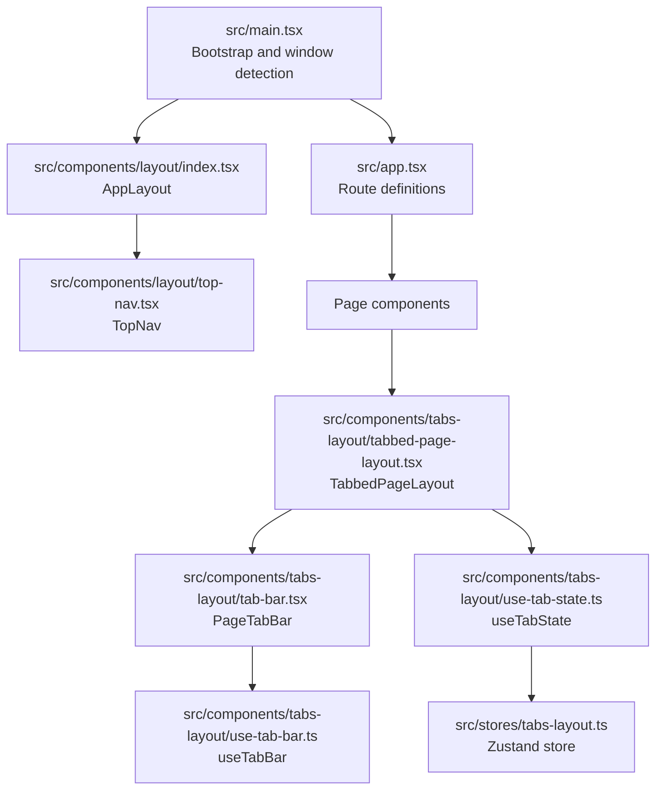
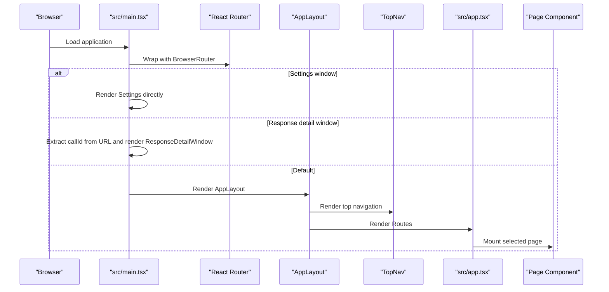
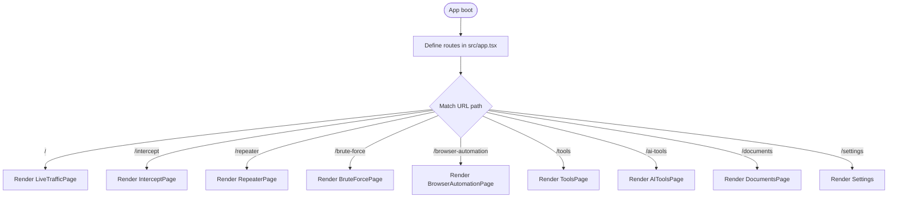
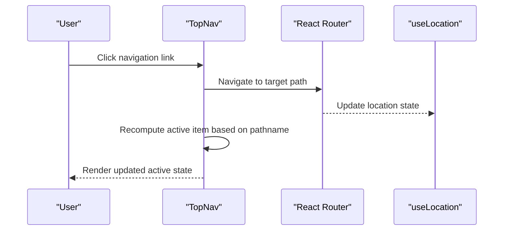
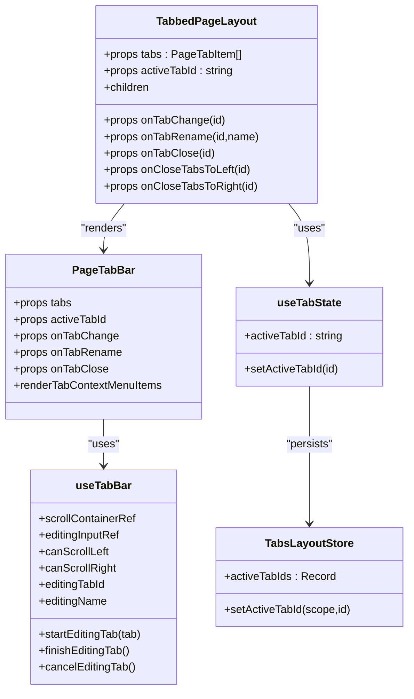
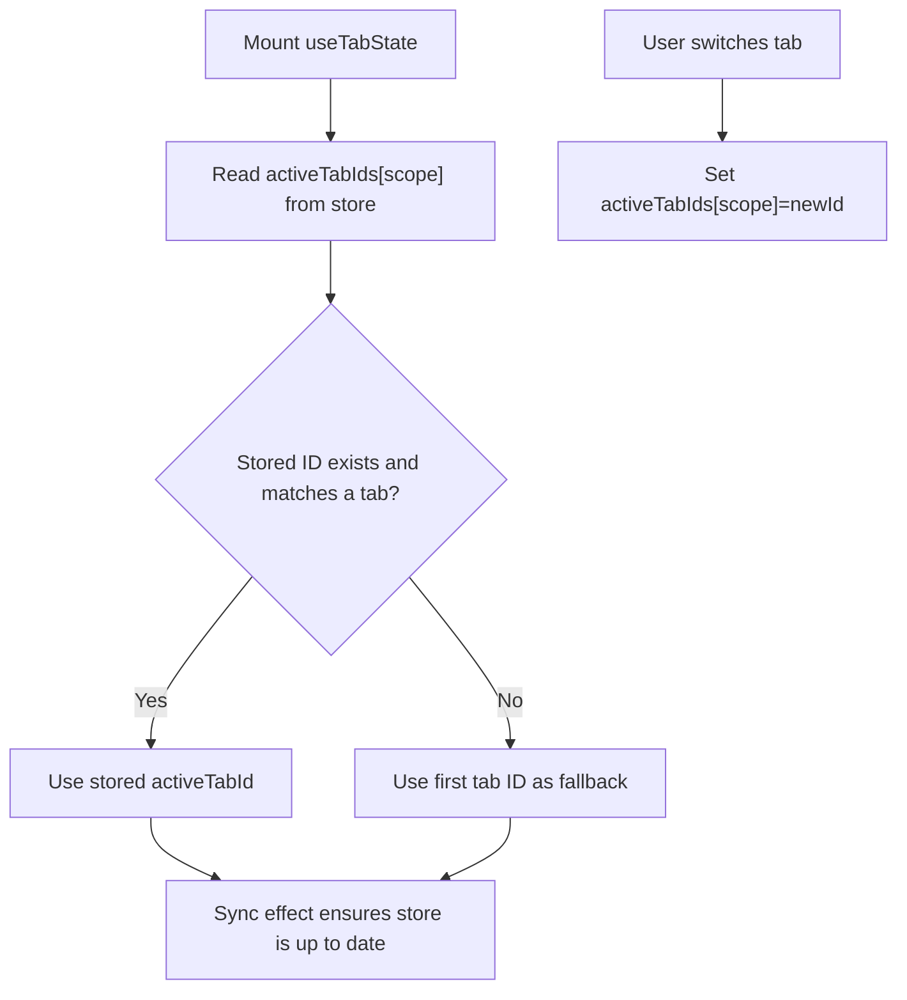
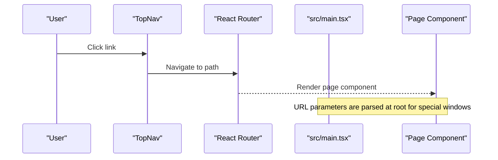
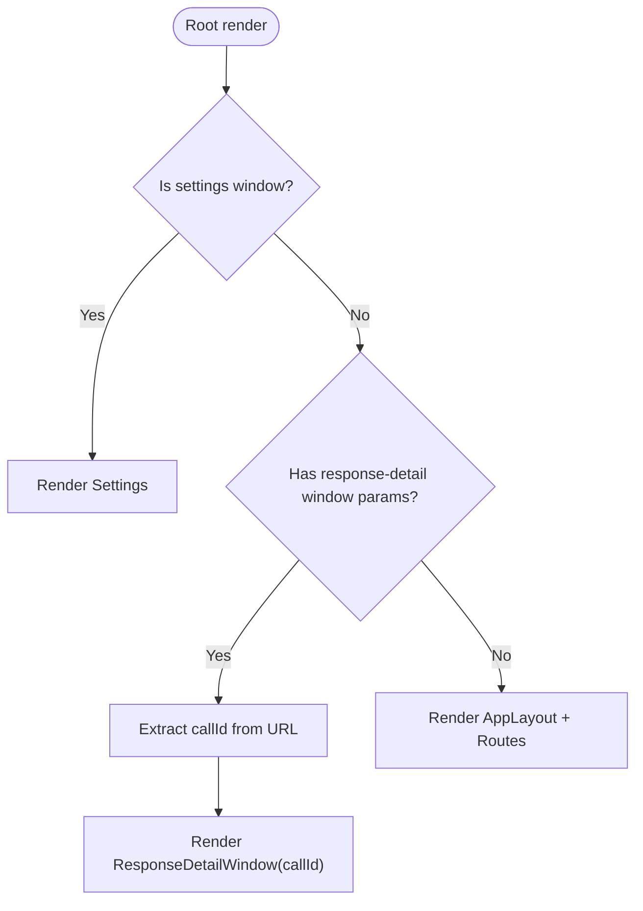
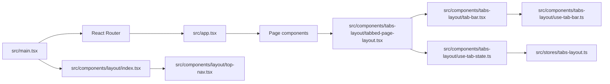

# Routing and Navigation

<cite>
**Referenced Files in This Document**
- [src/main.tsx](file://src/main.tsx)
- [src/app.tsx](file://src/app.tsx)
- [src/components/layout/index.tsx](file://src/components/layout/index.tsx)
- [src/components/layout/top-nav.tsx](file://src/components/layout/top-nav.tsx)
- [src/components/layout/constants.ts](file://src/components/layout/constants.ts)
- [src/components/tabs-layout/tab-bar.tsx](file://src/components/tabs-layout/tab-bar.tsx)
- [src/components/tabs-layout/use-tab-bar.ts](file://src/components/tabs-layout/use-tab-bar.ts)
- [src/components/tabs-layout/use-tab-state.ts](file://src/components/tabs-layout/use-tab-state.ts)
- [src/components/tabs-layout/tabbed-page-layout.tsx](file://src/components/tabs-layout/tabbed-page-layout.tsx)
- [src/components/tabs-layout/types.ts](file://src/components/tabs-layout/types.ts)
- [src/stores/tabs-layout.ts](file://src/stores/tabs-layout.ts)
</cite>

## Table of Contents
1. [Introduction](#introduction)
2. [Project Structure](#project-structure)
3. [Core Components](#core-components)
4. [Architecture Overview](#architecture-overview)
5. [Detailed Component Analysis](#detailed-component-analysis)
6. [Dependency Analysis](#dependency-analysis)
7. [Performance Considerations](#performance-considerations)
8. [Troubleshooting Guide](#troubleshooting-guide)
9. [Conclusion](#conclusion)

## Introduction
This document explains AppRecon’s routing and navigation architecture. It covers React Router configuration, route definitions, and how the application integrates with a top navigation bar and a tab management system. It also documents tab state persistence, dynamic tab creation, and switching logic, along with URL parameter handling, programmatic navigation patterns, deep linking, browser history behavior, and accessibility features.

## Project Structure
The routing and navigation system spans several layers:
- Application bootstrap and window-specific rendering logic
- Top-level route definitions
- Layout wrapper with top navigation
- Tab management components and state store
- Tab state persistence via a Zustand store

**Diagram sources**
- [src/main.tsx:1-72](file://src/main.tsx#L1-L72)
- [src/app.tsx:14-32](file://src/app.tsx#L14-L32)
- [src/components/layout/index.tsx:9-31](file://src/components/layout/index.tsx#L9-L31)
- [src/components/layout/top-nav.tsx:17-148](file://src/components/layout/top-nav.tsx#L17-L148)
- [src/components/tabs-layout/tabbed-page-layout.tsx:22-56](file://src/components/tabs-layout/tabbed-page-layout.tsx#L22-L56)
- [src/components/tabs-layout/tab-bar.tsx:28-201](file://src/components/tabs-layout/tab-bar.tsx#L28-L201)
- [src/components/tabs-layout/use-tab-bar.ts:10-105](file://src/components/tabs-layout/use-tab-bar.ts#L10-L105)
- [src/components/tabs-layout/use-tab-state.ts:12-37](file://src/components/tabs-layout/use-tab-state.ts#L12-L37)
- [src/stores/tabs-layout.ts:9-28](file://src/stores/tabs-layout.ts#L9-L28)

**Section sources**
- [src/main.tsx:1-72](file://src/main.tsx#L1-L72)
- [src/app.tsx:14-32](file://src/app.tsx#L14-L32)
- [src/components/layout/index.tsx:9-31](file://src/components/layout/index.tsx#L9-L31)
- [src/components/layout/top-nav.tsx:17-148](file://src/components/layout/top-nav.tsx#L17-L148)
- [src/components/tabs-layout/tabbed-page-layout.tsx:22-56](file://src/components/tabs-layout/tabbed-page-layout.tsx#L22-L56)
- [src/components/tabs-layout/tab-bar.tsx:28-201](file://src/components/tabs-layout/tab-bar.tsx#L28-L201)
- [src/components/tabs-layout/use-tab-bar.ts:10-105](file://src/components/tabs-layout/use-tab-bar.ts#L10-L105)
- [src/components/tabs-layout/use-tab-state.ts:12-37](file://src/components/tabs-layout/use-tab-state.ts#L12-L37)
- [src/stores/tabs-layout.ts:9-28](file://src/stores/tabs-layout.ts#L9-L28)

## Core Components
- Route definitions: Centralized in a single routes file with top-level routes for major application sections.
- Top navigation: A horizontal navigation bar that reflects active routes and provides quick access to sections.
- Tabbed page layout: A reusable layout that wraps page content with a tab bar and stateful tab switching.
- Tab state management: Hook and store to persist active tab selection per scope and synchronize across sessions.
- Window-specific rendering: Special handling for dedicated windows (e.g., settings, response detail) using URL parameters.

**Section sources**
- [src/app.tsx:14-32](file://src/app.tsx#L14-L32)
- [src/components/layout/top-nav.tsx:17-148](file://src/components/layout/top-nav.tsx#L17-L148)
- [src/components/tabs-layout/tabbed-page-layout.tsx:22-56](file://src/components/tabs-layout/tabbed-page-layout.tsx#L22-L56)
- [src/components/tabs-layout/use-tab-state.ts:12-37](file://src/components/tabs-layout/use-tab-state.ts#L12-L37)
- [src/stores/tabs-layout.ts:9-28](file://src/stores/tabs-layout.ts#L9-L28)
- [src/main.tsx:13-27](file://src/main.tsx#L13-L27)

## Architecture Overview
The application uses React Router for SPA routing and composes a layout with a top navigation bar. Some views are rendered inside a tabbed container that manages multiple logical views within a single page. Tab state is persisted to local storage via a Zustand store keyed by a scope derived from the tab list.

**Diagram sources**
- [src/main.tsx:29-65](file://src/main.tsx#L29-L65)
- [src/app.tsx:14-32](file://src/app.tsx#L14-L32)
- [src/components/layout/index.tsx:9-31](file://src/components/layout/index.tsx#L9-L31)
- [src/components/layout/top-nav.tsx:17-148](file://src/components/layout/top-nav.tsx#L17-L148)

## Detailed Component Analysis

### React Router Configuration and Route Definitions
- Routes are declared centrally with top-level paths for major sections.
- The routes file imports page components and renders them under specific paths.
- Nested routes are not used at the top level; page components themselves may implement internal layouts or tabbed structures.

**Diagram sources**
- [src/app.tsx:14-32](file://src/app.tsx#L14-L32)

**Section sources**
- [src/app.tsx:14-32](file://src/app.tsx#L14-L32)

### Top Navigation Bar and Active State
- The top navigation reads the current location and highlights the active route.
- Navigation items are defined centrally and filtered by environment.
- Proxy status is visually indicated on the active route when applicable.
- Drag-and-drop support for moving the window is integrated into the header area.

**Diagram sources**
- [src/components/layout/top-nav.tsx:17-148](file://src/components/layout/top-nav.tsx#L17-L148)
- [src/components/layout/constants.ts:11-25](file://src/components/layout/constants.ts#L11-L25)

**Section sources**
- [src/components/layout/top-nav.tsx:17-148](file://src/components/layout/top-nav.tsx#L17-L148)
- [src/components/layout/constants.ts:11-25](file://src/components/layout/constants.ts#L11-L25)

### Tab Management System
- TabbedPageLayout composes a tab bar and a tab container to manage multiple views within a page.
- PageTabBar renders individual tabs, supports renaming, closing, and context menu actions.
- useTabBar encapsulates scrolling indicators, editing state, and keyboard interactions for renaming.
- useTabState persists the active tab per scope and synchronizes it with the store.
- The store persists active tab IDs keyed by a scope string built from tab IDs.

**Diagram sources**
- [src/components/tabs-layout/tabbed-page-layout.tsx:22-56](file://src/components/tabs-layout/tabbed-page-layout.tsx#L22-L56)
- [src/components/tabs-layout/tab-bar.tsx:28-201](file://src/components/tabs-layout/tab-bar.tsx#L28-L201)
- [src/components/tabs-layout/use-tab-bar.ts:10-105](file://src/components/tabs-layout/use-tab-bar.ts#L10-L105)
- [src/components/tabs-layout/use-tab-state.ts:12-37](file://src/components/tabs-layout/use-tab-state.ts#L12-L37)
- [src/stores/tabs-layout.ts:9-28](file://src/stores/tabs-layout.ts#L9-L28)

**Section sources**
- [src/components/tabs-layout/tabbed-page-layout.tsx:22-56](file://src/components/tabs-layout/tabbed-page-layout.tsx#L22-L56)
- [src/components/tabs-layout/tab-bar.tsx:28-201](file://src/components/tabs-layout/tab-bar.tsx#L28-L201)
- [src/components/tabs-layout/use-tab-bar.ts:10-105](file://src/components/tabs-layout/use-tab-bar.ts#L10-L105)
- [src/components/tabs-layout/use-tab-state.ts:12-37](file://src/components/tabs-layout/use-tab-state.ts#L12-L37)
- [src/stores/tabs-layout.ts:9-28](file://src/stores/tabs-layout.ts#L9-L28)
- [src/components/tabs-layout/types.ts:1-7](file://src/components/tabs-layout/types.ts#L1-L7)

### Tab State Persistence and Scope
- Scope is computed from the joined IDs of the current tab list to uniquely identify a tab group.
- On mount, the hook reads the stored active tab ID for the scope; if missing or invalid, it falls back to the first tab.
- When the active tab changes, the store updates the scope-keyed active tab ID.
- The store persists to local storage and partially serializes only the active tab IDs.

**Diagram sources**
- [src/components/tabs-layout/use-tab-state.ts:12-37](file://src/components/tabs-layout/use-tab-state.ts#L12-L37)
- [src/stores/tabs-layout.ts:9-28](file://src/stores/tabs-layout.ts#L9-L28)

**Section sources**
- [src/components/tabs-layout/use-tab-state.ts:12-37](file://src/components/tabs-layout/use-tab-state.ts#L12-L37)
- [src/stores/tabs-layout.ts:9-28](file://src/stores/tabs-layout.ts#L9-L28)

### Programmatic Navigation and Deep Linking
- Programmatic navigation is achieved via React Router’s navigation primitives used within components and hooks.
- Deep linking is supported by parsing URL parameters at the application root to detect special windows and pass parameters into page components.
- Example patterns:
  - Using a router hook to navigate to a specific route after an action.
  - Passing a call identifier via query parameters to open a specialized detail window.

**Diagram sources**
- [src/main.tsx:21-27](file://src/main.tsx#L21-L27)
- [src/components/layout/top-nav.tsx:94-118](file://src/components/layout/top-nav.tsx#L94-L118)

**Section sources**
- [src/main.tsx:21-27](file://src/main.tsx#L21-L27)
- [src/components/layout/top-nav.tsx:94-118](file://src/components/layout/top-nav.tsx#L94-L118)

### URL Parameter Handling and Window-Specific Rendering
- The root checks the current window label and renders either the settings page directly or a specialized response detail window based on URL query parameters.
- A helper extracts a call identifier from the URL when the window type indicates a response detail view.

**Diagram sources**
- [src/main.tsx:13-27](file://src/main.tsx#L13-L27)
- [src/main.tsx:29-65](file://src/main.tsx#L29-L65)

**Section sources**
- [src/main.tsx:13-27](file://src/main.tsx#L13-L27)
- [src/main.tsx:29-65](file://src/main.tsx#L29-L65)

### Navigation Patterns, Guards, and Access Control
- Current implementation does not define route guards in the provided files. Authentication or permission checks would typically be implemented at the route level or via wrappers around protected routes.
- If guards are introduced, they could be placed around sensitive routes or enforced by page components before rendering.

[No sources needed since this section provides general guidance]

### Browser History Management and Back/Forward Navigation
- React Router handles browser history automatically for SPA navigation.
- The tabbed layout uses a tab container that maintains state within the current page; switching tabs does not push new entries to browser history.
- For cross-page navigation, browser back/forward buttons move between route changes as defined in the routes file.

[No sources needed since this section provides general guidance]

### Accessibility Features
- Keyboard navigation is supported through focus management during tab renaming and click interactions.
- Context menus for tabs provide keyboard-accessible actions for renaming and closing.
- Active states and visual indicators highlight the current route and tab selections.

**Section sources**
- [src/components/tabs-layout/tab-bar.tsx:75-93](file://src/components/tabs-layout/tab-bar.tsx#L75-L93)
- [src/components/tabs-layout/tab-bar.tsx:153-183](file://src/components/tabs-layout/tab-bar.tsx#L153-L183)
- [src/components/layout/top-nav.tsx:94-118](file://src/components/layout/top-nav.tsx#L94-L118)

## Dependency Analysis
The navigation stack depends on React Router for routing, a layout wrapper for consistent UI, and a tab management system backed by a persistent store.

**Diagram sources**
- [src/main.tsx:1-11](file://src/main.tsx#L1-L11)
- [src/app.tsx:14-32](file://src/app.tsx#L14-L32)
- [src/components/layout/index.tsx:9-31](file://src/components/layout/index.tsx#L9-L31)
- [src/components/layout/top-nav.tsx:17-148](file://src/components/layout/top-nav.tsx#L17-L148)
- [src/components/tabs-layout/tabbed-page-layout.tsx:22-56](file://src/components/tabs-layout/tabbed-page-layout.tsx#L22-L56)
- [src/components/tabs-layout/tab-bar.tsx:28-201](file://src/components/tabs-layout/tab-bar.tsx#L28-L201)
- [src/components/tabs-layout/use-tab-bar.ts:10-105](file://src/components/tabs-layout/use-tab-bar.ts#L10-L105)
- [src/components/tabs-layout/use-tab-state.ts:12-37](file://src/components/tabs-layout/use-tab-state.ts#L12-L37)
- [src/stores/tabs-layout.ts:9-28](file://src/stores/tabs-layout.ts#L9-L28)

**Section sources**
- [src/main.tsx:1-11](file://src/main.tsx#L1-L11)
- [src/app.tsx:14-32](file://src/app.tsx#L14-L32)
- [src/components/layout/index.tsx:9-31](file://src/components/layout/index.tsx#L9-L31)
- [src/components/layout/top-nav.tsx:17-148](file://src/components/layout/top-nav.tsx#L17-L148)
- [src/components/tabs-layout/tabbed-page-layout.tsx:22-56](file://src/components/tabs-layout/tabbed-page-layout.tsx#L22-L56)
- [src/components/tabs-layout/tab-bar.tsx:28-201](file://src/components/tabs-layout/tab-bar.tsx#L28-L201)
- [src/components/tabs-layout/use-tab-bar.ts:10-105](file://src/components/tabs-layout/use-tab-bar.ts#L10-L105)
- [src/components/tabs-layout/use-tab-state.ts:12-37](file://src/components/tabs-layout/use-tab-state.ts#L12-L37)
- [src/stores/tabs-layout.ts:9-28](file://src/stores/tabs-layout.ts#L9-L28)

## Performance Considerations
- Keep tab lists reasonably sized to minimize scope computation overhead.
- Avoid unnecessary re-renders by memoizing tab definitions and using stable references for callbacks passed to tab components.
- Persisted tab state reduces redundant computations on mount by restoring the last active tab quickly.

[No sources needed since this section provides general guidance]

## Troubleshooting Guide
- Active tab not remembered across sessions:
  - Verify the scope string matches the current tab list and that the store is persisting correctly.
- Tab rename not working:
  - Ensure the onTabRename callback is provided and that the editing state transitions are triggered.
- Context menu actions not visible:
  - Confirm that closable tabs exist to the left or right and that the onTabClose/onCloseTabs handlers are supplied.

**Section sources**
- [src/stores/tabs-layout.ts:9-28](file://src/stores/tabs-layout.ts#L9-L28)
- [src/components/tabs-layout/use-tab-state.ts:12-37](file://src/components/tabs-layout/use-tab-state.ts#L12-L37)
- [src/components/tabs-layout/tab-bar.tsx:148-183](file://src/components/tabs-layout/tab-bar.tsx#L148-L183)

## Conclusion
AppRecon’s navigation architecture combines centralized route definitions with a top navigation bar and a robust tab management system. Tab state persistence ensures continuity across sessions, while URL parameter handling enables specialized windows. The design leverages React Router for SPA navigation and local storage for persistence, providing a responsive and accessible user experience.