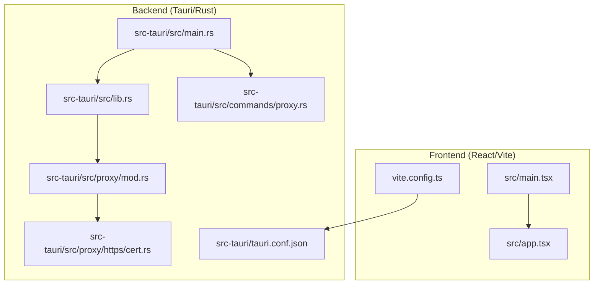
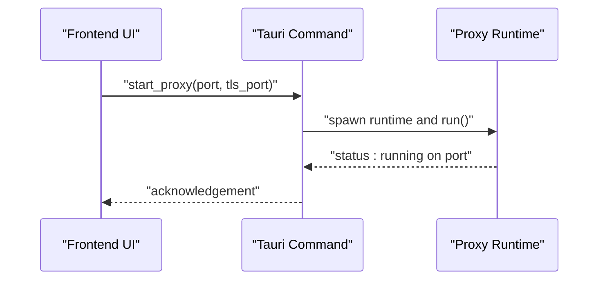
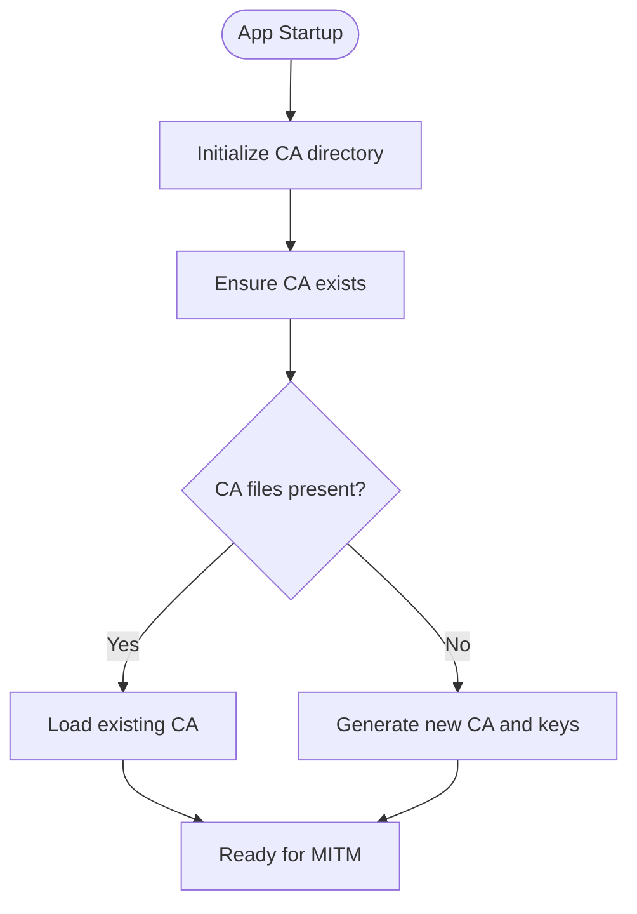
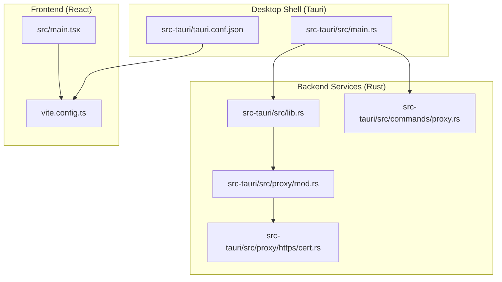
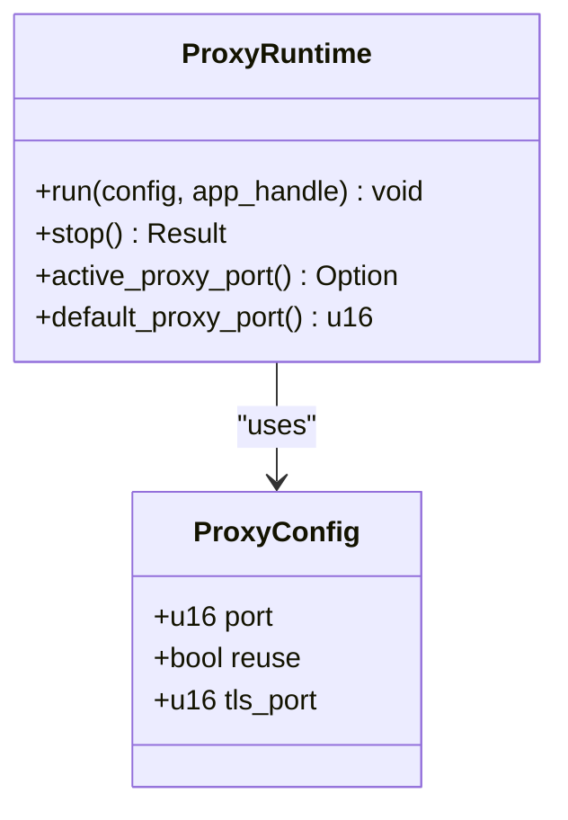
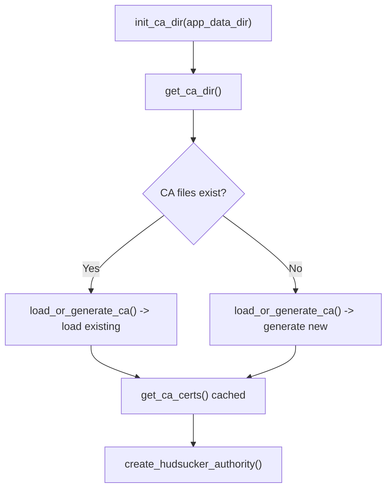
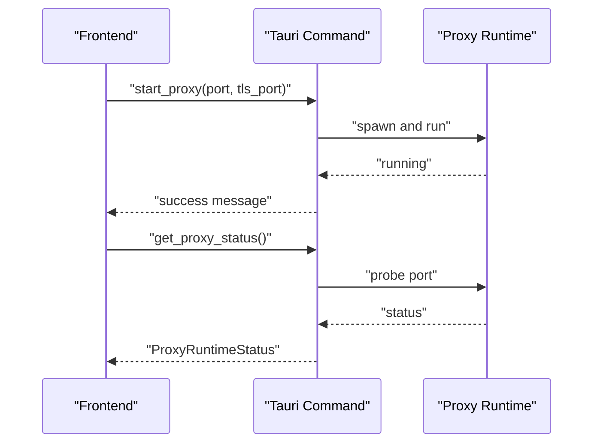
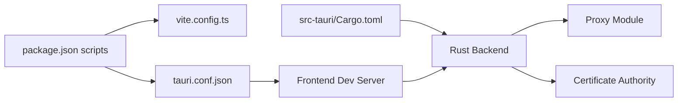

# Getting Started

<cite>
**Referenced Files in This Document**
- [README.md](file://README.md)
- [package.json](file://package.json)
- [vite.config.ts](file://vite.config.ts)
- [src-tauri/tauri.conf.json](file://src-tauri/tauri.conf.json)
- [src-tauri/Cargo.toml](file://src-tauri/Cargo.toml)
- [src-tauri/src/main.rs](file://src-tauri/src/main.rs)
- [src-tauri/src/lib.rs](file://src-tauri/src/lib.rs)
- [src-tauri/src/proxy/mod.rs](file://src-tauri/src/proxy/mod.rs)
- [src-tauri/src/proxy/https/cert.rs](file://src-tauri/src/proxy/https/cert.rs)
- [src-tauri/src/commands/proxy.rs](file://src-tauri/src/commands/proxy.rs)
- [install.sh](file://install.sh)
- [scripts/install.sh](file://scripts/install.sh)
- [scripts/fix-packet-capture-permissions.sh](file://scripts/fix-packet-capture-permissions.sh)
- [src/main.tsx](file://src/main.tsx)
</cite>

## Table of Contents
1. [Introduction](#introduction)
2. [Project Structure](#project-structure)
3. [System Requirements](#system-requirements)
4. [Installation](#installation)
5. [Development Environment Setup](#development-environment-setup)
6. [Basic Usage](#basic-usage)
7. [Architecture Overview](#architecture-overview)
8. [Detailed Component Analysis](#detailed-component-analysis)
9. [Dependency Analysis](#dependency-analysis)
10. [Performance Considerations](#performance-considerations)
11. [Troubleshooting Guide](#troubleshooting-guide)
12. [Conclusion](#conclusion)

## Introduction
AppRecon is a network proxy and traffic inspection tool built with Tauri, React, and TypeScript. It provides features such as traffic interception with MITM proxy support, certificate management with OS trust store integration, filtering and tagging of traffic, session management, breakpoints, scripting, and multi-format viewers. This guide helps you install, configure, and use AppRecon effectively across Windows, macOS, and Linux.

## Project Structure
AppRecon follows a hybrid architecture:
- Frontend: React 19 with Vite, TypeScript, Tailwind CSS, and Radix UI
- Backend: Rust/Tauri 2 with Hyper, Tokio, and Hudsucker for proxying
- Database: SQLite with ZSTD compression
- Proxy: Custom TrafficListener with rustls TLS termination

**Diagram sources**
- [src/main.tsx:1-72](file://src/main.tsx#L1-L72)
- [vite.config.ts:1-41](file://vite.config.ts#L1-L41)
- [src-tauri/src/main.rs:1-184](file://src-tauri/src/main.rs#L1-L184)
- [src-tauri/src/lib.rs:1-51](file://src-tauri/src/lib.rs#L1-L51)
- [src-tauri/src/proxy/mod.rs:1-188](file://src-tauri/src/proxy/mod.rs#L1-L188)
- [src-tauri/src/proxy/https/cert.rs:1-144](file://src-tauri/src/proxy/https/cert.rs#L1-L144)
- [src-tauri/src/commands/proxy.rs:1-74](file://src-tauri/src/commands/proxy.rs#L1-L74)
- [src-tauri/tauri.conf.json:1-48](file://src-tauri/tauri.conf.json#L1-L48)

**Section sources**
- [README.md:40-61](file://README.md#L40-L61)

## System Requirements
- Operating systems: Windows, macOS, Linux
- Hardware: Modern CPU and sufficient RAM for proxy and packet capture workloads
- Network: Outbound HTTPS access for updates and optional Cloudflare R2 for distribution
- Permissions:
  - Administrative privileges for installing system CA certificates
  - Packet capture permissions on macOS (requires BPF device access)
- Optional: Cloudflare R2 credentials if you plan to self-host updates

**Section sources**
- [src-tauri/src/proxy/https/cert.rs:106-144](file://src-tauri/src/proxy/https/cert.rs#L106-L144)
- [scripts/fix-packet-capture-permissions.sh:1-17](file://scripts/fix-packet-capture-permissions.sh#L1-L17)

## Installation

### Install Dependencies
- Node.js: Required for the React/Vite frontend and pnpm package manager
- pnpm: Used to manage frontend dependencies and scripts
- Rust toolchain: Required for building the Tauri/Rust backend
- Platform-specific prerequisites:
  - Windows: Visual Studio build tools recommended
  - macOS: Xcode command line tools
  - Linux: Build essentials and system libraries for Tauri bundling

Install steps:
1. Install Node.js LTS and pnpm
2. Install Rust toolchain (cargo/rustc)
3. Install Tauri prerequisites per your OS

Verification:
- Confirm versions: node --version, pnpm --version, rustc --version

**Section sources**
- [README.md:24-38](file://README.md#L24-L38)
- [package.json:6-13](file://package.json#L6-L13)

### Install AppRecon

#### Option A: Download Prebuilt App (Recommended for most users)
- macOS: Use the provided installer script to fetch and verify the latest release, then install into Applications
  - The script downloads the DMG, verifies SHA-256 checksum, mounts, and copies the app
- Windows/Linux: Use the published releases or your distribution’s package manager if available

Steps:
1. Ensure required commands are present (curl, hdiutil/ditto/shasum/awk on macOS)
2. Run the installer script to download and install the app
3. Open the installed application

Notes:
- The script supports Apple Silicon (arm64) and Intel (x86_64) macOS builds
- On macOS, you may need to grant permissions for packet capture later

**Section sources**
- [install.sh:1-99](file://install.sh#L1-L99)
- [scripts/install.sh:1-99](file://scripts/install.sh#L1-L99)

#### Option B: Build from Source (For Developers)
1. Clone the repository
2. Install frontend dependencies
3. Build the frontend
4. Run the Tauri application

Commands:
- Install dependencies: pnpm install
- Build frontend: pnpm build
- Run Tauri app: pnpm tauri

Optional: Direct Rust backend execution for testing
- cd src-tauri && cargo run

**Section sources**
- [README.md:24-38](file://README.md#L24-L38)
- [package.json:6-13](file://package.json#L6-L13)

## Development Environment Setup

### Prerequisites
- Node.js LTS and pnpm
- Rust toolchain with target support for your platform
- Tauri CLI installed globally or via project devDependencies

### Steps
1. Install dependencies
   - pnpm install
2. Start the development server
   - pnpm dev
   - The Vite dev server runs on port 1420 and hosts the React frontend
3. Run the Tauri application
   - pnpm tauri
   - This launches the desktop app with the dev frontend served locally

Configuration highlights:
- Dev URL and build pipeline are configured in Tauri config
- Vite server binds to 127.0.0.1:1420 with strict port enforcement

**Section sources**
- [README.md:24-38](file://README.md#L24-L38)
- [vite.config.ts:8-15](file://vite.config.ts#L8-L15)
- [src-tauri/tauri.conf.json:7-11](file://src-tauri/tauri.conf.json#L7-L11)

## Basic Usage

### Start the Proxy
- From the UI, enable the proxy or use the command API
- The proxy listens on HTTP and HTTPS MITM ports by default
- The backend ensures the CA exists and configures TLS termination

**Diagram sources**
- [src-tauri/src/commands/proxy.rs:15-52](file://src-tauri/src/commands/proxy.rs#L15-L52)
- [src-tauri/src/proxy/mod.rs:93-188](file://src-tauri/src/proxy/mod.rs#L93-L188)

**Section sources**
- [src-tauri/src/commands/proxy.rs:15-52](file://src-tauri/src/commands/proxy.rs#L15-L52)
- [src-tauri/src/proxy/mod.rs:93-188](file://src-tauri/src/proxy/mod.rs#L93-L188)

### Configure Certificate Trust
- The app generates a CA certificate on first run and stores it under the application data directory
- Export or install the CA into your OS trust store to avoid TLS warnings
- The backend manages CA creation and persistence

**Diagram sources**
- [src-tauri/src/main.rs:30-41](file://src-tauri/src/main.rs#L30-L41)
- [src-tauri/src/proxy/https/cert.rs:42-94](file://src-tauri/src/proxy/https/cert.rs#L42-L94)

**Section sources**
- [src-tauri/src/main.rs:30-41](file://src-tauri/src/main.rs#L30-L41)
- [src-tauri/src/proxy/https/cert.rs:42-94](file://src-tauri/src/proxy/https/cert.rs#L42-L94)

### Capture Traffic
- Use the live traffic view to inspect HTTP/HTTPS requests and responses
- Toggle intercept mode to pause and modify requests/responses
- Export sessions to HAR, CSV, or SQLite for analysis

**Section sources**
- [README.md:5-16](file://README.md#L5-L16)

### Navigate the Interface
- The main entry renders the app layout and routes
- Settings and specialized windows are supported via URL parameters and window labels

**Section sources**
- [src/main.tsx:29-72](file://src/main.tsx#L29-L72)

## Architecture Overview

**Diagram sources**
- [src-tauri/src/main.rs:1-184](file://src-tauri/src/main.rs#L1-L184)
- [src-tauri/src/lib.rs:1-51](file://src-tauri/src/lib.rs#L1-L51)
- [src-tauri/src/proxy/mod.rs:1-188](file://src-tauri/src/proxy/mod.rs#L1-L188)
- [src-tauri/src/proxy/https/cert.rs:1-144](file://src-tauri/src/proxy/https/cert.rs#L1-L144)
- [src-tauri/src/commands/proxy.rs:1-74](file://src-tauri/src/commands/proxy.rs#L1-L74)
- [src/main.tsx:1-72](file://src/main.tsx#L1-L72)
- [vite.config.ts:1-41](file://vite.config.ts#L1-L41)
- [src-tauri/tauri.conf.json:1-48](file://src-tauri/tauri.conf.json#L1-L48)

## Detailed Component Analysis

### Proxy Runtime
- Initializes CA, validates port availability, and starts the Hudsucker proxy with TLS termination
- Provides commands to start/stop the proxy and query status

**Diagram sources**
- [src-tauri/src/proxy/mod.rs:26-91](file://src-tauri/src/proxy/mod.rs#L26-L91)
- [src-tauri/src/proxy/mod.rs:93-188](file://src-tauri/src/proxy/mod.rs#L93-L188)

**Section sources**
- [src-tauri/src/proxy/mod.rs:26-91](file://src-tauri/src/proxy/mod.rs#L26-L91)
- [src-tauri/src/proxy/mod.rs:93-188](file://src-tauri/src/proxy/mod.rs#L93-L188)

### Certificate Authority Management
- Ensures CA directory exists, loads or generates CA, exports PEM, and creates Hudsucker authority
- Regenerates CA if missing

**Diagram sources**
- [src-tauri/src/proxy/https/cert.rs:11-40](file://src-tauri/src/proxy/https/cert.rs#L11-L40)
- [src-tauri/src/proxy/https/cert.rs:42-94](file://src-tauri/src/proxy/https/cert.rs#L42-L94)
- [src-tauri/src/proxy/https/cert.rs:106-118](file://src-tauri/src/proxy/https/cert.rs#L106-L118)

**Section sources**
- [src-tauri/src/proxy/https/cert.rs:11-40](file://src-tauri/src/proxy/https/cert.rs#L11-L40)
- [src-tauri/src/proxy/https/cert.rs:42-94](file://src-tauri/src/proxy/https/cert.rs#L42-L94)
- [src-tauri/src/proxy/https/cert.rs:106-118](file://src-tauri/src/proxy/https/cert.rs#L106-L118)

### Tauri Command Surface
- Exposes proxy control commands and other features to the frontend
- Starts/stops proxy and reports runtime status

**Diagram sources**
- [src-tauri/src/commands/proxy.rs:15-73](file://src-tauri/src/commands/proxy.rs#L15-L73)
- [src-tauri/src/proxy/mod.rs:93-188](file://src-tauri/src/proxy/mod.rs#L93-L188)

**Section sources**
- [src-tauri/src/commands/proxy.rs:15-73](file://src-tauri/src/commands/proxy.rs#L15-L73)

## Dependency Analysis

**Diagram sources**
- [package.json:6-13](file://package.json#L6-L13)
- [vite.config.ts:1-41](file://vite.config.ts#L1-L41)
- [src-tauri/tauri.conf.json:1-48](file://src-tauri/tauri.conf.json#L1-L48)
- [src-tauri/Cargo.toml:1-62](file://src-tauri/Cargo.toml#L1-L62)

**Section sources**
- [package.json:6-13](file://package.json#L6-L13)
- [vite.config.ts:1-41](file://vite.config.ts#L1-L41)
- [src-tauri/tauri.conf.json:1-48](file://src-tauri/tauri.conf.json#L1-L48)
- [src-tauri/Cargo.toml:1-62](file://src-tauri/Cargo.toml#L1-L62)

## Performance Considerations
- Keep the dev server on port 1420; the strict port mode prevents conflicts
- Chunk splitting in Vite reduces bundle sizes for large vendor libraries
- Use intercept sparingly in high-throughput scenarios to minimize latency
- Limit filter scope to reduce memory pressure during long sessions

[No sources needed since this section provides general guidance]

## Troubleshooting Guide

### Firewall and Port Conflicts
- The proxy defaults to port 8888 (HTTP) and 8889 (HTTPS MITM)
- If port 1420 is busy, use the clean dev script to free it and restart
- Ensure your OS firewall allows loopback traffic

**Section sources**
- [src-tauri/src/proxy/mod.rs:47-56](file://src-tauri/src/proxy/mod.rs#L47-L56)
- [package.json:8-8](file://package.json#L8-L8)
- [vite.config.ts:10-10](file://vite.config.ts#L10-L10)

### Certificate Trust Issues
- If TLS warnings appear, export or install the CA certificate from the app’s CA directory
- The backend ensures CA existence on startup and can regenerate if missing

**Section sources**
- [src-tauri/src/proxy/https/cert.rs:131-144](file://src-tauri/src/proxy/https/cert.rs#L131-L144)

### Packet Capture Permissions (macOS)
- If packet capture fails, run the helper script to grant read/write access to /dev/bpf* devices
- Start a capture once, then rerun the script to detect and fix permissions

**Section sources**
- [scripts/fix-packet-capture-permissions.sh:1-17](file://scripts/fix-packet-capture-permissions.sh#L1-L17)

### Verify Installation
- Launch the app and confirm the main window appears
- Open settings to verify CA location and trust store integration
- Start the proxy and check status; ensure it reports running on the expected ports

**Section sources**
- [src-tauri/src/commands/proxy.rs:61-73](file://src-tauri/src/commands/proxy.rs#L61-L73)

## Conclusion
You now have the essentials to install, configure, and use AppRecon. Start with the prebuilt app for quick setup, or build from source for development. Use the proxy to capture and inspect traffic, trust the generated CA, and leverage the UI to manage sessions and tools. For persistent issues, consult the troubleshooting section and verify ports, certificates, and permissions.