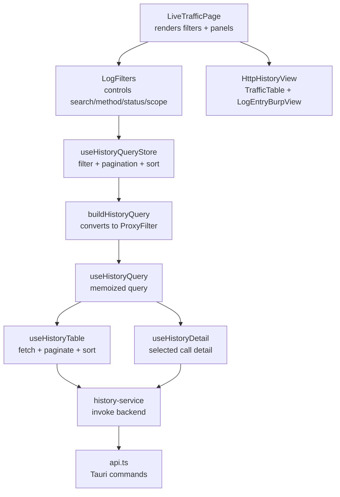
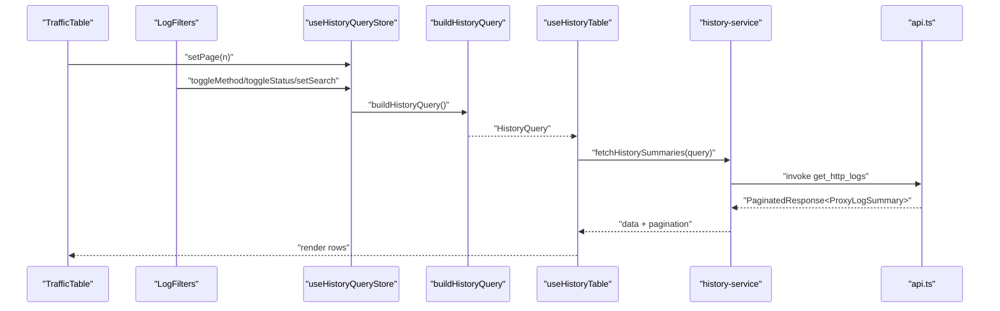
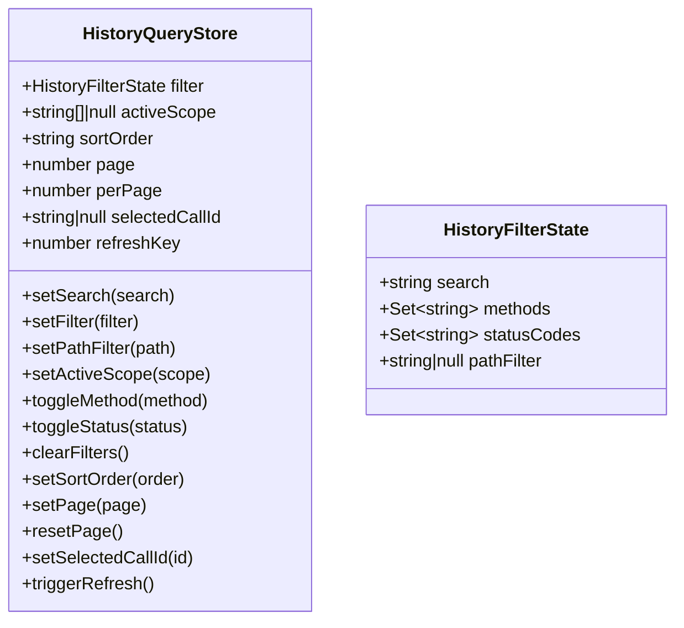
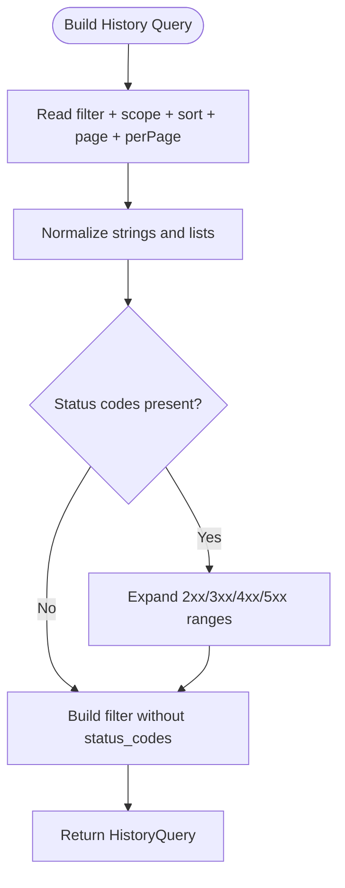
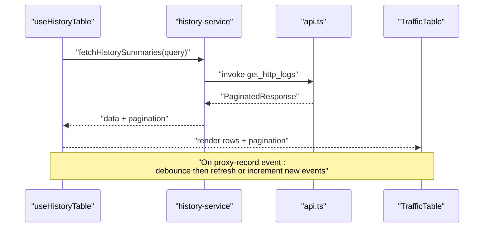
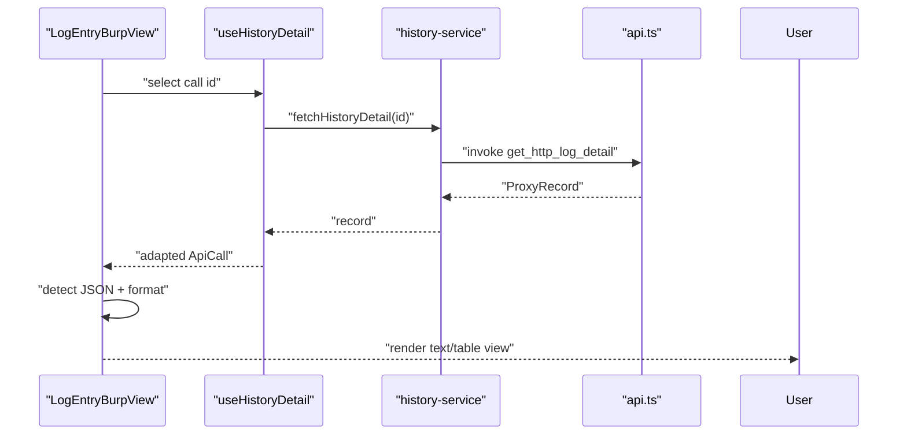
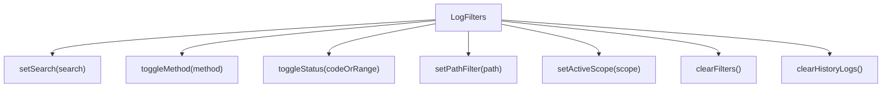
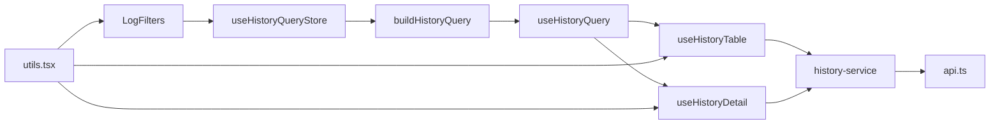

# HTTP History Management

<cite>
**Referenced Files in This Document**
- [src/pages/live-traffic/index.tsx](file://src/pages/live-traffic/index.tsx)
- [src/pages/live-traffic/components/http-history-view/index.tsx](file://src/pages/live-traffic/components/http-history-view/index.tsx)
- [src/pages/live-traffic/components/log-table/calls-columns.tsx](file://src/pages/live-traffic/components/log-table/calls-columns.tsx)
- [src/pages/live-traffic/components/log-table/log-entry-view.tsx](file://src/pages/live-traffic/components/log-table/log-entry-view.tsx)
- [src/pages/live-traffic/components/log-table/log-filters.tsx](file://src/pages/live-traffic/components/log-table/log-filters.tsx)
- [src/pages/live-traffic/components/log-table/utils.tsx](file://src/pages/live-traffic/components/log-table/utils.tsx)
- [src/pages/live-traffic/state/history-query-store.ts](file://src/pages/live-traffic/state/history-query-store.ts)
- [src/pages/live-traffic/state/build-history-query.ts](file://src/pages/live-traffic/state/build-history-query.ts)
- [src/pages/live-traffic/hooks/use-history-query.ts](file://src/pages/live-traffic/hooks/use-history-query.ts)
- [src/pages/live-traffic/hooks/use-history-table.ts](file://src/pages/live-traffic/hooks/use-history-table.ts)
- [src/pages/live-traffic/hooks/use-history-detail.ts](file://src/pages/live-traffic/hooks/use-history-detail.ts)
- [src/pages/live-traffic/services/history-service.ts](file://src/pages/live-traffic/services/history-service.ts)
- [src/pages/live-traffic/api.ts](file://src/pages/live-traffic/api.ts)
</cite>

## Table of Contents
1. [Introduction](#introduction)
2. [Project Structure](#project-structure)
3. [Core Components](#core-components)
4. [Architecture Overview](#architecture-overview)
5. [Detailed Component Analysis](#detailed-component-analysis)
6. [Dependency Analysis](#dependency-analysis)
7. [Performance Considerations](#performance-considerations)
8. [Troubleshooting Guide](#troubleshooting-guide)
9. [Conclusion](#conclusion)
10. [Appendices](#appendices)

## Introduction
This document explains the HTTP History Management system, focusing on the log table implementation, data rendering pipeline, and query state management. It covers the filtering system (URL patterns, status codes, methods, and scope), the log entry inspection interface, response detail viewing, and JSON parsing capabilities. It also documents the query store architecture, state synchronization, and performance optimization techniques, including pagination strategies and memory management for large datasets. Practical examples demonstrate filter configuration, search patterns, and export-related capabilities.

## Project Structure
The HTTP History Management feature is organized around a responsive two-panel layout: a traffic table (top) and a log entry inspector (bottom). Filtering controls reside above the table, and the tree view (sitemap) can be toggled alongside the table. State is centralized in a zustand store, transformed into a backend query, and consumed by hooks that manage pagination, sorting, and real-time updates.

**Diagram sources**
- [src/pages/live-traffic/index.tsx:13-76](file://src/pages/live-traffic/index.tsx#L13-L76)
- [src/pages/live-traffic/components/log-table/log-filters.tsx:36-185](file://src/pages/live-traffic/components/log-table/log-filters.tsx#L36-L185)
- [src/pages/live-traffic/components/http-history-view/index.tsx:7-19](file://src/pages/live-traffic/components/http-history-view/index.tsx#L7-L19)
- [src/pages/live-traffic/state/history-query-store.ts:40-139](file://src/pages/live-traffic/state/history-query-store.ts#L40-L139)
- [src/pages/live-traffic/state/build-history-query.ts:12-67](file://src/pages/live-traffic/state/build-history-query.ts#L12-L67)
- [src/pages/live-traffic/hooks/use-history-query.ts:7-116](file://src/pages/live-traffic/hooks/use-history-query.ts#L7-L116)
- [src/pages/live-traffic/hooks/use-history-table.ts:96-277](file://src/pages/live-traffic/hooks/use-history-table.ts#L96-L277)
- [src/pages/live-traffic/hooks/use-history-detail.ts:9-47](file://src/pages/live-traffic/hooks/use-history-detail.ts#L9-L47)
- [src/pages/live-traffic/services/history-service.ts:20-57](file://src/pages/live-traffic/services/history-service.ts#L20-L57)
- [src/pages/live-traffic/api.ts:125-143](file://src/pages/live-traffic/api.ts#L125-L143)

**Section sources**
- [src/pages/live-traffic/index.tsx:13-76](file://src/pages/live-traffic/index.tsx#L13-L76)
- [src/pages/live-traffic/components/http-history-view/index.tsx:7-19](file://src/pages/live-traffic/components/http-history-view/index.tsx#L7-L19)

## Core Components
- Query Store and Filters
  - Centralized state for search, methods, status codes, path filter, active scope, sort order, pagination, selection, and refresh key.
  - Provides actions to update filters, toggle method/status, clear filters, change sort order, manage pagination, select entries, and trigger refreshes.
- Query Builder
  - Converts the in-memory filter state into a backend-compatible ProxyFilter, normalizing lists and expanding status code ranges (e.g., 2xx).
- Hooks
  - useHistoryQuery: memoizes the built query and exposes filter state and actions.
  - useHistoryTable: orchestrates paginated fetching, debounced refresh, real-time updates via events, and local removal of entries.
  - useHistoryDetail: loads the selected call detail and adapts it to the UI model.
- UI Components
  - TrafficTable: renders the log table, handles selection, sorting, pagination, and “Load More.”
  - LogEntryBurpView: displays request/response details in text or table mode, supports JSON detection/formatting, and integrates with external tools.
  - LogFilters: provides search, method/status toggles, scope-based filtering, and clear-all actions.

**Section sources**
- [src/pages/live-traffic/state/history-query-store.ts:3-31](file://src/pages/live-traffic/state/history-query-store.ts#L3-L31)
- [src/pages/live-traffic/state/history-query-store.ts:40-139](file://src/pages/live-traffic/state/history-query-store.ts#L40-L139)
- [src/pages/live-traffic/state/build-history-query.ts:5-67](file://src/pages/live-traffic/state/build-history-query.ts#L5-L67)
- [src/pages/live-traffic/hooks/use-history-query.ts:7-116](file://src/pages/live-traffic/hooks/use-history-query.ts#L7-L116)
- [src/pages/live-traffic/hooks/use-history-table.ts:96-277](file://src/pages/live-traffic/hooks/use-history-table.ts#L96-L277)
- [src/pages/live-traffic/hooks/use-history-detail.ts:9-47](file://src/pages/live-traffic/hooks/use-history-detail.ts#L9-L47)
- [src/pages/live-traffic/components/log-table/calls-columns.tsx:141-285](file://src/pages/live-traffic/components/log-table/calls-columns.tsx#L141-L285)
- [src/pages/live-traffic/components/log-table/log-entry-view.tsx:50-323](file://src/pages/live-traffic/components/log-table/log-entry-view.tsx#L50-L323)
- [src/pages/live-traffic/components/log-table/log-filters.tsx:36-185](file://src/pages/live-traffic/components/log-table/log-filters.tsx#L36-L185)

## Architecture Overview
The system follows a unidirectional data flow:
- UI triggers actions in the query store.
- The store updates filter state and pagination.
- A builder transforms the state into a backend query.
- Hooks fetch data via service functions, adapting backend records to UI models.
- Real-time events refresh the first page while notifying users for off-page updates.

**Diagram sources**
- [src/pages/live-traffic/state/history-query-store.ts:40-139](file://src/pages/live-traffic/state/history-query-store.ts#L40-L139)
- [src/pages/live-traffic/state/build-history-query.ts:12-67](file://src/pages/live-traffic/state/build-history-query.ts#L12-L67)
- [src/pages/live-traffic/hooks/use-history-table.ts:136-171](file://src/pages/live-traffic/hooks/use-history-table.ts#L136-L171)
- [src/pages/live-traffic/services/history-service.ts:20-24](file://src/pages/live-traffic/services/history-service.ts#L20-L24)
- [src/pages/live-traffic/api.ts:125-137](file://src/pages/live-traffic/api.ts#L125-L137)

## Detailed Component Analysis

### Query Store and State Synchronization
- Filter state includes:
  - search: free-text search across URL, host, method, body.
  - methods: set of HTTP methods.
  - statusCodes: set of individual codes or ranges (expanded by builder).
  - pathFilter: optional path pattern filter.
  - activeScope: array of scope items or null.
- Pagination and sort:
  - page, perPage, sortOrder.
- Selection and refresh:
  - selectedCallId, refreshKey.
- Actions:
  - setSearch, setFilter, setPathFilter, setActiveScope, toggleMethod, toggleStatus, clearFilters, setSortOrder, setPage, resetPage, setSelectedCallId, triggerRefresh.
- Behavior highlights:
  - Changing filters resets page to 1.
  - Scope changes reset page and selection if scope differs.
  - Refresh key forces re-fetches.

**Diagram sources**
- [src/pages/live-traffic/state/history-query-store.ts:3-31](file://src/pages/live-traffic/state/history-query-store.ts#L3-L31)
- [src/pages/live-traffic/state/history-query-store.ts:40-139](file://src/pages/live-traffic/state/history-query-store.ts#L40-L139)

**Section sources**
- [src/pages/live-traffic/state/history-query-store.ts:3-31](file://src/pages/live-traffic/state/history-query-store.ts#L3-L31)
- [src/pages/live-traffic/state/history-query-store.ts:40-139](file://src/pages/live-traffic/state/history-query-store.ts#L40-L139)

### Query Building and Filtering System
- ProxyFilter fields:
  - search, path, methods (string[]), status_codes (number[]), scope (string[]).
- Normalization:
  - Trims and filters empty strings; nulls out empty arrays/lists.
- Status code expansion:
  - Ranges like 2xx expand to constituent codes; unknown labels are ignored.
- Active filters detection:
  - Presence of search, path, methods, statusCodes, or non-empty scope.

**Diagram sources**
- [src/pages/live-traffic/state/build-history-query.ts:12-67](file://src/pages/live-traffic/state/build-history-query.ts#L12-L67)

**Section sources**
- [src/pages/live-traffic/state/build-history-query.ts:5-67](file://src/pages/live-traffic/state/build-history-query.ts#L5-L67)
- [src/pages/live-traffic/state/build-history-query.ts:69-80](file://src/pages/live-traffic/state/build-history-query.ts#L69-L80)

### Data Rendering Pipeline (Traffic Table)
- Columns include time, method, host, path, sizes, MIME type, and action.
- Sorting is controlled by a sort order flag; clicking the header toggles asc/desc.
- Pagination:
  - Total count and “has more” flags drive UI state.
  - “Load More” appends subsequent pages.
- Real-time updates:
  - Listens for proxy-record events; refreshes first page immediately or increments new events counter otherwise.
  - Debounces event handling to avoid thrashing.
- Local removal:
  - Removes entries from the UI without reloading, updating totals and clearing selection if needed.

**Diagram sources**
- [src/pages/live-traffic/hooks/use-history-table.ts:136-171](file://src/pages/live-traffic/hooks/use-history-table.ts#L136-L171)
- [src/pages/live-traffic/services/history-service.ts:20-24](file://src/pages/live-traffic/services/history-service.ts#L20-L24)
- [src/pages/live-traffic/api.ts:125-137](file://src/pages/live-traffic/api.ts#L125-L137)

**Section sources**
- [src/pages/live-traffic/components/log-table/calls-columns.tsx:65-139](file://src/pages/live-traffic/components/log-table/calls-columns.tsx#L65-L139)
- [src/pages/live-traffic/components/log-table/calls-columns.tsx:141-285](file://src/pages/live-traffic/components/log-table/calls-columns.tsx#L141-L285)
- [src/pages/live-traffic/hooks/use-history-table.ts:96-277](file://src/pages/live-traffic/hooks/use-history-table.ts#L96-L277)

### Log Entry Inspection and Response Detail Viewing
- JSON detection:
  - Determines JSON content by Content-Type header, body prefix, or structure.
  - Pretty-prints JSON bodies for readability.
- View modes:
  - Text mode: raw request/response in a monospace editor.
  - Table mode: headers, cookies, params (request), headers, cookies, body (response).
- Actions:
  - Open in new window (response detail window).
  - Send to Repeater (builds a raw request and opens the Repeater tab).
- Error handling:
  - Displays loading states, errors, and empty states for selection and detail retrieval.

**Diagram sources**
- [src/pages/live-traffic/components/log-table/log-entry-view.tsx:50-323](file://src/pages/live-traffic/components/log-table/log-entry-view.tsx#L50-L323)
- [src/pages/live-traffic/hooks/use-history-detail.ts:9-47](file://src/pages/live-traffic/hooks/use-history-detail.ts#L9-L47)
- [src/pages/live-traffic/services/history-service.ts:30-32](file://src/pages/live-traffic/services/history-service.ts#L30-L32)
- [src/pages/live-traffic/api.ts:139-143](file://src/pages/live-traffic/api.ts#L139-L143)

**Section sources**
- [src/pages/live-traffic/components/log-table/log-entry-view.tsx:38-48](file://src/pages/live-traffic/components/log-table/log-entry-view.tsx#L38-L48)
- [src/pages/live-traffic/components/log-table/log-entry-view.tsx:150-165](file://src/pages/live-traffic/components/log-table/log-entry-view.tsx#L150-L165)
- [src/pages/live-traffic/components/log-table/log-entry-view.tsx:216-318](file://src/pages/live-traffic/components/log-table/log-entry-view.tsx#L216-L318)
- [src/pages/live-traffic/hooks/use-history-detail.ts:9-47](file://src/pages/live-traffic/hooks/use-history-detail.ts#L9-L47)

### Filtering Controls and Scope Integration
- Search:
  - Free-text search across URL, host, method, and body.
- Methods:
  - Toggleable buttons for GET, POST, PUT, DELETE, PATCH, HEAD.
- Status:
  - Predefined ranges (2xx, 3xx, 4xx, 5xx) plus individual codes.
- Path filter:
  - Optional path pattern applied to the filter.
- Scope:
  - Active scope passed through to the backend; changing scope resets pagination and selection.
- Clear actions:
  - Clear filters and clear all logs with confirmation.

**Diagram sources**
- [src/pages/live-traffic/components/log-table/log-filters.tsx:36-185](file://src/pages/live-traffic/components/log-table/log-filters.tsx#L36-L185)
- [src/pages/live-traffic/state/history-query-store.ts:49-121](file://src/pages/live-traffic/state/history-query-store.ts#L49-L121)
- [src/pages/live-traffic/state/build-history-query.ts:19-66](file://src/pages/live-traffic/state/build-history-query.ts#L19-L66)

**Section sources**
- [src/pages/live-traffic/components/log-table/log-filters.tsx:66-67](file://src/pages/live-traffic/components/log-table/log-filters.tsx#L66-L67)
- [src/pages/live-traffic/components/log-table/log-filters.tsx:126-159](file://src/pages/live-traffic/components/log-table/log-filters.tsx#L126-L159)
- [src/pages/live-traffic/components/log-table/utils.tsx:4-11](file://src/pages/live-traffic/components/log-table/utils.tsx#L4-L11)
- [src/pages/live-traffic/state/build-history-query.ts:24-53](file://src/pages/live-traffic/state/build-history-query.ts#L24-L53)

### Export and Tool Integration
- Export capability:
  - Utility to build a cURL command from a selected call.
- Tool integrations:
  - Send to Repeater builds a raw request and navigates to the Repeater tab.
  - Brute Force integration is present in the inspector but commented out in the UI.

**Section sources**
- [src/pages/live-traffic/components/log-table/utils.tsx:72-80](file://src/pages/live-traffic/components/log-table/utils.tsx#L72-L80)
- [src/pages/live-traffic/components/log-table/log-entry-view.tsx:77-111](file://src/pages/live-traffic/components/log-table/log-entry-view.tsx#L77-L111)

## Dependency Analysis
- UI depends on hooks for state and data.
- Hooks depend on the query store and builder to construct queries.
- Services encapsulate backend invocations; they depend on Tauri commands.
- Utilities support formatting, cookie parsing, and cURL generation.

**Diagram sources**
- [src/pages/live-traffic/components/log-table/log-filters.tsx:36-185](file://src/pages/live-traffic/components/log-table/log-filters.tsx#L36-L185)
- [src/pages/live-traffic/state/history-query-store.ts:40-139](file://src/pages/live-traffic/state/history-query-store.ts#L40-L139)
- [src/pages/live-traffic/state/build-history-query.ts:12-67](file://src/pages/live-traffic/state/build-history-query.ts#L12-L67)
- [src/pages/live-traffic/hooks/use-history-query.ts:7-116](file://src/pages/live-traffic/hooks/use-history-query.ts#L7-L116)
- [src/pages/live-traffic/hooks/use-history-table.ts:96-277](file://src/pages/live-traffic/hooks/use-history-table.ts#L96-L277)
- [src/pages/live-traffic/hooks/use-history-detail.ts:9-47](file://src/pages/live-traffic/hooks/use-history-detail.ts#L9-L47)
- [src/pages/live-traffic/services/history-service.ts:20-57](file://src/pages/live-traffic/services/history-service.ts#L20-L57)
- [src/pages/live-traffic/api.ts:125-143](file://src/pages/live-traffic/api.ts#L125-L143)
- [src/pages/live-traffic/components/log-table/utils.tsx:1-81](file://src/pages/live-traffic/components/log-table/utils.tsx#L1-L81)

**Section sources**
- [src/pages/live-traffic/hooks/use-history-query.ts:7-116](file://src/pages/live-traffic/hooks/use-history-query.ts#L7-L116)
- [src/pages/live-traffic/services/history-service.ts:20-57](file://src/pages/live-traffic/services/history-service.ts#L20-L57)
- [src/pages/live-traffic/api.ts:125-143](file://src/pages/live-traffic/api.ts#L125-L143)

## Performance Considerations
- Pagination and append-only loading:
  - First page loads synchronously; subsequent pages are appended to minimize reflows.
- Debouncing:
  - Fetches are debounced to reduce churn during rapid filter changes.
- Event-driven refresh:
  - Real-time events trigger a short debounce; immediate refresh for the first page, otherwise a “new events” indicator.
- Memory management:
  - Local removal decrements totals and clears selection to keep state consistent.
- Rendering optimizations:
  - Memoized query and shallow selector usage in hooks reduce unnecessary re-renders.
- Backend pagination:
  - perPage defaults to a reasonable size; adjust based on dataset volume and device performance.

[No sources needed since this section provides general guidance]

## Troubleshooting Guide
- Backend unavailable:
  - Tauri command invocation throws a descriptive error when the desktop backend is not running.
- Load failures:
  - Table and detail hooks surface errors; check network/backend connectivity and permissions.
- No matching traffic:
  - Empty state messages guide users to clear filters or switch tabs.
- Clearing logs:
  - Clear-all action requires confirmation and triggers a refresh.

**Section sources**
- [src/pages/live-traffic/api.ts:35-45](file://src/pages/live-traffic/api.ts#L35-L45)
- [src/pages/live-traffic/hooks/use-history-table.ts:159-168](file://src/pages/live-traffic/hooks/use-history-table.ts#L159-L168)
- [src/pages/live-traffic/hooks/use-history-detail.ts:29-35](file://src/pages/live-traffic/hooks/use-history-detail.ts#L29-L35)
- [src/pages/live-traffic/components/log-table/log-filters.tsx:169-182](file://src/pages/live-traffic/components/log-table/log-filters.tsx#L169-L182)

## Conclusion
The HTTP History Management system combines a robust query store, a builder that translates UI filters into backend queries, and hooks that manage pagination, sorting, and real-time updates. The UI offers flexible filtering, efficient pagination, and rich inspection of request/response details, including JSON-aware formatting and integration with external tools. The architecture emphasizes separation of concerns, memoization, and event-driven refresh to maintain responsiveness with large datasets.

[No sources needed since this section summarizes without analyzing specific files]

## Appendices

### Practical Examples

- Filter configuration
  - Search: Enter a URL substring, host, method, or body snippet.
  - Methods: Toggle desired HTTP methods.
  - Status: Select 2xx/3xx/4xx/5xx ranges or specific codes.
  - Path: Apply a path pattern filter.
  - Scope: Activate a scope to constrain results; changing scope resets pagination and selection.
  - Clear filters: Reset to default state.

- Search patterns
  - Use wildcards implicitly via substring matching in the search box.
  - Combine method and status toggles to narrow results quickly.

- Export functionality
  - Build a cURL command from a selected call using the utility function.
  - Send to Repeater to open the Repeater tab with a prepared request.

**Section sources**
- [src/pages/live-traffic/components/log-table/log-filters.tsx:73-78](file://src/pages/live-traffic/components/log-table/log-filters.tsx#L73-L78)
- [src/pages/live-traffic/components/log-table/log-filters.tsx:126-159](file://src/pages/live-traffic/components/log-table/log-filters.tsx#L126-L159)
- [src/pages/live-traffic/components/log-table/utils.tsx:72-80](file://src/pages/live-traffic/components/log-table/utils.tsx#L72-L80)
- [src/pages/live-traffic/components/log-table/log-entry-view.tsx:77-90](file://src/pages/live-traffic/components/log-table/log-entry-view.tsx#L77-L90)