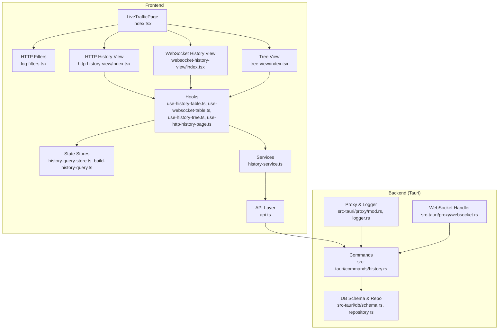
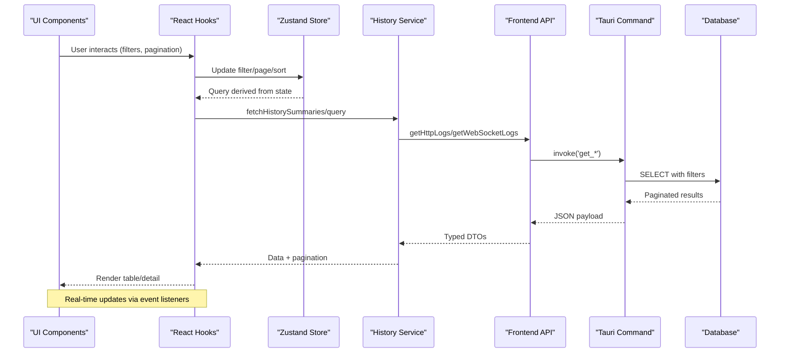
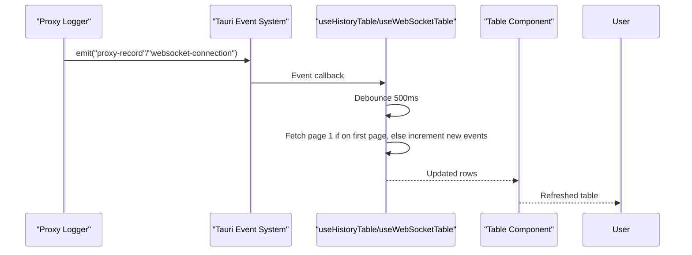
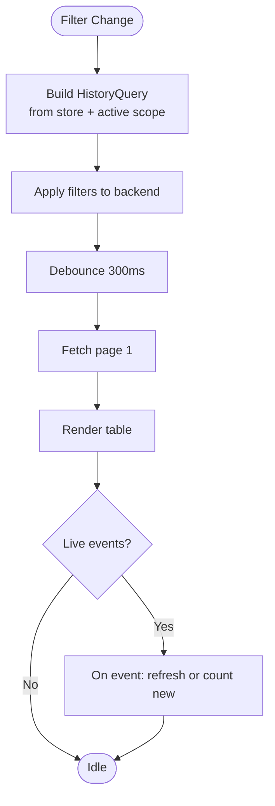
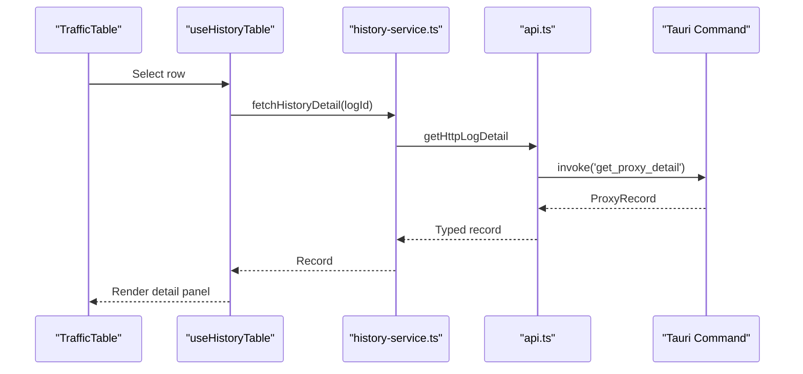
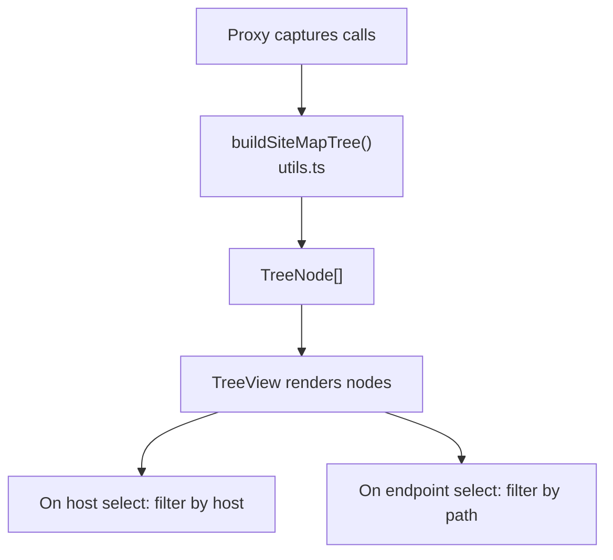
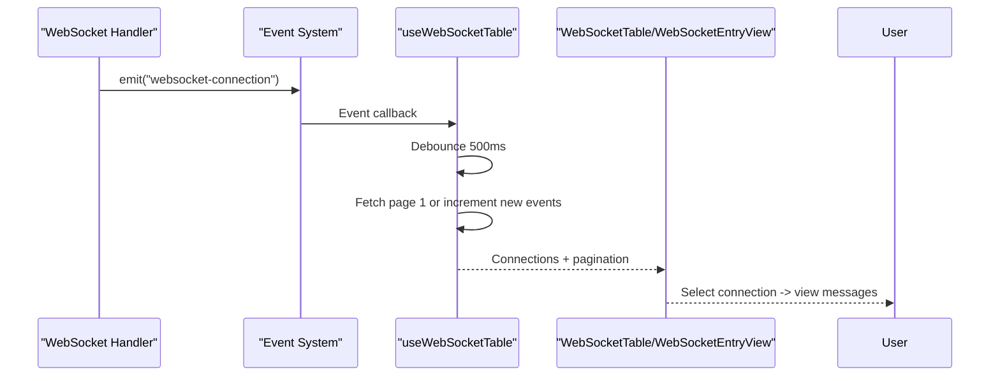
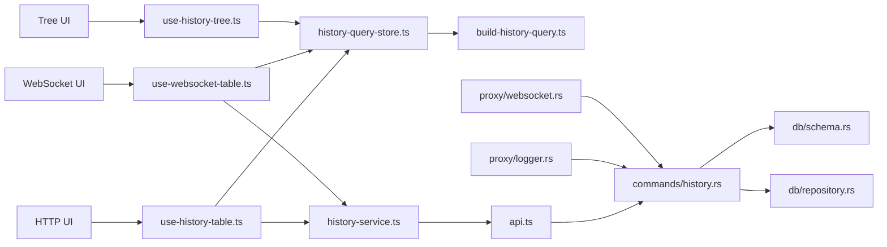

# Live Traffic Analysis

<cite>
**Referenced Files in This Document**
- [index.tsx](file://src/pages/live-traffic/index.tsx)
- [api.ts](file://src/pages/live-traffic/api.ts)
- [utils.ts](file://src/pages/live-traffic/utils.ts)
- [history-service.ts](file://src/pages/live-traffic/services/history-service.ts)
- [use-http-history-page.ts](file://src/pages/live-traffic/hooks/use-http-history-page.ts)
- [use-history-table.ts](file://src/pages/live-traffic/hooks/use-history-table.ts)
- [use-history-tree.ts](file://src/pages/live-traffic/hooks/use-history-tree.ts)
- [use-websocket-table.ts](file://src/pages/live-traffic/hooks/use-websocket-table.ts)
- [history-query-store.ts](file://src/pages/live-traffic/state/history-query-store.ts)
- [build-history-query.ts](file://src/pages/live-traffic/state/build-history-query.ts)
- [http-history-view/index.tsx](file://src/pages/live-traffic/components/http-history-view/index.tsx)
- [websocket-history-view/index.tsx](file://src/pages/live-traffic/components/websocket-history-view/index.tsx)
- [tree-view/index.tsx](file://src/pages/live-traffic/components/tree-view/index.tsx)
- [log-filters.tsx](file://src/pages/live-traffic/components/log-table/log-filters.tsx)
- [log-table/calls-columns.tsx](file://src/pages/live-traffic/components/log-table/calls-columns.tsx)
- [log-table/log-entry-view.tsx](file://src/pages/live-traffic/components/log-table/log-entry-view.tsx)
- [websocket-table.tsx](file://src/pages/live-traffic/components/websocket-history-view/websocket-table.tsx)
- [websocket-entry-view.tsx](file://src/pages/live-traffic/components/websocket-history-view/websocket-entry-view.tsx)
- [src-tauri/commands/history.rs](file://src-tauri/commands/history.rs)
- [src-tauri/db/schema.rs](file://src-tauri/db/schema.rs)
- [src-tauri/db/repository.rs](file://src-tauri/db/repository.rs)
- [src-tauri/proxy/mod.rs](file://src-tauri/proxy/mod.rs)
- [src-tauri/proxy/logger.rs](file://src-tauri/proxy/logger.rs)
- [src-tauri/proxy/websocket.rs](file://src-tauri/proxy/websocket.rs)
</cite>

## Table of Contents
1. [Introduction](#introduction)
2. [Project Structure](#project-structure)
3. [Core Components](#core-components)
4. [Architecture Overview](#architecture-overview)
5. [Detailed Component Analysis](#detailed-component-analysis)
6. [Dependency Analysis](#dependency-analysis)
7. [Performance Considerations](#performance-considerations)
8. [Troubleshooting Guide](#troubleshooting-guide)
9. [Conclusion](#conclusion)
10. [Appendices](#appendices)

## Introduction
This document explains AppRecon’s Live Traffic Analysis feature, covering real-time HTTP and WebSocket traffic visualization, filtering, and performance metrics display. It documents the HTTP history management system (request/response inspection, search/filtering, and clearing), the hierarchical tree view for traffic organization and target selection, and WebSocket-specific connection and message analysis. It also outlines the underlying database schema, query optimization strategies, data retention policies, and practical workflows for efficient traffic analysis.

## Project Structure
The Live Traffic feature is implemented as a React page with TypeScript hooks, UI components, and a service layer that bridges to Tauri backend commands. The frontend manages state via zustand stores, debounced queries, and event listeners for real-time updates. The backend persists and retrieves traffic data using a Rust-based persistence layer.

**Diagram sources**
- [index.tsx:13-77](file://src/pages/live-traffic/index.tsx#L13-L77)
- [log-filters.tsx:36-186](file://src/pages/live-traffic/components/log-table/log-filters.tsx#L36-L186)
- [http-history-view/index.tsx:7-20](file://src/pages/live-traffic/components/http-history-view/index.tsx#L7-L20)
- [websocket-history-view/index.tsx:9-27](file://src/pages/live-traffic/components/websocket-history-view/index.tsx#L9-L27)
- [tree-view/index.tsx:12-69](file://src/pages/live-traffic/components/tree-view/index.tsx#L12-L69)
- [use-history-table.ts:96-278](file://src/pages/live-traffic/hooks/use-history-table.ts#L96-L278)
- [use-websocket-table.ts:35-184](file://src/pages/live-traffic/hooks/use-websocket-table.ts#L35-L184)
- [use-history-tree.ts:8-41](file://src/pages/live-traffic/hooks/use-history-tree.ts#L8-L41)
- [use-http-history-page.ts:13-120](file://src/pages/live-traffic/hooks/use-http-history-page.ts#L13-L120)
- [history-query-store.ts:40-140](file://src/pages/live-traffic/state/history-query-store.ts#L40-L140)
- [build-history-query.ts:12-98](file://src/pages/live-traffic/state/build-history-query.ts#L12-L98)
- [history-service.ts:20-57](file://src/pages/live-traffic/services/history-service.ts#L20-L57)
- [api.ts:125-194](file://src/pages/live-traffic/api.ts#L125-L194)
- [src-tauri/commands/history.rs](file://src-tauri/commands/history.rs)
- [src-tauri/db/schema.rs](file://src-tauri/db/schema.rs)
- [src-tauri/db/repository.rs](file://src-tauri/db/repository.rs)
- [src-tauri/proxy/mod.rs](file://src-tauri/proxy/mod.rs)
- [src-tauri/proxy/logger.rs](file://src-tauri/proxy/logger.rs)
- [src-tauri/proxy/websocket.rs](file://src-tauri/proxy/websocket.rs)

**Section sources**
- [index.tsx:13-77](file://src/pages/live-traffic/index.tsx#L13-L77)
- [api.ts:125-194](file://src/pages/live-traffic/api.ts#L125-L194)

## Core Components
- LiveTrafficPage orchestrates tabs, filters, and the main content area. It toggles between HTTP and WebSocket modes and conditionally renders the sitemap tree.
- HTTP Filters provide search, method/status filtering, sitemap toggle, and bulk clear operations.
- HTTP History View displays a table of calls and a detail panel for request/response inspection.
- WebSocket History View displays connections and a detail panel for messages.
- Tree View organizes traffic by host and path for quick navigation and filtering.
- Hooks manage real-time updates, pagination, sorting, and filtering for both HTTP and WebSocket histories.
- Services translate frontend queries into backend commands and handle pagination.
- State stores encapsulate filter state, pagination, and refresh triggers.

**Section sources**
- [index.tsx:13-77](file://src/pages/live-traffic/index.tsx#L13-L77)
- [log-filters.tsx:36-186](file://src/pages/live-traffic/components/log-table/log-filters.tsx#L36-L186)
- [http-history-view/index.tsx:7-20](file://src/pages/live-traffic/components/http-history-view/index.tsx#L7-L20)
- [websocket-history-view/index.tsx:9-27](file://src/pages/live-traffic/components/websocket-history-view/index.tsx#L9-L27)
- [tree-view/index.tsx:12-69](file://src/pages/live-traffic/components/tree-view/index.tsx#L12-L69)
- [use-history-table.ts:96-278](file://src/pages/live-traffic/hooks/use-history-table.ts#L96-L278)
- [use-websocket-table.ts:35-184](file://src/pages/live-traffic/hooks/use-websocket-table.ts#L35-L184)
- [use-history-tree.ts:8-41](file://src/pages/live-traffic/hooks/use-history-tree.ts#L8-L41)
- [history-service.ts:20-57](file://src/pages/live-traffic/services/history-service.ts#L20-L57)
- [history-query-store.ts:40-140](file://src/pages/live-traffic/state/history-query-store.ts#L40-L140)
- [build-history-query.ts:12-98](file://src/pages/live-traffic/state/build-history-query.ts#L12-L98)

## Architecture Overview
The Live Traffic feature follows a layered architecture:
- Frontend: React components and hooks manage UI state, real-time events, and pagination.
- Service Layer: Translates frontend queries into typed API calls to Tauri commands.
- Backend Commands: Persist and retrieve traffic data from the database.
- Database: Stores HTTP and WebSocket records with indices for efficient querying.
- Proxy/Logger: Captures and emits live traffic events to the frontend.

**Diagram sources**
- [use-history-table.ts:136-226](file://src/pages/live-traffic/hooks/use-history-table.ts#L136-L226)
- [use-websocket-table.ts:62-152](file://src/pages/live-traffic/hooks/use-websocket-table.ts#L62-L152)
- [history-service.ts:20-57](file://src/pages/live-traffic/services/history-service.ts#L20-L57)
- [api.ts:125-194](file://src/pages/live-traffic/api.ts#L125-L194)
- [src-tauri/commands/history.rs](file://src-tauri/commands/history.rs)
- [src-tauri/db/schema.rs](file://src-tauri/db/schema.rs)
- [src-tauri/db/repository.rs](file://src-tauri/db/repository.rs)

## Detailed Component Analysis

### Real-Time Traffic Visualization
- HTTP table listens for proxy-record events and refreshes the first page after a debounce to avoid UI thrashing. New events increment a counter when off-first-page, enabling “new events” UX.
- WebSocket table listens for websocket-connection events and applies similar debounce logic for live updates.
- Sorting is controlled via a sort order flag passed to the backend; pagination is handled by page/perPage parameters.

**Diagram sources**
- [use-history-table.ts:201-226](file://src/pages/live-traffic/hooks/use-history-table.ts#L201-L226)
- [use-websocket-table.ts:127-152](file://src/pages/live-traffic/hooks/use-websocket-table.ts#L127-L152)

**Section sources**
- [use-history-table.ts:136-226](file://src/pages/live-traffic/hooks/use-history-table.ts#L136-L226)
- [use-websocket-table.ts:62-152](file://src/pages/live-traffic/hooks/use-websocket-table.ts#L62-L152)

### Traffic Filtering Capabilities
- Search: Free-text search across URL, host, method, and body.
- Method Filter: Multi-select buttons toggle HTTP methods.
- Status Filter: Predefined groups (2xx, 3xx, 4xx, 5xx) and individual status codes.
- Path Filter: Selecting a sitemap endpoint sets a path filter.
- Scope: Active target scope is applied to limit results.
- Clear Filters: Resets all filters and clears selection.

**Diagram sources**
- [build-history-query.ts:12-67](file://src/pages/live-traffic/state/build-history-query.ts#L12-L67)
- [history-query-store.ts:40-140](file://src/pages/live-traffic/state/history-query-store.ts#L40-L140)
- [use-history-table.ts:173-199](file://src/pages/live-traffic/hooks/use-history-table.ts#L173-L199)

**Section sources**
- [log-filters.tsx:66-166](file://src/pages/live-traffic/components/log-table/log-filters.tsx#L66-L166)
- [build-history-query.ts:12-67](file://src/pages/live-traffic/state/build-history-query.ts#L12-L67)
- [history-query-store.ts:40-140](file://src/pages/live-traffic/state/history-query-store.ts#L40-L140)

### Performance Metrics Display
- The HTTP summary model exposes request/response sizes and timestamps suitable for rendering latency and throughput metrics in the UI. Duration and content decoding flags are present in the record adapter for richer metrics.
- The UI currently focuses on counts and sizes; adding latency calculations (duration_ms) and bandwidth metrics would require backend aggregation or UI-side computations.

**Section sources**
- [use-history-table.ts:33-94](file://src/pages/live-traffic/hooks/use-history-table.ts#L33-L94)

### HTTP History Management
- Pagination: Controlled by page and perPage; has_more indicates continuation.
- Detail Inspection: Selected row opens a detail panel with request/response bodies and headers.
- Export: The API layer defines DTOs for records; exporting to HAR or CSV would require backend endpoints and frontend handlers.

**Diagram sources**
- [use-history-table.ts:260-278](file://src/pages/live-traffic/hooks/use-history-table.ts#L260-L278)
- [history-service.ts:30-32](file://src/pages/live-traffic/services/history-service.ts#L30-L32)
- [api.ts:139-143](file://src/pages/live-traffic/api.ts#L139-L143)

**Section sources**
- [use-history-table.ts:260-278](file://src/pages/live-traffic/hooks/use-history-table.ts#L260-L278)
- [history-service.ts:30-32](file://src/pages/live-traffic/services/history-service.ts#L30-L32)
- [api.ts:139-143](file://src/pages/live-traffic/api.ts#L139-L143)

### Tree View Navigation and Target Selection
- The tree is built from captured HTTP calls and grouped by host and path. Selecting a host applies a host filter; selecting an endpoint applies a path filter.
- The tree is refreshed when filters change and supports expansion based on active host filter.

**Diagram sources**
- [utils.ts:4-96](file://src/pages/live-traffic/utils.ts#L4-L96)
- [tree-view/index.tsx:12-69](file://src/pages/live-traffic/components/tree-view/index.tsx#L12-L69)
- [use-http-history-page.ts:60-74](file://src/pages/live-traffic/hooks/use-http-history-page.ts#L60-L74)

**Section sources**
- [utils.ts:4-96](file://src/pages/live-traffic/utils.ts#L4-L96)
- [tree-view/index.tsx:12-69](file://src/pages/live-traffic/components/tree-view/index.tsx#L12-L69)
- [use-http-history-page.ts:60-74](file://src/pages/live-traffic/hooks/use-http-history-page.ts#L60-L74)

### WebSocket Traffic Analysis
- Connections: List shows URL, host, path, direction, state, message count, and last activity.
- Messages: Detail panel displays message type, direction, payload size, and raw payload bytes.
- Lifecycle: Connections are emitted as events; deletion is supported via backend command.

**Diagram sources**
- [use-websocket-table.ts:127-152](file://src/pages/live-traffic/hooks/use-websocket-table.ts#L127-L152)
- [websocket-history-view/index.tsx:9-27](file://src/pages/live-traffic/components/websocket-history-view/index.tsx#L9-L27)

**Section sources**
- [use-websocket-table.ts:35-184](file://src/pages/live-traffic/hooks/use-websocket-table.ts#L35-L184)
- [websocket-history-view/index.tsx:9-27](file://src/pages/live-traffic/components/websocket-history-view/index.tsx#L9-L27)

### Practical Workflows
- Analyze recent HTTP traffic:
  - Open Live Traffic, ensure HTTP mode is active.
  - Use method/status filters to narrow results.
  - Toggle sitemap to explore endpoints; click an endpoint to filter by path.
  - Inspect a row to view request/response details.
- Monitor WebSocket connections:
  - Switch to WebSocket mode.
  - Observe live connections; select a connection to inspect messages.
  - Use search and scope filters to focus on specific hosts or paths.
- Export and clear:
  - Use the “Clear All” action to purge HTTP logs (bulk delete via backend).
  - Export capability requires additional backend endpoints and UI handlers.

**Section sources**
- [log-filters.tsx:66-166](file://src/pages/live-traffic/components/log-table/log-filters.tsx#L66-L166)
- [index.tsx:13-77](file://src/pages/live-traffic/index.tsx#L13-L77)

## Dependency Analysis
The frontend depends on typed APIs and zustand stores to orchestrate queries and real-time updates. The service layer delegates to Tauri commands backed by a Rust persistence layer.

**Diagram sources**
- [use-history-table.ts:96-278](file://src/pages/live-traffic/hooks/use-history-table.ts#L96-L278)
- [use-websocket-table.ts:35-184](file://src/pages/live-traffic/hooks/use-websocket-table.ts#L35-L184)
- [use-history-tree.ts:8-41](file://src/pages/live-traffic/hooks/use-history-tree.ts#L8-L41)
- [history-query-store.ts:40-140](file://src/pages/live-traffic/state/history-query-store.ts#L40-L140)
- [build-history-query.ts:12-98](file://src/pages/live-traffic/state/build-history-query.ts#L12-L98)
- [history-service.ts:20-57](file://src/pages/live-traffic/services/history-service.ts#L20-L57)
- [api.ts:125-194](file://src/pages/live-traffic/api.ts#L125-L194)
- [src-tauri/commands/history.rs](file://src-tauri/commands/history.rs)
- [src-tauri/db/schema.rs](file://src-tauri/db/schema.rs)
- [src-tauri/db/repository.rs](file://src-tauri/db/repository.rs)
- [src-tauri/proxy/mod.rs](file://src-tauri/proxy/mod.rs)
- [src-tauri/proxy/logger.rs](file://src-tauri/proxy/logger.rs)
- [src-tauri/proxy/websocket.rs](file://src-tauri/proxy/websocket.rs)

**Section sources**
- [history-service.ts:20-57](file://src/pages/live-traffic/services/history-service.ts#L20-L57)
- [api.ts:125-194](file://src/pages/live-traffic/api.ts#L125-L194)
- [src-tauri/commands/history.rs](file://src-tauri/commands/history.rs)
- [src-tauri/db/schema.rs](file://src-tauri/db/schema.rs)
- [src-tauri/db/repository.rs](file://src-tauri/db/repository.rs)

## Performance Considerations
- Debouncing: Both HTTP and WebSocket tables debounce query execution to reduce backend load and stabilize the UI.
- Pagination: Always fetch in pages; avoid loading entire datasets at once.
- Sorting: Keep sort order consistent across sessions; the backend receives a sort flag.
- Real-time updates: Use event-driven refresh only on the first page to minimize re-render churn; otherwise, show a “new events” indicator.
- Payload decoding: Prefer streaming or chunked decoding for large bodies; avoid decoding entire payloads unnecessarily.
- Database indexing: Ensure indices exist on frequently filtered columns (host, path, method, status, timestamp).

[No sources needed since this section provides general guidance]

## Troubleshooting Guide
- Tauri backend unavailable:
  - The API layer checks for Tauri internals and throws a descriptive error if the desktop app is not running.
- Failed to fetch logs:
  - The table hooks catch errors during fetch and display an error state; verify backend connectivity and filter validity.
- No sitemap entries:
  - The tree view shows an empty state when no traffic matches the active scope or none is captured yet.
- Clearing logs:
  - Bulk clear invokes a backend command; confirm the action via the dialog.
- WebSocket detail not loading:
  - Ensure a connection is selected and the backend command for fetching details is reachable.

**Section sources**
- [api.ts:35-45](file://src/pages/live-traffic/api.ts#L35-L45)
- [use-history-table.ts:159-168](file://src/pages/live-traffic/hooks/use-history-table.ts#L159-L168)
- [use-websocket-table.ts:85-94](file://src/pages/live-traffic/hooks/use-websocket-table.ts#L85-L94)
- [tree-view/index.tsx:40-51](file://src/pages/live-traffic/components/tree-view/index.tsx#L40-L51)
- [log-filters.tsx:169-182](file://src/pages/live-traffic/components/log-table/log-filters.tsx#L169-L182)

## Conclusion
AppRecon’s Live Traffic Analysis provides a robust, real-time system for inspecting HTTP and WebSocket traffic. Its modular architecture separates concerns across UI, state, services, and backend commands, enabling scalable filtering, pagination, and live updates. Extending export capabilities, adding latency metrics, and optimizing database queries will further enhance the analyst’s productivity.

[No sources needed since this section summarizes without analyzing specific files]

## Appendices

### Database Schema and Query Optimization
- Schema: Defines tables for HTTP and WebSocket records with appropriate columns for filtering and sorting.
- Repository: Implements paginated queries with optional filters and sort order.
- Optimization:
  - Add indices on host, path, method, status_code, timestamp, and scope arrays.
  - Use partial indices for frequent status ranges (e.g., 2xx, 4xx).
  - Normalize repeated scopes to a separate table to enable efficient JOINs.
  - Implement TTL-based retention policies to cap historical data growth.

**Section sources**
- [src-tauri/db/schema.rs](file://src-tauri/db/schema.rs)
- [src-tauri/db/repository.rs](file://src-tauri/db/repository.rs)

### Backend Commands and Proxies
- Commands: Expose get_proxy_paginated, get_proxy_detail, get_websocket_paginated, get_websocket_detail, and deletion commands.
- Proxy Logger: Emits live events for HTTP traffic.
- WebSocket Handler: Emits live events for WebSocket connections and manages message storage.

**Section sources**
- [src-tauri/commands/history.rs](file://src-tauri/commands/history.rs)
- [src-tauri/proxy/logger.rs](file://src-tauri/proxy/logger.rs)
- [src-tauri/proxy/websocket.rs](file://src-tauri/proxy/websocket.rs)