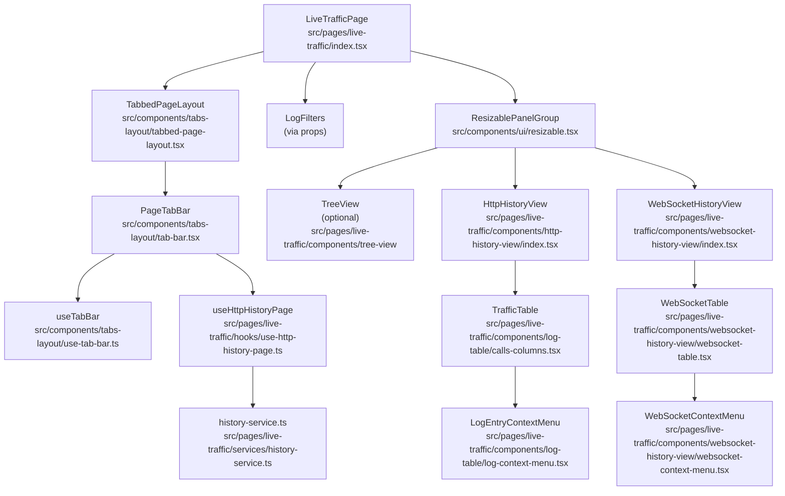
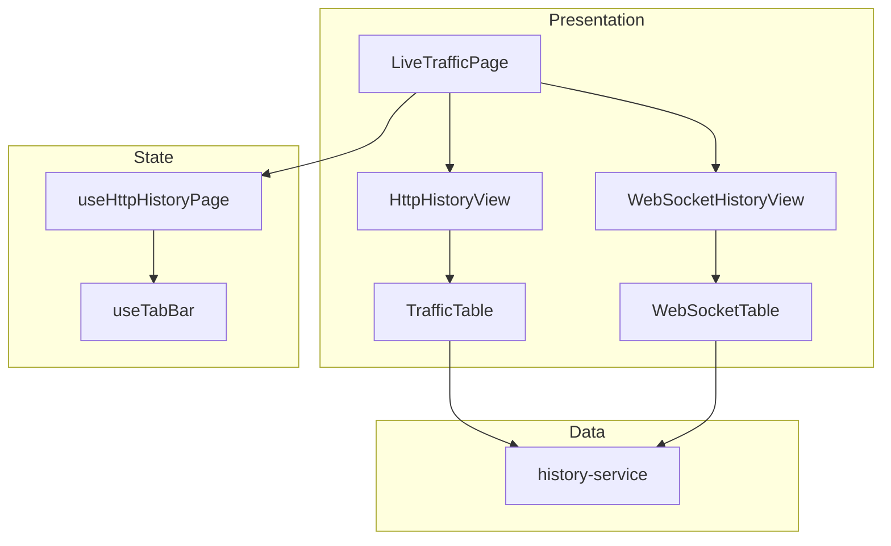
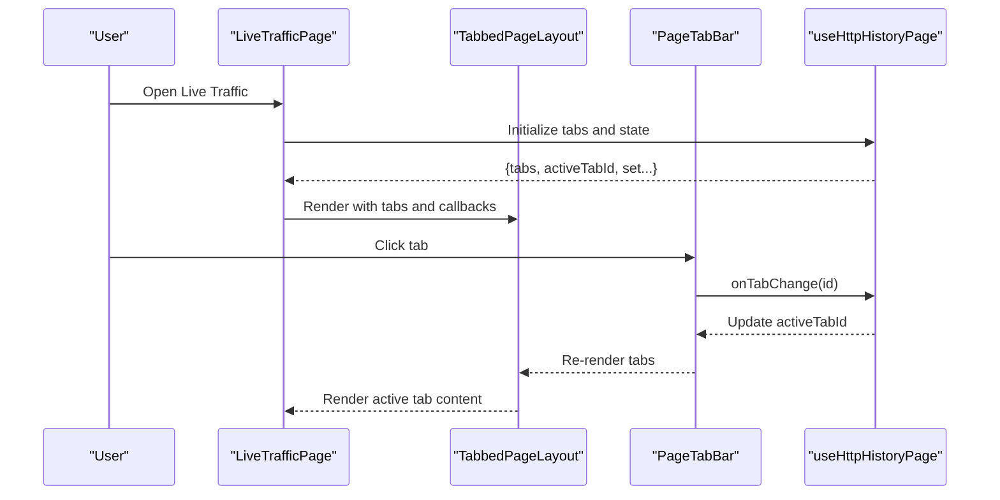
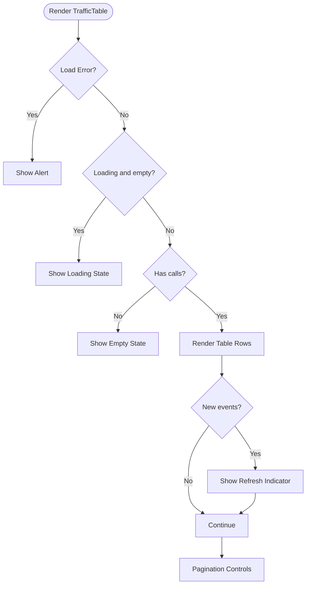
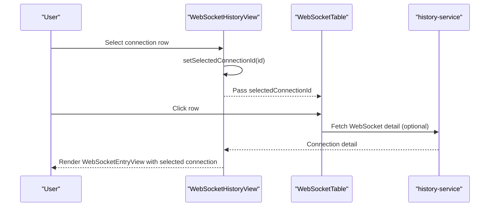
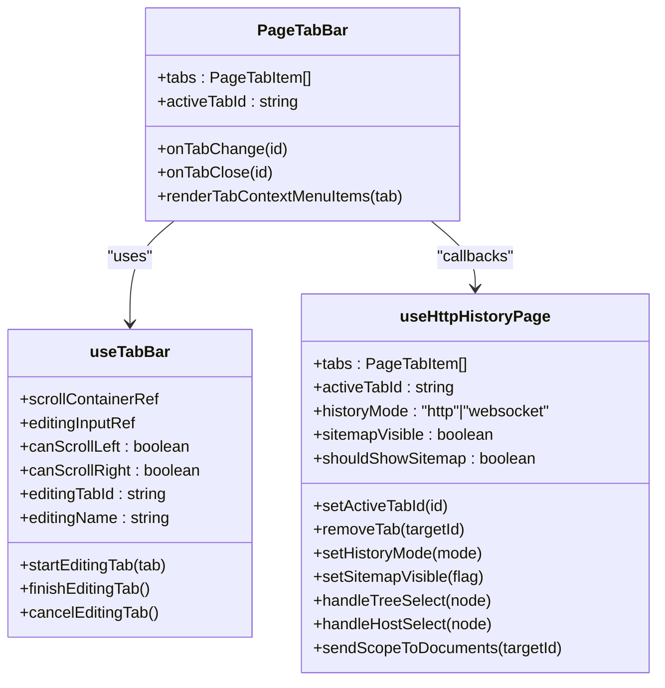
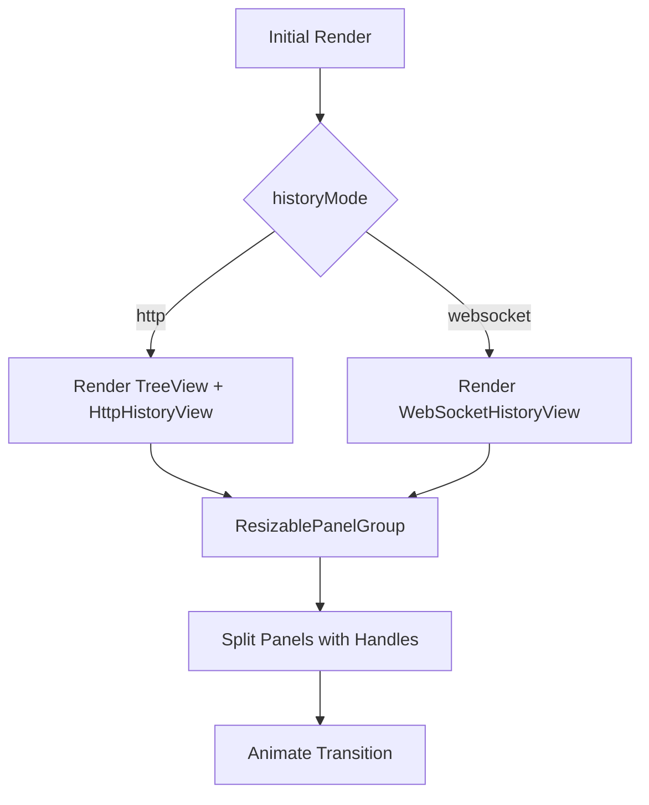
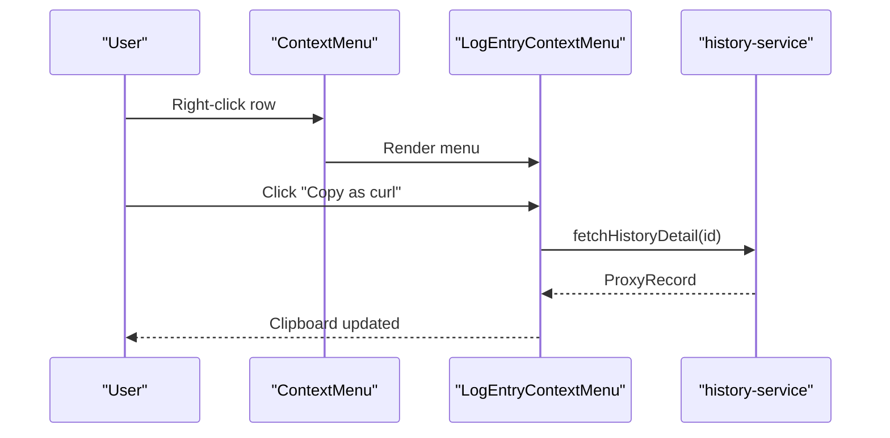
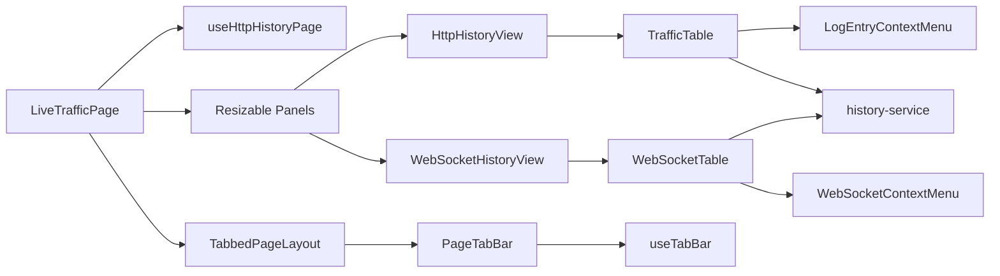

# Live Traffic Dashboard

<cite>
**Referenced Files in This Document**
- [index.tsx](file://src/pages/live-traffic/index.tsx)
- [use-http-history-page.ts](file://src/pages/live-traffic/hooks/use-http-history-page.ts)
- [http-history-view/index.tsx](file://src/pages/live-traffic/components/http-history-view/index.tsx)
- [websocket-history-view/index.tsx](file://src/pages/live-traffic/components/websocket-history-view/index.tsx)
- [calls-columns.tsx](file://src/pages/live-traffic/components/log-table/calls-columns.tsx)
- [websocket-table.tsx](file://src/pages/live-traffic/components/websocket-history-view/websocket-table.tsx)
- [tabbed-page-layout.tsx](file://src/components/tabs-layout/tabbed-page-layout.tsx)
- [tab-bar.tsx](file://src/components/tabs-layout/tab-bar.tsx)
- [use-tab-bar.ts](file://src/components/tabs-layout/use-tab-bar.ts)
- [resizable.tsx](file://src/components/ui/resizable.tsx)
- [log-context-menu.tsx](file://src/pages/live-traffic/components/log-table/log-context-menu.tsx)
- [websocket-context-menu.tsx](file://src/pages/live-traffic/components/websocket-history-view/websocket-context-menu.tsx)
- [history-service.ts](file://src/pages/live-traffic/services/history-service.ts)
</cite>

## Table of Contents
1. [Introduction](#introduction)
2. [Project Structure](#project-structure)
3. [Core Components](#core-components)
4. [Architecture Overview](#architecture-overview)
5. [Detailed Component Analysis](#detailed-component-analysis)
6. [Dependency Analysis](#dependency-analysis)
7. [Performance Considerations](#performance-considerations)
8. [Troubleshooting Guide](#troubleshooting-guide)
9. [Conclusion](#conclusion)

## Introduction
The Live Traffic Dashboard provides a real-time, interactive view of HTTP and WebSocket traffic passing through the proxy. It features:
- A tabbed interface to manage multiple target scopes
- A responsive two-panel layout for traffic lists and detail panes
- Sitemap visibility controls for HTTP mode
- Context menus for quick actions (copy curl, send to tools, delete)
- Smooth animation transitions and resizable panels
- Integration between HTTP and WebSocket views via a unified page layout

## Project Structure
The Live Traffic Dashboard is organized under the live-traffic page with clear separation of concerns:
- Page container orchestrates tabs, filters, sitemap visibility, and view switching
- HTTP and WebSocket views encapsulate their own tables and detail panes
- Shared UI components provide resizable panels and context menus
- Hooks manage state, filtering, and tab lifecycle
- Services bridge UI to backend APIs for fetching and mutating data

**Diagram sources**
- [index.tsx:13-76](file://src/pages/live-traffic/index.tsx#L13-L76)
- [tabbed-page-layout.tsx:22-56](file://src/components/tabs-layout/tabbed-page-layout.tsx#L22-L56)
- [tab-bar.tsx:28-201](file://src/components/tabs-layout/tab-bar.tsx#L28-L201)
- [use-tab-bar.ts:10-105](file://src/components/tabs-layout/use-tab-bar.ts#L10-L105)
- [use-http-history-page.ts:13-119](file://src/pages/live-traffic/hooks/use-http-history-page.ts#L13-L119)
- [http-history-view/index.tsx:7-19](file://src/pages/live-traffic/components/http-history-view/index.tsx#L7-L19)
- [websocket-history-view/index.tsx:9-26](file://src/pages/live-traffic/components/websocket-history-view/index.tsx#L9-L26)
- [calls-columns.tsx:141-285](file://src/pages/live-traffic/components/log-table/calls-columns.tsx#L141-L285)
- [websocket-table.tsx:40-164](file://src/pages/live-traffic/components/websocket-history-view/websocket-table.tsx#L40-L164)
- [log-context-menu.tsx:31-218](file://src/pages/live-traffic/components/log-table/log-context-menu.tsx#L31-L218)
- [websocket-context-menu.tsx:25-87](file://src/pages/live-traffic/components/websocket-history-view/websocket-context-menu.tsx#L25-L87)
- [history-service.ts:20-57](file://src/pages/live-traffic/services/history-service.ts#L20-L57)

**Section sources**
- [index.tsx:13-76](file://src/pages/live-traffic/index.tsx#L13-L76)
- [tabbed-page-layout.tsx:22-56](file://src/components/tabs-layout/tabbed-page-layout.tsx#L22-L56)
- [tab-bar.tsx:28-201](file://src/components/tabs-layout/tab-bar.tsx#L28-L201)
- [use-tab-bar.ts:10-105](file://src/components/tabs-layout/use-tab-bar.ts#L10-L105)
- [use-http-history-page.ts:13-119](file://src/pages/live-traffic/hooks/use-http-history-page.ts#L13-L119)
- [http-history-view/index.tsx:7-19](file://src/pages/live-traffic/components/http-history-view/index.tsx#L7-L19)
- [websocket-history-view/index.tsx:9-26](file://src/pages/live-traffic/components/websocket-history-view/index.tsx#L9-L26)
- [calls-columns.tsx:141-285](file://src/pages/live-traffic/components/log-table/calls-columns.tsx#L141-L285)
- [websocket-table.tsx:40-164](file://src/pages/live-traffic/components/websocket-history-view/websocket-table.tsx#L40-L164)
- [log-context-menu.tsx:31-218](file://src/pages/live-traffic/components/log-table/log-context-menu.tsx#L31-L218)
- [websocket-context-menu.tsx:25-87](file://src/pages/live-traffic/components/websocket-history-view/websocket-context-menu.tsx#L25-L87)
- [history-service.ts:20-57](file://src/pages/live-traffic/services/history-service.ts#L20-L57)

## Core Components
- LiveTrafficPage: Orchestrates tabs, filters, sitemap visibility, and switches between HTTP and WebSocket views. It renders a TabbedPageLayout and a ResizablePanelGroup containing either HttpHistoryView or WebSocketHistoryView.
- HttpHistoryView: A vertical split between TrafficTable and LogEntryBurpView.
- WebSocketHistoryView: A vertical split between WebSocketTable and WebSocketEntryView with connection selection state.
- TrafficTable: Renders paginated HTTP history with sorting, filtering, and action buttons. Displays new events indicator and “Load More”.
- WebSocketTable: Renders paginated WebSocket connections with state indicators, direction, message counts, and activity timestamps.
- TabbedPageLayout and PageTabBar: Provide tabbed navigation, renaming, closing, and contextual actions.
- Resizable Panels: Enable horizontal and vertical resizing with draggable handles and optional grippers.
- Context Menus: Provide quick actions for HTTP entries and WebSocket connections.

**Section sources**
- [index.tsx:13-76](file://src/pages/live-traffic/index.tsx#L13-L76)
- [http-history-view/index.tsx:7-19](file://src/pages/live-traffic/components/http-history-view/index.tsx#L7-L19)
- [websocket-history-view/index.tsx:9-26](file://src/pages/live-traffic/components/websocket-history-view/index.tsx#L9-L26)
- [calls-columns.tsx:141-285](file://src/pages/live-traffic/components/log-table/calls-columns.tsx#L141-L285)
- [websocket-table.tsx:40-164](file://src/pages/live-traffic/components/websocket-history-view/websocket-table.tsx#L40-L164)
- [tabbed-page-layout.tsx:22-56](file://src/components/tabs-layout/tabbed-page-layout.tsx#L22-L56)
- [tab-bar.tsx:28-201](file://src/components/tabs-layout/tab-bar.tsx#L28-L201)
- [resizable.tsx:6-57](file://src/components/ui/resizable.tsx#L6-L57)
- [log-context-menu.tsx:31-218](file://src/pages/live-traffic/components/log-table/log-context-menu.tsx#L31-L218)
- [websocket-context-menu.tsx:25-87](file://src/pages/live-traffic/components/websocket-history-view/websocket-context-menu.tsx#L25-L87)

## Architecture Overview
The dashboard follows a layered architecture:
- Presentation Layer: Page container and view components
- State Management: Hooks for tabs, filters, and selection
- Data Access: Services invoking backend APIs
- UI Composition: Resizable panels, context menus, and tab bars

**Diagram sources**
- [index.tsx:13-76](file://src/pages/live-traffic/index.tsx#L13-L76)
- [http-history-view/index.tsx:7-19](file://src/pages/live-traffic/components/http-history-view/index.tsx#L7-L19)
- [websocket-history-view/index.tsx:9-26](file://src/pages/live-traffic/components/websocket-history-view/index.tsx#L9-L26)
- [calls-columns.tsx:141-285](file://src/pages/live-traffic/components/log-table/calls-columns.tsx#L141-L285)
- [websocket-table.tsx:40-164](file://src/pages/live-traffic/components/websocket-history-view/websocket-table.tsx#L40-L164)
- [use-http-history-page.ts:13-119](file://src/pages/live-traffic/hooks/use-http-history-page.ts#L13-L119)
- [use-tab-bar.ts:10-105](file://src/components/tabs-layout/use-tab-bar.ts#L10-L105)
- [history-service.ts:20-57](file://src/pages/live-traffic/services/history-service.ts#L20-L57)

## Detailed Component Analysis

### LiveTrafficPage and Tabbed Interface
LiveTrafficPage integrates:
- TabbedPageLayout with dynamic tabs derived from active targets
- History mode toggling between HTTP and WebSocket
- Sitemap visibility control for HTTP mode
- Context menu rendering for tabs (e.g., sending scope to Documents)

**Diagram sources**
- [index.tsx:13-76](file://src/pages/live-traffic/index.tsx#L13-L76)
- [tabbed-page-layout.tsx:22-56](file://src/components/tabs-layout/tabbed-page-layout.tsx#L22-L56)
- [tab-bar.tsx:28-201](file://src/components/tabs-layout/tab-bar.tsx#L28-L201)
- [use-http-history-page.ts:13-119](file://src/pages/live-traffic/hooks/use-http-history-page.ts#L13-L119)

**Section sources**
- [index.tsx:13-76](file://src/pages/live-traffic/index.tsx#L13-L76)
- [tabbed-page-layout.tsx:22-56](file://src/components/tabs-layout/tabbed-page-layout.tsx#L22-L56)
- [tab-bar.tsx:28-201](file://src/components/tabs-layout/tab-bar.tsx#L28-L201)
- [use-http-history-page.ts:13-119](file://src/pages/live-traffic/hooks/use-http-history-page.ts#L13-L119)

### HTTP View and Traffic Table
The HTTP view displays:
- TrafficTable: paginated list of HTTP calls with sorting, filtering, and action buttons
- LogEntryContextMenu: context actions for copying curl, adding to scope, opening in tools, and deleting
- Animated transition when switching history modes

**Diagram sources**
- [calls-columns.tsx:141-285](file://src/pages/live-traffic/components/log-table/calls-columns.tsx#L141-L285)

**Section sources**
- [http-history-view/index.tsx:7-19](file://src/pages/live-traffic/components/http-history-view/index.tsx#L7-L19)
- [calls-columns.tsx:141-285](file://src/pages/live-traffic/components/log-table/calls-columns.tsx#L141-L285)
- [log-context-menu.tsx:31-218](file://src/pages/live-traffic/components/log-table/log-context-menu.tsx#L31-L218)

### WebSocket View and Connection Table
The WebSocket view displays:
- WebSocketTable: paginated list of connections with state badges, direction, message counts, and last activity
- WebSocketContextMenu: actions to open in Repeater or delete connection
- Selection state for detail pane

**Diagram sources**
- [websocket-history-view/index.tsx:9-26](file://src/pages/live-traffic/components/websocket-history-view/index.tsx#L9-L26)
- [websocket-table.tsx:40-164](file://src/pages/live-traffic/components/websocket-history-view/websocket-table.tsx#L40-L164)
- [history-service.ts:42-44](file://src/pages/live-traffic/services/history-service.ts#L42-L44)

**Section sources**
- [websocket-history-view/index.tsx:9-26](file://src/pages/live-traffic/components/websocket-history-view/index.tsx#L9-L26)
- [websocket-table.tsx:40-164](file://src/pages/live-traffic/components/websocket-history-view/websocket-table.tsx#L40-L164)
- [websocket-context-menu.tsx:25-87](file://src/pages/live-traffic/components/websocket-history-view/websocket-context-menu.tsx#L25-L87)
- [history-service.ts:42-44](file://src/pages/live-traffic/services/history-service.ts#L42-L44)

### Tab Management System
The tab system supports:
- Dynamic tabs from active targets plus an “All History” tab
- Tab renaming, closing, and contextual actions
- Scrollable tab bar with gradient overlays
- Persistence of history mode in local storage

**Diagram sources**
- [tab-bar.tsx:28-201](file://src/components/tabs-layout/tab-bar.tsx#L28-L201)
- [use-tab-bar.ts:10-105](file://src/components/tabs-layout/use-tab-bar.ts#L10-L105)
- [use-http-history-page.ts:13-119](file://src/pages/live-traffic/hooks/use-http-history-page.ts#L13-L119)

**Section sources**
- [tab-bar.tsx:28-201](file://src/components/tabs-layout/tab-bar.tsx#L28-L201)
- [use-tab-bar.ts:10-105](file://src/components/tabs-layout/use-tab-bar.ts#L10-L105)
- [use-http-history-page.ts:13-119](file://src/pages/live-traffic/hooks/use-http-history-page.ts#L13-L119)

### Resizable Panel System and Animation Transitions
The dashboard uses resizable panels for flexible layouts:
- Horizontal grouping for sitemap and content
- Vertical grouping for table and detail panes
- Optional grippers for drag handles
- Fade-in slide-in animation when switching history modes

**Diagram sources**
- [index.tsx:51-71](file://src/pages/live-traffic/index.tsx#L51-L71)
- [resizable.tsx:6-57](file://src/components/ui/resizable.tsx#L6-L57)

**Section sources**
- [index.tsx:51-71](file://src/pages/live-traffic/index.tsx#L51-L71)
- [resizable.tsx:6-57](file://src/components/ui/resizable.tsx#L6-L57)

### Context Menu Functionality
Context menus provide quick actions:
- HTTP entries: copy curl, copy URL, add to target, send to brute force, send to repeater, delete
- WebSocket connections: send to repeater, delete
- Actions integrate with stores and services to mutate state and invoke backend commands

**Diagram sources**
- [log-context-menu.tsx:31-218](file://src/pages/live-traffic/components/log-table/log-context-menu.tsx#L31-L218)
- [history-service.ts:30-32](file://src/pages/live-traffic/services/history-service.ts#L30-L32)

**Section sources**
- [log-context-menu.tsx:31-218](file://src/pages/live-traffic/components/log-table/log-context-menu.tsx#L31-L218)
- [websocket-context-menu.tsx:25-87](file://src/pages/live-traffic/components/websocket-history-view/websocket-context-menu.tsx#L25-L87)
- [history-service.ts:30-32](file://src/pages/live-traffic/services/history-service.ts#L30-L32)

## Dependency Analysis
Key dependencies and interactions:
- LiveTrafficPage depends on useHttpHistoryPage for state and callbacks
- Views depend on services for data fetching and mutation
- Tables depend on context menus for actions
- Tab bar integrates with tab state and scrolling utilities

**Diagram sources**
- [index.tsx:13-76](file://src/pages/live-traffic/index.tsx#L13-L76)
- [use-http-history-page.ts:13-119](file://src/pages/live-traffic/hooks/use-http-history-page.ts#L13-L119)
- [tabbed-page-layout.tsx:22-56](file://src/components/tabs-layout/tabbed-page-layout.tsx#L22-L56)
- [tab-bar.tsx:28-201](file://src/components/tabs-layout/tab-bar.tsx#L28-L201)
- [use-tab-bar.ts:10-105](file://src/components/tabs-layout/use-tab-bar.ts#L10-L105)
- [http-history-view/index.tsx:7-19](file://src/pages/live-traffic/components/http-history-view/index.tsx#L7-L19)
- [websocket-history-view/index.tsx:9-26](file://src/pages/live-traffic/components/websocket-history-view/index.tsx#L9-L26)
- [calls-columns.tsx:141-285](file://src/pages/live-traffic/components/log-table/calls-columns.tsx#L141-L285)
- [websocket-table.tsx:40-164](file://src/pages/live-traffic/components/websocket-history-view/websocket-table.tsx#L40-L164)
- [log-context-menu.tsx:31-218](file://src/pages/live-traffic/components/log-table/log-context-menu.tsx#L31-L218)
- [websocket-context-menu.tsx:25-87](file://src/pages/live-traffic/components/websocket-history-view/websocket-context-menu.tsx#L25-L87)
- [history-service.ts:20-57](file://src/pages/live-traffic/services/history-service.ts#L20-L57)

**Section sources**
- [index.tsx:13-76](file://src/pages/live-traffic/index.tsx#L13-L76)
- [use-http-history-page.ts:13-119](file://src/pages/live-traffic/hooks/use-http-history-page.ts#L13-L119)
- [tabbed-page-layout.tsx:22-56](file://src/components/tabs-layout/tabbed-page-layout.tsx#L22-L56)
- [tab-bar.tsx:28-201](file://src/components/tabs-layout/tab-bar.tsx#L28-L201)
- [use-tab-bar.ts:10-105](file://src/components/tabs-layout/use-tab-bar.ts#L10-L105)
- [http-history-view/index.tsx:7-19](file://src/pages/live-traffic/components/http-history-view/index.tsx#L7-L19)
- [websocket-history-view/index.tsx:9-26](file://src/pages/live-traffic/components/websocket-history-view/index.tsx#L9-L26)
- [calls-columns.tsx:141-285](file://src/pages/live-traffic/components/log-table/calls-columns.tsx#L141-L285)
- [websocket-table.tsx:40-164](file://src/pages/live-traffic/components/websocket-history-view/websocket-table.tsx#L40-L164)
- [log-context-menu.tsx:31-218](file://src/pages/live-traffic/components/log-table/log-context-menu.tsx#L31-L218)
- [websocket-context-menu.tsx:25-87](file://src/pages/live-traffic/components/websocket-history-view/websocket-context-menu.tsx#L25-L87)
- [history-service.ts:20-57](file://src/pages/live-traffic/services/history-service.ts#L20-L57)

## Performance Considerations
- Pagination and lazy loading: Both tables support pagination and “Load More” to avoid rendering large datasets at once.
- Local storage persistence: History mode is persisted to reduce reconfiguration overhead.
- Conditional rendering: Sitemap panel is only rendered when visible, minimizing DOM size.
- Animation transitions: Lightweight CSS animations are applied during mode changes to avoid heavy computations.
- Context actions: Actions like copying curl or opening tools fetch details on demand to minimize background work.
- Recommendations:
  - Prefer virtualized lists for very large datasets if needed.
  - Debounce filters and refresh triggers to limit frequent re-fetches.
  - Use background refresh strategies for real-time updates to avoid blocking the UI.
  - Monitor memory usage of selected items and clear stale selections periodically.

[No sources needed since this section provides general guidance]

## Troubleshooting Guide
Common issues and resolutions:
- No traffic displayed:
  - Verify proxy capture is enabled and traffic is being recorded.
  - Check filters and tab scoping; switch to “All History” to confirm data presence.
- Context menu actions fail:
  - Confirm backend commands are available and permissions are granted.
  - Inspect toast notifications for error messages.
- WebSocket connections not appearing:
  - Ensure WebSocket traffic passes through the proxy and is captured.
  - Clear active filters to reveal hidden connections.
- Tab closing not working:
  - “All History” tab is non-closable by design; only target tabs can be closed.
- Sitemap not visible:
  - Toggle sitemap visibility in the filters and ensure HTTP mode is active.

**Section sources**
- [calls-columns.tsx:161-187](file://src/pages/live-traffic/components/log-table/calls-columns.tsx#L161-L187)
- [websocket-table.tsx:55-81](file://src/pages/live-traffic/components/websocket-history-view/websocket-table.tsx#L55-L81)
- [use-http-history-page.ts:46-52](file://src/pages/live-traffic/hooks/use-http-history-page.ts#L46-L52)

## Conclusion
The Live Traffic Dashboard combines a robust tabbed interface, responsive resizable layouts, and context-aware actions to deliver a powerful real-time traffic inspection experience. Its modular design enables easy extension and maintenance while preserving performance and usability.

[No sources needed since this section summarizes without analyzing specific files]