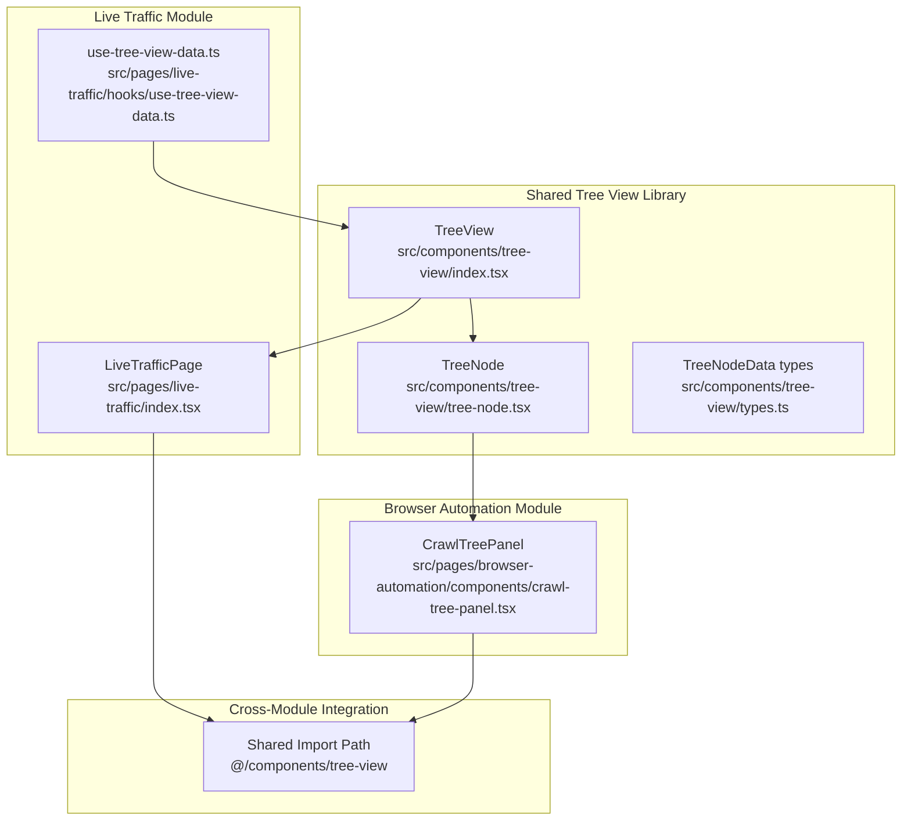
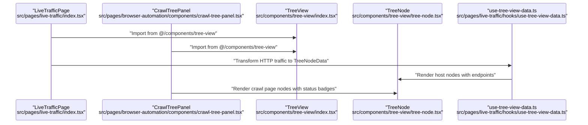
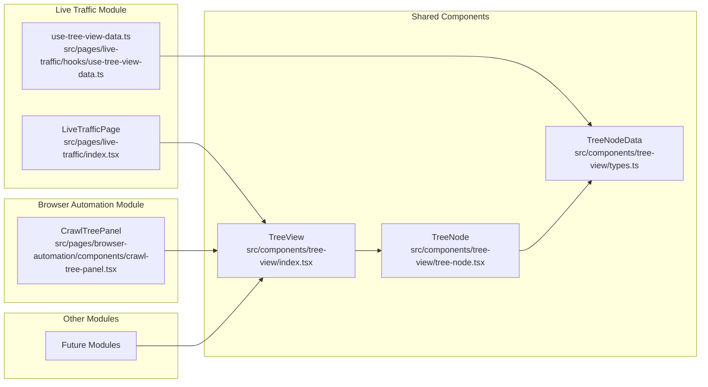
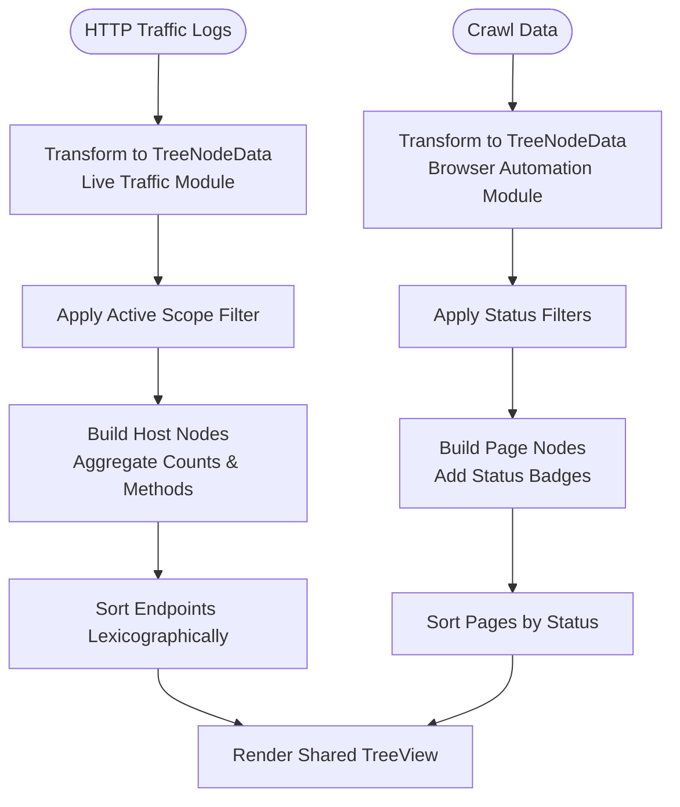

# Tree View Navigation

<cite>
**Referenced Files in This Document**
- [index.tsx](file://src/components/tree-view/index.tsx)
- [tree-node.tsx](file://src/components/tree-view/tree-node.tsx)
- [types.ts](file://src/components/tree-view/types.ts)
- [live-traffic/index.tsx](file://src/pages/live-traffic/index.tsx)
- [use-tree-view-data.ts](file://src/pages/live-traffic/hooks/use-tree-view-data.ts)
- [use-history-tree.ts](file://src/pages/live-traffic/hooks/use-history-tree.ts)
- [use-history-query.ts](file://src/pages/live-traffic/hooks/use-history-query.ts)
- [crawl-tree-panel.tsx](file://src/pages/browser-automation/components/crawl-tree-panel.tsx)
- [history-service.ts](file://src/pages/live-traffic/services/history-service.ts)
- [history-query-store.ts](file://src/pages/live-traffic/state/history-query-store.ts)
- [build-history-query.ts](file://src/pages/live-traffic/state/build-history-query.ts)
- [api.ts](file://src/pages/live-traffic/api.ts)
- [utils.ts](file://src/lib/utils.ts)
- [log-context-menu.tsx](file://src/pages/live-traffic/components/log-table/log-context-menu.tsx)
- [use-history-table.ts](file://src/pages/live-traffic/hooks/use-history-table.ts)
- [use-history-detail.ts](file://src/pages/live-traffic/hooks/use-history-detail.ts)
</cite>

## Update Summary
**Changes Made**
- Updated project structure to reflect component consolidation to shared location (src/components/tree-view/)
- Added new section documenting cross-module usage patterns
- Updated integration examples to show both Live Traffic and Browser Automation usage
- Revised dependency analysis to show shared component architecture
- Enhanced documentation with practical examples of tree navigation across different modules

## Table of Contents
1. [Introduction](#introduction)
2. [Component Consolidation](#component-consolidation)
3. [Project Structure](#project-structure)
4. [Core Components](#core-components)
5. [Architecture Overview](#architecture-overview)
6. [Cross-Module Integration](#cross-module-integration)
7. [Detailed Component Analysis](#detailed-component-analysis)
8. [Dependency Analysis](#dependency-analysis)
9. [Performance Considerations](#performance-considerations)
10. [Troubleshooting Guide](#troubleshooting-guide)
11. [Conclusion](#conclusion)
12. [Appendices](#appendices)

## Introduction
This document explains the Tree View Navigation system used across multiple modules in the application. The system has been consolidated into a shared component library located at src/components/tree-view/, enabling reuse across Live Traffic, Browser Automation, and other future modules. It covers how raw traffic logs and crawl data are transformed into hierarchical trees, how users navigate and filter the tree, and how the tree integrates with traffic filtering, scope management, context menu operations, and other traffic analysis components.

## Component Consolidation
**Updated** The Tree View components have been moved from module-specific locations to a centralized shared location to improve maintainability and enable cross-module reuse.

The consolidation includes:
- **Tree View Container**: Centralized TreeView component with generic type support
- **Tree Node Renderer**: Universal TreeNode component with customizable icons and badges
- **Type Definitions**: Shared TreeNodeData and TreeViewProps interfaces
- **Cross-module Usage**: Both Live Traffic and Browser Automation now import from the shared location

**Section sources**
- [index.tsx:1-71](file://src/components/tree-view/index.tsx#L1-L71)
- [tree-node.tsx:1-151](file://src/components/tree-view/tree-node.tsx#L1-L151)
- [types.ts:1-35](file://src/components/tree-view/types.ts#L1-L35)

## Project Structure
The Tree View is now part of a shared component library and is consumed by multiple modules:
- **Shared Tree View Components**: Centralized in src/components/tree-view/
- **Live Traffic Integration**: Uses TreeView for HTTP traffic visualization
- **Browser Automation Integration**: Uses TreeView for crawl page navigation
- **Cross-module Consistency**: Same component architecture across different data types



**Diagram sources**
- [index.tsx:6](file://src/components/tree-view/index.tsx#L6)
- [live-traffic/index.tsx:8](file://src/pages/live-traffic/index.tsx#L8)
- [crawl-tree-panel.tsx:7](file://src/pages/browser-automation/components/crawl-tree-panel.tsx#L7)

**Section sources**
- [index.tsx:1-71](file://src/components/tree-view/index.tsx#L1-L71)
- [tree-node.tsx:1-151](file://src/components/tree-view/tree-node.tsx#L1-L151)
- [types.ts:1-35](file://src/components/tree-view/types.ts#L1-L35)
- [live-traffic/index.tsx:1-96](file://src/pages/live-traffic/index.tsx#L1-L96)
- [crawl-tree-panel.tsx:1-137](file://src/pages/browser-automation/components/crawl-tree-panel.tsx#L1-L137)

## Core Components
**Updated** The core components are now centralized in the shared library with enhanced generic type support for cross-module usage.

- **TreeView**: Generic tree container supporting custom metadata types (TMeta). Handles loading, error, and empty states with configurable messages.
- **TreeNode**: Recursive node renderer with expand/collapse controls, selection highlighting, and customizable icons. Supports badges and descriptions.
- **TreeNodeData**: Generic interface supporting custom metadata, badges, and optional icon customization.
- **Cross-module Data Transformation**: Different modules transform their specific data formats (HTTP traffic vs crawl pages) into the shared TreeNodeData structure.

**Section sources**
- [index.tsx:11-71](file://src/components/tree-view/index.tsx#L11-L71)
- [tree-node.tsx:42-151](file://src/components/tree-view/tree-node.tsx#L42-L151)
- [types.ts:4-35](file://src/components/tree-view/types.ts#L4-L35)

## Architecture Overview
**Updated** The architecture now emphasizes shared component usage across multiple modules with consistent data transformation patterns.



**Diagram sources**
- [live-traffic/index.tsx:8](file://src/pages/live-traffic/index.tsx#L8)
- [crawl-tree-panel.tsx:7](file://src/pages/browser-automation/components/crawl-tree-panel.tsx#L7)
- [use-tree-view-data.ts:68-87](file://src/pages/live-traffic/hooks/use-tree-view-data.ts#L68-L87)

## Cross-Module Integration
**New Section** The shared Tree View components are now used across multiple modules with different data transformation approaches.

### Live Traffic Integration
- **Data Transformation**: HTTP traffic logs are transformed into host and endpoint nodes
- **Scope Filtering**: Active scope filters are applied during tree construction
- **Default Expansion**: Automatically expands matching host when host filter is active

### Browser Automation Integration  
- **Data Transformation**: Crawl page data is transformed with status indicators and badges
- **Custom Icons**: Uses status-specific icons (visited, queued, current, error, blocked)
- **Metadata Support**: Includes pageId in node metadata for page selection

**Section sources**
- [live-traffic/index.tsx:33-78](file://src/pages/live-traffic/index.tsx#L33-L78)
- [crawl-tree-panel.tsx:54-72](file://src/pages/browser-automation/components/crawl-tree-panel.tsx#L54-L72)
- [crawl-tree-panel.tsx:122-133](file://src/pages/browser-automation/components/crawl-tree-panel.tsx#L122-L133)

## Detailed Component Analysis

### TreeView Container
**Updated** The TreeView component now supports generic metadata types and is imported from the shared location.

Responsibilities:
- Render loading, error, and empty states with customizable messages
- Handle generic TreeNodeData<TMeta> for different module types
- Manage default expanded node IDs
- Provide consistent styling and spacing

Behavior highlights:
- Generic type support allows different metadata types across modules
- Default expanded IDs enable automatic expansion for filtered results
- Configurable empty and error messages for different contexts

**Section sources**
- [index.tsx:11-71](file://src/components/tree-view/index.tsx#L11-L71)

### TreeNode Component
**Updated** The TreeNode component maintains its recursive structure but now supports enhanced customization.

Responsibilities:
- Render nodes with customizable icons and color schemes
- Support badges and descriptions for rich node information
- Handle selection callbacks with proper event propagation
- Manage expand/collapse state with chevron controls

Enhanced Features:
- Custom icon support through LucideIcon interface
- Color customization via iconClassName
- Badge rendering for status indicators
- Metadata-aware selection handling

**Section sources**
- [tree-node.tsx:42-151](file://src/components/tree-view/tree-node.tsx#L42-L151)

### useTreeViewData Hook
**Updated** The hook continues to transform data but now imports TreeNodeData from the shared location.

Responsibilities:
- Transform backend TreeNode[] into TreeNodeData[] suitable for rendering
- Apply active scope filtering using a helper that normalizes hostnames
- Compute aggregated metrics per host (total count, combined methods)
- Normalize URLs and strip default ports for display

Key transformations:
- Build host label by removing default ports based on protocol
- For each path under a host, create endpoint nodes with optional full URL
- Sort endpoints lexicographically by label

**Section sources**
- [use-tree-view-data.ts:68-87](file://src/pages/live-traffic/hooks/use-tree-view-data.ts#L68-L87)

### Cross-Module Data Transformation Examples

#### HTTP Traffic Transformation
```typescript
// Live Traffic: Transform HTTP logs to TreeNodeData
const buildTreeNodeData = (host: string, paths: TreePath[]): TreeNodeData => {
  const hostNode: TreeNodeData = {
    id: `host-${host}`,
    type: 'host',
    label: stripDefaultPortFromHost(host, protocol),
    children: [],
    count: paths.reduce((sum, path) => sum + path.count, 0),
    methods: [...new Set(paths.flatMap((path) => path.methods))],
  };

  hostNode.children = paths
    .map((pathEntry) => ({
      id: `${hostNode.id}/${pathEntry.url ?? pathEntry.path}-${pathEntry.methods.join(',')}`,
      type: 'endpoint' as const,
      label: pathEntry.url ?? buildDisplayUrl(host, pathEntry.path),
      fullPath: pathEntry.path,
      children: [],
      count: pathEntry.count,
      methods: pathEntry.methods,
    }))
    .sort((left, right) => left.label.localeCompare(right.label));
};
```

#### Crawl Page Transformation  
```typescript
// Browser Automation: Transform crawl data to TreeNodeData
function toTreeNode(node: CrawlTreeNode): TreeNodeData<CrawlTreeMeta> {
  const Icon = statusIcon[node.status];

  return {
    id: node.id,
    type: 'crawl-page',
    label: formatCrawlTreeUrl(node.url),
    status: node.status,
    children: node.children.map(toTreeNode),
    icon: Icon,
    iconClassName: cn(statusIconClassName[node.status], node.status === 'current' && 'animate-pulse'),
    badge: <Badge variant="outline" className={cn('h-4 px-1 text-[10px] capitalize', statusStyles[node.status])}>
      {PAGE_STATUS_LABELS[node.status]}
    </Badge>,
    meta: { pageId: node.id },
  };
}
```

**Section sources**
- [use-tree-view-data.ts:19-43](file://src/pages/live-traffic/hooks/use-tree-view-data.ts#L19-L43)
- [crawl-tree-panel.tsx:54-72](file://src/pages/browser-automation/components/crawl-tree-panel.tsx#L54-L72)

## Dependency Analysis
**Updated** Dependencies now reflect the shared component architecture with cross-module imports.



**Diagram sources**
- [live-traffic/index.tsx:8](file://src/pages/live-traffic/index.tsx#L8)
- [crawl-tree-panel.tsx:7](file://src/pages/browser-automation/components/crawl-tree-panel.tsx#L7)
- [use-tree-view-data.ts:6](file://src/pages/live-traffic/hooks/use-tree-view-data.ts#L6)

**Section sources**
- [live-traffic/index.tsx:8](file://src/pages/live-traffic/index.tsx#L8)
- [crawl-tree-panel.tsx:7](file://src/pages/browser-automation/components/crawl-tree-panel.tsx#L7)
- [use-tree-view-data.ts:6](file://src/pages/live-traffic/hooks/use-tree-view-data.ts#L6)

## Performance Considerations
**Updated** Performance considerations now apply to the shared component architecture used across multiple modules.

- **Rendering Cost**: The tree is recursive and can grow large with many hosts and endpoints. Keep the following in mind:
  - Prefer shallow rendering by expanding only the active host when a host filter is active
  - Use defaultExpandedIds to control initial expansion state across modules
  - Avoid unnecessary re-renders by memoizing derived data (already used via useMemo in hooks)
  - Implement virtualization for very large datasets in future enhancements

- **Memory Efficiency**: 
  - Shared component reduces memory footprint by eliminating duplicate implementations
  - Generic type system enables type-safe reuse without runtime overhead
  - Centralized state management through hooks ensures consistent performance patterns

- **Network and Parsing**:
  - Debounce and batch updates when filters change; the table hook already debounces queries
  - Use incremental updates when new events arrive; the table hook listens for proxy-record events and refreshes intelligently
  - Shared TreeView component handles loading states consistently across modules

- **Icon and Label Normalization**:
  - Strip default ports and normalize labels once during transformation to avoid repeated work in render paths
  - Custom icon rendering is optimized through LucideIcon interface

## Troubleshooting Guide
**Updated** Troubleshooting guidance now covers issues common to the shared component architecture.

Common issues and resolutions:
- **Tree fails to load**:
  - Check for load errors surfaced by the TreeView and investigate the underlying fetchHistoryTree failure path
  - Verify Tauri availability and that the backend command is reachable
  - Ensure proper import path from @/components/tree-view/

- **No nodes displayed**:
  - Confirm active scope matches captured hosts; the tree is filtered by scope
  - Ensure the host filter does not exclude all hosts unintentionally
  - Verify data transformation is correctly mapping module-specific data to TreeNodeData

- **Selection not working**:
  - Endpoint clicks should trigger endpoint selection; host clicks should trigger host selection
  - Expansion toggles occur on chevron click; ensure event propagation is not blocked
  - Check that metadata (meta property) is properly handled in selection callbacks

- **Cross-module integration issues**:
  - Ensure proper type casting when using generic TreeView with module-specific metadata
  - Verify that custom icons and badges are properly configured for each module
  - Check that defaultExpandedIds are correctly calculated for each module's data structure

- **Import path issues**:
  - Confirm that both Live Traffic and Browser Automation import from @/components/tree-view/
  - Verify that TypeScript configuration supports path aliases for shared components

**Section sources**
- [index.tsx:25-51](file://src/components/tree-view/index.tsx#L25-L51)
- [live-traffic/index.tsx:63-78](file://src/pages/live-traffic/index.tsx#L63-L78)
- [crawl-tree-panel.tsx:126-133](file://src/pages/browser-automation/components/crawl-tree-panel.tsx#L126-L133)

## Conclusion
The Tree View Navigation system has been successfully consolidated into a shared component library, significantly improving maintainability and enabling cross-module reuse. The centralized architecture supports multiple data types through generic typing while maintaining consistent user experience across Live Traffic, Browser Automation, and future modules. The component architecture cleanly separates concerns between data transformation, rendering, and user interaction, establishing a foundation for scalable tree-based navigation throughout the application.

## Appendices

### Data Transformation Pipeline
**Updated** End-to-end transformation from raw backend data to rendered nodes across different modules:



**Diagram sources**
- [use-tree-view-data.ts:68-87](file://src/pages/live-traffic/hooks/use-tree-view-data.ts#L68-L87)
- [crawl-tree-panel.tsx:54-72](file://src/pages/browser-automation/components/crawl-tree-panel.tsx#L54-L72)

### Example Navigation Patterns
**Updated** Navigation patterns now apply across multiple modules using the shared Tree View.

#### Live Traffic Navigation
- **Host-based navigation**: Click a host node to select it; the parent view focuses on that host's endpoints
- **Endpoint-based navigation**: Click an endpoint node to select it; the detail panel updates accordingly
- **Automatic expansion**: When a host filter is active, matching host nodes expand automatically via defaultExpandedIds

#### Browser Automation Navigation
- **Page-based navigation**: Click a crawl page node to select it; the page detail panel updates
- **Status-based filtering**: Use status filters to show only specific page states (visited, queued, current, etc.)
- **Search integration**: URL search filters crawl pages in real-time

#### Cross-Module Patterns
- **Consistent interaction**: Both modules use the same TreeView component with identical selection behavior
- **Shared styling**: Consistent visual appearance across different data types
- **Generic metadata**: Support for module-specific data through the TMeta generic parameter

### Shared Component Benefits
**New Section** The consolidation provides several key benefits:

- **Maintainability**: Single source of truth for tree view functionality
- **Consistency**: Uniform user experience across all modules
- **Type Safety**: Generic typing ensures compile-time safety across modules
- **Reusability**: Easy to adapt for new modules requiring tree navigation
- **Testing**: Centralized testing approach for tree view components
- **Documentation**: Single documentation source for tree view usage patterns