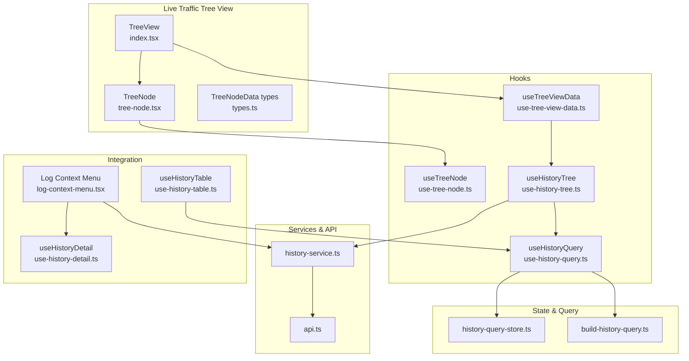
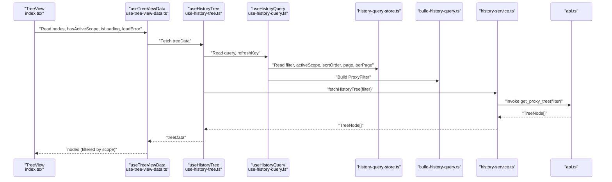
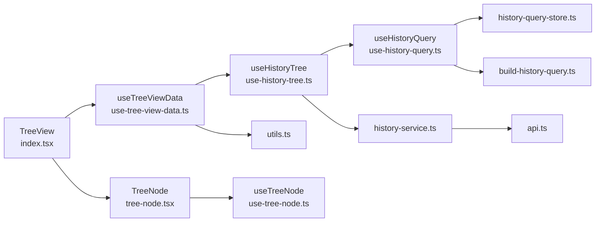
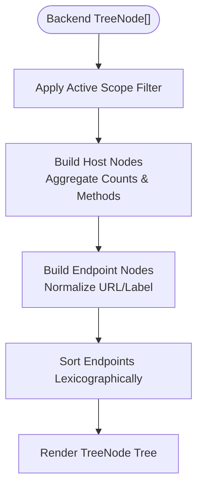

# Tree View Navigation

<cite>
**Referenced Files in This Document**
- [index.tsx](file://src/pages/live-traffic/components/tree-view/index.tsx)
- [tree-node.tsx](file://src/pages/live-traffic/components/tree-view/tree-node.tsx)
- [types.ts](file://src/pages/live-traffic/components/tree-view/types.ts)
- [use-tree-view-data.ts](file://src/pages/live-traffic/hooks/use-tree-view-data.ts)
- [use-tree-node.ts](file://src/pages/live-traffic/hooks/use-tree-node.ts)
- [use-history-tree.ts](file://src/pages/live-traffic/hooks/use-history-tree.ts)
- [use-history-query.ts](file://src/pages/live-traffic/hooks/use-history-query.ts)
- [history-service.ts](file://src/pages/live-traffic/services/history-service.ts)
- [history-query-store.ts](file://src/pages/live-traffic/state/history-query-store.ts)
- [build-history-query.ts](file://src/pages/live-traffic/state/build-history-query.ts)
- [api.ts](file://src/pages/live-traffic/api.ts)
- [utils.ts](file://src/lib/utils.ts)
- [log-context-menu.tsx](file://src/pages/live-traffic/components/log-table/log-context-menu.tsx)
- [use-history-table.ts](file://src/pages/live-traffic/hooks/use-history-table.ts)
- [use-history-detail.ts](file://src/pages/live-traffic/hooks/use-history-detail.ts)
</cite>

## Table of Contents
1. [Introduction](#introduction)
2. [Project Structure](#project-structure)
3. [Core Components](#core-components)
4. [Architecture Overview](#architecture-overview)
5. [Detailed Component Analysis](#detailed-component-analysis)
6. [Dependency Analysis](#dependency-analysis)
7. [Performance Considerations](#performance-considerations)
8. [Troubleshooting Guide](#troubleshooting-guide)
9. [Conclusion](#conclusion)
10. [Appendices](#appendices)

## Introduction
This document explains the Tree View Navigation system used in the Live Traffic page. It covers how raw traffic logs are transformed into a hierarchical tree organized by host and endpoint, how users navigate and filter the tree, and how the tree integrates with traffic filtering, scope management, context menu operations, and other traffic analysis components. Practical examples and performance guidance are included for large datasets.

## Project Structure
The Tree View is part of the Live Traffic feature and interacts with query state, data fetching, and UI components across several modules:
- Tree View container and node renderer
- Hooks for building the tree and managing expansion state
- Query builder and store for filters, scope, and pagination
- Services and API bindings for fetching tree data
- Integration with context menus and other traffic analysis views

**Diagram sources**
- [index.tsx:12-68](file://src/pages/live-traffic/components/tree-view/index.tsx#L12-L68)
- [tree-node.tsx:36-124](file://src/pages/live-traffic/components/tree-view/tree-node.tsx#L36-L124)
- [types.ts:1-18](file://src/pages/live-traffic/components/tree-view/types.ts#L1-L18)
- [use-tree-view-data.ts:68-86](file://src/pages/live-traffic/hooks/use-tree-view-data.ts#L68-L86)
- [use-tree-node.ts:3-14](file://src/pages/live-traffic/hooks/use-tree-node.ts#L3-L14)
- [use-history-tree.ts:8-40](file://src/pages/live-traffic/hooks/use-history-tree.ts#L8-L40)
- [use-history-query.ts:7-116](file://src/pages/live-traffic/hooks/use-history-query.ts#L7-L116)
- [history-query-store.ts:40-139](file://src/pages/live-traffic/state/history-query-store.ts#L40-L139)
- [build-history-query.ts:12-67](file://src/pages/live-traffic/state/build-history-query.ts#L12-L67)
- [history-service.ts:26-28](file://src/pages/live-traffic/services/history-service.ts#L26-L28)
- [api.ts:169-171](file://src/pages/live-traffic/api.ts#L169-L171)
- [log-context-menu.tsx:31-218](file://src/pages/live-traffic/components/log-table/log-context-menu.tsx#L31-L218)
- [use-history-table.ts:96-277](file://src/pages/live-traffic/hooks/use-history-table.ts#L96-L277)
- [use-history-detail.ts:9-47](file://src/pages/live-traffic/hooks/use-history-detail.ts#L9-L47)

**Section sources**
- [index.tsx:1-69](file://src/pages/live-traffic/components/tree-view/index.tsx#L1-L69)
- [tree-node.tsx:1-125](file://src/pages/live-traffic/components/tree-view/tree-node.tsx#L1-L125)
- [types.ts:1-18](file://src/pages/live-traffic/components/tree-view/types.ts#L1-L18)

## Core Components
- TreeView: Renders the root nodes and handles loading, error, and empty states. It reads the active scope and host filter from the query, and passes selection callbacks down to nodes.
- TreeNode: Recursively renders nodes with expand/collapse controls, selection highlighting, and counts. It distinguishes host vs endpoint nodes and sets appropriate icons.
- useTreeViewData: Transforms raw tree data into TreeNodeData, applies active scope filtering, and computes derived fields like counts and methods.
- useTreeNode: Local state hook to manage expanded/collapsed state per node.
- useHistoryTree: Fetches hierarchical tree data from the backend via a service and exposes loading/error states.
- useHistoryQuery: Provides the current query object and manages filters, scope, sorting, pagination, and refresh triggers.
- history-service: Thin wrapper around Tauri commands to fetch tree data and other history resources.
- API types: Define the shape of tree nodes and filters passed to the backend.

**Section sources**
- [index.tsx:12-68](file://src/pages/live-traffic/components/tree-view/index.tsx#L12-L68)
- [tree-node.tsx:36-124](file://src/pages/live-traffic/components/tree-view/tree-node.tsx#L36-L124)
- [use-tree-view-data.ts:68-86](file://src/pages/live-traffic/hooks/use-tree-view-data.ts#L68-L86)
- [use-tree-node.ts:3-14](file://src/pages/live-traffic/hooks/use-tree-node.ts#L3-L14)
- [use-history-tree.ts:8-40](file://src/pages/live-traffic/hooks/use-history-tree.ts#L8-L40)
- [use-history-query.ts:7-116](file://src/pages/live-traffic/hooks/use-history-query.ts#L7-L116)
- [history-service.ts:26-28](file://src/pages/live-traffic/services/history-service.ts#L26-L28)
- [api.ts:157-167](file://src/pages/live-traffic/api.ts#L157-L167)

## Architecture Overview
The tree view is driven by a reactive query built from the query store. The data flow is:

**Diagram sources**
- [index.tsx:17-18](file://src/pages/live-traffic/components/tree-view/index.tsx#L17-L18)
- [use-tree-view-data.ts:68-86](file://src/pages/live-traffic/hooks/use-tree-view-data.ts#L68-L86)
- [use-history-tree.ts:9-29](file://src/pages/live-traffic/hooks/use-history-tree.ts#L9-L29)
- [use-history-query.ts:7-64](file://src/pages/live-traffic/hooks/use-history-query.ts#L7-L64)
- [history-query-store.ts:40-139](file://src/pages/live-traffic/state/history-query-store.ts#L40-L139)
- [build-history-query.ts:12-67](file://src/pages/live-traffic/state/build-history-query.ts#L12-L67)
- [history-service.ts:26-28](file://src/pages/live-traffic/services/history-service.ts#L26-L28)
- [api.ts:169-171](file://src/pages/live-traffic/api.ts#L169-L171)

## Detailed Component Analysis

### TreeView Container
Responsibilities:
- Render loading, error, and empty states.
- Compute whether a host filter is active from the query.
- Map top-level nodes to TreeNode children.
- Pass selection callbacks and selectedId for highlighting.

Behavior highlights:
- When a host filter is present, the matching host node is expanded by default.
- Selection callbacks are forwarded to TreeNode.

**Section sources**
- [index.tsx:12-68](file://src/pages/live-traffic/components/tree-view/index.tsx#L12-L68)

### TreeNode Component
Responsibilities:
- Render a single node with indentation based on level.
- Toggle expansion for nodes with children.
- Distinguish host vs endpoint nodes and render appropriate icons.
- Highlight selection and show call counts when available.
- Recursively render children when expanded.

Interaction logic:
- Clicking an endpoint node invokes the endpoint selection callback.
- Clicking a host node invokes the host selection callback.
- Clicking a chevron toggles expansion regardless of selection mode.

HTTPS detection:
- Host icon reflects HTTPS presence based on port or URL scheme.

**Section sources**
- [tree-node.tsx:36-124](file://src/pages/live-traffic/components/tree-view/tree-node.tsx#L36-L124)
- [types.ts:1-18](file://src/pages/live-traffic/components/tree-view/types.ts#L1-L18)

### useTreeNode Hook
Responsibilities:
- Manage local expanded/collapsed state for a node.
- Provide a toggle function to flip state.

**Section sources**
- [use-tree-node.ts:3-14](file://src/pages/live-traffic/hooks/use-tree-node.ts#L3-L14)

### useTreeViewData Hook
Responsibilities:
- Transform backend TreeNode[] into TreeNodeData[] suitable for rendering.
- Apply active scope filtering using a helper that normalizes hostnames and supports wildcard patterns.
- Compute aggregated metrics per host (total count, combined methods).
- Normalize URLs and strip default ports for display.

Key transformations:
- Build host label by removing default ports based on protocol.
- For each path under a host, create endpoint nodes with optional full URL or constructed display URL.
- Sort endpoints lexicographically by label.

Scope filtering:
- Uses a utility that trims, lowercases, and strips trailing dots, supports wildcard subdomains.

**Section sources**
- [use-tree-view-data.ts:68-86](file://src/pages/live-traffic/hooks/use-tree-view-data.ts#L68-L86)
- [utils.ts:8-26](file://src/lib/utils.ts#L8-L26)

### useHistoryTree Hook
Responsibilities:
- Fetch hierarchical tree data from the backend via a service.
- Expose loading, error, and data state.
- Trigger re-fetch when query or refreshKey change.

**Section sources**
- [use-history-tree.ts:8-40](file://src/pages/live-traffic/hooks/use-history-tree.ts#L8-L40)
- [history-service.ts:26-28](file://src/pages/live-traffic/services/history-service.ts#L26-L28)
- [api.ts:169-171](file://src/pages/live-traffic/api.ts#L169-L171)

### Query Construction and Scope Management
Responsibilities:
- Build a ProxyFilter from filter state, active scope, sort order, and pagination.
- Normalize strings and sets to arrays, including status code ranges mapped from labels like "2xx".
- Detect active filters to enable UI feedback.

Scope handling:
- Active scope is applied during tree construction to limit visible hosts.

**Section sources**
- [use-history-query.ts:7-116](file://src/pages/live-traffic/hooks/use-history-query.ts#L7-L116)
- [history-query-store.ts:40-139](file://src/pages/live-traffic/state/history-query-store.ts#L40-L139)
- [build-history-query.ts:12-67](file://src/pages/live-traffic/state/build-history-query.ts#L12-L67)

### Data Model: TreeNodeData and API Types
TreeNodeData defines the internal representation for rendering:
- id, type ('host' or 'endpoint'), label, fullPath, method/status metadata, children, count, methods.

Backend types:
- TreeNode and TreePath define the raw hierarchical structure returned by the backend.

**Section sources**
- [types.ts:1-18](file://src/pages/live-traffic/components/tree-view/types.ts#L1-L18)
- [api.ts:157-167](file://src/pages/live-traffic/api.ts#L157-L167)

### Integration with Context Menu and Other Views
- Context menu operations (copy curl, copy URL, add to target, send to brute force, send to repeater, delete) rely on fetching the detail record and adapting it to the shared ApiCall model.
- These operations integrate with the same query store and refresh mechanism, ensuring UI consistency after deletions.

**Section sources**
- [log-context-menu.tsx:31-218](file://src/pages/live-traffic/components/log-table/log-context-menu.tsx#L31-L218)
- [use-history-table.ts:96-277](file://src/pages/live-traffic/hooks/use-history-table.ts#L96-L277)
- [use-history-detail.ts:9-47](file://src/pages/live-traffic/hooks/use-history-detail.ts#L9-L47)

## Dependency Analysis
High-level dependencies:
- TreeView depends on useTreeViewData and TreeNode.
- useTreeViewData depends on useHistoryTree and scope utilities.
- useHistoryTree depends on useHistoryQuery and history-service.
- useHistoryQuery depends on history-query-store and build-history-query.
- history-service depends on api.ts for Tauri commands.

**Diagram sources**
- [index.tsx:12-68](file://src/pages/live-traffic/components/tree-view/index.tsx#L12-L68)
- [use-tree-view-data.ts:68-86](file://src/pages/live-traffic/hooks/use-tree-view-data.ts#L68-L86)
- [use-history-tree.ts:8-40](file://src/pages/live-traffic/hooks/use-history-tree.ts#L8-L40)
- [use-history-query.ts:7-116](file://src/pages/live-traffic/hooks/use-history-query.ts#L7-L116)
- [history-query-store.ts:40-139](file://src/pages/live-traffic/state/history-query-store.ts#L40-L139)
- [build-history-query.ts:12-67](file://src/pages/live-traffic/state/build-history-query.ts#L12-L67)
- [history-service.ts:26-28](file://src/pages/live-traffic/services/history-service.ts#L26-L28)
- [api.ts:169-171](file://src/pages/live-traffic/api.ts#L169-L171)
- [tree-node.tsx:36-124](file://src/pages/live-traffic/components/tree-view/tree-node.tsx#L36-L124)
- [use-tree-node.ts:3-14](file://src/pages/live-traffic/hooks/use-tree-node.ts#L3-L14)
- [utils.ts:8-26](file://src/lib/utils.ts#L8-L26)

**Section sources**
- [index.tsx:12-68](file://src/pages/live-traffic/components/tree-view/index.tsx#L12-L68)
- [use-tree-view-data.ts:68-86](file://src/pages/live-traffic/hooks/use-tree-view-data.ts#L68-L86)
- [use-history-tree.ts:8-40](file://src/pages/live-traffic/hooks/use-history-tree.ts#L8-L40)
- [use-history-query.ts:7-116](file://src/pages/live-traffic/hooks/use-history-query.ts#L7-L116)
- [history-service.ts:26-28](file://src/pages/live-traffic/services/history-service.ts#L26-L28)
- [api.ts:169-171](file://src/pages/live-traffic/api.ts#L169-L171)
- [tree-node.tsx:36-124](file://src/pages/live-traffic/components/tree-view/tree-node.tsx#L36-L124)
- [use-tree-node.ts:3-14](file://src/pages/live-traffic/hooks/use-tree-node.ts#L3-L14)
- [utils.ts:8-26](file://src/lib/utils.ts#L8-L26)

## Performance Considerations
- Rendering cost: The tree is recursive and can grow large with many hosts and endpoints. Keep the following in mind:
  - Prefer shallow rendering by expanding only the active host when a host filter is active.
  - Avoid unnecessary re-renders by memoizing derived data (already used via useMemo in hooks).
  - Limit perPage for the table to reduce memory pressure if the tree is large.
- Network and parsing:
  - Debounce and batch updates when filters change; the table hook already debounces queries.
  - Use incremental updates when new events arrive; the table hook listens for proxy-record events and refreshes intelligently.
- Scope filtering:
  - Apply active scope early to reduce downstream computation and rendering work.
- Icon and label normalization:
  - Strip default ports and normalize labels once during transformation to avoid repeated work in render paths.

[No sources needed since this section provides general guidance]

## Troubleshooting Guide
Common issues and resolutions:
- Tree fails to load:
  - Check for load errors surfaced by the TreeView and investigate the underlying fetchHistoryTree failure path.
  - Verify Tauri availability and that the backend command is reachable.
- No nodes displayed:
  - Confirm active scope matches captured hosts; the tree is filtered by scope.
  - Ensure the host filter does not exclude all hosts unintentionally.
- Selection not working:
  - Endpoint clicks should trigger endpoint selection; host clicks should trigger host selection.
  - Expansion toggles occur on chevron click; ensure event propagation is not blocked.
- Context menu operations failing:
  - Detail retrieval failures will prevent copying curl/url or opening tools; confirm detail fetch succeeds and adapts to ApiCall correctly.

**Section sources**
- [index.tsx:21-51](file://src/pages/live-traffic/components/tree-view/index.tsx#L21-L51)
- [use-history-tree.ts:15-29](file://src/pages/live-traffic/hooks/use-history-tree.ts#L15-L29)
- [history-service.ts:26-28](file://src/pages/live-traffic/services/history-service.ts#L26-L28)
- [api.ts:35-45](file://src/pages/live-traffic/api.ts#L35-L45)
- [log-context-menu.tsx:39-55](file://src/pages/live-traffic/components/log-table/log-context-menu.tsx#L39-L55)

## Conclusion
The Tree View Navigation system organizes live traffic into a hierarchical, interactive structure centered on hosts and endpoints. It integrates tightly with the query store, scope management, and filtering to deliver a responsive and scoped browsing experience. The component architecture cleanly separates concerns between data transformation, rendering, and user interaction, enabling maintainability and extensibility.

[No sources needed since this section summarizes without analyzing specific files]

## Appendices

### Data Transformation Pipeline
End-to-end transformation from raw backend data to rendered nodes:

**Diagram sources**
- [use-tree-view-data.ts:68-86](file://src/pages/live-traffic/hooks/use-tree-view-data.ts#L68-L86)
- [utils.ts:8-26](file://src/lib/utils.ts#L8-L26)

### Example Navigation Patterns
- Host-based navigation:
  - Click a host node to select it; the parent view can focus on that host’s endpoints.
  - When a host filter is active, the matching host node expands automatically.
- Endpoint-based navigation:
  - Click an endpoint node to select it; the detail panel can update accordingly.
- Expand/collapse:
  - Use the chevron to toggle visibility of a host’s endpoints.
- Filtering and scope:
  - Use the filter bar and status/method toggles; the tree updates reactively.
  - Switch scopes to narrow the tree to specific targets.

[No sources needed since this section provides general guidance]