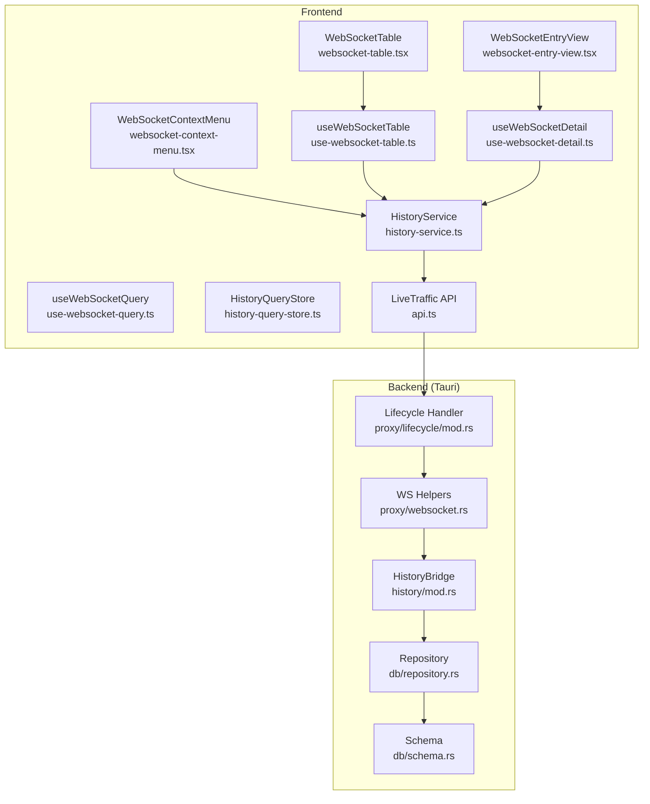
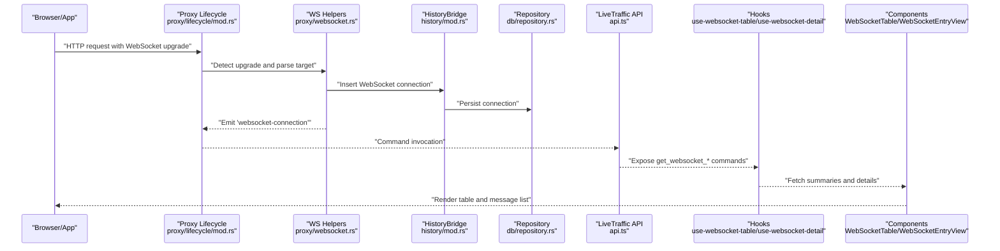
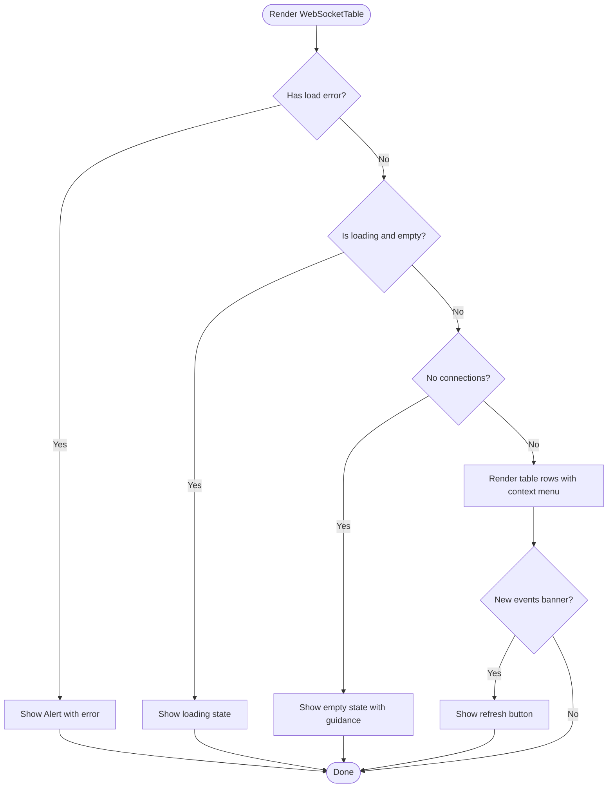
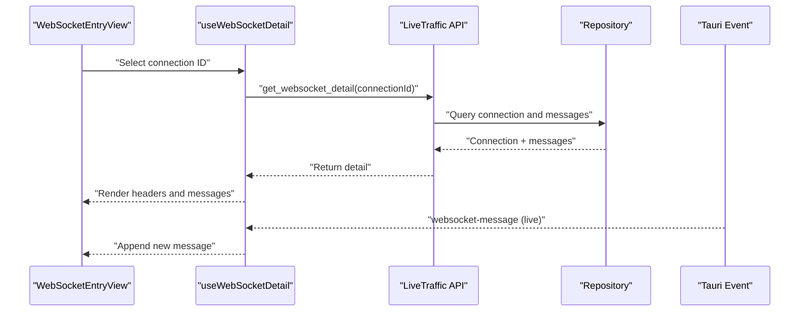
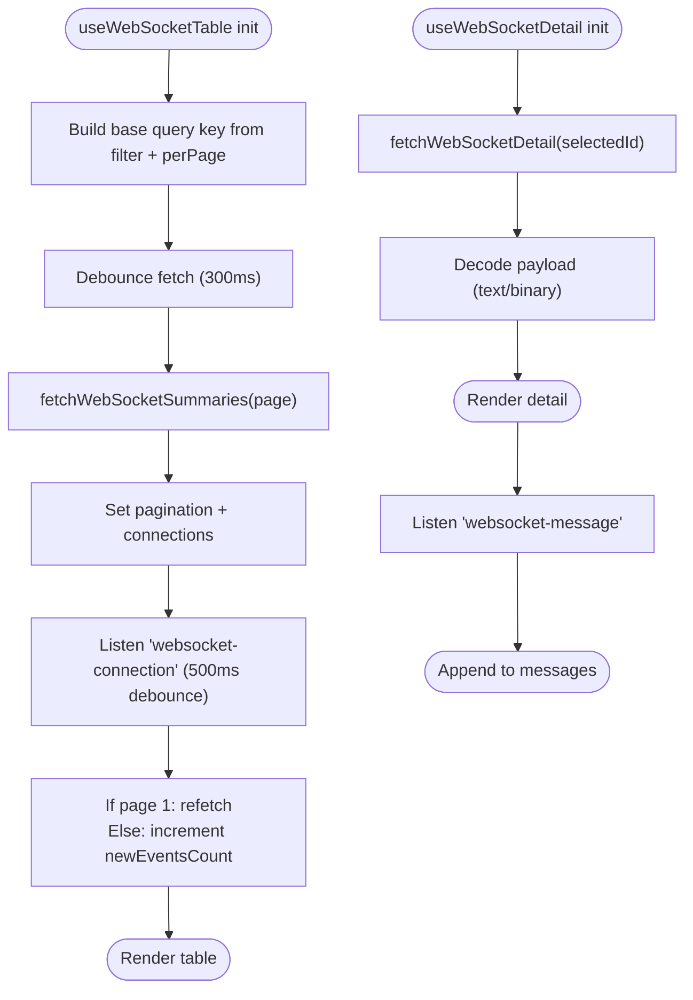
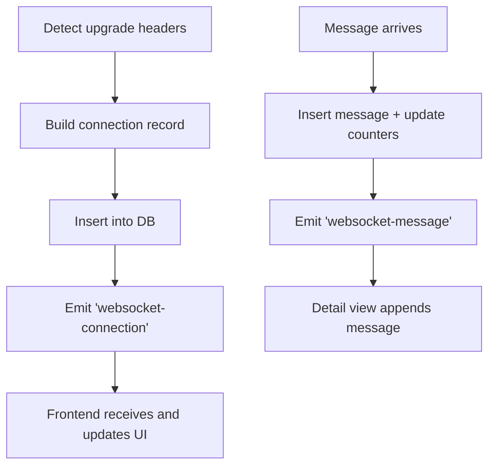
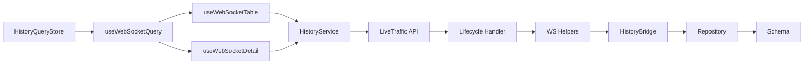

# WebSocket Traffic Analysis

<cite>
**Referenced Files in This Document**
- [websocket-table.tsx](file://src/pages/live-traffic/components/websocket-history-view/websocket-table.tsx)
- [websocket-entry-view.tsx](file://src/pages/live-traffic/components/websocket-history-view/websocket-entry-view.tsx)
- [websocket-context-menu.tsx](file://src/pages/live-traffic/components/websocket-history-view/websocket-context-menu.tsx)
- [use-websocket-table.ts](file://src/pages/live-traffic/hooks/use-websocket-table.ts)
- [use-websocket-detail.ts](file://src/pages/live-traffic/hooks/use-websocket-detail.ts)
- [use-websocket-query.ts](file://src/pages/live-traffic/hooks/use-websocket-query.ts)
- [history-query-store.ts](file://src/pages/live-traffic/state/history-query-store.ts)
- [history-service.ts](file://src/pages/live-traffic/services/history-service.ts)
- [api.ts](file://src/pages/live-traffic/api.ts)
- [websocket.rs](file://src-tauri/src/proxy/websocket.rs)
- [mod.rs](file://src-tauri/src/history/mod.rs)
- [repository.rs](file://src-tauri/src/db/repository.rs)
- [schema.rs](file://src-tauri/src/db/schema.rs)
- [mod.rs](file://src-tauri/src/proxy/lifecycle/mod.rs)
</cite>

## Table of Contents
1. [Introduction](#introduction)
2. [Project Structure](#project-structure)
3. [Core Components](#core-components)
4. [Architecture Overview](#architecture-overview)
5. [Detailed Component Analysis](#detailed-component-analysis)
6. [Dependency Analysis](#dependency-analysis)
7. [Performance Considerations](#performance-considerations)
8. [Troubleshooting Guide](#troubleshooting-guide)
9. [Conclusion](#conclusion)

## Introduction
This document explains the WebSocket Traffic Analysis functionality, covering how WebSocket connections are captured, monitored, and inspected in real time. It details the WebSocket table interface, message detail viewing, connection state management, and the hook-based state management that powers live updates. It also covers the backend integration for MITM proxy capabilities, WebSocket protocol specifics, message formatting, and database persistence.

## Project Structure
The WebSocket Traffic Analysis spans frontend React components and hooks, a service layer, and a Tauri-backed Rust backend. The frontend emits and listens for events, queries paginated summaries, and renders connection and message details. The backend detects WebSocket upgrades, persists handshake and message data, and emits events for live updates.

**Diagram sources**
- [websocket-table.tsx:40-165](file://src/pages/live-traffic/components/websocket-history-view/websocket-table.tsx#L40-L165)
- [websocket-entry-view.tsx:41-157](file://src/pages/live-traffic/components/websocket-history-view/websocket-entry-view.tsx#L41-L157)
- [websocket-context-menu.tsx:25-88](file://src/pages/live-traffic/components/websocket-history-view/websocket-context-menu.tsx#L25-L88)
- [use-websocket-table.ts:35-184](file://src/pages/live-traffic/hooks/use-websocket-table.ts#L35-L184)
- [use-websocket-detail.ts:55-136](file://src/pages/live-traffic/hooks/use-websocket-detail.ts#L55-L136)
- [use-websocket-query.ts:14-38](file://src/pages/live-traffic/hooks/use-websocket-query.ts#L14-L38)
- [history-query-store.ts:40-140](file://src/pages/live-traffic/state/history-query-store.ts#L40-L140)
- [history-service.ts:34-57](file://src/pages/live-traffic/services/history-service.ts#L34-L57)
- [api.ts:173-189](file://src/pages/live-traffic/api.ts#L173-L189)
- [mod.rs:111-141](file://src-tauri/src/proxy/lifecycle/mod.rs#L111-L141)
- [websocket.rs:27-60](file://src-tauri/src/proxy/websocket.rs#L27-L60)
- [mod.rs:193-260](file://src-tauri/src/history/mod.rs#L193-L260)
- [repository.rs:373-432](file://src-tauri/src/db/repository.rs#L373-L432)
- [schema.rs:23-56](file://src-tauri/src/db/schema.rs#L23-L56)

**Section sources**
- [websocket-table.tsx:40-165](file://src/pages/live-traffic/components/websocket-history-view/websocket-table.tsx#L40-L165)
- [use-websocket-table.ts:35-184](file://src/pages/live-traffic/hooks/use-websocket-table.ts#L35-L184)
- [use-websocket-detail.ts:55-136](file://src/pages/live-traffic/hooks/use-websocket-detail.ts#L55-L136)
- [history-service.ts:34-57](file://src/pages/live-traffic/services/history-service.ts#L34-L57)
- [api.ts:173-189](file://src/pages/live-traffic/api.ts#L173-L189)
- [websocket.rs:27-60](file://src-tauri/src/proxy/websocket.rs#L27-L60)
- [mod.rs:193-260](file://src-tauri/src/history/mod.rs#L193-L260)
- [repository.rs:373-432](file://src-tauri/src/db/repository.rs#L373-L432)
- [schema.rs:23-56](file://src-tauri/src/db/schema.rs#L23-L56)
- [mod.rs:111-141](file://src-tauri/src/proxy/lifecycle/mod.rs#L111-L141)

## Core Components
- WebSocketTable: Renders a paginated table of WebSocket connections with state, direction, message counts, and last activity. Supports loading more, refresh on new events, and context menu actions.
- WebSocketEntryView: Displays handshake details and a scrollable list of messages for a selected connection, including direction, type, size, and decoded payload.
- useWebSocketTable: Manages pagination, filtering, debounced fetching, and live updates via a Tauri event listener for new connections.
- useWebSocketDetail: Loads a single connection’s details and subscribes to real-time message events for that connection.
- useWebSocketQuery and HistoryQueryStore: Centralized query state for search, scope, and pagination, with refresh triggers.
- HistoryService and LiveTraffic API: Bridge between frontend hooks and backend commands for fetching summaries, details, and deleting connections.
- Backend WebSocket Utilities and Lifecycle: Detects WebSocket upgrade requests, builds connection records, persists to DB, and emits events.
- Database Schema and Repository: Defines tables for WebSocket connections and messages, and provides CRUD operations and paginated queries.

**Section sources**
- [websocket-table.tsx:40-165](file://src/pages/live-traffic/components/websocket-history-view/websocket-table.tsx#L40-L165)
- [websocket-entry-view.tsx:41-157](file://src/pages/live-traffic/components/websocket-history-view/websocket-entry-view.tsx#L41-L157)
- [use-websocket-table.ts:35-184](file://src/pages/live-traffic/hooks/use-websocket-table.ts#L35-L184)
- [use-websocket-detail.ts:55-136](file://src/pages/live-traffic/hooks/use-websocket-detail.ts#L55-L136)
- [use-websocket-query.ts:14-38](file://src/pages/live-traffic/hooks/use-websocket-query.ts#L14-L38)
- [history-query-store.ts:40-140](file://src/pages/live-traffic/state/history-query-store.ts#L40-L140)
- [history-service.ts:34-57](file://src/pages/live-traffic/services/history-service.ts#L34-L57)
- [api.ts:173-189](file://src/pages/live-traffic/api.ts#L173-L189)
- [websocket.rs:27-60](file://src-tauri/src/proxy/websocket.rs#L27-L60)
- [repository.rs:373-432](file://src-tauri/src/db/repository.rs#L373-L432)
- [schema.rs:23-56](file://src-tauri/src/db/schema.rs#L23-L56)

## Architecture Overview
The system integrates a proxy MITM layer with a persistent storage layer and a React UI. WebSocket upgrade detection triggers a handshake record creation and emission. Subsequent messages update counters and are stored with direction and payload metadata. Frontend hooks subscribe to events and fetch paginated data to keep the UI live and responsive.

**Diagram sources**
- [mod.rs:111-141](file://src-tauri/src/proxy/lifecycle/mod.rs#L111-L141)
- [websocket.rs:27-60](file://src-tauri/src/proxy/websocket.rs#L27-L60)
- [mod.rs:193-260](file://src-tauri/src/history/mod.rs#L193-L260)
- [repository.rs:373-432](file://src-tauri/src/db/repository.rs#L373-L432)
- [api.ts:173-189](file://src/pages/live-traffic/api.ts#L173-L189)
- [use-websocket-table.ts:35-184](file://src/pages/live-traffic/hooks/use-websocket-table.ts#L35-L184)
- [use-websocket-detail.ts:55-136](file://src/pages/live-traffic/hooks/use-websocket-detail.ts#L55-L136)
- [websocket-table.tsx:40-165](file://src/pages/live-traffic/components/websocket-history-view/websocket-table.tsx#L40-L165)
- [websocket-entry-view.tsx:41-157](file://src/pages/live-traffic/components/websocket-history-view/websocket-entry-view.tsx#L41-L157)

## Detailed Component Analysis

### WebSocket Table Interface
The table displays a paginated list of WebSocket connections with:
- Timestamp, host, path, state badges, direction, message count, and last activity.
- Context menu actions: “Send to Repeater” and “Delete.”
- Real-time updates: A “new connections” banner appears when new events arrive and can trigger a refresh.

**Diagram sources**
- [websocket-table.tsx:40-165](file://src/pages/live-traffic/components/websocket-history-view/websocket-table.tsx#L40-L165)

**Section sources**
- [websocket-table.tsx:40-165](file://src/pages/live-traffic/components/websocket-history-view/websocket-table.tsx#L40-L165)
- [websocket-context-menu.tsx:25-88](file://src/pages/live-traffic/components/websocket-history-view/websocket-context-menu.tsx#L25-L88)

### Message Detail Viewing
The detail view shows:
- Connection state badge and URL with timestamps and addresses.
- Handshake request/response headers.
- A list of messages with direction, type, size, timestamp, and decoded payload.

**Diagram sources**
- [websocket-entry-view.tsx:41-157](file://src/pages/live-traffic/components/websocket-history-view/websocket-entry-view.tsx#L41-L157)
- [use-websocket-detail.ts:55-136](file://src/pages/live-traffic/hooks/use-websocket-detail.ts#L55-L136)
- [api.ts:185-189](file://src/pages/live-traffic/api.ts#L185-L189)
- [repository.rs:518-533](file://src-tauri/src/db/repository.rs#L518-L533)

**Section sources**
- [websocket-entry-view.tsx:41-157](file://src/pages/live-traffic/components/websocket-history-view/websocket-entry-view.tsx#L41-L157)
- [use-websocket-detail.ts:55-136](file://src/pages/live-traffic/hooks/use-websocket-detail.ts#L55-L136)
- [api.ts:185-189](file://src/pages/live-traffic/api.ts#L185-L189)
- [repository.rs:518-533](file://src-tauri/src/db/repository.rs#L518-L533)

### Hook-Based State Management
- useWebSocketTable manages:
  - Pagination and perPage controls.
  - Debounced query execution and base query key tracking.
  - Real-time updates via a Tauri event listener for new connections.
  - Refresh and “load more” actions.
- useWebSocketDetail manages:
  - Loading connection and messages.
  - Decoding payloads (text vs binary).
  - Subscribing to live message events scoped to the selected connection.

**Diagram sources**
- [use-websocket-table.ts:35-184](file://src/pages/live-traffic/hooks/use-websocket-table.ts#L35-L184)
- [use-websocket-detail.ts:55-136](file://src/pages/live-traffic/hooks/use-websocket-detail.ts#L55-L136)

**Section sources**
- [use-websocket-table.ts:35-184](file://src/pages/live-traffic/hooks/use-websocket-table.ts#L35-L184)
- [use-websocket-detail.ts:55-136](file://src/pages/live-traffic/hooks/use-websocket-detail.ts#L55-L136)

### Connection State Management and Lifecycle
- Detection: The backend checks for WebSocket upgrade headers and constructs a connection record with state derived from response status.
- Persistence: Connection and message inserts update counters and timestamps.
- Emission: Events are emitted to inform the frontend of new connections and messages.

**Diagram sources**
- [websocket.rs:9-25](file://src-tauri/src/proxy/websocket.rs#L9-L25)
- [websocket.rs:62-94](file://src-tauri/src/proxy/websocket.rs#L62-L94)
- [websocket.rs:27-60](file://src-tauri/src/proxy/websocket.rs#L27-L60)
- [repository.rs:405-432](file://src-tauri/src/db/repository.rs#L405-L432)
- [mod.rs:218-260](file://src-tauri/src/history/mod.rs#L218-L260)

**Section sources**
- [websocket.rs:9-25](file://src-tauri/src/proxy/websocket.rs#L9-L25)
- [websocket.rs:62-94](file://src-tauri/src/proxy/websocket.rs#L62-L94)
- [websocket.rs:27-60](file://src-tauri/src/proxy/websocket.rs#L27-L60)
- [repository.rs:405-432](file://src-tauri/src/db/repository.rs#L405-L432)
- [mod.rs:218-260](file://src-tauri/src/history/mod.rs#L218-L260)

### WebSocket Protocol Specifics and Message Formatting
- Upgrade detection supports standard headers and token lists.
- Target parsing handles absolute URLs and relative URIs with Host header fallback.
- Message decoding:
  - Text messages are decoded using UTF-8.
  - Binary messages are formatted as space-separated hex bytes.
- Direction and type normalization ensures consistent rendering.

**Section sources**
- [websocket.rs:96-149](file://src-tauri/src/proxy/websocket.rs#L96-L149)
- [use-websocket-detail.ts:25-53](file://src/pages/live-traffic/hooks/use-websocket-detail.ts#L25-L53)

### Integration with Proxy System for MITM Capabilities
- The lifecycle handler inspects requests for WebSocket upgrade and, upon detection, builds and persists a connection record, emits an event, and tracks the connection key for future message routing.
- The API exposes commands for paginated logs, details, and deletion, enabling the UI to operate against the persisted dataset.

**Section sources**
- [mod.rs:111-141](file://src-tauri/src/proxy/lifecycle/mod.rs#L111-L141)
- [api.ts:173-189](file://src/pages/live-traffic/api.ts#L173-L189)
- [history-service.ts:34-57](file://src/pages/live-traffic/services/history-service.ts#L34-L57)

## Dependency Analysis
The frontend depends on:
- HistoryQueryStore for centralized query state.
- useWebSocketQuery to derive WebSocket-specific filters.
- HistoryService and LiveTraffic API to invoke backend commands.
- Tauri event listeners for real-time updates.

The backend depends on:
- WebSocket utilities for detection and record building.
- HistoryBridge for database operations.
- Repository for SQL queries and schema-driven tables.
- Schema for table definitions and indexes.

**Diagram sources**
- [history-query-store.ts:40-140](file://src/pages/live-traffic/state/history-query-store.ts#L40-L140)
- [use-websocket-query.ts:14-38](file://src/pages/live-traffic/hooks/use-websocket-query.ts#L14-L38)
- [use-websocket-table.ts:35-184](file://src/pages/live-traffic/hooks/use-websocket-table.ts#L35-L184)
- [use-websocket-detail.ts:55-136](file://src/pages/live-traffic/hooks/use-websocket-detail.ts#L55-L136)
- [history-service.ts:34-57](file://src/pages/live-traffic/services/history-service.ts#L34-L57)
- [api.ts:173-189](file://src/pages/live-traffic/api.ts#L173-L189)
- [mod.rs:111-141](file://src-tauri/src/proxy/lifecycle/mod.rs#L111-L141)
- [websocket.rs:27-60](file://src-tauri/src/proxy/websocket.rs#L27-L60)
- [mod.rs:193-260](file://src-tauri/src/history/mod.rs#L193-L260)
- [repository.rs:373-432](file://src-tauri/src/db/repository.rs#L373-L432)
- [schema.rs:23-56](file://src-tauri/src/db/schema.rs#L23-L56)

**Section sources**
- [history-query-store.ts:40-140](file://src/pages/live-traffic/state/history-query-store.ts#L40-L140)
- [use-websocket-query.ts:14-38](file://src/pages/live-traffic/hooks/use-websocket-query.ts#L14-L38)
- [use-websocket-table.ts:35-184](file://src/pages/live-traffic/hooks/use-websocket-table.ts#L35-L184)
- [use-websocket-detail.ts:55-136](file://src/pages/live-traffic/hooks/use-websocket-detail.ts#L55-L136)
- [history-service.ts:34-57](file://src/pages/live-traffic/services/history-service.ts#L34-L57)
- [api.ts:173-189](file://src/pages/live-traffic/api.ts#L173-L189)
- [websocket.rs:27-60](file://src-tauri/src/proxy/websocket.rs#L27-L60)
- [mod.rs:193-260](file://src-tauri/src/history/mod.rs#L193-L260)
- [repository.rs:373-432](file://src-tauri/src/db/repository.rs#L373-L432)
- [schema.rs:23-56](file://src-tauri/src/db/schema.rs#L23-L56)

## Performance Considerations
- Debouncing: Queries are debounced to reduce redundant network calls and UI thrashing.
- Pagination: Large datasets are fetched in pages with “Load More” support.
- Real-time updates: Event listeners debounce incoming updates to batch UI re-renders.
- Payload decoding: Text decoding is attempted; otherwise binary payloads are rendered as hex to avoid expensive conversions.
- Indexes: Database indexes on timestamps and connection identifiers optimize queries for summaries and messages.

[No sources needed since this section provides general guidance]

## Troubleshooting Guide
Common issues and remedies:
- WebSocket history not appearing:
  - Ensure the proxy is active and MITM is configured so WebSocket upgrade requests pass through.
  - Verify the backend emits the “websocket-connection” event and the frontend listens for it.
- Empty message list:
  - Confirm the selected connection exists and messages were inserted into the database.
  - Check that the event listener for “websocket-message” is scoped to the selected connection ID.
- UI not refreshing:
  - Trigger a refresh or check the “new connections” banner behavior.
  - Verify the base query key change resets pagination to page 1.
- Deleting a connection:
  - Use the context menu action to delete; confirm the local removal and backend deletion via the service.

**Section sources**
- [use-websocket-table.ts:99-152](file://src/pages/live-traffic/hooks/use-websocket-table.ts#L99-L152)
- [use-websocket-detail.ts:105-123](file://src/pages/live-traffic/hooks/use-websocket-detail.ts#L105-L123)
- [websocket-context-menu.tsx:62-70](file://src/pages/live-traffic/components/websocket-history-view/websocket-context-menu.tsx#L62-L70)
- [history-service.ts:54-56](file://src/pages/live-traffic/services/history-service.ts#L54-L56)

## Conclusion
The WebSocket Traffic Analysis system combines a robust backend MITM pipeline with a reactive frontend to deliver real-time visibility into WebSocket connections and messages. The hook-based state management, paginated summaries, and event-driven updates provide a responsive and efficient user experience. The database schema and repository operations ensure reliable persistence and fast queries, while the UI components offer actionable insights for debugging and performance monitoring.