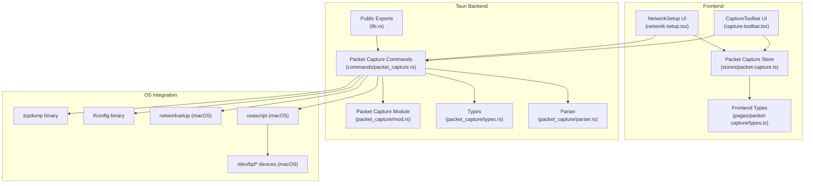
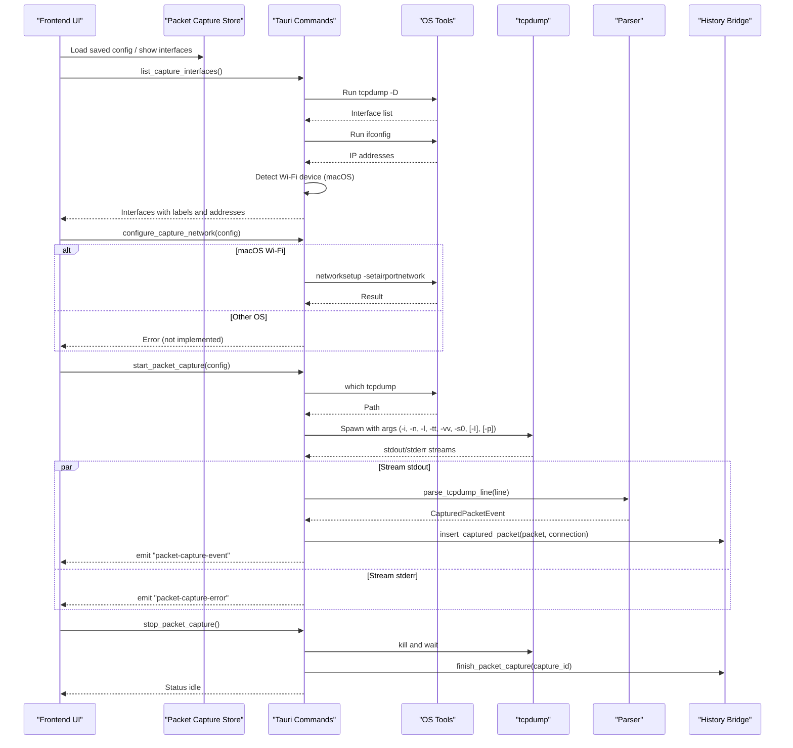
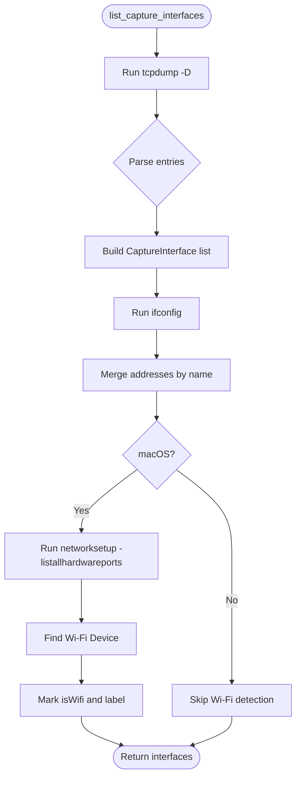
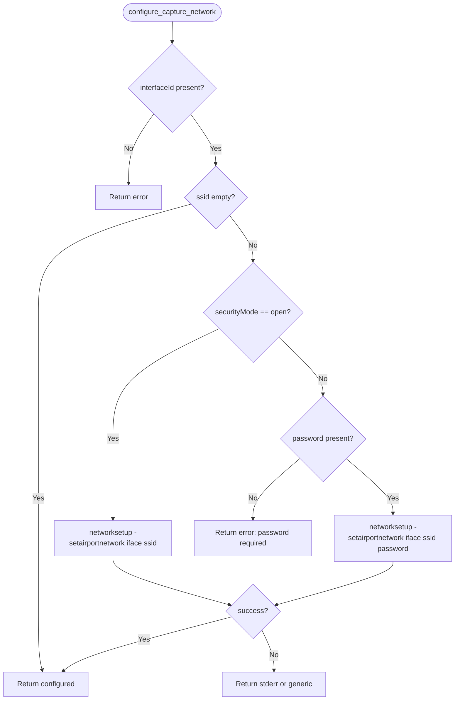
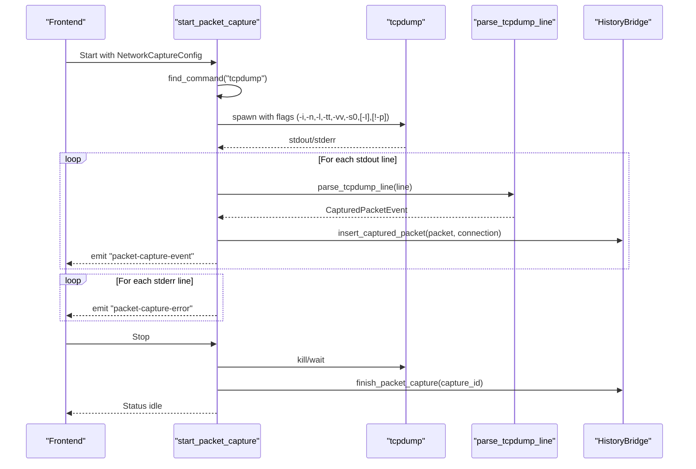
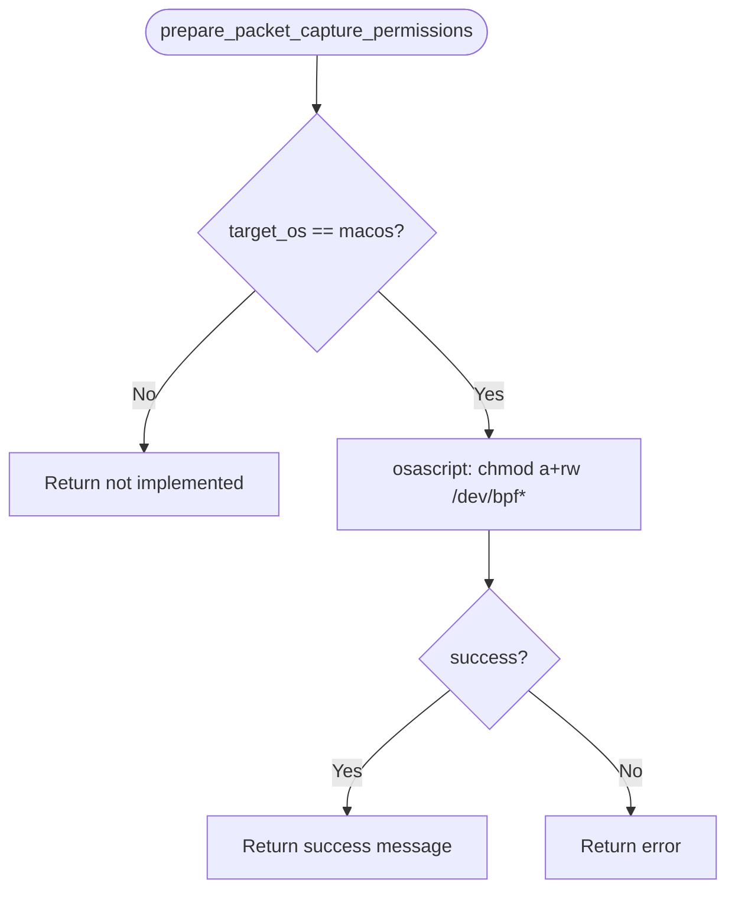
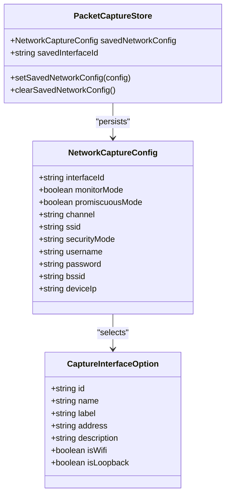
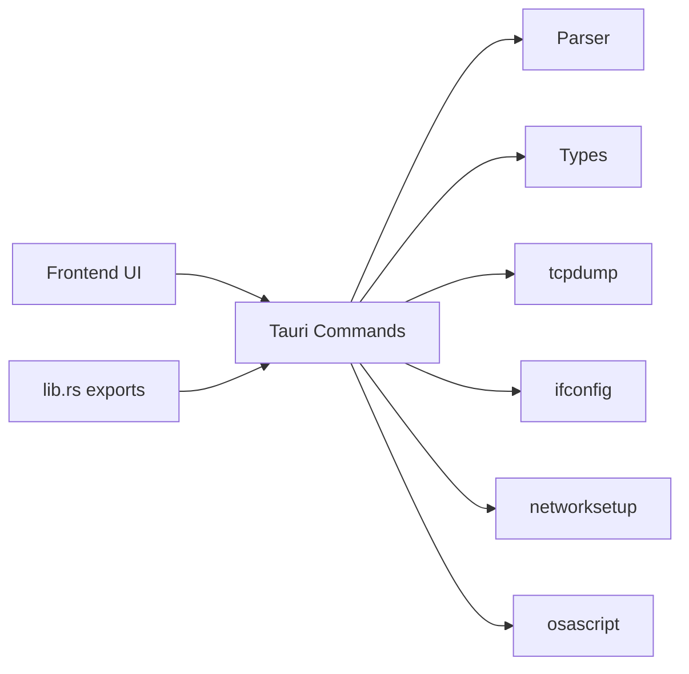

# Network Interface Management

<cite>
**Referenced Files in This Document**
- [Cargo.toml](file://src-tauri/Cargo.toml)
- [lib.rs](file://src-tauri/src/lib.rs)
- [packet_capture/mod.rs](file://src-tauri/src/packet_capture/mod.rs)
- [packet_capture/types.rs](file://src-tauri/src/packet_capture/types.rs)
- [packet_capture/parser.rs](file://src-tauri/src/packet_capture/parser.rs)
- [commands/packet_capture.rs](file://src-tauri/src/commands/packet_capture.rs)
- [stores/packet-capture.ts](file://src/stores/packet-capture.ts)
- [pages/packet-capture/types.ts](file://src/pages/packet-capture/types.ts)
- [pages/packet-capture/components/network-setup.tsx](file://src/pages/packet-capture/components/network-setup.tsx)
- [pages/packet-capture/components/capture-toolbar.tsx](file://src/pages/packet-capture/components/capture-toolbar.tsx)
- [scripts/fix-packet-capture-permissions.sh](file://scripts/fix-packet-capture-permissions.sh)
</cite>

## Table of Contents
1. [Introduction](#introduction)
2. [Project Structure](#project-structure)
3. [Core Components](#core-components)
4. [Architecture Overview](#architecture-overview)
5. [Detailed Component Analysis](#detailed-component-analysis)
6. [Dependency Analysis](#dependency-analysis)
7. [Performance Considerations](#performance-considerations)
8. [Troubleshooting Guide](#troubleshooting-guide)
9. [Conclusion](#conclusion)
10. [Appendices](#appendices)

## Introduction
This document explains AppRecon’s Network Interface Management system for packet capture. It covers how the application enumerates network interfaces, discovers devices, selects capture interfaces, configures capture options (including binding, promiscuous mode, and monitor mode), and handles permissions. It also provides practical setup examples, troubleshooting guidance, and performance considerations for high-throughput scenarios.

## Project Structure
The network interface management spans Tauri backend commands, Rust packet capture modules, and React frontend components and stores. The backend orchestrates OS-level operations (listing interfaces, invoking tcpdump, managing capture state), while the frontend renders configuration UIs and persists user preferences.

**Diagram sources**
- [lib.rs:22-36](file://src-tauri/src/lib.rs#L22-L36)
- [packet_capture/mod.rs:1-6](file://src-tauri/src/packet_capture/mod.rs#L1-L6)
- [packet_capture/types.rs:11-114](file://src-tauri/src/packet_capture/types.rs#L11-L114)
- [packet_capture/parser.rs:1-164](file://src-tauri/src/packet_capture/parser.rs#L1-L164)
- [commands/packet_capture.rs:30-547](file://src-tauri/src/commands/packet_capture.rs#L30-L547)
- [pages/packet-capture/components/network-setup.tsx:1-268](file://src/pages/packet-capture/components/network-setup.tsx#L1-L268)
- [pages/packet-capture/components/capture-toolbar.tsx:1-95](file://src/pages/packet-capture/components/capture-toolbar.tsx#L1-L95)
- [stores/packet-capture.ts:1-33](file://src/stores/packet-capture.ts#L1-L33)
- [pages/packet-capture/types.ts:1-115](file://src/pages/packet-capture/types.ts#L1-L115)

**Section sources**
- [Cargo.toml:11-62](file://src-tauri/Cargo.toml#L11-L62)
- [lib.rs:12-51](file://src-tauri/src/lib.rs#L12-L51)
- [packet_capture/mod.rs:1-6](file://src-tauri/src/packet_capture/mod.rs#L1-L6)
- [packet_capture/types.rs:11-114](file://src-tauri/src/packet_capture/types.rs#L11-L114)
- [packet_capture/parser.rs:1-164](file://src-tauri/src/packet_capture/parser.rs#L1-L164)
- [commands/packet_capture.rs:30-547](file://src-tauri/src/commands/packet_capture.rs#L30-L547)
- [pages/packet-capture/components/network-setup.tsx:1-268](file://src/pages/packet-capture/components/network-setup.tsx#L1-L268)
- [pages/packet-capture/components/capture-toolbar.tsx:1-95](file://src/pages/packet-capture/components/capture-toolbar.tsx#L1-L95)
- [stores/packet-capture.ts:1-33](file://src/stores/packet-capture.ts#L1-L33)
- [pages/packet-capture/types.ts:1-115](file://src/pages/packet-capture/types.ts#L1-L115)

## Core Components
- Packet capture state and models: central state, capture records, parsed events, and connection summaries.
- Parser: transforms tcpdump output lines into structured events.
- Commands: orchestrate interface enumeration, Wi-Fi configuration, capture lifecycle, and permission handling.
- Frontend store and UI: manage user preferences and present configuration forms.

Key responsibilities:
- Enumerate interfaces via tcpdump and enrich with addresses and device type.
- Configure Wi-Fi network on macOS using networksetup.
- Launch tcpdump with appropriate flags for interface binding, promiscuous mode, and monitor mode.
- Parse and persist captured packets, emit real-time events, and finalize capture records.

**Section sources**
- [packet_capture/types.rs:3-114](file://src-tauri/src/packet_capture/types.rs#L3-L114)
- [packet_capture/parser.rs:4-164](file://src-tauri/src/packet_capture/parser.rs#L4-L164)
- [commands/packet_capture.rs:48-547](file://src-tauri/src/commands/packet_capture.rs#L48-L547)
- [stores/packet-capture.ts:6-33](file://src/stores/packet-capture.ts#L6-L33)
- [pages/packet-capture/types.ts:7-28](file://src/pages/packet-capture/types.ts#L7-L28)

## Architecture Overview
The system integrates a React frontend with Tauri commands. The backend spawns tcpdump, streams its stdout/stderr, parses lines, emits events, and persists data. Permission handling is OS-specific, with macOS support for automatic fixes.

**Diagram sources**
- [commands/packet_capture.rs:149-284](file://src-tauri/src/commands/packet_capture.rs#L149-L284)
- [commands/packet_capture.rs:427-547](file://src-tauri/src/commands/packet_capture.rs#L427-L547)
- [packet_capture/parser.rs:4-73](file://src-tauri/src/packet_capture/parser.rs#L4-L73)
- [lib.rs:22-36](file://src-tauri/src/lib.rs#L22-L36)

## Detailed Component Analysis

### Interface Enumeration and Discovery
- Uses tcpdump -D to list available capture devices and extracts IDs and labels.
- Augments with ifconfig output to attach IP addresses to interfaces.
- On macOS, detects the Wi-Fi hardware port and marks the interface accordingly.
- Falls back to common defaults if enumeration fails.

**Diagram sources**
- [commands/packet_capture.rs:48-97](file://src-tauri/src/commands/packet_capture.rs#L48-L97)
- [commands/packet_capture.rs:427-492](file://src-tauri/src/commands/packet_capture.rs#L427-L492)
- [commands/packet_capture.rs:494-530](file://src-tauri/src/commands/packet_capture.rs#L494-L530)

**Section sources**
- [commands/packet_capture.rs:48-97](file://src-tauri/src/commands/packet_capture.rs#L48-L97)
- [commands/packet_capture.rs:427-492](file://src-tauri/src/commands/packet_capture.rs#L427-L492)
- [commands/packet_capture.rs:494-530](file://src-tauri/src/commands/packet_capture.rs#L494-L530)

### Wi-Fi Network Configuration
- On macOS, sets the active airport network using networksetup with optional password for secured networks.
- Validates security mode and password requirements before applying.

**Diagram sources**
- [commands/packet_capture.rs:99-147](file://src-tauri/src/commands/packet_capture.rs#L99-L147)

**Section sources**
- [commands/packet_capture.rs:99-147](file://src-tauri/src/commands/packet_capture.rs#L99-L147)

### Capture Lifecycle and Options
- Starts tcpdump with:
  - Interface binding via -i <iface>
  - Non-printing headers via -n
  - Line buffered output via -l
  - Unix timestamps via -tt
  - Verbose output via -vv
  - Full packet capture via -s 0
  - Monitor mode via -I (when enabled)
  - Promiscuous mode via -p (disabled when promiscuousMode is false)
- Streams stdout/stderr, parses lines, emits events, and persists packets.
- Persists capture record on start and finalizes on stop.

**Diagram sources**
- [commands/packet_capture.rs:149-284](file://src-tauri/src/commands/packet_capture.rs#L149-L284)
- [packet_capture/parser.rs:4-73](file://src-tauri/src/packet_capture/parser.rs#L4-L73)

**Section sources**
- [commands/packet_capture.rs:149-284](file://src-tauri/src/commands/packet_capture.rs#L149-L284)
- [packet_capture/parser.rs:4-73](file://src-tauri/src/packet_capture/parser.rs#L4-L73)

### Permission Handling (macOS)
- Provides a command to prepare packet capture permissions by adjusting /dev/bpf* access.
- Includes a helper script to grant read/write access to BPF devices after initial capture failure.
- On non-macOS platforms, permission preparation is not implemented.

**Diagram sources**
- [commands/packet_capture.rs:30-46](file://src-tauri/src/commands/packet_capture.rs#L30-L46)
- [scripts/fix-packet-capture-permissions.sh:1-17](file://scripts/fix-packet-capture-permissions.sh#L1-L17)

**Section sources**
- [commands/packet_capture.rs:30-46](file://src-tauri/src/commands/packet_capture.rs#L30-L46)
- [scripts/fix-packet-capture-permissions.sh:1-17](file://scripts/fix-packet-capture-permissions.sh#L1-L17)

### Frontend UI and State
- NetworkSetup presents selectable interfaces, Wi-Fi configuration fields, and capture options (promiscuous and monitor modes).
- CaptureToolbar controls capture lifecycle and interface selection.
- Packet capture store persists user preferences locally.

**Diagram sources**
- [pages/packet-capture/types.ts:7-28](file://src/pages/packet-capture/types.ts#L7-L28)
- [pages/packet-capture/components/network-setup.tsx:11-33](file://src/pages/packet-capture/components/network-setup.tsx#L11-L33)
- [stores/packet-capture.ts:6-33](file://src/stores/packet-capture.ts#L6-L33)

**Section sources**
- [pages/packet-capture/components/network-setup.tsx:11-33](file://src/pages/packet-capture/components/network-setup.tsx#L11-L33)
- [pages/packet-capture/components/capture-toolbar.tsx:6-20](file://src/pages/packet-capture/components/capture-toolbar.tsx#L6-L20)
- [stores/packet-capture.ts:6-33](file://src/stores/packet-capture.ts#L6-L33)
- [pages/packet-capture/types.ts:7-28](file://src/pages/packet-capture/types.ts#L7-L28)

## Dependency Analysis
- Tauri commands depend on external binaries (tcpdump, ifconfig, networksetup, osascript) and internal modules (parser, types).
- The frontend depends on the Tauri command surface exposed via lib.rs and uses local store for persistence.

**Diagram sources**
- [lib.rs:22-36](file://src-tauri/src/lib.rs#L22-L36)
- [commands/packet_capture.rs:30-547](file://src-tauri/src/commands/packet_capture.rs#L30-L547)

**Section sources**
- [lib.rs:22-36](file://src-tauri/src/lib.rs#L22-L36)
- [Cargo.toml:11-62](file://src-tauri/Cargo.toml#L11-L62)
- [commands/packet_capture.rs:30-547](file://src-tauri/src/commands/packet_capture.rs#L30-L547)

## Performance Considerations
- Capture buffer sizing: tcpdump is invoked with full-length packets (-s 0) to preserve payloads, which increases memory usage and CPU overhead.
- Output buffering: -l ensures line-buffered output for timely parsing; avoid disabling this for high-throughput scenarios.
- Parsing cost: Regex-based parsing runs per line; keep filters and UI updates efficient.
- Concurrency: Separate threads handle stdout and stderr streaming; ensure the UI can handle bursts of events.
- Disk writes: Persisting each packet adds IO overhead; consider batching or tuning persistence frequency if needed.
- OS-level tuning: On Linux, consider increasing ring buffer sizes and enabling NAPI/MSI for high-throughput NICs.

[No sources needed since this section provides general guidance]

## Troubleshooting Guide
Common issues and resolutions:
- tcpdump not found
  - Symptom: Error indicating tcpdump was not found.
  - Resolution: Install tcpdump on the system and ensure it is on PATH.
  - Reference: [commands/packet_capture.rs:159-162](file://src-tauri/src/commands/packet_capture.rs#L159-L162)

- Permission denied on macOS
  - Symptom: Capture fails due to lack of access to /dev/bpf*.
  - Resolution: Use the built-in permission preparation command or run the helper script to adjust device permissions.
  - References:
    - [commands/packet_capture.rs:30-46](file://src-tauri/src/commands/packet_capture.rs#L30-L46)
    - [scripts/fix-packet-capture-permissions.sh:9-16](file://scripts/fix-packet-capture-permissions.sh#L9-L16)

- No interfaces detected
  - Symptom: Empty interface list.
  - Resolution: Verify tcpdump -D and ifconfig availability; fallback logic creates default Wi-Fi and loopback entries.
  - References:
    - [commands/packet_capture.rs:48-97](file://src-tauri/src/commands/packet_capture.rs#L48-L97)
    - [commands/packet_capture.rs:427-492](file://src-tauri/src/commands/packet_capture.rs#L427-L492)

- Wi-Fi configuration not applied
  - Symptom: networksetup fails or returns an error.
  - Resolution: Confirm interface ID, SSID, and security mode; ensure password is provided for secured networks.
  - Reference: [commands/packet_capture.rs:115-146](file://src-tauri/src/commands/packet_capture.rs#L115-L146)

- Capture not starting or immediately stopping
  - Symptom: Status becomes idle shortly after start.
  - Resolution: Check stderr emissions for errors; ensure promiscuous mode is compatible with the interface; verify monitor mode support for Wi-Fi.
  - References:
    - [commands/packet_capture.rs:254-277](file://src-tauri/src/commands/packet_capture.rs#L254-L277)
    - [commands/packet_capture.rs:177-183](file://src-tauri/src/commands/packet_capture.rs#L177-L183)

**Section sources**
- [commands/packet_capture.rs:30-46](file://src-tauri/src/commands/packet_capture.rs#L30-L46)
- [commands/packet_capture.rs:48-97](file://src-tauri/src/commands/packet_capture.rs#L48-L97)
- [commands/packet_capture.rs:115-146](file://src-tauri/src/commands/packet_capture.rs#L115-L146)
- [commands/packet_capture.rs:159-162](file://src-tauri/src/commands/packet_capture.rs#L159-L162)
- [commands/packet_capture.rs:177-183](file://src-tauri/src/commands/packet_capture.rs#L177-L183)
- [commands/packet_capture.rs:254-277](file://src-tauri/src/commands/packet_capture.rs#L254-L277)
- [scripts/fix-packet-capture-permissions.sh:9-16](file://scripts/fix-packet-capture-permissions.sh#L9-L16)

## Conclusion
AppRecon’s Network Interface Management system provides a robust pipeline for enumerating interfaces, configuring Wi-Fi capture on macOS, launching tcpdump with configurable options, and handling permissions. The frontend integrates seamlessly with Tauri commands to deliver a user-friendly capture workflow, while the backend ensures reliable parsing, persistence, and lifecycle management.

[No sources needed since this section summarizes without analyzing specific files]

## Appendices

### Practical Setup Examples

- macOS
  - Prepare permissions: Use the permission preparation command or run the helper script to adjust /dev/bpf* access.
    - [commands/packet_capture.rs:30-46](file://src-tauri/src/commands/packet_capture.rs#L30-L46)
    - [scripts/fix-packet-capture-permissions.sh:14-16](file://scripts/fix-packet-capture-permissions.sh#L14-L16)
  - Configure Wi-Fi: Provide SSID and security mode; supply password for secured networks.
    - [commands/packet_capture.rs:100-147](file://src-tauri/src/commands/packet_capture.rs#L100-L147)
  - Start capture: Choose interface, enable monitor/promiscuous modes as needed, and begin capture.
    - [commands/packet_capture.rs:149-284](file://src-tauri/src/commands/packet_capture.rs#L149-L284)

- Linux
  - Ensure tcpdump is installed and available on PATH.
    - [commands/packet_capture.rs:159-162](file://src-tauri/src/commands/packet_capture.rs#L159-L162)
  - For permission issues, consult OS-specific guidance for BPF device access and CAP_NET_RAW capabilities.
  - Use promiscuous mode cautiously; verify adapter support and system policies.

- Windows
  - Install WinPcap/Npcap and ensure tcpdump compatibility.
  - Use administrative privileges when launching capture sessions.

**Section sources**
- [commands/packet_capture.rs:30-46](file://src-tauri/src/commands/packet_capture.rs#L30-L46)
- [commands/packet_capture.rs:100-147](file://src-tauri/src/commands/packet_capture.rs#L100-L147)
- [commands/packet_capture.rs:149-284](file://src-tauri/src/commands/packet_capture.rs#L149-L284)
- [commands/packet_capture.rs:159-162](file://src-tauri/src/commands/packet_capture.rs#L159-L162)
- [scripts/fix-packet-capture-permissions.sh:14-16](file://scripts/fix-packet-capture-permissions.sh#L14-L16)