# Packet Analysis System

<cite>
**Referenced Files in This Document**
- [index.tsx](file://src/pages/packet-capture/index.tsx)
- [packet-list.tsx](file://src/pages/packet-capture/components/packet-list.tsx)
- [packet-detail.tsx](file://src/pages/packet-capture/components/packet-detail.tsx)
- [hex-view.tsx](file://src/pages/packet-capture/components/hex-view.tsx)
- [packet-filters.tsx](file://src/pages/packet-capture/components/packet-filters.tsx)
- [stream-panel.tsx](file://src/pages/packet-capture/components/stream-panel.tsx)
- [http-parser-panel.tsx](file://src/pages/packet-capture/components/http-parser-panel.tsx)
- [packet-utils.ts](file://src/pages/packet-capture/lib/packet-utils.ts)
- [types.ts](file://src/pages/packet-capture/types.ts)
- [use-packet-capture-page.ts](file://src/pages/packet-capture/hooks/use-packet-capture-page.ts)
- [constants.ts](file://src/pages/packet-capture/constants.ts)
- [api.ts](file://src/pages/packet-capture/api.ts)
- [packet-capture.ts](file://src/stores/packet-capture.ts)
- [inspector.tsx](file://src/pages/live-traffic/components/log-table/inspector.tsx)
- [schema.rs](file://src-tauri/src/db/schema.rs)
</cite>

## Table of Contents
1. [Introduction](#introduction)
2. [Project Structure](#project-structure)
3. [Core Components](#core-components)
4. [Architecture Overview](#architecture-overview)
5. [Detailed Component Analysis](#detailed-component-analysis)
6. [Dependency Analysis](#dependency-analysis)
7. [Performance Considerations](#performance-considerations)
8. [Troubleshooting Guide](#troubleshooting-guide)
9. [Conclusion](#conclusion)
10. [Appendices](#appendices)

## Introduction
This document describes AppRecon’s Packet Analysis System, focusing on packet visualization, protocol parsing, filtering, and stream analysis. It explains how the packet list, packet detail inspector, hex view, HTTP parser panel, and TCP stream panel work together, and how filtering and sorting enable efficient inspection of live or recorded sessions. It also covers protocol-specific analysis for HTTP/TLS/TCP/DNS and practical workflows for debugging and performance optimization.

## Project Structure
The Packet Analysis System is implemented as a Tauri-powered page with React components and TypeScript types. The page orchestrates:
- A toolbar for capture controls and metrics
- A filter bar for narrowing down packets
- A vertically resizable layout containing:
  - Packet list table
  - Packet detail inspector
  - Hex view
  - HTTP parser panel and TCP stream panel

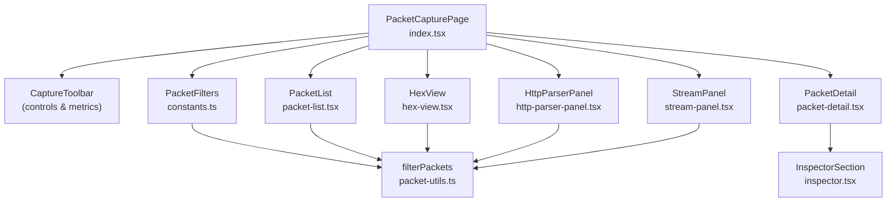

**Diagram sources**
- [index.tsx:36-122](file://src/pages/packet-capture/index.tsx#L36-L122)
- [packet-list.tsx:38-90](file://src/pages/packet-capture/components/packet-list.tsx#L38-L90)
- [packet-detail.tsx:10-41](file://src/pages/packet-capture/components/packet-detail.tsx#L10-L41)
- [hex-view.tsx:15-69](file://src/pages/packet-capture/components/hex-view.tsx#L15-L69)
- [http-parser-panel.tsx:16-47](file://src/pages/packet-capture/components/http-parser-panel.tsx#L16-L47)
- [stream-panel.tsx:8-41](file://src/pages/packet-capture/components/stream-panel.tsx#L8-L41)
- [packet-utils.ts:40-130](file://src/pages/packet-capture/lib/packet-utils.ts#L40-L130)
- [constants.ts:24-36](file://src/pages/packet-capture/constants.ts#L24-L36)
- [inspector.tsx:83-159](file://src/pages/live-traffic/components/log-table/inspector.tsx#L83-L159)

**Section sources**
- [index.tsx:20-123](file://src/pages/packet-capture/index.tsx#L20-L123)

## Core Components
- Packet list: Displays a sortable table of packets with protocol badges and basic metadata.
- Packet detail: Renders decoded protocol layers and fields for the selected packet.
- Hex view: Shows raw bytes in a side-by-side hex/ASCII grid with selection support.
- HTTP parser panel: Presents parsed HTTP messages (headers, cookies, query params, body preview).
- Stream panel: Shows reconstructed TCP/TLS/HTTP conversation across multiple packets.
- Filtering and sorting: Real-time query and multi-field filters with persistent sort keys.

**Section sources**
- [packet-list.tsx:38-90](file://src/pages/packet-capture/components/packet-list.tsx#L38-L90)
- [packet-detail.tsx:10-41](file://src/pages/packet-capture/components/packet-detail.tsx#L10-L41)
- [hex-view.tsx:15-69](file://src/pages/packet-capture/components/hex-view.tsx#L15-L69)
- [http-parser-panel.tsx:16-47](file://src/pages/packet-capture/components/http-parser-panel.tsx#L16-L47)
- [stream-panel.tsx:8-41](file://src/pages/packet-capture/components/stream-panel.tsx#L8-L41)
- [packet-utils.ts:40-130](file://src/pages/packet-capture/lib/packet-utils.ts#L40-L130)
- [packet-filters.tsx:14-52](file://src/pages/packet-capture/components/packet-filters.tsx#L14-L52)

## Architecture Overview
The system integrates a React UI with Tauri-backed capture APIs. The hook manages capture lifecycle, events, state, and derived computations (filtered/sorted packets, TCP streams, selected ranges). Utilities provide filtering, sorting, stream building, and hex formatting.

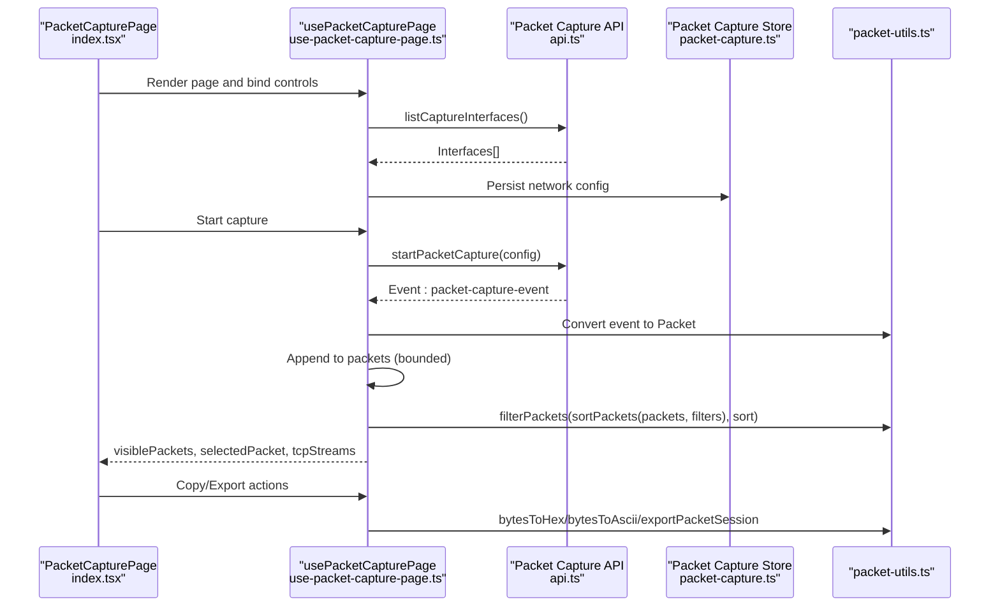

**Diagram sources**
- [index.tsx:36-122](file://src/pages/packet-capture/index.tsx#L36-L122)
- [use-packet-capture-page.ts:84-114](file://src/pages/packet-capture/hooks/use-packet-capture-page.ts#L84-L114)
- [api.ts:71-89](file://src/pages/packet-capture/api.ts#L71-L89)
- [packet-capture.ts:13-33](file://src/stores/packet-capture.ts#L13-L33)
- [packet-utils.ts:40-96](file://src/pages/packet-capture/lib/packet-utils.ts#L40-L96)

## Detailed Component Analysis

### Packet List Display
- Columns include packet number, timestamp, source/destination endpoints, protocol badge, length, and info summary.
- Sorting toggles asc/desc per column; protocol row coloring highlights major protocols.
- Selection updates the detail and hex panels and influences stream selection.

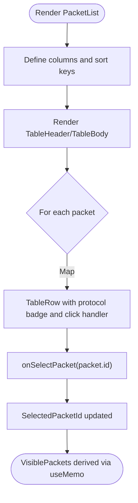

**Diagram sources**
- [packet-list.tsx:16-90](file://src/pages/packet-capture/components/packet-list.tsx#L16-L90)

**Section sources**
- [packet-list.tsx:38-90](file://src/pages/packet-capture/components/packet-list.tsx#L38-L90)

### Packet Detail Inspection
- Uses a reusable inspector to render each protocol layer as expandable sections.
- Converts flat fields to key-value pairs for consistent rendering.
- Supports selecting a field to highlight its byte range in the hex view.

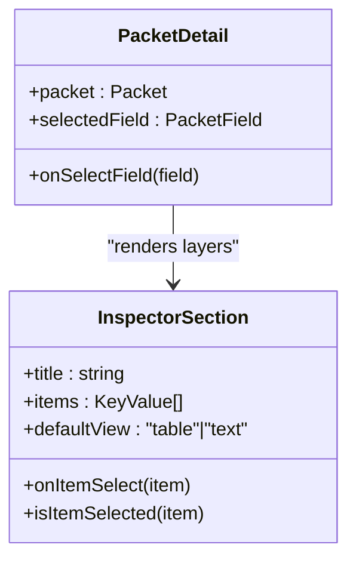

**Diagram sources**
- [packet-detail.tsx:10-41](file://src/pages/packet-capture/components/packet-detail.tsx#L10-L41)
- [inspector.tsx:83-159](file://src/pages/live-traffic/components/log-table/inspector.tsx#L83-L159)

**Section sources**
- [packet-detail.tsx:10-41](file://src/pages/packet-capture/components/packet-detail.tsx#L10-L41)
- [inspector.tsx:83-159](file://src/pages/live-traffic/components/log-table/inspector.tsx#L83-L159)

### Hex View Functionality
- Formats raw bytes into fixed-width rows with offsets and selectable ranges.
- Provides actions to copy hex, copy ASCII, and export raw body.
- Selected range is computed from the currently selected field’s byte bounds.

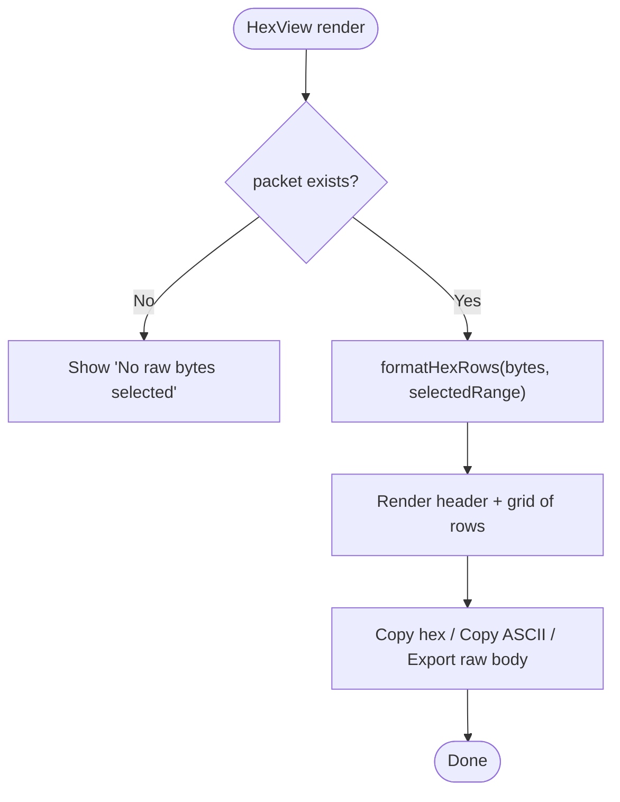

**Diagram sources**
- [hex-view.tsx:15-69](file://src/pages/packet-capture/components/hex-view.tsx#L15-L69)
- [packet-utils.ts:9-30](file://src/pages/packet-capture/lib/packet-utils.ts#L9-L30)

**Section sources**
- [hex-view.tsx:15-69](file://src/pages/packet-capture/components/hex-view.tsx#L15-L69)
- [packet-utils.ts:9-30](file://src/pages/packet-capture/lib/packet-utils.ts#L9-L30)

### Protocol Parsing Capabilities
- HTTP extraction: The HTTP parser panel displays method/host/url for requests and status for responses, plus headers, cookies, query params, and a body preview.
- Stream reconstruction: TCP streams are grouped by 5-tuple and ordered by timestamp; reconstructed text combines HTTP raw bodies or ASCII dumps.
- Protocol-specific analysis: TLS metadata is shown for TLS packets; DNS, ARP, ICMP, and 802.11 entries are supported.

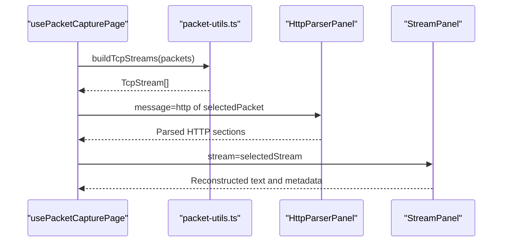

**Diagram sources**
- [use-packet-capture-page.ts:126-134](file://src/pages/packet-capture/hooks/use-packet-capture-page.ts#L126-L134)
- [packet-utils.ts:98-130](file://src/pages/packet-capture/lib/packet-utils.ts#L98-L130)
- [http-parser-panel.tsx:16-47](file://src/pages/packet-capture/components/http-parser-panel.tsx#L16-L47)
- [stream-panel.tsx:8-41](file://src/pages/packet-capture/components/stream-panel.tsx#L8-L41)

**Section sources**
- [http-parser-panel.tsx:16-47](file://src/pages/packet-capture/components/http-parser-panel.tsx#L16-L47)
- [packet-utils.ts:98-130](file://src/pages/packet-capture/lib/packet-utils.ts#L98-L130)
- [types.ts:42-81](file://src/pages/packet-capture/types.ts#L42-L81)

### Packet Filtering System
- Criteria include free-text query, protocol, source/destination IPs, destination port, HTTP method, host, URL, status code, and content type.
- Live filtering pipeline: filterPackets → sortPackets → visiblePackets.
- Reset clears all filters.

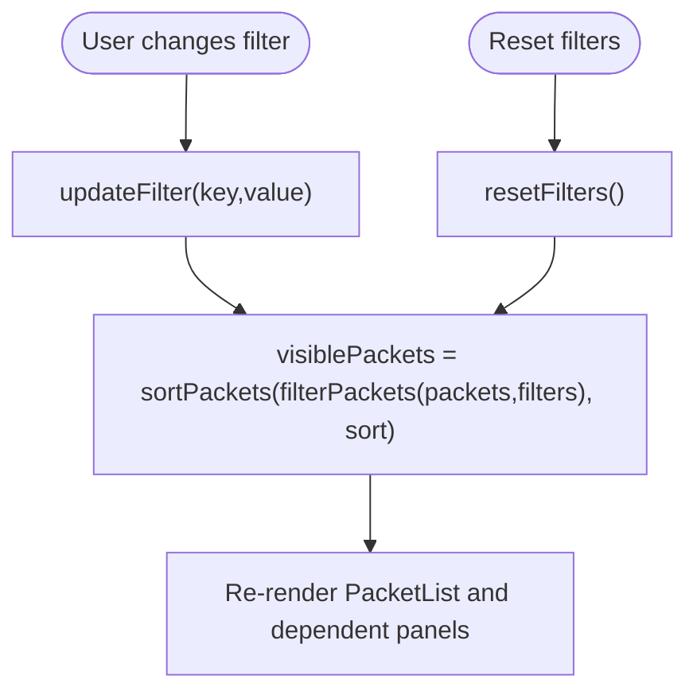

**Diagram sources**
- [packet-filters.tsx:14-52](file://src/pages/packet-capture/components/packet-filters.tsx#L14-L52)
- [packet-utils.ts:40-96](file://src/pages/packet-capture/lib/packet-utils.ts#L40-L96)
- [use-packet-capture-page.ts:116-119](file://src/pages/packet-capture/hooks/use-packet-capture-page.ts#L116-L119)

**Section sources**
- [packet-filters.tsx:14-52](file://src/pages/packet-capture/components/packet-filters.tsx#L14-L52)
- [packet-utils.ts:40-96](file://src/pages/packet-capture/lib/packet-utils.ts#L40-L96)
- [constants.ts:24-36](file://src/pages/packet-capture/constants.ts#L24-L36)

### Stream Analysis Features
- TCP session reconstruction groups packets by stream ID and orders by timestamp.
- Reconstructed text concatenates HTTP raw bodies or ASCII dumps.
- Stream panel shows protocol, label, completeness, packet count, and total bytes.

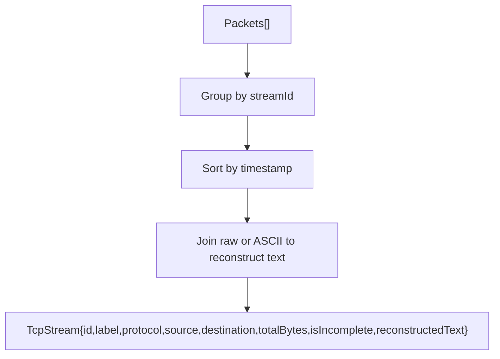

**Diagram sources**
- [packet-utils.ts:98-130](file://src/pages/packet-capture/lib/packet-utils.ts#L98-L130)
- [stream-panel.tsx:17-41](file://src/pages/packet-capture/components/stream-panel.tsx#L17-L41)

**Section sources**
- [packet-utils.ts:98-130](file://src/pages/packet-capture/lib/packet-utils.ts#L98-L130)
- [stream-panel.tsx:8-41](file://src/pages/packet-capture/components/stream-panel.tsx#L8-L41)

### Practical Workflows
- Inspecting HTTP requests:
  - Select an HTTP packet in the list.
  - Observe parsed headers, cookies, query params, and body preview in the HTTP panel.
  - Switch to hex view to locate specific header bytes or body offsets.
- Debugging TLS handshakes:
  - Select a TLS packet; the detail panel shows TLS metadata.
  - Use hex view to inspect SNI or certificate material if present.
- Reconstructing TCP conversations:
  - Select a TCP/TLS/HTTP packet to populate the stream panel.
  - Review reconstructed text for request/response sequences and timing.
- Filtering and searching:
  - Use the filter bar to narrow by host, method, status, or content type.
  - Combine free-text queries with protocol/port/IP filters.

[No sources needed since this section provides conceptual workflows]

## Dependency Analysis
- UI components depend on shared types and utilities.
- The hook depends on Tauri APIs for capture lifecycle and on local utilities for data transformations.
- The inspector component is reused across panels for consistent rendering.

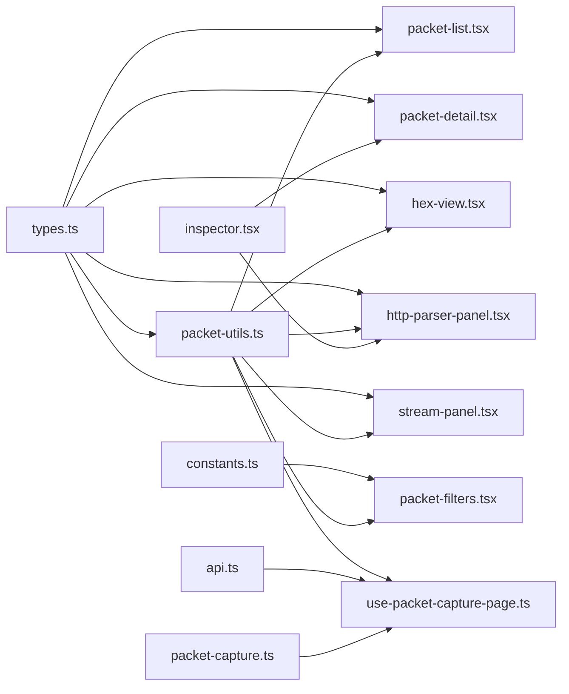

**Diagram sources**
- [types.ts:58-115](file://src/pages/packet-capture/types.ts#L58-L115)
- [packet-utils.ts:40-130](file://src/pages/packet-capture/lib/packet-utils.ts#L40-L130)
- [packet-filters.tsx:14-52](file://src/pages/packet-capture/components/packet-filters.tsx#L14-L52)
- [packet-list.tsx:38-90](file://src/pages/packet-capture/components/packet-list.tsx#L38-L90)
- [packet-detail.tsx:10-41](file://src/pages/packet-capture/components/packet-detail.tsx#L10-L41)
- [hex-view.tsx:15-69](file://src/pages/packet-capture/components/hex-view.tsx#L15-L69)
- [http-parser-panel.tsx:16-47](file://src/pages/packet-capture/components/http-parser-panel.tsx#L16-L47)
- [stream-panel.tsx:8-41](file://src/pages/packet-capture/components/stream-panel.tsx#L8-L41)
- [use-packet-capture-page.ts:16-24](file://src/pages/packet-capture/hooks/use-packet-capture-page.ts#L16-L24)
- [api.ts:71-107](file://src/pages/packet-capture/api.ts#L71-L107)
- [packet-capture.ts:13-33](file://src/stores/packet-capture.ts#L13-L33)
- [inspector.tsx:83-159](file://src/pages/live-traffic/components/log-table/inspector.tsx#L83-L159)

**Section sources**
- [use-packet-capture-page.ts:16-24](file://src/pages/packet-capture/hooks/use-packet-capture-page.ts#L16-L24)
- [api.ts:71-107](file://src/pages/packet-capture/api.ts#L71-L107)
- [packet-capture.ts:13-33](file://src/stores/packet-capture.ts#L13-L33)

## Performance Considerations
- Bounded packet buffer: Incoming packets are appended and sliced to a recent window to limit memory growth during live capture.
- Efficient filtering and sorting: Derived computations are memoized to avoid recomputation on trivial state changes.
- Hex rendering: Fixed-width rows and selective highlighting reduce DOM overhead.
- Stream reconstruction: Aggregation occurs per render cycle; consider debouncing or virtualization for very large sessions.
- Real-time analysis: Events are processed incrementally; keep filter complexity moderate to maintain responsiveness.

[No sources needed since this section provides general guidance]

## Troubleshooting Guide
- Permission errors for packet capture:
  - The hook listens for capture errors and surfaces permission-related messages; a dedicated action attempts to fix permissions.
- Parsing issues:
  - If HTTP parsing fails, verify the presence of HTTP fields in the packet and confirm protocol detection.
  - For TLS, note that SNI/certificates may be encrypted; inspect raw bytes in hex view for metadata.
- Stream reconstruction problems:
  - Ensure packets have valid ports and timestamps; missing TCP flags may mark streams as incomplete.
  - Confirm stream ID generation matches expected 5-tuple grouping.
- Display optimization:
  - Reduce filter complexity or temporarily disable filters to isolate performance bottlenecks.
  - Prefer copying hex/ASCII for large bodies instead of rendering previews.

**Section sources**
- [use-packet-capture-page.ts:84-114](file://src/pages/packet-capture/hooks/use-packet-capture-page.ts#L84-L114)
- [use-packet-capture-page.ts:380-383](file://src/pages/packet-capture/hooks/use-packet-capture-page.ts#L380-L383)
- [packet-utils.ts:98-130](file://src/pages/packet-capture/lib/packet-utils.ts#L98-L130)

## Conclusion
AppRecon’s Packet Analysis System provides a modular, extensible foundation for packet visualization, filtering, protocol parsing, and stream reconstruction. Its React/Tauri architecture enables real-time inspection with robust utilities for filtering, sorting, and hex editing, while the inspector and HTTP panel deliver deep visibility into protocol details. With careful use of memoization and bounded buffers, the system remains responsive even under heavy loads.

[No sources needed since this section summarizes without analyzing specific files]

## Appendices

### Data Model Overview
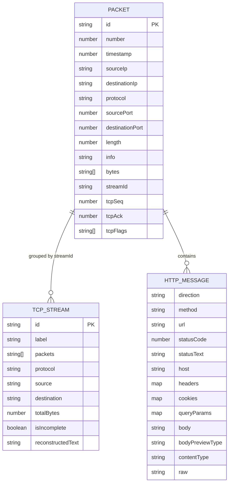

**Diagram sources**
- [types.ts:58-93](file://src/pages/packet-capture/types.ts#L58-L93)

### Backend Storage Schema (HTTP Extraction)
The backend schema supports storing HTTP requests, responses, and bodies with foreign keys to captures and packets.

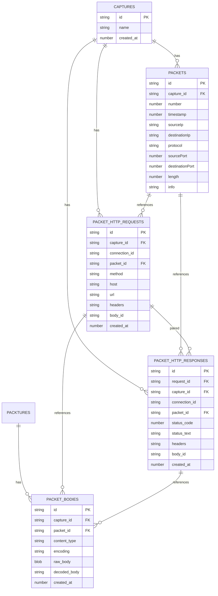

**Diagram sources**
- [schema.rs:120-164](file://src-tauri/src/db/schema.rs#L120-L164)