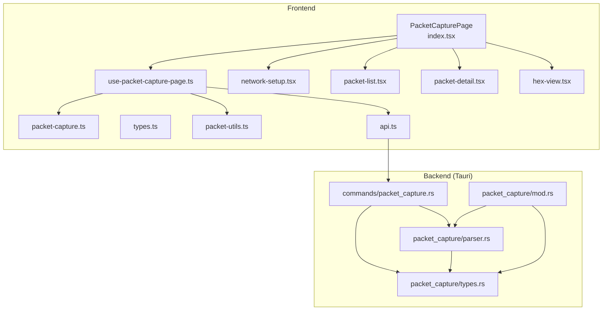
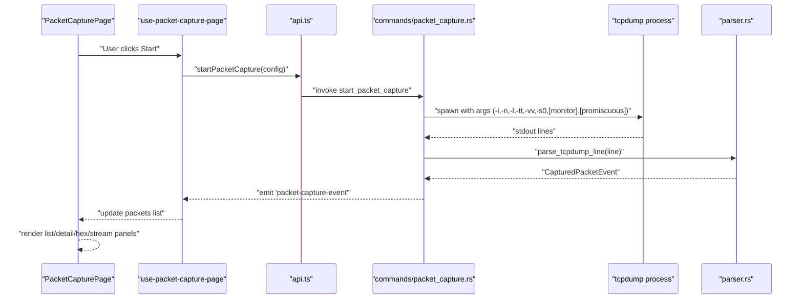
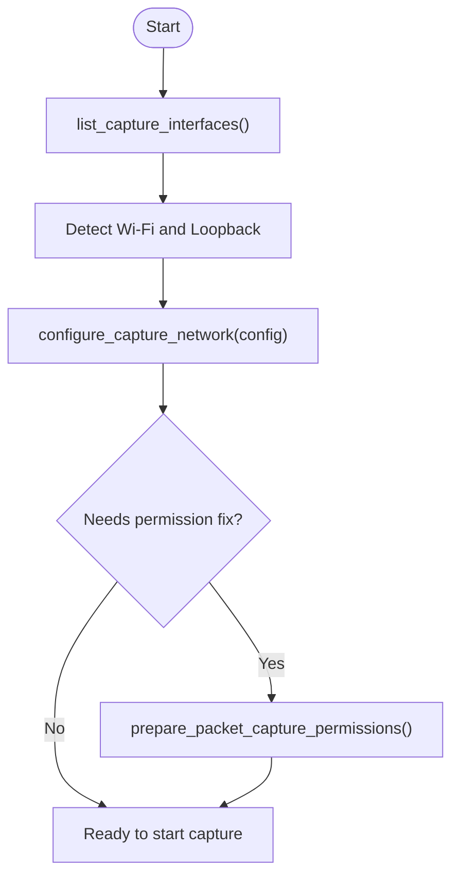
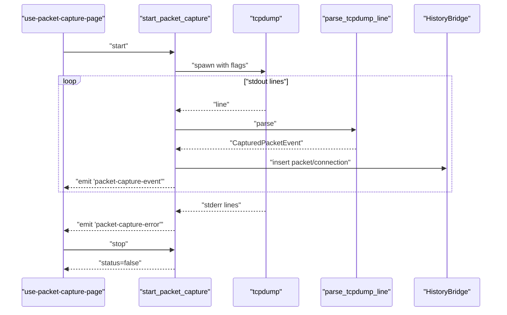
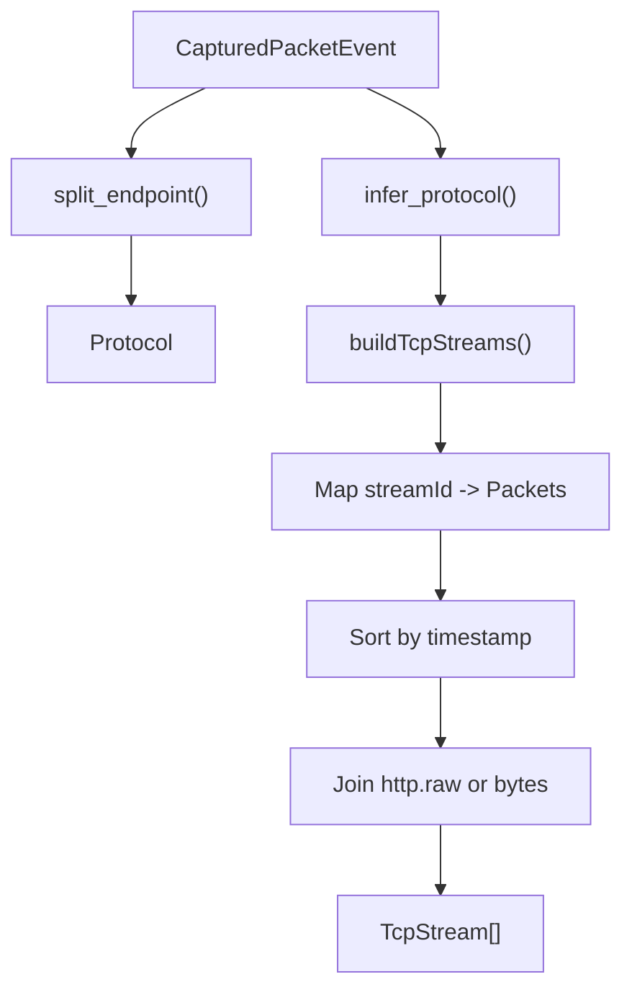
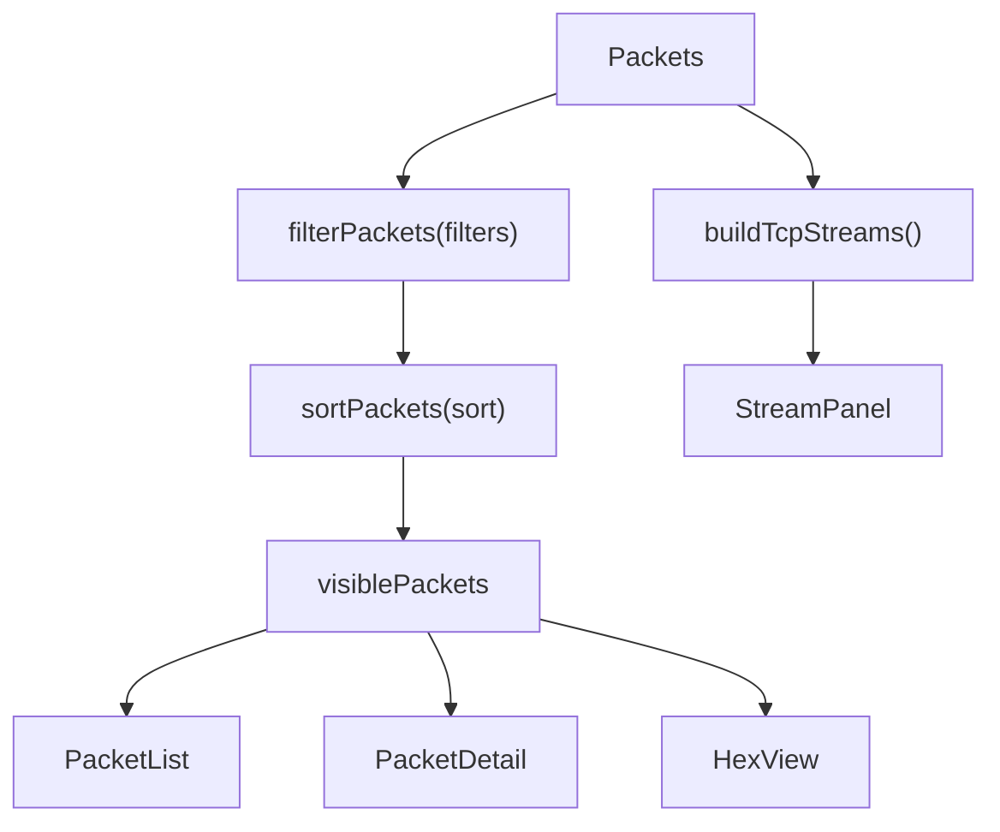
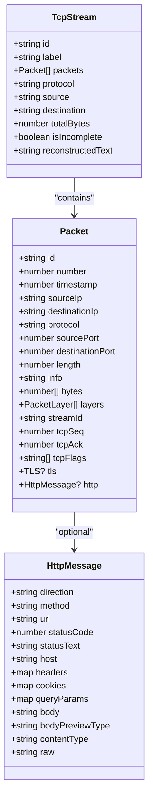
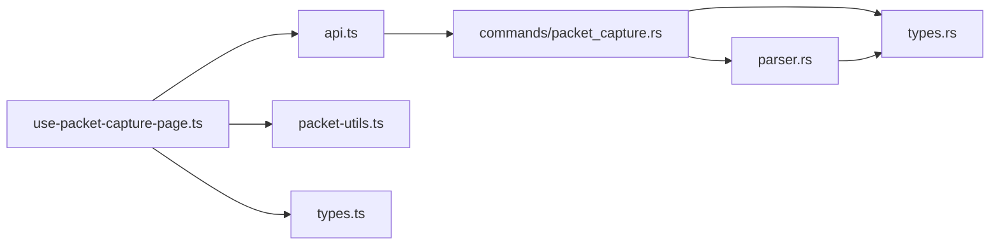

# Packet Capture

<cite>
**Referenced Files in This Document**
- [index.tsx](file://src/pages/packet-capture/index.tsx)
- [types.ts](file://src/pages/packet-capture/types.ts)
- [constants.ts](file://src/pages/packet-capture/constants.ts)
- [api.ts](file://src/pages/packet-capture/api.ts)
- [packet-utils.ts](file://src/pages/packet-capture/lib/packet-utils.ts)
- [use-packet-capture-page.ts](file://src/pages/packet-capture/hooks/use-packet-capture-page.ts)
- [network-setup.tsx](file://src/pages/packet-capture/components/network-setup.tsx)
- [packet-list.tsx](file://src/pages/packet-capture/components/packet-list.tsx)
- [packet-detail.tsx](file://src/pages/packet-capture/components/packet-detail.tsx)
- [hex-view.tsx](file://src/pages/packet-capture/components/hex-view.tsx)
- [packet-capture.ts](file://src/stores/packet-capture.ts)
- [mod.rs](file://src-tauri/src/packet_capture/mod.rs)
- [parser.rs](file://src-tauri/src/packet_capture/parser.rs)
- [types.rs](file://src-tauri/src/packet_capture/types.rs)
- [packet_capture.rs](file://src-tauri/src/commands/packet_capture.rs)
</cite>

## Table of Contents
1. [Introduction](#introduction)
2. [Project Structure](#project-structure)
3. [Core Components](#core-components)
4. [Architecture Overview](#architecture-overview)
5. [Detailed Component Analysis](#detailed-component-analysis)
6. [Dependency Analysis](#dependency-analysis)
7. [Performance Considerations](#performance-considerations)
8. [Troubleshooting Guide](#troubleshooting-guide)
9. [Conclusion](#conclusion)
10. [Appendices](#appendices)

## Introduction
This document explains AppRecon’s Packet Capture functionality end-to-end. It covers network interface management (enumeration, configuration, permissions), live packet capture via tcpdump, protocol parsing and inference, stream reconstruction, filtering and display options, and analysis tools. It also provides practical workflows, performance guidance, and troubleshooting steps for permissions and scalability.

## Project Structure
The Packet Capture feature spans frontend React components and hooks, TypeScript models, and a Tauri-backed Rust backend that orchestrates tcpdump, parses output, persists events, and emits UI updates.

**Diagram sources**
- [index.tsx:1-137](file://src/pages/packet-capture/index.tsx#L1-L137)
- [use-packet-capture-page.ts:1-539](file://src/pages/packet-capture/hooks/use-packet-capture-page.ts#L1-L539)
- [packet-capture.ts:1-33](file://src/stores/packet-capture.ts#L1-L33)
- [types.ts:1-115](file://src/pages/packet-capture/types.ts#L1-L115)
- [packet-utils.ts:1-161](file://src/pages/packet-capture/lib/packet-utils.ts#L1-L161)
- [api.ts:1-108](file://src/pages/packet-capture/api.ts#L1-L108)
- [network-setup.tsx:1-268](file://src/pages/packet-capture/components/network-setup.tsx#L1-L268)
- [packet-list.tsx:1-111](file://src/pages/packet-capture/components/packet-list.tsx#L1-L111)
- [packet-detail.tsx:1-53](file://src/pages/packet-capture/components/packet-detail.tsx#L1-L53)
- [hex-view.tsx:1-70](file://src/pages/packet-capture/components/hex-view.tsx#L1-L70)
- [packet_capture.rs:1-547](file://src-tauri/src/commands/packet_capture.rs#L1-L547)
- [parser.rs:1-164](file://src-tauri/src/packet_capture/parser.rs#L1-L164)
- [types.rs:1-114](file://src-tauri/src/packet_capture/types.rs#L1-L114)
- [mod.rs:1-6](file://src-tauri/src/packet_capture/mod.rs#L1-L6)

**Section sources**
- [index.tsx:1-137](file://src/pages/packet-capture/index.tsx#L1-L137)
- [use-packet-capture-page.ts:1-539](file://src/pages/packet-capture/hooks/use-packet-capture-page.ts#L1-L539)
- [packet_capture.rs:1-547](file://src-tauri/src/commands/packet_capture.rs#L1-L547)

## Core Components
- Frontend Page and Hooks
  - PacketCapturePage renders the UI, metrics, toolbar, filters, and panels.
  - use-packet-capture-page manages capture lifecycle, events, filters, sorting, streams, and exports.
- Backend Commands
  - Tauri commands enumerate interfaces, configure Wi-Fi, start/stop tcpdump, and emit parsed events.
- Parser
  - Parses tcpdump lines into structured events and infers protocols and lengths.
- Utilities
  - Filtering, sorting, stream building, hex/ASCII conversion, session export helpers.
- Models
  - Packet, Stream, Filters, and HTTP message types define the data model for UI and persistence.

**Section sources**
- [index.tsx:20-123](file://src/pages/packet-capture/index.tsx#L20-L123)
- [use-packet-capture-page.ts:36-378](file://src/pages/packet-capture/hooks/use-packet-capture-page.ts#L36-L378)
- [packet_capture.rs:149-284](file://src-tauri/src/commands/packet_capture.rs#L149-L284)
- [parser.rs:4-73](file://src-tauri/src/packet_capture/parser.rs#L4-L73)
- [packet-utils.ts:40-161](file://src/pages/packet-capture/lib/packet-utils.ts#L40-L161)
- [types.ts:58-115](file://src/pages/packet-capture/types.ts#L58-L115)

## Architecture Overview
The system integrates a React UI with Tauri commands that spawn tcpdump, parse its textual output, and emit structured events to the frontend. The UI maintains state for filters, sorting, selection, and displays hex/raw views and HTTP/TLS details.

**Diagram sources**
- [use-packet-capture-page.ts:144-171](file://src/pages/packet-capture/hooks/use-packet-capture-page.ts#L144-L171)
- [api.ts:81-89](file://src/pages/packet-capture/api.ts#L81-L89)
- [packet_capture.rs:149-284](file://src-tauri/src/commands/packet_capture.rs#L149-L284)
- [parser.rs:4-73](file://src-tauri/src/packet_capture/parser.rs#L4-L73)

## Detailed Component Analysis

### Network Interface Management
- Enumeration
  - list_capture_interfaces queries tcpdump -D and enriches with addresses and Wi-Fi/loopback detection.
- Configuration
  - configure_capture_network supports Wi-Fi SSID and credentials on macOS via networksetup; general interface flags include monitor/promiscuous modes.
- Permission Handling
  - prepare_packet_capture_permissions attempts to fix BPF permissions on macOS using osascript and chmod; non-macOS defers to a platform limitation message.

**Diagram sources**
- [packet_capture.rs:48-97](file://src-tauri/src/commands/packet_capture.rs#L48-L97)
- [packet_capture.rs:99-147](file://src-tauri/src/commands/packet_capture.rs#L99-L147)
- [packet_capture.rs:30-46](file://src-tauri/src/commands/packet_capture.rs#L30-L46)

**Section sources**
- [packet_capture.rs:48-97](file://src-tauri/src/commands/packet_capture.rs#L48-L97)
- [packet_capture.rs:99-147](file://src-tauri/src/commands/packet_capture.rs#L99-L147)
- [packet_capture.rs:30-46](file://src-tauri/src/commands/packet_capture.rs#L30-L46)
- [network-setup.tsx:26-243](file://src/pages/packet-capture/components/network-setup.tsx#L26-L243)

### Packet Capture Lifecycle and Event Pipeline
- Start capture
  - Validates running state, spawns tcpdump with flags, initializes capture record, and starts two threads: one for stdout parsing and one for stderr logging.
- Stop capture
  - Marks stopped, kills child process, persists finish, and emits status.
- Live events
  - Each stdout line is parsed into a CapturedPacketEvent, persisted, and emitted to the frontend.

**Diagram sources**
- [packet_capture.rs:149-284](file://src-tauri/src/commands/packet_capture.rs#L149-L284)
- [parser.rs:4-73](file://src-tauri/src/packet_capture/parser.rs#L4-L73)
- [use-packet-capture-page.ts:84-114](file://src/pages/packet-capture/hooks/use-packet-capture-page.ts#L84-L114)

**Section sources**
- [packet_capture.rs:149-284](file://src-tauri/src/commands/packet_capture.rs#L149-L284)
- [parser.rs:4-73](file://src-tauri/src/packet_capture/parser.rs#L4-L73)
- [use-packet-capture-page.ts:84-114](file://src/pages/packet-capture/hooks/use-packet-capture-page.ts#L84-L114)

### Protocol Parsing and Stream Reconstruction
- Protocol inference
  - Uses regex to extract timestamps, endpoints, and info; infers protocol from ports (DNS/TLS/HTTP), presence of ICMP/TCP flags, and keywords.
- Stream reconstruction
  - Groups packets by a deterministic stream ID derived from IPs and ports; sorts by timestamp; reconstructs combined text for HTTP/TLS or raw bytes.

**Diagram sources**
- [parser.rs:87-120](file://src-tauri/src/packet_capture/parser.rs#L87-L120)
- [parser.rs:75-85](file://src-tauri/src/packet_capture/parser.rs#L75-L85)
- [packet-utils.ts:98-130](file://src/pages/packet-capture/lib/packet-utils.ts#L98-L130)

**Section sources**
- [parser.rs:87-120](file://src-tauri/src/packet_capture/parser.rs#L87-L120)
- [parser.rs:75-85](file://src-tauri/src/packet_capture/parser.rs#L75-L85)
- [packet-utils.ts:98-130](file://src/pages/packet-capture/lib/packet-utils.ts#L98-L130)

### Packet Filtering, Sorting, and Display
- Filtering
  - Supports free-text query and protocol/source/destination IP/port, HTTP method/host/url/status/content-type.
- Sorting
  - Sorts by number, timestamp, IPs, protocol, length, or info.
- Panels
  - Packet list with clickable rows, packet detail panel with layer fields, hex view with copy/export actions, HTTP parser panel, and stream panel.

**Diagram sources**
- [packet-utils.ts:40-96](file://src/pages/packet-capture/lib/packet-utils.ts#L40-L96)
- [packet-list.tsx:38-90](file://src/pages/packet-capture/components/packet-list.tsx#L38-L90)
- [packet-detail.tsx:10-41](file://src/pages/packet-capture/components/packet-detail.tsx#L10-L41)
- [hex-view.tsx:15-69](file://src/pages/packet-capture/components/hex-view.tsx#L15-L69)
- [packet-utils.ts:98-130](file://src/pages/packet-capture/lib/packet-utils.ts#L98-L130)

**Section sources**
- [packet-utils.ts:40-96](file://src/pages/packet-capture/lib/packet-utils.ts#L40-L96)
- [packet-list.tsx:38-90](file://src/pages/packet-capture/components/packet-list.tsx#L38-L90)
- [packet-detail.tsx:10-41](file://src/pages/packet-capture/components/packet-detail.tsx#L10-L41)
- [hex-view.tsx:15-69](file://src/pages/packet-capture/components/hex-view.tsx#L15-L69)
- [packet-utils.ts:98-130](file://src/pages/packet-capture/lib/packet-utils.ts#L98-L130)

### Data Models and Types
- Packet: core event with protocol, ports, length, info, bytes, optional TLS and HTTP.
- TcpStream: reconstructed stream with directionality, protocol, bytes, and reconstructed text.
- Filters: query and protocol/IP/port/HTTP dimensions.
- HTTP message: request/response metadata, headers, cookies, body, content type, and raw text.

**Diagram sources**
- [types.ts:58-115](file://src/pages/packet-capture/types.ts#L58-L115)

**Section sources**
- [types.ts:58-115](file://src/pages/packet-capture/types.ts#L58-L115)

## Dependency Analysis
- Frontend depends on Tauri commands via invoke, listens to events, and uses local utilities for filtering/sorting/streaming.
- Backend depends on tcpdump availability and OS utilities; parses stdout and forwards errors to the UI.
- Persistence uses a history bridge to insert packet records and connection summaries.

**Diagram sources**
- [use-packet-capture-page.ts:16-24](file://src/pages/packet-capture/hooks/use-packet-capture-page.ts#L16-L24)
- [api.ts:10-108](file://src/pages/packet-capture/api.ts#L10-L108)
- [packet_capture.rs:1-10](file://src-tauri/src/commands/packet_capture.rs#L1-L10)
- [parser.rs:1-2](file://src-tauri/src/packet_capture/parser.rs#L1-L2)
- [types.rs:1-114](file://src-tauri/src/packet_capture/types.rs#L1-L114)
- [packet-utils.ts:1-2](file://src/pages/packet-capture/lib/packet-utils.ts#L1-L2)

**Section sources**
- [use-packet-capture-page.ts:16-24](file://src/pages/packet-capture/hooks/use-packet-capture-page.ts#L16-L24)
- [api.ts:10-108](file://src/pages/packet-capture/api.ts#L10-L108)
- [packet_capture.rs:1-10](file://src-tauri/src/commands/packet_capture.rs#L1-L10)
- [parser.rs:1-2](file://src-tauri/src/packet_capture/parser.rs#L1-L2)
- [types.rs:1-114](file://src-tauri/src/packet_capture/types.rs#L1-L114)
- [packet-utils.ts:1-2](file://src/pages/packet-capture/lib/packet-utils.ts#L1-L2)

## Performance Considerations
- Buffering and limits
  - The frontend keeps a bounded recent window of captured packets to avoid memory growth.
- Streaming and parsing
  - tcpdump runs with -l for line-buffered output; parser uses lightweight regex matching and atomic counters for packet numbering.
- Filtering and rendering
  - Filtering and sorting are computed on the frontend; keep filters focused to reduce render cost.
- Persistence
  - Each packet is persisted immediately; on very high-volume captures, consider paging and limiting retained sessions.
- Platform specifics
  - macOS permission overhead may impact startup; fixing BPF permissions reduces repeated failures.

[No sources needed since this section provides general guidance]

## Troubleshooting Guide
- Permission errors
  - Symptom: “don’t have permission to capture” or “/dev/bpf*” errors.
  - Resolution: Use the built-in permission fixer on macOS; for other platforms, ensure appropriate privileges.
- tcpdump not found
  - Symptom: “tcpdump was not found” during start.
  - Resolution: Install tcpdump or run on a system that includes it.
- Wi-Fi configuration
  - Symptom: Cannot connect to secured network.
  - Resolution: Provide SSID and password; macOS only supports credential configuration.
- Capture stuck or not emitting events
  - Verify interface selection and flags; check stderr emissions for errors; ensure capture is not paused or stopped.

**Section sources**
- [use-packet-capture-page.ts:380-383](file://src/pages/packet-capture/hooks/use-packet-capture-page.ts#L380-L383)
- [packet_capture.rs:159-162](file://src-tauri/src/commands/packet_capture.rs#L159-L162)
- [packet_capture.rs:115-146](file://src-tauri/src/commands/packet_capture.rs#L115-L146)
- [packet_capture.rs:254-277](file://src-tauri/src/commands/packet_capture.rs#L254-L277)

## Conclusion
AppRecon’s Packet Capture integrates a robust frontend with a Tauri-backed tcpdump pipeline. It supports interface enumeration, Wi-Fi configuration, permission handling, live parsing, filtering, and stream reconstruction. The modular design enables incremental enhancements such as PCAP export, advanced protocol parsers, and optimized persistence for large-scale scenarios.

[No sources needed since this section summarizes without analyzing specific files]

## Appendices

### Practical Workflows
- Setup and capture
  - Configure network interface and options; click Start; observe packets appear in the list; use filters and sorting to narrow focus.
- Traffic analysis
  - Inspect packet details and layers; view hex/ASCII; export raw bodies; review HTTP/TLS details; reconstruct streams.
- Sessions and persistence
  - Save session JSON for later analysis; import/export support is noted for future enhancements.

**Section sources**
- [index.tsx:36-123](file://src/pages/packet-capture/index.tsx#L36-L123)
- [use-packet-capture-page.ts:275-334](file://src/pages/packet-capture/hooks/use-packet-capture-page.ts#L275-L334)
- [packet-detail.tsx:10-41](file://src/pages/packet-capture/components/packet-detail.tsx#L10-L41)
- [hex-view.tsx:15-69](file://src/pages/packet-capture/components/hex-view.tsx#L15-L69)