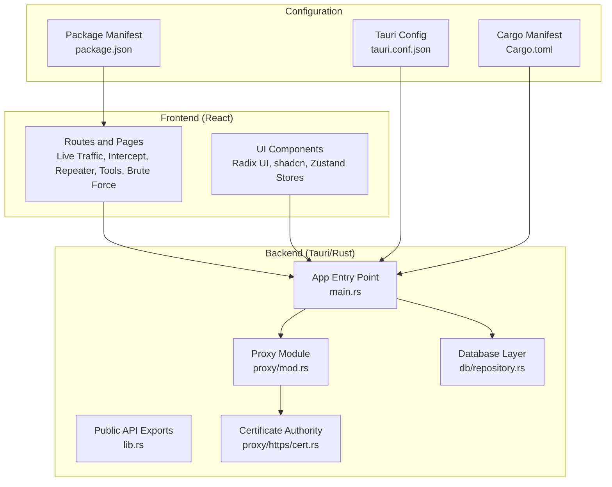
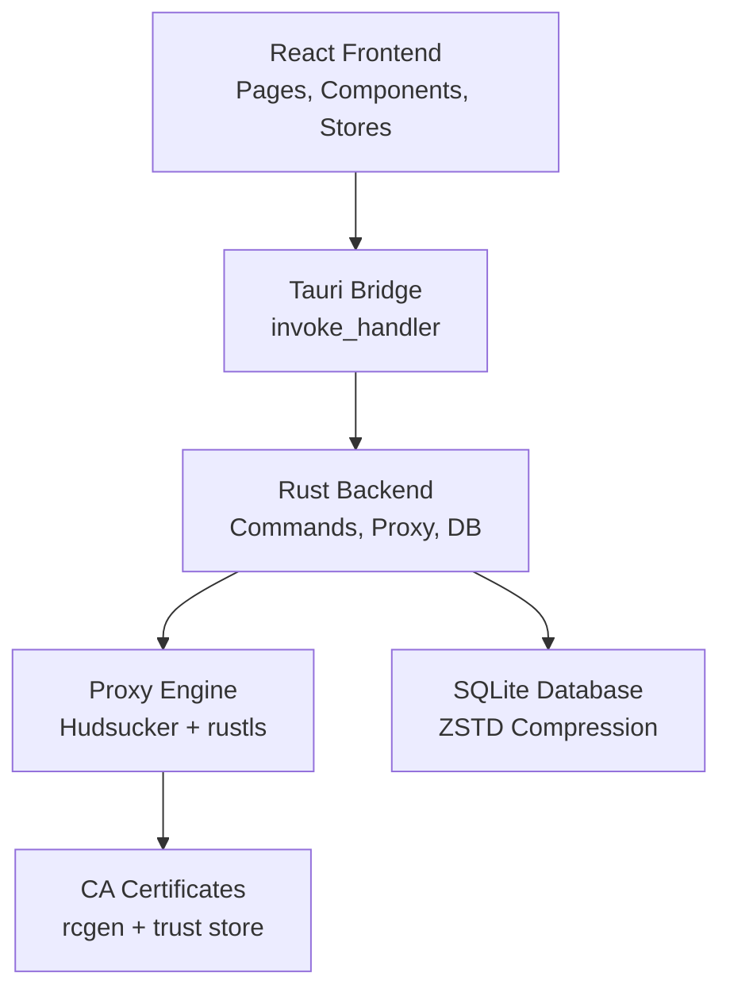
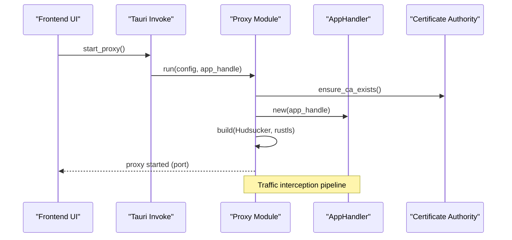
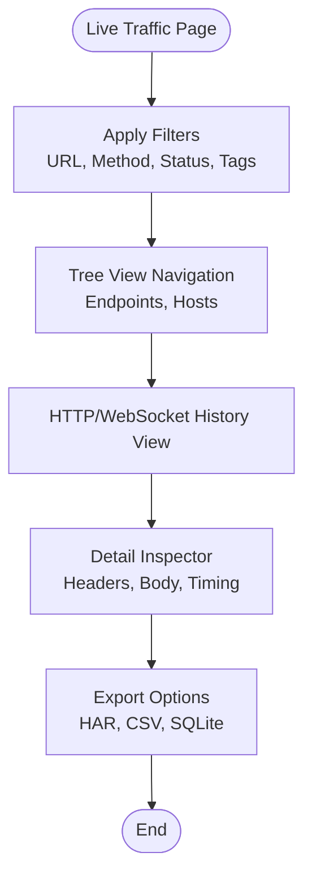
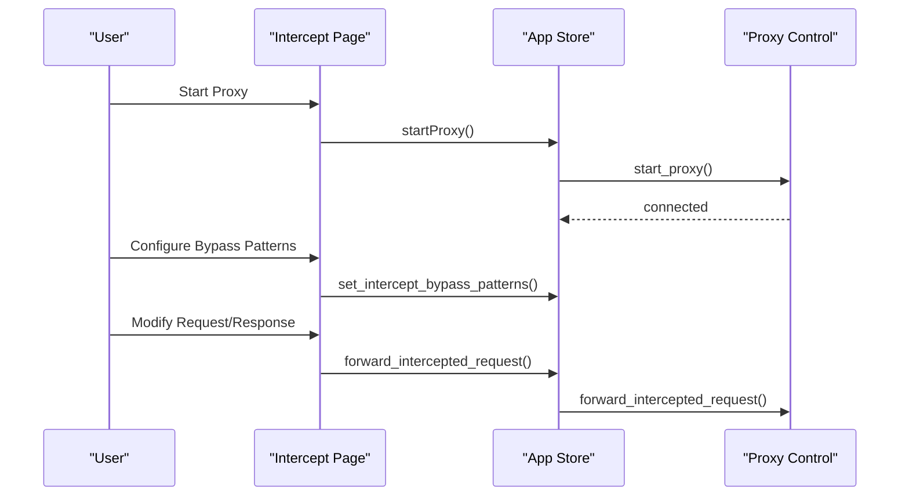
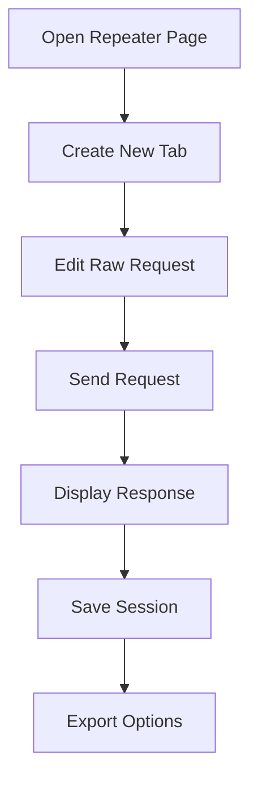
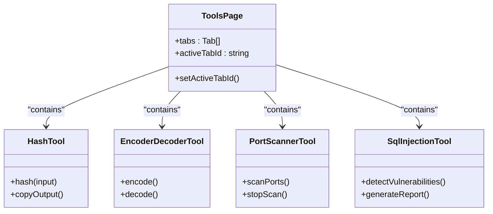
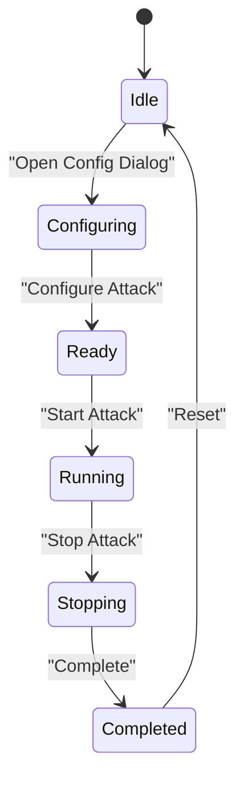
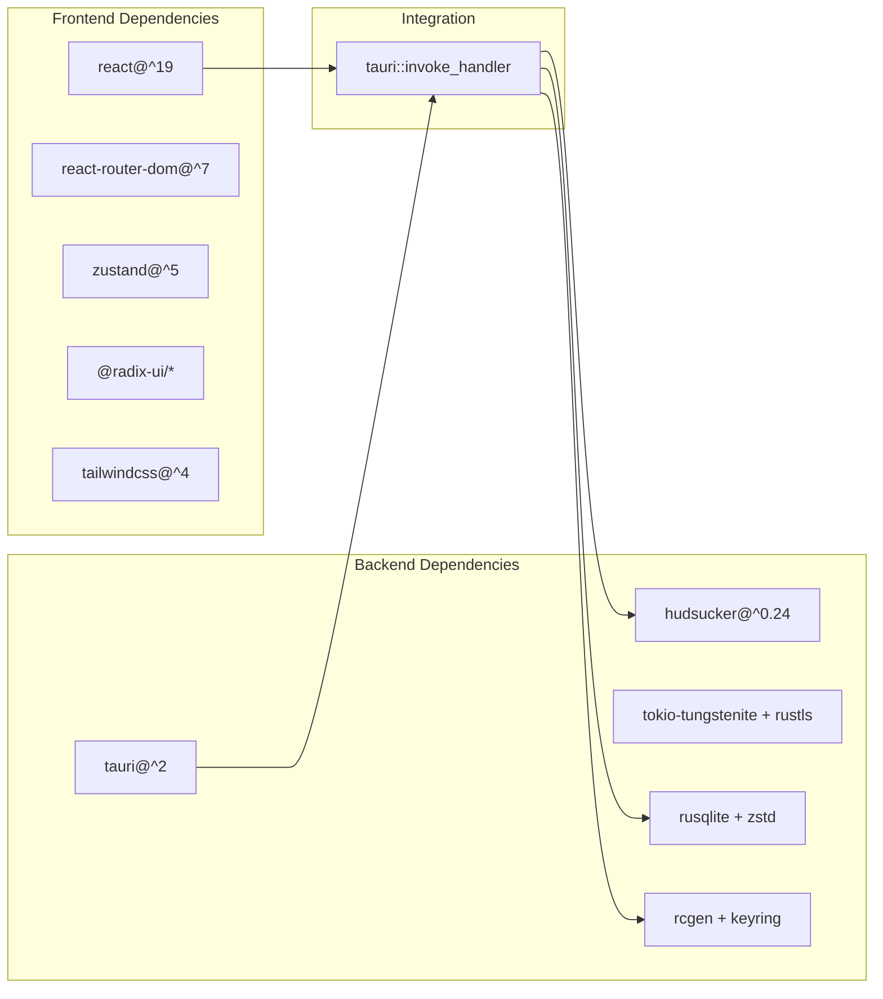

# Project Overview

<cite>
**Referenced Files in This Document**
- [README.md](file://README.md)
- [package.json](file://package.json)
- [src-tauri/Cargo.toml](file://src-tauri/Cargo.toml)
- [src-tauri/tauri.conf.json](file://src-tauri/tauri.conf.json)
- [src/app.tsx](file://src/app.tsx)
- [src-tauri/src/main.rs](file://src-tauri/src/main.rs)
- [src-tauri/src/lib.rs](file://src-tauri/src/lib.rs)
- [src-tauri/src/proxy/mod.rs](file://src-tauri/src/proxy/mod.rs)
- [src/pages/live-traffic/index.tsx](file://src/pages/live-traffic/index.tsx)
- [src/pages/intercept/index.tsx](file://src/pages/intercept/index.tsx)
- [src/pages/repeater/index.tsx](file://src/pages/repeater/index.tsx)
- [src/pages/tools/index.tsx](file://src/pages/tools/index.tsx)
- [src/pages/brute-force/index.tsx](file://src/pages/brute-force/index.tsx)
</cite>

## Table of Contents
1. [Introduction](#introduction)
2. [Project Structure](#project-structure)
3. [Core Components](#core-components)
4. [Architecture Overview](#architecture-overview)
5. [Detailed Component Analysis](#detailed-component-analysis)
6. [Dependency Analysis](#dependency-analysis)
7. [Performance Considerations](#performance-considerations)
8. [Troubleshooting Guide](#troubleshooting-guide)
9. [Conclusion](#conclusion)

## Introduction
AppRecon is a network proxy and traffic inspection tool designed for security professionals, penetration testers, and developers who need to observe, analyze, and manipulate HTTP/HTTPS traffic. Built with Tauri, React, and TypeScript, it provides a modern desktop application experience with powerful backend capabilities implemented in Rust. The tool supports traffic interception, certificate management, filtering, session management, breakpoints, JavaScript scripting, MCP server integration, and multi-format viewers for various content types.

Target audience:
- Security researchers and penetration testers
- API developers and QA engineers
- Network analysts investigating protocol behavior
- Anyone needing a robust, extensible proxy for development and testing workflows

## Project Structure
The project follows a clear separation of concerns:
- Frontend: React 19 with TypeScript, Vite, Tailwind CSS, and Radix UI primitives
- Backend: Rust/Tauri 2 for system-level operations, proxy, and database
- Database: SQLite with ZSTD compression for efficient storage
- Proxy: Custom TrafficListener with rustls TLS termination powered by Hudsucker

**Diagram sources**
- [src/app.tsx:14-32](file://src/app.tsx#L14-L32)
- [src-tauri/src/main.rs:14-147](file://src-tauri/src/main.rs#L14-L147)
- [src-tauri/src/lib.rs:12-51](file://src-tauri/src/lib.rs#L12-L51)
- [src-tauri/src/proxy/mod.rs:93-188](file://src-tauri/src/proxy/mod.rs#L93-L188)
- [src-tauri/tauri.conf.json:1-48](file://src-tauri/tauri.conf.json#L1-L48)
- [package.json:1-90](file://package.json#L1-L90)
- [src-tauri/Cargo.toml:1-62](file://src-tauri/Cargo.toml#L1-L62)

**Section sources**
- [README.md:40-61](file://README.md#L40-L61)
- [src/app.tsx:14-32](file://src/app.tsx#L14-L32)
- [src-tauri/src/main.rs:14-147](file://src-tauri/src/main.rs#L14-L147)
- [src-tauri/src/lib.rs:12-51](file://src-tauri/src/lib.rs#L12-L51)
- [src-tauri/src/proxy/mod.rs:93-188](file://src-tauri/src/proxy/mod.rs#L93-L188)
- [src-tauri/tauri.conf.json:1-48](file://src-tauri/tauri.conf.json#L1-L48)
- [package.json:1-90](file://package.json#L1-L90)
- [src-tauri/Cargo.toml:1-62](file://src-tauri/Cargo.toml#L1-L62)

## Core Components
Key features and capabilities:
- Traffic Interception: Real-time capture of HTTP/HTTPS traffic with MITM proxy support
- Certificate Management: Auto-generated CA certificates with OS trust store integration
- Traffic Filtering: Filter by URL, method, status, client, tags, and more
- Traffic Tagging: Automatic tagging rules with sync/async evaluation
- Session Management: Save, load, and export traffic sessions (HAR, CSV, SQLite)
- Breakpoints: Pause and modify requests/responses mid-flow
- JavaScript Scripting: Execute custom scripts via Boa engine
- MCP Server: LLM integration via Model Context Protocol
- Multi-format Viewers: JSON, XML, Hex, Image, Video, GraphQL, and more

Technology stack highlights:
- Frontend: React 19, TypeScript, Vite, Tailwind CSS, Radix UI
- Backend: Rust, Tauri 2
- Database: SQLite with ZSTD compression
- Proxy: Custom TrafficListener with rustls TLS termination

Practical examples:
- Network security: Intercept and analyze API calls during penetration testing
- Development workflows: Inspect HTTP traffic, modify requests/responses, and replay calls
- Traffic analysis: Filter and tag traffic patterns for debugging and monitoring

**Section sources**
- [README.md:5-22](file://README.md#L5-L22)
- [package.json:14-80](file://package.json#L14-L80)
- [src-tauri/Cargo.toml:11-55](file://src-tauri/Cargo.toml#L11-L55)

## Architecture Overview
AppRecon uses a hybrid architecture combining a React frontend with a Tauri-powered Rust backend. The frontend handles UI rendering and user interactions, while the backend manages the proxy, database, and system-level operations. Communication occurs through Tauri's invoke system, enabling secure and efficient cross-language calls.

**Diagram sources**
- [src/app.tsx:14-32](file://src/app.tsx#L14-L32)
- [src-tauri/src/main.rs:71-139](file://src-tauri/src/main.rs#L71-L139)
- [src-tauri/src/proxy/mod.rs:149-156](file://src-tauri/src/proxy/mod.rs#L149-L156)
- [src-tauri/src/lib.rs:27-50](file://src-tauri/src/lib.rs#L27-L50)

**Section sources**
- [src/app.tsx:14-32](file://src/app.tsx#L14-L32)
- [src-tauri/src/main.rs:71-139](file://src-tauri/src/main.rs#L71-L139)
- [src-tauri/src/proxy/mod.rs:149-156](file://src-tauri/src/proxy/mod.rs#L149-L156)
- [src-tauri/src/lib.rs:27-50](file://src-tauri/src/lib.rs#L27-L50)

## Detailed Component Analysis

### Proxy and Traffic Interception
The proxy subsystem is the core of AppRecon, implementing a custom TrafficListener with rustls TLS termination. It leverages Hudsucker for HTTP/HTTPS handling and integrates with the application's certificate authority for MITM capabilities.

**Diagram sources**
- [src-tauri/src/proxy/mod.rs:93-188](file://src-tauri/src/proxy/mod.rs#L93-L188)
- [src-tauri/src/main.rs:71-75](file://src-tauri/src/main.rs#L71-L75)

**Section sources**
- [src-tauri/src/proxy/mod.rs:93-188](file://src-tauri/src/proxy/mod.rs#L93-L188)
- [src-tauri/src/main.rs:71-75](file://src-tauri/src/main.rs#L71-L75)

### Live Traffic and Inspection
The live traffic page provides real-time visibility into HTTP and WebSocket traffic with filtering, tree view navigation, and detailed inspectors. It demonstrates the multi-format viewer capabilities and traffic tagging features.

**Diagram sources**
- [src/pages/live-traffic/index.tsx:13-77](file://src/pages/live-traffic/index.tsx#L13-L77)

**Section sources**
- [src/pages/live-traffic/index.tsx:13-77](file://src/pages/live-traffic/index.tsx#L13-L77)

### Intercept and Breakpoints
The intercept module enables pausing and modifying requests/responses mid-flight. It provides queue management, bypass patterns, and integration with the proxy's certificate authority.

**Diagram sources**
- [src/pages/intercept/index.tsx:15-69](file://src/pages/intercept/index.tsx#L15-L69)
- [src-tauri/src/main.rs:71-84](file://src-tauri/src/main.rs#L71-L84)

**Section sources**
- [src/pages/intercept/index.tsx:15-69](file://src/pages/intercept/index.tsx#L15-L69)
- [src-tauri/src/main.rs:71-84](file://src-tauri/src/main.rs#L71-L84)

### Repeater and Session Replay
The repeater allows sending custom requests and inspecting responses, with support for both HTTP and WebSocket protocols. It includes tabbed interface management and request/response panel organization.

**Diagram sources**
- [src/pages/repeater/index.tsx:14-75](file://src/pages/repeater/index.tsx#L14-L75)

**Section sources**
- [src/pages/repeater/index.tsx:14-75](file://src/pages/repeater/index.tsx#L14-L75)

### Tools and Utilities
The tools section aggregates various utilities including hashing, encoding/decoding, subdomain enumeration, port scanning, fuzzing, SQL injection detection, and GraphQL utilities. These demonstrate the multi-format viewer capabilities and integration with external services.

**Diagram sources**
- [src/pages/tools/index.tsx:15-49](file://src/pages/tools/index.tsx#L15-L49)

**Section sources**
- [src/pages/tools/index.tsx:15-49](file://src/pages/tools/index.tsx#L15-L49)

### Brute Force and Security Testing
The brute force module provides controlled attack simulation with safety alerts, progress tracking, and result filtering. It demonstrates advanced traffic manipulation and session management capabilities.

**Diagram sources**
- [src/pages/brute-force/index.tsx:22-150](file://src/pages/brute-force/index.tsx#L22-L150)

**Section sources**
- [src/pages/brute-force/index.tsx:22-150](file://src/pages/brute-force/index.tsx#L22-L150)

## Dependency Analysis
The project maintains clean separation between frontend and backend dependencies, with Tauri acting as the integration layer.

**Diagram sources**
- [package.json:65-79](file://package.json#L65-L79)
- [src-tauri/Cargo.toml:11-55](file://src-tauri/Cargo.toml#L11-L55)
- [src-tauri/src/main.rs:71-139](file://src-tauri/src/main.rs#L71-L139)

**Section sources**
- [package.json:65-79](file://package.json#L65-L79)
- [src-tauri/Cargo.toml:11-55](file://src-tauri/Cargo.toml#L11-L55)
- [src-tauri/src/main.rs:71-139](file://src-tauri/src/main.rs#L71-L139)

## Performance Considerations
- Database compression: ZSTD compression reduces storage footprint for large traffic sessions
- Asynchronous processing: Tokio runtime enables concurrent request handling
- Efficient serialization: serde-based communication between frontend and backend
- Memory management: Rust ownership model prevents memory leaks in long-running proxy sessions
- TLS termination: rustls provider offers hardware-accelerated cryptographic operations

## Troubleshooting Guide
Common issues and solutions:
- Proxy port conflicts: Use ensure_port_free to resolve conflicts before starting the proxy
- Certificate trust issues: Verify OS trust store integration and certificate installation
- Permission errors: Run packet capture with appropriate system permissions
- Memory usage: Monitor SQLite database growth and implement regular cleanup policies
- Update failures: Check updater plugin configuration and network connectivity

**Section sources**
- [src-tauri/src/proxy/mod.rs:51-56](file://src-tauri/src/proxy/mod.rs#L51-L56)
- [src-tauri/src/main.rs:149-183](file://src-tauri/src/main.rs#L149-L183)

## Conclusion
AppRecon delivers a comprehensive solution for network traffic inspection and manipulation, combining a modern React frontend with a high-performance Rust backend. Its architecture emphasizes security, extensibility, and developer productivity, making it suitable for both security research and development workflows. The integration of advanced features like JavaScript scripting, MCP server support, and multi-format viewers positions it as a versatile tool for contemporary network analysis needs.