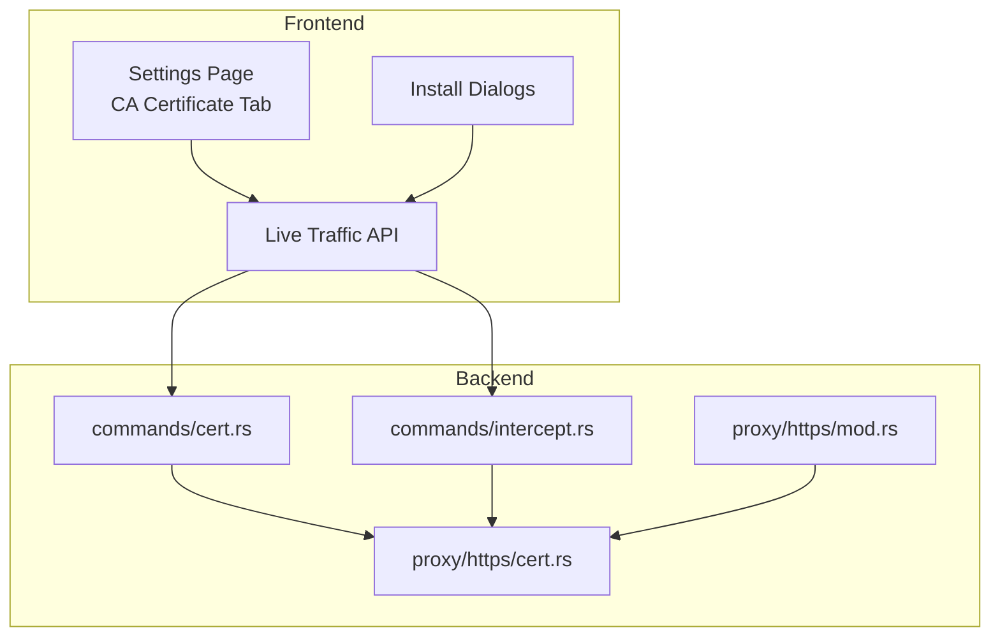
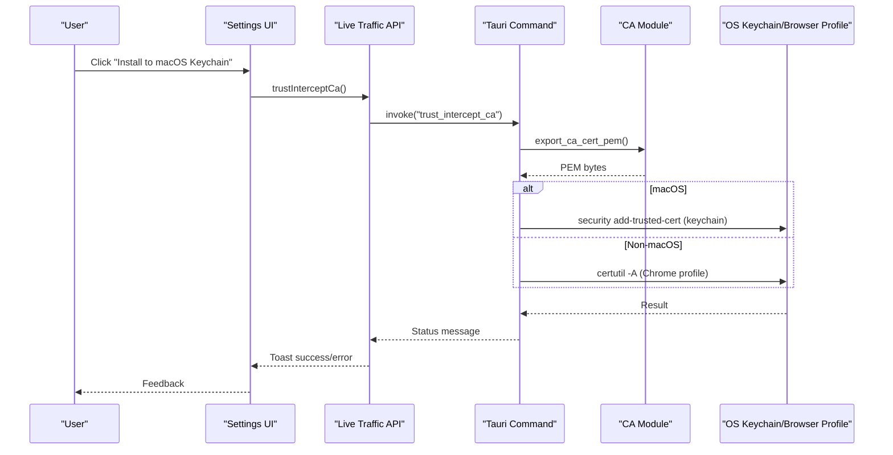
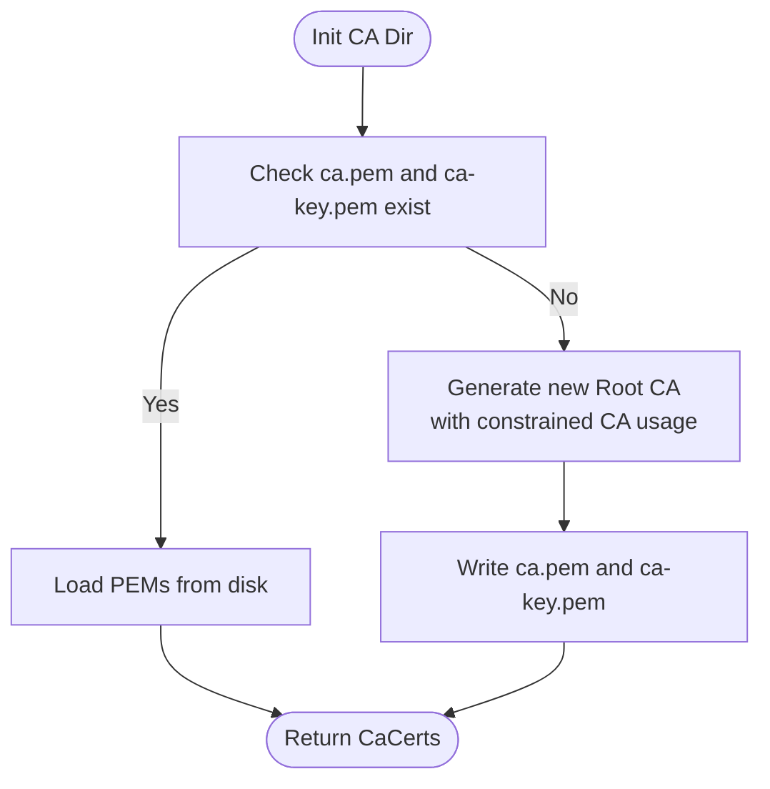
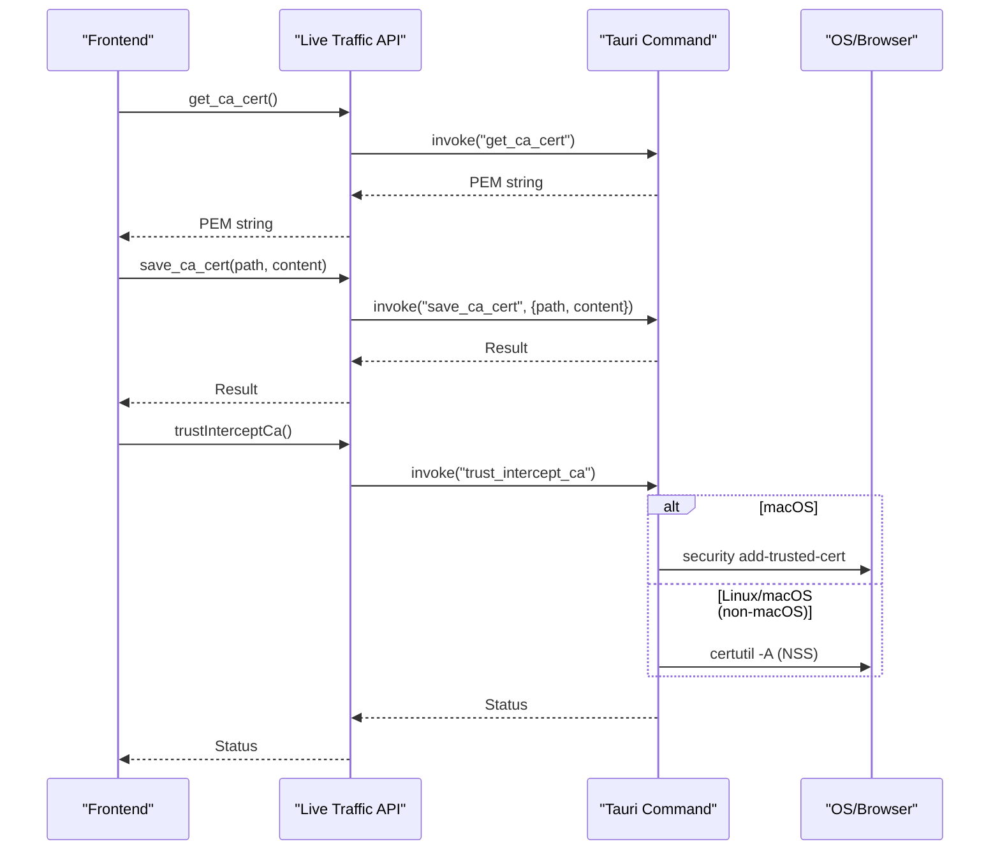
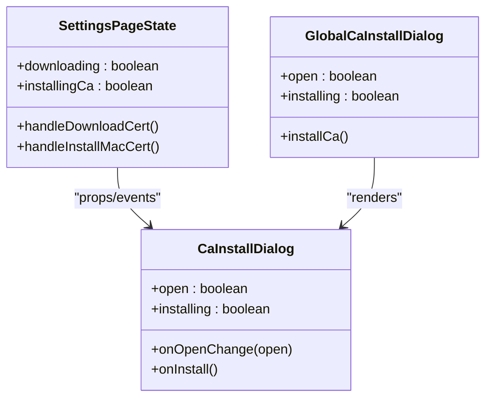
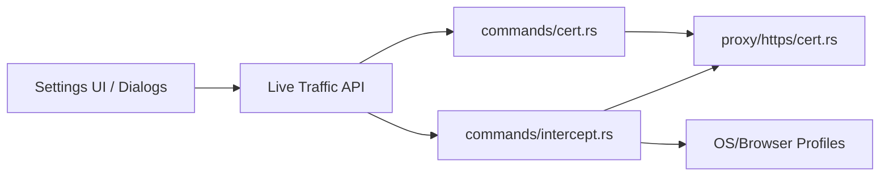

# Certificate Management

<cite>
**Referenced Files in This Document**
- [cert.rs](file://src-tauri/src/proxy/https/cert.rs)
- [mod.rs](file://src-tauri/src/proxy/https/mod.rs)
- [intercept.rs](file://src-tauri/src/commands/intercept.rs)
- [cert.rs](file://src-tauri/src/commands/cert.rs)
- [api.ts](file://src/pages/live-traffic/api.ts)
- [ca-certificate-settings-tab.tsx](file://src/pages/settings/components/ca-certificate-settings-tab.tsx)
- [constants.ts](file://src/pages/settings/constants.ts)
- [ca-install-dialog.tsx](file://src/components/ca-install-dialog.tsx)
- [global-ca-install-dialog.tsx](file://src/components/global-ca-install-dialog.tsx)
- [use-settings-page.ts](file://src/pages/settings/hooks/use-settings-page.ts)
</cite>

## Table of Contents
1. [Introduction](#introduction)
2. [Project Structure](#project-structure)
3. [Core Components](#core-components)
4. [Architecture Overview](#architecture-overview)
5. [Detailed Component Analysis](#detailed-component-analysis)
6. [Dependency Analysis](#dependency-analysis)
7. [Performance Considerations](#performance-considerations)
8. [Troubleshooting Guide](#troubleshooting-guide)
9. [Conclusion](#conclusion)
10. [Appendices](#appendices)

## Introduction
This document describes AppRecon’s Certificate Management system. It covers how the Root Certificate Authority (CA) is generated and stored, how the CA certificate is installed across operating systems, how HTTPS interception works, and how to configure browsers for MITM functionality. It also documents the certificate command interface, security considerations, lifecycle management, and integration with existing PKI environments.

## Project Structure
The certificate management system spans Rust backend modules for CA generation and trust operations, Tauri commands for frontend-backend communication, and React UI components for user-driven installation and guidance.

**Diagram sources**
- [mod.rs:1-1](file://src-tauri/src/proxy/https/mod.rs#L1-L1)
- [cert.rs:1-91](file://src-tauri/src/proxy/https/cert.rs#L1-L91)
- [cert.rs:1-13](file://src-tauri/src/commands/cert.rs#L1-L13)
- [intercept.rs:284-433](file://src-tauri/src/commands/intercept.rs#L284-L433)
- [api.ts:145-155](file://src/pages/live-traffic/api.ts#L145-L155)
- [ca-certificate-settings-tab.tsx:1-147](file://src/pages/settings/components/ca-certificate-settings-tab.tsx#L1-L147)

**Section sources**
- [mod.rs:1-1](file://src-tauri/src/proxy/https/mod.rs#L1-L1)
- [cert.rs:1-91](file://src-tauri/src/proxy/https/cert.rs#L1-L91)
- [cert.rs:1-13](file://src-tauri/src/commands/cert.rs#L1-L13)
- [intercept.rs:284-433](file://src-tauri/src/commands/intercept.rs#L284-L433)
- [api.ts:145-155](file://src/pages/live-traffic/api.ts#L145-L155)
- [ca-certificate-settings-tab.tsx:1-147](file://src/pages/settings/components/ca-certificate-settings-tab.tsx#L1-L147)

## Core Components
- CA Generation and Storage (Rust):
  - Generates a self-signed Root CA with constrained CA usage and appropriate key usages.
  - Stores the CA certificate and private key in a persistent directory under the application data folder.
- Certificate Commands (Tauri):
  - Exposes commands to fetch the CA certificate content and to save it to disk.
  - Provides a command to trust the CA in the OS keychain or browser-managed profile.
- Frontend Integration:
  - Settings UI provides “Install to macOS Keychain” and “Save CA Certificate” actions.
  - Live Traffic API wraps Tauri commands for use in React components.
  - Install dialogs guide users and trigger trust/installation flows.

**Section sources**
- [cert.rs:11-91](file://src-tauri/src/proxy/https/cert.rs#L11-L91)
- [cert.rs:1-13](file://src-tauri/src/commands/cert.rs#L1-L13)
- [intercept.rs:284-433](file://src-tauri/src/commands/intercept.rs#L284-L433)
- [api.ts:145-155](file://src/pages/live-traffic/api.ts#L145-L155)
- [ca-certificate-settings-tab.tsx:38-65](file://src/pages/settings/components/ca-certificate-settings-tab.tsx#L38-L65)

## Architecture Overview
The certificate management architecture consists of:
- Backend CA module that initializes storage, loads or generates the Root CA, and exposes PEM content.
- Tauri commands that bridge the frontend to OS-level trust operations and file system writes.
- Frontend UI that surfaces installation instructions, triggers trust/install flows, and persists user preferences.

**Diagram sources**
- [intercept.rs:284-433](file://src-tauri/src/commands/intercept.rs#L284-L433)
- [cert.rs:1-91](file://src-tauri/src/proxy/https/cert.rs#L1-L91)
- [api.ts:153-155](file://src/pages/live-traffic/api.ts#L153-L155)

## Detailed Component Analysis

### CA Generation and Storage (Rust)
- Initialization:
  - Initializes a persistent directory for the CA store.
- Load or Generate:
  - If both certificate and key files exist, loads them.
  - Otherwise, generates a new Root CA with constrained CA usage and signing key usages, then writes both files.
- Export:
  - Exposes a method to return the CA certificate PEM for consumption by commands.

**Diagram sources**
- [cert.rs:11-91](file://src-tauri/src/proxy/https/cert.rs#L11-L91)

**Section sources**
- [cert.rs:11-91](file://src-tauri/src/proxy/https/cert.rs#L11-L91)

### Certificate Command Interface (Tauri)
- get_ca_cert:
  - Returns the CA certificate content as a string via the exported PEM bytes.
- save_ca_cert:
  - Writes a given PEM content to a user-selected path.
- trust_intercept_ca:
  - On macOS: installs the CA into the user login keychain with SSL trust.
  - On non-macOS: imports the CA into a managed Chromium profile using NSS certutil.

**Diagram sources**
- [cert.rs:1-13](file://src-tauri/src/commands/cert.rs#L1-L13)
- [intercept.rs:284-433](file://src-tauri/src/commands/intercept.rs#L284-L433)
- [api.ts:145-155](file://src/pages/live-traffic/api.ts#L145-L155)

**Section sources**
- [cert.rs:1-13](file://src-tauri/src/commands/cert.rs#L1-L13)
- [intercept.rs:284-433](file://src-tauri/src/commands/intercept.rs#L284-L433)
- [api.ts:145-155](file://src/pages/live-traffic/api.ts#L145-L155)

### Frontend Integration and User Experience
- Settings UI:
  - Provides “Install to macOS Keychain” and “Save CA Certificate” buttons.
  - Includes installation guides and troubleshooting tips.
- Global Install Dialog:
  - Prompts new users to install the CA certificate and records user preference.
- Live Traffic API:
  - Wraps Tauri commands for use in React components and handles errors.

**Diagram sources**
- [use-settings-page.ts:38-288](file://src/pages/settings/hooks/use-settings-page.ts#L38-L288)
- [ca-install-dialog.tsx:16-72](file://src/components/ca-install-dialog.tsx#L16-L72)
- [global-ca-install-dialog.tsx:11-51](file://src/components/global-ca-install-dialog.tsx#L11-L51)

**Section sources**
- [ca-certificate-settings-tab.tsx:1-147](file://src/pages/settings/components/ca-certificate-settings-tab.tsx#L1-L147)
- [constants.ts:3-178](file://src/pages/settings/constants.ts#L3-L178)
- [ca-install-dialog.tsx:1-73](file://src/components/ca-install-dialog.tsx#L1-L73)
- [global-ca-install-dialog.tsx:1-51](file://src/components/global-ca-install-dialog.tsx#L1-L51)
- [use-settings-page.ts:98-139](file://src/pages/settings/hooks/use-settings-page.ts#L98-L139)
- [api.ts:145-155](file://src/pages/live-traffic/api.ts#L145-L155)

## Dependency Analysis
- Internal dependencies:
  - The commands module depends on the CA module for exporting PEM content.
  - The settings UI and dialogs depend on the Live Traffic API to invoke Tauri commands.
- External dependencies:
  - macOS: security CLI for keychain trust.
  - Non-macOS: NSS certutil for importing into Chromium profiles.
- Frontend-backend boundary:
  - Live Traffic API validates the Tauri environment and wraps invoke calls with robust error handling.

**Diagram sources**
- [api.ts:35-45](file://src/pages/live-traffic/api.ts#L35-L45)
- [cert.rs:1-13](file://src-tauri/src/commands/cert.rs#L1-L13)
- [intercept.rs:284-433](file://src-tauri/src/commands/intercept.rs#L284-L433)
- [cert.rs:1-91](file://src-tauri/src/proxy/https/cert.rs#L1-L91)

**Section sources**
- [api.ts:35-45](file://src/pages/live-traffic/api.ts#L35-L45)
- [intercept.rs:284-433](file://src-tauri/src/commands/intercept.rs#L284-L433)
- [cert.rs:1-13](file://src-tauri/src/commands/cert.rs#L1-L13)

## Performance Considerations
- CA generation cost:
  - Generation occurs once and is cached; subsequent runs load from disk.
- Command latency:
  - Trust operations depend on OS tools; ensure NSS tools are installed on non-macOS to avoid repeated failures.
- File I/O:
  - Writing the CA to a temporary or managed profile is lightweight; avoid frequent writes.

[No sources needed since this section provides general guidance]

## Troubleshooting Guide
Common issues and resolutions:
- Browser shows “Certificate Not Trusted”:
  - Confirm the CA is imported and marked as trusted.
  - Restart the browser after installation.
  - On iOS, enable full trust in Certificate Trust Settings.
- Some apps do not work with interception:
  - Some applications use certificate pinning; bypassing requires advanced techniques or root access.
- Removing the CA:
  - Windows: Internet Options → Content → Certificates → Authorities → Remove.
  - macOS: Keychain Access → System → Certificates → Delete.
  - Firefox: Options → Privacy → Certificates → View Certificates → Authorities → Delete.
  - iOS: Settings → General → Profiles → Delete.
  - Android: Settings → Security → Advanced → Encryption → Trusted certificates → Remove.

**Section sources**
- [constants.ts:112-139](file://src/pages/settings/constants.ts#L112-L139)

## Conclusion
AppRecon’s certificate management system generates a local Root CA, securely stores it, and integrates with OS and browser trust stores to enable HTTPS interception. The frontend provides guided installation and troubleshooting, while the backend exposes robust Tauri commands for trust and persistence. Following the best practices outlined here ensures reliable MITM functionality with minimal friction.

[No sources needed since this section summarizes without analyzing specific files]

## Appendices

### Step-by-Step Installation Guides
- Chrome / Edge (Windows):
  - Save the CA certificate, open Chrome Settings → Privacy and security → Manage certificates → Authorities → Import → Trust for identification of websites → OK → Restart browser.
- Chrome / Edge (macOS):
  - Save the CA certificate, open Chrome Settings → Privacy and security → Security → Manage certificates → Import → Trust for SSL/TLS websites → OK → Restart browser.
- Firefox (All platforms):
  - Save the CA certificate, open Firefox Options → Privacy & Security → View Certificates → Authorities → Import → Trust this CA to identify websites → OK → Restart Firefox.
- Safari (macOS):
  - Save the CA certificate, open Safari Preferences → Privacy → Manage Websites → Certificates → Import → Set trust to Always Trust → Authenticate with Touch ID if prompted → Restart Safari.
- iOS (iPhone / iPad):
  - Save the CA certificate, go to Settings → General → VPN & Device Management → Tap downloaded profile → Go to Settings → General → About → Certificate Trust Settings → Enable full trust for the CA.
- Android:
  - Save the CA certificate, go to Settings → Security → Advanced → Encryption & credentials → Install a certificate → CA certificate → Select the saved file → Name and confirm → Some devices may require PIN or password.

**Section sources**
- [constants.ts:3-87](file://src/pages/settings/constants.ts#L3-L87)

### Browser Configuration for MITM
- Proxy settings:
  - Launch the managed Chromium profile with a proxy server pointing to the local proxy address and port.
- Certificate acceptance:
  - Ensure the CA is trusted in the browser-managed profile before visiting HTTPS sites.

**Section sources**
- [intercept.rs:284-320](file://src-tauri/src/commands/intercept.rs#L284-L320)

### Certificate Validation Workflow
- Validation:
  - The browser validates the dynamic certificate against the trusted Root CA.
- Expiration handling:
  - The current implementation does not expose explicit expiration handling; dynamic certificates are generated per domain and rely on the persistent Root CA.
- Renewal processes:
  - Renewal of the Root CA is manual; users can remove and reinstall the CA via the settings UI.

**Section sources**
- [constants.ts:112-139](file://src/pages/settings/constants.ts#L112-L139)
- [intercept.rs:322-364](file://src-tauri/src/commands/intercept.rs#L322-L364)

### Security Considerations and Best Practices
- Storage:
  - Keep the Root CA private key secure; it is written to disk alongside the certificate.
- Least privilege:
  - Limit trust to only the AppRecon CA; remove it when not in use.
- Lifecycle:
  - Rotate the Root CA periodically and re-install in all browsers and profiles.
- Revocation:
  - There is no built-in revocation mechanism; removal of the CA from trust stores effectively disables interception.

**Section sources**
- [cert.rs:72-91](file://src-tauri/src/proxy/https/cert.rs#L72-L91)
- [intercept.rs:322-364](file://src-tauri/src/commands/intercept.rs#L322-L364)

### Custom CAs and Existing PKI Integration
- Custom Root CA:
  - The system generates a local Root CA; integrating a corporate CA is not implemented in the current code.
- Existing PKI:
  - For enterprise environments, import the corporate Root CA into the OS keychain or browser-managed profile and configure the proxy accordingly.

**Section sources**
- [cert.rs:74-82](file://src-tauri/src/proxy/https/cert.rs#L74-L82)
- [intercept.rs:366-420](file://src-tauri/src/commands/intercept.rs#L366-L420)