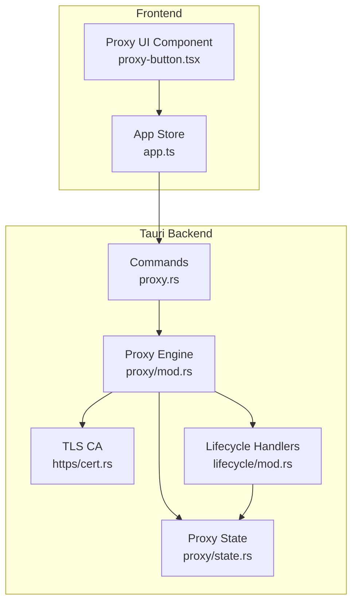
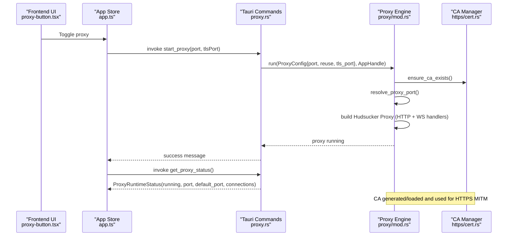
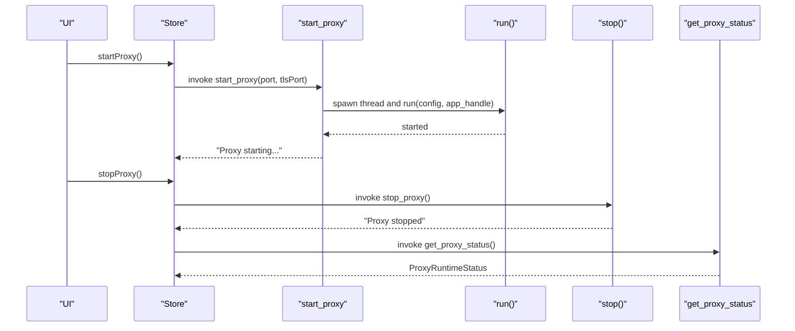
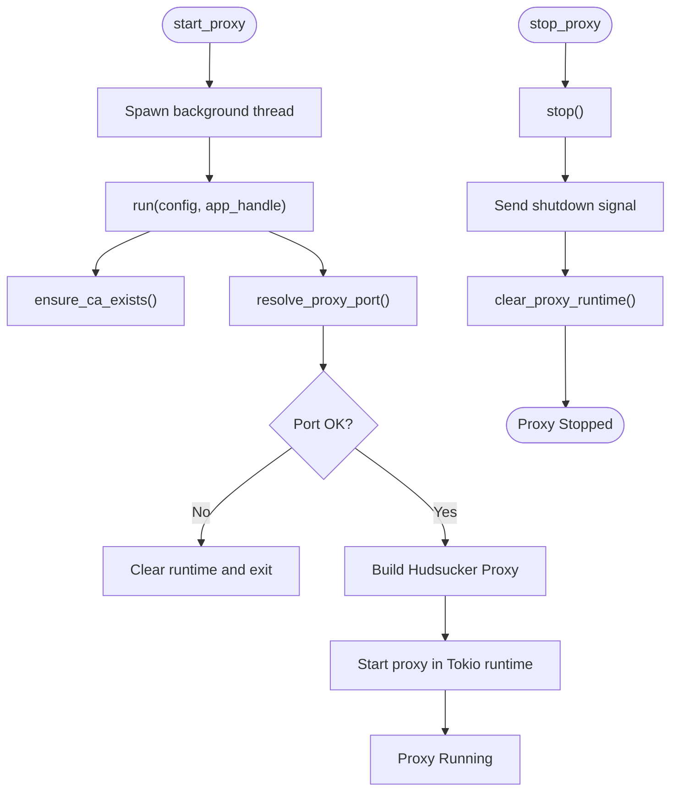
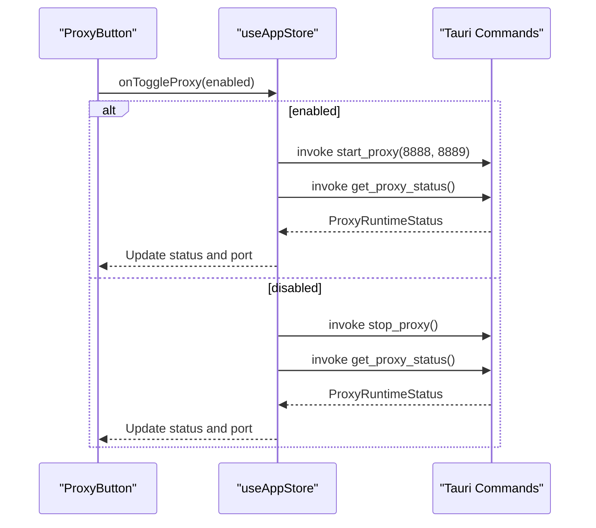
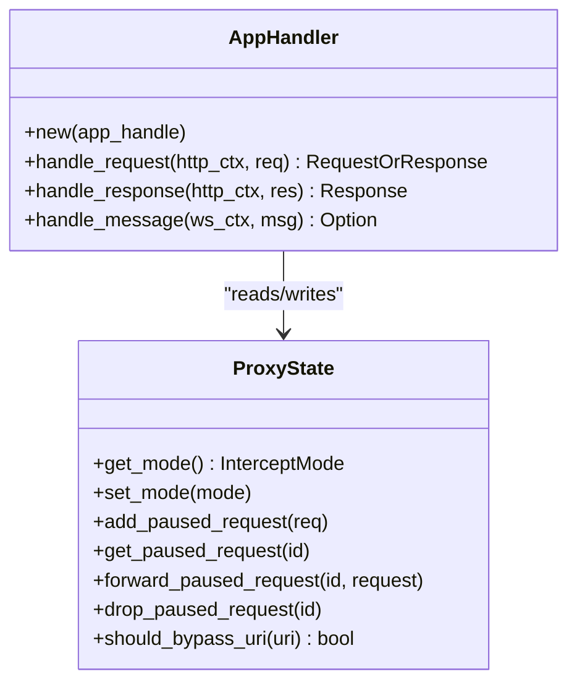
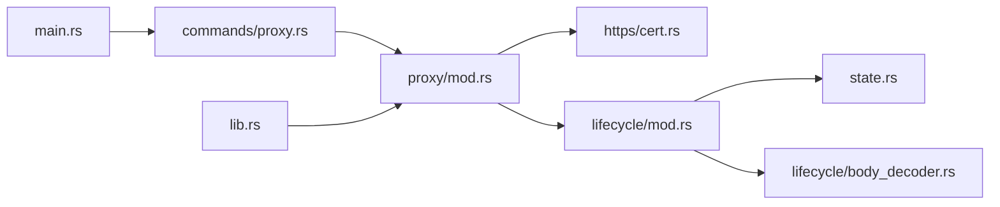

# MITM Proxy Control

<cite>
**Referenced Files in This Document**
- [proxy.rs](file://src-tauri/src/commands/proxy.rs)
- [mod.rs](file://src-tauri/src/proxy/mod.rs)
- [state.rs](file://src-tauri/src/proxy/state.rs)
- [lifecycle/mod.rs](file://src-tauri/src/proxy/lifecycle/mod.rs)
- [cert.rs](file://src-tauri/src/proxy/https/cert.rs)
- [hooks.rs](file://src-tauri/src/proxy/intercept/hooks.rs)
- [main.rs](file://src-tauri/src/main.rs)
- [lib.rs](file://src-tauri/src/lib.rs)
- [app.ts](file://src/stores/app.ts)
- [proxy-button.tsx](file://src/components/layout/proxy-button.tsx)
</cite>

## Table of Contents
1. [Introduction](#introduction)
2. [Project Structure](#project-structure)
3. [Core Components](#core-components)
4. [Architecture Overview](#architecture-overview)
5. [Detailed Component Analysis](#detailed-component-analysis)
6. [Dependency Analysis](#dependency-analysis)
7. [Performance Considerations](#performance-considerations)
8. [Troubleshooting Guide](#troubleshooting-guide)
9. [Conclusion](#conclusion)

## Introduction
This document explains AppRecon’s MITM Proxy Control system. It covers how the proxy starts and stops, the runtime status model, configuration parameters, lifecycle management, frontend synchronization, error handling, and integration between Tauri commands and the underlying proxy engine. Practical examples and troubleshooting guidance are included to help operators configure and monitor the proxy effectively.

## Project Structure
The proxy control spans Rust backend (Tauri commands and proxy engine) and TypeScript frontend (UI and state). Key areas:
- Backend commands expose start, stop, and status queries to the frontend.
- The proxy engine initializes TLS certificates, builds a Hudsucker proxy, and manages graceful shutdown.
- Frontend stores and UI components synchronize proxy state and trigger operations.

**Diagram sources**
- [proxy-button.tsx:1-74](file://src/components/layout/proxy-button.tsx#L1-L74)
- [app.ts:1-109](file://src/stores/app.ts#L1-L109)
- [proxy.rs:1-74](file://src-tauri/src/commands/proxy.rs#L1-L74)
- [mod.rs:1-188](file://src-tauri/src/proxy/mod.rs#L1-L188)
- [cert.rs:1-144](file://src-tauri/src/proxy/https/cert.rs#L1-L144)
- [state.rs:1-441](file://src-tauri/src/proxy/state.rs#L1-L441)
- [lifecycle/mod.rs:1-453](file://src-tauri/src/proxy/lifecycle/mod.rs#L1-L453)

**Section sources**
- [proxy.rs:1-74](file://src-tauri/src/commands/proxy.rs#L1-L74)
- [mod.rs:1-188](file://src-tauri/src/proxy/mod.rs#L1-L188)
- [cert.rs:1-144](file://src-tauri/src/proxy/https/cert.rs#L1-L144)
- [state.rs:1-441](file://src-tauri/src/proxy/state.rs#L1-L441)
- [lifecycle/mod.rs:1-453](file://src-tauri/src/proxy/lifecycle/mod.rs#L1-L453)
- [app.ts:1-109](file://src/stores/app.ts#L1-L109)
- [proxy-button.tsx:1-74](file://src/components/layout/proxy-button.tsx#L1-L74)

## Core Components
- Tauri Commands: Expose start_proxy, stop_proxy, and get_proxy_status to the frontend.
- Proxy Runtime Status: Encapsulates running state, active port, default port, and connection count.
- Proxy Config: Holds HTTP port, reuse setting, and HTTPS MITM port.
- Proxy Engine: Initializes CA, resolves ports, constructs Hudsucker proxy, and handles graceful shutdown.
- TLS Authority: Manages CA generation and conversion to Hudsucker authority.
- Lifecycle Handlers: Intercepts HTTP and WebSocket traffic, decodes bodies, and emits events.
- Frontend Store/UI: Drives proxy lifecycle, reflects status, and displays active port.

**Section sources**
- [proxy.rs:7-74](file://src-tauri/src/commands/proxy.rs#L7-L74)
- [mod.rs:26-91](file://src-tauri/src/proxy/mod.rs#L26-L91)
- [cert.rs:106-144](file://src-tauri/src/proxy/https/cert.rs#L106-L144)
- [lifecycle/mod.rs:88-360](file://src-tauri/src/proxy/lifecycle/mod.rs#L88-L360)
- [app.ts:7-24](file://src/stores/app.ts#L7-L24)

## Architecture Overview
The system integrates Tauri commands with a Rust-based proxy engine built on Hudsucker. The engine manages TLS via a local CA, intercepts HTTP and WebSocket traffic, and persists or emits transaction data. The frontend synchronizes UI state with backend status and controls lifecycle via Tauri invocations.

**Diagram sources**
- [proxy-button.tsx:24-46](file://src/components/layout/proxy-button.tsx#L24-L46)
- [app.ts:38-96](file://src/stores/app.ts#L38-L96)
- [proxy.rs:15-73](file://src-tauri/src/commands/proxy.rs#L15-L73)
- [mod.rs:93-187](file://src-tauri/src/proxy/mod.rs#L93-L187)
- [cert.rs:131-143](file://src-tauri/src/proxy/https/cert.rs#L131-L143)

## Detailed Component Analysis

### Tauri Commands: start_proxy, stop_proxy, get_proxy_status
- start_proxy:
  - Accepts HTTP port and HTTPS MITM port.
  - Spawns a background thread to run the proxy engine with a configured ProxyConfig.
  - Returns a message indicating the proxy is starting.
- stop_proxy:
  - Requests graceful shutdown by signaling the proxy engine.
  - Returns a message confirming the proxy stopped.
- get_proxy_status:
  - Determines if the proxy is running by probing the active port.
  - Returns ProxyRuntimeStatus with running flag, active port, default port, and connection count placeholder.

**Diagram sources**
- [proxy.rs:15-73](file://src-tauri/src/commands/proxy.rs#L15-L73)
- [mod.rs:93-187](file://src-tauri/src/proxy/mod.rs#L93-L187)

**Section sources**
- [proxy.rs:15-73](file://src-tauri/src/commands/proxy.rs#L15-L73)

### ProxyRuntimeStatus
- Fields:
  - running: Boolean indicating if the proxy is reachable on the active port.
  - port: Optional active port if running; otherwise None.
  - default_port: Default port used when no active port is set.
  - connections: Placeholder for connection count (currently unused).
- Purpose: Provides a concise snapshot of proxy health and identity for the frontend.

**Section sources**
- [proxy.rs:7-13](file://src-tauri/src/commands/proxy.rs#L7-L13)
- [proxy.rs:61-72](file://src-tauri/src/commands/proxy.rs#L61-L72)

### Proxy Configuration Parameters
- ProxyConfig:
  - port: HTTP proxy port.
  - reuse: Port reuse policy passed to port resolution.
  - tls_port: HTTPS MITM port used for TLS interception.
- Defaults:
  - Default ProxyConfig sets HTTP port to 8888 and HTTPS MITM port to 8889.
- Resolution:
  - resolve_proxy_port updates the default port and ensures the chosen port is free (respecting reuse).

Practical examples:
- Example 1: Start on standard ports
  - HTTP: 8888, HTTPS MITM: 8889
- Example 2: Start on alternate ports
  - HTTP: 9090, HTTPS MITM: 9443
- Example 3: Allow reuse for development
  - reuse: true to bind to a port already in use (not recommended for production)

**Section sources**
- [mod.rs:26-91](file://src-tauri/src/proxy/mod.rs#L26-L91)
- [mod.rs:51-56](file://src-tauri/src/proxy/mod.rs#L51-L56)

### Proxy Lifecycle Management
- Initialization:
  - ensure_ca_exists generates/loads the CA and creates a Hudsucker authority.
  - resolve_proxy_port validates and sets the active port.
- Running:
  - Build Hudsucker proxy with HTTP and WebSocket handlers and a graceful shutdown future.
  - Start the proxy in a blocking Tokio runtime.
- Shutdown:
  - stop sends a oneshot signal to the proxy to shut down gracefully.
  - clear_proxy_runtime resets internal state after shutdown.

**Diagram sources**
- [proxy.rs:30-51](file://src-tauri/src/commands/proxy.rs#L30-L51)
- [mod.rs:93-187](file://src-tauri/src/proxy/mod.rs#L93-L187)

**Section sources**
- [mod.rs:93-187](file://src-tauri/src/proxy/mod.rs#L93-L187)
- [cert.rs:131-143](file://src-tauri/src/proxy/https/cert.rs#L131-L143)

### TLS Configuration and CA Management
- CA Directory:
  - init_ca_dir sets up a persistent CA directory under the app data directory.
- CA Generation/Loading:
  - If CA files are missing, generate a new CA and write PEM files.
  - Load existing CA if present.
- Hudsucker Authority:
  - Convert the loaded CA into an RcgenAuthority for TLS interception.

Practical tips:
- Export CA certificate for client trust when needed.
- Regenerate CA if corrupted or lost.

**Section sources**
- [cert.rs:11-143](file://src-tauri/src/proxy/https/cert.rs#L11-L143)

### Frontend State Synchronization
- Store Responsibilities:
  - Maintains proxyStatus, proxyPort, and proxyDefaultPort.
  - startProxy invokes start_proxy, waits briefly, then checks get_proxy_status and updates state.
  - stopProxy invokes stop_proxy, waits briefly, then refreshes status.
  - checkProxyStatus polls get_proxy_status to keep UI in sync.
- UI Component:
  - Displays current proxy status and active port.
  - Triggers start/stop actions and shows feedback via toasts.

**Diagram sources**
- [proxy-button.tsx:24-46](file://src/components/layout/proxy-button.tsx#L24-L46)
- [app.ts:38-96](file://src/stores/app.ts#L38-L96)
- [proxy.rs:61-73](file://src-tauri/src/commands/proxy.rs#L61-L73)

**Section sources**
- [app.ts:38-96](file://src/stores/app.ts#L38-L96)
- [proxy-button.tsx:9-73](file://src/components/layout/proxy-button.tsx#L9-L73)

### HTTP and WebSocket Interception
- HTTP Handler:
  - Captures request/response headers and bodies.
  - Decodes chunked and content-encoded bodies.
  - Supports request modification when intercept is enabled.
  - Emits transaction records for non-CONNECT requests.
- WebSocket Handler:
  - Tracks handshake and messages.
  - Emits WebSocket connection and message events.
- Intercept Controls:
  - InterceptMode toggles interception globally.
  - Paused requests are stored until forwarded or dropped.
  - Bypass patterns exclude specific URIs (including captive portal checks).

**Diagram sources**
- [lifecycle/mod.rs:78-360](file://src-tauri/src/proxy/lifecycle/mod.rs#L78-L360)
- [state.rs:176-433](file://src-tauri/src/proxy/state.rs#L176-L433)
- [hooks.rs:16-20](file://src-tauri/src/proxy/intercept/hooks.rs#L16-L20)

**Section sources**
- [lifecycle/mod.rs:88-360](file://src-tauri/src/proxy/lifecycle/mod.rs#L88-L360)
- [state.rs:176-433](file://src-tauri/src/proxy/state.rs#L176-L433)
- [hooks.rs:12-20](file://src-tauri/src/proxy/intercept/hooks.rs#L12-L20)

### Integration Between Tauri Commands and Proxy Engine
- Command Registration:
  - main.rs registers start_proxy, stop_proxy, and get_proxy_status with the Tauri builder.
- Library Exposure:
  - lib.rs re-exports proxy-related types and functions for frontend consumption.

**Section sources**
- [main.rs:71-139](file://src-tauri/src/main.rs#L71-L139)
- [lib.rs:38-45](file://src-tauri/src/lib.rs#L38-L45)

## Dependency Analysis
- Internal Dependencies:
  - commands/proxy.rs depends on proxy/mod.rs for run/stop and on proxy/state.rs for status helpers.
  - proxy/mod.rs depends on https/cert.rs for CA management and lifecycle/mod.rs for HTTP/WS handlers.
  - lifecycle/mod.rs depends on state.rs for transaction records and body_decoder.rs for decoding.
- External Dependencies:
  - Hudsucker for proxy engine and TLS.
  - Tokio for asynchronous runtime.
  - rcgen/aws-lc-rs for certificate authority and TLS provider.

**Diagram sources**
- [proxy.rs:1-74](file://src-tauri/src/commands/proxy.rs#L1-L74)
- [mod.rs:1-188](file://src-tauri/src/proxy/mod.rs#L1-L188)
- [cert.rs:1-144](file://src-tauri/src/proxy/https/cert.rs#L1-L144)
- [lifecycle/mod.rs:1-453](file://src-tauri/src/proxy/lifecycle/mod.rs#L1-L453)
- [state.rs:1-441](file://src-tauri/src/proxy/state.rs#L1-L441)
- [main.rs:71-139](file://src-tauri/src/main.rs#L71-L139)
- [lib.rs:38-45](file://src-tauri/src/lib.rs#L38-L45)

**Section sources**
- [proxy.rs:1-74](file://src-tauri/src/commands/proxy.rs#L1-L74)
- [mod.rs:1-188](file://src-tauri/src/proxy/mod.rs#L1-L188)
- [lifecycle/mod.rs:1-453](file://src-tauri/src/proxy/lifecycle/mod.rs#L1-L453)
- [state.rs:1-441](file://src-tauri/src/proxy/state.rs#L1-L441)
- [cert.rs:1-144](file://src-tauri/src/proxy/https/cert.rs#L1-L144)
- [main.rs:71-139](file://src-tauri/src/main.rs#L71-L139)
- [lib.rs:38-45](file://src-tauri/src/lib.rs#L38-L45)

## Performance Considerations
- Port Selection:
  - Prefer non-privileged ports and avoid conflicts. Use reuse only for controlled environments.
- Body Decoding:
  - Content-encoding and chunked transfer decoding adds CPU overhead; consider disabling intercept for high-throughput scenarios.
- Event Emission:
  - Frequent WebSocket message emission can impact UI responsiveness; throttle or batch where appropriate.
- Graceful Shutdown:
  - Ensure shutdown signals are delivered promptly to avoid long wait times.

## Troubleshooting Guide
Common issues and resolutions:
- Proxy fails to start on port:
  - Verify port availability or enable reuse for development.
  - Check resolve_proxy_port logs for errors.
- TLS MITM not trusted:
  - Confirm CA exists and is exported/imported into the client trust store.
  - Regenerate CA if corrupted.
- Proxy appears running but no traffic captured:
  - Ensure the client is configured to use the proxy and that intercept bypass patterns are not excluding intended URIs.
- Frontend shows disconnected despite proxy running:
  - Call get_proxy_status to refresh state; the frontend polls status periodically.
- Graceful shutdown does nothing:
  - Ensure stop_proxy is invoked and the shutdown channel is initialized.

Operational checks:
- Use get_proxy_status to confirm running state and active port.
- Inspect logs around start_proxy and run() for error messages.
- Validate CA directory and PEM files exist.

**Section sources**
- [proxy.rs:61-73](file://src-tauri/src/commands/proxy.rs#L61-L73)
- [mod.rs:93-187](file://src-tauri/src/proxy/mod.rs#L93-L187)
- [cert.rs:131-143](file://src-tauri/src/proxy/https/cert.rs#L131-L143)
- [hooks.rs:16-20](file://src-tauri/src/proxy/intercept/hooks.rs#L16-L20)

## Conclusion
AppRecon’s MITM Proxy Control integrates Tauri commands with a robust Rust proxy engine to provide HTTP and HTTPS MITM interception, WebSocket tracking, and frontend synchronization. By understanding configuration, lifecycle, TLS setup, and state management, operators can reliably start, monitor, and stop the proxy while troubleshooting common issues efficiently.