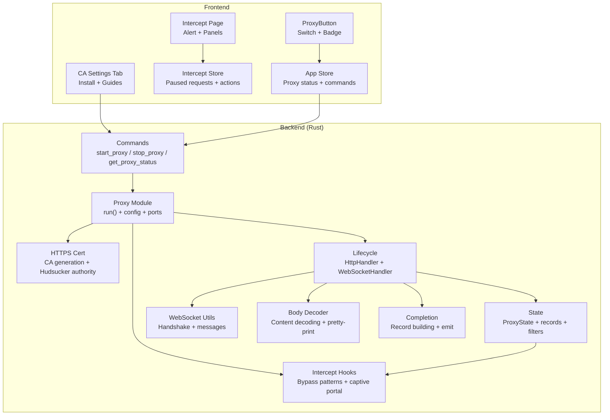
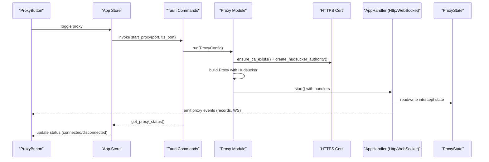
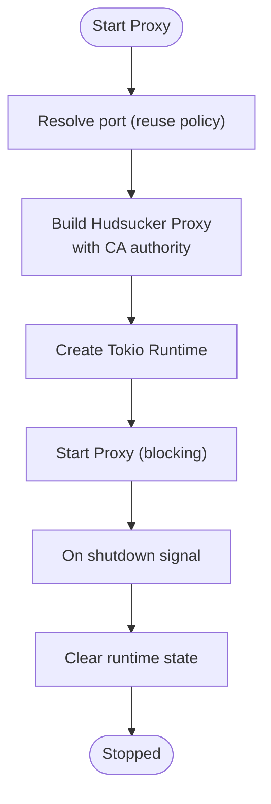
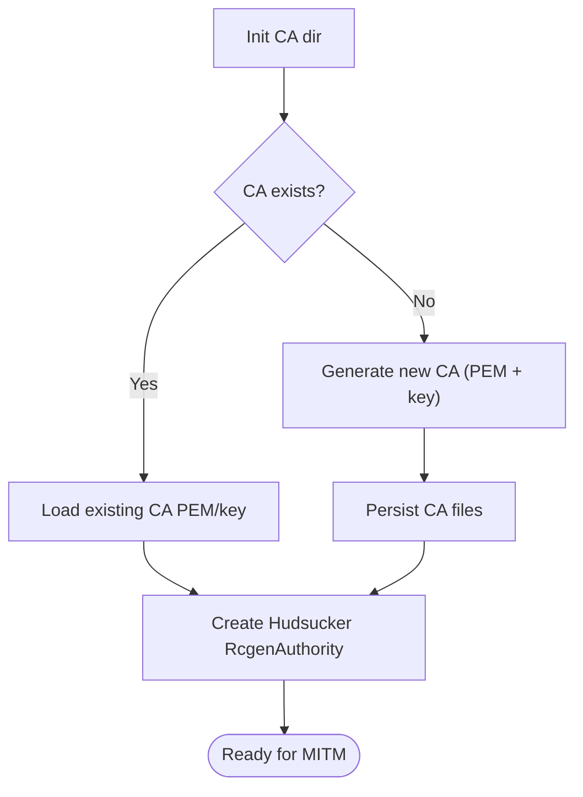
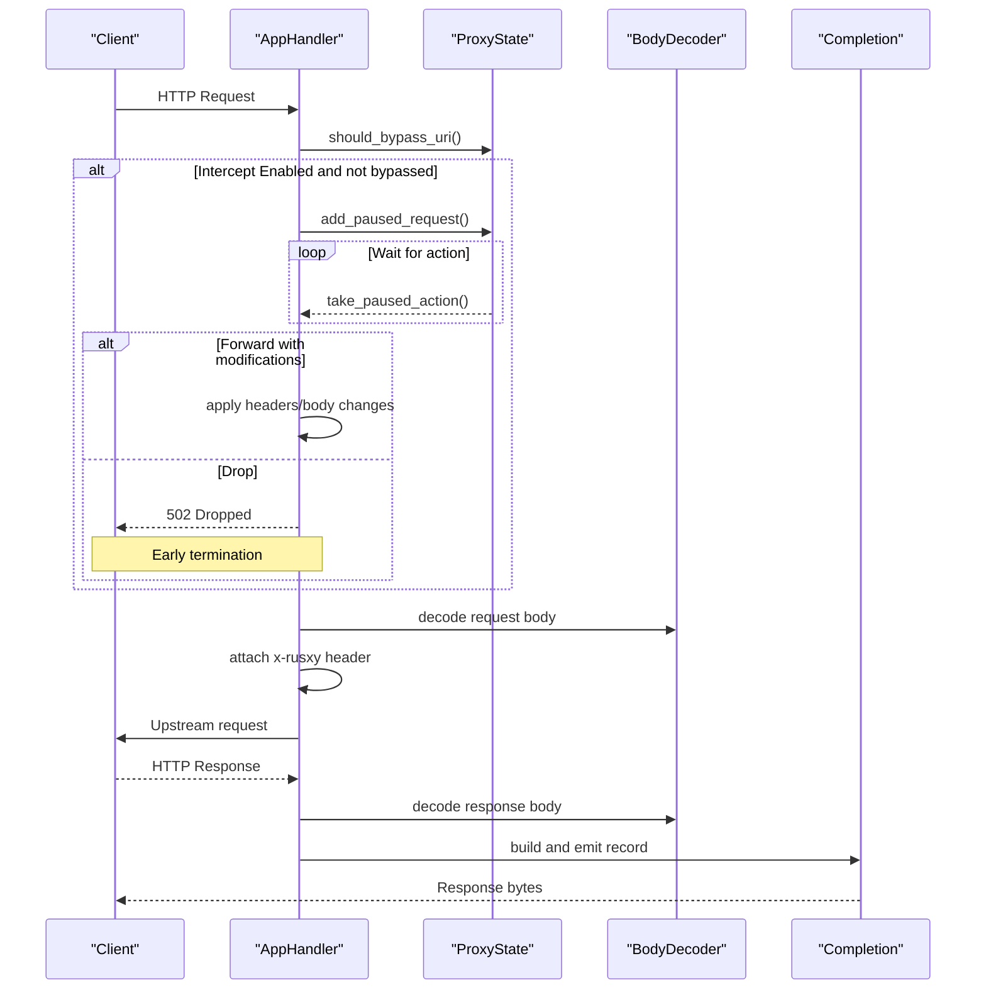
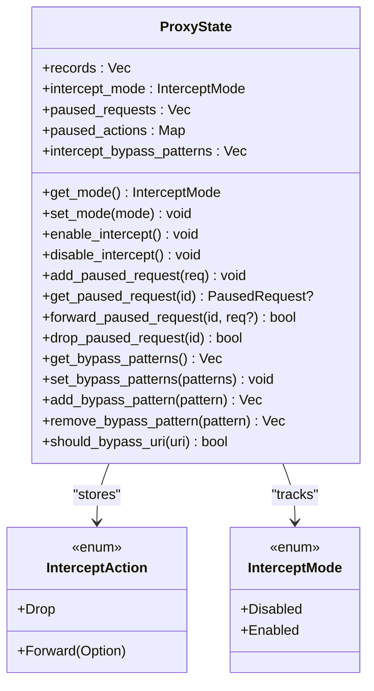
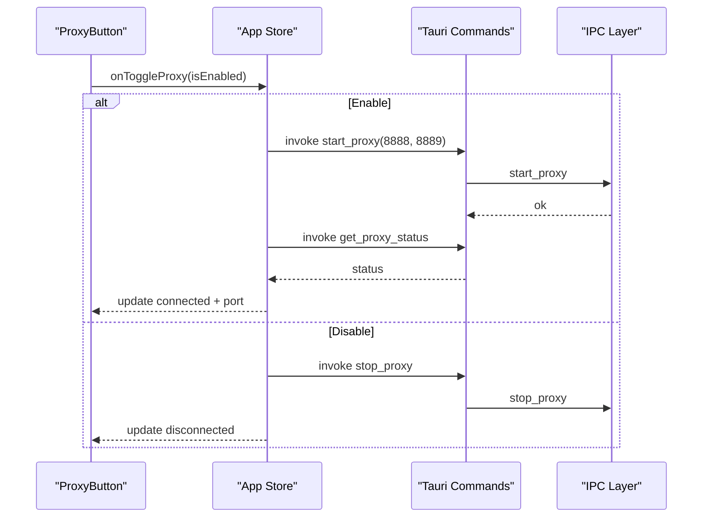
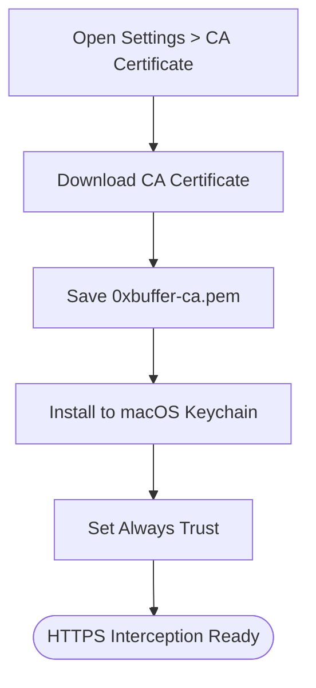
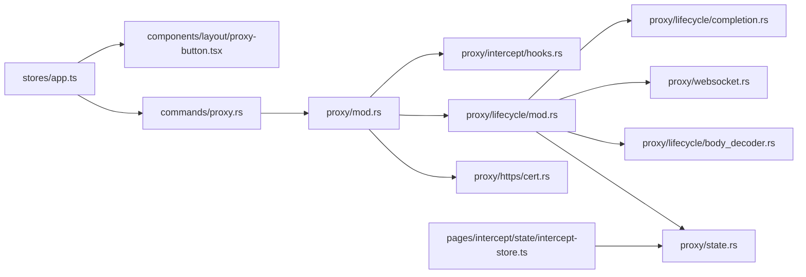

# Proxy Management

<cite>
**Referenced Files in This Document**
- [proxy.rs](file://src-tauri/src/proxy/mod.rs)
- [proxy.rs](file://src-tauri/src/commands/proxy.rs)
- [proxy-button.tsx](file://src/components/layout/proxy-button.tsx)
- [app.ts](file://src/stores/app.ts)
- [intercept-store.ts](file://src/pages/intercept/state/intercept-store.ts)
- [intercept/index.tsx](file://src/pages/intercept/index.tsx)
- [cert.rs](file://src-tauri/src/proxy/https/cert.rs)
- [intercept/mod.rs](file://src-tauri/src/proxy/intercept/mod.rs)
- [intercept/hooks.rs](file://src-tauri/src/proxy/intercept/hooks.rs)
- [lifecycle/mod.rs](file://src-tauri/src/proxy/lifecycle/mod.rs)
- [lifecycle/body_decoder.rs](file://src-tauri/src/proxy/lifecycle/body_decoder.rs)
- [lifecycle/completion.rs](file://src-tauri/src/proxy/lifecycle/completion.rs)
- [websocket.rs](file://src-tauri/src/proxy/websocket.rs)
- [state.rs](file://src-tauri/src/proxy/state.rs)
- [ca-certificate-settings-tab.tsx](file://src/pages/settings/components/ca-certificate-settings-tab.tsx)
</cite>

## Table of Contents
1. [Introduction](#introduction)
2. [Project Structure](#project-structure)
3. [Core Components](#core-components)
4. [Architecture Overview](#architecture-overview)
5. [Detailed Component Analysis](#detailed-component-analysis)
6. [Dependency Analysis](#dependency-analysis)
7. [Performance Considerations](#performance-considerations)
8. [Troubleshooting Guide](#troubleshooting-guide)
9. [Conclusion](#conclusion)
10. [Appendices](#appendices)

## Introduction
This document explains AppRecon’s Proxy Management system with a focus on MITM proxy control, runtime status management, connection handling, certificate management, traffic interception, lifecycle management, state synchronization, and error handling. It also provides practical setup and troubleshooting guidance for HTTPS interception, including CA certificate generation, trust store integration, and browser configuration.

## Project Structure
The proxy system spans Rust backend modules and TypeScript/React frontend components:
- Backend (Rust): proxy orchestration, certificate management, request/response interception, state management, and WebSocket handling
- Frontend (TypeScript/React): proxy control UI, intercept queue and request panels, and settings for CA certificate installation

**Diagram sources**
- [proxy.rs:93-187](file://src-tauri/src/proxy/mod.rs#L93-L187)
- [proxy.rs:15-73](file://src-tauri/src/commands/proxy.rs#L15-L73)
- [proxy-button.tsx:9-73](file://src/components/layout/proxy-button.tsx#L9-L73)
- [app.ts:26-108](file://src/stores/app.ts#L26-L108)
- [intercept/index.tsx:15-68](file://src/pages/intercept/index.tsx#L15-L68)
- [intercept-store.ts:69-201](file://src/pages/intercept/state/intercept-store.ts#L69-L201)
- [cert.rs:106-143](file://src-tauri/src/proxy/https/cert.rs#L106-L143)
- [lifecycle/mod.rs:88-360](file://src-tauri/src/proxy/lifecycle/mod.rs#L88-L360)
- [websocket.rs:27-94](file://src-tauri/src/proxy/websocket.rs#L27-L94)
- [lifecycle/body_decoder.rs:24-90](file://src-tauri/src/proxy/lifecycle/body_decoder.rs#L24-L90)
- [lifecycle/completion.rs:35-76](file://src-tauri/src/proxy/lifecycle/completion.rs#L35-L76)
- [intercept/hooks.rs:12-20](file://src-tauri/src/proxy/intercept/hooks.rs#L12-L20)

**Section sources**
- [proxy.rs:1-187](file://src-tauri/src/proxy/mod.rs#L1-L187)
- [proxy.rs:1-73](file://src-tauri/src/commands/proxy.rs#L1-L73)
- [proxy-button.tsx:1-74](file://src/components/layout/proxy-button.tsx#L1-L74)
- [app.ts:1-109](file://src/stores/app.ts#L1-L109)
- [intercept/index.tsx:1-69](file://src/pages/intercept/index.tsx#L1-L69)
- [intercept-store.ts:1-202](file://src/pages/intercept/state/intercept-store.ts#L1-L202)
- [cert.rs:1-144](file://src-tauri/src/proxy/https/cert.rs#L1-L144)
- [lifecycle/mod.rs:1-453](file://src-tauri/src/proxy/lifecycle/mod.rs#L1-L453)
- [websocket.rs:1-187](file://src-tauri/src/proxy/websocket.rs#L1-L187)
- [lifecycle/body_decoder.rs:1-418](file://src-tauri/src/proxy/lifecycle/body_decoder.rs#L1-L418)
- [lifecycle/completion.rs:1-118](file://src-tauri/src/proxy/lifecycle/completion.rs#L1-L118)
- [intercept/hooks.rs:1-21](file://src-tauri/src/proxy/intercept/hooks.rs#L1-L21)

## Core Components
- Proxy orchestration and runtime control
  - Starts/stops the proxy, resolves ports, and manages graceful shutdown
  - Exposes runtime status via a Tauri command
- Certificate management
  - Generates and persists a local CA, exports PEM for distribution, and builds a Hudsucker authority
- Traffic interception
  - HTTP request/response interception with pause/forward/drop actions
  - Bypass patterns and captive portal detection
  - WebSocket upgrade detection and message handling
- State synchronization
  - Central ProxyState tracks records, paused requests, intercept mode, and bypass patterns
  - Emits events and persists history
- Frontend integration
  - ProxyButton toggles proxy state
  - Intercept page and store manage paused requests and manual intervention
  - CA settings tab provides download/install helpers

**Section sources**
- [proxy.rs:93-187](file://src-tauri/src/proxy/mod.rs#L93-L187)
- [proxy.rs:15-73](file://src-tauri/src/commands/proxy.rs#L15-L73)
- [cert.rs:106-143](file://src-tauri/src/proxy/https/cert.rs#L106-L143)
- [lifecycle/mod.rs:88-360](file://src-tauri/src/proxy/lifecycle/mod.rs#L88-L360)
- [state.rs:176-440](file://src-tauri/src/proxy/state.rs#L176-L440)
- [intercept-store.ts:69-201](file://src/pages/intercept/state/intercept-store.ts#L69-L201)
- [proxy-button.tsx:9-73](file://src/components/layout/proxy-button.tsx#L9-L73)
- [ca-certificate-settings-tab.tsx:18-146](file://src/pages/settings/components/ca-certificate-settings-tab.tsx#L18-L146)

## Architecture Overview
The proxy uses Hudsucker to implement HTTP/HTTPS MITM. The Rust backend exposes Tauri commands for UI control, while the frontend renders proxy controls and intercept panels.

**Diagram sources**
- [proxy-button.tsx:24-46](file://src/components/layout/proxy-button.tsx#L24-L46)
- [app.ts:38-96](file://src/stores/app.ts#L38-L96)
- [proxy.rs:15-73](file://src-tauri/src/commands/proxy.rs#L15-L73)
- [proxy.rs:93-187](file://src-tauri/src/proxy/mod.rs#L93-L187)
- [cert.rs:131-143](file://src-tauri/src/proxy/https/cert.rs#L131-L143)
- [lifecycle/mod.rs:88-360](file://src-tauri/src/proxy/lifecycle/mod.rs#L88-L360)
- [state.rs:176-222](file://src-tauri/src/proxy/state.rs#L176-L222)

## Detailed Component Analysis

### Proxy Orchestration and Runtime Control
- Port resolution and reuse policy
- Graceful shutdown signaling and cleanup
- Tokio runtime initialization for Hudsucker
- Status reporting via TCP connect test

**Diagram sources**
- [proxy.rs:51-81](file://src-tauri/src/proxy/mod.rs#L51-L81)
- [proxy.rs:93-187](file://src-tauri/src/proxy/mod.rs#L93-L187)

**Section sources**
- [proxy.rs:51-81](file://src-tauri/src/proxy/mod.rs#L51-L81)
- [proxy.rs:93-187](file://src-tauri/src/proxy/mod.rs#L93-L187)
- [proxy.rs:15-73](file://src-tauri/src/commands/proxy.rs#L15-L73)

### Certificate Management System
- Local CA persistence and regeneration
- Export of CA PEM for distribution
- Hudsucker authority creation for TLS MITM

**Diagram sources**
- [cert.rs:11-143](file://src-tauri/src/proxy/https/cert.rs#L11-L143)

**Section sources**
- [cert.rs:11-143](file://src-tauri/src/proxy/https/cert.rs#L11-L143)

### Traffic Interception and Manual Intervention
- Request interception with pause/forward/drop
- Bypass patterns and captive portal detection
- Body decoding and pretty-printing for JSON
- WebSocket handshake and message capture

**Diagram sources**
- [lifecycle/mod.rs:88-360](file://src-tauri/src/proxy/lifecycle/mod.rs#L88-L360)
- [state.rs:176-295](file://src-tauri/src/proxy/state.rs#L176-L295)
- [lifecycle/body_decoder.rs:24-90](file://src-tauri/src/proxy/lifecycle/body_decoder.rs#L24-L90)
- [lifecycle/completion.rs:35-76](file://src-tauri/src/proxy/lifecycle/completion.rs#L35-L76)
- [intercept/hooks.rs:12-20](file://src-tauri/src/proxy/intercept/hooks.rs#L12-L20)

**Section sources**
- [lifecycle/mod.rs:88-360](file://src-tauri/src/proxy/lifecycle/mod.rs#L88-L360)
- [state.rs:176-295](file://src-tauri/src/proxy/state.rs#L176-L295)
- [lifecycle/body_decoder.rs:24-90](file://src-tauri/src/proxy/lifecycle/body_decoder.rs#L24-L90)
- [lifecycle/completion.rs:35-76](file://src-tauri/src/proxy/lifecycle/completion.rs#L35-L76)
- [intercept/hooks.rs:12-20](file://src-tauri/src/proxy/intercept/hooks.rs#L12-L20)

### Proxy Lifecycle Management and State Synchronization
- Intercept mode transitions and cleanup of paused requests
- Filtering and search over captured records
- Bypass pattern management with wildcard support
- Event emission and history persistence

**Diagram sources**
- [state.rs:176-440](file://src-tauri/src/proxy/state.rs#L176-L440)

**Section sources**
- [state.rs:176-440](file://src-tauri/src/proxy/state.rs#L176-L440)
- [intercept-store.ts:69-201](file://src/pages/intercept/state/intercept-store.ts#L69-L201)

### Frontend Proxy Control and Interception UI
- ProxyButton toggles proxy state and displays current port
- App store invokes backend commands and updates UI state
- Intercept page shows alerts and panels for paused requests
- Intercept store handles refresh, forward/drop actions, and bypass host workflows

**Diagram sources**
- [proxy-button.tsx:24-46](file://src/components/layout/proxy-button.tsx#L24-L46)
- [app.ts:38-96](file://src/stores/app.ts#L38-L96)
- [proxy.rs:15-73](file://src-tauri/src/commands/proxy.rs#L15-L73)

**Section sources**
- [proxy-button.tsx:1-74](file://src/components/layout/proxy-button.tsx#L1-L74)
- [app.ts:1-109](file://src/stores/app.ts#L1-L109)
- [intercept/index.tsx:15-68](file://src/pages/intercept/index.tsx#L15-L68)
- [intercept-store.ts:69-201](file://src/pages/intercept/state/intercept-store.ts#L69-L201)

### CA Certificate Installation and Browser Configuration
- Download CA certificate for manual installation
- macOS Keychain install helper
- Installation guides and troubleshooting

**Diagram sources**
- [ca-certificate-settings-tab.tsx:18-146](file://src/pages/settings/components/ca-certificate-settings-tab.tsx#L18-L146)

**Section sources**
- [ca-certificate-settings-tab.tsx:18-146](file://src/pages/settings/components/ca-certificate-settings-tab.tsx#L18-L146)

## Dependency Analysis
- Backend modules depend on Hudsucker for HTTP/HTTPS MITM and rustls provider for crypto
- AppHandler depends on ProxyState for intercept control and emits events for UI
- BodyDecoder and Completion modules encapsulate body handling and record emission
- Frontend depends on Tauri IPC to invoke backend commands and subscribe to proxy events

**Diagram sources**
- [proxy.rs:1-14](file://src-tauri/src/proxy/mod.rs#L1-L14)
- [cert.rs:1-14](file://src-tauri/src/proxy/https/cert.rs#L1-L14)
- [lifecycle/mod.rs:1-18](file://src-tauri/src/proxy/lifecycle/mod.rs#L1-L18)
- [state.rs:1-6](file://src-tauri/src/proxy/state.rs#L1-L6)
- [lifecycle/body_decoder.rs:1-5](file://src-tauri/src/proxy/lifecycle/body_decoder.rs#L1-L5)
- [websocket.rs:1-7](file://src-tauri/src/proxy/websocket.rs#L1-L7)
- [lifecycle/completion.rs:1-8](file://src-tauri/src/proxy/lifecycle/completion.rs#L1-L8)
- [intercept/hooks.rs:1-7](file://src-tauri/src/proxy/intercept/hooks.rs#L1-L7)
- [proxy.rs:1-6](file://src-tauri/src/commands/proxy.rs#L1-L6)
- [app.ts:1-6](file://src/stores/app.ts#L1-L6)
- [proxy-button.tsx:1-8](file://src/components/layout/proxy-button.tsx#L1-L8)
- [intercept-store.ts:1-15](file://src/pages/intercept/state/intercept-store.ts#L1-L15)

**Section sources**
- [proxy.rs:1-14](file://src-tauri/src/proxy/mod.rs#L1-L14)
- [lifecycle/mod.rs:1-18](file://src-tauri/src/proxy/lifecycle/mod.rs#L1-L18)
- [state.rs:1-6](file://src-tauri/src/proxy/state.rs#L1-L6)
- [lifecycle/body_decoder.rs:1-5](file://src-tauri/src/proxy/lifecycle/body_decoder.rs#L1-L5)
- [websocket.rs:1-7](file://src-tauri/src/proxy/websocket.rs#L1-L7)
- [lifecycle/completion.rs:1-8](file://src-tauri/src/proxy/lifecycle/completion.rs#L1-L8)
- [intercept/hooks.rs:1-7](file://src-tauri/src/proxy/intercept/hooks.rs#L1-L7)
- [proxy.rs:1-6](file://src-tauri/src/commands/proxy.rs#L1-L6)
- [app.ts:1-6](file://src/stores/app.ts#L1-L6)
- [proxy-button.tsx:1-8](file://src/components/layout/proxy-button.tsx#L1-L8)
- [intercept-store.ts:1-15](file://src/pages/intercept/state/intercept-store.ts#L1-L15)

## Performance Considerations
- Body decoding and pretty-printing occur per request/response; avoid heavy transformations in hot paths
- Prefer streaming or chunked handling for large bodies when extending
- Use bypass patterns to reduce overhead for non-targeted URIs
- Leverage async/await and minimal locking in AppHandler to keep proxy responsive
- Avoid unnecessary event emissions for high-frequency traffic

## Troubleshooting Guide
- Proxy fails to start
  - Verify port availability and reuse policy
  - Check CA generation logs and permissions
- HTTPS interception not working
  - Confirm CA certificate is installed and trusted
  - Ensure browser/device trusts the CA
- Requests not appearing in intercept
  - Check intercept mode is enabled
  - Review bypass patterns and captive portal detection
- Slow performance
  - Reduce body decoding verbosity
  - Limit filtering scope and search terms
- WebSocket issues
  - Confirm handshake status and upgrade headers
  - Validate message mapping keys and connection lifecycles

**Section sources**
- [proxy.rs:51-81](file://src-tauri/src/proxy/mod.rs#L51-L81)
- [cert.rs:131-143](file://src-tauri/src/proxy/https/cert.rs#L131-L143)
- [intercept/hooks.rs:16-20](file://src-tauri/src/proxy/intercept/hooks.rs#L16-L20)
- [lifecycle/body_decoder.rs:24-90](file://src-tauri/src/proxy/lifecycle/body_decoder.rs#L24-L90)
- [websocket.rs:23-60](file://src-tauri/src/proxy/websocket.rs#L23-L60)

## Conclusion
AppRecon’s Proxy Management system integrates a robust MITM proxy with certificate management, flexible interception controls, and a responsive frontend. The modular design enables secure HTTPS inspection, efficient traffic handling, and practical operational workflows for security analysis.

## Appendices

### Practical Setup Examples
- Start proxy
  - UI: Toggle ProxyButton to start proxy on default ports
  - Command: invoke start_proxy with desired HTTP and HTTPS MITM ports
- Stop proxy
  - UI: Toggle ProxyButton to stop proxy
  - Command: invoke stop_proxy
- Check status
  - Command: invoke get_proxy_status to determine running state and port
- Install CA certificate
  - Use CA settings tab to download and install to macOS Keychain
  - Follow installation guides for browsers/devices

**Section sources**
- [proxy-button.tsx:24-46](file://src/components/layout/proxy-button.tsx#L24-L46)
- [app.ts:38-96](file://src/stores/app.ts#L38-L96)
- [proxy.rs:15-73](file://src-tauri/src/commands/proxy.rs#L15-L73)
- [ca-certificate-settings-tab.tsx:18-146](file://src/pages/settings/components/ca-certificate-settings-tab.tsx#L18-L146)

### Configuration Options
- ProxyConfig
  - port: HTTP listener port
  - reuse: allow reuse of port
  - tls_port: HTTPS MITM port
- InterceptMode
  - Disabled: normal proxy pass-through
  - Enabled: pause and allow manual intervention
- Bypass patterns
  - Wildcard and exact host matching
  - Captive portal auto-bypass

**Section sources**
- [proxy.rs:26-91](file://src-tauri/src/proxy/mod.rs#L26-L91)
- [state.rs:123-128](file://src-tauri/src/proxy/state.rs#L123-L128)
- [state.rs:394-433](file://src-tauri/src/proxy/state.rs#L394-L433)
- [intercept/hooks.rs:16-20](file://src-tauri/src/proxy/intercept/hooks.rs#L16-L20)