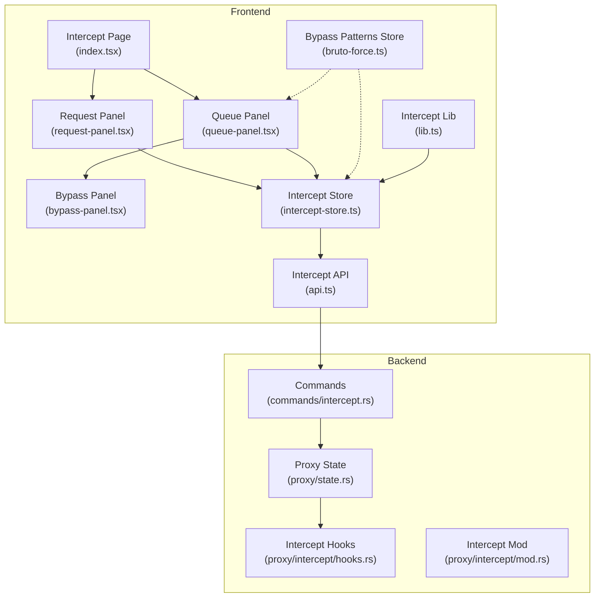
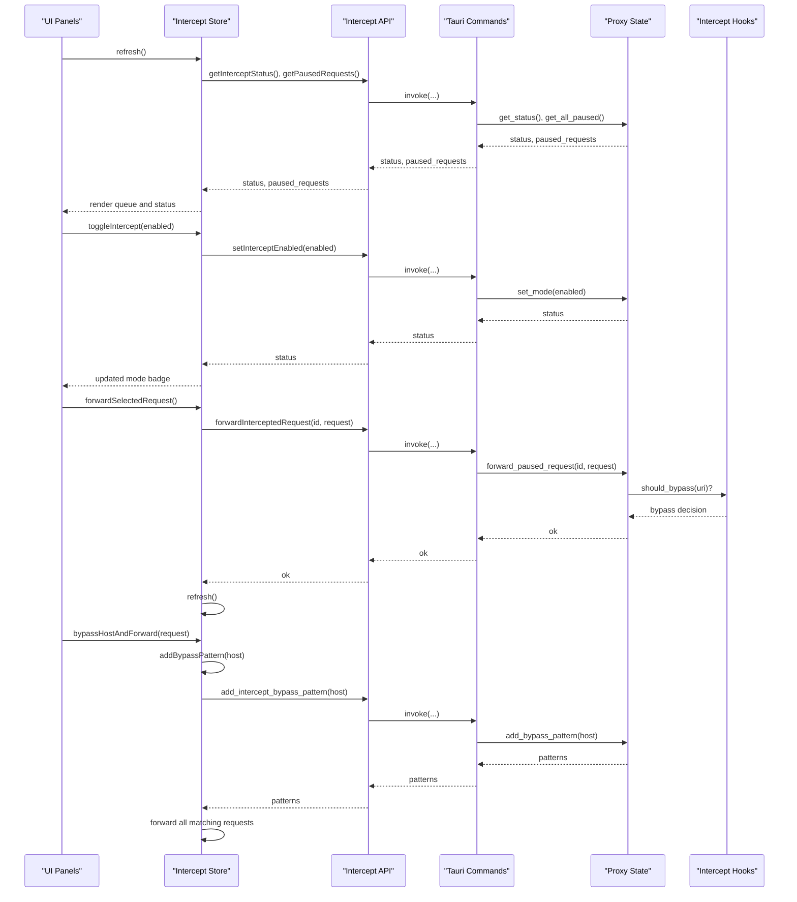
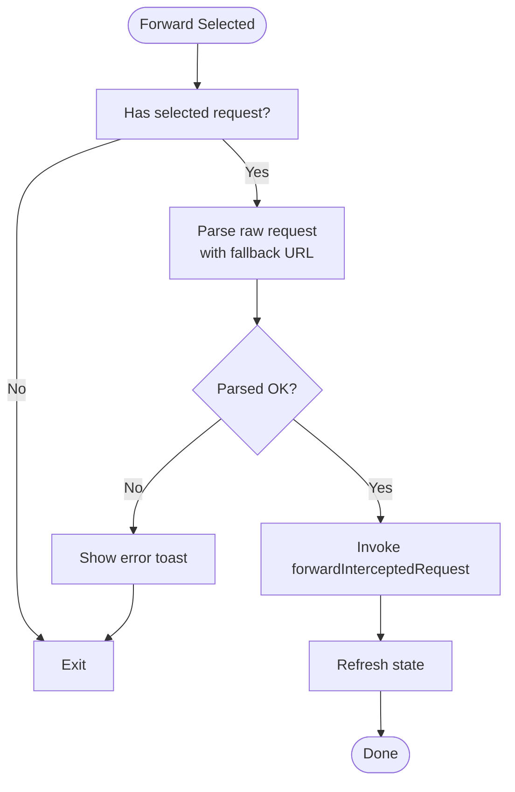
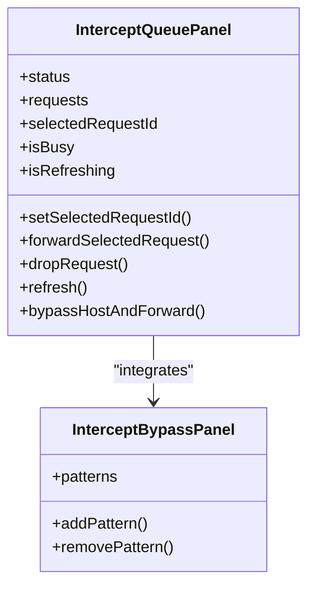
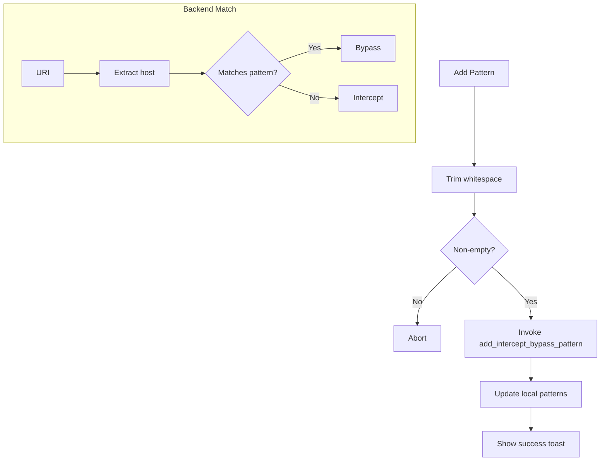
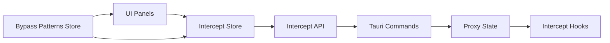

# Traffic Interception

<cite>
**Referenced Files in This Document**
- [intercept-store.ts](file://src/pages/intercept/state/intercept-store.ts)
- [bypass-panel.tsx](file://src/pages/intercept/components/bypass-panel.tsx)
- [queue-panel.tsx](file://src/pages/intercept/components/queue-panel.tsx)
- [request-panel.tsx](file://src/pages/intercept/components/request-panel.tsx)
- [use-intercept-page.ts](file://src/pages/intercept/hooks/use-intercept-page.ts)
- [lib.ts](file://src/pages/intercept/lib.ts)
- [types.ts](file://src/pages/intercept/types.ts)
- [api.ts](file://src/pages/intercept/api.ts)
- [index.tsx](file://src/pages/intercept/index.tsx)
- [intercept.rs](file://src-tauri/src/proxy/intercept/mod.rs)
- [hooks.rs](file://src-tauri/src/proxy/intercept/hooks.rs)
- [state.rs](file://src-tauri/src/proxy/state.rs)
- [intercept.rs](file://src-tauri/src/commands/intercept.rs)
- [main.rs](file://src-tauri/src/main.rs)
- [bruto-force.ts](file://src/stores/bruto-force.ts)
</cite>

## Table of Contents
1. [Introduction](#introduction)
2. [Project Structure](#project-structure)
3. [Core Components](#core-components)
4. [Architecture Overview](#architecture-overview)
5. [Detailed Component Analysis](#detailed-component-analysis)
6. [Dependency Analysis](#dependency-analysis)
7. [Performance Considerations](#performance-considerations)
8. [Troubleshooting Guide](#troubleshooting-guide)
9. [Conclusion](#conclusion)
10. [Appendices](#appendices)

## Introduction
This document explains AppRecon’s Traffic Interception system. It covers how requests are captured, queued, and manipulated; how bypass patterns are configured and applied; and how the UI enables manual intervention and real-time monitoring. It also provides guidance on performance, memory management, and safe interception practices.

## Project Structure
The Traffic Interception feature spans the frontend React/TypeScript layer and the Rust Tauri backend. The frontend manages UI panels, state, and user interactions. The backend handles proxy interception, request queuing, and applying bypass rules.

**Diagram sources**
- [index.tsx:15-69](file://src/pages/intercept/index.tsx#L15-L69)
- [request-panel.tsx:9-46](file://src/pages/intercept/components/request-panel.tsx#L9-L46)
- [queue-panel.tsx:12-129](file://src/pages/intercept/components/queue-panel.tsx#L12-L129)
- [bypass-panel.tsx:10-102](file://src/pages/intercept/components/bypass-panel.tsx#L10-L102)
- [intercept-store.ts:69-202](file://src/pages/intercept/state/intercept-store.ts#L69-L202)
- [api.ts:1-51](file://src/pages/intercept/api.ts#L1-L51)
- [lib.ts:1-50](file://src/pages/intercept/lib.ts#L1-L50)
- [intercept.rs:20-145](file://src-tauri/src/commands/intercept.rs#L20-L145)
- [state.rs:176-434](file://src-tauri/src/proxy/state.rs#L176-L434)
- [hooks.rs:1-21](file://src-tauri/src/proxy/intercept/hooks.rs#L1-L21)
- [intercept.rs:1-7](file://src-tauri/src/proxy/intercept/mod.rs#L1-L7)
- [main.rs:71-90](file://src-tauri/src/main.rs#L71-L90)
- [bruto-force.ts:442-470](file://src/stores/bruto-force.ts#L442-L470)

**Section sources**
- [index.tsx:15-69](file://src/pages/intercept/index.tsx#L15-L69)
- [intercept-store.ts:69-202](file://src/pages/intercept/state/intercept-store.ts#L69-L202)
- [api.ts:1-51](file://src/pages/intercept/api.ts#L1-L51)
- [state.rs:176-434](file://src-tauri/src/proxy/state.rs#L176-L434)
- [intercept.rs:20-145](file://src-tauri/src/commands/intercept.rs#L20-L145)
- [hooks.rs:1-21](file://src-tauri/src/proxy/intercept/hooks.rs#L1-L21)
- [main.rs:71-90](file://src-tauri/src/main.rs#L71-L90)
- [bruto-force.ts:442-470](file://src/stores/bruto-force.ts#L442-L470)

## Core Components
- Intercept Store: Central state for intercept status, paused requests, selection, and raw request content. Provides actions to toggle interception, forward/drop requests, and apply host-level passthrough.
- Queue Panel: Lists paused requests, allows selection, forwarding, dropping, and host passthrough. Integrates the Bypass Panel.
- Bypass Panel: Manages passthrough patterns (e.g., hostnames) and exposes them to the backend via the bypass patterns store.
- Request Panel: Displays and edits the raw HTTP request for the selected paused request and toggles interception mode.
- API Layer: Thin wrapper around Tauri commands for intercept operations and bypass pattern management.
- Backend Proxy State: Holds paused requests, intercept mode, and bypass patterns. Applies bypass rules and forwards/drops requests.
- Intercept Hooks: Built-in logic to bypass known captive portal endpoints.

**Section sources**
- [intercept-store.ts:16-31](file://src/pages/intercept/state/intercept-store.ts#L16-L31)
- [queue-panel.tsx:12-129](file://src/pages/intercept/components/queue-panel.tsx#L12-L129)
- [bypass-panel.tsx:10-102](file://src/pages/intercept/components/bypass-panel.tsx#L10-L102)
- [request-panel.tsx:9-46](file://src/pages/intercept/components/request-panel.tsx#L9-L46)
- [api.ts:1-51](file://src/pages/intercept/api.ts#L1-L51)
- [state.rs:176-434](file://src-tauri/src/proxy/state.rs#L176-L434)
- [hooks.rs:12-21](file://src-tauri/src/proxy/intercept/hooks.rs#L12-L21)

## Architecture Overview
The system operates as follows:
- Frontend periodically polls intercept status and paused requests.
- When interception is enabled, matching live requests are paused and stored in the backend.
- Users inspect, edit, and forward or drop individual requests.
- Host-level passthrough can be applied to forward all matching hosts immediately.

**Diagram sources**
- [use-intercept-page.ts:4-14](file://src/pages/intercept/hooks/use-intercept-page.ts#L4-L14)
- [intercept-store.ts:91-117](file://src/pages/intercept/state/intercept-store.ts#L91-L117)
- [intercept-store.ts:119-127](file://src/pages/intercept/state/intercept-store.ts#L119-L127)
- [intercept-store.ts:129-155](file://src/pages/intercept/state/intercept-store.ts#L129-L155)
- [intercept-store.ts:172-200](file://src/pages/intercept/state/intercept-store.ts#L172-L200)
- [api.ts:5-15](file://src/pages/intercept/api.ts#L5-L15)
- [api.ts:9-11](file://src/pages/intercept/api.ts#L9-L11)
- [api.ts:17-26](file://src/pages/intercept/api.ts#L17-L26)
- [intercept.rs:21-42](file://src-tauri/src/commands/intercept.rs#L21-L42)
- [intercept.rs:53-93](file://src-tauri/src/commands/intercept.rs#L53-L93)
- [intercept.rs:130-136](file://src-tauri/src/commands/intercept.rs#L130-L136)
- [state.rs:386-434](file://src-tauri/src/proxy/state.rs#L386-L434)
- [hooks.rs:12-21](file://src-tauri/src/proxy/intercept/hooks.rs#L12-L21)

## Detailed Component Analysis

### Intercept Store and State Management
The store encapsulates:
- Status: current intercept mode and paused count.
- Requests: array of paused requests.
- Selection: currently selected request ID and raw request content.
- Flags: busy and refreshing states.
- Actions: refresh, toggle interception, forward selected, drop, and host passthrough.

Key behaviors:
- Auto-refresh loop keeps UI in sync with backend.
- Forwarding validates the raw request, parses it, and forwards to backend.
- Bypass host forwards all matching host requests and adds a pattern.

**Diagram sources**
- [intercept-store.ts:129-155](file://src/pages/intercept/state/intercept-store.ts#L129-L155)
- [lib.ts:10-24](file://src/pages/intercept/lib.ts#L10-L24)

**Section sources**
- [intercept-store.ts:69-202](file://src/pages/intercept/state/intercept-store.ts#L69-L202)
- [lib.ts:10-24](file://src/pages/intercept/lib.ts#L10-L24)

### Queue Panel and Manual Intervention
The queue panel displays:
- Intercept mode and paused count.
- A scrollable list of paused requests with method, host, path, and timestamp.
- Controls to forward, drop, and bypass host for each row.
- Global controls to forward selected and refresh.

Manual intervention:
- Select a request to load its raw HTTP content.
- Edit the raw request in the adjacent Request Panel.
- Forward or drop individually.
- Apply host passthrough to forward all matching-host requests.

**Diagram sources**
- [queue-panel.tsx:12-129](file://src/pages/intercept/components/queue-panel.tsx#L12-L129)
- [bypass-panel.tsx:10-102](file://src/pages/intercept/components/bypass-panel.tsx#L10-L102)

**Section sources**
- [queue-panel.tsx:12-129](file://src/pages/intercept/components/queue-panel.tsx#L12-L129)
- [bypass-panel.tsx:10-102](file://src/pages/intercept/components/bypass-panel.tsx#L10-L102)

### Bypass Panel and Pattern Management
The Bypass Panel:
- Shows current patterns with removable badges.
- Allows adding new patterns via input and Enter key.
- Integrates with the bypass patterns store to persist patterns.

Backend enforcement:
- Patterns support exact host and wildcard prefixes.
- Captive portal detection is built-in and takes precedence.

**Diagram sources**
- [bypass-panel.tsx:18-33](file://src/pages/intercept/components/bypass-panel.tsx#L18-L33)
- [api.ts:44-46](file://src/pages/intercept/api.ts#L44-L46)
- [state.rs:409-433](file://src-tauri/src/proxy/state.rs#L409-L433)
- [hooks.rs:12-21](file://src-tauri/src/proxy/intercept/hooks.rs#L12-L21)

**Section sources**
- [bypass-panel.tsx:10-102](file://src/pages/intercept/components/bypass-panel.tsx#L10-L102)
- [api.ts:36-50](file://src/pages/intercept/api.ts#L36-L50)
- [state.rs:386-434](file://src-tauri/src/proxy/state.rs#L386-L434)
- [hooks.rs:12-21](file://src-tauri/src/proxy/intercept/hooks.rs#L12-L21)

### Request Panel and Raw Request Editing
The Request Panel:
- Displays a badge indicating intercept mode.
- Provides a text editor for the raw HTTP request.
- Disables editing when no request is selected.
- Toggles interception via the store action.

Editing workflow:
- Select a paused request to enable editing.
- Modify method, URL, headers, and body in the raw editor.
- Forward to apply changes.

**Section sources**
- [request-panel.tsx:9-46](file://src/pages/intercept/components/request-panel.tsx#L9-L46)
- [intercept-store.ts:24-29](file://src/pages/intercept/state/intercept-store.ts#L24-L29)

### Automatic Interception Triggers and Real-Time Monitoring
Automatic triggers:
- Enabling interception switches the proxy into capture mode.
- Live traffic matching the scope is paused and queued.

Real-time monitoring:
- The page hook triggers periodic refreshes to keep the UI updated.
- The queue panel shows paused counts and mode status.

**Section sources**
- [intercept-store.ts:119-127](file://src/pages/intercept/state/intercept-store.ts#L119-L127)
- [use-intercept-page.ts:4-14](file://src/pages/intercept/hooks/use-intercept-page.ts#L4-L14)
- [queue-panel.tsx:23-62](file://src/pages/intercept/components/queue-panel.tsx#L23-L62)

### Request Modification Workflows
Supported modifications:
- Method change: update the HTTP method in the raw request.
- URL change: adjust the request URI.
- Header editing: modify headers in the raw request.
- Body transformation: edit the body content.

Validation and encoding:
- Forwarding re-encodes bodies according to Content-Encoding headers before sending.

**Section sources**
- [intercept-store.ts:139-147](file://src/pages/intercept/state/intercept-store.ts#L139-L147)
- [intercept.rs:59-84](file://src-tauri/src/commands/intercept.rs#L59-L84)

### Interception Queue Management
Queue characteristics:
- FIFO-like ordering by arrival time.
- No explicit per-request priority in the UI.
- Filtering is supported by the underlying proxy filter (scope-based) and bypass patterns.

Batch processing:
- Host passthrough forwards all matching requests in a loop after adding a pattern.

**Section sources**
- [intercept-store.ts:172-200](file://src/pages/intercept/state/intercept-store.ts#L172-L200)
- [state.rs:176-183](file://src-tauri/src/proxy/state.rs#L176-L183)

### Backend Proxy State and Interception Logic
Backend responsibilities:
- Maintains intercept mode, paused requests, and bypass patterns.
- Applies bypass rules (including captive portal detection).
- Forwards or drops paused requests by ID.

**Section sources**
- [state.rs:176-434](file://src-tauri/src/proxy/state.rs#L176-L434)
- [hooks.rs:12-21](file://src-tauri/src/proxy/intercept/hooks.rs#L12-L21)
- [intercept.rs:53-109](file://src-tauri/src/commands/intercept.rs#L53-L109)

## Dependency Analysis
- Frontend depends on Tauri commands for all interception operations.
- The bypass patterns store is shared between intercept and brute-force features.
- Backend uses intercept hooks to decide whether to bypass certain URIs.

**Diagram sources**
- [api.ts:1-51](file://src/pages/intercept/api.ts#L1-L51)
- [intercept.rs:20-145](file://src-tauri/src/commands/intercept.rs#L20-L145)
- [state.rs:176-434](file://src-tauri/src/proxy/state.rs#L176-L434)
- [hooks.rs:12-21](file://src-tauri/src/proxy/intercept/hooks.rs#L12-L21)
- [bruto-force.ts:442-470](file://src/stores/bruto-force.ts#L442-L470)

**Section sources**
- [api.ts:1-51](file://src/pages/intercept/api.ts#L1-L51)
- [intercept.rs:20-145](file://src-tauri/src/commands/intercept.rs#L20-L145)
- [state.rs:176-434](file://src-tauri/src/proxy/state.rs#L176-L434)
- [hooks.rs:12-21](file://src-tauri/src/proxy/intercept/hooks.rs#L12-L21)
- [bruto-force.ts:442-470](file://src/stores/bruto-force.ts#L442-L470)

## Performance Considerations
- High-volume traffic:
  - Prefer host-level passthrough for large batches to reduce UI churn.
  - Limit unnecessary refreshes; the current polling interval is suitable for interactive use.
- Memory management:
  - Large request bodies are represented as arrays of numbers; avoid excessive simultaneous edits.
  - Periodic refresh loads paused requests; consider throttling manual edits during heavy traffic.
- UI responsiveness:
  - Busy flags prevent concurrent operations; ensure long-running actions (e.g., bulk forwarding) are batched.

[No sources needed since this section provides general guidance]

## Troubleshooting Guide
Common issues and resolutions:
- Paused request not found when forwarding/dropping:
  - The backend returns a not-found error if the request ID is invalid. Verify selection and refresh.
- Forwarding fails due to invalid raw request:
  - Ensure the raw request is a valid HTTP message; the store validates before invoking the backend.
- Captive portal requests bypass unexpectedly:
  - Built-in captive portal detection takes precedence; remove or adjust patterns if needed.
- CA trust/import issues:
  - Use the provided CA trust command to import the certificate into the managed browser profile or OS keychain.

**Section sources**
- [intercept-store.ts:143-145](file://src/pages/intercept/state/intercept-store.ts#L143-L145)
- [intercept.rs:90-92](file://src-tauri/src/commands/intercept.rs#L90-L92)
- [hooks.rs:16-21](file://src-tauri/src/proxy/intercept/hooks.rs#L16-L21)
- [intercept.rs:422-433](file://src-tauri/src/commands/intercept.rs#L422-L433)

## Conclusion
AppRecon’s Traffic Interception system combines a reactive frontend with a robust backend proxy to capture, queue, and manipulate HTTP requests. Users can manually edit and forward individual requests, apply host-level passthrough, and configure bypass patterns. The system supports real-time monitoring and integrates with the broader toolset for efficient traffic analysis and testing.

[No sources needed since this section summarizes without analyzing specific files]

## Appendices

### Practical Examples
- Enabling interception and viewing the queue:
  - Toggle the intercept switch in the Request Panel; the Queue Panel updates automatically.
- Modifying a request:
  - Select a paused request, edit the raw HTTP content, then forward to apply changes.
- Creating a bypass pattern:
  - Add a hostname pattern in the Bypass Panel; the system applies it immediately and can forward all matching requests via the queue panel.

[No sources needed since this section provides general guidance]

### Safety and Security Guidelines
- Only intercept domains you own or have explicit permission to test.
- Avoid modifying sensitive headers (e.g., Authorization) unless necessary for legitimate testing.
- Keep bypass patterns scoped to minimize unintended traffic routing.
- Regularly review and prune bypass patterns to maintain clarity.

[No sources needed since this section provides general guidance]