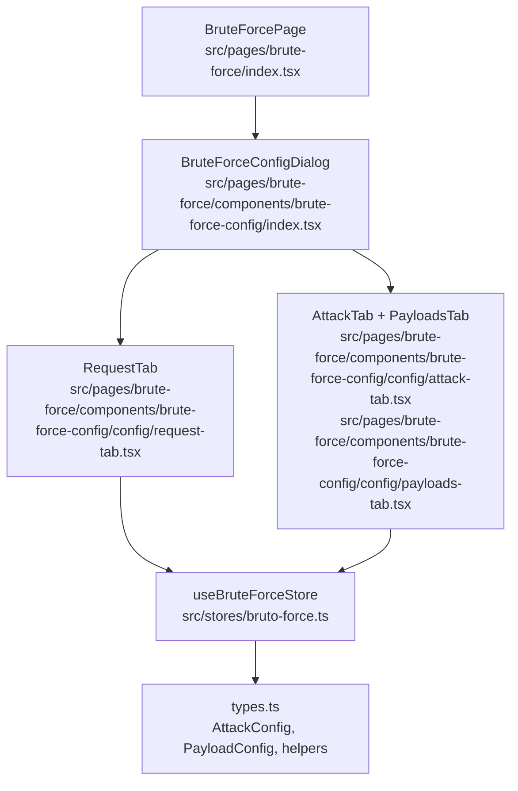
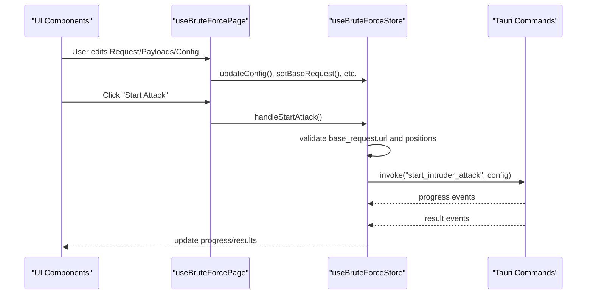
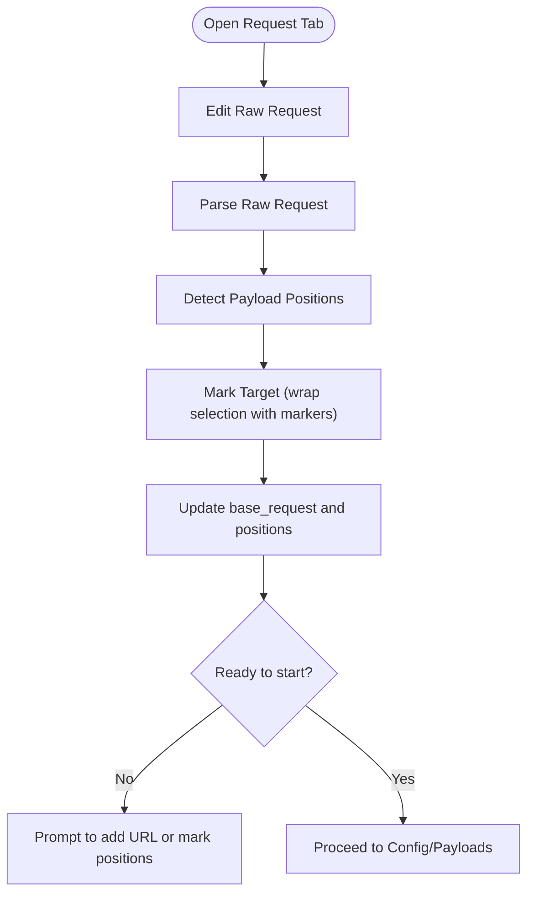
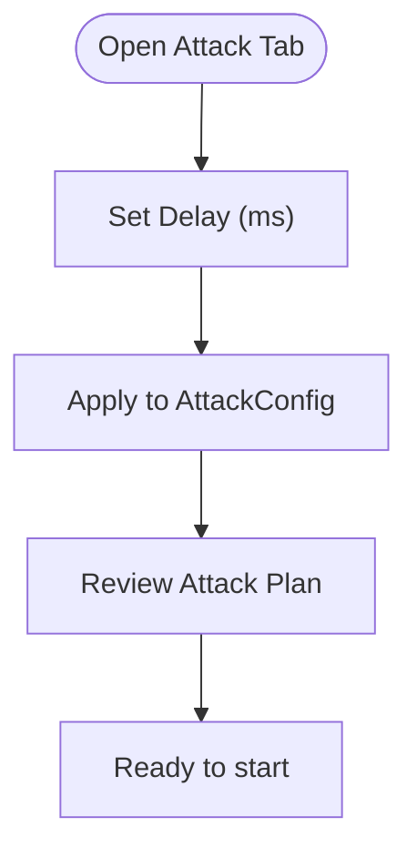
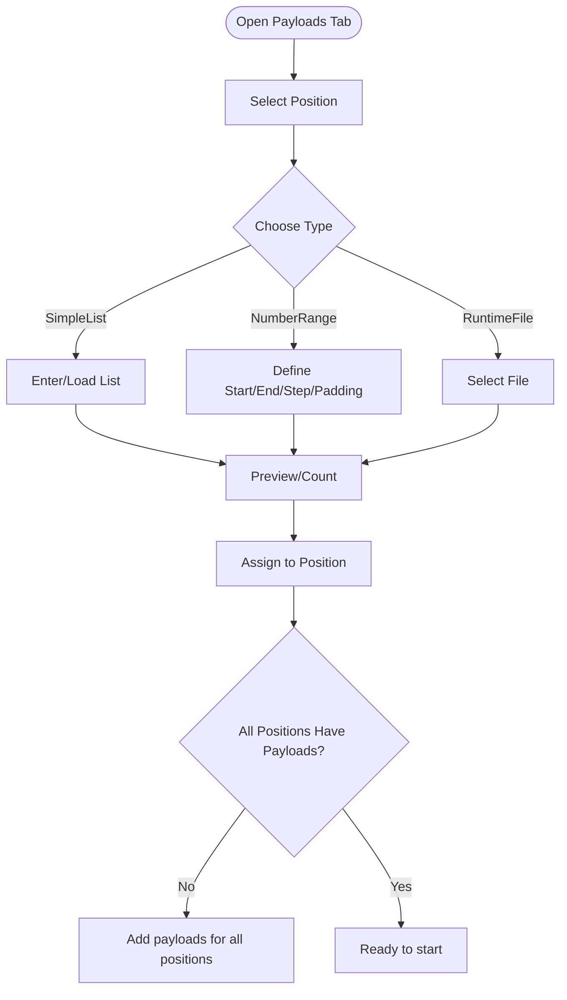
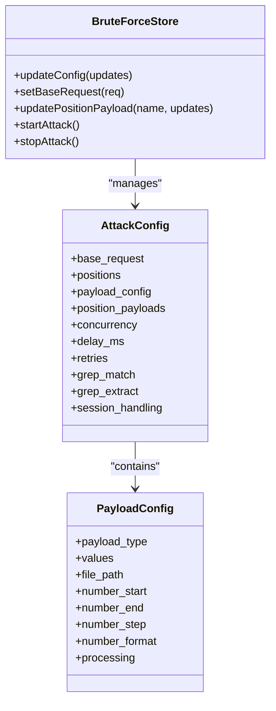
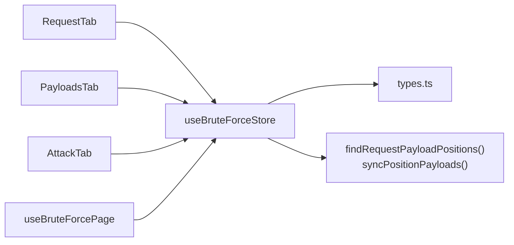

# Attack Configuration

<cite>
**Referenced Files in This Document**
- [index.tsx](file://src/pages/brute-force/components/brute-force-config/index.tsx)
- [config.tsx](file://src/pages/brute-force/components/brute-force-config/config.tsx)
- [attack-tab.tsx](file://src/pages/brute-force/components/brute-force-config/config/attack-tab.tsx)
- [request-tab.tsx](file://src/pages/brute-force/components/brute-force-config/config/request-tab.tsx)
- [payloads-tab.tsx](file://src/pages/brute-force/components/brute-force-config/config/payloads-tab.tsx)
- [number-input-field.tsx](file://src/pages/brute-force/components/brute-force-config/config/number-input-field.tsx)
- [payload-preset-dialog.tsx](file://src/pages/brute-force/components/payload-preset-dialog.tsx)
- [predefined-payloads.ts](file://src/pages/brute-force/data/predefined-payloads.ts)
- [types.ts](file://src/pages/brute-force/types.ts)
- [bruto-force.ts](file://src/stores/bruto-force.ts)
- [use-page.ts](file://src/pages/brute-force/hooks/use-page.ts)
- [constants.ts](file://src/pages/brute-force/constants.ts)
- [index.tsx](file://src/pages/brute-force/index.tsx)
</cite>

## Table of Contents
1. [Introduction](#introduction)
2. [Project Structure](#project-structure)
3. [Core Components](#core-components)
4. [Architecture Overview](#architecture-overview)
5. [Detailed Component Analysis](#detailed-component-analysis)
6. [Dependency Analysis](#dependency-analysis)
7. [Performance Considerations](#performance-considerations)
8. [Troubleshooting Guide](#troubleshooting-guide)
9. [Security and Legal Guidelines](#security-and-legal-guidelines)
10. [Conclusion](#conclusion)

## Introduction
This document explains the Brute Force Attack Configuration system. It covers how to define attacks, configure targets, choose credentials and payload strategies, and control timing and concurrency. It also documents the Request tab for HTTP method, headers, and payload formatting, the Attack tab for delay and concurrency controls, and the Payloads tab for payload sources and number-range generation. Practical examples show how to set up authentication endpoints and optimize parameters per target type. Finally, it outlines security considerations, ethical hacking guidelines, and legal compliance requirements for penetration testing.

## Project Structure
The Brute Force configuration is organized as a tabbed dialog inside the Brute Force page. The dialog exposes three primary tabs:
- Request: Build and mark the base HTTP request and payload insertion points.
- Config: Configure attack timing and payload strategies.
- Payloads: Define payload lists, number ranges, and presets.

**Diagram sources**
- [index.tsx:119-120](file://src/pages/brute-force/index.tsx#L119-L120)
- [index.tsx:14-30](file://src/pages/brute-force/components/brute-force-config/index.tsx#L14-L30)
- [request-tab.tsx:18-41](file://src/pages/brute-force/components/brute-force-config/config/request-tab.tsx#L18-L41)
- [attack-tab.tsx:6-13](file://src/pages/brute-force/components/brute-force-config/config/attack-tab.tsx#L6-L13)
- [payloads-tab.tsx:138-156](file://src/pages/brute-force/components/brute-force-config/config/payloads-tab.tsx#L138-L156)
- [bruto-force.ts:142-145](file://src/stores/bruto-force.ts#L142-L145)

**Section sources**
- [index.tsx:119-120](file://src/pages/brute-force/index.tsx#L119-L120)
- [index.tsx:14-30](file://src/pages/brute-force/components/brute-force-config/index.tsx#L14-L30)

## Core Components
- AttackConfig: Central configuration model including base_request, payload positions, payload_config, concurrency, delay, retries, grep match/extract, and session handling.
- PayloadConfig: Defines payload source (SimpleList, RuntimeFile, NumberRange) and processing steps.
- Position marking: Uses special markers to identify insertion points in URL, headers, and body.
- Store: Provides reactive state updates, validation, and orchestration of start/stop events.

Key behaviors:
- Default configuration initializes sensible defaults for concurrency, delay, and redirect behavior.
- Payload positions are discovered automatically from the base request when edited.
- Payloads can be loaded from files or presets, or generated via number ranges.

**Section sources**
- [types.ts:62-76](file://src/pages/brute-force/types.ts#L62-L76)
- [types.ts:32-41](file://src/pages/brute-force/types.ts#L32-L41)
- [types.ts:104-141](file://src/pages/brute-force/types.ts#L104-L141)
- [types.ts:220-246](file://src/pages/brute-force/types.ts#L220-L246)
- [bruto-force.ts:192-205](file://src/stores/bruto-force.ts#L192-L205)

## Architecture Overview
The configuration flow integrates UI components, a central store, and typed models. The page orchestrates validation and launch, while the store invokes backend commands and listens for progress and results.

**Diagram sources**
- [use-page.ts:75-109](file://src/pages/brute-force/hooks/use-page.ts#L75-L109)
- [bruto-force.ts:338-416](file://src/stores/bruto-force.ts#L338-L416)

## Detailed Component Analysis

### Request Tab: Defining the Base Request and Payload Positions
- Raw Request editor: Editable HTTP request in a monaco-like editor. Changes are parsed into the base request and payload positions are recalculated.
- Mark Target: Highlights selected text and wraps it with markers to indicate payload insertion points.
- Validation: Ensures at least one payload position exists before starting.

**Diagram sources**
- [request-tab.tsx:42-54](file://src/pages/brute-force/components/brute-force-config/config/request-tab.tsx#L42-L54)
- [request-tab.tsx:56-74](file://src/pages/brute-force/components/brute-force-config/config/request-tab.tsx#L56-L74)
- [types.ts:220-246](file://src/pages/brute-force/types.ts#L220-L246)

**Section sources**
- [request-tab.tsx:18-126](file://src/pages/brute-force/components/brute-force-config/config/request-tab.tsx#L18-L126)
- [types.ts:220-246](file://src/pages/brute-force/types.ts#L220-L246)

### Attack Tab: Timing Controls and Concurrency
- Delay (ms): Configurable pause between requests to reduce load and avoid triggering rate limits.
- Concurrency: Controlled via the store’s configuration; the UI currently exposes delay but the model supports concurrency tuning.

**Diagram sources**
- [attack-tab.tsx:6-26](file://src/pages/brute-force/components/brute-force-config/config/attack-tab.tsx#L6-L26)
- [types.ts:62-76](file://src/pages/brute-force/types.ts#L62-L76)

**Section sources**
- [attack-tab.tsx:6-26](file://src/pages/brute-force/components/brute-force-config/config/attack-tab.tsx#L6-L26)
- [types.ts:62-76](file://src/pages/brute-force/types.ts#L62-L76)

### Payloads Tab: Credential Combination Strategies and Sources
- Position-based payloads: Each marked position can have its own payload configuration.
- Payload types:
  - SimpleList: Manual list or file-based list.
  - NumberRange: Numeric sequences with optional padding/format.
  - RuntimeFile: File-backed list (via store updates).
- Presets: Choose from predefined lists (usernames, logins, API endpoints, DNS lists).
- Validation: Ensures each position has at least one payload before starting.

**Diagram sources**
- [payloads-tab.tsx:138-312](file://src/pages/brute-force/components/brute-force-config/config/payloads-tab.tsx#L138-L312)
- [payloads-tab.tsx:314-412](file://src/pages/brute-force/components/brute-force-config/config/payloads-tab.tsx#L314-L412)
- [payload-preset-dialog.tsx:30-82](file://src/pages/brute-force/components/payload-preset-dialog.tsx#L30-L82)
- [predefined-payloads.ts:41-47](file://src/pages/brute-force/data/predefined-payloads.ts#L41-L47)

**Section sources**
- [payloads-tab.tsx:138-312](file://src/pages/brute-force/components/brute-force-config/config/payloads-tab.tsx#L138-L312)
- [payloads-tab.tsx:314-412](file://src/pages/brute-force/components/brute-force-config/config/payloads-tab.tsx#L314-L412)
- [payload-preset-dialog.tsx:30-82](file://src/pages/brute-force/components/payload-preset-dialog.tsx#L30-L82)
- [predefined-payloads.ts:41-47](file://src/pages/brute-force/data/predefined-payloads.ts#L41-L47)
- [constants.ts:3-7](file://src/pages/brute-force/constants.ts#L3-L7)

### Number Input Field Component
- Purpose: Consistent numeric input for delay and number-range parameters.
- Behavior: Accepts integer values, integrates with store updates.

**Section sources**
- [number-input-field.tsx:6-30](file://src/pages/brute-force/components/brute-force-config/config/number-input-field.tsx#L6-L30)

### Payload Preset Dialog
- Browse categories and search among predefined payloads.
- Preview and apply a preset to the selected position.

**Section sources**
- [payload-preset-dialog.tsx:30-82](file://src/pages/brute-force/components/payload-preset-dialog.tsx#L30-L82)
- [predefined-payloads.ts:41-47](file://src/pages/brute-force/data/predefined-payloads.ts#L41-L47)

### Store and Validation Orchestration
- Updates: Centralized setters for request, payloads, processing steps, grep/session handling.
- Start/Stop: Validates prerequisites, invokes backend, listens for progress/results.
- Position synchronization: Keeps per-position payload configs aligned with base positions.

**Diagram sources**
- [bruto-force.ts:43-86](file://src/stores/brute-force.ts#L43-L86)
- [types.ts:62-76](file://src/pages/brute-force/types.ts#L62-L76)
- [types.ts:32-41](file://src/pages/brute-force/types.ts#L32-L41)

**Section sources**
- [bruto-force.ts:192-205](file://src/stores/brute-force.ts#L192-L205)
- [bruto-force.ts:338-416](file://src/stores/brute-force.ts#L338-L416)
- [types.ts:151-164](file://src/pages/brute-force/types.ts#L151-L164)

## Dependency Analysis
- UI depends on store for state and actions.
- Store depends on typed models and helper functions for payload discovery and formatting.
- Page hook coordinates validation and launch.

**Diagram sources**
- [request-tab.tsx:18-23](file://src/pages/brute-force/components/brute-force-config/config/request-tab.tsx#L18-L23)
- [payloads-tab.tsx:138-144](file://src/pages/brute-force/components/brute-force-config/config/payloads-tab.tsx#L138-L144)
- [attack-tab.tsx:6-11](file://src/pages/brute-force/components/brute-force-config/config/attack-tab.tsx#L6-L11)
- [types.ts:220-246](file://src/pages/brute-force/types.ts#L220-L246)
- [types.ts:151-164](file://src/pages/brute-force/types.ts#L151-L164)
- [use-page.ts:11-24](file://src/pages/brute-force/hooks/use-page.ts#L11-L24)

**Section sources**
- [use-page.ts:11-24](file://src/pages/brute-force/hooks/use-page.ts#L11-L24)
- [types.ts:220-246](file://src/pages/brute-force/types.ts#L220-L246)
- [types.ts:151-164](file://src/pages/brute-force/types.ts#L151-L164)

## Performance Considerations
- Concurrency vs. rate: Lower concurrency reduces server load; combine with delay to avoid throttling.
- Payload volume: Large number ranges or huge lists increase total iterations; preview counts help estimate workload.
- Network overhead: Minimize unnecessary headers/body content in the base request to reduce per-request cost.
- Redirects: Default redirect behavior is enabled; tune hops to prevent excessive redirection loops.

[No sources needed since this section provides general guidance]

## Troubleshooting Guide
Common start errors and resolutions:
- Missing base request URL: Add a valid URL in the Request tab.
- No payload positions: Mark at least one insertion point using the “Mark Target” action.
- Missing payloads for positions: Ensure each marked position has at least one payload (SimpleList, NumberRange, or preset).
- Start failure messages: The store displays toast notifications and sets a start error; clear it and recheck configuration.

Operational controls:
- Stop attack: Use the Stop button to terminate the current run.
- Clear results: Reset results and selection in the store.

**Section sources**
- [use-page.ts:45-51](file://src/pages/brute-force/hooks/use-page.ts#L45-L51)
- [bruto-force.ts:338-416](file://src/stores/bruto-force.ts#L338-L416)
- [index.tsx:102-112](file://src/pages/brute-force/index.tsx#L102-L112)

## Security and Legal Guidelines
- Authorization: Only run brute-force tests against systems you own or are explicitly authorized to test.
- Lawful purpose: Ensure activities comply with applicable laws and terms of service.
- Mitigation: Use conservative concurrency and delays to minimize impact on target systems.
- Monitoring: Watch for rate limits, account lockouts, and defensive responses.

[No sources needed since this section summarizes ethical and legal guidance]

## Conclusion
The Brute Force Attack Configuration system provides a structured way to define HTTP requests, mark payload insertion points, and configure payloads and timing. The Request tab builds the base request and detects positions; the Attack tab controls delay; the Payloads tab manages sources and number ranges with presets. The store validates prerequisites and coordinates backend execution. By combining these components thoughtfully, you can tailor attacks to different authentication endpoints and target characteristics while adhering to responsible security practices.