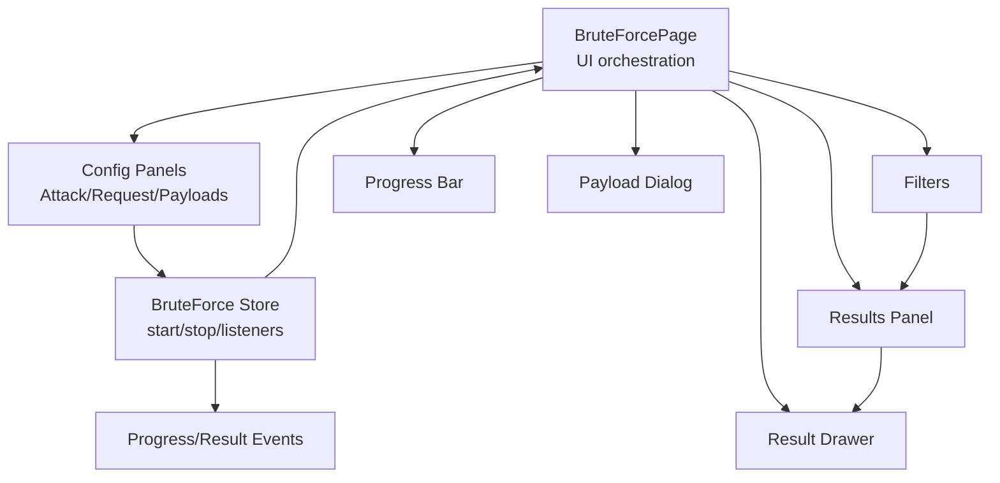
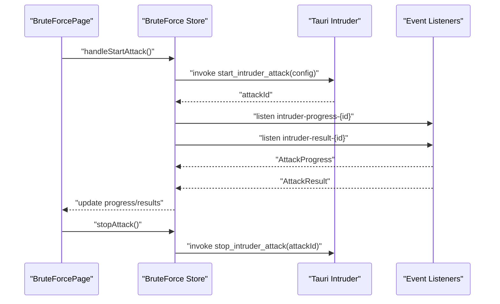
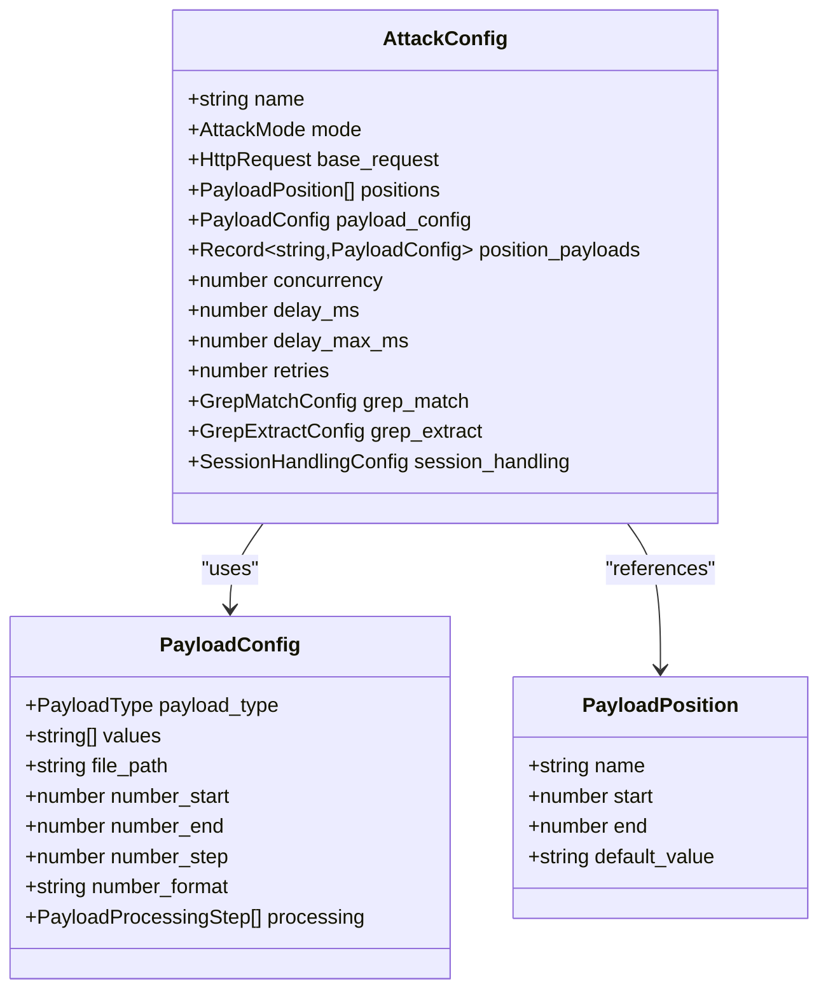
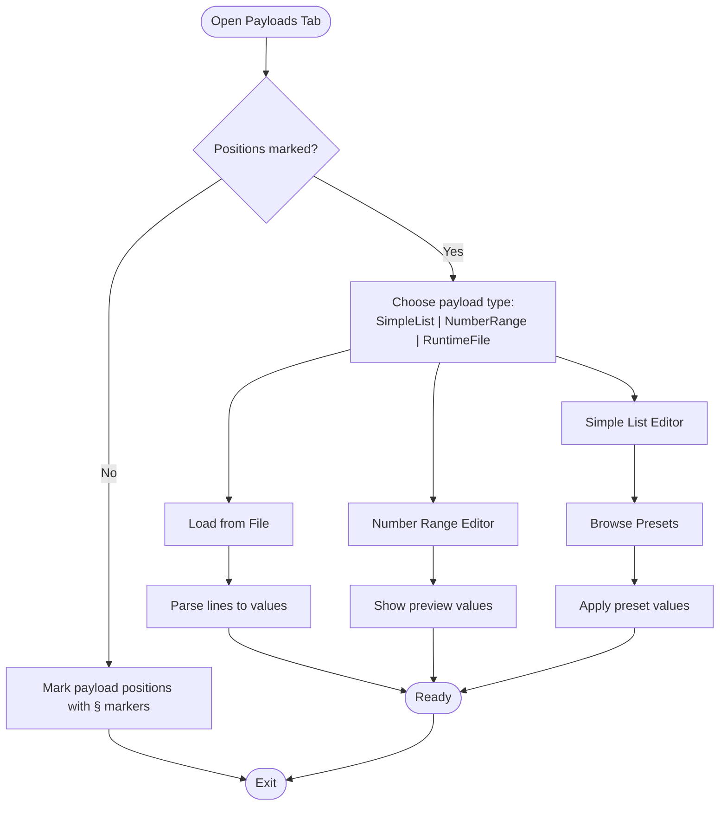
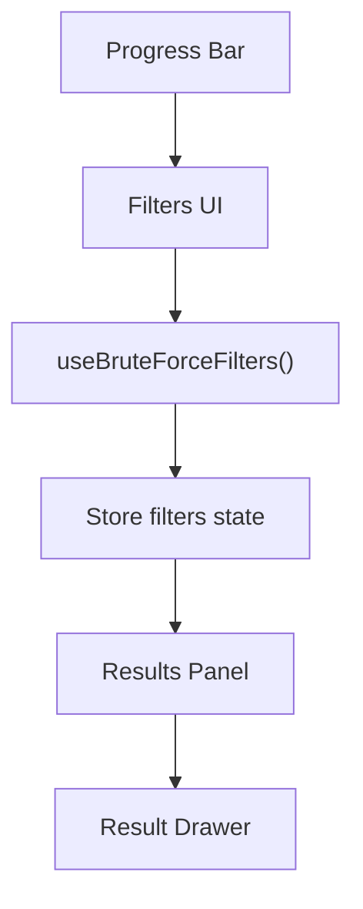
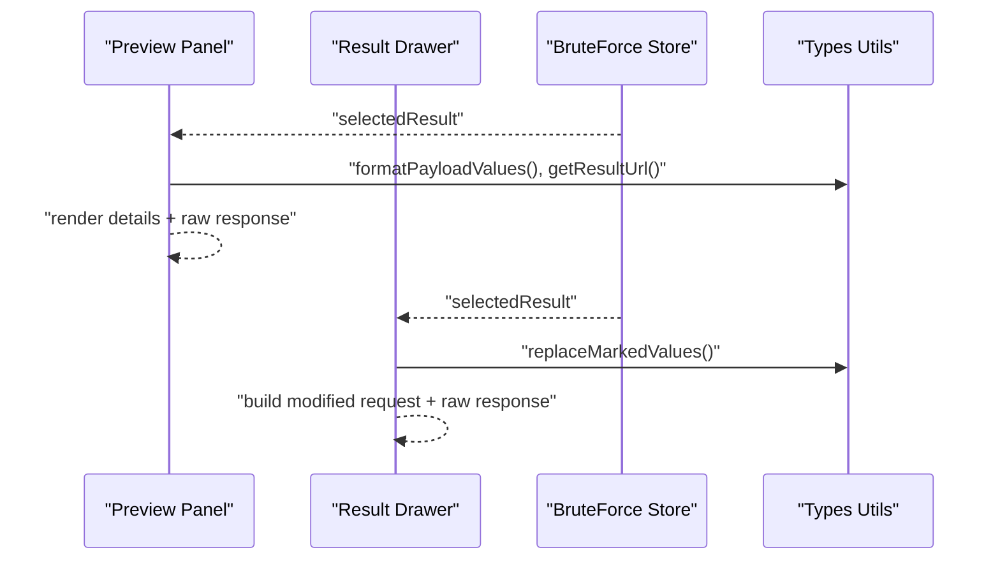
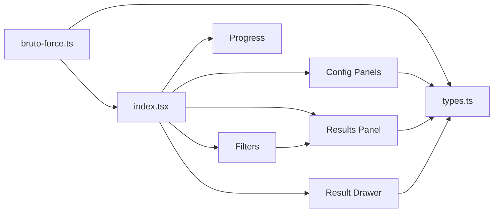

# Brute Force Testing

<cite>
**Referenced Files in This Document**
- [index.tsx](file://src/pages/brute-force/index.tsx)
- [types.ts](file://src/pages/brute-force/types.ts)
- [constants.ts](file://src/pages/brute-force/constants.ts)
- [bruto-force.ts](file://src/stores/bruto-force.ts)
- [filters.tsx](file://src/pages/brute-force/components/filters.tsx)
- [payload-dialog.tsx](file://src/pages/brute-force/components/payload-dialog.tsx)
- [payload-preset-dialog.tsx](file://src/pages/brute-force/components/payload-preset-dialog.tsx)
- [preview-panel.tsx](file://src/pages/brute-force/components/preview-panel.tsx)
- [progress.tsx](file://src/pages/brute-force/components/progress.tsx)
- [request-dialog.tsx](file://src/pages/brute-force/components/request-dialog.tsx)
- [result-drawer.tsx](file://src/pages/brute-force/components/result-drawer.tsx)
- [results-panel.tsx](file://src/pages/brute-force/components/results-panel.tsx)
- [attack-tab.tsx](file://src/pages/brute-force/components/brute-force-config/config/attack-tab.tsx)
- [payloads-tab.tsx](file://src/pages/brute-force/components/brute-force-config/config/payloads-tab.tsx)
- [request-tab.tsx](file://src/pages/brute-force/components/brute-force-config/config/request-tab.tsx)
- [predefined-payloads.ts](file://src/pages/brute-force/data/predefined-payloads.ts)
- [Logins.fuzz.txt](file://src/pages/brute-force/payload/Logins.fuzz.txt)
- [top-usernames-shortlist.txt](file://src/pages/brute-force/payload/usernames/top-usernames-shortlist.txt)
- [actions.txt](file://src/pages/brute-force/payload/api/actions.txt)
- [objects.txt](file://src/pages/brute-force/payload/api/objects.txt)
- [api-endpoints.txt](file://src/pages/brute-force/payload/api/api-endpoints.txt)
- [subdomains-top1million-5000.txt](file://src/pages/brute-force/payload/DNS/subdomains-top1million-5000.txt)
- [BurpSuite-ParamMiner/services-names.txt](file://src/pages/brute-force/payload/BurpSuite-ParamMiner/services-names.txt)
</cite>

## Table of Contents
1. [Introduction](#introduction)
2. [Project Structure](#project-structure)
3. [Core Components](#core-components)
4. [Architecture Overview](#architecture-overview)
5. [Detailed Component Analysis](#detailed-component-analysis)
6. [Dependency Analysis](#dependency-analysis)
7. [Performance Considerations](#performance-considerations)
8. [Troubleshooting Guide](#troubleshooting-guide)
9. [Conclusion](#conclusion)
10. [Appendices](#appendices)

## Introduction
This document explains the Brute Force Testing functionality, focusing on attack configuration, payload management, filtering and progress tracking, request preview, and result visualization. It also covers practical examples, performance optimization, ethical and legal considerations, and troubleshooting for common issues such as rate limiting, account lockouts, and connectivity problems.

## Project Structure
The Brute Force Testing feature is organized around a page component that hosts configuration panels, a results panel, a preview drawer, and supporting UI components. The store manages attack lifecycle, progress events, and results. Types define the configuration and runtime data structures.

**Diagram sources**
- [index.tsx:22-149](file://src/pages/brute-force/index.tsx#L22-L149)
- [bruto-force.ts:338-440](file://src/stores/bruto-force.ts#L338-L440)

**Section sources**
- [index.tsx:22-149](file://src/pages/brute-force/index.tsx#L22-L149)
- [bruto-force.ts:142-470](file://src/stores/bruto-force.ts#L142-L470)

## Core Components
- Attack configuration: defines base request, payload positions, payload sets per position, concurrency, delays, retries, and optional grep match/extract and session handling.
- Payload management: supports simple lists, number ranges, and runtime files; includes preset dialogs and file loading.
- Filtering and progress: filters results by status/payload; displays real-time progress.
- Request preview and result visualization: shows modified request/response for selected result; previews raw response in a dedicated panel.
- Store orchestration: starts/stops attacks, listens to progress/result events, maintains tabbed sessions.

**Section sources**
- [types.ts:62-141](file://src/pages/brute-force/types.ts#L62-L141)
- [types.ts:143-172](file://src/pages/brute-force/types.ts#L143-L172)
- [types.ts:174-182](file://src/pages/brute-force/types.ts#L174-L182)
- [types.ts:196-275](file://src/pages/brute-force/types.ts#L196-L275)
- [constants.ts:3-7](file://src/pages/brute-force/constants.ts#L3-L7)
- [bruto-force.ts:338-440](file://src/stores/bruto-force.ts#L338-L440)

## Architecture Overview
The frontend orchestrates configuration and visualization; the backend executes attacks and emits progress and result events. The store coordinates UI state and Tauri invocations.

**Diagram sources**
- [index.tsx:29-43](file://src/pages/brute-force/index.tsx#L29-L43)
- [bruto-force.ts:338-416](file://src/stores/brute-force.ts#L338-L416)

## Detailed Component Analysis

### Attack Configuration System
- Base request editing: raw HTTP editor with payload marker support and automatic position discovery.
- Attack tuning: delay per request and concurrency settings.
- Payload configuration: per-position payload sets with type-specific editors (simple list, number range, runtime file).
- Grep match/extract and session handling: optional post-processing filters and token extraction/update.

**Diagram sources**
- [types.ts:62-141](file://src/pages/brute-force/types.ts#L62-L141)
- [types.ts:32-41](file://src/pages/brute-force/types.ts#L32-L41)
- [types.ts:25-30](file://src/pages/brute-force/types.ts#L25-L30)

**Section sources**
- [request-tab.tsx:18-126](file://src/pages/brute-force/components/brute-force-config/config/request-tab.tsx#L18-L126)
- [attack-tab.tsx:6-26](file://src/pages/brute-force/components/brute-force-config/config/attack-tab.tsx#L6-L26)
- [payloads-tab.tsx:138-312](file://src/pages/brute-force/components/brute-force-config/config/payloads-tab.tsx#L138-L312)

### Payload Management
- Simple list: newline-separated values; supports loading from file and browsing presets.
- Number range: start/end/step with optional padding/format; generates preview values.
- Runtime file: loads large wordlists from disk.
- Preset dialog: prebuilt payloads for usernames, API terms, DNS entries, and ParamMiner services.

**Diagram sources**
- [payloads-tab.tsx:138-312](file://src/pages/brute-force/components/brute-force-config/config/payloads-tab.tsx#L138-L312)
- [payload-dialog.tsx:8-36](file://src/pages/brute-force/components/payload-dialog.tsx#L8-L36)
- [payload-preset-dialog.tsx](file://src/pages/brute-force/components/payload-preset-dialog.tsx)

**Section sources**
- [payloads-tab.tsx:138-312](file://src/pages/brute-force/components/brute-force-config/config/payloads-tab.tsx#L138-L312)
- [payload-dialog.tsx:8-36](file://src/pages/brute-force/components/payload-dialog.tsx#L8-L36)
- [constants.ts:3-7](file://src/pages/brute-force/constants.ts#L3-L7)

### Filtering System and Progress Tracking
- Filters: status and payload text filters with clear action.
- Progress bar: shows current/total and percentage during attack.
- Results panel: tabular view of results with selection for detailed preview.

**Diagram sources**
- [filters.tsx:9-46](file://src/pages/brute-force/components/filters.tsx#L9-L46)
- [progress.tsx:5-33](file://src/pages/brute-force/components/progress.tsx#L5-L33)
- [results-panel.tsx:8-92](file://src/pages/brute-force/components/results-panel.tsx#L8-L92)

**Section sources**
- [filters.tsx:9-46](file://src/pages/brute-force/components/filters.tsx#L9-L46)
- [progress.tsx:5-33](file://src/pages/brute-force/components/progress.tsx#L5-L33)
- [results-panel.tsx:8-92](file://src/pages/brute-force/components/results-panel.tsx#L8-L92)

### Request Preview and Result Visualization
- Modified request preview: reconstructs the final request with payload substitutions.
- Response preview: renders raw response with pretty JSON for readability.
- Preview panel: lightweight detail view; drawer provides split view of modified request and response.

**Diagram sources**
- [preview-panel.tsx:24-139](file://src/pages/brute-force/components/preview-panel.tsx#L24-L139)
- [result-drawer.tsx:67-137](file://src/pages/brute-force/components/result-drawer.tsx#L67-L137)
- [types.ts:196-275](file://src/pages/brute-force/types.ts#L196-L275)

**Section sources**
- [preview-panel.tsx:24-139](file://src/pages/brute-force/components/preview-panel.tsx#L24-L139)
- [result-drawer.tsx:67-137](file://src/pages/brute-force/components/result-drawer.tsx#L67-L137)

### Practical Examples

- Configure a basic brute force:
  - Open the request tab and paste a raw HTTP request.
  - Mark payload positions using the “Mark Target” action in the request editor.
  - Switch to the payloads tab and choose a payload type (e.g., simple list or number range).
  - Assign values or browse presets for each marked position.
  - Tune delay and concurrency in the attack tab.
  - Start the attack and monitor progress and results.

- Manage large payload sets:
  - Use “Load from File” to import large wordlists.
  - Prefer number ranges for numeric sequences to avoid loading massive lists.
  - Use presets for common categories (usernames, API terms, DNS).

- Interpret results:
  - Filter by status (e.g., 200, 401, 429) or payload content.
  - Inspect the modified request and response in the drawer for deeper analysis.

**Section sources**
- [request-tab.tsx:56-74](file://src/pages/brute-force/components/brute-force-config/config/request-tab.tsx#L56-L74)
- [payloads-tab.tsx:242-289](file://src/pages/brute-force/components/brute-force-config/config/payloads-tab.tsx#L242-L289)
- [filters.tsx:9-46](file://src/pages/brute-force/components/filters.tsx#L9-L46)
- [result-drawer.tsx:67-137](file://src/pages/brute-force/components/result-drawer.tsx#L67-L137)

## Dependency Analysis
The Brute Force feature depends on:
- Store for state and event coordination.
- Types for configuration and request building.
- UI components for editing, previewing, and filtering.
- Predefined payloads and wordlists for quick setup.

**Diagram sources**
- [bruto-force.ts:142-470](file://src/stores/bruto-force.ts#L142-L470)
- [types.ts:104-141](file://src/pages/brute-force/types.ts#L104-L141)
- [index.tsx:22-149](file://src/pages/brute-force/index.tsx#L22-L149)

**Section sources**
- [bruto-force.ts:142-470](file://src/stores/bruto-force.ts#L142-L470)
- [types.ts:104-141](file://src/pages/brute-force/types.ts#L104-L141)
- [index.tsx:22-149](file://src/pages/brute-force/index.tsx#L22-L149)

## Performance Considerations
- Concurrency vs. rate limits: adjust concurrency and delay to avoid overwhelming targets and triggering rate limiting.
- Payload size: use number ranges or runtime files for large sets; avoid loading huge simple lists into memory.
- Network timeouts: configure appropriate delays and retries; monitor for timeouts and transient failures.
- UI responsiveness: keep filters simple; avoid heavy regex on large datasets.

[No sources needed since this section provides general guidance]

## Troubleshooting Guide
- Rate limiting and throttling:
  - Increase delay and reduce concurrency.
  - Use randomized delays if supported by the backend.
- Account lockouts:
  - Reduce speed and vary payloads.
  - Monitor 401/429 responses and pause when detected.
- Network connectivity:
  - Verify base URL and proxy interception settings.
  - Confirm TLS certificates and CA installation if HTTPS is involved.
- No results or empty filters:
  - Ensure payload positions are marked and payloads are assigned.
  - Check grep filters; disable or adjust keywords/regex.
- Stuck or incomplete progress:
  - Stop and restart the attack; inspect start errors.
  - Review backend logs for invocation failures.

**Section sources**
- [bruto-force.ts:338-416](file://src/stores/brute-force.ts#L338-L416)
- [filters.tsx:9-46](file://src/pages/brute-force/components/filters.tsx#L9-L46)

## Conclusion
The Brute Force Testing feature provides a structured workflow for configuring attacks, managing payloads, and analyzing results. By combining flexible payload types, robust filtering, and clear visualization, it supports both targeted and exploratory assessments. Proper configuration of timing and concurrency, along with adherence to ethical and legal guidelines, ensures responsible and effective testing.

[No sources needed since this section summarizes without analyzing specific files]

## Appendices

### Data and Payload Sources
- Predefined payloads and wordlists are included under the brute-force payload directory for quick setup.

**Section sources**
- [predefined-payloads.ts](file://src/pages/brute-force/data/predefined-payloads.ts)
- [Logins.fuzz.txt](file://src/pages/brute-force/payload/Logins.fuzz.txt)
- [top-usernames-shortlist.txt](file://src/pages/brute-force/payload/usernames/top-usernames-shortlist.txt)
- [actions.txt](file://src/pages/brute-force/payload/api/actions.txt)
- [objects.txt](file://src/pages/brute-force/payload/api/objects.txt)
- [api-endpoints.txt](file://src/pages/brute-force/payload/api/api-endpoints.txt)
- [subdomains-top1million-5000.txt](file://src/pages/brute-force/payload/DNS/subdomains-top1million-5000.txt)
- [services-names.txt](file://src/pages/brute-force/payload/BurpSuite-ParamMiner/services-names.txt)