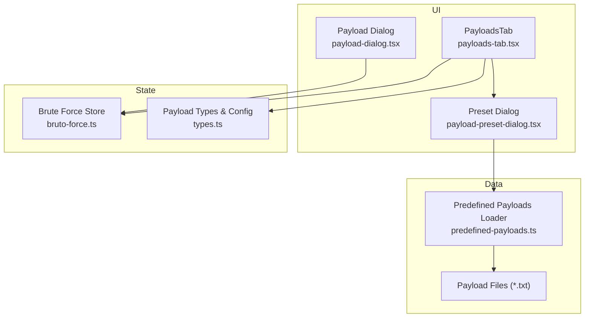
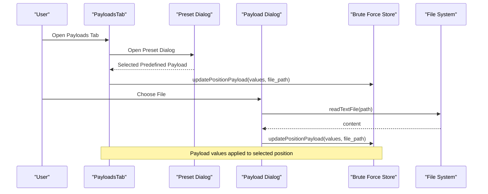
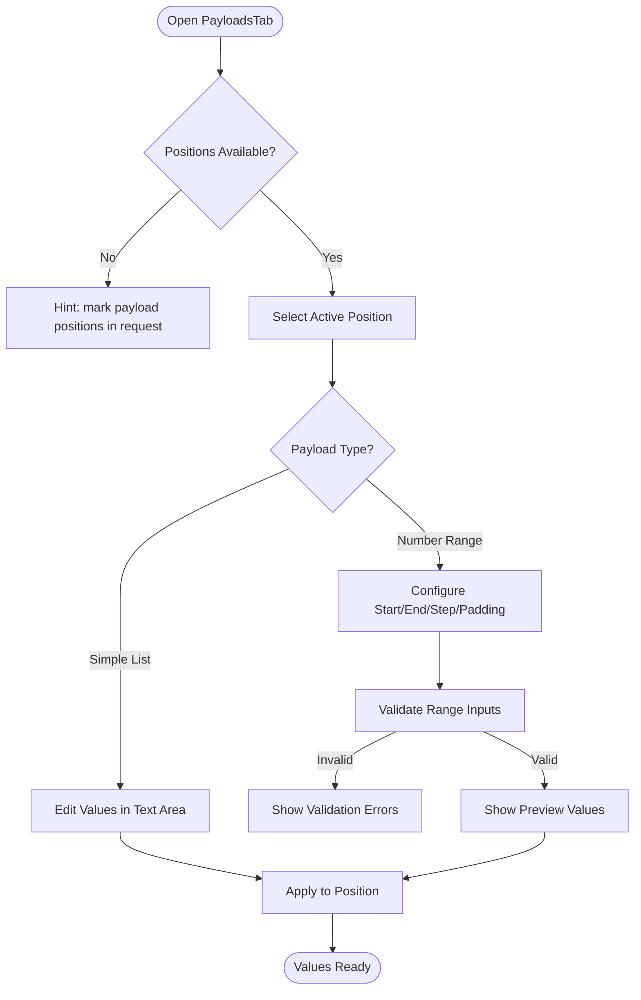
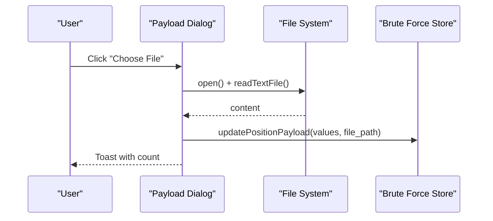
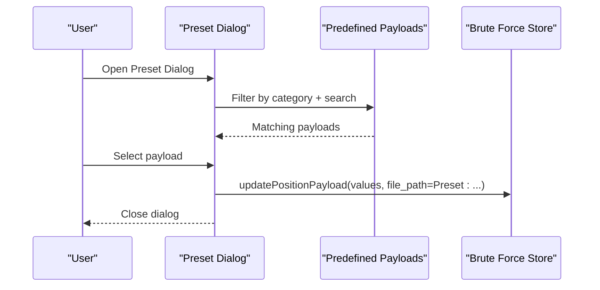
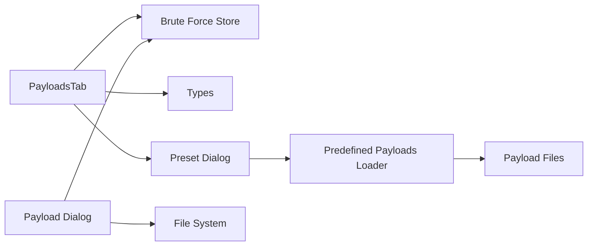

# Payload Management

<cite>
**Referenced Files in This Document**
- [predefined-payloads.ts](file://src/pages/brute-force/data/predefined-payloads.ts)
- [payload-dialog.tsx](file://src/pages/brute-force/components/payload-dialog.tsx)
- [payload-preset-dialog.tsx](file://src/pages/brute-force/components/payload-preset-dialog.tsx)
- [payloads-tab.tsx](file://src/pages/brute-force/components/brute-force-config/config/payloads-tab.tsx)
- [use-payloads.ts](file://src/pages/brute-force/hooks/use-payloads.ts)
- [types.ts](file://src/pages/brute-force/types.ts)
- [bruto-force.ts](file://src/stores/bruto-force.ts)
- [top-usernames-shortlist.txt](file://src/pages/brute-force/payload/usernames/top-usernames-shortlist.txt)
- [subdomains-top1million-5000.txt](file://src/pages/brute-force/payload/DNS/subdomains-top1million-5000.txt)
- [api-endpoints.txt](file://src/pages/brute-force/payload/api/api-endpoints.txt)
- [Logins.fuzz.txt](file://src/pages/brute-force/payload/Logins.fuzz.txt)
</cite>

## Table of Contents
1. [Introduction](#introduction)
2. [Project Structure](#project-structure)
3. [Core Components](#core-components)
4. [Architecture Overview](#architecture-overview)
5. [Detailed Component Analysis](#detailed-component-analysis)
6. [Dependency Analysis](#dependency-analysis)
7. [Performance Considerations](#performance-considerations)
8. [Troubleshooting Guide](#troubleshooting-guide)
9. [Conclusion](#conclusion)
10. [Appendices](#appendices)

## Introduction
This document describes the Payload Management system used in brute force testing. It covers how to create and edit custom payload lists via a dialog interface, how to import external wordlists, and how to browse and apply predefined payload presets. It also explains the underlying data model, available categories and content of built-in wordlists, payload processing utilities, and practical guidance for optimizing payload sets for different attack scenarios.

## Project Structure
The Payload Management system spans several modules:
- Data layer: discovery and loading of predefined payloads from bundled files
- UI dialogs: dialogs for loading payloads from files and browsing presets
- Editor tab: per-position payload configuration (simple list, number range)
- Store: centralized state for active tab, payload values, and processing steps
- Utilities: helpers for formatting and filtering results



**Diagram sources**
- [payloads-tab.tsx:138-312](file://src/pages/brute-force/components/brute-force-config/config/payloads-tab.tsx#L138-L312)
- [payload-dialog.tsx:8-36](file://src/pages/brute-force/components/payload-dialog.tsx#L8-L36)
- [payload-preset-dialog.tsx:30-197](file://src/pages/brute-force/components/payload-preset-dialog.tsx#L30-L197)
- [predefined-payloads.ts:9-47](file://src/pages/brute-force/data/predefined-payloads.ts#L9-L47)
- [bruto-force.ts:142-470](file://src/stores/bruto-force.ts#L142-L470)
- [types.ts:32-41](file://src/pages/brute-force/types.ts#L32-L41)

**Section sources**
- [payloads-tab.tsx:138-312](file://src/pages/brute-force/components/brute-force-config/config/payloads-tab.tsx#L138-L312)
- [payload-dialog.tsx:8-36](file://src/pages/brute-force/components/payload-dialog.tsx#L8-L36)
- [payload-preset-dialog.tsx:30-197](file://src/pages/brute-force/components/payload-preset-dialog.tsx#L30-L197)
- [predefined-payloads.ts:9-47](file://src/pages/brute-force/data/predefined-payloads.ts#L9-L47)
- [bruto-force.ts:142-470](file://src/stores/bruto-force.ts#L142-L470)
- [types.ts:32-41](file://src/pages/brute-force/types.ts#L32-L41)

## Core Components
- PayloadsTab: Manages per-position payload configuration, supports simple list editing, number range generation, and preset/file import.
- Payload Dialog: Allows selecting a local payload file to load into the active payload list.
- Preset Dialog: Browses predefined payloads organized by category, with search and preview.
- Predefined Payloads Loader: Scans payload directory and builds a typed list of payloads with metadata.
- Store: Provides state updates for payload values, processing steps, and active tab configuration.
- Types: Defines payload configuration, processing steps, and helpers for payload positions and request parsing.

**Section sources**
- [payloads-tab.tsx:138-312](file://src/pages/brute-force/components/brute-force-config/config/payloads-tab.tsx#L138-L312)
- [payload-dialog.tsx:8-36](file://src/pages/brute-force/components/payload-dialog.tsx#L8-L36)
- [payload-preset-dialog.tsx:30-197](file://src/pages/brute-force/components/payload-preset-dialog.tsx#L30-L197)
- [predefined-payloads.ts:9-47](file://src/pages/brute-force/data/predefined-payloads.ts#L9-L47)
- [bruto-force.ts:142-470](file://src/stores/bruto-force.ts#L142-L470)
- [types.ts:32-41](file://src/pages/brute-force/types.ts#L32-L41)

## Architecture Overview
The payload pipeline integrates UI, data loading, and state management:



**Diagram sources**
- [payloads-tab.tsx:295-311](file://src/pages/brute-force/components/brute-force-config/config/payloads-tab.tsx#L295-L311)
- [payload-preset-dialog.tsx:75-82](file://src/pages/brute-force/components/payload-preset-dialog.tsx#L75-L82)
- [payload-dialog.tsx:44-78](file://src/pages/brute-force/components/payload-dialog.tsx#L44-L78)
- [use-payloads.ts:44-78](file://src/pages/brute-force/hooks/use-payloads.ts#L44-L78)
- [bruto-force.ts:225-243](file://src/stores/bruto-force.ts#L225-L243)

## Detailed Component Analysis

### PayloadsTab: Position-aware Editor
- Supports multiple payload positions with a tabbed UI.
- Two payload modes:
  - Simple List: editable text area with per-line values.
  - Number Range: generates numeric sequences with format and padding controls.
- Provides quick actions:
  - Browse Presets opens the preset dialog.
  - Load from File opens a file picker and loads values into the current position.
- Validation and previews:
  - Number range validation ensures start/end/step are valid and consistent.
  - Preview displays first N values and total count.



**Diagram sources**
- [payloads-tab.tsx:138-312](file://src/pages/brute-force/components/brute-force-config/config/payloads-tab.tsx#L138-L312)
- [payloads-tab.tsx:17-96](file://src/pages/brute-force/components/brute-force-config/config/payloads-tab.tsx#L17-L96)

**Section sources**
- [payloads-tab.tsx:138-312](file://src/pages/brute-force/components/brute-force-config/config/payloads-tab.tsx#L138-L312)

### Payload Dialog: Local File Import
- Opens a native file picker restricted to text-based payload files.
- Reads file content, splits by newline, trims blank lines, and applies to the active payload list.
- Updates store state and shows success/error notifications.



**Diagram sources**
- [payload-dialog.tsx:8-36](file://src/pages/brute-force/components/payload-dialog.tsx#L8-L36)
- [use-payloads.ts:44-78](file://src/pages/brute-force/hooks/use-payloads.ts#L44-L78)

**Section sources**
- [payload-dialog.tsx:8-36](file://src/pages/brute-force/components/payload-dialog.tsx#L8-L36)
- [use-payloads.ts:44-78](file://src/pages/brute-force/hooks/use-payloads.ts#L44-L78)

### Preset Dialog: Predefined Wordlists
- Loads all bundled payload files and exposes them as a searchable, categorized list.
- Supports category filtering and free-text search across name and description.
- Shows a preview of values and total count; allows applying a preset to the active position.



**Diagram sources**
- [payload-preset-dialog.tsx:30-197](file://src/pages/brute-force/components/payload-preset-dialog.tsx#L30-L197)
- [predefined-payloads.ts:41-47](file://src/pages/brute-force/data/predefined-payloads.ts#L41-L47)

**Section sources**
- [payload-preset-dialog.tsx:30-197](file://src/pages/brute-force/components/payload-preset-dialog.tsx#L30-L197)
- [predefined-payloads.ts:9-47](file://src/pages/brute-force/data/predefined-payloads.ts#L9-L47)

### Predefined Payloads Data Model and Categories
- Data structure: each payload has an id, category, name, description, and array of values.
- Discovery: scans payload directory recursively, reads files, and splits by newline.
- Categories: derived from directory names; defaults to General for root-level files.

Available categories and representative content:
- usernames: shortlist of common usernames
- DNS: subdomains and services lists
- api: endpoint lists (various formats)
- General: login-related fuzz paths

Examples of included files:
- [top-usernames-shortlist.txt:1-18](file://src/pages/brute-force/payload/usernames/top-usernames-shortlist.txt#L1-L18)
- [subdomains-top1million-5000.txt:1-800](file://src/pages/brute-force/payload/DNS/subdomains-top1million-5000.txt#L1-L800)
- [api-endpoints.txt:1-289](file://src/pages/brute-force/payload/api/api-endpoints.txt#L1-L289)
- [Logins.fuzz.txt:1-90](file://src/pages/brute-force/payload/Logins.fuzz.txt#L1-L90)

**Section sources**
- [predefined-payloads.ts:22-43](file://src/pages/brute-force/data/predefined-payloads.ts#L22-L43)
- [top-usernames-shortlist.txt:1-18](file://src/pages/brute-force/payload/usernames/top-usernames-shortlist.txt#L1-L18)
- [subdomains-top1million-5000.txt:1-800](file://src/pages/brute-force/payload/DNS/subdomains-top1million-5000.txt#L1-L800)
- [api-endpoints.txt:1-289](file://src/pages/brute-force/payload/api/api-endpoints.txt#L1-L289)
- [Logins.fuzz.txt:1-90](file://src/pages/brute-force/payload/Logins.fuzz.txt#L1-L90)

### Payload Processing Utilities and Validation
- Payload processing steps include URL encode/decode, Base64 encode/decode, and hashing (MD5, SHA1, SHA256).
- Validation utilities:
  - Number range validation checks start/end/step and direction.
  - Helpers compute preview values and total count for ranges.
- Request parsing helpers support marking and extracting payload positions in requests.

```mermaid
classDiagram
class PayloadConfig {
+PayloadType payload_type
+string[] values
+string file_path
+number number_start
+number number_end
+number number_step
+string number_format
+PayloadProcessingStep[] processing
}
class PayloadProcessingStep {
<<enum>>
"UrlEncode"
"UrlDecode"
"Base64Encode"
"Base64Decode"
"Md5Hash"
"Sha1Hash"
"Sha256Hash"
}
class PayloadTypes {
+createDefaultPayloadConfig()
+payloadConfigHasValues()
+findPayloadPositions()
+applyPayloadToPosition()
}
PayloadConfig --> PayloadProcessingStep : "uses"
PayloadTypes --> PayloadConfig : "creates/validates"
```

**Diagram sources**
- [types.ts:16-41](file://src/pages/brute-force/types.ts#L16-L41)
- [types.ts:143-172](file://src/pages/brute-force/types.ts#L143-L172)
- [types.ts:196-260](file://src/pages/brute-force/types.ts#L196-L260)

**Section sources**
- [types.ts:16-41](file://src/pages/brute-force/types.ts#L16-L41)
- [types.ts:143-172](file://src/pages/brute-force/types.ts#L143-L172)
- [types.ts:196-260](file://src/pages/brute-force/types.ts#L196-L260)

## Dependency Analysis
- PayloadsTab depends on:
  - Store for updating payload values per position
  - Types for payload configuration and helpers
  - Preset Dialog for applying predefined payloads
- Payload Dialog and Preset Dialog both update the store with values and optional file_path metadata.
- Predefined payloads loader depends on Vite’s glob importer to read bundled files at build time.



**Diagram sources**
- [payloads-tab.tsx:138-312](file://src/pages/brute-force/components/brute-force-config/config/payloads-tab.tsx#L138-L312)
- [payload-dialog.tsx:8-36](file://src/pages/brute-force/components/payload-dialog.tsx#L8-L36)
- [payload-preset-dialog.tsx:30-197](file://src/pages/brute-force/components/payload-preset-dialog.tsx#L30-L197)
- [predefined-payloads.ts:9-13](file://src/pages/brute-force/data/predefined-payloads.ts#L9-L13)
- [bruto-force.ts:225-243](file://src/stores/bruto-force.ts#L225-L243)

**Section sources**
- [payloads-tab.tsx:138-312](file://src/pages/brute-force/components/brute-force-config/config/payloads-tab.tsx#L138-L312)
- [payload-dialog.tsx:8-36](file://src/pages/brute-force/components/payload-dialog.tsx#L8-L36)
- [payload-preset-dialog.tsx:30-197](file://src/pages/brute-force/components/payload-preset-dialog.tsx#L30-L197)
- [predefined-payloads.ts:9-13](file://src/pages/brute-force/data/predefined-payloads.ts#L9-L13)
- [bruto-force.ts:225-243](file://src/stores/bruto-force.ts#L225-L243)

## Performance Considerations
- Large payload sets:
  - Prefer number ranges for numeric sequences to avoid loading massive lists.
  - Use file-based payloads for very large static lists; the UI supports loading from file.
- Duplicate removal:
  - The system does not implement automatic deduplication. Consider de-duplicating external lists before import.
- Preview limits:
  - The preset preview caps at a fixed number of entries; for very large lists, rely on counts rather than full previews.
- Processing overhead:
  - Payload processing steps (encoding/hash) are applied per request; keep the number of steps minimal for performance.

[No sources needed since this section provides general guidance]

## Troubleshooting Guide
Common issues and resolutions:
- Empty or invalid number range:
  - Ensure start, end, and step are valid numbers and step is non-zero; direction must match bounds.
- File import fails:
  - Confirm the file is readable and contains one payload per line; blank lines are ignored.
- Preset not appearing:
  - Verify the file is placed under the payload directory; categories derive from directory names.
- Applying to wrong position:
  - Make sure payload positions are marked in the request and the correct position is selected in the tab.

**Section sources**
- [payloads-tab.tsx:17-96](file://src/pages/brute-force/components/brute-force-config/config/payloads-tab.tsx#L17-L96)
- [use-payloads.ts:44-78](file://src/pages/brute-force/hooks/use-payloads.ts#L44-L78)
- [payload-preset-dialog.tsx:41-55](file://src/pages/brute-force/components/payload-preset-dialog.tsx#L41-L55)

## Conclusion
The Payload Management system provides flexible mechanisms to define, import, and organize payloads for brute force testing. Users can author custom lists, import external wordlists, and leverage curated presets grouped by category. The system’s types and store enable robust configuration and processing, while UI components streamline the workflow for different attack scenarios.

[No sources needed since this section summarizes without analyzing specific files]

## Appendices

### Practical Examples
- Building a custom username list:
  - Use the simple list editor in the Payloads Tab to paste or edit usernames.
  - Save and apply to the appropriate position.
- Importing an external wordlist:
  - Use the “Load from File” action to import a .txt/.lst/.wordlist file.
  - The system trims blank lines and applies the values to the current position.
- Using a predefined DNS subdomains list:
  - Open the Preset Dialog, select the DNS category, choose a subdomains file, and apply to the target position.
- Organizing payloads for login brute force:
  - Combine usernames from the usernames preset with login fuzz paths from the General category.
  - Optionally generate numeric suffixes via Number Range for iterations.

[No sources needed since this section provides general guidance]