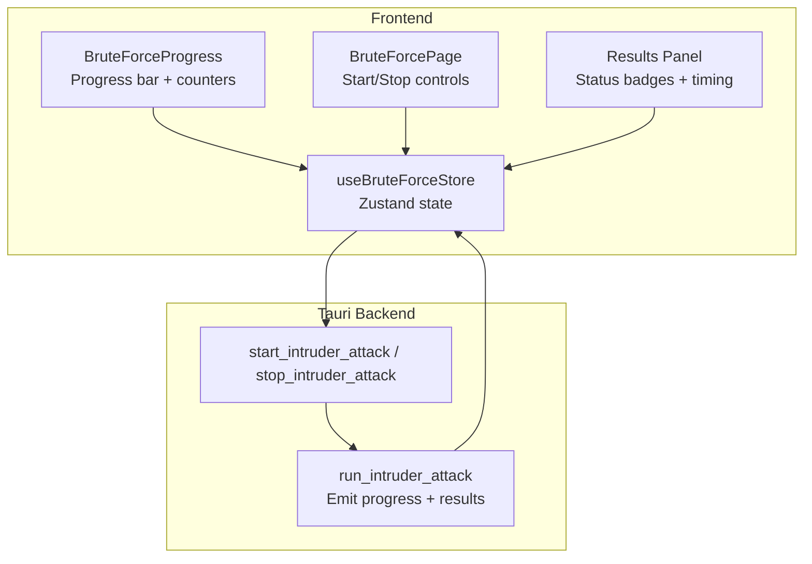
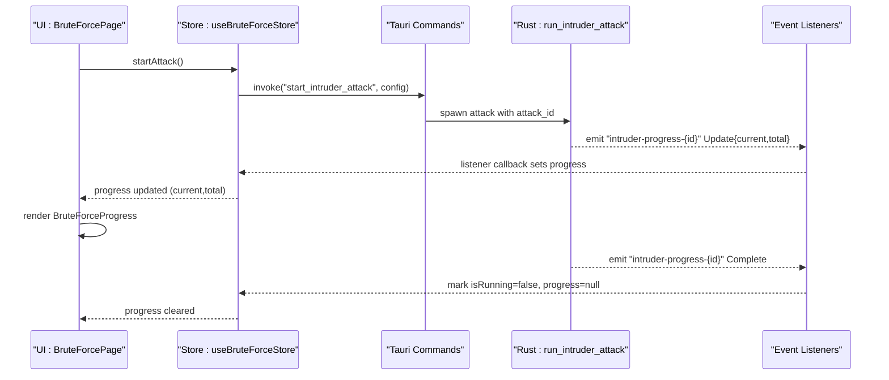
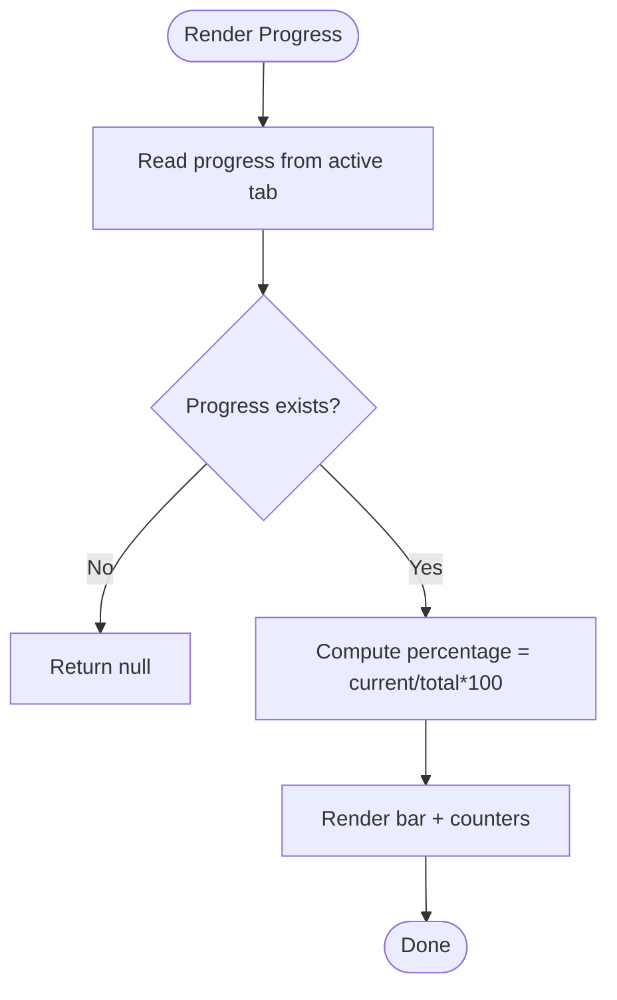
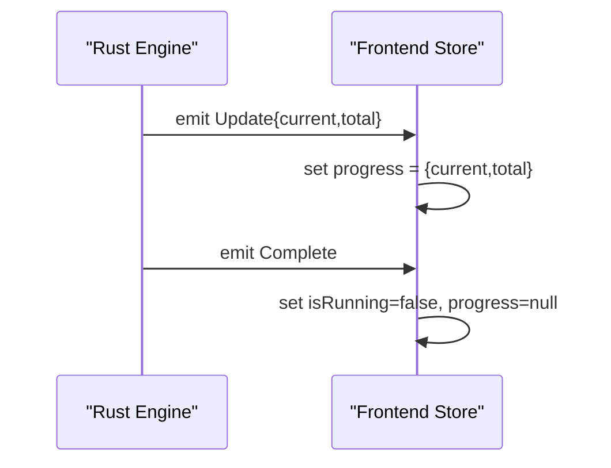
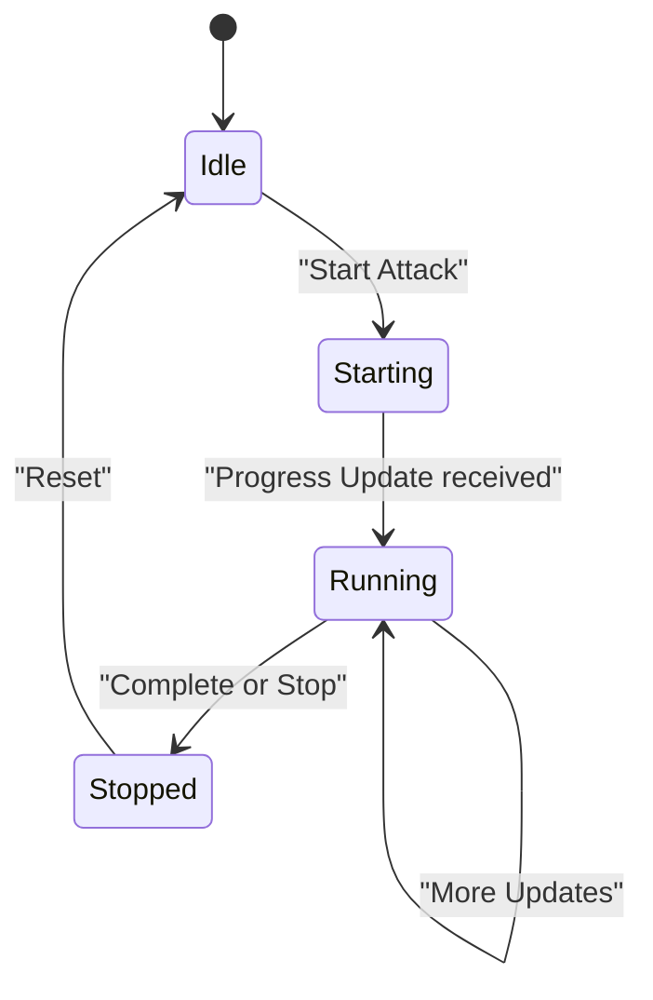
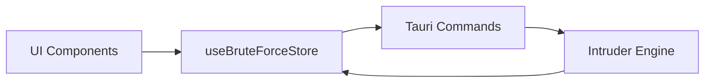

# Progress Monitoring

<cite>
**Referenced Files in This Document**
- [progress.tsx](file://src/pages/brute-force/components/progress.tsx)
- [bruto-force.ts](file://src/stores/bruto-force.ts)
- [index.tsx](file://src/pages/brute-force/index.tsx)
- [types.ts](file://src/pages/brute-force/types.ts)
- [use-page.ts](file://src/pages/brute-force/hooks/use-page.ts)
- [results-panel.tsx](file://src/pages/brute-force/components/results-panel.tsx)
- [filters.tsx](file://src/pages/brute-force/components/filters.tsx)
- [result-drawer.tsx](file://src/pages/brute-force/components/result-drawer.tsx)
- [intruder.rs](file://src-tauri/src/commands/intruder.rs)
</cite>

## Table of Contents
1. [Introduction](#introduction)
2. [Project Structure](#project-structure)
3. [Core Components](#core-components)
4. [Architecture Overview](#architecture-overview)
5. [Detailed Component Analysis](#detailed-component-analysis)
6. [Dependency Analysis](#dependency-analysis)
7. [Performance Considerations](#performance-considerations)
8. [Troubleshooting Guide](#troubleshooting-guide)
9. [Conclusion](#conclusion)

## Introduction
This document explains the Progress Monitoring system for brute force operations in the application. It covers how progress is tracked, displayed, and consumed by the UI, how real-time statistics are represented, and how pause/resume and persistence are handled. It also provides practical examples for long-running attacks, interpretation of progress data, and performance tuning strategies.

## Project Structure
The progress monitoring spans three layers:
- Frontend UI and state: React components and a Zustand store
- Application state and orchestration: Store subscriptions to Tauri events
- Backend engine: Rust intruder command emitting progress and results

**Diagram sources**
- [progress.tsx:1-34](file://src/pages/brute-force/components/progress.tsx#L1-L34)
- [index.tsx:1-150](file://src/pages/brute-force/index.tsx#L1-L150)
- [results-panel.tsx:1-93](file://src/pages/brute-force/components/results-panel.tsx#L1-L93)
- [bruto-force.ts:1-470](file://src/stores/bruto-force.ts#L1-L470)
- [intruder.rs:164-207](file://src-tauri/src/commands/intruder.rs#L164-L207)

**Section sources**
- [progress.tsx:1-34](file://src/pages/brute-force/components/progress.tsx#L1-L34)
- [bruto-force.ts:1-470](file://src/stores/brute-force.ts#L1-L470)
- [index.tsx:1-150](file://src/pages/brute-force/index.tsx#L1-L150)
- [types.ts:1-275](file://src/pages/brute-force/types.ts#L1-L275)
- [use-page.ts:1-127](file://src/pages/brute-force/hooks/use-page.ts#L1-L127)
- [results-panel.tsx:1-93](file://src/pages/brute-force/components/results-panel.tsx#L1-L93)
- [filters.tsx:1-47](file://src/pages/brute-force/components/filters.tsx#L1-L47)
- [result-drawer.tsx:1-138](file://src/pages/brute-force/components/result-drawer.tsx#L1-L138)
- [intruder.rs:164-207](file://src-tauri/src/commands/intruder.rs#L164-L207)

## Core Components
- Progress bar and counters: Displays current/total attempts and percentage.
- Running badge: Shows live counts while an attack runs.
- Store-driven events: Subscribes to progress and result events keyed by attack ID.
- Backend engine: Emits progress updates and finalization signals.

Key responsibilities:
- Frontend rendering: [BruteForceProgress:5-33](file://src/pages/brute-force/components/progress.tsx#L5-L33)
- Store orchestration: [useBruteForceStore:142-470](file://src/stores/brute-force.ts#L142-L470)
- Page controls: [BruteForcePage:22-149](file://src/pages/brute-force/index.tsx#L22-L149)
- Types and events: [types.ts:78-102](file://src/pages/brute-force/types.ts#L78-L102), [intruder.rs:111-116](file://src-tauri/src/commands/intruder.rs#L111-L116)

**Section sources**
- [progress.tsx:1-34](file://src/pages/brute-force/components/progress.tsx#L1-L34)
- [bruto-force.ts:1-470](file://src/stores/brute-force.ts#L1-L470)
- [index.tsx:1-150](file://src/pages/brute-force/index.tsx#L1-L150)
- [types.ts:1-275](file://src/pages/brute-force/types.ts#L1-L275)
- [intruder.rs:111-116](file://src-tauri/src/commands/intruder.rs#L111-L116)

## Architecture Overview
End-to-end flow from backend to frontend progress display:

**Diagram sources**
- [bruto-force.ts:338-416](file://src/stores/bruto-force.ts#L338-L416)
- [index.tsx:102-112](file://src/pages/brute-force/index.tsx#L102-L112)
- [progress.tsx:5-33](file://src/pages/brute-force/components/progress.tsx#L5-L33)
- [intruder.rs:164-207](file://src-tauri/src/commands/intruder.rs#L164-L207)
- [types.ts:78-82](file://src/pages/brute-force/types.ts#L78-L82)

## Detailed Component Analysis

### Progress Bar and Status Indicators
- Current position: current attempts processed
- Total attempts: total payload combinations to evaluate
- Percentage: derived from current/total
- Live badge: animated pulse badge shows current/total while running

Rendering logic and calculation:
- Percentage computation and DOM: [BruteForceProgress:15-30](file://src/pages/brute-force/components/progress.tsx#L15-L30)
- Live badge in toolbar: [BruteForcePage:95-99](file://src/pages/brute-force/index.tsx#L95-L99)

**Diagram sources**
- [progress.tsx:5-33](file://src/pages/brute-force/components/progress.tsx#L5-L33)

**Section sources**
- [progress.tsx:1-34](file://src/pages/brute-force/components/progress.tsx#L1-L34)
- [index.tsx:95-99](file://src/pages/brute-force/index.tsx#L95-L99)

### Real-Time Statistics Display
- Results panel shows per-result metrics:
  - Status badges with color-coded categories
  - Response length and response time (ms)
- Filtering allows quick inspection of outcomes

Statistics sources:
- Results table: [Results Panel:38-78](file://src/pages/brute-force/components/results-panel.tsx#L38-L78)
- Filters: [Filters:9-46](file://src/pages/brute-force/components/filters.tsx#L9-L46)

Note: The current implementation does not expose global throughput (requests per second), memory usage, or network bandwidth metrics in the UI. These would require extending the backend to emit richer telemetry and updating the store and UI accordingly.

**Section sources**
- [results-panel.tsx:1-93](file://src/pages/brute-force/components/results-panel.tsx#L1-L93)
- [filters.tsx:1-47](file://src/pages/brute-force/components/filters.tsx#L1-L47)

### Backend Progress Emission
- Backend emits two event types:
  - Update: carries current and total counts
  - Complete: signals end of attack
- Store listens to these events and updates state

Backend implementation highlights:
- Event types: [IntruderProgress:111-116](file://src-tauri/src/commands/intruder.rs#L111-L116)
- Emit loop: [run_intruder_attack:328-344](file://src-tauri/src/commands/intruder.rs#L328-L344)
- Start/stop commands: [start_intruder_attack:164-190](file://src-tauri/src/commands/intruder.rs#L164-L190), [stop_intruder_attack:192-207](file://src-tauri/src/commands/intruder.rs#L192-L207)

**Diagram sources**
- [intruder.rs:111-116](file://src-tauri/src/commands/intruder.rs#L111-L116)
- [intruder.rs:328-344](file://src-tauri/src/commands/intruder.rs#L328-L344)
- [bruto-force.ts:373-390](file://src/stores/brute-force.ts#L373-L390)

**Section sources**
- [types.ts:78-82](file://src/pages/brute-force/types.ts#L78-L82)
- [bruto-force.ts:373-390](file://src/stores/brute-force.ts#L373-L390)
- [intruder.rs:111-116](file://src-tauri/src/commands/intruder.rs#L111-L116)
- [intruder.rs:328-344](file://src-tauri/src/commands/intruder.rs#L328-L344)

### Pause/Resume and Attack Lifecycle
- Start: validates configuration and invokes backend; subscribes to progress/result events
- Stop: sends stop command and cleans up listeners; clears running state
- Completion: backend emits Complete; frontend clears progress and running flag

Lifecycle actions:
- Start: [startAttack:338-416](file://src/stores/brute-force.ts#L338-L416)
- Stop: [stopAttack:418-436](file://src/stores/bruto-force.ts#L418-L436)
- UI controls: [BruteForcePage:102-112](file://src/pages/brute-force/index.tsx#L102-L112)

**Diagram sources**
- [bruto-force.ts:338-436](file://src/stores/brute-force.ts#L338-L436)
- [index.tsx:102-112](file://src/pages/brute-force/index.tsx#L102-L112)

**Section sources**
- [bruto-force.ts:338-436](file://src/stores/bruto-force.ts#L338-L436)
- [index.tsx:102-112](file://src/pages/brute-force/index.tsx#L102-L112)

### Progress Persistence Across Sessions
- The store holds per-tab progress and results during a session.
- There is no explicit persistence mechanism documented in the code reviewed. Progress resets when closing tabs or restarting the app.

Evidence:
- Tab reset on close and cleanup of listeners: [closeTab:166-190](file://src/stores/bruto-force.ts#L166-L190)
- Listener cleanup on stop/close: [cleanupTabListeners:122-127](file://src/stores/bruto-force.ts#L122-L127)

**Section sources**
- [bruto-force.ts:122-190](file://src/stores/bruto-force.ts#L122-L190)

### Practical Examples and Interpretation
- Long-running attack:
  - Observe the animated badge and progress bar; percentage increases as updates arrive.
  - Use the results panel to inspect outcomes and response times.
- Interpreting progress data:
  - current/total indicates how many payload combinations have been evaluated out of the planned workload.
  - response_time_ms in results helps estimate throughput trends.
- Optimizing performance:
  - Adjust concurrency and delays to balance speed and rate limiting.
  - Use filtering to focus on interesting statuses or payloads.

[No sources needed since this section provides general guidance]

## Dependency Analysis
- Frontend depends on the store for progress and results.
- Store depends on Tauri commands for starting/stopping and listening to events.
- Backend depends on HTTP client and concurrency primitives to emit progress.

**Diagram sources**
- [bruto-force.ts:1-470](file://src/stores/brute-force.ts#L1-L470)
- [index.tsx:1-150](file://src/pages/brute-force/index.tsx#L1-L150)
- [intruder.rs:164-207](file://src-tauri/src/commands/intruder.rs#L164-L207)

**Section sources**
- [bruto-force.ts:1-470](file://src/stores/brute-force.ts#L1-L470)
- [index.tsx:1-150](file://src/pages/brute-force/index.tsx#L1-L150)
- [types.ts:1-275](file://src/pages/brute-force/types.ts#L1-L275)
- [intruder.rs:164-207](file://src-tauri/src/commands/intruder.rs#L164-L207)

## Performance Considerations
- Concurrency and delays:
  - Tune concurrency and per-request delay to avoid overwhelming targets and hitting rate limits.
- Payload volume:
  - Large payload sets increase total attempts; monitor progress bar and adjust strategies.
- Backend throughput:
  - The backend emits progress per completed request; UI responsiveness depends on event frequency and rendering cost.
- Memory and CPU:
  - Large result sets can increase memory usage; use filters to reduce visible dataset.

[No sources needed since this section provides general guidance]

## Troubleshooting Guide
- Attack does not start:
  - Verify base URL and payload positions; the page displays a blocking reason when prerequisites are missing.
  - See: [use-page.ts:44-51](file://src/pages/brute-force/hooks/use-page.ts#L44-L51)
- No progress updates:
  - Confirm the attack is running and the correct tab is active; check that progress events are being emitted and listeners attached.
  - See: [startAttack:338-416](file://src/stores/brute-force.ts#L338-L416)
- Stop does not work:
  - Ensure the stop command reaches the backend and cancellation flag is set.
  - See: [stop_intruder_attack:192-207](file://src-tauri/src/commands/intruder.rs#L192-L207)
- Results not appearing:
  - Confirm result events are emitted and appended to the tab’s results array.
  - See: [result events:392-400](file://src/stores/brute-force.ts#L392-L400)

**Section sources**
- [use-page.ts:44-51](file://src/pages/brute-force/hooks/use-page.ts#L44-L51)
- [bruto-force.ts:338-416](file://src/stores/bruto-force.ts#L338-L416)
- [bruto-force.ts:392-400](file://src/stores/bruto-force.ts#L392-L400)
- [intruder.rs:192-207](file://src-tauri/src/commands/intruder.rs#L192-L207)

## Conclusion
The Progress Monitoring system provides a clear, real-time view of brute force operations via a progress bar, live badge, and per-result metrics. The backend emits structured progress updates and finalization signals, which the frontend consumes to keep the UI synchronized. While pause/resume and persistence are supported conceptually, persistence across sessions is not implemented in the reviewed code. Extending the backend to emit richer telemetry (e.g., requests per second, memory usage) would further enhance operational insights.