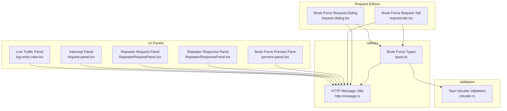
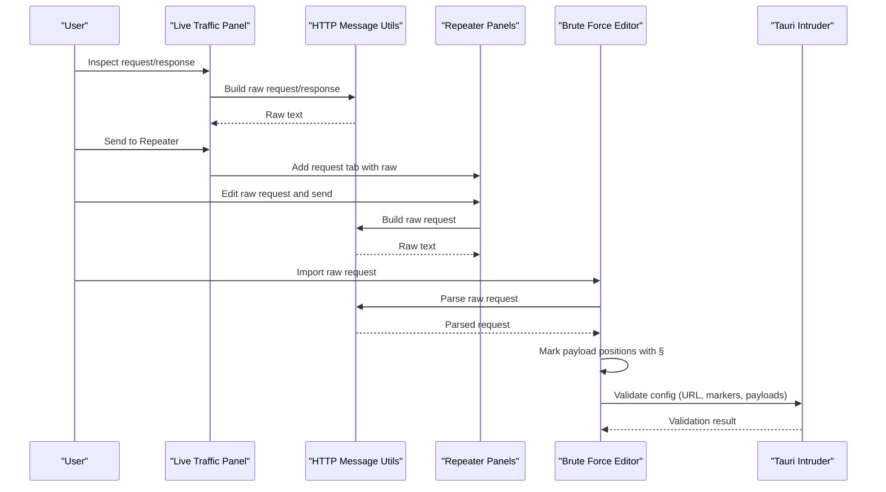
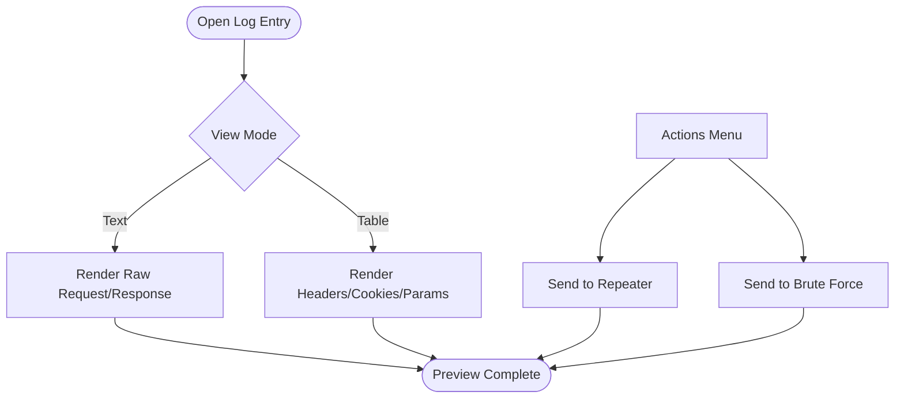
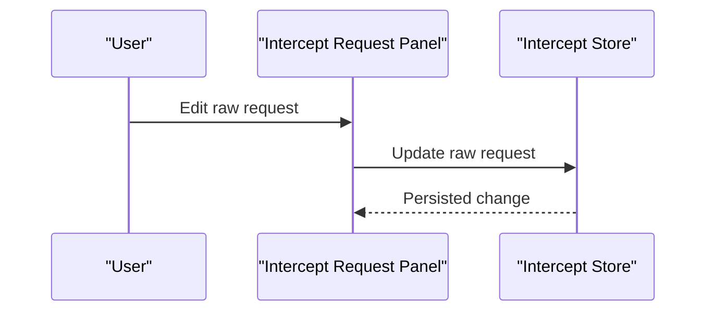
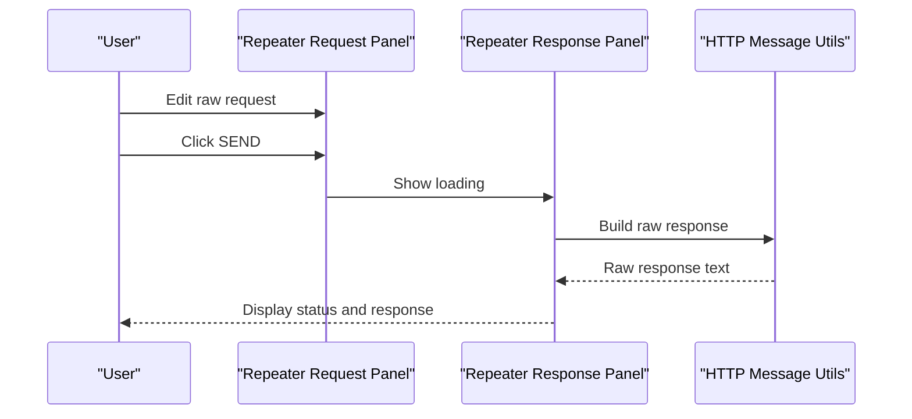
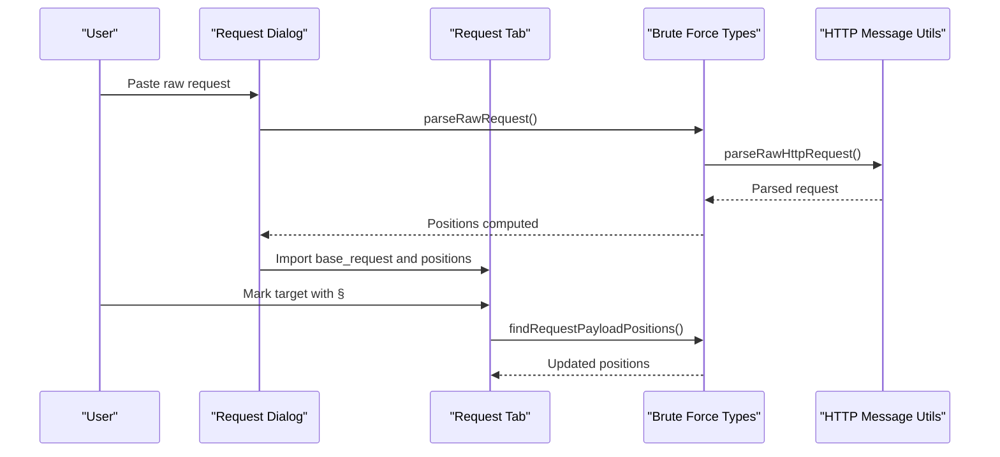
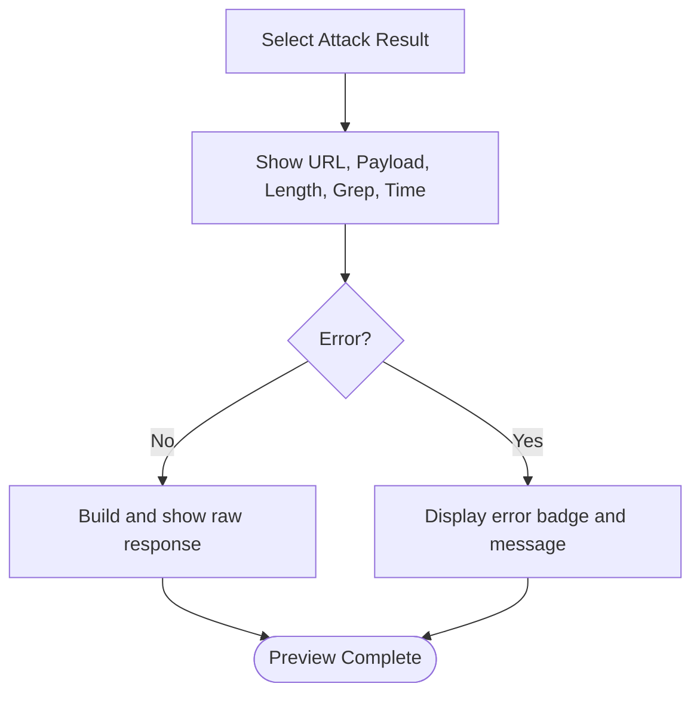
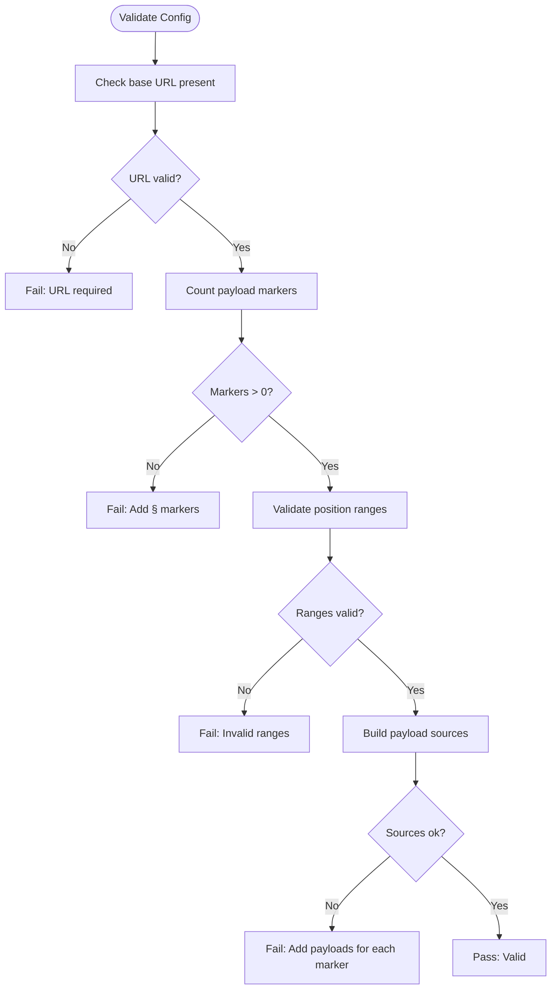
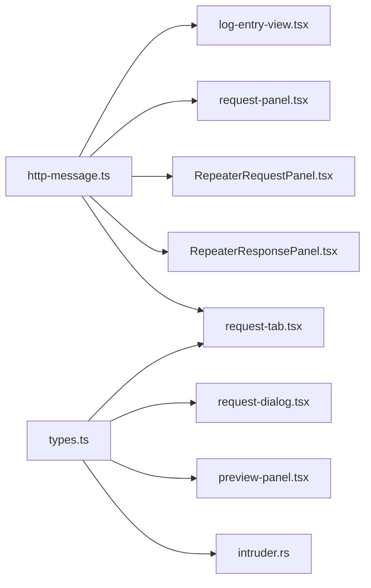

# Request Preview

<cite>
**Referenced Files in This Document**
- [http-message.ts](file://src/lib/http-message.ts)
- [log-entry-view.tsx](file://src/pages/live-traffic/components/log-table/log-entry-view.tsx)
- [request-panel.tsx](file://src/pages/intercept/components/request-panel.tsx)
- [RepeaterRequestPanel.tsx](file://src/pages/repeater/components/RepeaterRequestPanel.tsx)
- [RepeaterResponsePanel.tsx](file://src/pages/repeater/components/RepeaterResponsePanel.tsx)
- [preview-panel.tsx](file://src/pages/brute-force/components/preview-panel.tsx)
- [request-dialog.tsx](file://src/pages/brute-force/components/request-dialog.tsx)
- [request-tab.tsx](file://src/pages/brute-force/components/brute-force-config/config/request-tab.tsx)
- [types.ts](file://src/pages/brute-force/types.ts)
- [intruder.rs](file://src-tauri/src/commands/intruder.rs)
</cite>

## Table of Contents
1. [Introduction](#introduction)
2. [Project Structure](#project-structure)
3. [Core Components](#core-components)
4. [Architecture Overview](#architecture-overview)
5. [Detailed Component Analysis](#detailed-component-analysis)
6. [Dependency Analysis](#dependency-analysis)
7. [Performance Considerations](#performance-considerations)
8. [Troubleshooting Guide](#troubleshooting-guide)
9. [Conclusion](#conclusion)

## Introduction
This document explains the Request Preview and Validation system across the Live Traffic, Interception, Repeater, and Brute Force modules. It covers:
- The preview panel interface for examining HTTP requests before execution (method, headers, body, authentication parameters)
- The request dialog for detailed inspection and modification of individual request configurations
- Request validation features that detect malformed requests, missing parameters, and payload configuration issues
- Preview functionality for testing request formats and validating endpoint responses
- Practical examples for debugging authentication issues, optimizing request formats, and ensuring proper credential injection
- Template management, dynamic parameter substitution, and batch validation techniques

## Project Structure
The Request Preview and Validation system spans UI panels, request parsing/building utilities, and backend validation logic:
- Live Traffic: request/response inspection and quick actions
- Interception: editable raw request capture
- Repeater: send and preview request/response
- Brute Force: request import, payload marking, and batch validation
- Shared utilities: HTTP message parsing and building

**Diagram sources**
- [log-entry-view.tsx:50-324](file://src/pages/live-traffic/components/log-table/log-entry-view.tsx#L50-L324)
- [request-panel.tsx:9-46](file://src/pages/intercept/components/request-panel.tsx#L9-L46)
- [RepeaterRequestPanel.tsx:15-53](file://src/pages/repeater/components/RepeaterRequestPanel.tsx#L15-L53)
- [RepeaterResponsePanel.tsx:16-115](file://src/pages/repeater/components/RepeaterResponsePanel.tsx#L16-L115)
- [preview-panel.tsx:24-140](file://src/pages/brute-force/components/preview-panel.tsx#L24-L140)
- [request-dialog.tsx:16-73](file://src/pages/brute-force/components/request-dialog.tsx#L16-L73)
- [request-tab.tsx:18-127](file://src/pages/brute-force/components/brute-force-config/config/request-tab.tsx#L18-L127)
- [types.ts:1-275](file://src/pages/brute-force/types.ts#L1-L275)
- [http-message.ts:1-287](file://src/lib/http-message.ts#L1-L287)
- [intruder.rs:209-1122](file://src-tauri/src/commands/intruder.rs#L209-L1122)

**Section sources**
- [log-entry-view.tsx:50-324](file://src/pages/live-traffic/components/log-table/log-entry-view.tsx#L50-L324)
- [request-panel.tsx:9-46](file://src/pages/intercept/components/request-panel.tsx#L9-L46)
- [RepeaterRequestPanel.tsx:15-53](file://src/pages/repeater/components/RepeaterRequestPanel.tsx#L15-L53)
- [RepeaterResponsePanel.tsx:16-115](file://src/pages/repeater/components/RepeaterResponsePanel.tsx#L16-L115)
- [preview-panel.tsx:24-140](file://src/pages/brute-force/components/preview-panel.tsx#L24-L140)
- [request-dialog.tsx:16-73](file://src/pages/brute-force/components/request-dialog.tsx#L16-L73)
- [request-tab.tsx:18-127](file://src/pages/brute-force/components/brute-force-config/config/request-tab.tsx#L18-L127)
- [types.ts:1-275](file://src/pages/brute-force/types.ts#L1-L275)
- [http-message.ts:1-287](file://src/lib/http-message.ts#L1-L287)
- [intruder.rs:209-1122](file://src-tauri/src/commands/intruder.rs#L209-L1122)

## Core Components
- HTTP message parsing and building utilities provide canonical request/response rendering and validation support.
- Live Traffic panel renders request/response in text or structured views, supports sending to Repeater and Brute Force, and toggles between text and table modes.
- Intercept panel displays and edits raw intercepted requests.
- Repeater panels allow editing a raw request and previewing the response, including status badges and timing.
- Brute Force request dialog and tab enable importing raw requests, marking payload positions with § markers, and validating payload configuration.
- Backend validation enforces presence of URL, payload markers, and payload sources.

**Section sources**
- [http-message.ts:158-287](file://src/lib/http-message.ts#L158-L287)
- [log-entry-view.tsx:150-324](file://src/pages/live-traffic/components/log-table/log-entry-view.tsx#L150-L324)
- [request-panel.tsx:29-45](file://src/pages/intercept/components/request-panel.tsx#L29-L45)
- [RepeaterRequestPanel.tsx:15-53](file://src/pages/repeater/components/RepeaterRequestPanel.tsx#L15-L53)
- [RepeaterResponsePanel.tsx:16-115](file://src/pages/repeater/components/RepeaterResponsePanel.tsx#L16-L115)
- [request-dialog.tsx:30-73](file://src/pages/brute-force/components/request-dialog.tsx#L30-L73)
- [request-tab.tsx:42-74](file://src/pages/brute-force/components/brute-force-config/config/request-tab.tsx#L42-L74)
- [types.ts:220-275](file://src/pages/brute-force/types.ts#L220-L275)
- [intruder.rs:209-240](file://src-tauri/src/commands/intruder.rs#L209-L240)

## Architecture Overview
The system centers on a shared HTTP message utility that builds and parses raw HTTP messages. UI panels consume this utility to present requests and responses. Brute Force integrates with backend validation to ensure requests are well-formed and payload sources are configured.

**Diagram sources**
- [log-entry-view.tsx:77-111](file://src/pages/live-traffic/components/log-table/log-entry-view.tsx#L77-L111)
- [http-message.ts:158-287](file://src/lib/http-message.ts#L158-L287)
- [RepeaterRequestPanel.tsx:15-53](file://src/pages/repeater/components/RepeaterRequestPanel.tsx#L15-L53)
- [RepeaterResponsePanel.tsx:16-115](file://src/pages/repeater/components/RepeaterResponsePanel.tsx#L16-L115)
- [request-dialog.tsx:30-73](file://src/pages/brute-force/components/request-dialog.tsx#L30-L73)
- [types.ts:220-275](file://src/pages/brute-force/types.ts#L220-L275)
- [intruder.rs:209-240](file://src-tauri/src/commands/intruder.rs#L209-L240)

## Detailed Component Analysis

### Live Traffic Request Preview
- Renders request/response in either text or table mode.
- Provides quick actions to send to Repeater and Brute Force.
- Builds raw request/response using shared utilities and formats JSON bodies.

**Diagram sources**
- [log-entry-view.tsx:150-324](file://src/pages/live-traffic/components/log-table/log-entry-view.tsx#L150-L324)
- [http-message.ts:158-239](file://src/lib/http-message.ts#L158-L239)

**Section sources**
- [log-entry-view.tsx:150-324](file://src/pages/live-traffic/components/log-table/log-entry-view.tsx#L150-L324)
- [http-message.ts:158-239](file://src/lib/http-message.ts#L158-L239)

### Intercept Request Panel
- Displays and allows editing of raw intercepted HTTP request.
- Uses a text editor with read-only state when no request is selected.

**Diagram sources**
- [request-panel.tsx:29-45](file://src/pages/intercept/components/request-panel.tsx#L29-L45)

**Section sources**
- [request-panel.tsx:9-46](file://src/pages/intercept/components/request-panel.tsx#L9-L46)

### Repeater Request and Response Preview
- Request panel: edit raw request and send.
- Response panel: show status badge, timing, and formatted raw response; handle loading and error states.

**Diagram sources**
- [RepeaterRequestPanel.tsx:15-53](file://src/pages/repeater/components/RepeaterRequestPanel.tsx#L15-L53)
- [RepeaterResponsePanel.tsx:16-115](file://src/pages/repeater/components/RepeaterResponsePanel.tsx#L16-L115)
- [http-message.ts:230-239](file://src/lib/http-message.ts#L230-L239)

**Section sources**
- [RepeaterRequestPanel.tsx:15-53](file://src/pages/repeater/components/RepeaterRequestPanel.tsx#L15-L53)
- [RepeaterResponsePanel.tsx:16-115](file://src/pages/repeater/components/RepeaterResponsePanel.tsx#L16-L115)
- [http-message.ts:230-239](file://src/lib/http-message.ts#L230-L239)

### Brute Force Request Import and Payload Positioning
- Request dialog: paste raw HTTP request; parse and import into base request; compute payload positions.
- Request tab: edit raw request; auto-parse and update payload positions; mark target with § markers.

**Diagram sources**
- [request-dialog.tsx:30-73](file://src/pages/brute-force/components/request-dialog.tsx#L30-L73)
- [request-tab.tsx:42-74](file://src/pages/brute-force/components/brute-force-config/config/request-tab.tsx#L42-L74)
- [types.ts:220-275](file://src/pages/brute-force/types.ts#L220-L275)
- [http-message.ts:176-228](file://src/lib/http-message.ts#L176-L228)

**Section sources**
- [request-dialog.tsx:16-73](file://src/pages/brute-force/components/request-dialog.tsx#L16-L73)
- [request-tab.tsx:18-127](file://src/pages/brute-force/components/brute-force-config/config/request-tab.tsx#L18-L127)
- [types.ts:220-275](file://src/pages/brute-force/types.ts#L220-L275)
- [http-message.ts:176-228](file://src/lib/http-message.ts#L176-L228)

### Brute Force Preview Pane
- Shows response detail for selected result: URL, payload values, length, grep match, time, extracted data, and raw response.
- Uses shared response building utility and badge variants for status.

**Diagram sources**
- [preview-panel.tsx:24-140](file://src/pages/brute-force/components/preview-panel.tsx#L24-L140)
- [http-message.ts:230-239](file://src/lib/http-message.ts#L230-L239)

**Section sources**
- [preview-panel.tsx:24-140](file://src/pages/brute-force/components/preview-panel.tsx#L24-L140)
- [http-message.ts:230-239](file://src/lib/http-message.ts#L230-L239)

### Backend Validation for Request Templates
- Enforces required fields and payload configuration:
  - Base request URL must be present
  - At least one payload position marker (§) must be present
  - Payload positions must have valid ranges
  - Payload sources must be provided for each marked position or a single payload source must exist

**Diagram sources**
- [intruder.rs:209-240](file://src-tauri/src/commands/intruder.rs#L209-L240)

**Section sources**
- [intruder.rs:209-240](file://src-tauri/src/commands/intruder.rs#L209-L240)

## Dependency Analysis
- UI panels depend on shared HTTP message utilities for building and formatting raw requests/responses.
- Brute Force request parsing and payload positioning depend on shared types and parsing utilities.
- Backend validation depends on Brute Force types and payload configuration.

**Diagram sources**
- [http-message.ts:1-287](file://src/lib/http-message.ts#L1-L287)
- [log-entry-view.tsx:1-324](file://src/pages/live-traffic/components/log-table/log-entry-view.tsx#L1-L324)
- [request-panel.tsx:1-46](file://src/pages/intercept/components/request-panel.tsx#L1-L46)
- [RepeaterRequestPanel.tsx:1-53](file://src/pages/repeater/components/RepeaterRequestPanel.tsx#L1-L53)
- [RepeaterResponsePanel.tsx:1-115](file://src/pages/repeater/components/RepeaterResponsePanel.tsx#L1-L115)
- [request-tab.tsx:1-127](file://src/pages/brute-force/components/brute-force-config/config/request-tab.tsx#L1-L127)
- [request-dialog.tsx:1-73](file://src/pages/brute-force/components/request-dialog.tsx#L1-L73)
- [preview-panel.tsx:1-140](file://src/pages/brute-force/components/preview-panel.tsx#L1-L140)
- [types.ts:1-275](file://src/pages/brute-force/types.ts#L1-L275)
- [intruder.rs:209-1122](file://src-tauri/src/commands/intruder.rs#L209-L1122)

**Section sources**
- [http-message.ts:1-287](file://src/lib/http-message.ts#L1-L287)
- [types.ts:1-275](file://src/pages/brute-force/types.ts#L1-L275)
- [intruder.rs:209-1122](file://src-tauri/src/commands/intruder.rs#L209-L1122)

## Performance Considerations
- Prefer table mode for large headers/params to reduce rendering overhead.
- Use JSON formatting only when content-type indicates JSON to avoid unnecessary processing.
- Minimize payload marker scanning by limiting the number of positions and payloads.
- Defer heavy operations until after initial parsing/validation passes.

## Troubleshooting Guide
Common issues and resolutions:
- Malformed request line or missing URL:
  - Symptom: Parsing fails or URL missing error.
  - Resolution: Ensure the request line includes a method and target; include an absolute URL or a Host header.
  - Reference: [parseRawHttpRequest:176-228](file://src/lib/http-message.ts#L176-L228)
- Missing payload markers:
  - Symptom: Validation fails requiring payload positions.
  - Resolution: Mark target locations with § in URL, headers, or body; ensure at least one marker exists.
  - Reference: [validate_intruder_config:209-240](file://src-tauri/src/commands/intruder.rs#L209-L240)
- Invalid payload position ranges:
  - Symptom: Validation reports invalid ranges.
  - Resolution: Ensure start ≤ end for each position; re-mark selections carefully.
  - Reference: [validate_intruder_config:209-240](file://src-tauri/src/commands/intruder.rs#L209-L240)
- No payloads configured:
  - Symptom: Validation requires payloads for each marker or a single payload source.
  - Resolution: Assign payloads per position or provide a single payload source.
  - Reference: [validate_intruder_config:209-240](file://src-tauri/src/commands/intruder.rs#L209-L240)
- Authentication failures:
  - Use Repeater to test credentials and headers independently; compare raw request outputs.
  - Verify Host header and default ports are handled correctly.
  - Reference: [buildRawHttpRequest:158-174](file://src/lib/http-message.ts#L158-L174), [RepeaterRequestPanel:15-53](file://src/pages/repeater/components/RepeaterRequestPanel.tsx#L15-L53), [RepeaterResponsePanel:16-115](file://src/pages/repeater/components/RepeaterResponsePanel.tsx#L16-L115)

**Section sources**
- [http-message.ts:158-228](file://src/lib/http-message.ts#L158-L228)
- [intruder.rs:209-240](file://src-tauri/src/commands/intruder.rs#L209-L240)
- [RepeaterRequestPanel.tsx:15-53](file://src/pages/repeater/components/RepeaterRequestPanel.tsx#L15-L53)
- [RepeaterResponsePanel.tsx:16-115](file://src/pages/repeater/components/RepeaterResponsePanel.tsx#L16-L115)

## Conclusion
The Request Preview and Validation system provides a cohesive workflow for inspecting, editing, and validating HTTP requests across Live Traffic, Interception, Repeater, and Brute Force. Shared HTTP utilities ensure consistent request/response rendering, while backend validation guarantees well-formed templates with properly configured payloads. Use the preview panels to debug authentication issues, optimize request formats, and validate endpoint responses efficiently.