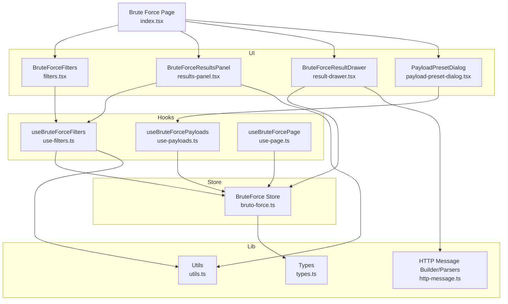
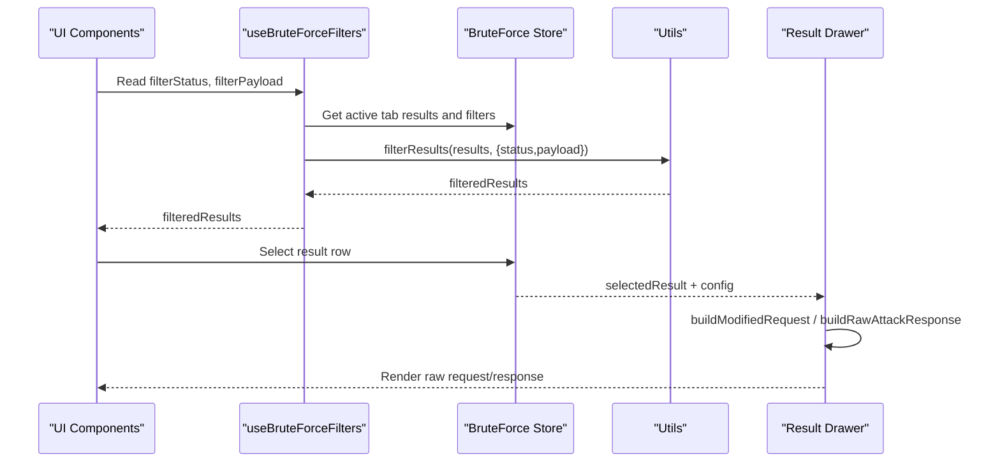
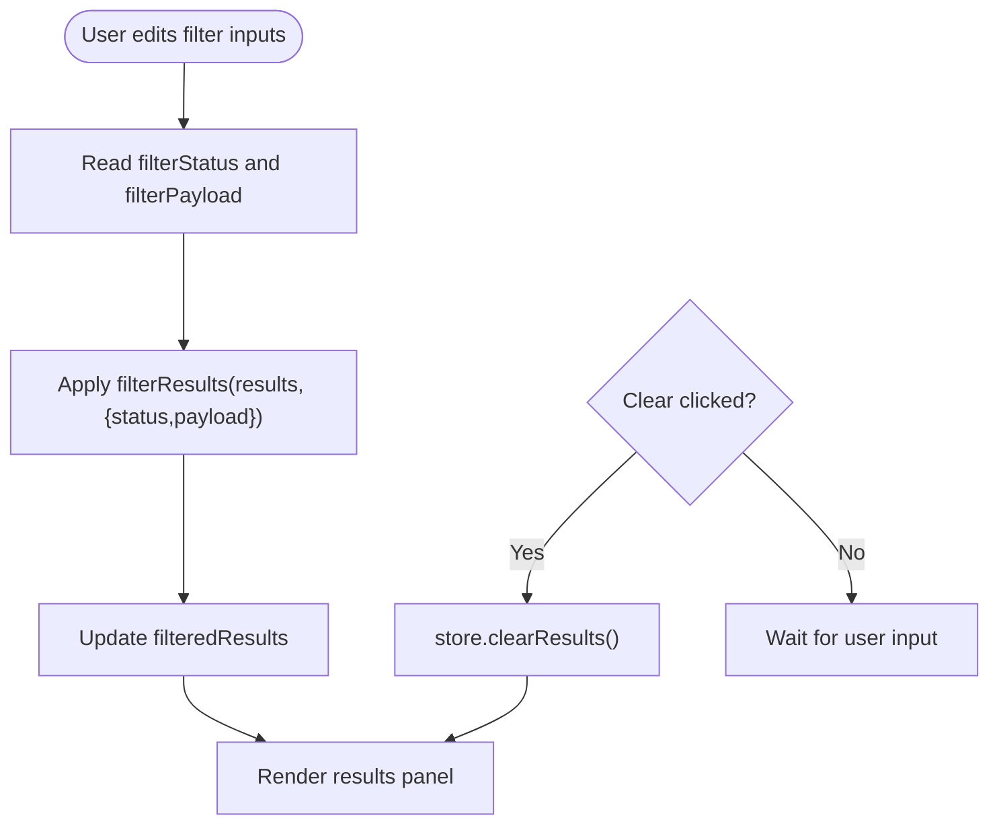
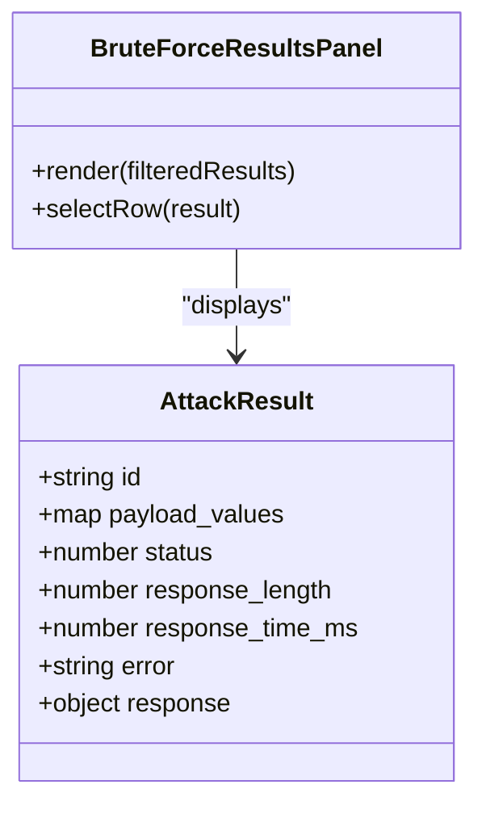
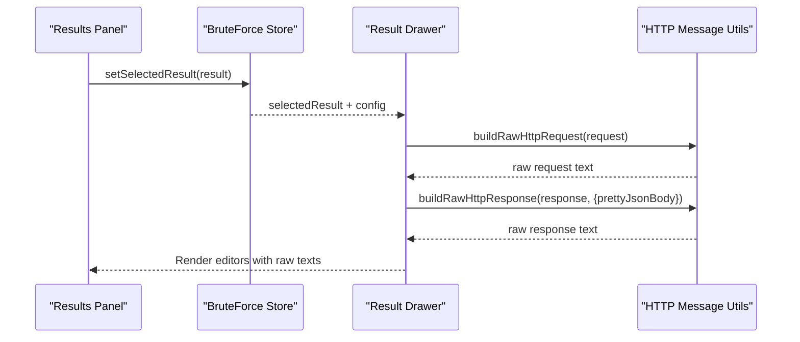
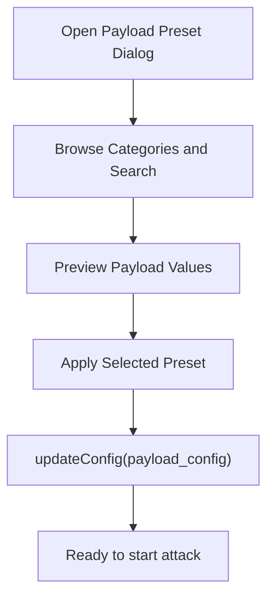
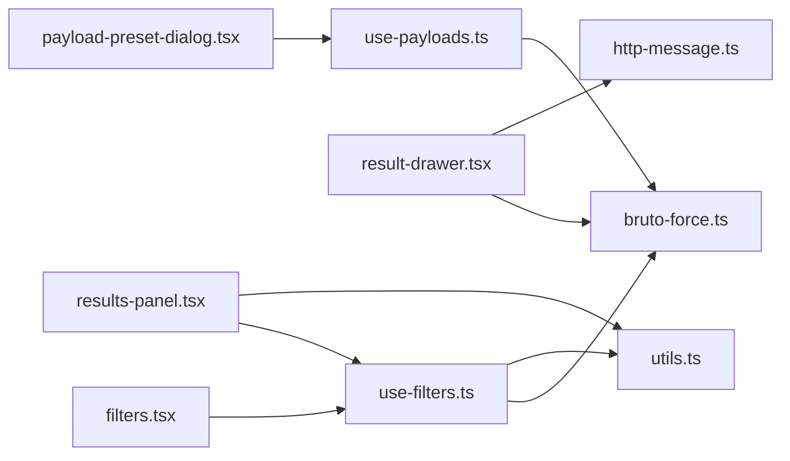

# Result Analysis

<cite>
**Referenced Files in This Document**
- [filters.tsx](file://src/pages/brute-force/components/filters.tsx)
- [results-panel.tsx](file://src/pages/brute-force/components/results-panel.tsx)
- [result-drawer.tsx](file://src/pages/brute-force/components/result-drawer.tsx)
- [use-filters.ts](file://src/pages/brute-force/hooks/use-filters.ts)
- [bruto-force.ts](file://src/stores/bruto-force.ts)
- [utils.ts](file://src/pages/brute-force/lib/utils.ts)
- [types.ts](file://src/pages/brute-force/types.ts)
- [http-message.ts](file://src/lib/http-message.ts)
- [payload-preset-dialog.tsx](file://src/pages/brute-force/components/payload-preset-dialog.tsx)
- [use-payloads.ts](file://src/pages/brute-force/hooks/use-payloads.ts)
- [index.tsx](file://src/pages/brute-force/index.tsx)
- [use-page.ts](file://src/pages/brute-force/hooks/use-page.ts)
</cite>

## Table of Contents
1. [Introduction](#introduction)
2. [Project Structure](#project-structure)
3. [Core Components](#core-components)
4. [Architecture Overview](#architecture-overview)
5. [Detailed Component Analysis](#detailed-component-analysis)
6. [Dependency Analysis](#dependency-analysis)
7. [Performance Considerations](#performance-considerations)
8. [Troubleshooting Guide](#troubleshooting-guide)
9. [Conclusion](#conclusion)
10. [Appendices](#appendices)

## Introduction
This document explains the Result Analysis and Filtering system for brute force attacks. It covers how to filter results by status codes, payload content, and other criteria; how the results panel displays outcomes; how the result drawer enables deep inspection of individual requests and responses; and how to configure filters and manage saved payload presets. Practical examples demonstrate analyzing brute force outcomes, identifying successful credentials, detecting rate limiting, and extracting intelligence for reporting.

## Project Structure
The Result Analysis and Filtering system lives within the Brute Force page and integrates with the global brute force store. The key elements are:
- Filters UI for narrowing results by status and payload content
- Results panel displaying rows of outcomes with quick status indicators
- Result drawer for inspecting raw request/response and timing metadata
- Store-managed filters and results lifecycle
- Utilities for filtering and building raw HTTP messages
- Payload preset dialog and payload loading hooks for configuring attack inputs

**Diagram sources**
- [index.tsx:22-149](file://src/pages/brute-force/index.tsx#L22-L149)
- [filters.tsx:9-46](file://src/pages/brute-force/components/filters.tsx#L9-L46)
- [results-panel.tsx:8-92](file://src/pages/brute-force/components/results-panel.tsx#L8-L92)
- [result-drawer.tsx:67-137](file://src/pages/brute-force/components/result-drawer.tsx#L67-L137)
- [payload-preset-dialog.tsx:30-197](file://src/pages/brute-force/components/payload-preset-dialog.tsx#L30-L197)
- [use-filters.ts:5-29](file://src/pages/brute-force/hooks/use-filters.ts#L5-L29)
- [use-payloads.ts:7-84](file://src/pages/brute-force/hooks/use-payloads.ts#L7-L84)
- [use-page.ts:11-126](file://src/pages/brute-force/hooks/use-page.ts#L11-L126)
- [bruto-force.ts:142-470](file://src/stores/bruto-force.ts#L142-L470)
- [utils.ts:13-34](file://src/pages/brute-force/lib/utils.ts#L13-L34)
- [http-message.ts:158-239](file://src/lib/http-message.ts#L158-L239)
- [types.ts:84-102](file://src/pages/brute-force/types.ts#L84-L102)

**Section sources**
- [index.tsx:22-149](file://src/pages/brute-force/index.tsx#L22-L149)

## Core Components
- Filters UI: Two text inputs to filter by status code and payload content, plus a Clear action.
- Results Panel: Tabular view of outcomes with columns for payload, URL, status, response length, and response time.
- Result Drawer: Side-by-side editors for the modified request and response, plus timing metadata.
- Filter Hook: Computes filtered results from the active tab’s results and filter terms.
- Store: Holds per-tab results, selected result, filters, and exposes actions to start/stop/clear.
- Utilities: Filtering logic and helpers for formatting payload values and URLs.
- Payload Presets: Dialog to browse and apply predefined payload sets.

**Section sources**
- [filters.tsx:9-46](file://src/pages/brute-force/components/filters.tsx#L9-L46)
- [results-panel.tsx:8-92](file://src/pages/brute-force/components/results-panel.tsx#L8-L92)
- [result-drawer.tsx:67-137](file://src/pages/brute-force/components/result-drawer.tsx#L67-L137)
- [use-filters.ts:5-29](file://src/pages/brute-force/hooks/use-filters.ts#L5-L29)
- [bruto-force.ts:25-118](file://src/stores/bruto-force.ts#L25-L118)
- [utils.ts:13-34](file://src/pages/brute-force/lib/utils.ts#L13-L34)
- [payload-preset-dialog.tsx:30-197](file://src/pages/brute-force/components/payload-preset-dialog.tsx#L30-L197)

## Architecture Overview
The system follows a unidirectional data flow:
- UI components render state from the brute force store.
- Hooks compute derived data (e.g., filtered results).
- Actions mutate store state (start attack, update filters, select result).
- Utilities provide pure transformations for filtering and raw HTTP rendering.

**Diagram sources**
- [use-filters.ts:5-29](file://src/pages/brute-force/hooks/use-filters.ts#L5-L29)
- [utils.ts:13-34](file://src/pages/brute-force/lib/utils.ts#L13-L34)
- [bruto-force.ts:324-328](file://src/stores/bruto-force.ts#L324-L328)
- [result-drawer.tsx:67-137](file://src/pages/brute-force/components/result-drawer.tsx#L67-L137)

## Detailed Component Analysis

### Filters UI
- Purpose: Narrow results by status code and payload content.
- Behavior:
  - Status filter compares the numeric status of each result to the input.
  - Payload filter performs a case-insensitive substring match against formatted payload values.
  - Clear button clears all results for the active tab.

**Diagram sources**
- [filters.tsx:9-46](file://src/pages/brute-force/components/filters.tsx#L9-L46)
- [use-filters.ts:15-18](file://src/pages/brute-force/hooks/use-filters.ts#L15-L18)
- [utils.ts:13-34](file://src/pages/brute-force/lib/utils.ts#L13-L34)
- [bruto-force.ts:438-439](file://src/stores/brute-force.ts#L438-L439)

**Section sources**
- [filters.tsx:9-46](file://src/pages/brute-force/components/filters.tsx#L9-L46)
- [use-filters.ts:5-29](file://src/pages/brute-force/hooks/use-filters.ts#L5-L29)
- [utils.ts:13-34](file://src/pages/brute-force/lib/utils.ts#L13-L34)
- [bruto-force.ts:327-328](file://src/stores/brute-force.ts#L327-L328)

### Results Panel
- Purpose: Present a scrollable table of outcomes with quick visual cues.
- Columns:
  - Payload: Formatted key=value pairs for the payload values.
  - URL: Final URL from the response.
  - Status: Badge color indicates success vs. error vs. other categories.
  - Length: Response length.
  - Time: Response time in milliseconds.
- Selection: Clicking a row selects the result for detailed inspection in the drawer.

**Diagram sources**
- [results-panel.tsx:8-92](file://src/pages/brute-force/components/results-panel.tsx#L8-L92)
- [types.ts:84-102](file://src/pages/brute-force/types.ts#L84-L102)

**Section sources**
- [results-panel.tsx:8-92](file://src/pages/brute-force/components/results-panel.tsx#L8-L92)
- [utils.ts:3-11](file://src/pages/brute-force/lib/utils.ts#L3-L11)
- [types.ts:84-102](file://src/pages/brute-force/types.ts#L84-L102)

### Result Drawer
- Purpose: Inspect the exact request sent and the server’s response for a selected result.
- Features:
  - Modified request: Applies payload values to the base request template and renders the final HTTP request.
  - Response: Renders the HTTP response with optional pretty-printed JSON body.
  - Timing: Displays response time for the selected result.
- Data sources:
  - Uses the active tab’s config and selected result to reconstruct the request.
  - Uses HTTP message utilities to build raw request/response text.

**Diagram sources**
- [result-drawer.tsx:67-137](file://src/pages/brute-force/components/result-drawer.tsx#L67-L137)
- [http-message.ts:158-239](file://src/lib/http-message.ts#L158-L239)
- [bruto-force.ts:324-328](file://src/stores/brute-force.ts#L324-L328)

**Section sources**
- [result-drawer.tsx:67-137](file://src/pages/brute-force/components/result-drawer.tsx#L67-L137)
- [http-message.ts:158-239](file://src/lib/http-message.ts#L158-L239)

### Filter Configuration and Saved Presets
- Filter configuration:
  - Per-tab filterStatus and filterPayload are stored in the brute force store.
  - Filtering is computed reactively via a memoized hook.
- Saved filter presets:
  - Payload presets are organized by category and searchable.
  - Users can preview and apply predefined payload sets to quickly configure attacks.

**Diagram sources**
- [payload-preset-dialog.tsx:30-197](file://src/pages/brute-force/components/payload-preset-dialog.tsx#L30-L197)
- [use-payloads.ts:7-84](file://src/pages/brute-force/hooks/use-payloads.ts#L7-L84)
- [bruto-force.ts:207-223](file://src/stores/bruto-force.ts#L207-L223)

**Section sources**
- [use-filters.ts:5-29](file://src/pages/brute-force/hooks/use-filters.ts#L5-L29)
- [bruto-force.ts:327-328](file://src/stores/brute-force.ts#L327-L328)
- [payload-preset-dialog.tsx:30-197](file://src/pages/brute-force/components/payload-preset-dialog.tsx#L30-L197)
- [use-payloads.ts:7-84](file://src/pages/brute-force/hooks/use-payloads.ts#L7-L84)

## Dependency Analysis
- Components depend on:
  - useBruteForceFilters for filtered results
  - BruteForce store for active tab state, results, and actions
  - Utility functions for filtering and raw HTTP rendering
- Coupling:
  - Low to moderate: UI components are thin; logic is centralized in hooks and store.
  - Potential circular dependency avoided: drawer does not re-fetch results but reads from store.

**Diagram sources**
- [filters.tsx:7-17](file://src/pages/brute-force/components/filters.tsx#L7-L17)
- [results-panel.tsx:4-18](file://src/pages/brute-force/components/results-panel.tsx#L4-L18)
- [use-filters.ts:1-3](file://src/pages/brute-force/hooks/use-filters.ts#L1-L3)
- [bruto-force.ts:142-470](file://src/stores/bruto-force.ts#L142-L470)
- [result-drawer.tsx:8-10](file://src/pages/brute-force/components/result-drawer.tsx#L8-L10)
- [http-message.ts:158-239](file://src/lib/http-message.ts#L158-L239)
- [utils.ts:13-34](file://src/pages/brute-force/lib/utils.ts#L13-L34)
- [payload-preset-dialog.tsx:18-28](file://src/pages/brute-force/components/payload-preset-dialog.tsx#L18-L28)
- [use-payloads.ts:5-9](file://src/pages/brute-force/hooks/use-payloads.ts#L5-L9)

**Section sources**
- [filters.tsx:7-17](file://src/pages/brute-force/components/filters.tsx#L7-L17)
- [results-panel.tsx:4-18](file://src/pages/brute-force/components/results-panel.tsx#L4-L18)
- [use-filters.ts:1-3](file://src/pages/brute-force/hooks/use-filters.ts#L1-L3)
- [bruto-force.ts:142-470](file://src/stores/brute-force.ts#L142-L470)
- [result-drawer.tsx:8-10](file://src/pages/brute-force/components/result-drawer.tsx#L8-L10)
- [http-message.ts:158-239](file://src/lib/http-message.ts#L158-L239)
- [utils.ts:13-34](file://src/pages/brute-force/lib/utils.ts#L13-L34)
- [payload-preset-dialog.tsx:18-28](file://src/pages/brute-force/components/payload-preset-dialog.tsx#L18-L28)
- [use-payloads.ts:5-9](file://src/pages/brute-force/hooks/use-payloads.ts#L5-L9)

## Performance Considerations
- Filtering cost: Current filterResults performs linear scans over results. For very large result sets, consider indexing by status or payload substrings to reduce O(n) checks.
- Rendering cost: The results panel renders all visible rows; virtualization could improve performance for thousands of rows.
- Drawer computation: Building raw request/response is lightweight but avoid unnecessary recomputation by memoizing derived values.
- Network overhead: Keep concurrency and delays reasonable to prevent overwhelming targets and skewing timing metrics.

## Troubleshooting Guide
- No results displayed:
  - Verify the attack is running and results are being received from the backend.
  - Check that the filters are not too restrictive (try clearing them).
- Clear button disabled:
  - Occurs when there are no results; clear after starting a new attack.
- Drawer shows “No response captured”:
  - Indicates the result did not include a response object; confirm the backend emitted results with response data.
- Drawer shows “Error”:
  - Indicates a runtime error occurred during the request; review the error message in the drawer and adjust payloads or request configuration.
- Rate limiting detection:
  - Observe increasing response times and frequent 429/5xx statuses in the status column; adjust concurrency and delays accordingly.

**Section sources**
- [results-panel.tsx:80-86](file://src/pages/brute-force/components/results-panel.tsx#L80-L86)
- [result-drawer.tsx:55-65](file://src/pages/brute-force/components/result-drawer.tsx#L55-L65)
- [bruto-force.ts:438-439](file://src/stores/brute-force.ts#L438-L439)

## Conclusion
The Result Analysis and Filtering system provides a focused, efficient way to inspect brute force outcomes. With status and payload filters, a concise results panel, and a detailed result drawer, analysts can quickly identify successful credentials, detect rate limiting, and extract actionable intelligence. Saved payload presets streamline configuration, while the underlying store and utilities keep the UI responsive and maintainable.

## Appendices

### Practical Examples

- Identifying successful credentials:
  - Filter by status “200” to isolate successful responses.
  - Inspect the drawer’s response body to confirm session tokens or success indicators.
  - Export findings for reporting using external tools or copy-paste from the drawer.

- Detecting rate limiting:
  - Scan the status column for spikes in 429 or 5xx responses.
  - Observe increasing response times in the Time column; reduce concurrency and increase delays.

- Extracting intelligence:
  - Use the Payload filter to isolate specific usernames or passwords.
  - Review the Modified Request to understand which parameters were tested.
  - Combine drawer insights with logs for timeline reconstruction.

### Result Interpretation Techniques
- Status codes:
  - 2xx: Likely successful authentication or resource access.
  - 401/403: Authentication failure or insufficient privileges.
  - 429: Rate limiting; reduce speed.
  - 5xx: Server errors; retry later or adjust payloads.
- Response length and time:
  - Sudden increases often indicate throttling or CAPTCHA challenges.
- Error entries:
  - Help diagnose malformed payloads or network issues.

### Export Capabilities
- Copy raw request/response from the drawer for external analysis.
- Use the payload preset dialog to standardize wordlists for repeatable testing.
- Integrate with external reporting tools by exporting filtered result lists or copying highlighted rows.