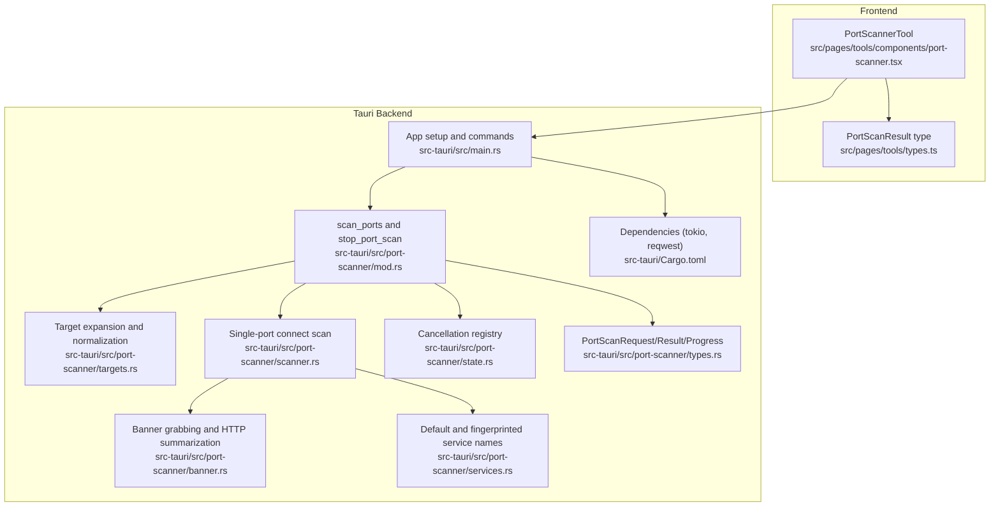
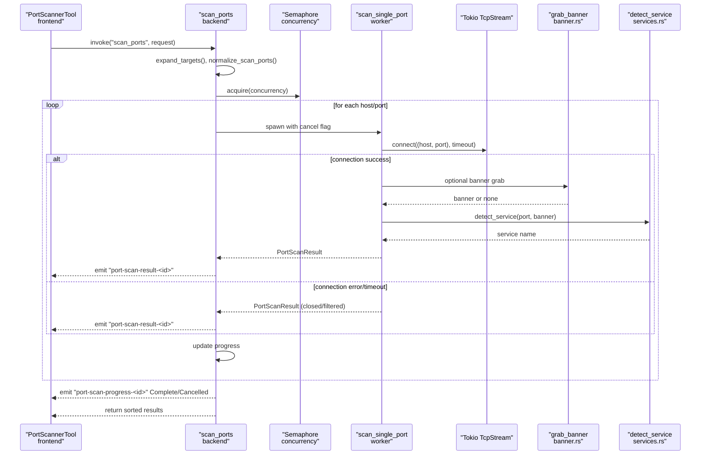
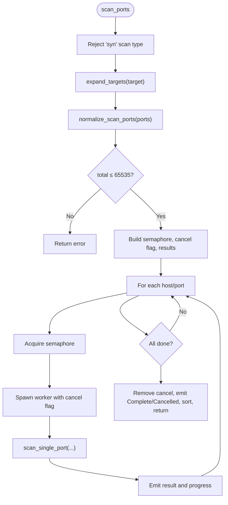
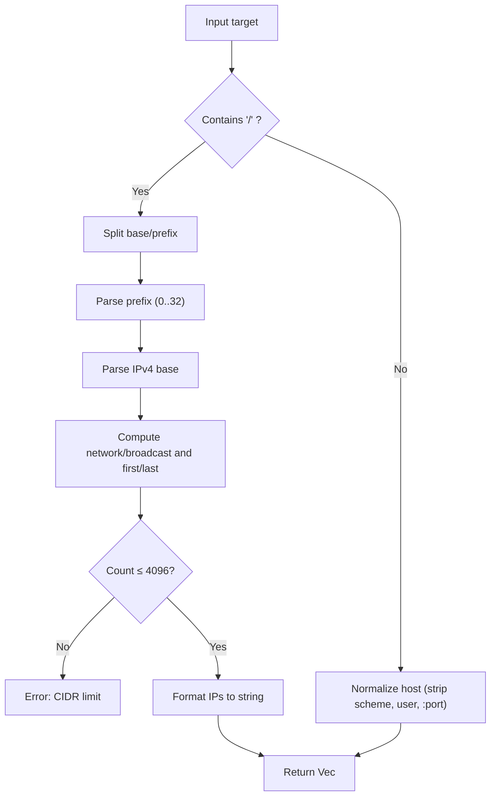
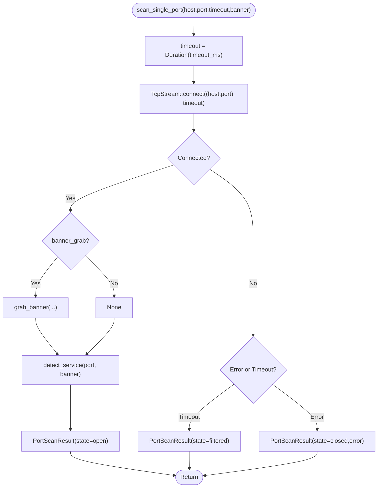
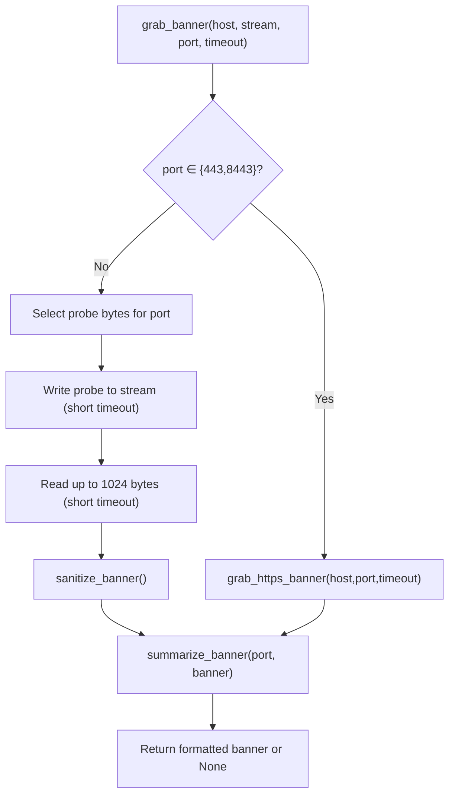
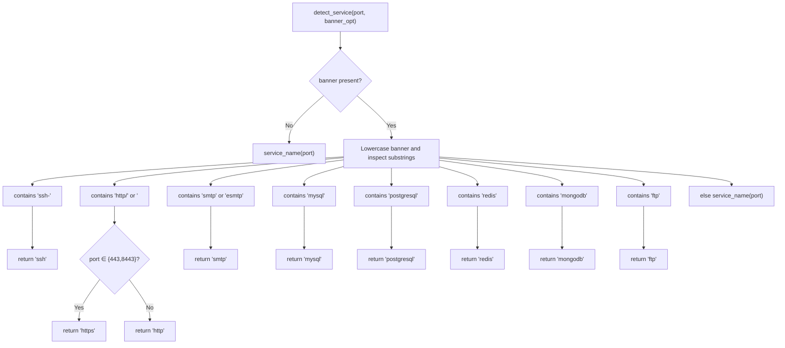
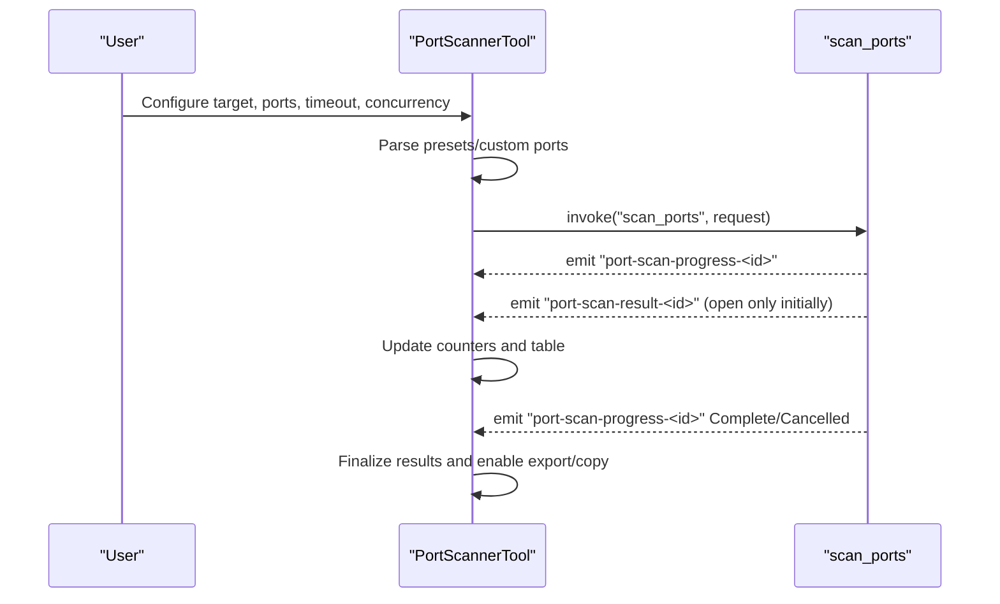
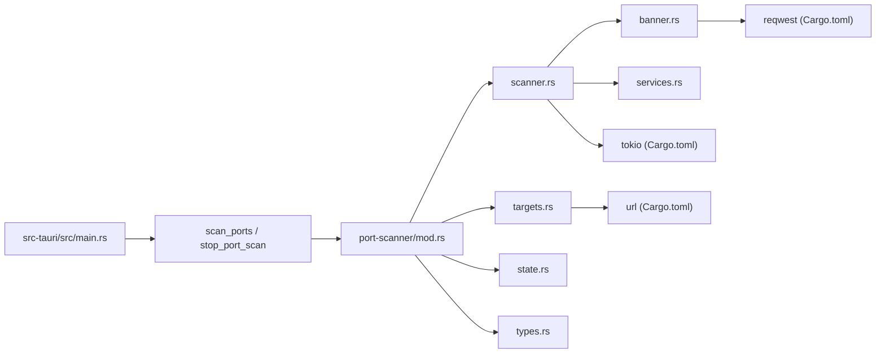

# Port Scanning

<cite>
**Referenced Files in This Document**
- [src-tauri/src/port-scanner/mod.rs](file://src-tauri/src/port-scanner/mod.rs)
- [src-tauri/src/port-scanner/scanner.rs](file://src-tauri/src/port-scanner/scanner.rs)
- [src-tauri/src/port-scanner/banner.rs](file://src-tauri/src/port-scanner/banner.rs)
- [src-tauri/src/port-scanner/services.rs](file://src-tauri/src/port-scanner/services.rs)
- [src-tauri/src/port-scanner/targets.rs](file://src-tauri/src/port-scanner/targets.rs)
- [src-tauri/src/port-scanner/types.rs](file://src-tauri/src/port-scanner/types.rs)
- [src-tauri/src/port-scanner/state.rs](file://src-tauri/src/port-scanner/state.rs)
- [src-tauri/src/main.rs](file://src-tauri/src/main.rs)
- [src/pages/tools/components/port-scanner.tsx](file://src/pages/tools/components/port-scanner.tsx)
- [src/pages/tools/types.ts](file://src/pages/tools/types.ts)
- [src-tauri/Cargo.toml](file://src-tauri/Cargo.toml)
</cite>

## Table of Contents
1. [Introduction](#introduction)
2. [Project Structure](#project-structure)
3. [Core Components](#core-components)
4. [Architecture Overview](#architecture-overview)
5. [Detailed Component Analysis](#detailed-component-analysis)
6. [Dependency Analysis](#dependency-analysis)
7. [Performance Considerations](#performance-considerations)
8. [Troubleshooting Guide](#troubleshooting-guide)
9. [Legal Compliance and Best Practices](#legal-compliance-and-best-practices)
10. [Conclusion](#conclusion)

## Introduction
This document explains the Port Scanning functionality implemented in the application. It covers target specification, scan orchestration, TCP connect scanning, banner grabbing, service enumeration, and result aggregation. It also details the concurrent scanning architecture, timeouts, cancellation, and the built-in service database. Practical workflows, performance tuning, and responsible usage guidelines are included to support authorized network reconnaissance tasks.

## Project Structure
The port scanning feature spans Rust backend modules under the Tauri application and a React-based UI component for configuration and visualization.

**Diagram sources**
- [src/pages/tools/components/port-scanner.tsx:1-337](file://src/pages/tools/components/port-scanner.tsx#L1-L337)
- [src/pages/tools/types.ts:1-70](file://src/pages/tools/types.ts#L1-L70)
- [src-tauri/src/main.rs:106-107](file://src-tauri/src/main.rs#L106-L107)
- [src-tauri/src/port-scanner/mod.rs:20-139](file://src-tauri/src/port-scanner/mod.rs#L20-L139)
- [src-tauri/src/port-scanner/targets.rs:1-125](file://src-tauri/src/port-scanner/targets.rs#L1-L125)
- [src-tauri/src/port-scanner/scanner.rs:1-82](file://src-tauri/src/port-scanner/scanner.rs#L1-L82)
- [src-tauri/src/port-scanner/banner.rs:1-161](file://src-tauri/src/port-scanner/banner.rs#L1-L161)
- [src-tauri/src/port-scanner/services.rs:1-93](file://src-tauri/src/port-scanner/services.rs#L1-L93)
- [src-tauri/src/port-scanner/state.rs:1-8](file://src-tauri/src/port-scanner/state.rs#L1-L8)
- [src-tauri/src/port-scanner/types.rs:1-36](file://src-tauri/src/port-scanner/types.rs#L1-L36)
- [src-tauri/Cargo.toml:31-41](file://src-tauri/Cargo.toml#L31-L41)

**Section sources**
- [src/pages/tools/components/port-scanner.tsx:1-337](file://src/pages/tools/components/port-scanner.tsx#L1-L337)
- [src-tauri/src/port-scanner/mod.rs:20-139](file://src-tauri/src/port-scanner/mod.rs#L20-L139)
- [src-tauri/src/main.rs:106-107](file://src-tauri/src/main.rs#L106-L107)

## Core Components
- Command orchestration: The scan controller validates inputs, expands targets, normalizes ports, enforces limits, and spawns concurrent tasks.
- Target specification: Supports single hosts, URLs, and IPv4 CIDR ranges with normalization and expansion.
- Scan engine: Performs asynchronous TCP connect scans per host/port with configurable timeouts.
- Banner grabbing: Probes well-known protocols and summarizes banners; HTTPS via HTTP head requests.
- Service enumeration: Uses default port-to-service mapping and augments with banner fingerprints.
- Concurrency and cancellation: Semaphore-controlled concurrency, atomic cancellation flag, and progress/result events.
- Frontend integration: UI for presets, configuration, real-time progress, and result export.

**Section sources**
- [src-tauri/src/port-scanner/mod.rs:20-139](file://src-tauri/src/port-scanner/mod.rs#L20-L139)
- [src-tauri/src/port-scanner/targets.rs:1-125](file://src-tauri/src/port-scanner/targets.rs#L1-L125)
- [src-tauri/src/port-scanner/scanner.rs:11-82](file://src-tauri/src/port-scanner/scanner.rs#L11-L82)
- [src-tauri/src/port-scanner/banner.rs:5-161](file://src-tauri/src/port-scanner/banner.rs#L5-L161)
- [src-tauri/src/port-scanner/services.rs:1-93](file://src-tauri/src/port-scanner/services.rs#L1-L93)
- [src/pages/tools/components/port-scanner.tsx:16-21](file://src/pages/tools/components/port-scanner.tsx#L16-L21)
- [src/pages/tools/components/port-scanner.tsx:53-103](file://src/pages/tools/components/port-scanner.tsx#L53-L103)

## Architecture Overview
The port scanner is a Tauri command that coordinates a Tokio-based async scan pipeline. It emits incremental progress and per-result events and returns a consolidated sorted list upon completion.

**Diagram sources**
- [src-tauri/src/port-scanner/mod.rs:20-125](file://src-tauri/src/port-scanner/mod.rs#L20-L125)
- [src-tauri/src/port-scanner/scanner.rs:11-61](file://src-tauri/src/port-scanner/scanner.rs#L11-L61)
- [src-tauri/src/port-scanner/banner.rs:5-41](file://src-tauri/src/port-scanner/banner.rs#L5-L41)
- [src-tauri/src/port-scanner/services.rs:64-92](file://src-tauri/src/port-scanner/services.rs#L64-L92)
- [src/pages/tools/components/port-scanner.tsx:64-103](file://src/pages/tools/components/port-scanner.tsx#L64-L103)

## Detailed Component Analysis

### Command Orchestration and Cancellation
- Validates scan type and rejects SYN scans (requires raw sockets and privileges).
- Expands targets (including CIDR) and deduplicates/normalizes ports.
- Enforces a cap on total checks and clamps timeout/concurrency.
- Registers a cancellation flag keyed by scan_id and manages it across workers.
- Uses a semaphore to bound concurrency and aggregates results into a mutex-protected vector.
- Emits per-result and progress events; sorts final results deterministically.

**Diagram sources**
- [src-tauri/src/port-scanner/mod.rs:20-125](file://src-tauri/src/port-scanner/mod.rs#L20-L125)

**Section sources**
- [src-tauri/src/port-scanner/mod.rs:20-139](file://src-tauri/src/port-scanner/mod.rs#L20-L139)
- [src-tauri/src/port-scanner/state.rs:1-8](file://src-tauri/src/port-scanner/state.rs#L1-L8)

### Target Specification and Expansion
- Accepts hostnames, IP addresses, URLs, and IPv4 CIDR ranges.
- Normalizes inputs and extracts base host; supports URL schemes and removes userinfo/ports from URL.
- CIDR expansion computes first/last usable IPs with a strict upper limit on hosts.

**Diagram sources**
- [src-tauri/src/port-scanner/targets.rs:3-14](file://src-tauri/src/port-scanner/targets.rs#L3-L14)
- [src-tauri/src/port-scanner/targets.rs:65-98](file://src-tauri/src/port-scanner/targets.rs#L65-L98)
- [src-tauri/src/port-scanner/targets.rs:24-63](file://src-tauri/src/port-scanner/targets.rs#L24-L63)

**Section sources**
- [src-tauri/src/port-scanner/targets.rs:1-125](file://src-tauri/src/port-scanner/targets.rs#L1-L125)

### TCP Connect Scan Engine
- Attempts a non-blocking connect with a timeout.
- On success, optionally performs banner grabbing; determines service via fingerprint or default mapping.
- On failure, classifies as closed or filtered depending on error vs. timeout.
- Records response time and error details.

**Diagram sources**
- [src-tauri/src/port-scanner/scanner.rs:11-61](file://src-tauri/src/port-scanner/scanner.rs#L11-L61)
- [src-tauri/src/port-scanner/banner.rs:5-41](file://src-tauri/src/port-scanner/banner.rs#L5-L41)
- [src-tauri/src/port-scanner/services.rs:64-92](file://src-tauri/src/port-scanner/services.rs#L64-L92)

**Section sources**
- [src-tauri/src/port-scanner/scanner.rs:11-82](file://src-tauri/src/port-scanner/scanner.rs#L11-L82)

### Banner Grabbing and HTTP Summarization
- For non-TLS ports, writes a small protocol-specific probe and reads up to a fixed buffer size with a short timeout.
- Sanitizes binary banners, trims to a bounded length, and summarizes first lines.
- For TLS ports (443/8443), performs an HTTP HEAD request using a client configured with reduced safety for self-signed certs and redirects, then constructs a concise summary line with HTTP version, status, and common headers.

**Diagram sources**
- [src-tauri/src/port-scanner/banner.rs:5-41](file://src-tauri/src/port-scanner/banner.rs#L5-L41)
- [src-tauri/src/port-scanner/banner.rs:43-73](file://src-tauri/src/port-scanner/banner.rs#L43-L73)
- [src-tauri/src/port-scanner/banner.rs:75-149](file://src-tauri/src/port-scanner/banner.rs#L75-L149)

**Section sources**
- [src-tauri/src/port-scanner/banner.rs:1-161](file://src-tauri/src/port-scanner/banner.rs#L1-L161)

### Service Enumeration and Fingerprinting
- Default mapping covers common ports to service names.
- Fingerprinting logic inspects banner content to refine classification (e.g., SSH, HTTP/HTTPS variants, SMTP, MySQL, PostgreSQL, Redis, MongoDB, FTP).

**Diagram sources**
- [src-tauri/src/port-scanner/services.rs:1-93](file://src-tauri/src/port-scanner/services.rs#L1-L93)

**Section sources**
- [src-tauri/src/port-scanner/services.rs:1-93](file://src-tauri/src/port-scanner/services.rs#L1-L93)

### Frontend Integration and UX
- Provides preset port lists (Quick, Web, Top 100, Full) and a custom mode.
- Configurable timeout and concurrency; optional banner grabbing.
- Real-time progress and incremental open-ports display; export to JSON/CSV; copy open endpoints.

**Diagram sources**
- [src/pages/tools/components/port-scanner.tsx:53-103](file://src/pages/tools/components/port-scanner.tsx#L53-L103)
- [src/pages/tools/components/port-scanner.tsx:121-138](file://src/pages/tools/components/port-scanner.tsx#L121-L138)

**Section sources**
- [src/pages/tools/components/port-scanner.tsx:16-21](file://src/pages/tools/components/port-scanner.tsx#L16-L21)
- [src/pages/tools/components/port-scanner.tsx:53-103](file://src/pages/tools/components/port-scanner.tsx#L53-L103)
- [src/pages/tools/components/port-scanner.tsx:121-138](file://src/pages/tools/components/port-scanner.tsx#L121-L138)
- [src/pages/tools/types.ts:59-69](file://src/pages/tools/types.ts#L59-L69)

## Dependency Analysis
- Backend dependencies include Tokio for async networking, reqwest for HTTPS banner probing, url for parsing targets, and serde for request/result serialization.
- The main application registers the port scanner commands and manages the PortScanState singleton.

**Diagram sources**
- [src-tauri/src/main.rs:106-107](file://src-tauri/src/main.rs#L106-L107)
- [src-tauri/src/port-scanner/mod.rs:1-18](file://src-tauri/src/port-scanner/mod.rs#L1-L18)
- [src-tauri/Cargo.toml:31-41](file://src-tauri/Cargo.toml#L31-L41)

**Section sources**
- [src-tauri/src/main.rs:106-107](file://src-tauri/src/main.rs#L106-L107)
- [src-tauri/Cargo.toml:31-41](file://src-tauri/Cargo.toml#L31-L41)

## Performance Considerations
- Concurrency control: Tune concurrency to balance throughput and resource usage; the backend clamps it to a safe range.
- Timeouts: Adjust per-target latency expectations; shorter timeouts increase false filtering, longer ones increase scan duration.
- Banner grabbing: Disable for large scans to reduce overhead; re-enable for detailed service identification.
- CIDR sizing: Limit the number of hosts scanned; the backend caps host counts for CIDR.
- Sorting and aggregation: Results are sorted after completion; avoid unnecessary sorting during streaming for very large datasets.
- Network stack: Prefer local networks for faster connects; consider reducing concurrency on constrained systems.

[No sources needed since this section provides general guidance]

## Troubleshooting Guide
- SYN scan rejected: The current implementation does not support SYN scanning; use TCP connect scan.
- Too many checks: Total host×port combinations exceeding the limit are rejected; reduce targets or ports.
- CIDR errors: Invalid prefix, unsupported IPv6, or ranges outside limits produce errors; verify CIDR notation and size.
- Empty results: Ensure banner grabbing is enabled if expecting service banners; confirm ports are reachable and not blocked.
- Cancellation: Use the stop command with the scan_id; verify the UI reflects Cancelled state.
- Export issues: Ensure there are open results before exporting; CSV/JSON generation is gated on presence of results.

**Section sources**
- [src-tauri/src/port-scanner/mod.rs:26-31](file://src-tauri/src/port-scanner/mod.rs#L26-L31)
- [src-tauri/src/port-scanner/mod.rs:36-38](file://src-tauri/src/port-scanner/mod.rs#L36-L38)
- [src-tauri/src/port-scanner/targets.rs:65-98](file://src-tauri/src/port-scanner/targets.rs#L65-L98)
- [src/pages/tools/components/port-scanner.tsx:105-109](file://src/pages/tools/components/port-scanner.tsx#L105-L109)

## Legal Compliance and Best Practices
- Authorization: Only scan systems and networks you own or have explicit written permission to test.
- Scope: Clearly define targets, ports, and timeframes; avoid scanning beyond stated boundaries.
- Rate control: Use conservative concurrency and timeouts to minimize impact on target systems.
- Stealth: Avoid aggressive probes; disable banner grabbing for initial reconnaissance to reduce noise.
- Data handling: Store and share results responsibly; remove sensitive information before sharing.
- Documentation: Record methodology, timing, and outcomes for audit trails.
- Compliance: Adhere to applicable laws and organizational policies; consult legal/security teams before testing.

[No sources needed since this section provides general guidance]

## Conclusion
The port scanning subsystem provides a robust, asynchronous TCP connect scanner with target expansion, concurrency control, cancellation, and service enumeration via default mappings and banner fingerprinting. The frontend offers practical presets and real-time feedback, enabling efficient network reconnaissance when used responsibly and lawfully.