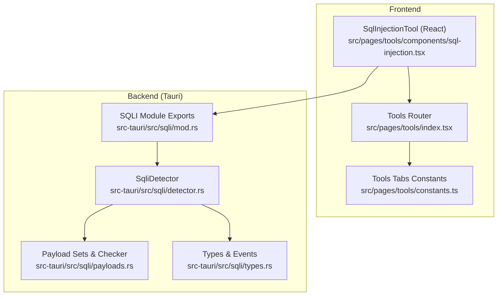
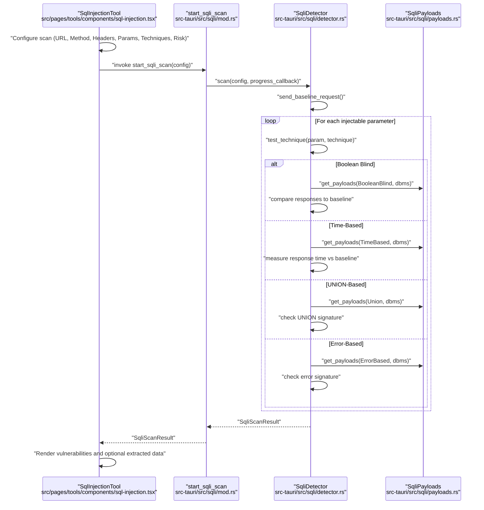
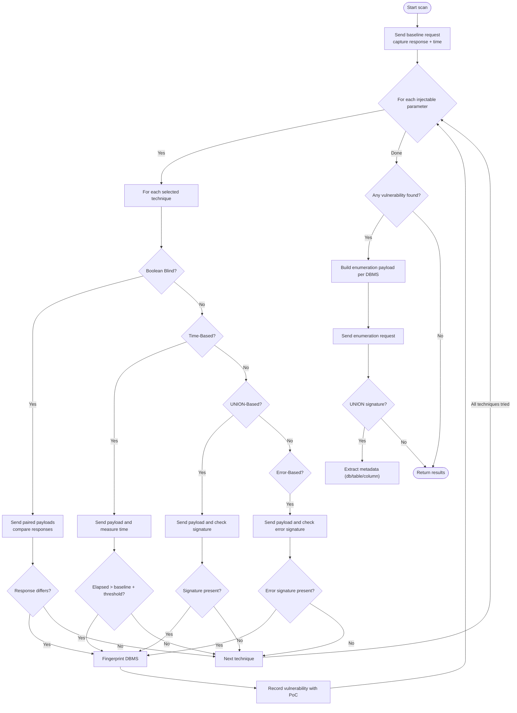
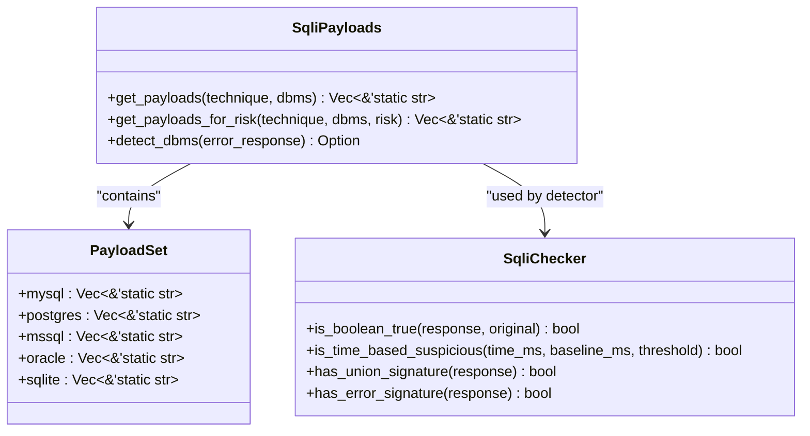
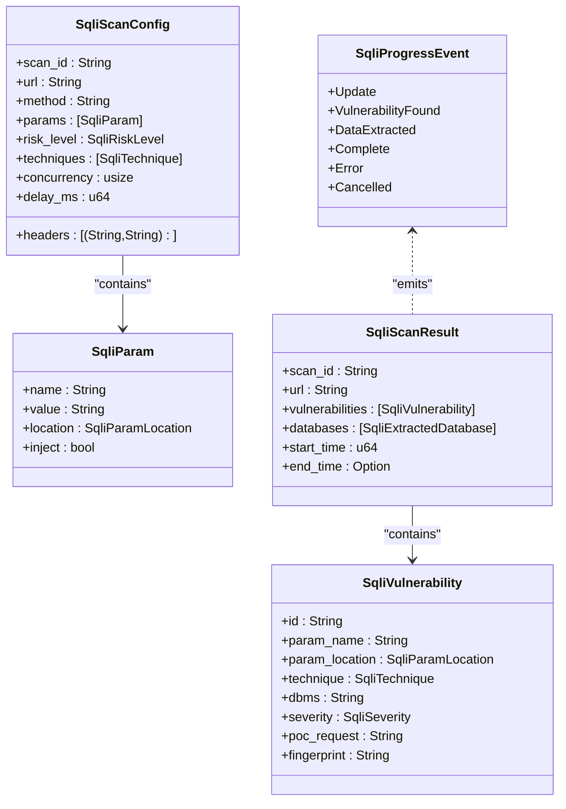
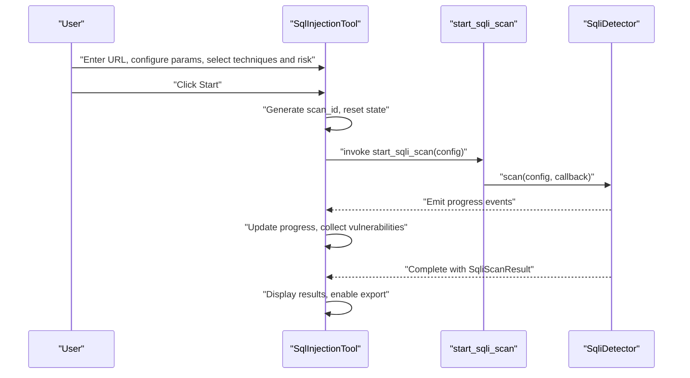
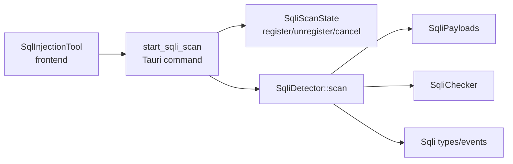

# SQL Injection Detection

<cite>
**Referenced Files in This Document**
- [mod.rs](file://src-tauri/src/sqli/mod.rs)
- [detector.rs](file://src-tauri/src/sqli/detector.rs)
- [payloads.rs](file://src-tauri/src/sqli/payloads.rs)
- [types.rs](file://src-tauri/src/sqli/types.rs)
- [sql-injection.tsx](file://src/pages/tools/components/sql-injection.tsx)
- [index.tsx](file://src/pages/tools/index.tsx)
- [constants.ts](file://src/pages/tools/constants.ts)
</cite>

## Table of Contents
1. [Introduction](#introduction)
2. [Project Structure](#project-structure)
3. [Core Components](#core-components)
4. [Architecture Overview](#architecture-overview)
5. [Detailed Component Analysis](#detailed-component-analysis)
6. [Dependency Analysis](#dependency-analysis)
7. [Performance Considerations](#performance-considerations)
8. [Troubleshooting Guide](#troubleshooting-guide)
9. [Conclusion](#conclusion)
10. [Appendices](#appendices)

## Introduction
This document describes the SQL Injection Detection system implemented in the project. It covers the vulnerability scanning engine, payload testing mechanisms, database fingerprinting, detection algorithms, payload management, and the user interface for configuring scans, viewing results, and interpreting outcomes. It also includes practical testing workflows, result validation, database compatibility, evasion considerations, performance guidance, and responsible disclosure practices.

## Project Structure
The SQL Injection tool is composed of:
- A Tauri backend module under src-tauri/src/sqli providing the scanning engine, payload sets, and type definitions.
- A frontend component under src/pages/tools/components/sql-injection.tsx that exposes a UI for configuring and running scans, displaying results, and exporting findings.
- Tool registration and routing under src/pages/tools/index.tsx and src/pages/tools/constants.ts.

**Diagram sources**
- [sql-injection.tsx:1-561](file://src/pages/tools/components/sql-injection.tsx#L1-L561)
- [index.tsx:1-49](file://src/pages/tools/index.tsx#L1-L49)
- [constants.ts:1-13](file://src/pages/tools/constants.ts#L1-L13)
- [mod.rs:1-54](file://src-tauri/src/sqli/mod.rs#L1-L54)
- [detector.rs:1-480](file://src-tauri/src/sqli/detector.rs#L1-L480)
- [payloads.rs:1-314](file://src-tauri/src/sqli/payloads.rs#L1-L314)
- [types.rs:1-196](file://src-tauri/src/sqli/types.rs#L1-L196)

**Section sources**
- [index.tsx:15-48](file://src/pages/tools/index.tsx#L15-L48)
- [constants.ts:3-12](file://src/pages/tools/constants.ts#L3-L12)

## Core Components
- SqliDetector: Orchestrates scanning, baseline request handling, per-parameter testing across techniques, database fingerprinting, and optional data enumeration.
- SqliPayloads: Provides categorized payload sets per DBMS and technique, plus DBMS detection heuristics and signature checks.
- SqliScanConfig/SqliVulnerability/SqliScanResult/SqliProgressEvent: Define scan configuration, vulnerability records, results, and progress events.
- Frontend SqlInjectionTool: UI for target configuration, parameter management, technique/risk selection, scan control, progress display, results browsing, and export.

Key capabilities:
- Parameter scanning across URL, body, and header locations.
- Technique coverage: Boolean blind, time-based, UNION-based, error-based.
- Baseline response and timing comparisons for detection.
- DBMS fingerprinting via error signatures and payload-specific heuristics.
- Optional database enumeration using technique-aware payloads.
- Real-time progress events and cancellation support.

**Section sources**
- [detector.rs:34-113](file://src-tauri/src/sqli/detector.rs#L34-L113)
- [payloads.rs:215-281](file://src-tauri/src/sqli/payloads.rs#L215-L281)
- [types.rs:6-126](file://src-tauri/src/sqli/types.rs#L6-L126)
- [sql-injection.tsx:50-175](file://src/pages/tools/components/sql-injection.tsx#L50-L175)

## Architecture Overview
The scanning flow is initiated from the UI, routed through Tauri commands to the Rust detector, which performs HTTP requests, applies payloads, and emits progress events. Results are returned to the UI for display and export.

**Diagram sources**
- [sql-injection.tsx:98-169](file://src/pages/tools/components/sql-injection.tsx#L98-L169)
- [mod.rs:16-39](file://src-tauri/src/sqli/mod.rs#L16-L39)
- [detector.rs:34-113](file://src-tauri/src/sqli/detector.rs#L34-L113)
- [detector.rs:223-241](file://src-tauri/src/sqli/detector.rs#L223-L241)
- [payloads.rs:215-246](file://src-tauri/src/sqli/payloads.rs#L215-L246)

## Detailed Component Analysis

### Backend Engine: SqliDetector
Responsibilities:
- Build HTTP requests with configurable method, headers, URL-encoded parameters, and body/header injection.
- Establish a baseline response/time and compare against injected payloads.
- Test each technique in order and short-circuit on first detection.
- Fingerprint DBMS from error or response characteristics.
- Optionally enumerate databases/tables/columns using technique-aware payloads.

Detection logic highlights:
- Boolean Blind: Compare response differences between “true” and “false” payloads; requires two complementary payloads per iteration.
- Time-Based: Measure elapsed time and compare to baseline plus threshold.
- UNION-Based: Look for UNION-like signatures in responses.
- Error-Based: Detect SQL-related errors and DBMS-specific markers.

**Diagram sources**
- [detector.rs:34-113](file://src-tauri/src/sqli/detector.rs#L34-L113)
- [detector.rs:243-401](file://src-tauri/src/sqli/detector.rs#L243-L401)
- [payloads.rs:283-313](file://src-tauri/src/sqli/payloads.rs#L283-L313)

**Section sources**
- [detector.rs:115-195](file://src-tauri/src/sqli/detector.rs#L115-L195)
- [detector.rs:243-401](file://src-tauri/src/sqli/detector.rs#L243-L401)

### Payload Management: SqliPayloads and SqliChecker
- Payload sets are organized per technique and DBMS (MySQL, PostgreSQL, MSSQL, Oracle, SQLite).
- Risk-aware selection limits payload count for low/medium risk.
- Signature checks:
  - Boolean Blind: Compares response to baseline.
  - Time-Based: Threshold comparison against baseline time.
  - UNION-Based: Heuristic presence of UNION/select/null-like indicators.
  - Error-Based: Presence of SQL-related keywords and DBMS-specific markers.

**Diagram sources**
- [payloads.rs:3-16](file://src-tauri/src/sqli/payloads.rs#L3-L16)
- [payloads.rs:215-281](file://src-tauri/src/sqli/payloads.rs#L215-L281)
- [payloads.rs:283-313](file://src-tauri/src/sqli/payloads.rs#L283-L313)

**Section sources**
- [payloads.rs:215-246](file://src-tauri/src/sqli/payloads.rs#L215-L246)
- [payloads.rs:283-313](file://src-tauri/src/sqli/payloads.rs#L283-L313)

### Data Structures and Progress Events
Core types define scan configuration, vulnerability records, extracted metadata, and progress events. Progress events include updates, vulnerability-found notifications, and completion/error states.

**Diagram sources**
- [types.rs:6-126](file://src-tauri/src/sqli/types.rs#L6-L126)
- [types.rs:161-195](file://src-tauri/src/sqli/types.rs#L161-L195)

**Section sources**
- [types.rs:6-126](file://src-tauri/src/sqli/types.rs#L6-L126)

### Frontend: SqlInjectionTool
The UI enables:
- Target configuration (URL, method).
- Parameter management (name/value/location/inject toggle).
- Technique selection (Boolean Blind, Time-Based, UNION-Based, Error-Based).
- Risk level selection (Low/Medium/High).
- Scan control (Start/Stop/Clear/Export).
- Real-time progress display and results rendering (vulnerabilities and optional extracted data).
- Export to JSON/CSV.

**Diagram sources**
- [sql-injection.tsx:98-169](file://src/pages/tools/components/sql-injection.tsx#L98-L169)
- [mod.rs:16-39](file://src-tauri/src/sqli/mod.rs#L16-L39)

**Section sources**
- [sql-injection.tsx:50-175](file://src/pages/tools/components/sql-injection.tsx#L50-L175)
- [sql-injection.tsx:187-199](file://src/pages/tools/components/sql-injection.tsx#L187-L199)

## Dependency Analysis
- The frontend invokes Tauri commands to start/stop scans and listens to progress events keyed by scan ID.
- The Tauri module registers/unregisters scan state and delegates to SqliDetector.
- SqliDetector depends on SqliPayloads for payload sets and SqliChecker for signature detection.
- Types are shared across frontend and backend to maintain consistency.

**Diagram sources**
- [mod.rs:16-53](file://src-tauri/src/sqli/mod.rs#L16-L53)
- [detector.rs:34-113](file://src-tauri/src/sqli/detector.rs#L34-L113)
- [payloads.rs:215-281](file://src-tauri/src/sqli/payloads.rs#L215-L281)
- [types.rs:161-195](file://src-tauri/src/sqli/types.rs#L161-L195)

**Section sources**
- [mod.rs:16-53](file://src-tauri/src/sqli/mod.rs#L16-L53)
- [detector.rs:34-113](file://src-tauri/src/sqli/detector.rs#L34-L113)

## Performance Considerations
- Concurrency and delay: The scan configuration includes concurrency and delay fields. While the UI currently passes a fixed concurrency value, tuning these parameters can balance speed and stealth.
- Baseline measurement: Using a single baseline improves detection accuracy and reduces false positives by normalizing response characteristics.
- Payload sampling by risk: Lower risk levels limit payload counts, reducing request volume.
- Early termination: Detection short-circuits upon first positive result per parameter, minimizing unnecessary requests.
- Request building: Efficient URL encoding and header/body assembly reduce overhead.

Recommendations:
- For large-scale testing, adjust concurrency and introduce per-request delays to avoid overwhelming targets.
- Prefer targeted payload sets aligned with detected DBMS to reduce noise.
- Use low/medium risk modes during reconnaissance; escalate to high risk after confirming vulnerability.

**Section sources**
- [types.rs:13-16](file://src-tauri/src/sqli/types.rs#L13-L16)
- [payloads.rs:234-246](file://src-tauri/src/sqli/payloads.rs#L234-L246)
- [detector.rs:34-113](file://src-tauri/src/sqli/detector.rs#L34-L113)

## Troubleshooting Guide
Common issues and mitigations:
- No vulnerabilities found:
  - Verify at least one parameter is marked injectable.
  - Confirm the target URL and method are correct.
  - Try enabling additional techniques or raising risk level.
- Slow or timed-out requests:
  - Increase timeout and/or introduce delays.
  - Reduce concurrency to avoid rate limiting.
- False positives:
  - Rely on multiple technique confirmations (e.g., UNION + DBMS fingerprint).
  - Use baseline comparisons for boolean/time-based techniques.
- Export failures:
  - Ensure vulnerabilities exist before exporting.
  - Use JSON export for richer metadata.

Operational controls:
- Stop scan via the UI to cancel ongoing requests.
- Clear results to reset state and re-run.

**Section sources**
- [sql-injection.tsx:171-185](file://src/pages/tools/components/sql-injection.tsx#L171-L185)
- [detector.rs:115-120](file://src-tauri/src/sqli/detector.rs#L115-L120)
- [payloads.rs:283-313](file://src-tauri/src/sqli/payloads.rs#L283-L313)

## Conclusion
The SQL Injection Detection system combines a robust backend scanning engine with a practical frontend interface. It supports multiple injection techniques, DBMS fingerprinting, and optional data enumeration, while offering real-time progress and export capabilities. Proper configuration of parameters, techniques, and risk levels, along with cautious performance tuning, yields reliable and actionable results.

## Appendices

### Practical Testing Workflows
- Workflow A: Reconnaissance
  - Enter target URL and method.
  - Add suspected parameters; mark only likely injection points.
  - Select Boolean Blind and Time-Based techniques at Low risk.
  - Start scan; review progress and initial findings.
- Workflow B: Confirmation and Enumeration
  - If vulnerabilities are found, increase risk to High.
  - Enable UNION-Based and Error-Based techniques.
  - Review vulnerability details and Proof of Concept.
  - Navigate to Data Extraction to enumerate databases/tables (if applicable).

Validation tips:
- Cross-check detections across techniques.
- Use DBMS fingerprint to tailor subsequent payloads.
- Export results for audit trails.

**Section sources**
- [sql-injection.tsx:98-169](file://src/pages/tools/components/sql-injection.tsx#L98-L169)
- [detector.rs:407-455](file://src-tauri/src/sqli/detector.rs#L407-L455)

### Database Compatibility
Supported DBMS families:
- MySQL, PostgreSQL, MSSQL, Oracle, SQLite.

Compatibility notes:
- Payload sets are tailored per DBMS family.
- DBMS detection leverages error signatures and keyword heuristics.

**Section sources**
- [payloads.rs:248-280](file://src-tauri/src/sqli/payloads.rs#L248-L280)

### Responsible Disclosure Practices
- Limit testing to authorized systems and scopes.
- Use conservative risk levels and delays to minimize impact.
- Document findings with PoCs and severity assessments.
- Coordinate remediation timelines with stakeholders.
- Export results for internal audit and compliance.

[No sources needed since this section provides general guidance]