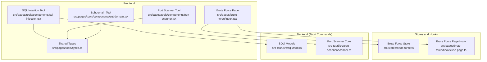
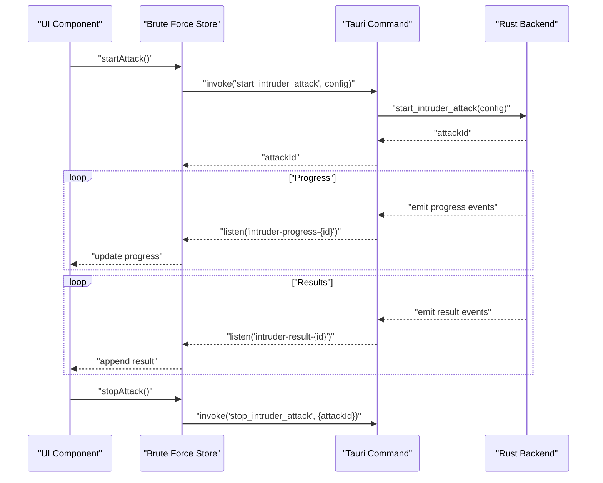
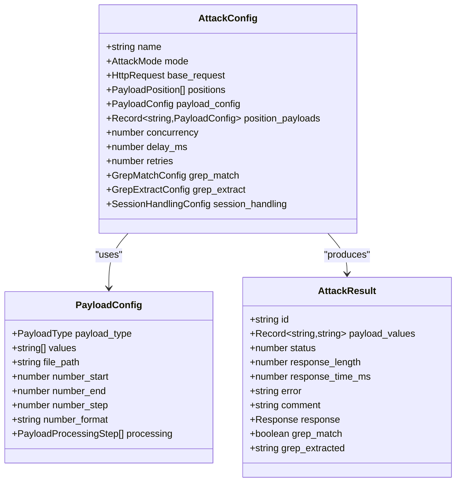
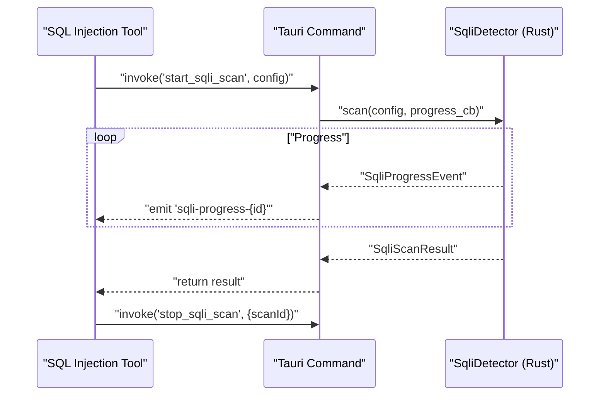
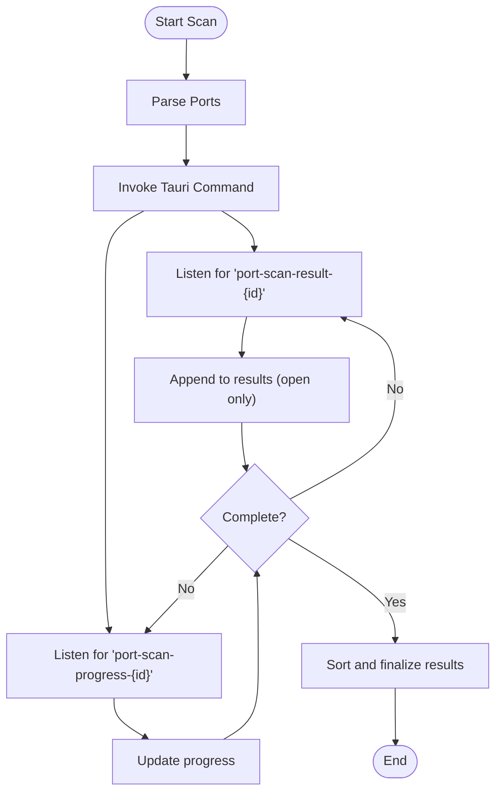
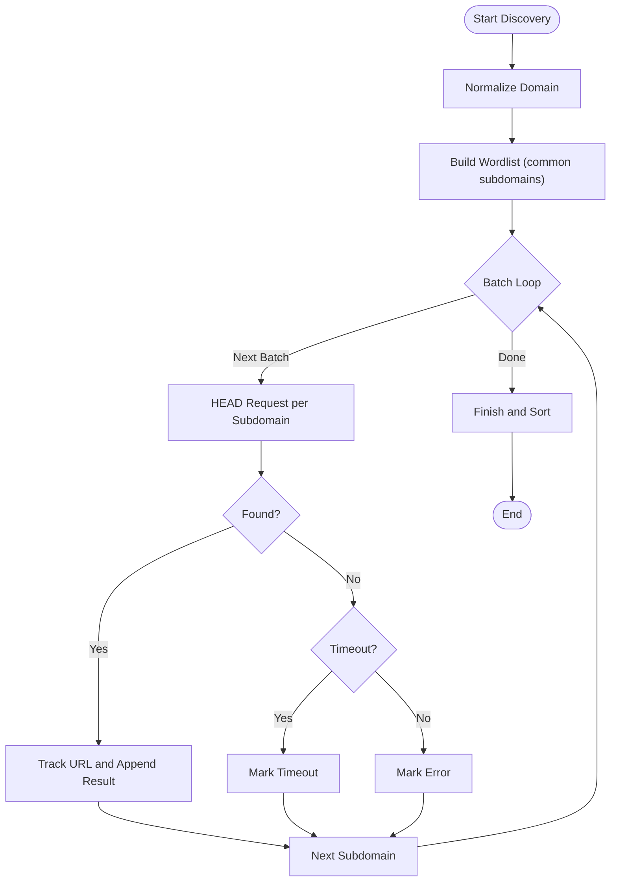
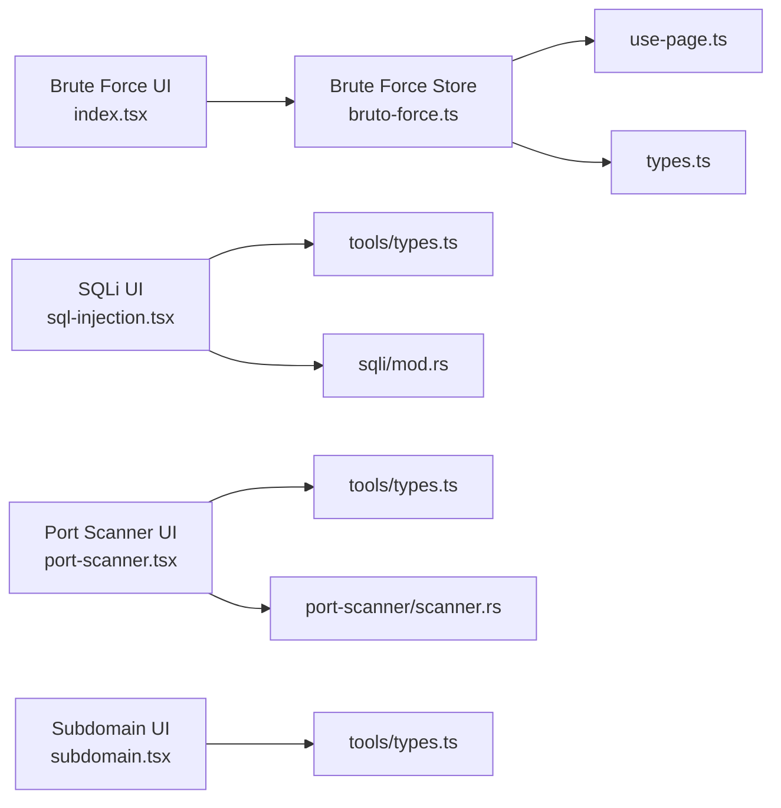

# Security Testing Tools

<cite>
**Referenced Files in This Document**
- [README.md](file://README.md)
- [src/pages/brute-force/index.tsx](file://src/pages/brute-force/index.tsx)
- [src/pages/brute-force/hooks/use-page.ts](file://src/pages/brute-force/hooks/use-page.ts)
- [src/pages/brute-force/types.ts](file://src/pages/brute-force/types.ts)
- [src/pages/brute-force/data/predefined-payloads.ts](file://src/pages/brute-force/data/predefined-payloads.ts)
- [src/stores/bruto-force.ts](file://src/stores/bruto-force.ts)
- [src/pages/tools/components/sql-injection.tsx](file://src/pages/tools/components/sql-injection.tsx)
- [src/pages/tools/types.ts](file://src/pages/tools/types.ts)
- [src/pages/tools/components/port-scanner.tsx](file://src/pages/tools/components/port-scanner.tsx)
- [src/pages/tools/components/subdomain.tsx](file://src/pages/tools/components/subdomain.tsx)
- [src-tauri/src/sqli/mod.rs](file://src-tauri/src/sqli/mod.rs)
- [src-tauri/src/port-scanner/scanner.rs](file://src-tauri/src/port-scanner/scanner.rs)
</cite>

## Table of Contents
1. [Introduction](#introduction)
2. [Project Structure](#project-structure)
3. [Core Components](#core-components)
4. [Architecture Overview](#architecture-overview)
5. [Detailed Component Analysis](#detailed-component-analysis)
6. [Dependency Analysis](#dependency-analysis)
7. [Performance Considerations](#performance-considerations)
8. [Troubleshooting Guide](#troubleshooting-guide)
9. [Ethical Hacking and Legal Compliance](#ethical-hacking-and-legal-compliance)
10. [Conclusion](#conclusion)

## Introduction
This document describes AppRecon’s Security Testing Tools suite with a focus on:
- Brute force testing: attack configuration, payload management, and results analysis
- SQL injection detection: vulnerability scanning, payload testing, and database fingerprinting
- Port scanning: network discovery, service enumeration, and banner grabbing
- Subdomain enumeration: wordlist-based discovery with concurrency control

It also provides practical workflows, payload configuration guidance, result interpretation tips, performance optimization techniques, troubleshooting advice, and ethical hacking considerations.

## Project Structure
The Security Testing Tools are organized across:
- Frontend pages and components (React + Tauri)
- Stores and hooks for state and orchestration
- Types for request/response contracts
- Backend Rust modules for heavy lifting (SQLi, port scanning)

**Diagram sources**
- [src/pages/brute-force/index.tsx:1-150](file://src/pages/brute-force/index.tsx#L1-L150)
- [src/pages/tools/components/sql-injection.tsx:1-561](file://src/pages/tools/components/sql-injection.tsx#L1-L561)
- [src/pages/tools/components/port-scanner.tsx:1-337](file://src/pages/tools/components/port-scanner.tsx#L1-L337)
- [src/pages/tools/components/subdomain.tsx:1-313](file://src/pages/tools/components/subdomain.tsx#L1-L313)
- [src/pages/tools/types.ts:1-70](file://src/pages/tools/types.ts#L1-L70)
- [src/stores/bruto-force.ts:1-470](file://src/stores/bruto-force.ts#L1-L470)
- [src/pages/brute-force/hooks/use-page.ts:1-127](file://src/pages/brute-force/hooks/use-page.ts#L1-L127)
- [src-tauri/src/sqli/mod.rs:1-54](file://src-tauri/src/sqli/mod.rs#L1-L54)
- [src-tauri/src/port-scanner/scanner.rs:1-82](file://src-tauri/src/port-scanner/scanner.rs#L1-L82)

**Section sources**
- [src/pages/brute-force/index.tsx:1-150](file://src/pages/brute-force/index.tsx#L1-L150)
- [src/pages/tools/components/sql-injection.tsx:1-561](file://src/pages/tools/components/sql-injection.tsx#L1-L561)
- [src/pages/tools/components/port-scanner.tsx:1-337](file://src/pages/tools/components/port-scanner.tsx#L1-L337)
- [src/pages/tools/components/subdomain.tsx:1-313](file://src/pages/tools/components/subdomain.tsx#L1-L313)
- [src/pages/tools/types.ts:1-70](file://src/pages/tools/types.ts#L1-L70)
- [src/stores/bruto-force.ts:1-470](file://src/stores/bruto-force.ts#L1-L470)
- [src/pages/brute-force/hooks/use-page.ts:1-127](file://src/pages/brute-force/hooks/use-page.ts#L1-L127)
- [src-tauri/src/sqli/mod.rs:1-54](file://src-tauri/src/sqli/mod.rs#L1-L54)
- [src-tauri/src/port-scanner/scanner.rs:1-82](file://src-tauri/src/port-scanner/scanner.rs#L1-L82)

## Core Components
- Brute Force
  - Attack configuration via a request template with payload positions marked by delimiters
  - Payload management supporting lists, runtime files, and numeric ranges with processing steps
  - Real-time progress and results filtering with grep-based matching/extraction
- SQL Injection
  - Configurable risk level and technique selection (boolean blind, time-based, UNION, error-based)
  - Live progress events, vulnerability listing, and database/table extraction
- Port Scanner
  - Presets and custom port ranges, concurrency control, and optional banner grabbing
  - Results table with service hints and response times
- Subdomain Enumeration
  - Wordlist-driven discovery with concurrency and timeouts
  - Batched requests with deduplication and status reporting

**Section sources**
- [src/pages/brute-force/types.ts:1-275](file://src/pages/brute-force/types.ts#L1-L275)
- [src/pages/brute-force/data/predefined-payloads.ts:1-48](file://src/pages/brute-force/data/predefined-payloads.ts#L1-L48)
- [src/pages/tools/components/sql-injection.tsx:1-561](file://src/pages/tools/components/sql-injection.tsx#L1-L561)
- [src/pages/tools/components/port-scanner.tsx:1-337](file://src/pages/tools/components/port-scanner.tsx#L1-L337)
- [src/pages/tools/components/subdomain.tsx:1-313](file://src/pages/tools/components/subdomain.tsx#L1-L313)

## Architecture Overview
The frontend orchestrates user interactions and state, invoking Tauri commands that delegate to Rust modules for intensive tasks. Events are emitted back to the UI for real-time updates.

**Diagram sources**
- [src/stores/bruto-force.ts:338-436](file://src/stores/bruto-force.ts#L338-L436)
- [src/pages/brute-force/index.tsx:22-149](file://src/pages/brute-force/index.tsx#L22-L149)

**Section sources**
- [src/stores/bruto-force.ts:338-436](file://src/stores/bruto-force.ts#L338-L436)
- [src/pages/brute-force/index.tsx:22-149](file://src/pages/brute-force/index.tsx#L22-L149)

## Detailed Component Analysis

### Brute Force Testing
- Attack configuration
  - Base HTTP request with method, URL, headers, body, redirect behavior
  - Payload positions marked with delimiters; automatic detection and synchronization
  - Global and per-position payload configurations
- Payload management
  - Types: simple list, runtime file, number range
  - Processing pipeline: URL encode/decode, base64 encode/decode, hashing (MD5, SHA variants)
- Results analysis
  - Status code, response length, response time, error messages
  - Optional grep-based match/extraction for filtering and token extraction
  - Session handling support for token extraction and header updates

**Diagram sources**
- [src/pages/brute-force/types.ts:62-102](file://src/pages/brute-force/types.ts#L62-L102)
- [src/pages/brute-force/types.ts:32-41](file://src/pages/brute-force/types.ts#L32-L41)
- [src/pages/brute-force/types.ts:84-102](file://src/pages/brute-force/types.ts#L84-L102)

Practical workflow
- Prepare a base request and mark payload positions
- Choose a payload type and populate values or file path
- Configure concurrency, delays, and optional processing steps
- Start the attack; monitor progress and results; filter by status or grep matches

**Section sources**
- [src/pages/brute-force/types.ts:104-141](file://src/pages/brute-force/types.ts#L104-L141)
- [src/pages/brute-force/types.ts:143-172](file://src/pages/brute-force/types.ts#L143-L172)
- [src/pages/brute-force/hooks/use-page.ts:1-127](file://src/pages/brute-force/hooks/use-page.ts#L1-L127)
- [src/pages/brute-force/data/predefined-payloads.ts:1-48](file://src/pages/brute-force/data/predefined-payloads.ts#L1-L48)
- [src/stores/bruto-force.ts:192-205](file://src/stores/bruto-force.ts#L192-L205)
- [src/stores/bruto-force.ts:207-223](file://src/stores/bruto-force.ts#L207-L223)
- [src/stores/bruto-force.ts:225-243](file://src/stores/bruto-force.ts#L225-L243)
- [src/stores/bruto-force.ts:245-252](file://src/stores/bruto-force.ts#L245-L252)
- [src/stores/bruto-force.ts:254-276](file://src/stores/bruto-force.ts#L254-L276)
- [src/stores/bruto-force.ts:278-304](file://src/stores/bruto-force.ts#L278-L304)
- [src/stores/bruto-force.ts:306-319](file://src/stores/bruto-force.ts#L306-L319)
- [src/stores/bruto-force.ts:321-336](file://src/stores/bruto-force.ts#L321-L336)

### SQL Injection Detection
- Configuration
  - Target URL/method, headers, and parameter list with locations and injection flags
  - Risk level and technique selection
  - Concurrency and delay controls
- Execution
  - Start scan emits progress updates and vulnerability findings
  - Supports cancellation and returns structured results
- Results
  - Vulnerability table with severity and proof-of-concept
  - Extracted databases and tables with row counts and column names

**Diagram sources**
- [src/pages/tools/components/sql-injection.tsx:98-175](file://src/pages/tools/components/sql-injection.tsx#L98-L175)
- [src-tauri/src/sqli/mod.rs:16-48](file://src-tauri/src/sqli/mod.rs#L16-L48)

Practical workflow
- Add target URL and method; define parameters and injection flags
- Choose risk level and techniques; adjust concurrency
- Start scan, review vulnerabilities, and explore extracted data

**Section sources**
- [src/pages/tools/components/sql-injection.tsx:50-186](file://src/pages/tools/components/sql-injection.tsx#L50-L186)
- [src/pages/tools/types.ts:27-49](file://src/pages/tools/types.ts#L27-L49)
- [src-tauri/src/sqli/mod.rs:16-48](file://src-tauri/src/sqli/mod.rs#L16-L48)

### Port Scanning
- Configuration
  - Target host or CIDR, preset or custom port ranges, timeout, concurrency, banner grabbing
- Execution
  - Asynchronous scanning with progress and result streaming
  - Emits open ports with service hints and optional banners
- Results
  - Filterable table with host, port, state, service, response time, and banner

**Diagram sources**
- [src/pages/tools/components/port-scanner.tsx:53-103](file://src/pages/tools/components/port-scanner.tsx#L53-L103)
- [src/pages/tools/types.ts:59-69](file://src/pages/tools/types.ts#L59-L69)

Practical workflow
- Select a preset or define custom ports; set timeout and concurrency
- Enable banner grabbing if desired; start scan and observe progress
- Export or copy open ports for further investigation

**Section sources**
- [src/pages/tools/components/port-scanner.tsx:29-103](file://src/pages/tools/components/port-scanner.tsx#L29-L103)
- [src/pages/tools/types.ts:59-69](file://src/pages/tools/types.ts#L59-L69)
- [src-tauri/src/port-scanner/scanner.rs:11-61](file://src-tauri/src/port-scanner/scanner.rs#L11-L61)

### Subdomain Enumeration
- Configuration
  - Domain input with automatic normalization
  - Built-in wordlist of common subdomains
- Execution
  - Batched HEAD requests with concurrency control and per-request timeout
  - Deduplicates found URLs and tracks statuses (found, timeout, error)
- Results
  - Table with subdomain, status, and response time; supports export and copy

**Diagram sources**
- [src/pages/tools/components/subdomain.tsx:50-139](file://src/pages/tools/components/subdomain.tsx#L50-L139)

Practical workflow
- Enter a domain; start discovery with default concurrency
- Review found subdomains, export results, and investigate further

**Section sources**
- [src/pages/tools/components/subdomain.tsx:41-177](file://src/pages/tools/components/subdomain.tsx#L41-L177)
- [src/pages/tools/types.ts:27-40](file://src/pages/tools/types.ts#L27-L40)

## Dependency Analysis
- Frontend-to-Backend
  - Brute force: Tauri commands for starting/stopping attacks and listening to progress/result events
  - SQL injection: Tauri commands for starting scans, stopping scans, and retrieving scan state
  - Port scanning: Tauri commands for scanning and progress/result streaming
- Internal dependencies
  - Brute force store manages attack lifecycle, event listeners, and UI state
  - Shared types unify contracts across tools

**Diagram sources**
- [src/pages/brute-force/index.tsx:1-150](file://src/pages/brute-force/index.tsx#L1-L150)
- [src/stores/bruto-force.ts:1-470](file://src/stores/bruto-force.ts#L1-L470)
- [src/pages/brute-force/hooks/use-page.ts:1-127](file://src/pages/brute-force/hooks/use-page.ts#L1-L127)
- [src/pages/brute-force/types.ts:1-275](file://src/pages/brute-force/types.ts#L1-L275)
- [src/pages/tools/components/sql-injection.tsx:1-561](file://src/pages/tools/components/sql-injection.tsx#L1-L561)
- [src/pages/tools/types.ts:1-70](file://src/pages/tools/types.ts#L1-L70)
- [src-tauri/src/sqli/mod.rs:1-54](file://src-tauri/src/sqli/mod.rs#L1-L54)
- [src/pages/tools/components/port-scanner.tsx:1-337](file://src/pages/tools/components/port-scanner.tsx#L1-L337)
- [src-tauri/src/port-scanner/scanner.rs:1-82](file://src-tauri/src/port-scanner/scanner.rs#L1-L82)
- [src/pages/tools/components/subdomain.tsx:1-313](file://src/pages/tools/components/subdomain.tsx#L1-L313)

**Section sources**
- [src/pages/brute-force/index.tsx:1-150](file://src/pages/brute-force/index.tsx#L1-L150)
- [src/stores/bruto-force.ts:1-470](file://src/stores/bruto-force.ts#L1-L470)
- [src/pages/brute-force/hooks/use-page.ts:1-127](file://src/pages/brute-force/hooks/use-page.ts#L1-L127)
- [src/pages/brute-force/types.ts:1-275](file://src/pages/brute-force/types.ts#L1-L275)
- [src/pages/tools/components/sql-injection.tsx:1-561](file://src/pages/tools/components/sql-injection.tsx#L1-L561)
- [src/pages/tools/types.ts:1-70](file://src/pages/tools/types.ts#L1-L70)
- [src-tauri/src/sqli/mod.rs:1-54](file://src-tauri/src/sqli/mod.rs#L1-L54)
- [src/pages/tools/components/port-scanner.tsx:1-337](file://src/pages/tools/components/port-scanner.tsx#L1-L337)
- [src-tauri/src/port-scanner/scanner.rs:1-82](file://src-tauri/src/port-scanner/scanner.rs#L1-L82)
- [src/pages/tools/components/subdomain.tsx:1-313](file://src/pages/tools/components/subdomain.tsx#L1-L313)

## Performance Considerations
- Brute Force
  - Tune concurrency and delay_ms to balance speed and rate limits
  - Use processing steps judiciously; excessive encoding/decoding adds overhead
  - Prefer targeted payload lists over broad ranges to reduce total iterations
- SQL Injection
  - Lower concurrency for resource-intensive techniques (time-based, error-based)
  - Adjust delay_ms to avoid triggering rate limiting or IDS alerts
  - Limit risk level and techniques to reduce scan time
- Port Scanner
  - Reduce concurrency for large port ranges to prevent connection exhaustion
  - Increase timeout for slow networks; disable banner grabbing to save time
  - Use presets to limit scope initially
- Subdomain Enumeration
  - Keep concurrency moderate to avoid overwhelming DNS or target servers
  - Shorten timeouts to detect latency quickly

[No sources needed since this section provides general guidance]

## Troubleshooting Guide
- Brute Force
  - Start blocked reasons: missing base URL, no payload positions, or missing payloads
  - Clear start errors and reconfigure; verify payload positions and values
  - Use grep match/extract to filter noisy results
- SQL Injection
  - If scan fails, check target availability and parameter configuration
  - Stop scan via UI and retry with reduced concurrency or fewer techniques
  - Export results for offline analysis
- Port Scanner
  - Verify target and port ranges; ensure network connectivity
  - Reduce concurrency or increase timeout for unstable networks
  - Stop scan and restart if progress stalls
- Subdomain Enumeration
  - Normalize domain input; ensure no protocol prefixes remain
  - Lower concurrency or increase timeout for flaky endpoints
  - Export results to external tools for deeper analysis

**Section sources**
- [src/pages/brute-force/hooks/use-page.ts:44-51](file://src/pages/brute-force/hooks/use-page.ts#L44-L51)
- [src/stores/bruto-force.ts:404-415](file://src/stores/bruto-force.ts#L404-L415)
- [src/pages/tools/components/sql-injection.tsx:171-175](file://src/pages/tools/components/sql-injection.tsx#L171-L175)
- [src/pages/tools/components/port-scanner.tsx:105-109](file://src/pages/tools/components/port-scanner.tsx#L105-L109)
- [src/pages/tools/components/subdomain.tsx:141-144](file://src/pages/tools/components/subdomain.tsx#L141-L144)

## Ethical Hacking and Legal Compliance
- Always obtain written authorization before testing any system
- Limit scope to agreed targets and techniques
- Respect rate limits and infrastructure capacity to avoid disrupting services
- Securely handle discovered credentials and sensitive data
- Follow responsible disclosure: privately report findings to owners and confirm remediation
- Comply with applicable laws and regulations in your jurisdiction

[No sources needed since this section provides general guidance]

## Conclusion
AppRecon’s Security Testing Tools integrate a robust frontend with Tauri commands and efficient Rust backends to deliver practical, configurable, and observable security testing capabilities. By following the workflows and best practices outlined here, you can conduct effective assessments responsibly and efficiently.

[No sources needed since this section summarizes without analyzing specific files]