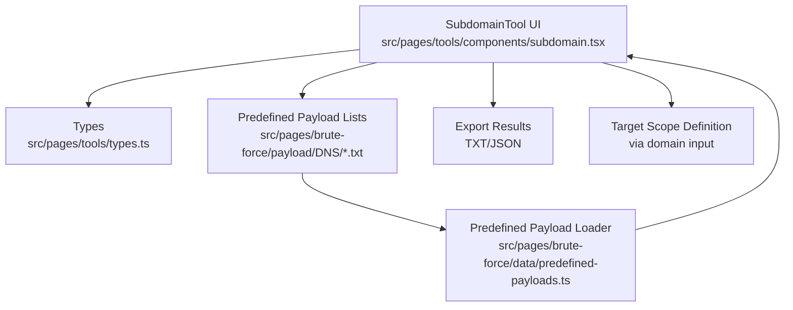
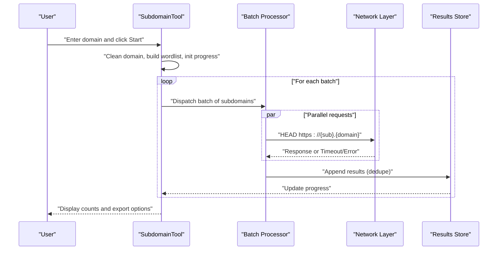
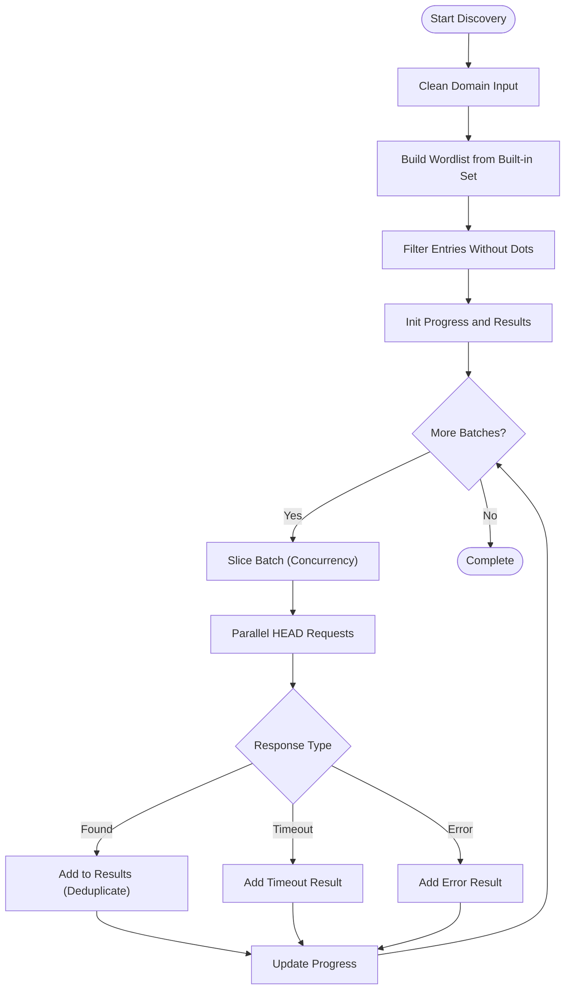
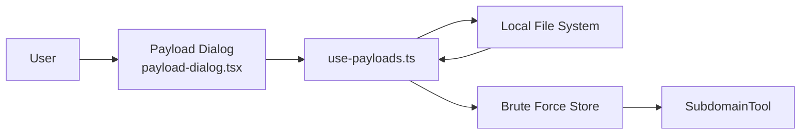
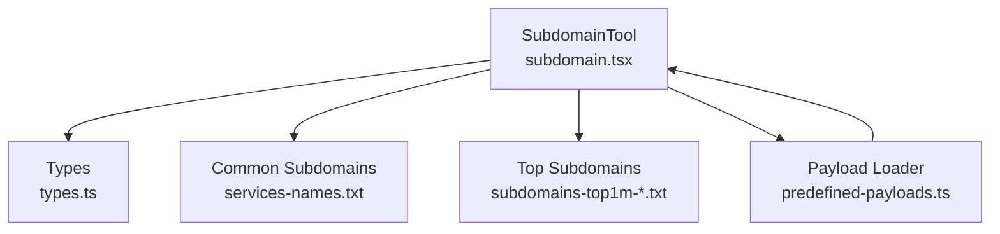

# Subdomain Enumeration

<cite>
**Referenced Files in This Document**
- [subdomain.tsx](file://src/pages/tools/components/subdomain.tsx)
- [types.ts](file://src/pages/tools/types.ts)
- [index.tsx](file://src/pages/tools/index.tsx)
- [constants.ts](file://src/pages/tools/constants.ts)
- [services-names.txt](file://src/pages/brute-force/payload/DNS/services-names.txt)
- [subdomains-top1million-20000.txt](file://src/pages/brute-force/payload/DNS/subdomains-top1million-20000.txt)
- [subdomains-top1million-5000.txt](file://src/pages/brute-force/payload/DNS/subdomains-top1million-5000.txt)
- [predefined-payloads.ts](file://src/pages/brute-force/data/predefined-payloads.ts)
- [use-payloads.ts](file://src/pages/brute-force/hooks/use-payloads.ts)
- [payload-dialog.tsx](file://src/pages/brute-force/components/payload-dialog.tsx)
- [utils.ts](file://src/pages/brute-force/lib/utils.ts)
</cite>

## Table of Contents
1. [Introduction](#introduction)
2. [Project Structure](#project-structure)
3. [Core Components](#core-components)
4. [Architecture Overview](#architecture-overview)
5. [Detailed Component Analysis](#detailed-component-analysis)
6. [Dependency Analysis](#dependency-analysis)
7. [Performance Considerations](#performance-considerations)
8. [Troubleshooting Guide](#troubleshooting-guide)
9. [Conclusion](#conclusion)
10. [Appendices](#appendices)

## Introduction
This document describes the Subdomain Enumeration system implemented in the application. It covers the wordlist-based discovery mechanism using curated lists of common subdomains and service names, concurrency control for efficient parallel scanning, rate limiting and timeout management, and the result processing pipeline that filters valid subdomains, measures response times, and identifies active targets. It also documents payload management for different wordlist sizes and selection criteria, practical workflows for target scope definition and result validation, and guidance for performance optimization and operational security during discovery.

## Project Structure
The Subdomain Enumeration feature is implemented as a dedicated tool within the application’s tools page. It integrates:
- A UI component that orchestrates scanning, displays results, and supports export/copy actions
- Types that define the result model and configuration
- Payload sources for wordlists (common subdomains and service names)
- Optional payload loading mechanisms for custom wordlists

**Diagram sources**
- [subdomain.tsx:41-139](file://src/pages/tools/components/subdomain.tsx#L41-L139)
- [types.ts:27-40](file://src/pages/tools/types.ts#L27-L40)
- [services-names.txt:1-800](file://src/pages/brute-force/payload/DNS/services-names.txt#L1-L800)
- [subdomains-top1million-20000.txt:1-800](file://src/pages/brute-force/payload/DNS/subdomains-top1million-20000.txt#L1-L800)
- [subdomains-top1million-5000.txt:1-800](file://src/pages/brute-force/payload/DNS/subdomains-top1million-5000.txt#L1-L800)
- [predefined-payloads.ts:9-43](file://src/pages/brute-force/data/predefined-payloads.ts#L9-L43)

**Section sources**
- [index.tsx:15-48](file://src/pages/tools/index.tsx#L15-L48)
- [constants.ts:3-12](file://src/pages/tools/constants.ts#L3-L12)

## Core Components
- SubdomainTool UI: Orchestrates discovery, manages concurrency and timeouts, batches requests, and renders results with counts and export options.
- Types: Defines SubdomainResult and SubdomainConfig for consistent data modeling.
- Payload Management: Bundled wordlists for common subdomains and services; optional custom payload loading via file dialogs.

Key behaviors:
- Cleans the target domain and strips protocol/www prefixes
- Builds a wordlist from a built-in set of common subdomains
- Filters out entries containing dots to avoid malformed subdomains
- Scans subdomains in batches with controlled concurrency and per-request timeouts
- Tracks progress and deduplicates results
- Exports found subdomains to TXT or JSON

**Section sources**
- [subdomain.tsx:41-139](file://src/pages/tools/components/subdomain.tsx#L41-L139)
- [types.ts:27-40](file://src/pages/tools/types.ts#L27-L40)

## Architecture Overview
The Subdomain Enumeration workflow combines UI orchestration, asynchronous scanning, and result aggregation.

**Diagram sources**
- [subdomain.tsx:50-139](file://src/pages/tools/components/subdomain.tsx#L50-L139)

## Detailed Component Analysis

### SubdomainTool UI
Responsibilities:
- Accepts a target domain
- Normalizes the domain and constructs subdomains
- Manages concurrency and timeouts
- Batches and dispatches requests
- Aggregates and deduplicates results
- Provides export and copy actions

Concurrency and timeouts:
- Uses a fixed concurrency level for batch processing
- Applies a per-request timeout to detect slow/responsive endpoints
- Uses AbortController to cancel in-flight requests on stop or timeout

Result processing:
- Distinguishes between found, timeout, and error statuses
- Measures response times
- Deduplicates found URLs using a Set

**Diagram sources**
- [subdomain.tsx:50-139](file://src/pages/tools/components/subdomain.tsx#L50-L139)

**Section sources**
- [subdomain.tsx:41-139](file://src/pages/tools/components/subdomain.tsx#L41-L139)

### Types and Configuration
- SubdomainResult: Captures subdomain, full URL, status, optional status code, and response time
- SubdomainConfig: Captures domain, wordlist, concurrency, and timeout

These types enable consistent handling of results and configuration across the tool.

**Section sources**
- [types.ts:27-40](file://src/pages/tools/types.ts#L27-L40)

### Payload Management
Built-in wordlists:
- Common subdomains and service names
- Top subdomains ranked by frequency

Optional custom payloads:
- Load custom wordlists from local files via a file dialog
- Supports .txt, .lst, and .wordlist formats
- Integrates with the brute-force payload loader infrastructure

**Diagram sources**
- [payload-dialog.tsx:8-35](file://src/pages/brute-force/components/payload-dialog.tsx#L8-L35)
- [use-payloads.ts:44-78](file://src/pages/brute-force/hooks/use-payloads.ts#L44-L78)
- [predefined-payloads.ts:9-43](file://src/pages/brute-force/data/predefined-payloads.ts#L9-L43)

**Section sources**
- [services-names.txt:1-800](file://src/pages/brute-force/payload/DNS/services-names.txt#L1-L800)
- [subdomains-top1million-20000.txt:1-800](file://src/pages/brute-force/payload/DNS/subdomains-top1million-20000.txt#L1-L800)
- [subdomains-top1million-5000.txt:1-800](file://src/pages/brute-force/payload/DNS/subdomains-top1million-5000.txt#L1-L800)
- [predefined-payloads.ts:9-43](file://src/pages/brute-force/data/predefined-payloads.ts#L9-L43)
- [use-payloads.ts:44-78](file://src/pages/brute-force/hooks/use-payloads.ts#L44-L78)
- [payload-dialog.tsx:8-35](file://src/pages/brute-force/components/payload-dialog.tsx#L8-L35)

### Result Processing Pipeline
- Status classification: found, timeout, error
- Response time measurement per subdomain
- Deduplication of found URLs
- Export to TXT or JSON with filtering for found targets

Integration points:
- Export logic uses Blob and download links
- Copy-to-clipboard action for quick validation

**Section sources**
- [subdomain.tsx:111-177](file://src/pages/tools/components/subdomain.tsx#L111-L177)

## Dependency Analysis
The SubdomainTool depends on:
- Built-in wordlists for common subdomains and services
- Types for consistent result modeling
- Optional custom payload loading via the brute-force payload system

**Diagram sources**
- [subdomain.tsx:41-139](file://src/pages/tools/components/subdomain.tsx#L41-L139)
- [types.ts:27-40](file://src/pages/tools/types.ts#L27-L40)
- [services-names.txt:1-800](file://src/pages/brute-force/payload/DNS/services-names.txt#L1-L800)
- [subdomains-top1million-20000.txt:1-800](file://src/pages/brute-force/payload/DNS/subdomains-top1million-20000.txt#L1-L800)
- [subdomains-top1million-5000.txt:1-800](file://src/pages/brute-force/payload/DNS/subdomains-top1million-5000.txt#L1-L800)
- [predefined-payloads.ts:9-43](file://src/pages/brute-force/data/predefined-payloads.ts#L9-L43)

**Section sources**
- [subdomain.tsx:41-139](file://src/pages/tools/components/subdomain.tsx#L41-L139)
- [predefined-payloads.ts:9-43](file://src/pages/brute-force/data/predefined-payloads.ts#L9-L43)

## Performance Considerations
- Concurrency control: Fixed batch size controls parallelism; adjust based on network capacity and target resilience
- Per-request timeout: Prevents long waits for unresponsive endpoints; tune for latency characteristics
- Deduplication: Reduces redundant processing and improves result quality
- Head-only requests: Minimizes payload and speeds up checks
- Wordlist size selection: Choose smaller top lists for speed or larger lists for coverage

[No sources needed since this section provides general guidance]

## Troubleshooting Guide
Common issues and resolutions:
- No results returned: Verify domain input and ensure it does not include protocol or path; confirm network connectivity
- Many timeouts: Reduce concurrency or increase timeout; consider rate limiting or staggered runs
- Duplicate entries: Deduplication is automatic; ensure the same subdomain is not manually re-added
- Export failures: Confirm found results exist for TXT export; ensure JSON export has results

Operational tips:
- Use the Stop button to cancel ongoing scans
- Clear results to reset state
- Validate results by copying URLs to a browser or external tool

**Section sources**
- [subdomain.tsx:141-177](file://src/pages/tools/components/subdomain.tsx#L141-L177)

## Conclusion
The Subdomain Enumeration system provides a practical, configurable, and efficient way to discover subdomains using curated and customizable wordlists. Its batching and concurrency model balances speed and reliability, while the result processing pipeline ensures actionable outcomes. By selecting appropriate wordlists and tuning concurrency and timeouts, teams can optimize discovery for different environments and objectives.

[No sources needed since this section summarizes without analyzing specific files]

## Appendices

### Practical Workflows
- Define target scope: Enter the base domain in the Subdomain tool; the system cleans and normalizes it
- Select wordlist:
  - Use built-in common subdomains and services
  - Load a custom wordlist via the payload dialog for specialized recon
- Run discovery:
  - Start the scan; monitor progress and counts
  - Stop early if needed
- Validate results:
  - Copy URLs to a browser or external tool
  - Export found subdomains to TXT or JSON for downstream tools

**Section sources**
- [subdomain.tsx:50-139](file://src/pages/tools/components/subdomain.tsx#L50-L139)
- [payload-dialog.tsx:8-35](file://src/pages/brute-force/components/payload-dialog.tsx#L8-L35)
- [use-payloads.ts:44-78](file://src/pages/brute-force/hooks/use-payloads.ts#L44-L78)

### Payload Selection Criteria
- Small scope, fast pass: Use top subdomains lists for rapid coverage
- Broad coverage: Combine common subdomains with service names
- Specialized targets: Load custom wordlists tailored to the environment

**Section sources**
- [services-names.txt:1-800](file://src/pages/brute-force/payload/DNS/services-names.txt#L1-L800)
- [subdomains-top1million-20000.txt:1-800](file://src/pages/brute-force/payload/DNS/subdomains-top1million-20000.txt#L1-L800)
- [subdomains-top1million-5000.txt:1-800](file://src/pages/brute-force/payload/DNS/subdomains-top1million-5000.txt#L1-L800)
- [predefined-payloads.ts:9-43](file://src/pages/brute-force/data/predefined-payloads.ts#L9-L43)

### Operational Security Guidance
- Respect rate limits and timeouts to minimize detection
- Use smaller wordlists and staggered runs in sensitive environments
- Limit exports to trusted systems and review results before further automation
- Combine enumeration results with passive and active reconnaissance responsibly

[No sources needed since this section provides general guidance]