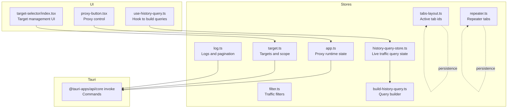
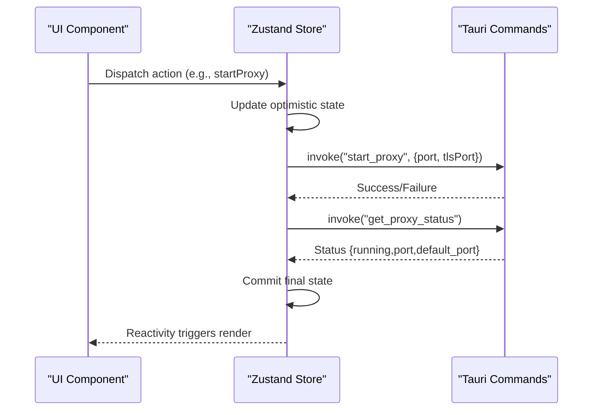
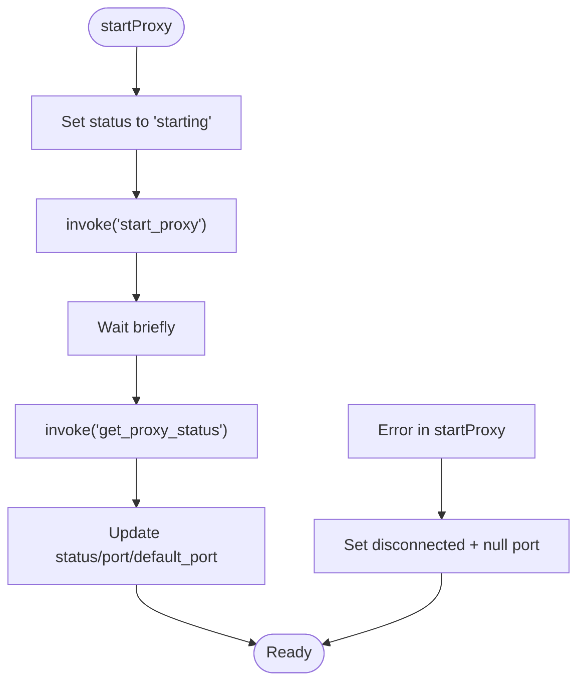
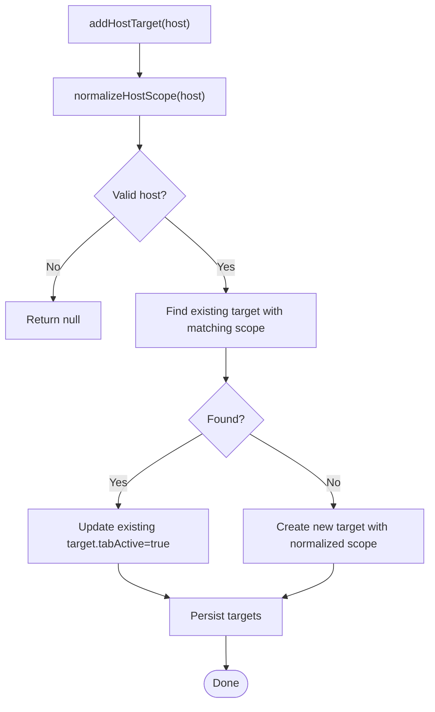
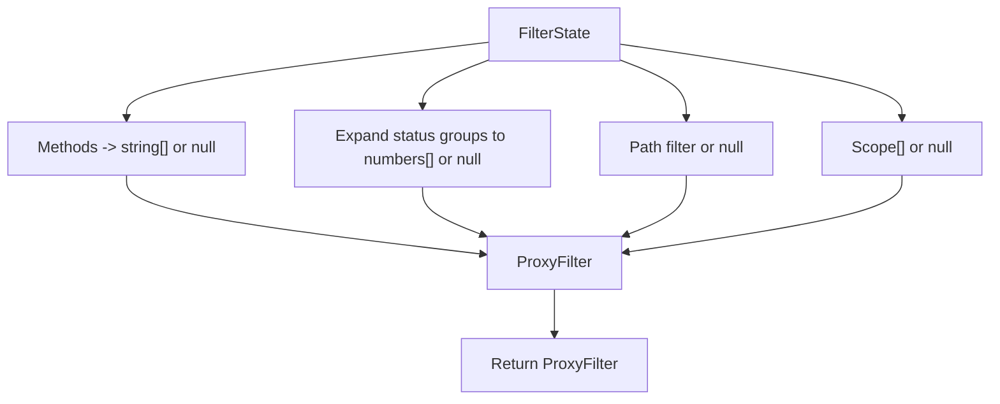
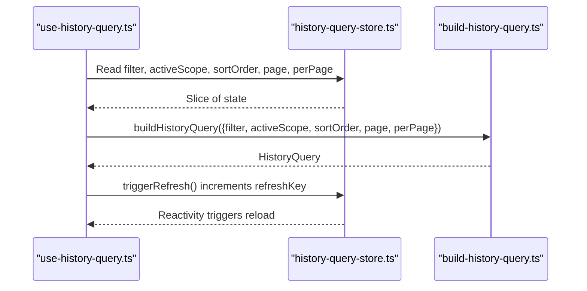
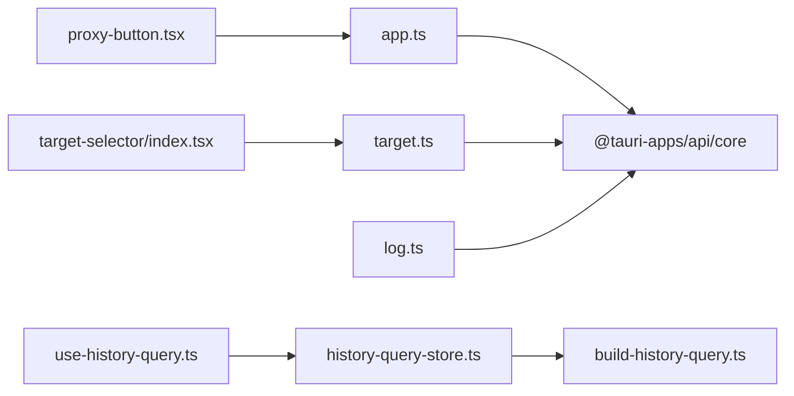

# Application State

<cite>
**Referenced Files in This Document**
- [src/stores/app.ts](file://src/stores/app.ts)
- [src/stores/target.ts](file://src/stores/target.ts)
- [src/stores/filter.ts](file://src/stores/filter.ts)
- [src/stores/log.ts](file://src/stores/log.ts)
- [src/stores/tabs-layout.ts](file://src/stores/tabs-layout.ts)
- [src/stores/repeater.ts](file://src/stores/repeater.ts)
- [src/pages/live-traffic/state/history-query-store.ts](file://src/pages/live-traffic/state/history-query-store.ts)
- [src/pages/live-traffic/state/build-history-query.ts](file://src/pages/live-traffic/state/build-history-query.ts)
- [src/pages/live-traffic/hooks/use-history-query.ts](file://src/pages/live-traffic/hooks/use-history-query.ts)
- [src/pages/live-traffic/components/target-selector/index.tsx](file://src/pages/live-traffic/components/target-selector/index.tsx)
- [src/components/layout/proxy-button.tsx](file://src/components/layout/proxy-button.tsx)
- [src/hooks/useTargets.ts](file://src/hooks/useTargets.ts)
- [src/types/index.ts](file://src/types/index.ts)
</cite>

## Table of Contents
1. [Introduction](#introduction)
2. [Project Structure](#project-structure)
3. [Core Components](#core-components)
4. [Architecture Overview](#architecture-overview)
5. [Detailed Component Analysis](#detailed-component-analysis)
6. [Dependency Analysis](#dependency-analysis)
7. [Performance Considerations](#performance-considerations)
8. [Troubleshooting Guide](#troubleshooting-guide)
9. [Conclusion](#conclusion)
10. [Appendices](#appendices)

## Introduction
This document explains AppRecon’s application-wide state management built with Zustand. It covers:
- Proxy runtime state: status tracking, port management, and connection monitoring
- Target management: selection, filtering, and scope handling
- Filter configuration state: traffic filtering, search parameters, and query persistence
- Practical patterns: initialization, store composition, reactive updates
- Synchronization with Tauri commands, asynchronous operations, and error handling
- Persistence, hydration, and cleanup
- Best practices for organization, performance, and debugging in network proxy applications

## Project Structure
Zustand stores are organized by domain:
- Global runtime and proxy state
- Targets and scopes
- Filters and query builders
- Logs and pagination
- Tabs layout and repeater sessions
- Live traffic query state and builder

**Diagram sources**
- [src/stores/app.ts:1-109](file://src/stores/app.ts#L1-L109)
- [src/stores/target.ts:1-124](file://src/stores/target.ts#L1-L124)
- [src/stores/filter.ts:1-99](file://src/stores/filter.ts#L1-L99)
- [src/stores/log.ts:1-51](file://src/stores/log.ts#L1-L51)
- [src/stores/tabs-layout.ts:1-29](file://src/stores/tabs-layout.ts#L1-L29)
- [src/stores/repeater.ts:1-166](file://src/stores/repeater.ts#L1-L166)
- [src/pages/live-traffic/state/history-query-store.ts:1-140](file://src/pages/live-traffic/state/history-query-store.ts#L1-L140)
- [src/pages/live-traffic/state/build-history-query.ts:1-98](file://src/pages/live-traffic/state/build-history-query.ts#L1-L98)
- [src/pages/live-traffic/hooks/use-history-query.ts:1-117](file://src/pages/live-traffic/hooks/use-history-query.ts#L1-L117)
- [src/components/layout/proxy-button.tsx:1-74](file://src/components/layout/proxy-button.tsx#L1-L74)
- [src/pages/live-traffic/components/target-selector/index.tsx:1-95](file://src/pages/live-traffic/components/target-selector/index.tsx#L1-L95)

**Section sources**
- [src/stores/app.ts:1-109](file://src/stores/app.ts#L1-L109)
- [src/stores/target.ts:1-124](file://src/stores/target.ts#L1-L124)
- [src/stores/filter.ts:1-99](file://src/stores/filter.ts#L1-L99)
- [src/stores/log.ts:1-51](file://src/stores/log.ts#L1-L51)
- [src/stores/tabs-layout.ts:1-29](file://src/stores/tabs-layout.ts#L1-L29)
- [src/stores/repeater.ts:1-166](file://src/stores/repeater.ts#L1-L166)
- [src/pages/live-traffic/state/history-query-store.ts:1-140](file://src/pages/live-traffic/state/history-query-store.ts#L1-L140)
- [src/pages/live-traffic/state/build-history-query.ts:1-98](file://src/pages/live-traffic/state/build-history-query.ts#L1-L98)
- [src/pages/live-traffic/hooks/use-history-query.ts:1-117](file://src/pages/live-traffic/hooks/use-history-query.ts#L1-L117)
- [src/components/layout/proxy-button.tsx:1-74](file://src/components/layout/proxy-button.tsx#L1-L74)
- [src/pages/live-traffic/components/target-selector/index.tsx:1-95](file://src/pages/live-traffic/components/target-selector/index.tsx#L1-L95)

## Core Components
- Proxy runtime state: manages proxy lifecycle, ports, and connection counts via Tauri commands
- Target state: CRUD and scope normalization for targets with persistence and hydration
- Filter state: toggles for methods/statuses, path and free-text search; converts to backend filters
- Live traffic query state: pagination, sort order, selected call, and refresh triggers
- Logs state: selection, pagination, sorting, and clearing/deleting entries via Tauri
- Tabs layout state: persists active tab ids per scope
- Repeater state: manages request and WebSocket repeater tabs with persistence and cleanup

**Section sources**
- [src/stores/app.ts:1-109](file://src/stores/app.ts#L1-L109)
- [src/stores/target.ts:1-124](file://src/stores/target.ts#L1-L124)
- [src/stores/filter.ts:1-99](file://src/stores/filter.ts#L1-L99)
- [src/pages/live-traffic/state/history-query-store.ts:1-140](file://src/pages/live-traffic/state/history-query-store.ts#L1-L140)
- [src/stores/log.ts:1-51](file://src/stores/log.ts#L1-L51)
- [src/stores/tabs-layout.ts:1-29](file://src/stores/tabs-layout.ts#L1-L29)
- [src/stores/repeater.ts:1-166](file://src/stores/repeater.ts#L1-L166)

## Architecture Overview
Zustand stores encapsulate domain logic and side effects. UI components subscribe to slices of state and dispatch actions. Asynchronous operations synchronize with Tauri commands, updating state and triggering re-renders. Persistence is applied selectively to minimize serialized payloads and ensure safe hydration.

**Diagram sources**
- [src/stores/app.ts:38-96](file://src/stores/app.ts#L38-L96)
- [src/components/layout/proxy-button.tsx:24-46](file://src/components/layout/proxy-button.tsx#L24-L46)

**Section sources**
- [src/stores/app.ts:1-109](file://src/stores/app.ts#L1-L109)
- [src/components/layout/proxy-button.tsx:1-74](file://src/components/layout/proxy-button.tsx#L1-L74)

## Detailed Component Analysis

### Proxy Runtime State
- Responsibilities:
  - Track proxy status: disconnected, connected, starting, stopping
  - Manage ports: current, default, and connection count
  - Synchronize with backend via Tauri commands
- Key actions:
  - startProxy: sets status to starting, invokes backend, waits briefly, reads runtime status, then updates state
  - stopProxy: sets status to stopping, invokes backend, reads runtime status, updates state
  - checkProxyStatus: reads runtime status and reconciles state
- Persistence:
  - Stores status, ports, and safety alert dismissal
- Error handling:
  - On failure, restores sensible defaults and rethrows for UI to handle

**Diagram sources**
- [src/stores/app.ts:38-57](file://src/stores/app.ts#L38-L57)

**Section sources**
- [src/stores/app.ts:1-109](file://src/stores/app.ts#L1-L109)
- [src/types/index.ts:11-16](file://src/types/index.ts#L11-L16)
- [src/components/layout/proxy-button.tsx:1-74](file://src/components/layout/proxy-button.tsx#L1-L74)

### Target Management System
- Responsibilities:
  - Add/remove/update targets
  - Normalize and deduplicate host scope entries
  - Track active tabs per target
- Key helpers:
  - normalizeHostScope: robustly extracts canonical host
  - addHostTarget: creates or activates a target based on normalized host
- Persistence:
  - Persists targets array; hydrates with safe defaults for tabActive
- Error handling:
  - Returns null for invalid hosts; logs and continues

**Diagram sources**
- [src/stores/target.ts:53-82](file://src/stores/target.ts#L53-L82)

**Section sources**
- [src/stores/target.ts:1-124](file://src/stores/target.ts#L1-L124)
- [src/hooks/useTargets.ts:1-23](file://src/hooks/useTargets.ts#L1-L23)
- [src/types/index.ts:1-9](file://src/types/index.ts#L1-L9)

### Filter Configuration State
- Responsibilities:
  - Maintain search text, HTTP methods, status code groups, and path filter
  - Convert to backend-friendly ProxyFilter
- Conversion logic:
  - Methods: Set<string> -> string[] or null
  - Status codes: expand grouped labels (e.g., 2xx) to numbers; optional fallback
  - Scope: optional string[] passed downstream
- UI integration:
  - Toggle methods/statuses, set/clear filters, set path filter

**Diagram sources**
- [src/stores/filter.ts:11-39](file://src/stores/filter.ts#L11-L39)

**Section sources**
- [src/stores/filter.ts:1-99](file://src/stores/filter.ts#L1-L99)
- [src/pages/live-traffic/state/build-history-query.ts:1-98](file://src/pages/live-traffic/state/build-history-query.ts#L1-L98)

### Live Traffic Query State and Builder
- Responsibilities:
  - Pagination, sort order, selected call, refresh key
  - Active scope management with page reset on change
  - Filter toggles and clear
- Query building:
  - Converts UI filter state to backend query with normalization and grouping
  - Detects active filters for UX hints

**Diagram sources**
- [src/pages/live-traffic/hooks/use-history-query.ts:1-117](file://src/pages/live-traffic/hooks/use-history-query.ts#L1-L117)
- [src/pages/live-traffic/state/history-query-store.ts:1-140](file://src/pages/live-traffic/state/history-query-store.ts#L1-L140)
- [src/pages/live-traffic/state/build-history-query.ts:1-98](file://src/pages/live-traffic/state/build-history-query.ts#L1-L98)

**Section sources**
- [src/pages/live-traffic/state/history-query-store.ts:1-140](file://src/pages/live-traffic/state/history-query-store.ts#L1-L140)
- [src/pages/live-traffic/state/build-history-query.ts:1-98](file://src/pages/live-traffic/state/build-history-query.ts#L1-L98)
- [src/pages/live-traffic/hooks/use-history-query.ts:1-117](file://src/pages/live-traffic/hooks/use-history-query.ts#L1-L117)

### Logs and Pagination State
- Responsibilities:
  - Track selected call, pagination metadata, loading states, sort order
  - Clear all calls and delete single call via Tauri
- Integration:
  - Delegates persistence to UI/page logic; store focuses on runtime state

**Section sources**
- [src/stores/log.ts:1-51](file://src/stores/log.ts#L1-L51)

### Tabs Layout and Repeater State
- Tabs layout:
  - Persists active tab id per scope key
- Repeater:
  - Manages request and WebSocket tabs, numbering, renaming, closing, and directional close
  - Persists tabs and active tab id with intelligent merge for hydration

**Section sources**
- [src/stores/tabs-layout.ts:1-29](file://src/stores/tabs-layout.ts#L1-L29)
- [src/stores/repeater.ts:1-166](file://src/stores/repeater.ts#L1-L166)

### UI Integration Examples
- Proxy control:
  - Component subscribes to proxy status and ports, toggles proxy via store actions, shows feedback
- Target selector:
  - Dialog-driven management with search, edit, save, and selection callbacks

**Section sources**
- [src/components/layout/proxy-button.tsx:1-74](file://src/components/layout/proxy-button.tsx#L1-L74)
- [src/pages/live-traffic/components/target-selector/index.tsx:1-95](file://src/pages/live-traffic/components/target-selector/index.tsx#L1-L95)

## Dependency Analysis
- Internal dependencies:
  - UI components depend on specific store slices
  - Query builder depends on filter store and history query store
  - Target store depends on types for normalization
- External dependencies:
  - Tauri invoke for all backend synchronization
  - Zustand persist middleware for selective persistence

**Diagram sources**
- [src/components/layout/proxy-button.tsx:1-74](file://src/components/layout/proxy-button.tsx#L1-L74)
- [src/pages/live-traffic/components/target-selector/index.tsx:1-95](file://src/pages/live-traffic/components/target-selector/index.tsx#L1-L95)
- [src/pages/live-traffic/hooks/use-history-query.ts:1-117](file://src/pages/live-traffic/hooks/use-history-query.ts#L1-L117)
- [src/pages/live-traffic/state/history-query-store.ts:1-140](file://src/pages/live-traffic/state/history-query-store.ts#L1-L140)
- [src/pages/live-traffic/state/build-history-query.ts:1-98](file://src/pages/live-traffic/state/build-history-query.ts#L1-L98)
- [src/stores/app.ts:1-109](file://src/stores/app.ts#L1-L109)
- [src/stores/target.ts:1-124](file://src/stores/target.ts#L1-L124)
- [src/stores/log.ts:1-51](file://src/stores/log.ts#L1-L51)

**Section sources**
- [src/components/layout/proxy-button.tsx:1-74](file://src/components/layout/proxy-button.tsx#L1-L74)
- [src/pages/live-traffic/components/target-selector/index.tsx:1-95](file://src/pages/live-traffic/components/target-selector/index.tsx#L1-L95)
- [src/pages/live-traffic/hooks/use-history-query.ts:1-117](file://src/pages/live-traffic/hooks/use-history-query.ts#L1-L117)
- [src/pages/live-traffic/state/history-query-store.ts:1-140](file://src/pages/live-traffic/state/history-query-store.ts#L1-L140)
- [src/pages/live-traffic/state/build-history-query.ts:1-98](file://src/pages/live-traffic/state/build-history-query.ts#L1-L98)
- [src/stores/app.ts:1-109](file://src/stores/app.ts#L1-L109)
- [src/stores/target.ts:1-124](file://src/stores/target.ts#L1-L124)
- [src/stores/log.ts:1-51](file://src/stores/log.ts#L1-L51)

## Performance Considerations
- Prefer shallow selectors in hooks to avoid unnecessary re-renders
- Keep persisted state minimal; only persist fields needed across sessions
- Debounce or batch frequent UI updates (e.g., search input) before updating filter state
- Use refreshKey pattern to force reloads without leaking memory
- Normalize and compact filter sets to reduce payload sizes
- Avoid synchronous heavy work in reducers; delegate to async actions

[No sources needed since this section provides general guidance]

## Troubleshooting Guide
- Proxy does not start:
  - Verify backend command availability and permissions
  - Inspect console logs in store actions for thrown errors
  - Confirm status reconciliation after invoke completes
- Proxy status stuck:
  - Call status checker periodically to reconcile state
  - Ensure backend reports accurate running/port/default_port
- Targets not persisting:
  - Check merge strategy hydrates missing fields safely
  - Validate that normalized scope matches expectations
- Filters not applying:
  - Confirm conversion expands grouped status codes
  - Ensure scope is passed when active
- Logs not clearing:
  - Verify Tauri command clears backend records and resets pagination

**Section sources**
- [src/stores/app.ts:38-96](file://src/stores/app.ts#L38-L96)
- [src/stores/target.ts:108-121](file://src/stores/target.ts#L108-L121)
- [src/stores/filter.ts:11-39](file://src/stores/filter.ts#L11-L39)
- [src/stores/log.ts:42-50](file://src/stores/log.ts#L42-L50)

## Conclusion
AppRecon’s state model cleanly separates concerns across domains, leverages Zustand for simplicity, and integrates tightly with Tauri for backend operations. By persisting only essential state, normalizing inputs, and using targeted selectors, the system remains responsive and maintainable. Following the patterns documented here ensures predictable behavior for proxy lifecycle, target management, and live traffic filtering.

[No sources needed since this section summarizes without analyzing specific files]

## Appendices

### Practical Patterns and Recipes
- State initialization:
  - Use create with persist middleware for domain-specific stores
  - Define partialize to serialize only necessary fields
- Store composition:
  - Compose multiple stores per domain; keep cross-domain logic in UI hooks
- Reactive updates:
  - Use shallow selectors to subscribe to small slices
- Asynchronous operations:
  - Wrap Tauri calls in async actions; update state optimistically then reconcile
- Error handling:
  - Catch and log errors; provide fallback state and rethrow for UI
- Persistence and hydration:
  - Provide merge strategy to handle missing fields gracefully
- Cleanup:
  - Close tabs and reset pagination when switching contexts

[No sources needed since this section provides general guidance]