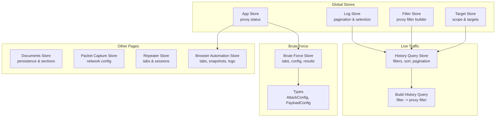
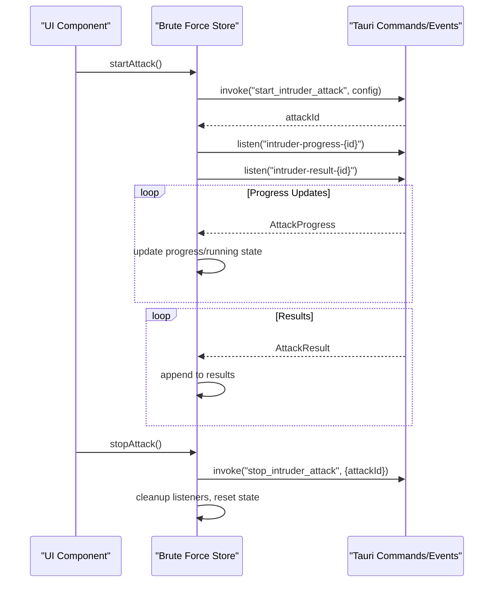
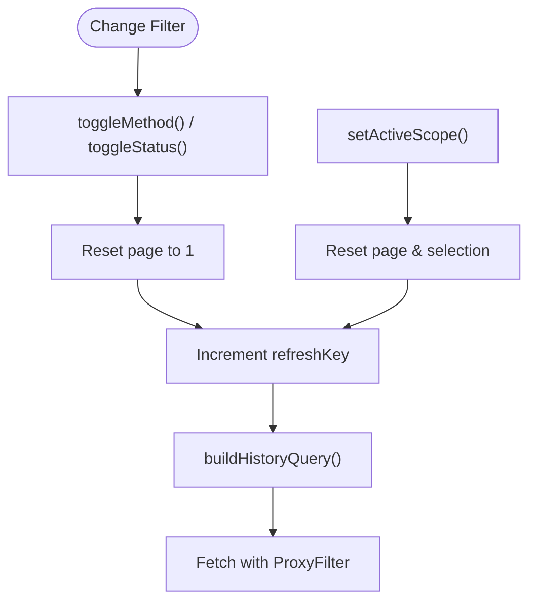
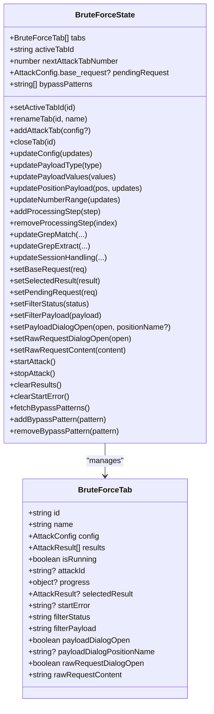
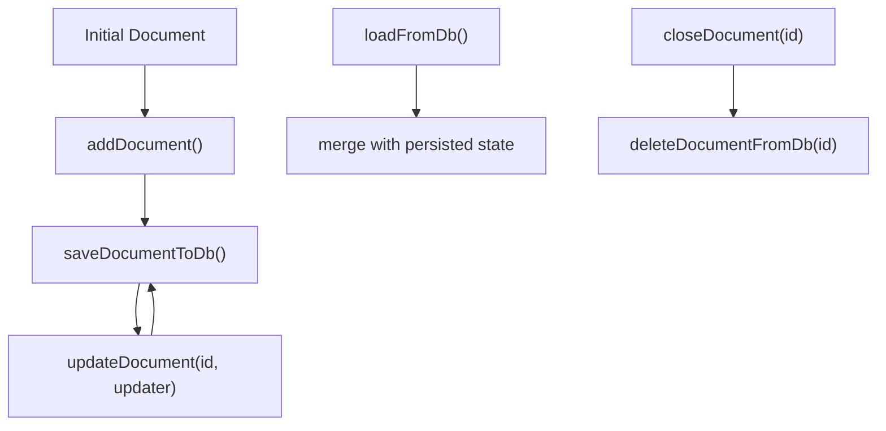
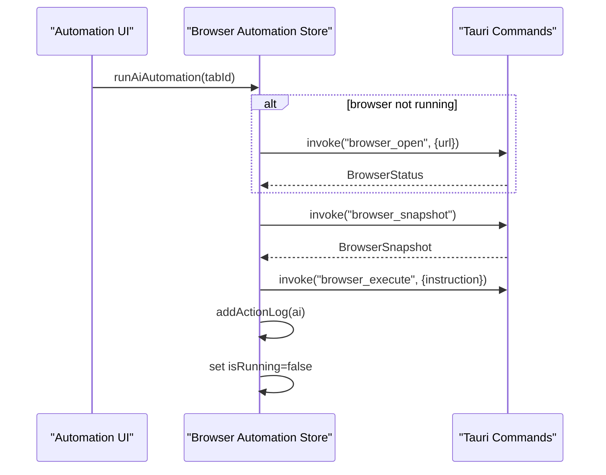
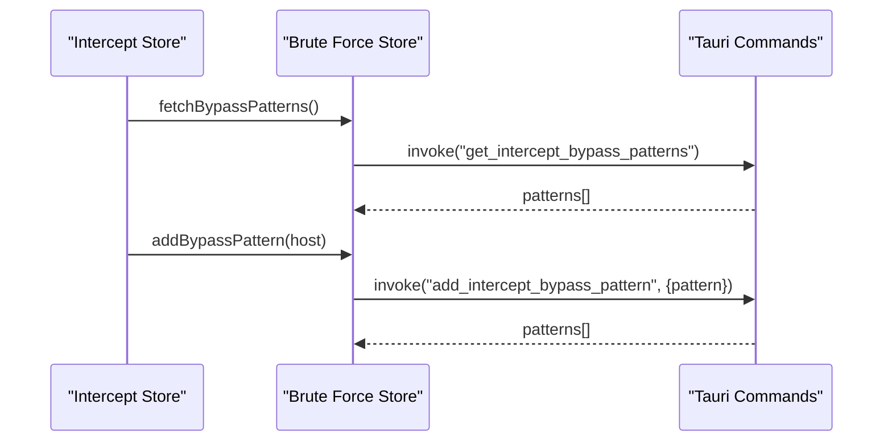
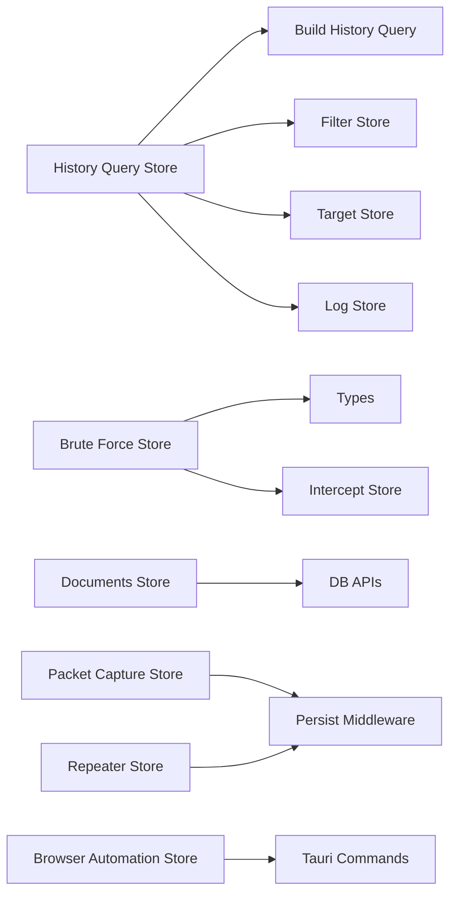

# Page-Specific Stores

<cite>
**Referenced Files in This Document**
- [app.ts](file://src/stores/app.ts)
- [browser-automation.ts](file://src/stores/browser-automation.ts)
- [bruto-force.ts](file://src/stores/bruto-force.ts)
- [documents.ts](file://src/stores/documents.ts)
- [filter.ts](file://src/stores/filter.ts)
- [log.ts](file://src/stores/log.ts)
- [packet-capture.ts](file://src/stores/packet-capture.ts)
- [repeater.ts](file://src/stores/repeater.ts)
- [target.ts](file://src/stores/target.ts)
- [history-query-store.ts](file://src/pages/live-traffic/state/history-query-store.ts)
- [build-history-query.ts](file://src/pages/live-traffic/state/build-history-query.ts)
- [intercept-store.ts](file://src/pages/intercept/state/intercept-store.ts)
- [types.ts](file://src/pages/brute-force/types.ts)
- [use-page.ts](file://src/pages/brute-force/hooks/use-page.ts)
- [use-payloads.ts](file://src/pages/brute-force/hooks/use-payloads.ts)
- [use-filters.ts](file://src/pages/brute-force/hooks/use-filters.ts)
</cite>

## Table of Contents
1. [Introduction](#introduction)
2. [Project Structure](#project-structure)
3. [Core Components](#core-components)
4. [Architecture Overview](#architecture-overview)
5. [Detailed Component Analysis](#detailed-component-analysis)
6. [Dependency Analysis](#dependency-analysis)
7. [Performance Considerations](#performance-considerations)
8. [Troubleshooting Guide](#troubleshooting-guide)
9. [Conclusion](#conclusion)

## Introduction
This document explains AppRecon’s page-specific state management built with Zustand stores. It focuses on:
- Live traffic log store: history query, filtering, pagination, and selection
- Brute force testing store: attack configuration, payload management, and result tracking
- Documents management store: editing state, section management, and persistence
- Packet capture store: network configuration persistence
- Repeater store: request/response tabs and WebSocket sessions
- Browser automation store: multi-tab browser control, snapshots, and action logs
It also covers asynchronous operations, persistence, cleanup, composition patterns, performance, and debugging techniques.

## Project Structure
The stores are organized by domain and page:
- Global app/runtime stores: app, target, filter, log
- Page-specific stores: live traffic (history query), brute force, documents, packet capture, repeater, browser automation
- Interception and live traffic integration via shared filter and query builders

**Diagram sources**
- [history-query-store.ts:1-140](file://src/pages/live-traffic/state/history-query-store.ts#L1-L140)
- [build-history-query.ts:1-98](file://src/pages/live-traffic/state/build-history-query.ts#L1-L98)
- [bruto-force.ts:1-470](file://src/stores/bruto-force.ts#L1-L470)
- [types.ts:1-275](file://src/pages/brute-force/types.ts#L1-L275)
- [documents.ts:1-347](file://src/stores/documents.ts#L1-L347)
- [packet-capture.ts:1-33](file://src/stores/packet-capture.ts#L1-L33)
- [repeater.ts:1-166](file://src/stores/repeater.ts#L1-L166)
- [browser-automation.ts:1-362](file://src/stores/browser-automation.ts#L1-L362)
- [filter.ts:1-99](file://src/stores/filter.ts#L1-L99)
- [log.ts:1-51](file://src/stores/log.ts#L1-L51)
- [target.ts:1-124](file://src/stores/target.ts#L1-L124)

**Section sources**
- [history-query-store.ts:1-140](file://src/pages/live-traffic/state/history-query-store.ts#L1-L140)
- [build-history-query.ts:1-98](file://src/pages/live-traffic/state/build-history-query.ts#L1-L98)
- [bruto-force.ts:1-470](file://src/stores/bruto-force.ts#L1-L470)
- [types.ts:1-275](file://src/pages/brute-force/types.ts#L1-L275)
- [documents.ts:1-347](file://src/stores/documents.ts#L1-L347)
- [packet-capture.ts:1-33](file://src/stores/packet-capture.ts#L1-L33)
- [repeater.ts:1-166](file://src/stores/repeater.ts#L1-L166)
- [browser-automation.ts:1-362](file://src/stores/browser-automation.ts#L1-L362)
- [filter.ts:1-99](file://src/stores/filter.ts#L1-L99)
- [log.ts:1-51](file://src/stores/log.ts#L1-L51)
- [target.ts:1-124](file://src/stores/target.ts#L1-L124)

## Core Components
- Live Traffic History Query Store: manages filter state, sorting, pagination, and selection for history queries. It normalizes filters and resets pagination on changes.
- Brute Force Store: orchestrates attack tabs, configuration, payload management, progress events, and results. Handles Tauri event listeners per tab and cleanup.
- Documents Store: manages multiple recon documents, active document, sections, API entries, and persistence to DB.
- Packet Capture Store: persists network capture configuration and interface ID.
- Repeater Store: maintains request and WebSocket tabs, numbering, and tab operations with persistence.
- Browser Automation Store: multi-tab browser control, snapshots, action logs, and AI-driven crawling.
- Filter Store: converts filter state to a proxy filter shape for backend consumption.
- Log Store: manages selected call, pagination, loading states, and clears/deletes calls.
- Target Store: manages targets and active tab state with persistence.

**Section sources**
- [history-query-store.ts:1-140](file://src/pages/live-traffic/state/history-query-store.ts#L1-L140)
- [bruto-force.ts:1-470](file://src/stores/bruto-force.ts#L1-L470)
- [documents.ts:1-347](file://src/stores/documents.ts#L1-L347)
- [packet-capture.ts:1-33](file://src/stores/packet-capture.ts#L1-L33)
- [repeater.ts:1-166](file://src/stores/repeater.ts#L1-L166)
- [browser-automation.ts:1-362](file://src/stores/browser-automation.ts#L1-L362)
- [filter.ts:1-99](file://src/stores/filter.ts#L1-L99)
- [log.ts:1-51](file://src/stores/log.ts#L1-L51)
- [target.ts:1-124](file://src/stores/target.ts#L1-L124)

## Architecture Overview
Zustand stores encapsulate page-specific state and integrate with Tauri commands and events. Stores are composed to support:
- Live traffic: query store feeds proxy filters and pagination to backend
- Brute force: starts/stops attacks, listens to progress/result events, and updates results
- Documents: persistence via DB APIs and normalization
- Repeater/Browser automation: tab management and async operations with UI feedback

**Diagram sources**
- [bruto-force.ts:338-436](file://src/stores/bruto-force.ts#L338-L436)

**Section sources**
- [bruto-force.ts:338-436](file://src/stores/bruto-force.ts#L338-L436)

## Detailed Component Analysis

### Live Traffic Log Store (History Query)
Responsibilities:
- Maintain filter state (search, methods, status codes, path filter)
- Track active scope, sort order, pagination, selected call, and refresh key
- Normalize filters to a proxy filter shape and compute active filters
- Reset pagination and selection when filters change

Key behaviors:
- Toggle methods/status toggles sets and resets page
- setActiveScope resets page and selection when scope changes
- triggerRefresh increments a key to force re-fetches
- buildHistoryQuery converts UI filters to backend-friendly ProxyFilter

**Diagram sources**
- [history-query-store.ts:86-138](file://src/pages/live-traffic/state/history-query-store.ts#L86-L138)
- [build-history-query.ts:12-67](file://src/pages/live-traffic/state/build-history-query.ts#L12-L67)

**Section sources**
- [history-query-store.ts:1-140](file://src/pages/live-traffic/state/history-query-store.ts#L1-L140)
- [build-history-query.ts:1-98](file://src/pages/live-traffic/state/build-history-query.ts#L1-L98)
- [filter.ts:11-39](file://src/stores/filter.ts#L11-L39)

### Brute Force Testing Store
Responsibilities:
- Manage attack tabs with configs, results, progress, and selection
- Payload management: types, values, runtime files, number ranges, processing steps
- Start/stop attacks, listen to progress/result events, and clean up listeners
- Integrate with intercept bypass patterns and UI feedback

Highlights:
- Tab lifecycle: add, rename, close, and maintain active tab
- Config updates: payload type/values, position payloads, processing steps, grep match/extract, session handling
- Async orchestration: startAttack invokes backend, listens to events, updates state, and cleans up on stop
- Filtering helpers: status/payload filters and clearing results

**Diagram sources**
- [bruto-force.ts:25-86](file://src/stores/bruto-force.ts#L25-L86)
- [bruto-force.ts:142-470](file://src/stores/bruto-force.ts#L142-L470)
- [types.ts:62-102](file://src/pages/brute-force/types.ts#L62-L102)

**Section sources**
- [bruto-force.ts:142-470](file://src/stores/bruto-force.ts#L142-L470)
- [types.ts:1-275](file://src/pages/brute-force/types.ts#L1-L275)
- [use-page.ts:11-126](file://src/pages/brute-force/hooks/use-page.ts#L11-L126)
- [use-payloads.ts:7-84](file://src/pages/brute-force/hooks/use-payloads.ts#L7-L84)
- [use-filters.ts:5-29](file://src/pages/brute-force/hooks/use-filters.ts#L5-L29)

### Document Management Store
Responsibilities:
- Manage multiple documents with sections, API entries, and custom sections
- Persist documents to DB and restore on startup
- Normalize documents to ensure consistent structure
- Close documents and maintain active document

Key operations:
- Add/update/remove API entries
- Add/remove custom sections and restore built-in sections
- Load from DB and merge with persisted state
- Save/delete documents asynchronously

**Diagram sources**
- [documents.ts:71-347](file://src/stores/documents.ts#L71-L347)

**Section sources**
- [documents.ts:71-347](file://src/stores/documents.ts#L71-L347)

### Packet Capture Store
Responsibilities:
- Persist last used network capture configuration and interface ID
- Clear saved configuration when needed

**Section sources**
- [packet-capture.ts:13-33](file://src/stores/packet-capture.ts#L13-L33)

### Repeater Store
Responsibilities:
- Maintain request and WebSocket tabs with numbering and renaming
- Close tabs and manage active tab
- Close tabs to left/right and persist state

**Section sources**
- [repeater.ts:43-166](file://src/stores/repeater.ts#L43-L166)

### Browser Automation Store
Responsibilities:
- Multi-tab browser control: open/close/navigate
- Snapshot capture and accessibility tree inspection
- AI automation orchestration and action logging
- Status polling and error handling

**Diagram sources**
- [browser-automation.ts:218-298](file://src/stores/browser-automation.ts#L218-L298)

**Section sources**
- [browser-automation.ts:101-362](file://src/stores/browser-automation.ts#L101-L362)

### Interception Integration
The interception store integrates with the brute force store to keep bypass patterns synchronized and to forward matched requests.

**Diagram sources**
- [intercept-store.ts:91-201](file://src/pages/intercept/state/intercept-store.ts#L91-L201)
- [bruto-force.ts:442-468](file://src/stores/bruto-force.ts#L442-L468)

**Section sources**
- [intercept-store.ts:91-201](file://src/pages/intercept/state/intercept-store.ts#L91-L201)
- [bruto-force.ts:442-468](file://src/stores/bruto-force.ts#L442-L468)

## Dependency Analysis
- Live traffic depends on:
  - History query store for UI state
  - Filter store to convert to ProxyFilter
  - Target store for active scope
  - Log store for pagination and selection
- Brute force depends on:
  - Types for AttackConfig and PayloadConfig
  - Tauri events for progress/results
  - Intercept store for bypass patterns
- Documents depend on:
  - DB APIs for persistence
  - Normalization utilities
- Repeater and packet capture rely on persistence middleware
- Browser automation depends on Tauri browser commands and action logging

**Diagram sources**
- [history-query-store.ts:1-140](file://src/pages/live-traffic/state/history-query-store.ts#L1-L140)
- [build-history-query.ts:1-98](file://src/pages/live-traffic/state/build-history-query.ts#L1-L98)
- [filter.ts:1-99](file://src/stores/filter.ts#L1-L99)
- [target.ts:1-124](file://src/stores/target.ts#L1-L124)
- [log.ts:1-51](file://src/stores/log.ts#L1-L51)
- [bruto-force.ts:1-470](file://src/stores/bruto-force.ts#L1-L470)
- [types.ts:1-275](file://src/pages/brute-force/types.ts#L1-L275)
- [intercept-store.ts:1-202](file://src/pages/intercept/state/intercept-store.ts#L1-L202)
- [documents.ts:1-347](file://src/stores/documents.ts#L1-L347)
- [packet-capture.ts:1-33](file://src/stores/packet-capture.ts#L1-L33)
- [repeater.ts:1-166](file://src/stores/repeater.ts#L1-L166)
- [browser-automation.ts:1-362](file://src/stores/browser-automation.ts#L1-L362)

**Section sources**
- [history-query-store.ts:1-140](file://src/pages/live-traffic/state/history-query-store.ts#L1-L140)
- [build-history-query.ts:1-98](file://src/pages/live-traffic/state/build-history-query.ts#L1-L98)
- [filter.ts:1-99](file://src/stores/filter.ts#L1-L99)
- [target.ts:1-124](file://src/stores/target.ts#L1-L124)
- [log.ts:1-51](file://src/stores/log.ts#L1-L51)
- [bruto-force.ts:1-470](file://src/stores/bruto-force.ts#L1-L470)
- [types.ts:1-275](file://src/pages/brute-force/types.ts#L1-L275)
- [intercept-store.ts:1-202](file://src/pages/intercept/state/intercept-store.ts#L1-L202)
- [documents.ts:1-347](file://src/stores/documents.ts#L1-L347)
- [packet-capture.ts:1-33](file://src/stores/packet-capture.ts#L1-L33)
- [repeater.ts:1-166](file://src/stores/repeater.ts#L1-L166)
- [browser-automation.ts:1-362](file://src/stores/browser-automation.ts#L1-L362)

## Performance Considerations
- Prefer immutable updates and minimal re-renders by updating only affected fields in Zustand setters.
- Debounce or throttle frequent UI updates (e.g., filter toggles) to avoid excessive re-renders.
- Use memoization for derived data (e.g., filtered results) to prevent recomputation.
- Limit listener lifecycles (e.g., brute force progress/result listeners) and clean up on tab close or stop.
- Persist only essential state to reduce storage overhead and merge conflicts.
- Batch DB writes and avoid synchronous heavy operations in render paths.

## Troubleshooting Guide
Common issues and remedies:
- Brute force start failures:
  - Verify base request URL and payload positions
  - Check startError and toast messages
  - Ensure listeners are cleaned up on stop
- Live traffic filters not applying:
  - Confirm filter state normalization and refreshKey increment
  - Validate scope changes reset pagination and selection
- Documents not restoring:
  - Check merge logic and normalized sections
  - Ensure DB load returns documents and falls back to saving defaults
- Repeater tabs mis-numbering:
  - Verify next tab number computation and persisted state merge
- Browser automation errors:
  - Inspect action logs and ensure browser status is refreshed
  - Validate snapshot availability before AI execution

**Section sources**
- [bruto-force.ts:338-436](file://src/stores/bruto-force.ts#L338-L436)
- [history-query-store.ts:86-138](file://src/pages/live-traffic/state/history-query-store.ts#L86-L138)
- [documents.ts:93-110](file://src/stores/documents.ts#L93-L110)
- [repeater.ts:146-162](file://src/stores/repeater.ts#L146-L162)
- [browser-automation.ts:152-159](file://src/stores/browser-automation.ts#L152-L159)

## Conclusion
AppRecon’s page-specific stores provide modular, composable state management with clear separation of concerns. Asynchronous operations are handled via Tauri commands and events, with careful state updates and cleanup. Persistence is applied selectively to improve UX and reliability. Composition patterns enable cross-integration (e.g., intercept and brute force), while performance and debugging strategies ensure robust operation across features.