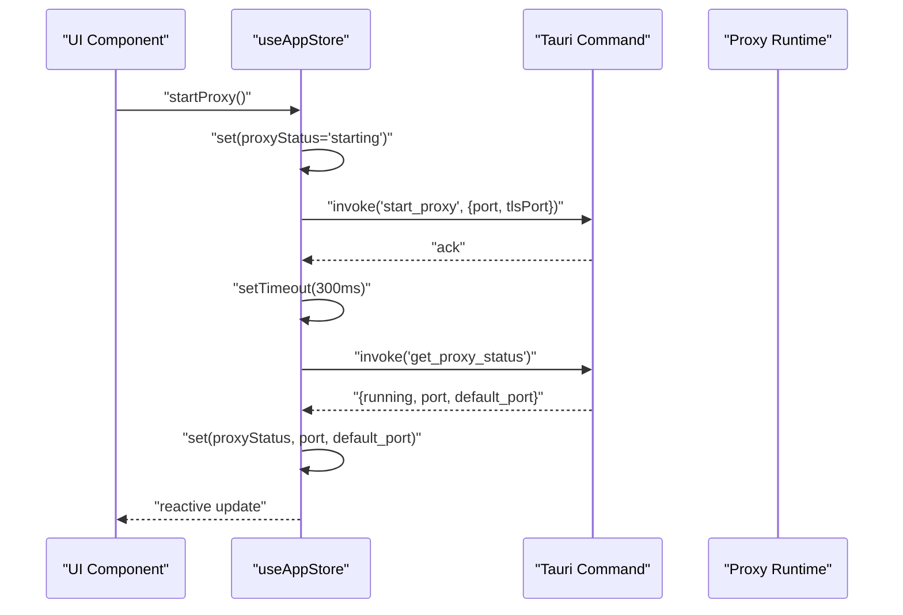
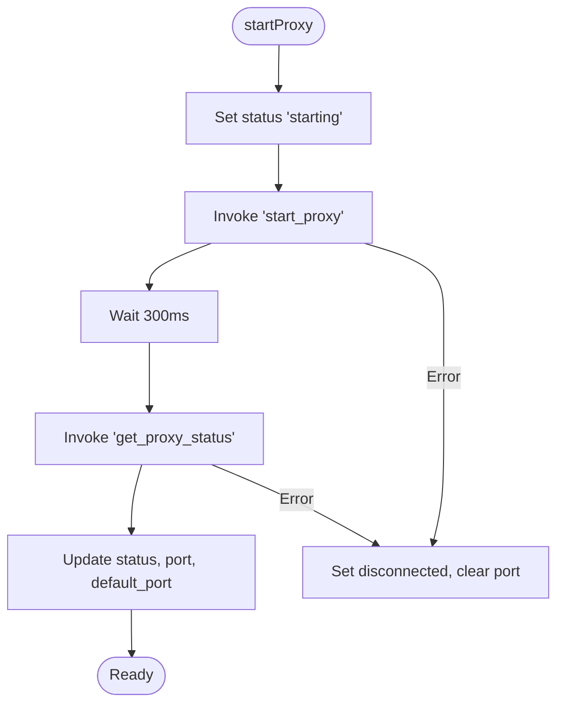
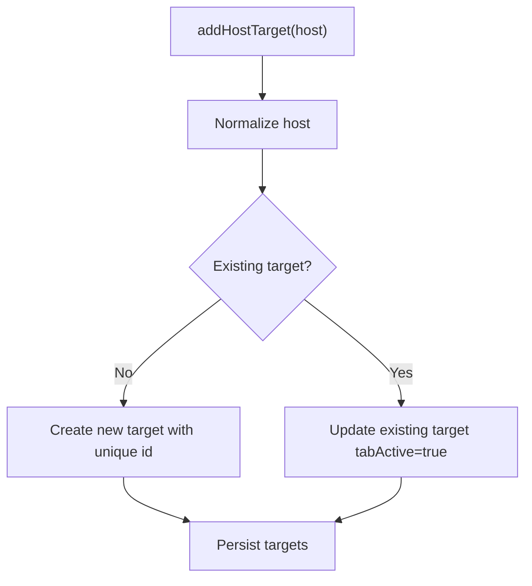
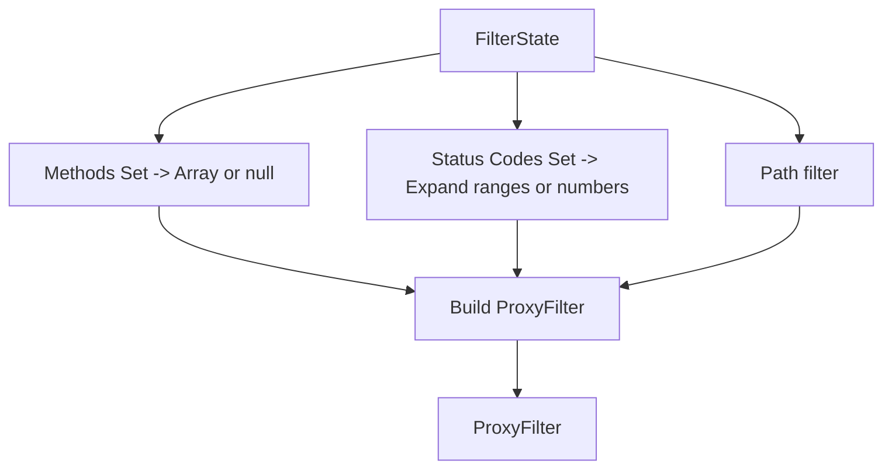
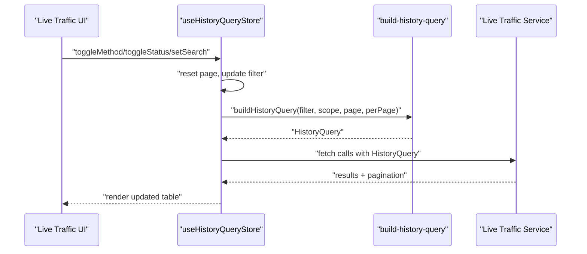
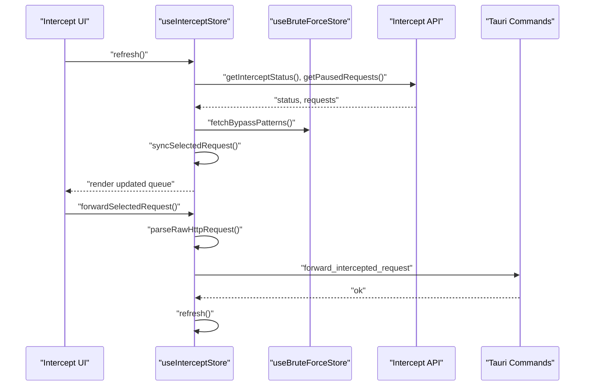
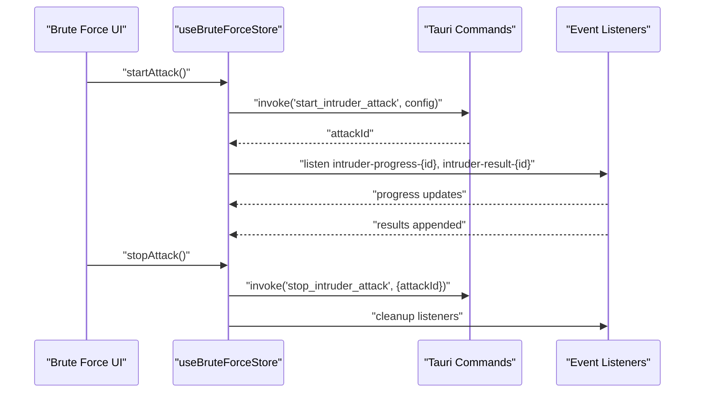
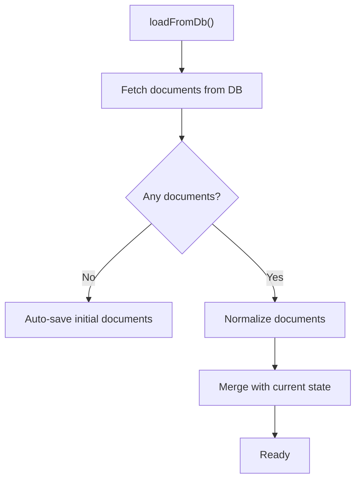
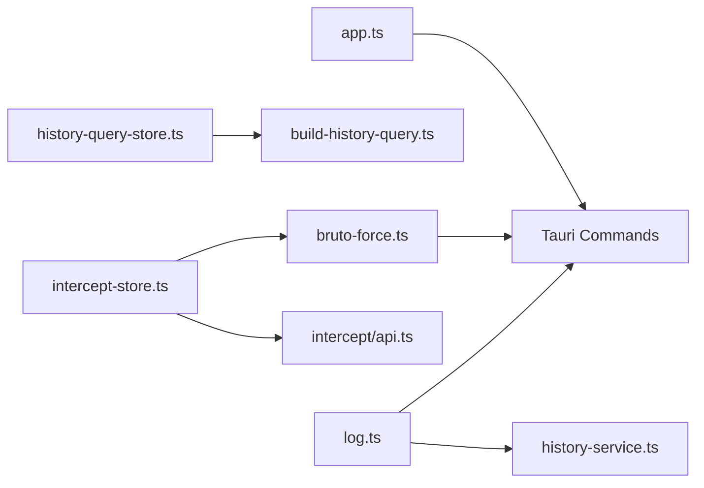

# State Management

<cite>
**Referenced Files in This Document**
- [app.ts](file://src/stores/app.ts)
- [target.ts](file://src/stores/target.ts)
- [filter.ts](file://src/stores/filter.ts)
- [log.ts](file://src/stores/log.ts)
- [bruto-force.ts](file://src/stores/bruto-force.ts)
- [documents.ts](file://src/stores/documents.ts)
- [packet-capture.ts](file://src/stores/packet-capture.ts)
- [repeater.ts](file://src/stores/repeater.ts)
- [browser-automation.ts](file://src/stores/browser-automation.ts)
- [tabs-layout.ts](file://src/stores/tabs-layout.ts)
- [history-query-store.ts](file://src/pages/live-traffic/state/history-query-store.ts)
- [build-history-query.ts](file://src/pages/live-traffic/state/build-history-query.ts)
- [intercept-store.ts](file://src/pages/intercept/state/intercept-store.ts)
- [history-service.ts](file://src/pages/live-traffic/services/history-service.ts)
- [api.ts](file://src/pages/intercept/api.ts)
- [footer.tsx](file://src/components/footer.tsx)
- [proxy-button.tsx](file://src/components/layout/proxy-button.tsx)
- [open-browser.tsx](file://src/components/layout/open-browser.tsx)
- [attack-tab.tsx](file://src/pages/brute-force/components/brute-force-config/config/attack-tab.tsx)
- [payloads-tab.tsx](file://src/pages/brute-force/components/brute-force-config/config/payloads-tab.tsx)
</cite>

## Table of Contents
1. [Introduction](#introduction)
2. [Project Structure](#project-structure)
3. [Core Components](#core-components)
4. [Architecture Overview](#architecture-overview)
5. [Detailed Component Analysis](#detailed-component-analysis)
6. [Dependency Analysis](#dependency-analysis)
7. [Performance Considerations](#performance-considerations)
8. [Troubleshooting Guide](#troubleshooting-guide)
9. [Conclusion](#conclusion)
10. [Appendices](#appendices)

## Introduction
This document explains AppRecon’s state management architecture built on Zustand. It covers application-wide state (proxy runtime, targets), filter configuration, and page-specific stores for live traffic, brute force, documents, packet capture, repeater, browser automation, and intercept. It also details state synchronization, store composition patterns, reactive data flow, persistence strategies, hydration, initialization, cleanup, integration with Tauri commands, asynchronous updates, and error handling. Practical usage patterns and best practices are included for organizing stores, optimizing performance, and debugging state-related issues.

## Project Structure

```mermaid
graph TB
subgraph "Stores"
APP["app.ts<br/>Proxy runtime state"]
TARGET["target.ts<br/>Target management"]
FILTER["filter.ts<br/>Filter configuration"]
LOG["log.ts<br/>Live traffic pagination & selection"]
BF["bruto-force.ts<br/>Brute force tabs & progress"]
DOCS["documents.ts<br/>Documents CRUD & persistence"]
PCAP["packet-capture.ts<br/>Saved capture config"]
REP["repeater.ts<br/>Repeater tabs & navigation"]
BA["browser-automation.ts<br/>Browser automation state"]
TABS["tabs-layout.ts<br/>Active tab ids per scope"]
end
subgraph "Page-Specific"
LTHQ["live-traffic/history-query-store.ts<br/>History query state"]
LTBH["live-traffic/build-history-query.ts<br/>Build ProxyFilter"]
INT["intercept/intercept-store.ts<br/>Intercept queue & raw request"]
end
APP --> |"Tauri invoke"| BACKEND["Tauri Commands"]
TARGET --> |"Persistence"| STORAGE["Local Storage"]
DOCS --> |"Persistence"| STORAGE
PCAP --> |"Persistence"| STORAGE
REP --> |"Persistence"| STORAGE
TABS --> |"Persistence"| STORAGE
BF --> |"Events & invoke"| BACKEND
LOG --> |"invoke"| BACKEND
INT --> |"invoke"| BACKEND
LTHQ --> |"build filter"| LTBH
```

Zustand stores are organized under src/stores and page-specific stores under src/pages/<page>/state. Stores encapsulate state, actions, and persistence via the persist middleware. Many stores integrate with Tauri commands to synchronize UI state with backend services.

**Diagram sources**
- [app.ts:1-109](file://src/stores/app.ts#L1-L109)
- [target.ts:1-124](file://src/stores/target.ts#L1-L124)
- [filter.ts:1-99](file://src/stores/filter.ts#L1-L99)
- [log.ts:1-51](file://src/stores/log.ts#L1-L51)
- [bruto-force.ts:1-470](file://src/stores/bruto-force.ts#L1-L470)
- [documents.ts:1-347](file://src/stores/documents.ts#L1-L347)
- [packet-capture.ts:1-33](file://src/stores/packet-capture.ts#L1-L33)
- [repeater.ts:1-166](file://src/stores/repeater.ts#L1-L166)
- [browser-automation.ts:1-362](file://src/stores/browser-automation.ts#L1-L362)
- [tabs-layout.ts:1-29](file://src/stores/tabs-layout.ts#L1-L29)
- [history-query-store.ts:1-140](file://src/pages/live-traffic/state/history-query-store.ts#L1-L140)
- [build-history-query.ts:1-98](file://src/pages/live-traffic/state/build-history-query.ts#L1-L98)
- [intercept-store.ts:1-202](file://src/pages/intercept/state/intercept-store.ts#L1-L202)

**Section sources**
- [app.ts:1-109](file://src/stores/app.ts#L1-L109)
- [target.ts:1-124](file://src/stores/target.ts#L1-L124)
- [filter.ts:1-99](file://src/stores/filter.ts#L1-L99)
- [log.ts:1-51](file://src/stores/log.ts#L1-L51)
- [bruto-force.ts:1-470](file://src/stores/bruto-force.ts#L1-L470)
- [documents.ts:1-347](file://src/stores/documents.ts#L1-L347)
- [packet-capture.ts:1-33](file://src/stores/packet-capture.ts#L1-L33)
- [repeater.ts:1-166](file://src/stores/repeater.ts#L1-L166)
- [browser-automation.ts:1-362](file://src/stores/browser-automation.ts#L1-L362)
- [tabs-layout.ts:1-29](file://src/stores/tabs-layout.ts#L1-L29)
- [history-query-store.ts:1-140](file://src/pages/live-traffic/state/history-query-store.ts#L1-L140)
- [build-history-query.ts:1-98](file://src/pages/live-traffic/state/build-history-query.ts#L1-L98)
- [intercept-store.ts:1-202](file://src/pages/intercept/state/intercept-store.ts#L1-L202)

## Core Components
- Application state (proxy runtime)
  - Manages proxy status, ports, and safety alerts. Integrates with Tauri commands to start/stop proxy and poll runtime status.
  - Persistence: partialize includes status, ports, and dismissal flag.
  - Asynchronous updates: start/stop/status checks use invoke and setTimeout for status polling.
  - Error handling: catches errors during start/stop and falls back to fetching current status.

- Target management
  - Adds, updates, removes, and queries targets; tracks active tabs per target.
  - Persistence: merges persisted targets with defaults for tabActive.
  - Utility helpers: creates unique IDs and normalizes host scope.

- Filter configuration
  - Maintains search, HTTP methods, status code groups, and path filter.
  - Converts filter state to a ProxyFilter suitable for backend queries.
  - Uses Sets for efficient toggling and clearFilters resets to defaults.

- Live traffic log state
  - Tracks selected call, pagination, sort order, and loading states.
  - Provides actions to clear calls and delete individual calls via Tauri.

- Page-specific stores
  - Live traffic query store: manages filter state, sort order, pagination, selected call, and refresh key.
  - Intercept store: manages paused requests, raw request editing, and forwarding/dropping/bypassing.
  - Brute force store: manages attack tabs, configs, progress events, results, and bypass patterns.
  - Documents store: manages multiple documents, active document, CRUD operations, and persistence.
  - Packet capture store: persists last used network interface and capture config.
  - Repeater store: manages request and WebSocket tabs, numbering, and closing policies.
  - Browser automation store: manages browser lifecycle, snapshots, action logs, and AI-driven crawling.
  - Tabs layout store: persists active tab IDs per scope.

**Section sources**
- [app.ts:14-109](file://src/stores/app.ts#L14-L109)
- [target.ts:5-124](file://src/stores/target.ts#L5-L124)
- [filter.ts:4-99](file://src/stores/filter.ts#L4-L99)
- [log.ts:6-51](file://src/stores/log.ts#L6-L51)
- [history-query-store.ts:10-140](file://src/pages/live-traffic/state/history-query-store.ts#L10-L140)
- [intercept-store.ts:16-202](file://src/pages/intercept/state/intercept-store.ts#L16-L202)
- [bruto-force.ts:43-470](file://src/stores/bruto-force.ts#L43-L470)
- [documents.ts:17-347](file://src/stores/documents.ts#L17-L347)
- [packet-capture.ts:6-33](file://src/stores/packet-capture.ts#L6-L33)
- [repeater.ts:13-166](file://src/stores/repeater.ts#L13-L166)
- [browser-automation.ts:47-362](file://src/stores/browser-automation.ts#L47-L362)
- [tabs-layout.ts:4-29](file://src/stores/tabs-layout.ts#L4-L29)

## Architecture Overview
Zustand stores are the single source of truth for UI state. They integrate with Tauri commands for backend operations and events for real-time updates. Persistence is handled via the persist middleware with selective partialization and merge strategies. Page-specific stores coordinate with global stores (e.g., intercept store fetching bypass patterns from brute force store).

**Diagram sources**
- [app.ts:38-96](file://src/stores/app.ts#L38-L96)

**Section sources**
- [app.ts:26-109](file://src/stores/app.ts#L26-L109)

## Detailed Component Analysis

### Application State (Proxy Runtime)
- Responsibilities
  - Track proxy status and ports.
  - Expose actions to start/stop proxy and check status.
  - Persist selected fields to localStorage.

- Asynchronous flow
  - startProxy sets status to starting, invokes backend, waits, then polls runtime status.
  - stopProxy follows similar pattern, ensuring UI reflects runtime state after operation.

- Error handling
  - Catches errors during start/stop and falls back to fetching current status to reconcile UI.

- Persistence
  - partialize includes status, ports, and dismissal flag.

**Diagram sources**
- [app.ts:38-96](file://src/stores/app.ts#L38-L96)

**Section sources**
- [app.ts:26-109](file://src/stores/app.ts#L26-L109)

### Target Management
- Responsibilities
  - Manage target list, add/update/remove, and active tab tracking.
  - Normalize host scope and deduplicate by normalized host.
  - Merge persisted targets with defaults for tabActive.

- Persistence
  - partialize targets; merge ensures tabActive defaults.

**Diagram sources**
- [target.ts:53-82](file://src/stores/target.ts#L53-L82)

**Section sources**
- [target.ts:46-124](file://src/stores/target.ts#L46-L124)

### Filter Configuration
- Responsibilities
  - Maintain filter state (search, methods, status codes, path).
  - Convert to ProxyFilter for backend queries.
  - Toggle methods/status groups and clear filters.

- Conversion logic
  - Expands 2xx/3xx/4xx/5xx to numeric codes; ignores invalid entries.

**Diagram sources**
- [filter.ts:11-39](file://src/stores/filter.ts#L11-L39)

**Section sources**
- [filter.ts:41-99](file://src/stores/filter.ts#L41-L99)

### Live Traffic Query Store
- Responsibilities
  - Manage filter state, active scope, sort order, pagination, selected call, and refresh key.
  - Reset page and selected call on filter changes.
  - Trigger refresh via incrementing refreshKey.

- Composition with filter conversion
  - Uses build-history-query to convert UI filter to backend filter.

**Diagram sources**
- [history-query-store.ts:40-139](file://src/pages/live-traffic/state/history-query-store.ts#L40-L139)
- [build-history-query.ts:12-67](file://src/pages/live-traffic/state/build-history-query.ts#L12-L67)

**Section sources**
- [history-query-store.ts:10-140](file://src/pages/live-traffic/state/history-query-store.ts#L10-L140)
- [build-history-query.ts:1-98](file://src/pages/live-traffic/state/build-history-query.ts#L1-L98)

### Intercept Store
- Responsibilities
  - Manage intercepted requests, selected request, raw request editing, and busy/loading states.
  - Refresh status and requests, toggle intercept mode, forward/drop/bypass selected.
  - Synchronize selected request when lists change.

- Integration with brute force
  - On refresh, fetches bypass patterns from brute force store and updates UI.

**Diagram sources**
- [intercept-store.ts:91-155](file://src/pages/intercept/state/intercept-store.ts#L91-L155)
- [api.ts:20-28](file://src/pages/intercept/api.ts#L20-L28)
- [bruto-force.ts:442-449](file://src/stores/bruto-force.ts#L442-L449)

**Section sources**
- [intercept-store.ts:69-202](file://src/pages/intercept/state/intercept-store.ts#L69-L202)

### Brute Force Store
- Responsibilities
  - Manage multiple attack tabs, configs, results, progress, and selected result.
  - Listen to progress/result events per tab and clean up listeners on close/stop.
  - Integrate with Tauri commands to start/stop attacks and manage bypass patterns.

- Patterns
  - updateActiveTab helper updates the currently active tab consistently.
  - Cleanup functions remove event listeners to prevent leaks.

**Diagram sources**
- [bruto-force.ts:338-436](file://src/stores/bruto-force.ts#L338-L436)

**Section sources**
- [bruto-force.ts:142-470](file://src/stores/bruto-force.ts#L142-L470)

### Documents Store
- Responsibilities
  - Manage multiple documents, active document, and CRUD operations.
  - Persist documents and active document ID; merge with normalization for backward compatibility.
  - Save to database asynchronously and handle failures gracefully.

- Hydration
  - loadFromDb hydrates from DB; if none found, auto-save initial documents.

**Diagram sources**
- [documents.ts:93-110](file://src/stores/documents.ts#L93-L110)

**Section sources**
- [documents.ts:71-347](file://src/stores/documents.ts#L71-L347)

### Packet Capture Store
- Responsibilities
  - Persist last used network interface and capture configuration.
  - Clear saved config when needed.

**Section sources**
- [packet-capture.ts:13-33](file://src/stores/packet-capture.ts#L13-L33)

### Repeater Store
- Responsibilities
  - Manage request and WebSocket tabs, numbering, renaming, and closing policies.
  - Persist tabs, active tab, and numbering; merge restores numbering from persisted state.

**Section sources**
- [repeater.ts:43-166](file://src/stores/repeater.ts#L43-L166)

### Browser Automation Store
- Responsibilities
  - Manage browser lifecycle, snapshots, action logs, discovered APIs, and AI-driven crawling.
  - Integrate with Tauri commands for opening/closing/navigating, clicking/filling/typing, and taking snapshots.

**Section sources**
- [browser-automation.ts:101-362](file://src/stores/browser-automation.ts#L101-L362)

### Tabs Layout Store
- Responsibilities
  - Persist active tab IDs per scope (e.g., different pages or sections).

**Section sources**
- [tabs-layout.ts:9-29](file://src/stores/tabs-layout.ts#L9-L29)

## Dependency Analysis
- Store-to-store dependencies
  - Intercept store depends on brute force store to fetch bypass patterns.
  - Live traffic query store depends on build-history-query to convert UI filters to backend filters.
  - Logs store integrates with Tauri commands to clear/delete calls.

- External integrations
  - All stores using invoke rely on Tauri commands for backend operations.
  - Event listeners are used for progress/results in brute force.

**Diagram sources**
- [intercept-store.ts:100](file://src/pages/intercept/state/intercept-store.ts#L100)
- [history-query-store.ts:1](file://src/pages/live-traffic/state/history-query-store.ts#L1)
- [build-history-query.ts:1](file://src/pages/live-traffic/state/build-history-query.ts#L1)
- [history-service.ts:46-54](file://src/pages/live-traffic/services/history-service.ts#L46-L54)
- [api.ts:20-28](file://src/pages/intercept/api.ts#L20-L28)
- [app.ts:38-96](file://src/stores/app.ts#L38-L96)
- [bruto-force.ts:354-400](file://src/stores/bruto-force.ts#L354-L400)
- [log.ts:42-49](file://src/stores/log.ts#L42-L49)

**Section sources**
- [intercept-store.ts:91-155](file://src/pages/intercept/state/intercept-store.ts#L91-L155)
- [history-query-store.ts:12-67](file://src/pages/live-traffic/state/history-query-store.ts#L12-L67)
- [build-history-query.ts:12-67](file://src/pages/live-traffic/state/build-history-query.ts#L12-L67)
- [history-service.ts:46-54](file://src/pages/live-traffic/services/history-service.ts#L46-L54)
- [api.ts:20-28](file://src/pages/intercept/api.ts#L20-L28)
- [app.ts:38-96](file://src/stores/app.ts#L38-L96)
- [bruto-force.ts:354-400](file://src/stores/bruto-force.ts#L354-L400)
- [log.ts:42-49](file://src/stores/log.ts#L42-L49)

## Performance Considerations
- Prefer functional updates with set((state) => ...) to minimize re-renders and avoid stale closures.
- Use partialize to persist only necessary state; avoid persisting large transient data.
- Merge strategies should normalize persisted data to maintain backward compatibility.
- Debounce or throttle frequent UI updates (e.g., search filters) to reduce render churn.
- Clean up event listeners promptly (as done in brute force store) to prevent memory leaks.
- Batch related updates (e.g., updating selected request and raw request together) to avoid intermediate renders.

## Troubleshooting Guide
- Proxy status not updating
  - Verify start/stop invocations and status polling intervals.
  - Check error branches that fall back to fetching current status.

- Intercepts not refreshing
  - Ensure refresh() is invoked and that getPausedRequests() and getInterceptStatus() succeed.
  - Confirm bypass pattern fetch is triggered after refresh.

- Brute force progress not visible
  - Confirm attackId is set and event listeners are registered.
  - Ensure cleanup occurs on stop/close to avoid orphaned listeners.

- Documents not loading
  - Confirm loadFromDb hydrates and auto-saves if empty.
  - Check merge normalization for backward compatibility.

- Live traffic filters not applied
  - Validate build-history-query expands status code ranges and trims inputs.
  - Ensure refreshKey increments to trigger reload.

**Section sources**
- [app.ts:58-96](file://src/stores/app.ts#L58-L96)
- [intercept-store.ts:91-155](file://src/pages/intercept/state/intercept-store.ts#L91-L155)
- [bruto-force.ts:354-436](file://src/stores/bruto-force.ts#L354-L436)
- [documents.ts:93-110](file://src/stores/documents.ts#L93-L110)
- [build-history-query.ts:18-67](file://src/pages/live-traffic/state/build-history-query.ts#L18-L67)

## Conclusion
AppRecon’s state management leverages Zustand for clear, composable stores with targeted persistence and robust integration with Tauri commands. Global stores (proxy, targets, filters, logs) coordinate with page-specific stores (live traffic, intercept, brute force, documents, packet capture, repeater, browser automation) to deliver a reactive, scalable UI. Proper use of event listeners, merge strategies, and partialize ensures reliable hydration and performance.

## Appendices

### Practical Examples and Best Practices
- Store usage in components
  - Proxy runtime: subscribe to status, port, and defaultPort; call start/stop actions.
  - Brute force: subscribe to active tab config and results; update payload configurations.
  - Live traffic: subscribe to query filters and refresh key; build ProxyFilter via helper.

- State persistence strategies
  - Use persist with partialize to limit serialized state.
  - Implement merge to normalize persisted data and maintain defaults.

- Hydration and initialization
  - Initialize stores with sensible defaults; hydrate from DB/localStorage on app start.
  - Ensure fallbacks when persisted data is missing or malformed.

- Cleanup procedures
  - Remove event listeners on tab close or store unmount.
  - Clear timers and subscriptions to prevent leaks.

- Integration with Tauri
  - Wrap invoke calls in try/catch; update state after async operations.
  - Use setTimeout or polling judiciously; prefer events where available.

- Debugging state-related issues
  - Log state transitions and async flows.
  - Inspect persisted state in localStorage.
  - Verify event listener registration and cleanup.

**Section sources**
- [footer.tsx:26-29](file://src/components/footer.tsx#L26-L29)
- [proxy-button.tsx:9-13](file://src/components/layout/proxy-button.tsx#L9-L13)
- [open-browser.tsx:12-14](file://src/components/layout/open-browser.tsx#L12-L14)
- [attack-tab.tsx:6](file://src/pages/brute-force/components/brute-force-config/config/attack-tab.tsx#L6)
- [payloads-tab.tsx:140](file://src/pages/brute-force/components/brute-force-config/config/payloads-tab.tsx#L140)