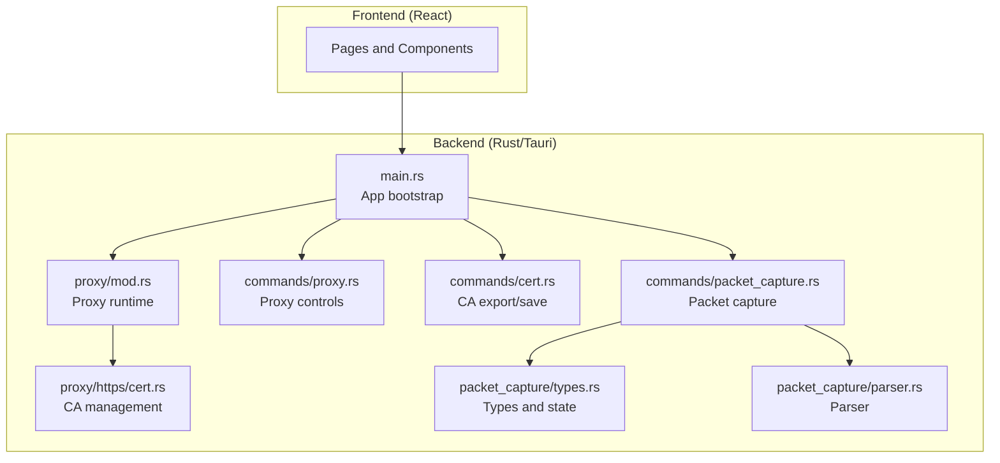
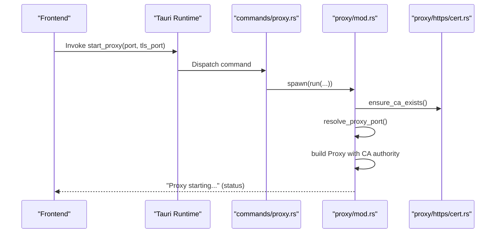
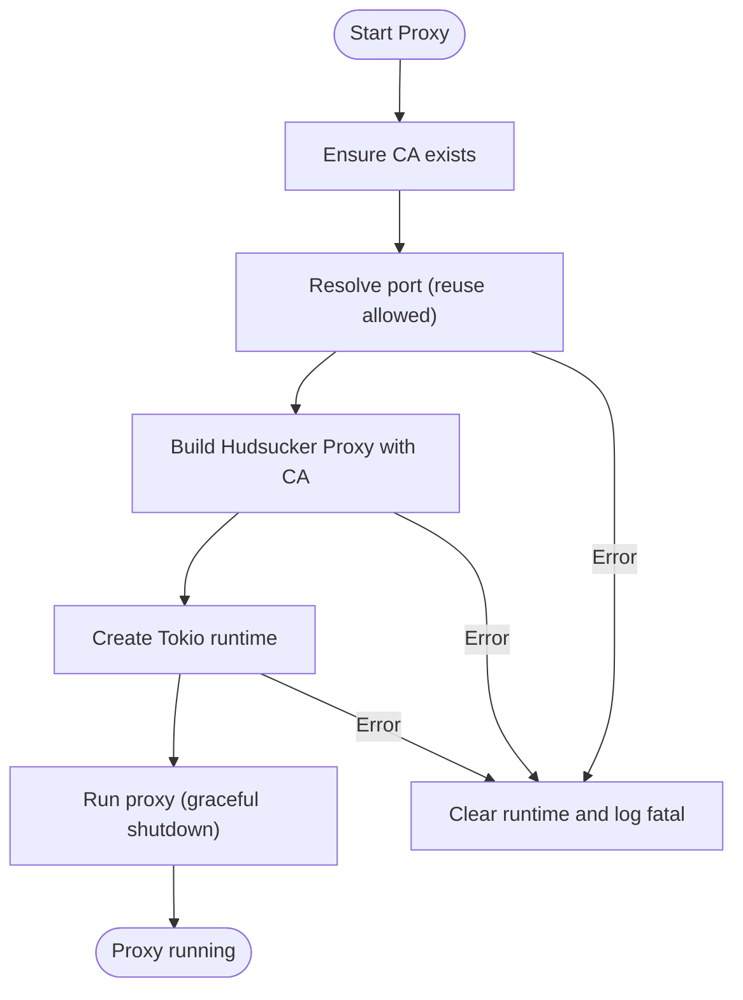
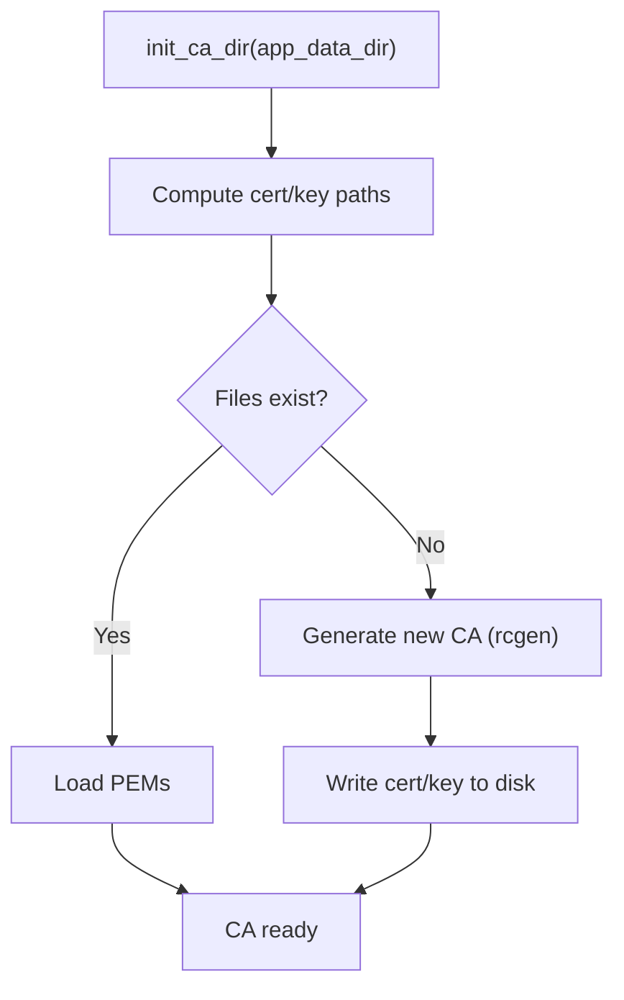
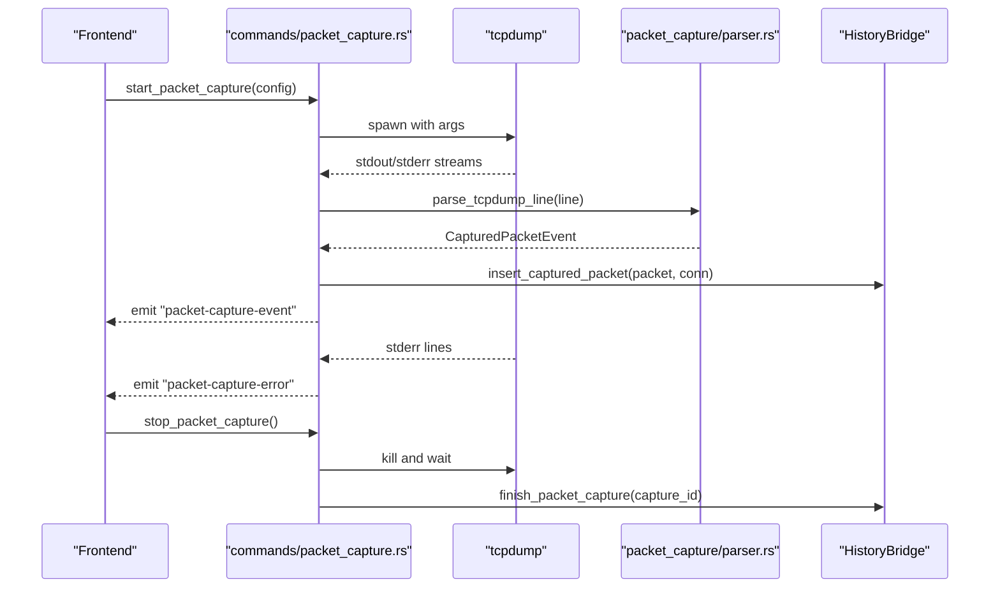
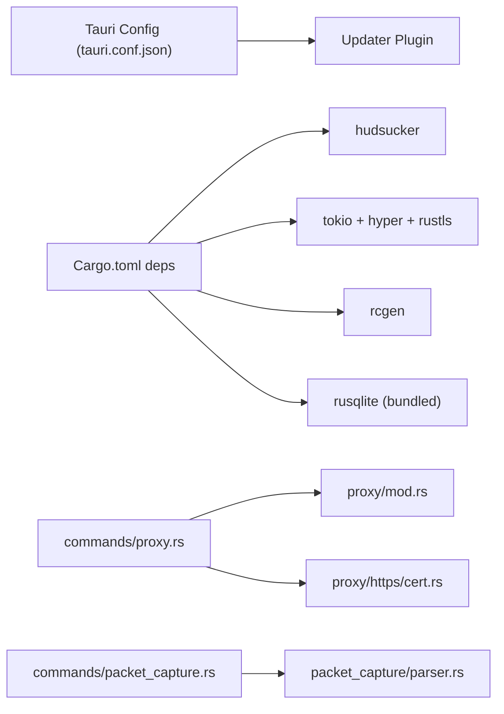

# Troubleshooting and FAQ

<cite>
**Referenced Files in This Document**
- [README.md](file://README.md)
- [install.sh](file://install.sh)
- [scripts/install.sh](file://scripts/install.sh)
- [scripts/fix-packet-capture-permissions.sh](file://scripts/fix-packet-capture-permissions.sh)
- [src-tauri/tauri.conf.json](file://src-tauri/tauri.conf.json)
- [src-tauri/Cargo.toml](file://src-tauri/Cargo.toml)
- [src-tauri/src/main.rs](file://src-tauri/src/main.rs)
- [src-tauri/src/proxy/mod.rs](file://src-tauri/src/proxy/mod.rs)
- [src-tauri/src/proxy/https/cert.rs](file://src-tauri/src/proxy/https/cert.rs)
- [src-tauri/src/commands/proxy.rs](file://src-tauri/src/commands/proxy.rs)
- [src-tauri/src/commands/cert.rs](file://src-tauri/src/commands/cert.rs)
- [src-tauri/src/commands/packet_capture.rs](file://src-tauri/src/commands/packet_capture.rs)
- [src-tauri/src/packet_capture/types.rs](file://src-tauri/src/packet_capture/types.rs)
- [src-tauri/src/packet_capture/parser.rs](file://src-tauri/src/packet_capture/parser.rs)
</cite>

## Table of Contents
1. [Introduction](#introduction)
2. [Project Structure](#project-structure)
3. [Core Components](#core-components)
4. [Architecture Overview](#architecture-overview)
5. [Detailed Component Analysis](#detailed-component-analysis)
6. [Dependency Analysis](#dependency-analysis)
7. [Performance Considerations](#performance-considerations)
8. [Troubleshooting Guide](#troubleshooting-guide)
9. [Conclusion](#conclusion)
10. [Appendices](#appendices)

## Introduction
This document provides comprehensive troubleshooting and FAQ guidance for AppRecon. It covers installation issues, proxy configuration, certificate trust, traffic interception, packet capture, performance tuning, debugging techniques, and operational best practices. The goal is to help users diagnose and resolve common problems quickly and confidently.

## Project Structure
AppRecon is a Tauri desktop application with a React frontend and a Rust backend. The backend implements a man-in-the-middle proxy, manages CA certificates, and supports packet capture via tcpdump. The frontend exposes pages for traffic inspection, repeater, brute force, documents, and settings.

**Diagram sources**
- [src-tauri/src/main.rs:14-147](file://src-tauri/src/main.rs#L14-L147)
- [src-tauri/src/proxy/mod.rs:93-187](file://src-tauri/src/proxy/mod.rs#L93-L187)
- [src-tauri/src/proxy/https/cert.rs:106-143](file://src-tauri/src/proxy/https/cert.rs#L106-L143)
- [src-tauri/src/commands/proxy.rs:15-73](file://src-tauri/src/commands/proxy.rs#L15-L73)
- [src-tauri/src/commands/cert.rs:3-12](file://src-tauri/src/commands/cert.rs#L3-L12)
- [src-tauri/src/commands/packet_capture.rs:149-284](file://src-tauri/src/commands/packet_capture.rs#L149-L284)
- [src-tauri/src/packet_capture/types.rs:3-114](file://src-tauri/src/packet_capture/types.rs#L3-L114)
- [src-tauri/src/packet_capture/parser.rs:4-164](file://src-tauri/src/packet_capture/parser.rs#L4-L164)

**Section sources**
- [README.md:40-79](file://README.md#L40-L79)
- [src-tauri/src/main.rs:23-146](file://src-tauri/src/main.rs#L23-L146)

## Core Components
- Proxy service: Starts/stops the MITM proxy, validates ports, and integrates with the CA authority.
- Certificate Authority: Generates and manages the root CA, exports PEM for trust.
- Packet capture: Spawns tcpdump, parses output, persists packets, and emits events.
- Updater: Optional desktop updater configured via Tauri configuration.

Key runtime behaviors:
- Proxy initialization creates the CA directory and initializes the CA store.
- Packet capture requires tcpdump and appropriate permissions (especially on macOS).
- Updater checks for updates during startup on supported platforms.

**Section sources**
- [src-tauri/src/main.rs:30-51](file://src-tauri/src/main.rs#L30-L51)
- [src-tauri/src/proxy/mod.rs:93-187](file://src-tauri/src/proxy/mod.rs#L93-L187)
- [src-tauri/src/proxy/https/cert.rs:106-143](file://src-tauri/src/proxy/https/cert.rs#L106-L143)
- [src-tauri/src/commands/packet_capture.rs:149-284](file://src-tauri/src/commands/packet_capture.rs#L149-L284)
- [src-tauri/tauri.conf.json:40-46](file://src-tauri/tauri.conf.json#L40-L46)

## Architecture Overview
The application starts in main.rs, initializes the database and CA, registers commands, and runs the Tauri loop. Proxy commands start a background thread that builds and runs the Hudsucker proxy with rustls. Packet capture commands spawn tcpdump, parse lines, and emit structured events.

**Diagram sources**
- [src-tauri/src/commands/proxy.rs:15-52](file://src-tauri/src/commands/proxy.rs#L15-L52)
- [src-tauri/src/proxy/mod.rs:93-187](file://src-tauri/src/proxy/mod.rs#L93-L187)
- [src-tauri/src/proxy/https/cert.rs:131-143](file://src-tauri/src/proxy/https/cert.rs#L131-L143)

## Detailed Component Analysis

### Proxy Startup and Port Management
- Validates port availability and reusability.
- Creates a CA authority and starts the proxy with rustls.
- Emits fatal errors on port conflicts, CA creation failure, or runtime creation issues.

**Diagram sources**
- [src-tauri/src/proxy/mod.rs:51-187](file://src-tauri/src/proxy/mod.rs#L51-L187)

**Section sources**
- [src-tauri/src/proxy/mod.rs:51-187](file://src-tauri/src/proxy/mod.rs#L51-L187)

### Certificate Authority Management
- Initializes CA directory under the app data directory.
- Loads existing CA or generates a new one with rcgen.
- Exports PEM for distribution and OS trust integration.

**Diagram sources**
- [src-tauri/src/proxy/https/cert.rs:11-143](file://src-tauri/src/proxy/https/cert.rs#L11-L143)

**Section sources**
- [src-tauri/src/proxy/https/cert.rs:11-143](file://src-tauri/src/proxy/https/cert.rs#L11-L143)

### Packet Capture Workflow
- Lists interfaces and addresses, detects Wi-Fi on macOS.
- Starts tcpdump with flags (-n -l -tt -vv -s0), optionally monitor/promiscuous.
- Parses stdout lines into structured events, persists to history, and emits events.
- Reads stderr for diagnostics and marks capture as finished.

**Diagram sources**
- [src-tauri/src/commands/packet_capture.rs:149-284](file://src-tauri/src/commands/packet_capture.rs#L149-L284)
- [src-tauri/src/packet_capture/parser.rs:4-164](file://src-tauri/src/packet_capture/parser.rs#L4-L164)

**Section sources**
- [src-tauri/src/commands/packet_capture.rs:149-284](file://src-tauri/src/commands/packet_capture.rs#L149-L284)
- [src-tauri/src/packet_capture/parser.rs:4-164](file://src-tauri/src/packet_capture/parser.rs#L4-L164)

## Dependency Analysis
- Tauri plugins enable updater, dialogs, filesystem, process, and clipboard operations.
- Updater configuration points to a releases endpoint.
- Proxy uses Hudsucker with rustls provider and rcgen CA.
- Packet capture depends on tcpdump availability and OS-specific permissions.

**Diagram sources**
- [src-tauri/tauri.conf.json:39-46](file://src-tauri/tauri.conf.json#L39-L46)
- [src-tauri/Cargo.toml:11-54](file://src-tauri/Cargo.toml#L11-L54)
- [src-tauri/src/commands/proxy.rs:15-52](file://src-tauri/src/commands/proxy.rs#L15-L52)
- [src-tauri/src/proxy/mod.rs:93-187](file://src-tauri/src/proxy/mod.rs#L93-L187)
- [src-tauri/src/commands/packet_capture.rs:149-284](file://src-tauri/src/commands/packet_capture.rs#L149-L284)

**Section sources**
- [src-tauri/tauri.conf.json:39-46](file://src-tauri/tauri.conf.json#L39-L46)
- [src-tauri/Cargo.toml:11-54](file://src-tauri/Cargo.toml#L11-L54)

## Performance Considerations
- Memory usage
  - Limit packet capture verbosity; avoid excessive filtering or very large buffers.
  - Prefer paginated queries for packet history to reduce UI memory footprint.
  - Close unused tabs and disable real-time filters when reviewing large histories.
- CPU optimization
  - Disable monitor mode and promiscuous mode unless required for wireless capture.
  - Reduce packet parsing overhead by limiting filters and disabling unnecessary viewers.
- Network efficiency
  - Use targeted interfaces (Wi-Fi vs. loopback) to minimize irrelevant traffic.
  - Stop capture when not in use to free resources.
- Logging and diagnostics
  - Monitor logs for repeated errors (e.g., port conflicts, CA generation failures).
  - Use updater logs and application panics to identify startup issues.

[No sources needed since this section provides general guidance]

## Troubleshooting Guide

### Installation Problems
- Dependency issues
  - Ensure tcpdump is installed and accessible if using packet capture. The packet capture command checks for tcpdump presence and returns a clear error if missing.
  - On macOS, install dependencies via Homebrew or equivalent package manager.
- Permission errors
  - Packet capture requires access to /dev/bpf* devices. Use the macOS helper script or run the permission preparation command to set proper permissions.
  - On Unix-like systems, ensure the user has CAP_NET_RAW or equivalent privileges.
- Platform-specific setup
  - macOS: Wi-Fi credential configuration and interface detection are macOS-specific. Use the provided commands to connect to Wi-Fi networks for capture.
  - Linux/Windows: Packet capture permission automation is not implemented; rely on system-level permissions and capabilities.

Step-by-step resolution
- Verify tcpdump availability
  - Run the packet capture list command to confirm tcpdump is found.
- Fix packet capture permissions (macOS)
  - Run the permission helper script or the permission preparation command.
- Confirm Wi-Fi configuration (macOS)
  - Use the network configuration command to set SSID and password if required.

**Section sources**
- [src-tauri/src/commands/packet_capture.rs:159-162](file://src-tauri/src/commands/packet_capture.rs#L159-L162)
- [scripts/fix-packet-capture-permissions.sh:14-16](file://scripts/fix-packet-capture-permissions.sh#L14-L16)
- [src-tauri/src/commands/packet_capture.rs:115-146](file://src-tauri/src/commands/packet_capture.rs#L115-L146)

### Proxy Configuration Problems
- Port conflicts
  - The proxy resolves the requested port and enforces reuse policy. If the port is in use, choose another port or stop the conflicting service.
- MITM failures
  - Ensure the CA certificate is trusted by the OS/browser. Export the CA and install it into the system trust store.
- Startup errors
  - Review logs for fatal messages indicating port resolution, CA creation, or runtime creation failures.

Step-by-step resolution
- Choose a free port and retry starting the proxy.
- Export and install the CA certificate into the OS trust store.
- Check application logs for detailed error messages.

**Section sources**
- [src-tauri/src/proxy/mod.rs:51-56](file://src-tauri/src/proxy/mod.rs#L51-L56)
- [src-tauri/src/proxy/https/cert.rs:106-118](file://src-tauri/src/proxy/https/cert.rs#L106-L118)
- [src-tauri/src/commands/proxy.rs:15-52](file://src-tauri/src/commands/proxy.rs#L15-L52)

### Certificate Trust Issues
- Symptom: HTTPS interception fails in browsers or apps.
- Cause: The root CA is not trusted by the OS or browser.
- Resolution:
  - Export the CA certificate via the certificate command.
  - Install the exported certificate into the OS trust store.
  - Restart browsers and applications to refresh trust caches.

**Section sources**
- [src-tauri/src/commands/cert.rs:3-12](file://src-tauri/src/commands/cert.rs#L3-L12)
- [src-tauri/src/proxy/https/cert.rs:106-118](file://src-tauri/src/proxy/https/cert.rs#L106-L118)

### Traffic Interception Failures
- Symptom: Requests pass through without being intercepted.
- Causes:
  - Proxy not started or not bound to the correct port.
  - Client not configured to use the proxy.
  - Interception bypass patterns blocking the target.
- Resolution:
  - Confirm proxy status and port.
  - Configure the client’s HTTP/SOCKS proxy to match the proxy port.
  - Adjust interception bypass patterns to allow the target.

**Section sources**
- [src-tauri/src/commands/proxy.rs:61-73](file://src-tauri/src/commands/proxy.rs#L61-L73)

### Packet Capture Problems
- Symptom: No packets captured or immediate exit.
- Causes:
  - tcpdump not found or not executable.
  - Insufficient permissions to access /dev/bpf*.
  - Incorrect interface selection or Wi-Fi credentials.
- Resolution:
  - Install tcpdump and ensure it is on PATH.
  - Grant read/write access to /dev/bpf* devices.
  - Select the correct interface and, on macOS, supply SSID/password if required.

**Section sources**
- [src-tauri/src/commands/packet_capture.rs:159-162](file://src-tauri/src/commands/packet_capture.rs#L159-L162)
- [scripts/fix-packet-capture-permissions.sh:14-16](file://scripts/fix-packet-capture-permissions.sh#L14-L16)
- [src-tauri/src/commands/packet_capture.rs:115-146](file://src-tauri/src/commands/packet_capture.rs#L115-L146)

### Security Testing Failures
- Symptom: Certain TLS handshakes fail or are blocked.
- Causes:
  - Mismatched cipher suites or TLS versions.
  - Client certificates or mutual TLS requirements.
- Resolution:
  - Verify TLS settings and compatibility.
  - Temporarily disable mutual TLS requirements for testing if applicable.

[No sources needed since this section provides general guidance]

### Debugging Approaches
- Traffic analysis issues
  - Enable verbose logging in the proxy and review application logs.
  - Use the repeater to replay problematic requests and inspect responses.
- Packet capture problems
  - Inspect stderr emissions for tcpdump errors.
  - Reduce verbosity flags temporarily to isolate issues.
- Security testing failures
  - Compare request/response payloads and headers in the history viewer.
  - Export HAR sessions for external analysis.

**Section sources**
- [src-tauri/src/commands/packet_capture.rs:254-277](file://src-tauri/src/commands/packet_capture.rs#L254-L277)
- [src-tauri/src/commands/proxy.rs:15-52](file://src-tauri/src/commands/proxy.rs#L15-L52)

### Error Message Interpretation and Log Analysis
- Fatal proxy errors
  - Look for messages indicating port resolution failure, CA creation failure, or runtime creation failure.
- Packet capture errors
  - stderr lines are emitted as structured errors; filter out benign “listening on” messages.
- Panics and updater
  - Application panics are logged to a temporary file; updater errors are logged during startup checks.

**Section sources**
- [src-tauri/src/proxy/mod.rs:101-105](file://src-tauri/src/proxy/mod.rs#L101-L105)
- [src-tauri/src/proxy/mod.rs:135-142](file://src-tauri/src/proxy/mod.rs#L135-L142)
- [src-tauri/src/proxy/mod.rs:172-179](file://src-tauri/src/proxy/mod.rs#L172-L179)
- [src-tauri/src/commands/packet_capture.rs:267-273](file://src-tauri/src/commands/packet_capture.rs#L267-L273)
- [src-tauri/src/main.rs:17-21](file://src-tauri/src/main.rs#L17-L21)
- [src-tauri/src/main.rs:150-183](file://src-tauri/src/main.rs#L150-L183)

### Diagnostic Procedures
- Proxy diagnostics
  - Check proxy status to confirm if the local port is reachable.
  - Verify CA existence and regeneration if needed.
- Packet capture diagnostics
  - List interfaces and addresses to confirm availability.
  - Attempt capture with minimal flags and re-enable advanced options incrementally.
- Updater diagnostics
  - Review updater logs for download progress and installation outcomes.

**Section sources**
- [src-tauri/src/commands/proxy.rs:61-73](file://src-tauri/src/commands/proxy.rs#L61-L73)
- [src-tauri/src/proxy/https/cert.rs:131-143](file://src-tauri/src/proxy/https/cert.rs#L131-L143)
- [src-tauri/src/commands/packet_capture.rs:427-461](file://src-tauri/src/commands/packet_capture.rs#L427-L461)
- [src-tauri/src/main.rs:150-183](file://src-tauri/src/main.rs#L150-L183)

### Step-by-Step Solutions
- Proxy not starting
  - Choose a different port and retry.
  - Regenerate CA if missing or corrupted.
- CA not trusted
  - Export CA and install into OS trust store.
- Packet capture not working
  - Install tcpdump.
  - Fix /dev/bpf* permissions on macOS.
  - Select correct interface and Wi-Fi credentials on macOS.

**Section sources**
- [src-tauri/src/proxy/mod.rs:51-56](file://src-tauri/src/proxy/mod.rs#L51-L56)
- [src-tauri/src/proxy/https/cert.rs:131-143](file://src-tauri/src/proxy/https/cert.rs#L131-L143)
- [src-tauri/src/commands/packet_capture.rs:159-162](file://src-tauri/src/commands/packet_capture.rs#L159-L162)
- [scripts/fix-packet-capture-permissions.sh:14-16](file://scripts/fix-packet-capture-permissions.sh#L14-L16)

### Preventive Measures
- Keep tcpdump updated and available on PATH.
- Maintain a dedicated proxy port and avoid conflicts.
- Regularly back up CA certificates and reinstall if trust is lost.
- Use the updater to keep the app current.

**Section sources**
- [src-tauri/src/commands/packet_capture.rs:159-162](file://src-tauri/src/commands/packet_capture.rs#L159-L162)
- [src-tauri/src/proxy/https/cert.rs:131-143](file://src-tauri/src/proxy/https/cert.rs#L131-L143)
- [src-tauri/tauri.conf.json:40-46](file://src-tauri/tauri.conf.json#L40-L46)

### Escalation Procedures
- Collect logs
  - Application panic logs and updater logs.
- Reproduce with minimal configuration
  - Start with default ports and simplest capture settings.
- Report issues with
  - OS version, AppRecon version, steps to reproduce, and relevant logs.

**Section sources**
- [src-tauri/src/main.rs:17-21](file://src-tauri/src/main.rs#L17-L21)
- [src-tauri/src/main.rs:150-183](file://src-tauri/src/main.rs#L150-L183)

## Conclusion
By following the troubleshooting steps, understanding the components, and applying the recommended preventive measures, most issues with AppRecon can be resolved efficiently. Use the diagnostic procedures to isolate problems and escalate with sufficient logs and reproduction steps.

[No sources needed since this section summarizes without analyzing specific files]

## Appendices

### Frequently Asked Questions
- How do I export and install the CA certificate?
  - Use the certificate command to export the PEM, then install it into the OS trust store.
- Why does packet capture require permissions?
  - Access to low-level network interfaces requires elevated permissions on macOS.
- Can I configure Wi-Fi credentials for capture on macOS?
  - Yes, use the network configuration command to set SSID and password.
- How do I check if the proxy is running?
  - Use the proxy status command to verify reachability on the configured port.

**Section sources**
- [src-tauri/src/commands/cert.rs:3-12](file://src-tauri/src/commands/cert.rs#L3-L12)
- [src-tauri/src/commands/packet_capture.rs:115-146](file://src-tauri/src/commands/packet_capture.rs#L115-L146)
- [src-tauri/src/commands/proxy.rs:61-73](file://src-tauri/src/commands/proxy.rs#L61-L73)

### Performance Monitoring and Capacity Planning
- Monitor CPU and memory usage during heavy traffic or packet capture.
- Scale down capture verbosity and filters for long-running sessions.
- Plan capacity by sizing storage for packet history and considering database growth.

[No sources needed since this section provides general guidance]